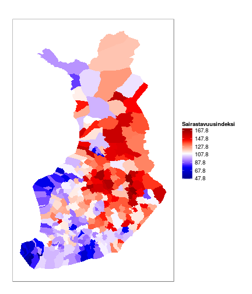

Kuntatiedon visualisointi Suomen kartalla R-kielellä nousi kuluneella viikolla keskusteluun Finnish Open Data Ecosystem-foorumin [Facebook-ketjussa](https://www.facebook.com/groups/fi.okfn/permalink/10153486329250628/).

Tähän on monta tapaa, ja valmiiden välineiden käyttö helpottaa tehtävää. Suomalaisen paikkatiedon visualisointiin suunnatussa [gisfin](https://github.com/rOpenGov/gisfin)-paketissa on valmiit wrapperit kuntatiedon visualisointiin. [Päivitä paketin kehitysversio Githubista](https://github.com/rOpenGov/gisfin/blob/master/vignettes/gisfin_tutorial.md) saadaksesi kaikki toiminnot käyttöön.

Kokosimme tähän blogipostaukseen tiiviit esimerkit. Lisää suomalaisen paikkatiedon R-työkaluista löytyy gisfin-paketin [tutoriaalisivulta](https://github.com/rOpenGov/gisfin/blob/master/vignettes/gisfin_tutorial.md), jossa kuntien lisäksi saatavilla on mm. maakuntarajat, postinumeroalueet, äänestysalueet, aluejakokartat, Helsingin aluekarttoja, väestöruututietoja, spatiaalisia tilastoja ym. 


### Esimerkkidata: THL:n sairastavuusindeksi

Käytämme esimerkkinä kuntatason aineistojen visualisoinnissa
sairastavuusindeksiä, jonka voi ladata [THL:n
sotkanet-palvelusta](http://www.sotkanet.fi/sotkanet/fi/index) R:ään
[sotkanet](https://github.com/rOpenGov/sotkanet)-paketilla.


```r
# List all available indicators from THL Sotkanet
library(sotkanet) 
sotkanet.indicators <- SotkanetIndicators(type = "table")

# Check specific indicators for 'sairastavuusindeksi'
# sotkanet.indicators[grep("sairastavuusindeksi", sotkanet.indicators$indicator.title.fi),]

# This shows that the index 244 is THL sairastavuusindeksi.
# Retrieve THL sairastavuusindeksi 2010 for municipalities
# (newer information is not available???)
healthindex <- GetDataSotkanet(indicators = 244, year = 2010, region.category = "KUNTA")

# Let us rename the value field for clarity
healthindex$Sairastavuusindeksi <- healthindex$primary.value
```


### Kuntarajojen lataus Maanmittauslaitokselta

Lataa kuntarajat R:ään seuraavalla komennolla. Tässä esimerkissä käytämme [valmiiksi esikäsiteltyjä Maanmittauslaitoksen kuntarajoja 2013](https://github.com/avoindata/mml) (Yleiskartta-1000 Hallintoalueet). Muiden MML-aineistojen lataamiseen perehdy funktioon get_mml.


```r
library(gisfin)
map <- get_municipality_map(data.source = "MML")
```

Toinen vaihtoehto olisi ladata kuntarajat [GADM-palvelusta](http://gadm.org/country). GADMin kuntakartta sisältää tällä hetkellä vanhentunutta tietoa, joten sivuutamme sen tässä esimerkissä. GADMin kartoista voi kuitenkin olla apua muiden alueitten visualisoinnissa.


### Tietojen liittäminen kuntakarttaan


Liitä THL:n sairastavuusindeksin tiedot MML:n kuntakarttaan
kuntakoodin nojalla (MML-datassa "kuntakoodi" ja healthindex-datassa
"region.code"):


```r
sp <- sp::merge(map, healthindex, by.x = "kuntakoodi", by.y="region.code")
```


### Visualisointi Maanmittauslaitoksen kuntarajoilla

Nyt datan voi visualisoida Suomen kuntakartalla sp-paketilla:


```r
# Define the 20% quantiles for plotting
quantiles <- quantile(sp$Sairastavuusindeksi, probs = seq(0, 1, .2))

# Discretize the data. This is easier to comprehend than continuous scale.
# And I could not find how to change color scale in spplot for continuous scale -
# suggestions are welcome.
sp$Sairastavuusindeksi2 <- cut(sp$Sairastavuusindeksi, quantiles)

# Define blue-white-red palette 
library(leaflet)
palette <- colorNumeric(c("blue", "white", "red"), domain = range(quantiles), na.color = "black")

# Visualize:
spplot(sp, zcol = "Sairastavuusindeksi2", colorkey = TRUE,
	   main = "THL ikävakioimaton sairastavuusindeksi 2010 (Sotkanet-indeksi 244)",
	   col.regions = palette(quantiles))
```

 


Datan visualisointi Suomen kuntakartalla ggplot2-paketilla:


```r
# Get data frames
df <- sp2df(sp)

# Set map theme
library(ggplot2)
theme_set(get_theme_map())

# Plot regions, add labels using the points data
p <- ggplot(df, aes(x=long, y=lat)) + 
  geom_polygon(aes(fill=Sairastavuusindeksi, group=kuntakoodi)) 

# Add custom color scale
p <- p + scale_fill_gradientn(breaks = seq(from = min(df$Sairastavuusindeksi),
       	 			     to = max(df$Sairastavuusindeksi), by = 20),
	colours = c("darkblue", "blue", "white", "red", "darkred"),
	limits = range(df$Sairastavuusindeksi))

print(p)
```

 


### Nopea visualisointi

Voit vaihtoehtoisesti käyttää aluedatan nopeaan visualisointiin räätälöityä wrapperiä. Tämä tuottaa ggplot2-objektin, jonka visualisointiparametreja voi halutessasi säätää lisää tarpeen mukaan:


```r
p <- region_plot(sp, color = "Sairastavuusindeksi", region = "kuntakoodi")
print(p)
```

 

### Vuorovaikutteinen kuntakartta

Karttojen vuorovaikutteiseen visualisointiin soveltuvat ainakin [rMaps](http://rmaps.github.io/) ja [leaflet](https://rstudio.github.io/leaflet/)-paketit.

Seuraava esimerkki tulostaa leaflet-paketin avulla selaimeen vuorovaikutteisen kuntakartan [Dmitry Poletaevin koodia mukaillen](https://github.com/finKeva/DataKuntakartalle/blob/master/dataKuntakartalle.r):


```r
# Define the region and color variables and title:
region <- "kuntanimi"
color <- "Sairastavuusindeksi"
main <- "THL:n Sairastavuusindeksi"

# Define color palette
palette <- colorNumeric(c("blue", "white", "red"), NULL)

# Define the text for popup box
state_popup <- paste0("<strong>Kunta: </strong>", sp[[region]], 
                        "<br><strong>", main, ": </strong>", 
                        round(sp@data[,c(color)], digits=2))

# Generate interactive visualization
p <- leaflet(data = sp) %>%
       addTiles() %>% 
       addPolygons(fillColor = ~palette(get(color)), 
                fillOpacity = 0.7, 
                color = "#000000", 
                weight = 1,
                popup = state_popup)
p
```

<!--html_preserve--><div id="htmlwidget-1279" style="width:1008px;height:864px;" class="leaflet"></div>
<script type="application/json" data-for="htmlwidget-1279">{"x":{"calls":[{"method":"addTiles","args":["http://{s}.tile.openstreetmap.org/{z}/{x}/{y}.png",null,{"minZoom":0,"maxZoom":18,"maxNativeZoom":null,"tileSize":256,"subdomains":"abc","errorTileUrl":"","tms":false,"continuousWorld":false,"noWrap":false,"zoomOffset":0,"zoomReverse":false,"opacity":1,"zIndex":null,"unloadInvisibleTiles":null,"updateWhenIdle":null,"detectRetina":false,"reuseTiles":false,"attribution":"&copy; <a href=\"http://openstreetmap.org\">OpenStreetMap</a> contributors, <a href=\"http://creativecommons.org/licenses/by-sa/2.0/\">CC-BY-SA</a>"}]},{"method":"addPolygons","args":[[[{"lng":[24.2568862097021,24.3044079550331,24.3590076302191,24.3179760126009,24.2780166793155,24.2720542756886,24.2780851851934,24.2935509419903,24.2968995398074,24.3085970311238,24.2957503323056,24.2895170930267,24.3009365994879,24.2585827399525,24.2319171700009,24.2285909027166,24.226231361283,24.1804475460826,24.1822964419894,24.1657454116363,24.1631616793733,24.1779281708039,24.1447455181767,24.1283026353762,24.1027911133273,24.0939756818135,24.0928525681913,24.0700673746467,24.0411958169677,24.0289401487741,24.0011287914668,23.991964127317,24.0967868037103,24.1348977145925,24.14343322922,24.0989497056674,24.0802912081984,24.0769227907709,24.0734075966452,24.0595185737243,24.0496490606148,24.0436600713941,24.0311359825226,24.0395214514124,24.0121574901762,24.0002348683183,23.9980933880595,23.9971956502305,23.983843950166,23.9747481478697,23.9700602225874,23.931593904387,23.8774560816377,23.8632252510213,23.8470488498805,23.7002355588112,23.6337318176525,23.5714870330206,23.5608506525451,23.5478643995904,23.5337547667225,23.5194711558797,23.4579119573478,23.4933512086691,23.4995799729467,23.5007685820081,23.5771850681101,23.577860506773,23.6426573939751,23.6534815821443,23.6371184651892,23.6459943322069,23.6796558841769,23.6840607255932,23.7033973174737,23.7156383590313,23.7372328968091,23.7243866894209,23.7503870319931,23.8661222851839,23.8856553301091,23.8930581687093,23.9369059053017,24.0702732738638,24.0874855757029,24.1000896850607,24.1268444133883,24.1467779640653,24.1641724025783,24.1707710531291,24.2031796008061,24.2568862097021],"lat":[63.1330174782197,63.1411162250583,63.1164295085049,63.0666404587522,63.0643753501722,63.0482629131039,63.0330586795745,63.0362798135329,63.0346418960427,63.0184845346259,63.0171221522159,62.999055010729,62.988353150784,62.9857454515542,62.9899789035622,62.9986830728973,63.0048542182472,63.0075474890144,63.0132736296642,63.0100505975948,63.0066724241859,62.9876934618546,62.9844872117811,62.982895288307,62.9831695991923,62.9792576470876,62.963552438042,62.9719059934841,62.9735572410013,62.9718582037795,62.8935902890004,62.8609186480654,62.846217778502,62.8464555948941,62.8312174477586,62.8282327097918,62.8096526172209,62.8013192847881,62.7926178744739,62.785994863995,62.7786091830955,62.7741253051169,62.7408631176844,62.7364841954913,62.7300826419487,62.7418334787688,62.7494182735308,62.7574482361729,62.7640275014094,62.7614285761114,62.7531475698751,62.7509258171851,62.7577832704941,62.7603763289808,62.7626058947529,62.8272082459671,62.8795978479027,62.9070538365413,62.9105735104972,62.9148685264171,62.917234742366,62.9196282984304,62.9597642979092,62.9677984028605,62.970758847007,62.9790371910518,62.9999528952715,63.0156098700129,63.0441037250152,63.045127424538,63.067151134087,63.0877600196248,63.0874113550371,63.0984563631065,63.0974180130166,63.1119011874446,63.1105026502364,63.0956625247098,63.0754853640419,63.1128986341903,63.1125387819005,63.1039547338576,63.1103808836305,63.1467840661219,63.1362165055658,63.141073297719,63.1513737677751,63.1533417521193,63.1465755248965,63.1479983417792,63.1548685811188,63.1330174782197]}],[{"lng":[24.3463742785625,24.4952600980673,24.5404094418046,24.5820539134412,24.589512860532,24.5147812117937,24.4625336197377,24.4440102423084,24.4178677702849,24.3962075551606,24.3819117823578,24.3822573120453,24.3835944163167,24.3708048296053,24.3645053499635,24.3461571646055,24.3657963232018,24.3463361872808,24.3395180904394,24.3344413568247,24.3309381001644,24.311732609272,24.2931882767821,24.2892932559958,24.1858490608716,24.1778412310443,24.1687235409481,24.1571756151796,24.1482883603554,24.1370822606848,24.1427498118391,24.1469059805375,24.1669453442855,24.1728395206449,24.1954845193087,24.264655082087,24.1998377240853,24.2308652840158,24.2425162105138,24.2325122033434,24.2628092145485,24.2877053696849,24.3463742785625],"lat":[64.2689207978583,64.218457725892,64.1945828791021,64.1864531895332,64.1850173241579,64.1682125218788,64.1564289325568,64.1522714968805,64.1463847757062,64.1511361644544,64.1473655041602,64.1392432806798,64.1077558547756,64.0860283144964,64.0972589613778,64.0937787794034,64.0765190251315,64.0415162923635,64.0455534184617,64.0485584750513,64.0506316628213,64.0619902177127,64.0729464658892,64.075246291414,64.1361468619169,64.1470275767117,64.1679982915555,64.1749456888775,64.1753988503912,64.1913853521387,64.1955906747671,64.1986736080788,64.1978224987357,64.1953397943576,64.1857950220295,64.2098008594428,64.2495581636589,64.2643625253389,64.2708001591756,64.2782087110597,64.2904562093422,64.3000942254895,64.2689207978583]}],[{"lng":[23.931593904387,23.9441021654773,23.9968352932414,23.9994956846185,23.9610964237796,23.9755050803838,23.9935743260764,23.9668259095237,23.9564789083044,23.9227240942233,23.885913797712,23.8352301715535,23.803823221898,23.8173958021251,23.8074762955912,23.7763909773862,23.7597713967397,23.6637132960755,23.5034073103315,23.5180566960638,23.4750354324104,23.4451660459333,23.4227564163739,23.3901017625701,23.3716868019387,23.3562856983553,23.3377636201868,23.3678031615975,23.3350488182249,23.2983909626621,23.312559893245,23.2648457114014,23.2589780662195,23.246716065188,23.2505313978969,23.2549433901526,23.2607537922751,23.2712980550225,23.3077949114305,23.294324827917,23.2829746586923,23.2732230495646,23.2747205157041,23.2755745200715,23.2625339345223,23.2333449368646,23.2126121955416,23.1762120535386,23.1762052427375,23.1762013755796,23.1961303473211,23.1901366541978,23.1612262255938,23.2027300090755,23.2712552074766,23.3518394694847,23.3559167809968,23.3722971848314,23.3867086825115,23.3936638784506,23.3914297568965,23.3905105296798,23.4490505983826,23.4574748958012,23.4644941846942,23.4827324425413,23.5088535860728,23.5359218617127,23.5481297510591,23.5676986341185,23.5717935121415,23.5674907695981,23.5833316275272,23.6317647279013,23.6499216274365,23.6656251383136,23.6847888763184,23.6585551571218,23.6674625334748,23.7018023273758,23.7496001121542,23.7603756477544,23.76871927061,23.8470488498805,23.8632252510213,23.8774560816377,23.931593904387],"lat":[62.7509258171851,62.7310896239407,62.678295903805,62.6588588469471,62.6351853923307,62.6103190336417,62.57907261811,62.5554103591574,62.5347383868673,62.5271678637579,62.5291871783658,62.4943363086269,62.477967717365,62.4668150882742,62.4629371671106,62.4593144926693,62.4556900484535,62.4086380225758,62.414640190402,62.3680519711327,62.3826921774787,62.3753810683548,62.3783190751123,62.3892000851463,62.4048044439339,62.4121687765832,62.4250834207807,62.4332481930877,62.4616625650851,62.4933889022502,62.4971872617127,62.519723092568,62.525443128254,62.5373886259076,62.54151840728,62.5462924962728,62.5525772625658,62.5639751078965,62.5748011942126,62.5836167238773,62.582082099473,62.5799886984677,62.591662042769,62.5983157682786,62.6146656868154,62.6098987231128,62.6064664145366,62.6250699050794,62.6344051608164,62.639640557184,62.6444400776715,62.65064601367,62.6554530365302,62.724100352927,62.7357359255813,62.7079606771928,62.6990547924791,62.6905001976455,62.7014626796856,62.6986747087232,62.6861812723282,62.6810380603502,62.6510107569771,62.6547833939386,62.6576196364467,62.6655873909446,62.6643795233609,62.6559984066203,62.651178050544,62.652901491278,62.6565953006703,62.664340454468,62.6678176363179,62.7063244575515,62.7113011350231,62.7156548147927,62.733620459703,62.7426035422807,62.7517575703994,62.732690222284,62.7461493118989,62.7385054052268,62.7418681891874,62.7626058947529,62.7603763289808,62.7577832704941,62.7509258171851]}],[{"lng":[25.8074651435443,25.8011015363334,25.8049146021979,25.8493767224931,25.8740749271676,25.8933423440136,25.881045688376,25.9273280401764,25.8820655634074,25.8940078382103,25.9032226125848,25.9197746578939,25.8723723383198,25.8580563295753,25.783526220822,25.7755948636366,25.7622804676378,25.7483688537835,25.7286743469638,25.6778917322888,25.6271696525501,25.5825584830139,25.562502020623,25.5374838570823,25.4768101053678,25.4682112751454,25.4089180799643,25.3542240629779,25.3353278400742,25.3274332779069,25.279193243259,25.2631130909462,25.2558390229863,25.239935248256,25.2461969777178,25.2364417609506,25.2421515093191,25.2536976110979,25.2580338334205,25.2546679799763,25.2543680757219,25.2498289006718,25.259867424273,25.2531612735379,25.2460300425933,25.2330676718009,25.2234792131625,25.1997537011144,25.2028237445981,25.2273944202368,25.2558930114058,25.2705008346821,25.3478853522343,25.3533317262499,25.3598217672895,25.3949181672778,25.4156791809768,25.456615150216,25.5171936619126,25.5451586074309,25.6013412502229,25.6321814385923,25.7057181500923,25.7417885217629,25.8074651435443],"lat":[61.3133996695141,61.2720821999994,61.2690616554201,61.2699761531645,61.2656321920349,61.2519934257968,61.2384500072202,61.2280078292569,61.1855288874862,61.1797057075938,61.1640278545168,61.1519341442724,61.1194055816447,61.1026663873319,61.0962905483868,61.1072225546106,61.1056077598866,61.1039632543104,61.101582628624,61.1024648638711,61.1140233652029,61.1145080679613,61.1147211809581,61.1507073332905,61.1228027478928,61.1253393969659,61.1068123193495,61.1148026663641,61.1110564445831,61.1127902262936,61.0981973826963,61.1071445871579,61.1184272351052,61.1145517599098,61.1312506757266,61.1399124887964,61.1462515187409,61.1488549107118,61.1597836302549,61.166582922939,61.167188604101,61.1763528733266,61.1858893996929,61.1907511101598,61.1959189627684,61.2053071756898,61.2122473435981,61.2221238730404,61.240938462686,61.2478985912685,61.2515898555891,61.2463425244728,61.24910385112,61.2555489934211,61.2632254910497,61.2758502202626,61.3122906786491,61.318571606272,61.3041100552133,61.3291758676051,61.3430773801797,61.3386890200787,61.3414643464725,61.3646275178593,61.3133996695141]}],[{"lng":[25.591209540874,25.5962572465732,25.6439659758587,25.6596465432923,25.7001718616384,25.7083754996816,25.7690197940293,25.8064906811283,25.8232270824906,25.7575514653845,25.7638291015644,25.7681514991899,25.7603513421416,25.7541922749285,25.7323269286684,25.7367652049745,25.7217776416998,25.7064771334807,25.6863707113322,25.6605477036244,25.6526050027031,25.6072129852732,25.5876945750733,25.5829362052745,25.5554797024912,25.5574226288563,25.5385305396847,25.5300883422783,25.4626101170226,25.4314760849088,25.4335102509524,25.423673215001,25.4142722308134,25.4154923950967,25.5019099863808,25.5162277908661,25.5272827313672,25.514615405088,25.5374251035596,25.5413019070311,25.5548363260086,25.5575180715736,25.5814340747232,25.5756445811289,25.5928799688132,25.591209540874],"lat":[60.608454839137,60.6067685592796,60.6046093426772,60.6138752301329,60.6014378357494,60.6022273627009,60.5888369558618,60.5664857708617,60.5509975084214,60.541982462181,60.5331489512674,60.5270637276631,60.5166920155692,60.518258392466,60.503169794973,60.4993036588959,60.4809917659069,60.4815830739954,60.4823574105677,60.4939509893872,60.50172504968,60.4699109090205,60.499268942657,60.4936649991728,60.4912690899594,60.4885399414233,60.4856833049266,60.489060075131,60.4829469241056,60.4829409174376,60.500926363414,60.5155158139106,60.5294454333136,60.5415441759011,60.5569584368078,60.5798599015621,60.5848123708892,60.5934740660347,60.597948365888,60.6056824963328,60.6074559853909,60.5985544902235,60.6091052583172,60.6138065068821,60.6141335242425,60.608454839137]}],[{"lng":[22.4452772704216,22.4563547771796,22.4759021294215,22.5425809480137,22.5938318382557,22.6228050713216,22.6875950559032,22.6821171585478,22.6672691250968,22.6241139184436,22.607662331584,22.5759936901467,22.5497269200399,22.5813869121344,22.5787035949284,22.5703665087667,22.5655705866722,22.5248954141735,22.4872454322673,22.4754914732541,22.4888468045876,22.5019742884222,22.5106032843322,22.4457115764567,22.4538299642201,22.4512440656822,22.4150035863628,22.4452772704216],"lat":[60.7169935858881,60.7095761410145,60.6979655777705,60.6582740912215,60.6657105554539,60.6626331613607,60.6520470578124,60.6395597356494,60.6305121998531,60.6041782437827,60.6097203456998,60.6087827485815,60.5896816801642,60.5792293445302,60.5679688464099,60.5666405371908,60.565876140803,60.5836596917232,60.570968097852,60.5997678537625,60.6265209969815,60.6294633370492,60.6353476177515,60.6409071939031,60.6550005305828,60.6900465167456,60.7372936015725,60.7169935858881]}],[{"lng":[23.7463993154931,23.7537364747617,23.7626343877536,23.7887295701667,23.8114476029442,23.7984926015677,23.7976524682838,23.8114161904051,23.8829375389428,23.9053868374863,23.9230885061261,23.9381532465415,23.9590140916153,23.9585958073854,23.945026111948,23.942628723516,23.9311108385949,23.9418380424569,23.9210860184005,23.9261104410128,23.943168914876,23.9524052943321,23.9582838978277,23.9077781247267,23.8449863014801,23.8253595393743,23.8045341677903,23.7567567049079,23.7306222918754,23.7219449396141,23.7125391340397,23.704397418125,23.6678752429967,23.6569024855415,23.6358042393598,23.6503195389033,23.5882311424276,23.5728013596211,23.5712394612181,23.5463456883043,23.5492682720419,23.5228959773897,23.5173427177329,23.4932000999176,23.5123417943117,23.5394015315587,23.5345684451131,23.5421163317937,23.5692047777029,23.6900769692238,23.6892822897895,23.667009722893,23.7371325596771,23.7463993154931],"lat":[61.2563007367468,61.2480224445589,61.2433001788468,61.2327563348799,61.2307117428591,61.2268447058919,61.2169835250159,61.2124407703083,61.201966733462,61.2068175140172,61.2029728847141,61.1850119913186,61.1841414339093,61.1729883822374,61.1647855535754,61.1555914005757,61.1447105422769,61.141883372463,61.1308843087706,61.1275798874899,61.1102734630242,61.1046678820495,61.1019294551574,61.0872146122194,61.0744332606809,61.082384655928,61.079360500767,61.0573551480456,61.0698297641217,61.0739683579698,61.0742537721289,61.0697699793436,61.0757760423893,61.1009460068178,61.1075727726624,61.1199804646823,61.1301491665725,61.1262252997989,61.1189612083882,61.1261717096068,61.1320982810667,61.1412176232274,61.1526777562118,61.1632617985333,61.1783826157557,61.1895847774291,61.2013477293504,61.2053015504053,61.1995966740441,61.2146144756304,61.2219827921707,61.2305711074502,61.25897917943,61.2563007367468]}],[{"lng":[20.73000626286,20.9699293701496,21.0616666855516,21.143777140946,21.1513411015127,21.128667869283,21.1121866003229,21.1172834255437,21.1134794413733,21.0909952059802,21.095615473412,21.084523847327,21.0514632133556,21.0238299628332,20.9021677971578,20.897718335975,20.9153270289259,20.9150216292206,20.9467332318431,20.9448819318455,20.9863418925908,20.9522695185718,20.9176603990116,20.8830541384036,20.856908797027,20.8127180829748,20.7926429986976,20.7443961524918,20.6299092099051,20.5097771253597,20.4730910988253,20.4693092935463,20.2017917045147,20.3775305591615,20.73000626286],"lat":[60.7231042562776,60.7129001898062,60.6388601750714,60.5474454741923,60.4986621653856,60.4588946310488,60.3839653991915,60.367287803298,60.3293872773596,60.2652203788887,60.2525173584229,60.2018863298527,60.195548711487,60.1239329347413,60.1653480502666,60.2689558916136,60.2762190977156,60.2983392824648,60.2998721796257,60.3139081442838,60.3495738233763,60.3869973847344,60.3979908709129,60.394064897489,60.3910922215035,60.3945596317703,60.4319731808839,60.4573873382144,60.4732735435481,60.4579871114443,60.4789387131578,60.6521755116032,60.8025709166904,60.8766383903534,60.7231042562776]}],[{"lng":[19.3954702190564,19.5549695554802,19.6157688414036,19.6459416152193,19.6535609349044,19.620045046647,19.637969834256,19.6334483495042,19.6258640225929,19.6193509974484,19.6348192042628,19.6450848407941,19.6576631456341,19.6523957823643,19.6488270992967,19.6542669824319,19.6782936535611,19.6733917020358,19.6779465695996,19.6803651693752,19.6828963969904,19.6767988316513,19.6747729850422,19.6644433382577,19.6670545626972,19.6549848030329,19.5931960505072,19.5955916582959,19.32524356894,19.2443186231137,19.4847691290132,19.4694833844825,19.4136690827478,19.4599429352131,19.3325439008554,19.1611665523704,19.2201999132695,19.3954702190564],"lat":[60.4317283575981,60.392810089624,60.3920180298027,60.3752583944201,60.3578874697895,60.3291707062471,60.3203340487543,60.3023353860863,60.2956811839431,60.289964476108,60.2735581825387,60.2739900865514,60.2617033362936,60.2485392450646,60.2396148749869,60.2349915814622,60.2285411355501,60.223812718198,60.2109950963,60.2041844548202,60.1970532598103,60.1929243691557,60.1880132565557,60.1629505394469,60.1509607238736,60.1428252188621,60.1353976211997,60.1172001322218,60.0248779278411,60.0808986662469,60.1656642204249,60.2041713669198,60.2116244715938,60.2630793416976,60.3052059810932,60.3749195633729,60.6115137447973,60.4317283575981]}],[{"lng":[28.7917315563429,28.8220250077021,28.849762598344,28.869862990761,28.8830503469197,28.9181952708965,28.9128359427867,28.898518385968,28.8964228422305,28.9106880622646,28.911619209953,28.9456151712534,28.9565390254948,28.969773044369,28.9912883163826,28.9910531945999,29.0197256468313,29.0247683364353,29.0237887514363,29.0138960158844,29.079213365426,29.0955399297324,29.0875802444984,29.0869384544732,29.0737693605105,29.0755503398011,29.0912431093886,29.090316993423,29.1095822389747,29.1258484769848,29.1177099822205,29.1151798038782,29.1324198738816,29.1144867177832,29.0876738734246,29.0793869261847,29.087637065782,29.0888089815264,29.0986696374654,29.0992503705272,29.0913559330421,29.0877760383672,29.1025267980842,29.0823988577631,29.0756011353408,29.037441517282,29.0232834763854,29.0029539015001,28.9899746339355,28.9972225986214,28.9787092269649,28.9605889597128,28.9672053106741,28.9562003355938,28.9475874650219,28.9399243796096,28.9259797341048,28.9287337665418,28.9313382552497,28.9225720799823,28.9157003002127,28.8925083706796,28.878703954465,28.8643222237921,28.8711778347322,28.8710245058641,28.831102911874,28.8094866167871,28.7889959555487,28.7834853086356,28.7856194792271,28.7540183323099,28.7263104545345,28.7541291840426,28.7820484613375,28.823597279553,28.8313915415754,28.8369269595499,28.779639130111,28.7670715145925,28.7792901208201,28.7636482432261,28.7497986923166,28.7204144335342,28.6906580776429,28.6850799738419,28.6447021289175,28.6421047355323,28.6424468939111,28.6490628230049,28.6667675073584,28.6572499083375,28.6628381127105,28.6707980668747,28.6742164892814,28.6745266609855,28.673061245934,28.6745299245522,28.6649445075723,28.6696244041261,28.6854764007409,28.6974300256294,28.7179218829582,28.7319000605756,28.7662555916777,28.7772573260972,28.7992888068634,28.8036009464667,28.7897284851978,28.7884985319012,28.7904624213183,28.7937066875338,28.7879298256819,28.7773655193313,28.7641982410492,28.7605766769168,28.7637887856606,28.7640400333999,28.7658580440308,28.7917315563429],"lat":[62.2708546583702,62.2602651387833,62.249745205753,62.2459690295571,62.2495244254698,62.2502269715305,62.22516860792,62.228168754681,62.2195488804379,62.212224728193,62.2027506539916,62.2011650565771,62.2066002120408,62.2008155230585,62.1979723608997,62.1885520840756,62.1829274838528,62.1785152807265,62.1766166651015,62.1574287141741,62.1365487693441,62.1264007336395,62.11763950271,62.116932839324,62.1024245768374,62.0992900419344,62.0976045377932,62.0999579295197,62.1020422775884,62.0975909202357,62.0756913606914,62.0688762830113,62.0641075586298,62.0556988035048,62.061586906208,62.0607707795814,62.0530010475502,62.0518970140007,62.0426039864963,62.0388859599973,62.0389244077028,62.0335800253463,62.0254275408947,62.0068598505335,62.0139905138598,62.0240263656344,62.0206274741208,62.0263971083019,62.0131826703789,62.0109798795752,62.0009935307305,62.0080401596,62.0114406424653,62.0158731139883,62.0152796437691,62.0147511470464,62.0137882925481,62.0081772955655,62.0028690582035,61.9990882951877,61.9961235145402,61.9999299277567,62.0021933036472,62.0092142930409,62.0132626465261,62.0223846490308,62.031801816074,62.0296928560727,62.019749067213,62.0225178142538,62.0322462552199,62.0353369895026,62.0539810539064,62.0517570687399,62.0630421569418,62.0543111375728,62.05631795757,62.0659193509432,62.0835230256083,62.0925260106579,62.1012103133258,62.1191655530927,62.1265891154002,62.1334898564747,62.1198768909138,62.1248252630316,62.1390043346388,62.1423152167911,62.1479010778681,62.1554265622465,62.1665942888031,62.1712786410714,62.1771880544244,62.1815703271829,62.1875627665121,62.1910036988769,62.1988611960061,62.2064124027273,62.2154817611345,62.2238546106648,62.2200358205909,62.217154325802,62.2201089680202,62.2143102308193,62.2004714084001,62.1970059939969,62.2063181031024,62.2141982986682,62.2222682055518,62.2290605869032,62.2367030421968,62.2462380712308,62.2496889275237,62.2559969532131,62.2584259156918,62.2623564775189,62.269765939842,62.2703453382245,62.2745371468238,62.2708546583702]}],[{"lng":[21.9836082860438,22.1757623999527,22.1918679956363,22.3241749154016,22.3407806475368,22.3543610268939,22.3724787006862,22.3745219025547,22.4143016408196,22.496638083831,22.5160909329578,22.5241715088151,22.5353893237119,22.6044228270006,22.8008240458593,22.8544378333733,22.8668149523336,22.8802822445876,22.8808254792728,23.0459520472862,23.1675822912037,23.4406356472897,23.6735202061482,23.7310635024016,23.7753913885378,23.8714607673088,23.9833301495654,24.0755915911748,24.1585505262832,24.1529623182252,24.2080495142949,24.250964790159,24.3022600170302,24.6083879140392,24.7834245917068,24.8571661331573,24.9031657743193,25.0271957390328,24.6985771281188,24.445601248589,24.1571240199235,24.1068071241776,23.9628696027303,23.9559436683911,23.959054280509,23.9676010994228,23.9744387353118,23.9733670665836,23.972647982509,23.9645285396901,23.9565989623289,23.7884320721218,23.7393497900854,23.3233792818915,23.2866982277473,23.2854039420653,23.2766969683584,23.2677402010675,23.2567251840936,23.243426926414,23.2187421831106,23.2053425703079,23.1878402187172,23.1689936595993,23.1581478441966,23.1504455411329,23.1403862443173,23.1388161192102,23.1398598219899,23.1412800865085,23.141681003561,23.14038011076,23.1403195083861,23.1449518031431,23.1539515589558,23.1607197483761,23.1504659255331,23.1405237418728,23.140541675445,23.1435335181934,23.1406267600764,23.1480947396079,23.1505566775005,23.1487053801748,23.1427692673245,23.1297196660155,23.1120611461851,23.1000184587973,23.0861752553683,23.0758855111435,23.0707188068424,23.0612715292058,23.0632863369369,23.0658276896429,23.0658242792425,23.0553192913389,23.0486800363398,23.0363309570284,23.0019882625561,22.9862752641857,22.9767152284194,22.9705716622294,22.9342500844235,22.9152053358389,22.907761251075,22.8989934905855,22.8928342719855,22.8878326539398,22.8678224669254,22.853946942491,22.8343055932424,22.8331362201287,22.8364423839693,22.8381820479118,22.8393452952905,22.8438347025099,22.8363597694765,22.8243393389618,22.8095032913168,22.7974769487791,22.7773502636594,22.7617953883062,22.7325898728188,22.7229822422006,22.7124195094557,22.6981262767282,22.6845617351548,22.687620758204,22.6904872947154,22.6837187247286,22.6784763635504,22.6711384000159,22.6446754704852,22.6380243275869,22.6420126619862,22.6371670171637,22.6212598553791,22.6178219621203,22.6155109255706,22.5993607917571,22.5823461150804,22.5721096306089,22.5634350224253,22.5533647711544,22.53475108428,22.5014158993639,22.4695223515951,22.4668834457982,22.4640500557316,22.4537441644519,22.4326918222344,22.4212478819333,22.4134006150226,22.4011253055333,22.3905892551347,22.3835241721291,22.3708678121672,22.3634926738452,22.3575267069826,22.3404266495233,22.3408874866746,22.3417344977704,22.3424437016153,22.3487517009589,22.3405898067863,22.3503843153251,22.3484826954995,22.334900201731,22.325250343365,22.306033262903,22.2955136511396,22.2888855610643,22.2796528939754,22.2675770743233,22.2510048328352,22.2187251897707,22.2099710753989,22.2002503054625,22.1911583549971,22.1661782394533,22.164274113524,22.1553400838833,22.1511203579489,22.1410230742552,22.1272191396704,22.1202918031505,22.1128213965152,22.102639495955,22.0910595593371,22.0723213028873,22.0595238973986,22.0419055647713,22.0303982741615,22.0187412847964,22.0096995812755,21.9946703901484,21.9957623304475,22.0047716519092,21.9948100056878,21.9904797175088,21.9824437662568,21.9680933792963,21.9514999168471,21.9369399858295,21.929463950754,21.9165056710246,21.904009232218,21.8889702279485,21.8815428358073,21.8639990417996,21.8600412778952,21.8457039281629,21.838338400283,21.828285915433,21.8187870316698,21.801110568697,21.796119963355,21.7751067011872,21.7594738001756,21.7203604273616,21.7090727391127,21.6993600977521,21.6999165650631,21.6973731756825,21.701865926952,21.7107930957995,21.7103945145638,21.7088210306301,21.7060578911642,21.6985338450114,21.6910304322304,21.6795531196416,21.6718247060088,21.6620736641853,21.6615248827328,21.6516386652173,21.6469001516347,21.638776576851,21.626576582391,21.6141923382948,21.5866148355258,21.5695975890788,21.5662864929445,21.5582021474164,21.5439259444053,21.524444910189,21.5174474005796,21.4998772942374,21.4853635241765,21.4762695253932,21.4628677708145,21.4189446430302,21.419081408474,21.4192619873544,21.4125813031027,21.4190937299431,21.4153563490081,21.4084018603109,21.4130703306811,21.40370000702,21.4055689047529,21.4110883125607,21.4049631508254,21.4015919896531,21.386894844929,21.3633153644764,21.3553369300702,21.345780983465,21.341329617766,21.3303825962271,21.3121705061279,21.2977072442822,21.2948157302496,21.2742915889093,21.2649245473357,21.2608824284488,21.2589343943751,21.2526239502784,21.2352946553503,21.2130688301522,21.207553772543,21.2015338289628,21.1862815623929,21.1829954022752,21.179274738659,21.1698544874101,21.1590245825728,21.1452668967646,21.1426873329398,21.1356557811266,21.1270902884895,21.1122242455783,21.0937248292744,21.076270035269,21.0760711945812,21.0758416896236,21.0754507143677,21.0610564938593,21.0493224643688,21.0332023780729,21.0303166242923,21.013062818644,20.9976673710427,20.9900669676097,20.9875070771005,20.9792488797181,20.9695126014072,20.9582665732057,20.9583127795536,20.9427568126497,20.9310793265462,20.915975291024,20.90140356514,20.8782239428589,20.8956511315659,20.9030983277621,20.8989272038233,20.8885115934629,20.878289091279,20.85238122961,20.847266782275,20.8434948542798,20.8531791323949,20.8659707255274,20.8923543143706,20.9119056429867,20.9116669591551,20.8821981960433,20.8479732322671,20.8332558637941,20.815492875132,20.8107344621519,20.8054700719069,20.7763114635275,20.742976427841,20.7289178679993,20.6886761580359,20.627570738525,20.6086907970801,20.5965895748579,20.5873557613947,20.5762512036827,20.5523277806187,20.7173223194648,21.0575439058672,21.1086751265347,21.0556253707186,21.0467334943543,20.9875749464321,21.0033131790234,21.0961697873756,21.2788207754022,21.6270863320058,21.7233415276509,21.8463995735979,21.9836082860438],"lat":[69.072893226197,68.9563243054154,68.9187736821899,68.8374783633226,68.8272248973819,68.7828665248234,68.723394583912,68.7166665629932,68.7235728765964,68.7378245500691,68.741183187519,68.7425773912626,68.744511962343,68.7266482345942,68.6875480186931,68.6879710877195,68.6880663372287,68.6881689450127,68.6881730611738,68.6893433168844,68.6285189304728,68.6921634959455,68.7055213703278,68.7507514077492,68.8188511220066,68.8365191845573,68.8271431868864,68.7799668310747,68.7897093854598,68.7535910405558,68.7453076359644,68.727132069208,68.7173502276884,68.681901598797,68.6362346143306,68.5622098138937,68.5545918316629,68.3952887494621,68.3822024644904,68.3205990622779,68.14694414532,68.1389407883922,68.1159329947586,68.1281398530224,68.1300391467839,68.1352558078849,68.1394272398062,68.1443206916304,68.1476029510749,68.1491314129824,68.150623551643,68.1572186209836,68.1872950011983,68.1745772103765,68.1542730091877,68.1548063687212,68.1579659531489,68.156902645049,68.1540667738814,68.1485911491688,68.1481413521782,68.1433386565665,68.1386890815148,68.1336782589559,68.1349336338753,68.1382475424837,68.1535552599436,68.1559426582458,68.1583513362631,68.1616282583678,68.1682985763965,68.1760303693784,68.1823823944372,68.1860761030144,68.1932486174737,68.1986394041045,68.201520328421,68.2043123908496,68.2068837577166,68.2130018348326,68.2190902022836,68.2272819936393,68.2336419887686,68.2367788853094,68.2468311407123,68.2489703452128,68.2518628078333,68.2586707819244,68.2630447706795,68.2674854548029,68.2755303607179,68.2792443017821,68.2837720801706,68.2916439458261,68.3003897535441,68.3079142088284,68.307749763554,68.3074431851448,68.3163185570012,68.3203746625778,68.3246982197313,68.3327252749956,68.3337206994539,68.3342394380454,68.3391461251155,68.3449221249356,68.3489776267103,68.3502599233382,68.3553870971772,68.3603936379821,68.3660927891933,68.3704384501549,68.3745470347805,68.3767083119678,68.3781532398558,68.383727988646,68.3854045410525,68.3880993745347,68.3897769483028,68.3941161291536,68.3903168066507,68.385396751149,68.3857045810413,68.3920831819994,68.3978891039612,68.3988182810132,68.4007856144608,68.4036038443301,68.4062440637677,68.4091934182211,68.4114770171457,68.4127612696962,68.4173887763774,68.4226344586549,68.430504071874,68.4351026051994,68.4348131953377,68.4307870924277,68.4280798165264,68.4260500394872,68.4239095314002,68.4226207189433,68.4282979947949,68.4348844954896,68.4346506244958,68.4429472481786,68.441970742595,68.4418896695643,68.4437423952938,68.4504783175963,68.4612723593752,68.4633234302289,68.4663271094246,68.464347420476,68.461445440243,68.4590219829543,68.4526755217285,68.4493935501994,68.4467377398694,68.4453996732347,68.4487975227869,68.45504037062,68.4602651820157,68.4642502694721,68.4696520120138,68.4756658967148,68.4819173531449,68.4821429865592,68.4815859398927,68.483435478619,68.4844468698647,68.482185408723,68.4790340992816,68.4787486612712,68.4829194751241,68.4734193199502,68.4771096906539,68.4805763513878,68.4807296137176,68.4744219123403,68.4739408084521,68.4716829399767,68.470616182135,68.4712025640679,68.4720031662643,68.4805989615314,68.4825204542306,68.4799706754979,68.4824465605591,68.4825715046196,68.479378888186,68.4801891467112,68.4862868174428,68.4946117619691,68.5005551926338,68.5222702960546,68.5235168704455,68.5337966189731,68.5343153620628,68.534540665119,68.5384991744087,68.5509852858527,68.5549917446123,68.5595085896716,68.5667162958858,68.570912586468,68.5770419293279,68.5844126448415,68.5854925184065,68.5850003398706,68.588821553879,68.5906970680041,68.5917654444277,68.5909259531553,68.589919598507,68.5890355094882,68.5866280689696,68.5855250800293,68.5877224231855,68.5902341985362,68.5949485589748,68.5968955341509,68.6036725622544,68.6113633877281,68.6149997908825,68.6177512245514,68.6192894057302,68.6253594916956,68.6272988000736,68.6316807918667,68.6333593610753,68.636952320835,68.6389544666515,68.6414795774785,68.6443679065946,68.648222597355,68.6512265831431,68.6520319422738,68.6550980267531,68.6650556333589,68.6680390827594,68.6712374048665,68.6736431140898,68.6763222348463,68.6766563265849,68.6771102567984,68.6772727531477,68.6769113193223,68.6804345368964,68.6822241141671,68.683812681008,68.6963951444283,68.7006495020043,68.7062657907983,68.7102143860337,68.7164028995892,68.7206893718951,68.7256282078176,68.7317557712443,68.7375255999467,68.7404405344305,68.7490447644718,68.7525430815738,68.7576343441224,68.7653739346939,68.7676322347372,68.7665371767399,68.7646110387047,68.763713505628,68.7602190763912,68.7597197381412,68.7629197306042,68.7646864398523,68.7788422073127,68.7825826262754,68.7877433003729,68.7939556751555,68.8027219286726,68.8134419953067,68.8178193847302,68.8189048556802,68.8213548285996,68.8249891423132,68.8288947360103,68.8304071250162,68.8342350055492,68.8369051559721,68.8402952221956,68.8447942991758,68.8489479267823,68.8540486167475,68.8583951376385,68.861586671645,68.8655254409384,68.8670849964598,68.868884742575,68.8719499289769,68.8765305087786,68.8808917041843,68.8826935037895,68.8864256508296,68.891230256519,68.8966650611844,68.8979199127114,68.8941294350731,68.8917753386425,68.8926205970462,68.8925590301745,68.8969585040436,68.896629791787,68.8984681665397,68.896739963001,68.8910803459627,68.8942288394194,68.8984683812573,68.8997211901896,68.9030197435565,68.9111999926249,68.9191456109298,68.9234471525377,68.9302150246551,68.9363987659312,68.9399066996955,68.9435486538699,68.9416662707475,68.957222006514,68.968742410268,68.9836656910909,68.9917930986717,68.9967375918151,69.0144916905704,69.0190221073836,69.0210141540428,69.0322011337317,69.0363361148215,69.038077556735,69.0430543710674,69.0458506458175,69.0496694112747,69.0515211512076,69.0535522913972,69.0528971005507,69.0600763101773,69.1197904898062,69.0362896640738,69.1039291230432,69.1220852979924,69.1395210781176,69.1919261755402,69.2223366859656,69.2609109439331,69.3118840196589,69.276588302742,69.2144896332631,69.1441590216762,69.072893226197]}],[{"lng":[24.6839638892094,24.7022662444557,24.7492831926549,24.7462366603859,24.7609279468026,24.7718020646676,24.7649408517153,24.7847541107896,24.831403063881,24.8419134072208,24.8480623680034,24.8462108745817,24.8427967369185,24.8444119765324,24.8356714075772,24.7828046618026,24.942298979175,24.8316636263697,24.745413961302,24.6818504846395,24.6446551310363,24.6547473775739,24.6267714047348,24.6048167958136,24.5877831425355,24.5722923611128,24.5690530161013,24.5362139542729,24.5247472446747,24.5032007414478,24.5254062308544,24.525023600571,24.5043355813811,24.5044490080856,24.5155688229773,24.5120379960196,24.5001693512701,24.5626717833248,24.5956538767291,24.6140892993065,24.6276939179574,24.6647053926178,24.6839638892094],"lat":[60.3579985636064,60.3534599579601,60.341783294058,60.3222742525193,60.3253762539261,60.2992314496057,60.2712372338234,60.2415049761478,60.254055152162,60.2212003546608,60.2185996917304,60.2105722879151,60.1957599273587,60.165584063774,60.1304136187621,60.0999599450663,59.9224892219825,59.90108720504,60.0080213613756,60.0517374268935,60.0921362712993,60.1061687501708,60.1492801284933,60.1583055886681,60.1653020988486,60.1726192024667,60.1793023855387,60.1964641630866,60.20534861221,60.2128629099259,60.231022032433,60.2465819600309,60.2554302477078,60.2740861808237,60.2812915190106,60.2917342501734,60.3262888030817,60.3140848729906,60.3241854645629,60.34436621072,60.3592414099347,60.362770169602,60.3579985636064]},{"lng":[24.6774724358517,24.6752874925398,24.7018204951073,24.7221760968996,24.739161989055,24.7509136304542,24.744871334863,24.7343200987587,24.7158957810737,24.7062639584778,24.6774724358517],"lat":[60.2153968810777,60.2110313866718,60.2062417686481,60.2025627007613,60.2071095795609,60.2182105790554,60.2203816344378,60.2241714387815,60.2247211954883,60.2250075701538,60.2153968810777]}],[{"lng":[21.927062805847,21.9386906459392,21.9433536095443,21.9563058231693,21.9647100338553,21.9814025448135,22.0107172731199,22.021194699023,22.0419868124437,22.0735554111476,22.0775464479083,22.1299394671759,22.1634302196901,22.1762048527534,22.1648666849571,22.1419035820014,22.1520655865746,22.153689412885,22.2207336766527,22.2292764543994,22.2143575137324,22.2361332487175,22.209649979728,22.2530335965456,22.2307554807575,22.2636319089183,22.2412840698334,22.1887585901232,22.170981558003,22.1603136342459,22.1284673373263,22.0117770232484,22.0081454327262,21.9998149345205,21.9852143233758,21.9967571382982,21.9441714338256,21.9513651805947,21.926154025865,21.9029691605989,21.8896885860227,21.8770446125791,21.8441098745044,21.8756929176399,21.9202547640622,21.9356338588848,21.9537939624078,21.9617946152383,21.9724782439971,21.9817440027029,21.9909527110547,22.0112666372041,22.0215803052147,22.0707153520245,22.0495288826384,22.0268545230772,21.9904501808103,21.9042211426178,21.8917686808942,21.8674785085948,21.896414189992,21.921477099481,21.9459502141261,21.9426995430661,21.8942111640947,21.8780010011833,21.8886030640126,21.9102014963124,21.8762357925691,21.8896806243805,21.927062805847],"lat":[61.3007951836832,61.2993843642648,61.2988182835873,61.2972449395481,61.2962233039688,61.2941923709022,61.2924788060426,61.2944403722123,61.2714652254968,61.2700351079097,61.2743217449173,61.2651153177198,61.2591777380534,61.2519406212038,61.223241223951,61.2112128206957,61.2080682403807,61.2004750726514,61.1668647738023,61.1363607918575,61.1241878400446,61.1085523786657,61.0974443436175,60.9675297615579,60.948216142052,60.9268634883312,60.9238185495828,60.9010252557864,60.877173812806,60.8720057379113,60.9042053776038,60.9009493414862,60.8974392151725,60.8987339893156,60.9010017916134,60.9125494781539,60.9465190314367,60.9769360963339,60.9761535746169,60.986159787463,60.9813647941081,60.9827749689753,61.009402291174,61.0151702505611,61.0154381591637,61.0183895211113,61.0178470897074,61.0176073313036,61.0172864237033,61.0191076904334,61.0313608941229,61.0306759673624,61.030327034887,61.0424207756485,61.0802924274932,61.0891617335016,61.0855657719839,61.1162374136011,61.130892956273,61.1456632495634,61.163923975757,61.1652778373757,61.1725455657054,61.1917829595037,61.2258912484132,61.237273219845,61.2640107297573,61.2833169331799,61.2967044737191,61.3087891208422,61.3007951836832]}],[{"lng":[21.4666405720633,21.5027921418548,21.6302964457699,21.6950121286332,21.7030551266052,21.7419116067864,21.774262704906,21.7807835207011,21.8762357925691,21.9102014963124,21.8886030640126,21.8780010011833,21.8942111640947,21.9426995430661,21.9459502141261,21.921477099481,21.896414189992,21.8674785085948,21.8292524087634,21.8116291990643,21.765304950377,21.7478087559242,21.7342868172954,21.7034489484095,21.6469795116476,21.6201900224672,21.5948524168462,21.5793466966055,21.5671413041333,21.5576071154738,21.5046908519743,21.4860200137338,21.4253677721808,21.4114576669315,21.3688212539349,20.8120723933253,20.829616890153,21.4666405720633],"lat":[61.3130387456236,61.3199425280769,61.2965986934495,61.2888399475743,61.2930245310294,61.3008177754712,61.3380750766214,61.3378170043026,61.2967044737191,61.2833169331799,61.2640107297573,61.237273219845,61.2258912484132,61.1917829595037,61.1725455657054,61.1652778373757,61.163923975757,61.1456632495634,61.1624311570878,61.1503208979036,61.1479978849748,61.143385237361,61.1398178993377,61.1413431548573,61.1498461290578,61.162978819449,61.1890657424854,61.182811433744,61.1862400516618,61.1944137947283,61.2105610572852,61.2162494095739,61.2346956615564,61.2450895556435,61.2503819391163,61.284875713006,61.3526539482478,61.3130387456236]}],[{"lng":[23.4196574244656,23.4477276064068,23.453882805502,23.5162742103519,23.5309048668885,23.5439621784613,23.5647285730495,23.555006422935,23.5757445910915,23.5948849679727,23.6253914164092,23.6969889378206,23.6983710083677,23.6660415135541,23.6739387575921,23.6861013495451,23.7068768924583,23.7009941077759,23.6928035391383,23.7238587974011,23.6956392938856,23.7132163526145,23.685627779052,23.6693416018029,23.6505774797087,23.6338928365003,23.626902067745,23.6150074248889,23.5833819087982,23.6081835671451,23.5854177290673,23.5471539809245,23.5093364339824,23.4764832576424,23.4910819244215,23.4801223569087,23.4670965986882,23.4498653550462,23.4434623557075,23.4344266792934,23.354894257097,23.3050392098399,23.2255338301801,23.2239240657614,23.2143609785893,23.2213101534431,23.231345861805,23.2070396422317,23.2310379110409,23.2335694645053,23.2646372200855,23.3928885892969,23.4196574244656],"lat":[63.4816527903939,63.4795388200917,63.4777696965525,63.4674396352942,63.4696594264541,63.4675342118121,63.4492178514028,63.4428072509753,63.4306400991722,63.4193461512891,63.4010321257551,63.3803206849475,63.3789428235093,63.3639951003787,63.3592827626405,63.3605502207267,63.3548446087758,63.3507647077889,63.3480323638954,63.3295233136321,63.3193017823849,63.3083057194844,63.3016460254421,63.3146238132906,63.3107682326151,63.3013638771672,63.3115331896107,63.3203789189792,63.3124477015985,63.3004305215915,63.290401550731,63.3155415844615,63.3032884650405,63.2926273245803,63.2843472093235,63.2805953307709,63.289571085411,63.2827540851278,63.2817749747376,63.29145634953,63.3204678311904,63.3072826174796,63.3428690444668,63.3636436799718,63.3763263196391,63.3777281301592,63.3797517324127,63.398961424165,63.4284908176694,63.431603239197,63.4700556243716,63.4980466596389,63.4816527903939]}],[{"lng":[19.9581855169589,19.9645870015495,19.9882647945374,19.9994965905646,19.9963728496184,19.9856039355131,19.9626860502738,19.9427557992035,19.9235375921535,19.9345127777395,19.9479208076935,19.9640484979459,19.9761770261829,19.9756784840325,19.9753826884299,19.9952512078524,20.0094588332505,20.0092843035273,20.0212254716323,20.0239958632866,20.0175922152264,20.0223810198797,20.0187493865015,20.0267853087188,20.0160974703847,20.0072872001215,20.0027042231364,20.0012718867879,19.9924041517184,19.9823398173599,19.9718742259723,19.9305744981516,19.9089771728587,19.8980913054073,19.8970034603967,19.8932987978107,19.8636338828122,19.8411814029851,19.8377088041692,19.8304458662081,19.824963033,19.8112094298571,19.8045338030043,19.8028823149951,19.8001275687647,19.7990369968514,19.7857215933024,19.7963527485637,19.801988040799,19.8144310196421,19.8107391948289,19.8164721955652,19.8453320772839,19.8667368395985,19.8845629324672,19.8889729630809,19.8907433686997,19.8909345955012,19.8943656864126,19.9055791137966,19.9383466033515,19.9459320666393,19.9460831797752,19.9581855169589],"lat":[60.3760008262458,60.3721678373829,60.3758200518443,60.3746582369303,60.3631806811672,60.3417041436612,60.3197265472645,60.3137742845225,60.3080298549832,60.2909265841363,60.2827439185483,60.2861358508358,60.2804183642548,60.2735840357791,60.2695283841344,60.262843259403,60.2511125549853,60.242127217448,60.2363231239206,60.2305764730364,60.2249775472906,60.2144500195347,60.2076409220854,60.1989009906625,60.1907461761633,60.1840203540869,60.1805203929648,60.1814473774898,60.1871848758788,60.1936933397528,60.2004576372643,60.2108591807883,60.2050803378083,60.1972368073431,60.194809379096,60.1865402026095,60.1899963658088,60.1876674042187,60.1930901033094,60.2044252171013,60.2081665284737,60.209137245244,60.2196935174743,60.2293550763353,60.2321352786472,60.2448645683141,60.264864643391,60.2768092199141,60.3087733403349,60.313280580362,60.3249363531418,60.3258725752314,60.3190774832529,60.3248769622714,60.3297026742549,60.3421280303223,60.3471137505434,60.3476521889558,60.3573103670984,60.3563412548279,60.3637112764544,60.3687720787309,60.376324695298,60.3760008262458]}],[{"lng":[23.7376324026741,23.7358822487885,23.7665579002868,23.7787696862351,23.7949513217431,23.8393700646914,23.82295813131,23.7663208907243,23.7554751700564,23.7110134309613,23.720042765919,23.7012010987076,23.6767994462707,23.6477076842053,23.6653090906978,23.6754803248794,23.6727278533974,23.7044103082215,23.7020099857324,23.6729091006746,23.6498820948952,23.634543600205,23.5504648598482,23.5588159770232,23.5529095222545,23.5646684833513,23.5438942273733,23.5561649273725,23.5471305054647,23.5383876525589,23.531239415467,23.5267227491296,23.5216812910987,23.500747496985,23.4947181273551,23.4889938776361,23.4740910759099,23.4635533023545,23.4578459164608,23.4671179981898,23.4790644620388,23.51078961744,23.5309748330812,23.5547228841477,23.5664361823621,23.5756752407989,23.572653103679,23.5859566400224,23.6080957254801,23.6185499758923,23.6293619830122,23.6396007744427,23.6617284624799,23.6851141654158,23.7123369425347,23.7376324026741],"lat":[61.0037023611678,60.9921149040194,60.9970674582584,60.9936207750006,60.9890507531854,60.939705825077,60.9307011155929,60.9349336418781,60.9381388593653,60.9019591649904,60.8911332483283,60.880014857602,60.882332031716,60.8763617754836,60.8686981416343,60.8293001823631,60.822212785641,60.8189458976971,60.8052655047423,60.8007140857417,60.7843449684939,60.7795268361243,60.7889331417092,60.8023462707402,60.8282211346386,60.831025732571,60.8725486920855,60.8937589969137,60.9251119390711,60.9265896190228,60.9277972563774,60.9329852163232,60.9387737428795,60.9476177996144,60.9538286336352,60.9597226219011,60.9634679314592,60.9784550649708,60.9831461091365,60.9861879546537,60.9901053877086,60.9935305261517,60.9873583594042,60.9992558690505,61.0010189744142,60.993503216403,60.990553987147,60.9840843206529,60.9913551042706,61.0025081798643,61.00258201786,61.0026511421086,61.0027978738711,61.0029489988697,61.0090335323395,61.0037023611678]}],[{"lng":[20.4366845084583,20.4612448212494,20.4789110928921,20.4949869447702,20.5110393176439,20.5125717559316,20.5060539630898,20.5205753879492,20.5738475100841,20.6188032914818,20.6430083745771,20.6632245371078,20.6554366779644,20.6860469594506,20.7716230449608,20.7420616571279,20.6032341117302,20.2843073413739,19.9944844173822,19.9406313919474,20.107028642489,20.068853539032,20.1476014850006,20.1630705692523,20.1652542288039,20.1885235239348,20.207355421951,20.2239095832922,20.2258118390364,20.258151877424,20.2531087399273,20.2879268989139,20.3026160893671,20.3057252452398,20.2995956959157,20.2884413787446,20.2973779644218,20.2822844446785,20.3094124538959,20.3246855697032,20.3526304572964,20.3584387540518,20.3463176097009,20.368219188756,20.4074695871897,20.4209267253951,20.3924857894793,20.4096006253688,20.4366845084583],"lat":[60.1493539008907,60.137961057711,60.138579310592,60.1334705216175,60.1283655976984,60.13471343021,60.1404820939332,60.1472178331646,60.128674384234,60.120327876842,60.0652166485731,60.0511773527129,59.9896966302975,59.9644493835638,59.9097876176358,59.8535359182146,59.746651859272,59.4660821032384,59.5911120209686,59.5950606313272,59.7844067455078,59.9130500597249,59.9330429632601,59.9418305418627,59.9480195318058,59.9530554169992,59.9508725858606,59.9592240318225,59.9668093133837,59.9954941637684,60.0415995012295,60.0468918576326,60.0452154321062,60.0525211105941,60.0566845832356,60.0642575850615,60.0728001454702,60.0904302216825,60.1013644945026,60.1117161402872,60.1008892525169,60.1029164489733,60.1131998798814,60.120797435013,60.1061592457617,60.1224459815574,60.1410794533859,60.1507940608427,60.1493539008907]}],[{"lng":[19.8891387793625,19.9942144391493,19.965067945325,19.9679570402812,19.9633219300705,19.9460831797752,19.9459320666393,19.9383466033515,19.9055791137966,19.8943656864126,19.8909345955012,19.8907433686997,19.8889729630809,19.8845629324672,19.8667368395985,19.8453320772839,19.8164721955652,19.8107391948289,19.7691213424545,19.7477896280559,19.720118708623,19.7143285401404,19.7233625277343,19.7219672855312,19.7140194841527,19.6993116424147,19.6788835646946,19.4732340543352,19.6013216564064,19.7978434936263,19.8891387793625],"lat":[60.4552709750459,60.4187272292344,60.4041946838368,60.3943840964323,60.3874465523992,60.376324695298,60.3687720787309,60.3637112764544,60.3563412548279,60.3573103670984,60.3476521889558,60.3471137505434,60.3421280303223,60.3297026742549,60.3248769622714,60.3190774832529,60.3258725752314,60.3249363531418,60.334751761751,60.3437890993713,60.3471320290465,60.3523840516214,60.3729822031218,60.3950824615661,60.4079850872811,60.4185702975823,60.4237514489757,60.6657890674594,60.6906552806456,60.7083454520709,60.4552709750459]}],[{"lng":[25.3664161128684,25.4016022583956,25.4072286768213,25.5340418231516,25.609186121567,25.6503100387344,25.6651267890571,25.6673063167776,25.6619577370069,25.6271983063219,25.6261311888157,25.5985950609094,25.5614527498162,25.4082859422965,25.348044184821,25.2510951220805,25.2451798859764,25.2313430894921,25.2568269812431,25.2386227006097,25.2250913156449,25.2174029176843,25.2157515007653,25.2135978023463,25.2082767716318,25.1908484282024,25.187277285874,25.1963400284046,25.1932106719195,25.1646597506692,25.1802014353452,25.1533548303574,25.1432197772588,25.1314714554689,25.1226837168881,25.1145962152426,25.1065286880838,25.0927656579511,25.0828779433427,25.0453994156409,25.0323691014506,25.0172209741066,25.0050710427896,24.9668772616654,24.955614573545,24.9673838855129,25.0210008095827,25.0219859589303,25.0136977796075,24.9924345021034,25.0065121180666,25.0221485307504,25.0356937183214,25.0713243774246,25.0670528125194,25.0747270908312,25.1319764385964,25.1441520019642,25.1834365846957,25.1549353327081,25.1378597285962,25.1254033788494,25.1205821911056,25.1533267436529,25.2317612491944,25.2426047759249,25.2444589123006,25.2666290418608,25.2810759203263,25.3664161128684],"lat":[63.9300403178727,63.9282166606343,63.9279207911351,63.9216024988205,63.9178083810137,63.841507837459,63.8139112238883,63.8098470432327,63.7997718610118,63.7330205524491,63.7305308601203,63.6774411375834,63.6450820507616,63.6201778621754,63.5814800988134,63.6122932250833,63.6102760634633,63.6183434269048,63.6325456770244,63.6349368767587,63.6429253086978,63.6506432322747,63.6546475985211,63.6598681357289,63.6627651370972,63.6722483362154,63.6801739234441,63.6853847963053,63.6883845682751,63.6953984987676,63.7005358776956,63.70716300588,63.710494251432,63.7134288546445,63.7156229096654,63.7270277168558,63.7365073883362,63.7478451390335,63.7340193594755,63.7456963804526,63.7539623405196,63.7418037246182,63.7499783833025,63.758334091437,63.7574889896687,63.8005985568786,63.8311060743648,63.8197964562004,63.8086113529641,63.7965653793061,63.7922919852184,63.7932513347939,63.7984148071058,63.8062082220969,63.7996136943855,63.7825256883418,63.7688272299613,63.7699540652347,63.7919331292953,63.7944162451933,63.7931389953096,63.7922059190132,63.795959958018,63.8240861280687,63.8721034239115,63.8908398331145,63.8940410230871,63.9322604832328,63.9349482335064,63.9300403178727]}],[{"lng":[25.4405930106624,25.4629266453203,25.4623474081002,25.4854466933017,25.4747511276461,25.4685904023137,25.4810321959719,25.4873353185088,25.5401392545498,25.5453433802495,25.5472005451366,25.6499116858943,25.6580983319922,25.6831628019294,25.6912683189794,25.6833892971792,25.6834779107832,25.72722811616,25.7773009135572,25.7174530027507,25.664889104239,25.6507616208649,25.6461775803953,25.678592310823,25.681648412495,25.6302820945243,25.6241965735156,25.6042097990767,25.6178997712649,25.5878435146874,25.5734120291842,25.5646532113912,25.5536174357552,25.591397537511,25.6062691476209,25.6085474430769,25.6330043742072,25.5862045259251,25.6053870684759,25.5918714656501,25.5714779107712,25.5644200317661,25.5477630236152,25.5339960783604,25.5250339775402,25.550716635572,25.5646645347957,25.5340418231516,25.4072286768213,25.4016022583956,25.3664161128684,25.1900155946223,25.2039618648917,25.1949783913702,25.1889269309005,25.1978747054376,25.1912737039769,25.1622424943584,25.1463290341661,25.1540488427921,25.1474122240027,25.0212454493166,24.9418474543012,24.9063737632927,24.9203988724649,24.918269407588,24.9165825537148,24.8977917485626,24.8791155300232,24.865163247192,24.8951080120008,24.9231061403958,24.9332215757395,24.9524882988155,25.0538264808397,25.0836533893826,25.088135099793,25.1226996254186,25.1323387556028,25.1560081484169,25.1697521800097,25.1709592826582,25.1753678102208,25.1762626037288,25.1767596529983,25.1858387765323,25.1983241865134,25.2063676274697,25.2142228784601,25.2160207880345,25.228270738448,25.2601805767961,25.2576343429508,25.2516705763997,25.2389128128993,25.2068885248627,25.1882863435914,25.1903547588518,25.2001731230718,25.2180171964958,25.2420199268682,25.265188808096,25.4179249905329,25.4405930106624],"lat":[64.3726333604808,64.3625784394359,64.35395051207,64.3262638288221,64.3188065953879,64.3145089945269,64.3058336009702,64.3103885696391,64.2670879881431,64.2673634683486,64.2487760623119,64.2003179376176,64.2010924971683,64.1775723857448,64.1699567618184,64.1657055419073,64.1564939632933,64.1406566508628,64.1106440016839,64.0926270517467,64.0833956622166,64.0849130118881,64.0827068403954,64.0657396991989,64.0570434022603,64.0396305461535,64.0415469212288,64.0342833967947,64.0242429392364,64.0243840752035,64.0244496317623,64.0212923784126,64.0173125963976,64.0117352335959,64.0127694145991,64.0154738583617,64.0082015591603,63.9949323582744,63.9801535477592,63.9738272836882,63.9982044925522,63.9989146284954,63.9909210525185,63.9934317436598,63.9848260240025,63.9716763144975,63.9645277674949,63.9216024988205,63.9279207911351,63.9282166606343,63.9300403178727,64.0149655865352,64.0283345090169,64.0340860869795,64.0379588135214,64.047796047938,64.0517906507032,64.0488522747664,64.0421396955877,64.0310512186471,64.0261547670812,64.06793828418,64.0976419009021,64.1094508329983,64.1130028103422,64.1210670233971,64.1274516317504,64.1404062187373,64.1293562792769,64.1485860090242,64.1538168766495,64.1479583374738,64.150607105573,64.136017883361,64.1731150901527,64.2025232915096,64.2069362188131,64.2191202953118,64.2225147542065,64.2308438195358,64.2413762688242,64.2479273121497,64.2718273995348,64.2766735230692,64.2793647854516,64.2839392585632,64.2902265914075,64.2868620140882,64.282539458614,64.2815498610382,64.2748048041979,64.2764517181701,64.2828114307158,64.2976952297348,64.2971708220636,64.2991143595655,64.2991343217532,64.306881622344,64.3209396933364,64.3203583306555,64.3195355849765,64.3190085669721,64.3735391600079,64.3726333604808]}],[{"lng":[24.9509796038016,25.134789954916,25.1242397241271,25.0454030331578,24.9910444862298,24.8032004912983,24.7540001189179,24.0385990840982,24.0838682060616,24.114933443508,24.9509796038016],"lat":[65.1411214209132,65.0613390640436,65.0504482429291,64.984220289883,64.9664453584466,64.9049373535032,64.8984642507257,65.0079488226646,65.0801685201161,65.1739425934213,65.1411214209132]}],[{"lng":[24.224004538924,24.2323962487003,24.3211995460792,24.3411400025324,24.354379131949,24.3586692390084,24.4044319465819,24.4467306247265,24.4668640566662,24.5019670189067,24.5083424282452,24.5319613754438,24.5545939034936,24.5548297897567,24.5377146172659,24.5303799041084,24.532269733535,24.5084401879165,24.5460175671782,24.5315795901925,24.5106400874144,24.4777402694966,24.5107533270872,24.4793452968096,24.486180673035,24.4056855943869,24.3692497429822,24.2385810567911,24.2209503434665,24.1646287337807,24.1599733093203,24.1891042284673,24.1978678204835,24.1923636921436,24.1234865121687,24.1201522904733,24.1328185341617,24.1101882913863,24.1248275584568,24.103056771951,24.0882137989822,24.0739861178509,24.0661866565829,24.0726229920354,24.0575312751414,24.0816549932425,24.0665560990054,24.0860681683326,24.091527620085,24.0822133410245,24.0715171967795,24.0548331902425,24.0408180462156,24.0425504371177,24.0500766422788,24.0575648737708,24.0498306775562,24.0641045831739,24.0735575055414,24.0989467913844,24.224004538924],"lat":[63.5333883605391,63.530430833771,63.4991103802769,63.5031616306358,63.5095502002764,63.5115503209436,63.5334315200869,63.5147699386616,63.5253924534684,63.5099406552778,63.5131370703409,63.5249701609337,63.5229528531833,63.5120671675073,63.5018326217375,63.4974437520328,63.4809527030529,63.4684341701684,63.4491645899809,63.4415566864436,63.4314272943598,63.419325833409,63.391158116238,63.3838681251572,63.3752044924755,63.3721411548425,63.3370069009524,63.345266770031,63.3460644812051,63.3319176548413,63.3385777236166,63.3465072930292,63.3527029048533,63.3569555165598,63.3722852437948,63.3748439287918,63.3829319936621,63.3895197481898,63.3965680779955,63.4125953763685,63.4025394565011,63.3969623107228,63.3991694340605,63.4452663271902,63.4626268533097,63.4699786506782,63.4788175572965,63.485379253074,63.4953311884483,63.5018838669943,63.4996064573323,63.5149849508643,63.5215414476855,63.5238618706189,63.5339381851309,63.5439563334905,63.5517283421284,63.564774259358,63.5625516274639,63.5770550531375,63.5333883605391]}],[{"lng":[27.4245514866574,27.4309424676814,27.4378074210236,27.4470698940471,27.4396490045321,27.4334373245933,27.4218373322963,27.4435323688953,27.4572722561121,27.4546788468877,27.4228016549571,27.3881853545163,27.3565695105334,27.3803070151557,27.3978321219096,27.4067290218098,27.3980421518297,27.4363361066418,27.4998616920957,27.5347251286708,27.5225354994329,27.520688850978,27.5569683288361,27.6024291335159,27.6495306333961,27.4664461297856,27.4218124361334,27.2658176961475,27.2487654107613,27.1184573906113,27.1197558744066,27.1115924213514,27.0626905918896,27.0092847048648,27.0070904214345,27.0208862902681,27.0285026949058,26.9221364166262,27.0417385322033,27.0507691293014,27.0666927493685,27.083350224145,27.1031173304804,27.1190597843823,27.1328321377464,27.1238808207626,27.1106614694578,27.1291115302435,27.1251290890293,27.1211151934768,27.1176982554004,27.1246511395925,27.2031047519817,27.2252729684484,27.2387066983266,27.2479327673331,27.2674701679077,27.272745952092,27.2614533672552,27.2613181682492,27.2716379177895,27.2926446661847,27.3108238446678,27.3469209553299,27.3515542457513,27.3543471375649,27.3779320212018,27.4283596934049,27.4245514866574],"lat":[60.8083815592981,60.7926122749274,60.7756559285348,60.7527488436697,60.7304190121335,60.7211581655849,60.7038488722613,60.6867644379464,60.6617582877359,60.6410970066095,60.6282496640379,60.6021826634915,60.5587734921403,60.5286840299442,60.5176125284137,60.483986346776,60.4747759501299,60.4599073214366,60.4524554740492,60.4398999481204,60.4343326549026,60.4240929304714,60.3874363988221,60.3665779388949,60.3449221521849,60.2294045245782,60.258889949869,60.3614091082672,60.3587494342118,60.4064664336379,60.4233261862346,60.4430219412636,60.4746037678995,60.5495563507321,60.5573232103034,60.5637013032708,60.6045130523953,60.6485529474947,60.6793089656775,60.6708877625492,60.6728200653665,60.6748391453348,60.6855457805351,60.7123618220782,60.7167155989996,60.7260740324475,60.739883555196,60.7478950195177,60.7535763714415,60.7593004405618,60.7641715095366,60.7768626433916,60.7604989054326,60.7603973217947,60.7741488198909,60.7773577426152,60.7781706324873,60.7869864333223,60.7948903517427,60.8008470572814,60.804032354396,60.8220012280066,60.8204892531076,60.8174793188166,60.8259213669873,60.8310078934264,60.8384689244522,60.8426400383269,60.8083815592981]}],[{"lng":[19.6788835646946,19.6993116424147,19.7140194841527,19.7219672855312,19.7233625277343,19.7143285401404,19.720118708623,19.7477896280559,19.7691213424545,19.8107391948289,19.8144310196421,19.801988040799,19.7963527485637,19.7857215933024,19.7990369968514,19.8001275687647,19.8028823149951,19.8045338030043,19.8112094298571,19.824963033,19.8304458662081,19.8377088041692,19.8411814029851,19.8445323576427,19.8493249382231,19.8450917836489,19.8003509643228,19.8128327417656,19.7660765915636,19.7150131459478,19.7131617072766,19.6995727843207,19.4236525639617,19.32524356894,19.5955916582959,19.5931960505072,19.6549848030329,19.6670545626972,19.6644433382577,19.6747729850422,19.6767988316513,19.6828963969904,19.6803651693752,19.6779465695996,19.6733917020358,19.6782936535611,19.6542669824319,19.6488270992967,19.6523957823643,19.6576631456341,19.6450848407941,19.6348192042628,19.6193509974484,19.6258640225929,19.6334483495042,19.637969834256,19.620045046647,19.6535609349044,19.6459416152193,19.6157688414036,19.5549695554802,19.3954702190564,19.2201999132695,19.4732340543352,19.6788835646946],"lat":[60.4237514489757,60.4185702975823,60.4079850872811,60.3950824615661,60.3729822031218,60.3523840516214,60.3471320290465,60.3437890993713,60.334751761751,60.3249363531418,60.313280580362,60.3087733403349,60.2768092199141,60.264864643391,60.2448645683141,60.2321352786472,60.2293550763353,60.2196935174743,60.209137245244,60.2081665284737,60.2044252171013,60.1930901033094,60.1876674042187,60.1825652186139,60.1752649242035,60.1734373217489,60.1700371900317,60.14922511666,60.1417454918142,60.1236234646368,60.1229656699833,60.1181361107292,59.9564182499544,60.0248779278411,60.1172001322218,60.1353976211997,60.1428252188621,60.1509607238736,60.1629505394469,60.1880132565557,60.1929243691557,60.1970532598103,60.2041844548202,60.2109950963,60.223812718198,60.2285411355501,60.2349915814622,60.2396148749869,60.2485392450646,60.2617033362936,60.2739900865514,60.2735581825387,60.289964476108,60.2956811839431,60.3023353860863,60.3203340487543,60.3291707062471,60.3578874697895,60.3752583944201,60.3920180298027,60.392810089624,60.4317283575981,60.6115137447973,60.6657890674594,60.4237514489757]},{"lng":[19.3325439008554,19.4599429352131,19.4136690827478,19.4694833844825,19.4847691290132,19.2443186231137,19.0832039008044,19.1027210083156,19.132134370629,19.154888885336,19.1611665523704,19.3325439008554],"lat":[60.3052059810932,60.2630793416976,60.2116244715938,60.2041713669198,60.1656642204249,60.0808986662469,60.1916933478564,60.2352596268758,60.3007120008071,60.3716839537513,60.3749195633729,60.3052059810932]}],[{"lng":[26.2282611704075,26.2641608560665,26.2637273968336,26.2735497976768,26.3939603803904,26.400079602788,26.4589096719553,26.4832152745547,26.4706958020868,26.4811736980555,26.4899695908618,26.502267777763,26.5079354000093,26.5778554847125,26.6331134257838,26.6848425904857,26.7091253085445,26.6980144081722,26.7006087336696,26.7054975920501,26.7009061951414,26.6931626311009,26.6805330034203,26.6940734138505,26.7344006031174,26.7761247854724,26.6690442030507,26.6619990958202,26.6831605575276,26.6673863112893,26.6107790331995,26.6325371541587,26.6311600188888,26.6287245577996,26.6404875249945,26.6386175593191,26.64866960152,26.6526315869029,26.6268893807523,26.6140923987837,26.5969153770541,26.5903603154958,26.5644502086199,26.5440339250706,26.4783565826753,26.4963022074794,26.4834372921038,26.4684750512899,26.4495759866159,26.4378629617224,26.4350207711217,26.4213812800668,26.4145827393673,26.4148117637688,26.3950870955463,26.3651270721313,26.330155244615,26.3159481060814,26.330963532379,26.318861971791,26.2962190297863,26.3241540865873,26.3053457685808,26.2946962469187,26.1977869861486,26.2324858147977,26.2531483494847,26.2786279438933,26.2798014328,26.3110197349433,26.2579268411079,26.2186683552734,26.2076824129033,26.1957035257827,26.2115525029076,26.2199186632541,26.2360016054153,26.2295991775665,26.2077493338602,26.2137262855726,26.2282611704075],"lat":[62.5690828124898,62.5605728580215,62.5545140313657,62.5503886515161,62.5171621374031,62.5061792118557,62.5330751726113,62.5323642284327,62.5189204631654,62.5123901252158,62.5101727655758,62.507071028374,62.5056410088468,62.4785650472234,62.4507694411765,62.4633967530195,62.4529479175846,62.4452162742789,62.4389113918317,62.4270228102882,62.4227589935559,62.4155648098358,62.4038228744983,62.3948404117801,62.3791172793577,62.3541102415567,62.3418615683853,62.3269667124905,62.3077263498939,62.3049524757524,62.2949792306135,62.2833843539618,62.2769626788356,62.2655992745585,62.2477189072848,62.2389400413683,62.2342688459436,62.2169275137034,62.211366623963,62.2170598020744,62.2279190288434,62.2308770822421,62.2540985609752,62.2656267550332,62.2469706149088,62.2289010328691,62.2237129378308,62.2176753017081,62.2126500163548,62.2197987907822,62.2263956391435,62.2244792917364,62.2188911483644,62.2078580972813,62.2095518566968,62.207095663257,62.1928380325388,62.2004706793795,62.2132387984254,62.2207088554302,62.2612318944412,62.26625651257,62.2819435287476,62.3000690642312,62.355347431212,62.3589212204756,62.3568508486752,62.3451213315393,62.374221351086,62.4034431683861,62.4079141880191,62.4910680293799,62.5109043479248,62.5325022815319,62.5369174858549,62.5317091093176,62.53740446203,62.5453580978094,62.5724674647911,62.5781539952932,62.5690828124898]}],[{"lng":[23.1380781254308,23.1368977091863,23.1410801589057,23.1607127790307,23.1622837342937,23.1813395703706,23.2071648134195,23.2188938397025,23.2394998530596,23.2810690183483,23.2951665101052,23.284148938319,23.252803283348,23.2617343423636,23.285352631536,23.2825117477153,23.2876565608218,23.2616828974342,23.218803647079,23.2153471255951,22.8574306325975,22.6589214977821,22.8106290925451,22.8142856985048,22.8481616173023,22.9551592071394,22.9872182528155,23.0100386552643,23.0398453358227,23.0498635979425,23.0906497684434,23.132033714086,23.1380781254308],"lat":[59.9312924798615,59.9168846543796,59.9073080851097,59.9026663108488,59.9067813188463,59.9139596851643,59.9236788419415,59.9323066564845,59.9279636513388,59.9052034931967,59.9020067675656,59.8921860284491,59.8642092498477,59.8553385910581,59.8542275554092,59.8420147572576,59.8349166485321,59.8143922876781,59.7579418072803,59.6511875541908,59.6356133324649,59.6110037676399,59.8512002994382,59.8775819040597,59.8694416892129,59.8820405197962,59.8790845463334,59.8822045517994,59.9011036215368,59.9029382940704,59.9355838500768,59.9371668226631,59.9312924798615]}],[{"lng":[22.1731639460142,22.1935925900555,22.2050186206725,22.2146003379961,22.1989906097814,22.2422890257092,22.2489871661921,22.2522291193694,22.2720240223819,22.2682719973163,22.2441717606919,22.2360107640075,22.2389622838974,22.2452469865456,22.2435472360721,22.2396641826649,22.2228428862407,22.2091381075963,22.229122542284,22.2261652629309,22.2168000088799,22.1586715068991,22.120705645677,22.114112172919,22.1285647777792,22.1299394671759,22.0775464479083,22.0735554111476,22.0419868124437,22.021194699023,22.0036433976307,22.0531064137847,22.0806168326767,22.0852387491031,22.094808382559,22.1189734137354,22.1079448087163,22.0715443668996,22.0645353447049,22.1121110591817,22.1661258721664,22.1458522627462,22.1731639460142],"lat":[61.42722235167,61.4145124449206,61.4073976482953,61.4034569661742,61.3975076996072,61.3695085484239,61.3651713361435,61.3630715299646,61.3502424649984,61.3442579831394,61.3399674935064,61.3350380522932,61.331250685851,61.3317516829973,61.3246520051195,61.3190374369019,61.3120524580303,61.2939197469413,61.2893443956239,61.278549955215,61.2752519771562,61.2862177671626,61.289685788366,61.2734149649883,61.2709258460831,61.2651153177198,61.2743217449173,61.2700351079097,61.2714652254968,61.2944403722123,61.3133880770107,61.3181742719314,61.324258971278,61.330575241874,61.3274063138631,61.3366920297362,61.3411405171366,61.3412546294693,61.3503930367602,61.3933803926245,61.4054610988964,61.4318777670892,61.42722235167]}],[{"lng":[25.8833224377771,25.858455121841,25.9075236656909,25.9216381235716,25.9474855711112,25.9838524798508,25.9815421846711,25.9803077363655,25.9933130513913,25.9975997969261,26.0157385874125,26.0384339774457,26.0454884998677,26.0524744435004,26.0672620263108,26.0664111444887,26.0810617629586,26.0816333513016,26.0844018346862,26.0772420826712,26.0703826339875,26.1051613732903,26.1283569060236,26.1383423452668,26.1375873912307,26.1609724662452,26.1918142133486,26.2261548580432,26.2671029246906,26.28307956494,26.3002841552305,26.3144058990105,26.2994564057498,26.3150391463939,26.3196591822543,26.3013700029279,26.2612366744569,26.2835511546751,26.2994085505116,26.2924620106045,26.2684995514377,26.2604250642817,26.2561099777677,26.2593338047739,26.27314514581,26.2786991085286,26.2866349415305,26.2932507765239,26.2436641809233,26.2648493409836,26.1729513434434,26.1641759415536,26.1531486652022,26.1858808368022,26.1810000689674,26.1485651432411,26.128992801664,26.0929526816907,26.049631236881,26.0165336422186,25.9759011135323,25.9259728769917,25.8792755363388,25.8700477364105,25.8790336887215,25.9618880487767,25.8961124662972,25.9345343069929,25.8801608633129,25.857745862948,25.8472300611516,25.8748526057532,25.8832216018891,25.8616637856581,25.8379074328675,25.7869921814206,25.7711785970288,25.8312947323178,25.856129242924,25.850963668129,25.8488139548904,25.8449562225803,25.8833224377771],"lat":[61.7946229740861,61.7620783287552,61.7650706199048,61.7873471485774,61.7713187907856,61.7595999745423,61.7515026767108,61.7471743551749,61.7334698337993,61.7289496574562,61.7204933745821,61.7244551059674,61.7256855796698,61.7383408913734,61.7254739495365,61.7187678214419,61.7097402334501,61.7062048907462,61.6890696343147,61.6805696692948,61.6724215016168,61.6445474080582,61.6378012298788,61.6298475241235,61.6195345903821,61.6160515703013,61.6500333708668,61.6417033656979,61.6417439978756,61.656703441037,61.6538010760993,61.6397219031524,61.6273847054011,61.608449415982,61.5719715480994,61.5785089510276,61.5798798210011,61.5534773552285,61.5450576123922,61.5249878072204,61.5240569434788,61.5144255484291,61.5092758027389,61.5054841662465,61.4892288540749,61.4862171720044,61.4819124934743,61.4643534236731,61.4464511867657,61.425830807002,61.3928937504119,61.3943755903269,61.412633710408,61.4145395269209,61.4211314046505,61.4303435965989,61.4302071798759,61.4438837192464,61.4779675447609,61.4437803048248,61.4308213378591,61.435890311139,61.4690725744908,61.4784797885143,61.4900750060615,61.5425716526804,61.5647617430339,61.5836762498245,61.5818538495094,61.5751796762392,61.627232206198,61.6227794480755,61.6394677402693,61.6487553254485,61.6527592111984,61.6510671122643,61.6850667496918,61.7680016143454,61.7807823533188,61.790321658168,61.7942897271822,61.8014078798508,61.7946229740861]}],[{"lng":[24.302385248592,24.3338461268803,24.3295521632209,24.4037217853663,24.4428612883759,24.4564331330983,24.4830966477405,24.5008303488828,24.5433966991329,24.5388399209446,24.6243965723473,24.617787091092,24.5476841073704,24.5321151083247,24.5290080970065,24.517092088609,24.4788177152963,24.4717855282713,24.4494107896609,24.4299699363707,24.4131945737307,24.3785613921702,24.3699588373976,24.3739625095474,24.2894877741968,24.1857728633543,24.1405294219069,24.1292229732291,24.1169446049939,24.104672321161,24.0954233355742,24.0862174121326,24.0690068797049,24.07521419056,24.0675367297033,24.0446768046659,24.033373851981,24.0059893012167,24.0285020926857,24.0313671091891,24.0869658085017,24.1607431696151,24.1954954522788,24.2111752773671,24.2506106040963,24.246026729188,24.258218631003,24.2403410066865,24.2354995971726,24.2972731376011,24.2657401619441,24.2580119262911,24.282550977506,24.302385248592],"lat":[61.2332160756055,61.214152302527,61.20725364391,61.168503269249,61.1444536497425,61.1361029823994,61.1196800885351,61.1021108913841,61.0871972322395,61.0804595385157,61.0611923393414,61.0571715617699,61.0485872335693,61.045474227344,61.0448526959327,61.0424681154076,61.0347993023014,61.0422315038187,61.0389015819221,61.0360047269766,61.0335023851392,61.0283284113386,61.0229070883385,61.0178579057897,60.9697477605317,60.9234359423466,60.87478817036,60.8751872535454,60.8756195538743,60.8639779656439,60.8664305068687,60.8574315586526,60.8631608377307,60.8680556295784,60.8762894337066,60.8826159903984,60.8763321577308,60.877759818933,60.8971657112828,60.9321505856956,60.9718436890845,61.0233988898995,61.0425646929229,61.0578616520444,61.072842985372,61.0802461733321,61.0862641388217,61.0984286076475,61.1514313558904,61.1915811146837,61.2086885972649,61.2182434003878,61.2401163087955,61.2332160756055]}],[{"lng":[25.0462823507344,25.0937706428573,25.1016812567552,25.1081089241684,25.0979608356719,25.0889809600821,25.0785720614815,25.0923537762933,25.103723834314,25.1109744982605,25.1020682243483,25.1548758701681,25.152445735677,25.0906384298016,25.0881504699665,25.0582780248085,25.0679243890699,25.1143729654932,25.1186642971557,25.1454766020224,25.1929301851343,25.146052628838,25.0842208605683,25.1124618071682,25.0618685333592,25.0534768032706,25.0348664315514,25.0102296182961,24.9325949387486,24.9217072493937,24.92087525873,24.8949013099203,24.8941802728306,24.8356010372287,24.8350723869313,24.8338816584856,24.8156396808996,24.8038897607616,24.8137099492438,24.8276718413548,24.8225451933734,24.8290055716044,24.8447330027479,24.8306298323921,24.8403205240391,24.8331189572411,24.8221193401868,24.8364351683175,24.8283001099617,24.8131317303392,24.8152928573152,24.7797547550201,24.7344132779085,24.7279000235997,24.7146077618894,24.7226136069566,24.7333079011535,24.7852077080108,24.7928495899068,24.7959569979755,24.7960932432801,24.8090625886249,24.8093333540666,24.8457736479056,24.8433505947422,24.8524854955517,24.8779420068462,24.8933092153027,24.9054416832177,24.9085709866518,24.9277787713273,24.9285639269342,24.9411585360657,24.9518141909159,24.93502495644,24.96505296033,24.96409418437,24.9929683574895,24.9803941272371,24.9916703455044,24.9976259232461,25.0190887193211,25.0240926290525,25.0358214940419,25.0305664110548,25.0276759186398,25.0462823507344],"lat":[60.927707918865,60.9189967084549,60.8892710473688,60.8650751614882,60.8651486434326,60.8610433793245,60.8392359782415,60.822265953846,60.8228982992185,60.8185833476826,60.8097647418911,60.7783828294337,60.7683645982575,60.7629345930817,60.7539928142683,60.7249862171417,60.7145529486218,60.7403270364381,60.7466845739174,60.7314746497865,60.7247378144345,60.7164652805358,60.6992078503011,60.6615962193546,60.669254399304,60.6796350775902,60.6849921174573,60.6822748757675,60.6736798059891,60.6675325507368,60.6629285463328,60.6640743612179,60.6601045148,60.6593013920578,60.6662753228301,60.6817841724118,60.6973031135926,60.7020195795921,60.7091015578905,60.7125058127684,60.7192239607033,60.7276696918171,60.7351760508918,60.749216976873,60.7528414029214,60.7573156373425,60.7565647328229,60.776079356506,60.7736010405416,60.7766188154493,60.7794990336398,60.7839497745246,60.7953718407841,60.7957307617369,60.7964622418855,60.8131755793465,60.8354741255874,60.8391090805389,60.8318187382497,60.8337313054483,60.8451879743685,60.854853801964,60.8687642242689,60.865905255893,60.8603942435917,60.8535374082312,60.8469190594426,60.8378583720508,60.8400839854783,60.8406578059165,60.844177899129,60.8443217150818,60.8466278531209,60.8658404031649,60.8903811079928,60.8862507292478,60.8916489264756,60.8998406861616,60.907553558326,60.9110311658885,60.9064388801518,60.9123736706564,60.9137565212898,60.9169966466045,60.9239778422543,60.9278163519221,60.927707918865]}],[{"lng":[28.6747153439617,28.790650914254,28.8630187050864,28.9440189510862,28.9413357118301,28.9634956436569,28.9814247153558,29.0075726309058,29.033869170107,29.0370221115534,29.0012072394477,29.0206416639286,29.0272282089334,29.0328600597522,29.0397293901209,29.0566665993188,29.0714512234648,29.082880265921,29.1072467663039,29.1177468392254,29.1049200729078,29.0814752400101,29.1055875810714,29.1097877157227,29.0959026295687,29.1019425460357,29.1237251531779,29.1664488508422,29.1835625133436,29.1836265797366,29.1677862091069,29.1595336403279,29.1593828029625,29.1643894346008,29.1682399754274,29.1243621293068,29.1109139780897,29.0894517045403,29.0620183108949,29.0409109213882,29.0051002595139,28.9852604991127,28.9599548395698,28.9513846009565,28.9720397073139,28.9614569105695,28.9477238058056,28.9350696112368,28.9508965430192,28.9320521679553,28.9188403394017,28.8886286965182,28.8597287660492,28.847683392362,28.8367118197607,28.8143611066812,28.7902627264739,28.7793106611971,28.7528353985079,28.749045106692,28.7467124654364,28.7940365673669,28.7796674978387,28.7380240802984,28.7158548677731,28.7079593395405,28.7104184541343,28.7018208186091,28.6599706702557,28.6528082435985,28.6076024949919,28.6015149423193,28.5830724780739,28.5744538467873,28.5682343802627,28.5624586784764,28.5513012043195,28.5390700632165,28.5345275743877,28.5256864883551,28.4991764654585,28.4744772900009,28.4823456446833,28.4379264700999,28.4229841614682,28.430129418707,28.4377608580189,28.4339078646769,28.398132076553,28.3742569967089,28.3654463680855,28.3150042354631,28.3182127616038,28.3234361238854,28.3188006270457,28.3289922651181,28.3235212932696,28.2842354750802,28.2842988541382,28.2850146174123,28.2788997010795,28.2633220516783,28.2485204562184,28.2447716669194,28.2507805340006,28.2864482538264,28.2973703392368,28.3004068355707,28.2947270831237,28.2922996662041,28.2767775043464,28.2864167972949,28.3003101049104,28.3022494312721,28.3073845868915,28.3187414228997,28.3250337348507,28.3276845303578,28.3303209927076,28.3545181896666,28.3818655711071,28.3863087639972,28.3934045310491,28.3903668012936,28.3724742901888,28.36958020745,28.3686634653657,28.3677712680226,28.3700735982526,28.3705653562301,28.3752220002728,28.3876553181764,28.4028207583849,28.4037807049934,28.4054756245135,28.4018152047365,28.3992489867435,28.3975548648182,28.3991990399268,28.4008746324508,28.4091863073149,28.4010728196783,28.4035329215218,28.4096883871533,28.4215310143083,28.440658449132,28.4544350778162,28.4733522488208,28.4774541471366,28.5158941588074,28.5207738622983,28.5454615513304,28.5360221189356,28.5343421511092,28.4980980268685,28.4669730163039,28.486843781727,28.5204034307559,28.5367393916403,28.5607643546263,28.5776721142289,28.6119877991353,28.6241960130513,28.6259735449707,28.5987025414207,28.6337415694186,28.642881492559,28.6551495477255,28.6747153439617],"lat":[62.6490042287202,62.6402852128186,62.5999188915033,62.5768311818881,62.5651916268875,62.5583361981126,62.5459218331632,62.5356419910159,62.5288461873253,62.5195073078877,62.5150294460539,62.5105350972959,62.5090109943065,62.5077074356364,62.5061169866049,62.5021933720122,62.494423159728,62.4920266628398,62.4942413833993,62.4882862663573,62.4795968308922,62.4241535459279,62.4160121336881,62.4110240025502,62.4037495802807,62.3970822269716,62.3894951129317,62.386337559052,62.3686759234809,62.3628029550045,62.3600646225291,62.3558892774392,62.3431529697279,62.3368780126206,62.3320501361984,62.3265195532525,62.3328626414767,62.3429775581037,62.3298988209658,62.3211613140561,62.3274302173263,62.3106139087943,62.3094480183427,62.2992170068368,62.2905789565701,62.2857264430841,62.2922931586169,62.286014058805,62.2768283390047,62.2612169768332,62.2583790700518,62.2636870181049,62.252882159154,62.2643455659234,62.2673672562761,62.2677839219776,62.277821540998,62.2933630516059,62.2867604769137,62.2660520339609,62.2532926754746,62.2105838554543,62.2049244060592,62.217035748725,62.2354899277261,62.2330887771699,62.2281122757118,62.2237577690597,62.239213260751,62.2313230053614,62.2524037951778,62.2619458112612,62.2694783684472,62.279890875407,62.2874000952983,62.294369950492,62.2923641387236,62.299515879654,62.3021708096854,62.3073363620022,62.3163977204197,62.3183382054637,62.3114306372746,62.3168434714266,62.3288596045202,62.3373132574056,62.3463364117879,62.3485681987205,62.3573050593439,62.3573997110818,62.3524631485852,62.3545526264269,62.3558729111054,62.3580218768076,62.3680115488645,62.3780751794159,62.3826422909289,62.3932645088713,62.3948191467437,62.4123632644269,62.4141397697598,62.4186632282765,62.4229584629666,62.4240458698997,62.4314796811911,62.4430642160387,62.4418979021382,62.450478648743,62.457050273219,62.4577766212608,62.4624194414914,62.4731465577351,62.4708811674644,62.4705648114602,62.4697269669177,62.4714115528771,62.4723444262481,62.4713514756482,62.470363780027,62.4612934392711,62.4616357490998,62.4705950955593,62.4848915567757,62.489354011595,62.496307742457,62.5006079152238,62.5019697892054,62.5032950736903,62.5054517043146,62.5059122959863,62.5102730214363,62.5087553928708,62.5288720539489,62.5319219321115,62.5373053363397,62.545874992869,62.5518799840218,62.5558429210088,62.5576905724975,62.5595732709293,62.5689084319219,62.5750465878787,62.5747481409901,62.5740011766517,62.5725632097282,62.5702382921057,62.568561915812,62.5662575099891,62.5657574504606,62.5504072614963,62.5484567741669,62.5683814184748,62.5701621874991,62.5704790277701,62.5773080977222,62.5831626586039,62.5885024073653,62.5855784535446,62.5841520318082,62.5969948577826,62.5800920803386,62.5945662661515,62.5997101776195,62.6060998510844,62.6104399524277,62.6211759927889,62.6489472006717,62.6570216837475,62.6490042287202]}],[{"lng":[25.252892367695,25.2544954670567,25.2538892128018,25.2438646052588,25.2441274299554,25.2522909688794,25.2509024349528,25.2348460259666,25.2273398676347,25.2374516001106,25.2409140402716,25.226257668568,25.2043885865082,25.2014230568984,25.2204041040434,25.1942165041572,25.1767853686609,25.1585606125133,24.942298979175,24.7828046618026,24.8356714075772,24.8444119765324,24.8427967369185,24.8462108745817,24.8480623680034,24.8419134072208,24.831403063881,24.838645500408,24.8578163591987,24.8724168352708,24.8928242921218,24.9189502554212,24.9277964295358,24.9456525676683,24.9562629214256,24.9658759998881,24.975626699525,24.9773394995756,24.9822905775537,25.0001482679343,25.0209064172301,25.0533910923909,25.0766452296996,25.0880022337922,25.0824361852764,25.0913772251606,25.1358440398598,25.159883046609,25.1568172826436,25.1446267278399,25.1425349420959,25.1876560836171,25.1902499528237,25.1962785796584,25.2133600327635,25.2295201196341,25.252892367695],"lat":[60.2974590732915,60.2952261366808,60.2896314430247,60.2848832966771,60.27834097454,60.2757506247266,60.2735191817592,60.2719628564236,60.261104080992,60.256269344487,60.2463183184073,60.2397314370309,60.2298951120515,60.2182052049182,60.1997374380462,60.1466575658471,60.0934959525545,59.9424534121698,59.9224892219825,60.0999599450663,60.1304136187621,60.165584063774,60.1957599273587,60.2105722879151,60.2185996917304,60.2212003546608,60.254055152162,60.2590975836335,60.2536080016521,60.2541430462489,60.2685317727751,60.2734172973946,60.2750700304097,60.2784038025231,60.27634331896,60.2663084023847,60.2649752606403,60.2685597161887,60.2789166189707,60.286317661517,60.2893178415573,60.2760157014775,60.2755508729864,60.2712469534296,60.2496995257068,60.2451843472053,60.2372282216964,60.2488172764799,60.2545135426049,60.2592400815494,60.2697788820668,60.2798809072329,60.2856813403914,60.2819618551303,60.2901239346137,60.297840013802,60.2974590732915]}],[{"lng":[24.868687815227,24.8676147421635,24.8767248724916,24.9059639437218,24.9068984117845,24.9545914848543,24.9840094566647,25.0038916187126,25.0376454418771,25.0482256477256,25.0492214328431,25.0211779497173,25.031300403307,25.049184775498,25.0644046606082,25.0664972771754,25.0687419515977,25.0762356312494,25.0845984363728,25.0903786354887,25.115361446685,25.1517310700728,25.1344352201613,25.1524071254607,25.1520215043987,25.143236174453,25.128395772709,25.1174538880633,25.1021884419528,25.1356512362778,25.1696142277958,25.1930682177193,25.1902499528237,25.1876560836171,25.1425349420959,25.1446267278399,25.1568172826436,25.159883046609,25.1358440398598,25.0913772251606,25.0824361852764,25.0880022337922,25.0766452296996,25.0533910923909,25.0209064172301,25.0001482679343,24.9822905775537,24.9773394995756,24.975626699525,24.9658759998881,24.9562629214256,24.9456525676683,24.9277964295358,24.9189502554212,24.8928242921218,24.8724168352708,24.8578163591987,24.838645500408,24.831403063881,24.7847541107896,24.7649408517153,24.7718020646676,24.7609279468026,24.7462366603859,24.7492831926549,24.8304561109992,24.8689391554946,24.868687815227],"lat":[60.4000462508492,60.3948852607735,60.384729746755,60.365123418332,60.3644963081989,60.3324489190142,60.3329275385863,60.3332473216446,60.3423032690587,60.3482761591351,60.348838159527,60.3678686387921,60.3715845307008,60.3705090203683,60.3695917928793,60.3701776905593,60.3708061014721,60.3729035577872,60.372212260421,60.3662991892881,60.3605662681932,60.3592798617714,60.3484935388593,60.346129828988,60.3402660646777,60.3353470065858,60.3349065446766,60.3356103967223,60.3352484581863,60.3204812265218,60.3114862331544,60.2922469831263,60.2856813403914,60.2798809072329,60.2697788820668,60.2592400815494,60.2545135426049,60.2488172764799,60.2372282216964,60.2451843472053,60.2496995257068,60.2712469534296,60.2755508729864,60.2760157014775,60.2893178415573,60.286317661517,60.2789166189707,60.2685597161887,60.2649752606403,60.2663084023847,60.27634331896,60.2784038025231,60.2750700304097,60.2734172973946,60.2685317727751,60.2541430462489,60.2536080016521,60.2590975836335,60.254055152162,60.2415049761478,60.2712372338234,60.2992314496057,60.3253762539261,60.3222742525193,60.341783294058,60.3944587087361,60.4012548590568,60.4000462508492]}],[{"lng":[26.8305208864787,26.832212426511,26.8273584579588,26.8414356474375,26.8510024518182,26.8633643375018,26.8587326436881,26.8907230801396,26.8894036420469,26.8839616362095,26.8915820164442,26.8838806040557,26.9035240100703,26.9258716674761,26.935012623551,26.9347828998458,26.9344346239421,26.9341938359338,26.9427715370655,26.9485121122053,26.965377477655,26.9660504616688,26.9822431892795,26.9764668894216,26.9522415781371,26.9571381579203,26.9719195087174,26.9887291894549,26.9954480823725,26.9852103271304,26.9947962304542,26.987252925752,26.9801993085174,26.9700841658641,26.9717824437819,26.9564405608007,26.9517785972913,26.9680914466098,26.9837274484484,26.9923010279618,26.9864166967258,26.9969293456492,27.0034933564545,27.0194422447873,27.0247970111366,27.0202566923904,26.9972676037336,26.9895275948727,26.9749333004527,26.9694104653581,26.9636800625985,26.9521364878065,26.9380976934203,26.9296904288128,26.9223651030151,26.8841891924259,26.8737468308588,26.8359263941434,26.8317229312567,26.8248420387783,26.8072600117683,26.8021777162029,26.7840160414304,26.782808319504,26.7710297255021,26.7646489496441,26.7493193936965,26.7408229799852,26.7277599048679,26.6952668489109,26.6344845263029,26.6316671330048,26.6237233193489,26.6001137282648,26.6046828318729,26.6078897231297,26.6005293110442,26.5743873014451,26.5673522092616,26.5587670970371,26.5528312441963,26.5568181435108,26.5154580399871,26.5192837671572,26.5213048535278,26.5260666903023,26.5248212356221,26.5337514693987,26.5270868419086,26.5093136876114,26.5042141723481,26.4842222221408,26.4521540198644,26.4257769240406,26.3980626216683,26.3671813049096,26.3766721298923,26.3792233555454,26.3739891556807,26.3773496984216,26.3891024121882,26.4182087853546,26.4344650393737,26.4472002385986,26.4565267890887,26.4766540516059,26.4953901343735,26.5129549441237,26.5350700321918,26.5301174667949,26.5199277781762,26.5332956175713,26.5513094566634,26.5611732922891,26.5731918883427,26.5765391869368,26.5704326234578,26.5805478040948,26.6060278473178,26.6538194535187,26.6259659029889,26.6329189939312,26.6455906794066,26.685477613947,26.7117800048518,26.7362859742793,26.7421410168248,26.7584928483513,26.7721904019933,26.777017887952,26.8073292756146,26.8213873849221,26.8305208864787],"lat":[61.86220798544,61.850305380381,61.8330789365033,61.8024282264548,61.7976302164971,61.7996010720539,61.7871855020379,61.7875333544112,61.7832890404156,61.765770909607,61.7477143332323,61.7375699833226,61.7331695227039,61.7355761090324,61.7244693348191,61.7187533046604,61.7100833949858,61.7040864371564,61.6927919905065,61.6948580667726,61.7009250481863,61.7043058582333,61.7006859977403,61.6893114007365,61.6854240479136,61.6757479158289,61.6712780574745,61.6661913217392,61.6538649703555,61.6468918764859,61.6382242372829,61.635061521479,61.6354151149888,61.6265609514104,61.615820631085,61.6204543994766,61.6110064538911,61.6029760251767,61.6047156057988,61.5936933550105,61.5906939408929,61.5759542747555,61.5667434226869,61.5679966256447,61.5444714514324,61.5409619115631,61.5372716106076,61.5213242656434,61.5211365633874,61.5124474480361,61.5034263883233,61.5081420098496,61.5235852612394,61.520419384212,61.5176599788339,61.5157285952038,61.5237314606225,61.5228658532769,61.5310914293128,61.5445466569778,61.5469529605434,61.5650956206719,61.5758515802868,61.5808506203126,61.5806844500131,61.5762298423418,61.5655213797703,61.5654598327598,61.5653641735605,61.5860610398352,61.585691837008,61.5945676266237,61.5992657871247,61.603657956329,61.5722480775232,61.5363402401156,61.5366060278181,61.5677151197663,61.5730648647345,61.579590303404,61.5841001479309,61.5903714014741,61.6270564577347,61.6350431635867,61.6392607443877,61.6639109043014,61.6754654038663,61.6913281217901,61.704575285728,61.7237116288795,61.7291974488222,61.7506831318646,61.7757284870792,61.7962928285323,61.8041386415212,61.8078734652583,61.8136249197229,61.8228835271647,61.8279653680946,61.846055186736,61.8541526142657,61.847571298162,61.8398098815172,61.8387669632037,61.8429848733005,61.8424976974135,61.8482506386297,61.853639665813,61.8544772106218,61.843863781664,61.8371029055321,61.8316171192189,61.8307645070502,61.8352695776663,61.8330246468366,61.8357072581841,61.8552240370068,61.8606033554069,61.8585413472621,61.8326584620742,61.8061303594891,61.7999429612416,61.7886593808016,61.8315142839615,61.8256514960068,61.8300653558166,61.8388675393391,61.8346987271363,61.8367061272911,61.8408695434181,61.8461692560469,61.8659238446886,61.86220798544]}],[{"lng":[25.562502020623,25.5825584830139,25.6271696525501,25.6778917322888,25.7286743469638,25.7483688537835,25.7622804676378,25.7755948636366,25.783526220822,25.7459999850309,25.7214274940916,25.8221946724786,25.807984657004,25.7512970367708,25.7140438499881,25.6852767989217,25.6653036538142,25.6531743665379,25.6404680619161,25.6317555053476,25.6299698486434,25.5996501662721,25.5950949776291,25.5839748263601,25.5730505899299,25.5403080052409,25.5516965466089,25.5710893610987,25.5622141231368,25.5594264530367,25.5563421264823,25.5653509644692,25.5987764426446,25.602271509719,25.607254561444,25.623107555601,25.643514209845,25.6575100120919,25.6635291292884,25.6546421812387,25.6439213484231,25.6393120768971,25.6438006416599,25.6382830179524,25.6270441606416,25.6160630718758,25.6047045166038,25.5708030751755,25.5402940037132,25.5178529464212,25.5077643806302,25.4866228930242,25.4777511526598,25.4674453711845,25.4584405443655,25.4468389788466,25.4205967613715,25.4022180426761,25.3858957961644,25.3700738843,25.3314406754406,25.3238013578652,25.3187316771746,25.3277918611,25.315671657944,25.3096924053828,25.3177969363581,25.3100848200357,25.3127691294517,25.2876418130419,25.2614383362458,25.234694025784,25.233135198098,25.2305764347366,25.2028695092992,25.2133112505419,25.2296736710519,25.2400056756284,25.2501519765441,25.2567567747486,25.2657378887354,25.2865500129013,25.3027731049175,25.2845977202074,25.279193243259,25.3274332779069,25.3353278400742,25.3542240629779,25.4089180799643,25.4682112751454,25.4768101053678,25.5374838570823,25.562502020623],"lat":[61.1147211809581,61.1145080679613,61.1140233652029,61.1024648638711,61.101582628624,61.1039632543104,61.1056077598866,61.1072225546106,61.0962905483868,61.0853636998848,61.0659461041,61.0513694621774,61.0410786909314,61.0316799736766,61.0299710022848,61.0268246535696,61.026086303216,61.0301446093348,61.0310640347802,61.0316937508861,61.0318227395485,61.0340091474358,61.0259570934438,61.0137687909957,61.001796297393,60.9982643898746,60.9761677997083,60.9595211584187,60.9516745230722,60.9431435709904,60.9336994966843,60.9321312528735,60.9263059654752,60.9323873619983,60.9318986719519,60.9303426349058,60.9105119160396,60.9064398320767,60.903026619772,60.8953742497903,60.8943600910496,60.8896207843882,60.8811757266852,60.8750192729308,60.8780046011759,60.874337262741,60.8705420380464,60.8844534244311,60.8680011471417,60.8950383561685,60.8861659702833,60.875992555402,60.8717205086189,60.872953533566,60.8703730062656,60.8624845409647,60.8666753972753,60.8543588591987,60.8634700724116,60.8799400787683,60.8876600599886,60.8927658659007,60.9008651887538,60.9113799135183,60.9159445763011,60.9229269649007,60.9324667570651,60.9413220530703,60.9444544393692,60.9733844020339,60.9816767281584,60.9922844601077,60.9972568514313,61.0054153554019,61.0120492717688,61.0183004741259,61.016899790876,61.0125136783183,61.0283544775122,61.0334494619986,61.0403744317257,61.0564079874306,61.0771691227111,61.084025806154,61.0981973826963,61.1127902262936,61.1110564445831,61.1148026663641,61.1068123193495,61.1253393969659,61.1228027478928,61.1507073332905,61.1147211809581]}],[{"lng":[22.3870753399122,22.4015315748281,22.4164052724175,22.4294199546579,22.4454119700076,22.4263791526144,22.411139987954,22.4204528102928,22.4354314696022,22.4440197965312,22.4498474780158,22.4229803033052,22.3777353326666,22.3847009235488,22.4129745002402,22.428242847874,22.4331715651629,22.3984430807363,22.3548191050517,22.3467796597799,22.3363917722777,22.3334626364761,22.3309168443296,22.324015378788,22.3071430945986,22.285604099425,22.2659526792211,22.2806172712971,22.2780871871044,22.250768400247,22.2345114381008,22.2168933909421,22.2033992571949,22.1810052627749,22.1535346460778,22.1370365662299,22.1381850603558,22.0971611142985,22.0096572194797,21.9805347580732,21.9746863625914,22.1083957543634,22.1987215197519,22.3200640259488,22.3736883932335,22.3870753399122],"lat":[62.1387887267751,62.1247010892656,62.1268763911903,62.1097572709233,62.1095431855828,62.0924231420827,62.085810669889,62.0510405354653,62.0412207248541,62.0355877019725,62.0317528918768,62.030498293707,62.0283734793022,62.0176498526046,62.0208399900697,62.0225906826858,62.0132133413409,62.0091639056956,62.0023377079208,61.9909886081803,61.975248831477,61.9710081469334,61.9673214748568,61.9573225912186,61.9560342006199,61.9608494599039,61.9522023969319,61.9430178832116,61.9330103940054,61.916238566866,61.9171040324296,61.9057071937169,61.9078982384624,61.9229216680526,61.9213586143561,61.9134074407585,61.896268746381,61.9240229488577,61.9344043004441,61.9553534524512,61.9797595868335,62.0318473486829,62.1033359476978,62.1031056758928,62.1424481050144,62.1387887267751]}],[{"lng":[22.6187643961115,22.6351905435953,22.6454360557192,22.6533349308971,22.7019926178671,22.7093874644672,22.7678695900827,22.817614884232,22.8249707453591,22.8455161449643,22.8560609770524,22.8821073023684,22.8721225319714,22.9342202021761,22.9560547719389,22.9150727870682,22.9241810724711,22.9412497419782,22.9424209290534,22.9658342959397,22.9719353461123,22.9156834102472,22.9362865075429,22.9954955056491,23.0062343138232,23.0012731159837,22.9599352387798,22.9685045988549,22.959018277301,22.9495936781351,22.9357082924487,22.930775956567,22.9263558197845,22.8890574579068,22.882294005976,22.8698361230184,22.8239105541317,22.8163419462292,22.836869911252,22.8362774561917,22.8237041305902,22.8072695714067,22.8248892176869,22.8264451257615,22.815933050425,22.7927525098102,22.7797821885104,22.7093827862554,22.7015444919652,22.6427662322238,22.6168730195452,22.5975615692014,22.5716087057182,22.581508991133,22.5179215977704,22.499360517234,22.4803413618938,22.5189530453793,22.4973459209737,22.5112303033378,22.539290368862,22.5479060904592,22.5518873136907,22.5628025344103,22.5597658910453,22.5793528887522,22.6095230464898,22.6086202226295,22.5882889178349,22.5991078387527,22.6187643961115],"lat":[61.2916910046345,61.263950099427,61.2466203751399,61.2445490987257,61.2453231680759,61.2454392767371,61.2463432808288,61.2354880740326,61.233880704504,61.2293882070831,61.2358426563621,61.2260879707262,61.2226369284932,61.2049763366087,61.1766010966122,61.178775660912,61.1419934645244,61.1366383098617,61.1244388020124,61.1203976090721,61.1158525856543,61.08653811591,61.0728936563714,61.0877741537333,61.0749494986013,61.070706372225,61.0588130458166,61.0432543568314,61.0462435799248,61.0436791365749,61.0447993162441,61.0501334434532,61.0549119280041,61.0568370780238,61.0602984553268,61.0838025520262,61.101435319704,61.078796702216,61.0691283983541,61.0601847207417,61.042045073209,61.0411603940817,61.0265181227739,61.013645921348,60.9934086932776,61.0003538824626,60.9942086626572,60.9825868654193,60.9869355261698,61.0030823583478,61.0101320321628,61.0154131574981,61.0607176101858,61.06387639758,61.1390652944259,61.1494789110769,61.1706232587746,61.1979320192184,61.205007448652,61.217050406353,61.2080129148096,61.2136875007544,61.2163087984607,61.236071828431,61.2446830851234,61.2587532750891,61.2700540644169,61.2781522260407,61.2996832152271,61.3019796685104,61.2916910046345]}],[{"lng":[23.3359373604858,23.3624616131676,23.3786996439895,23.3946691029013,23.4111985640125,23.4271548921368,23.4562876181235,23.4740910759099,23.4889938776361,23.4947181273551,23.500747496985,23.4436188881109,23.4396092241294,23.4251782622161,23.426720624419,23.4300186817037,23.4219362951524,23.3986999604366,23.3831947615317,23.3859235500217,23.3624112058809,23.2763346178325,23.2666647907402,23.2530829489716,23.2661605349786,23.2913391276334,23.2925111088447,23.2928922834143,23.2933526625155,23.2939289726653,23.2553923655696,23.1953659392105,23.2133270963824,23.2661706004335,23.2682265135345,23.2599847678357,23.2681208259719,23.3359373604858],"lat":[61.0099903068625,61.014516369876,61.0024379629798,60.9790664288679,60.9682166422967,60.9703738740013,60.9676293677902,60.9634679314592,60.9597226219011,60.9538286336352,60.9476177996144,60.9102828458021,60.9014108288616,60.898102440498,60.8917465544892,60.8781464794876,60.871075276356,60.878238375826,60.8763660264073,60.8729620377146,60.8703644254651,60.8821843276662,60.8891094988608,60.919471174219,60.9189462863731,60.9179320731445,60.9345772902686,60.9399881703615,60.9465215772527,60.9546973486583,60.9634672207016,61.0012198072478,61.006918907728,61.0065168998418,61.0126687502459,61.0185539726083,61.0198547435602,61.0099903068625]}],[{"lng":[28.5558757274319,28.6723977265087,28.8079689385708,28.8788482964596,29.0869769615521,29.1169871596737,29.2817727177511,29.3470045808091,29.459455746608,29.4167909503612,29.1632897686267,29.0597700490471,29.0251055943865,28.9456260749603,28.8813784853925,28.8598373051001,28.7502828169835,28.7392280918395,28.6509461171003,28.642065955711,28.6173857231885,28.6266510022937,28.4311120289134,28.4084388228134,28.3312656748611,28.3212466652309,28.310396191745,28.3102120470738,28.2460196621625,28.1438211568786,28.1320774757897,28.113051659678,28.0929541289932,28.0949533784891,28.0743269727618,28.0621454909956,28.0560139668345,28.1479719465035,28.2943013467344,28.5558757274319],"lat":[64.8184262396535,64.7513142034294,64.704952354189,64.7089962945578,64.6749454327392,64.6722481649871,64.6230002119798,64.6126600467829,64.5662912421793,64.5198958986253,64.4545972979908,64.4533118454708,64.4578693907156,64.4683330752923,64.4966811637605,64.4934327704831,64.5200802877131,64.5227617978465,64.5441275969747,64.5371910515741,64.5432163832661,64.5499655896351,64.5967249843507,64.590434033996,64.595170060431,64.5896706039179,64.5933428346028,64.6029015613837,64.6367802313313,64.6368363337543,64.6491626985368,64.6560487971957,64.6458815748158,64.6409878652016,64.6328770507877,64.7511389690604,64.8085734536032,64.8082072516534,64.89837490964,64.8184262396535]}],[{"lng":[25.0534768032706,25.0618685333592,25.1124618071682,25.0841152796249,25.053133539785,25.0735613242445,25.0453432599188,25.0387489903664,25.0257097169624,25.0245791838626,24.989631447516,24.9648225947569,24.9121630868466,24.9002664459277,24.8837146496515,24.8381637460674,24.8284816822717,24.798152083535,24.8110859171494,24.789951882236,24.7750239014632,24.7798822245685,24.7481575361407,24.7059494907333,24.6633818529754,24.6488358580817,24.5958455686759,24.5772502983324,24.5629361935073,24.5660285520502,24.6159111766999,24.6390902893125,24.6517788899576,24.6912735850052,24.7398803097217,24.749300182063,24.7563159607136,24.7641630405187,24.7792676971246,24.8094558119721,24.8183289061819,24.8350723869313,24.8356010372287,24.8941802728306,24.8949013099203,24.92087525873,24.9217072493937,24.9325949387486,25.0102296182961,25.0348664315514,25.0534768032706],"lat":[60.6796350775902,60.669254399304,60.6615962193546,60.626260476417,60.6045511217036,60.5932841335968,60.5768632551098,60.5806384671916,60.577978765771,60.5690697763994,60.5654903718304,60.5706061431197,60.5556247867005,60.5646699470483,60.5727233076925,60.5604820437966,60.5288325397639,60.5287196657934,60.5437311841087,60.5538380460754,60.5646810320302,60.5788819716628,60.5888705444833,60.5188012646092,60.5081276239049,60.5166590256103,60.5573069241977,60.5858011931855,60.6024674620512,60.6370717982126,60.6675688047515,60.6588164855233,60.6602497172824,60.6493122752464,60.647496426988,60.6495702367358,60.6544574928591,60.6599216671968,60.6538914397,60.6728267484268,60.6684753173372,60.6662753228301,60.6593013920578,60.6601045148,60.6640743612179,60.6629285463328,60.6675325507368,60.6736798059891,60.6822748757675,60.6849921174573,60.6796350775902]}],[{"lng":[23.2102592520692,23.2188728082097,23.2182726557816,23.2268166720668,23.2083013482979,23.2218940322368,23.3091042602702,23.3117261209167,23.3354393554651,23.3754266311588,23.4096539567578,23.4281839206485,23.4357575749221,23.4478989389009,23.5004765907642,23.4834475307207,23.4918695154712,23.4795256208831,23.4927558251086,23.4855177734499,23.4421624846358,23.4297345646414,23.3815729662026,23.3666485252192,23.3676225100441,23.3625826948505,23.3237001078899,23.2722872179388,23.1937882522961,23.1225073131177,23.0742743375294,23.0538885897546,23.0791625397493,23.0265932853493,23.0056071124807,22.987414809287,22.9820965913517,22.9723172612339,22.9634279479416,22.9593343916707,22.9391835562448,22.893493538563,22.8527297388401,22.8282423881417,22.8240685251025,22.8375592838142,22.8597169818473,22.9108048169772,22.9726322789341,23.0004400820654,23.0333953481156,23.0303705388859,23.0842857813357,23.0955115478302,23.1065940588556,23.1090621122421,23.1186429044319,23.1364582294732,23.1488724889027,23.1633822943065,23.1755679719268,23.183942989642,23.1877562575363,23.1959428286483,23.2102592520692],"lat":[61.7344041209783,61.7272044769684,61.7053525963694,61.7006055018784,61.6552837296388,61.6620942816554,61.6661286080154,61.65461234922,61.6370685085682,61.6637003208453,61.6864508643701,61.6816765999476,61.6712474254219,61.6713418927869,61.6979118099324,61.6780242622458,61.6494928415375,61.6277418615689,61.5858719538786,61.5818186607241,61.5722274893426,61.5510760095617,61.5189041594679,61.5204592228807,61.5245812842479,61.5252986691522,61.5224140691284,61.5185820743172,61.5377560363767,61.5436726358198,61.5442464882016,61.5670291189175,61.5847738084828,61.6006576652264,61.595041626075,61.5836956105659,61.5830290662704,61.5886045781645,61.5873432504806,61.5932856730797,61.5870200719294,61.6098285814931,61.6247049115763,61.6597400097831,61.6751393048169,61.6937058547742,61.6890783244156,61.7020007432394,61.70084701287,61.6946253392144,61.6872413326944,61.69958529389,61.7098807131813,61.7194147393598,61.7288205247293,61.7309142866243,61.7224362092442,61.7262435160359,61.7288946504256,61.7244163890243,61.7206532260205,61.718065692817,61.7316118844505,61.7371924914269,61.7344041209783]}],[{"lng":[24.9210380018704,24.9207013699498,24.9252496118575,24.9304494594258,24.9488097799138,24.9759254321006,24.9940802471886,25.0128171992462,25.0293821533976,25.0968496531687,25.1869595519914,25.2028237445981,25.1997537011144,25.2234792131625,25.2330676718009,25.2460300425933,25.2531612735379,25.259867424273,25.2498289006718,25.2543680757219,25.2546679799763,25.2580338334205,25.2536976110979,25.2421515093191,25.2364417609506,25.2461969777178,25.239935248256,25.2256454364397,25.2126991809018,25.1980835580934,25.1701412103042,25.1522650956823,25.0570009797291,25.0396332366829,25.0286972830165,25.0454246401002,25.0350695089295,25.0261237386307,25.0273854212521,25.0483365710594,25.05938297533,25.0402598632812,25.0258752621414,25.0075360628209,25.0276759186398,25.0305664110548,25.0358214940419,25.0240926290525,25.0190887193211,24.9976259232461,24.9916703455044,24.9803941272371,24.9696594646914,24.9678488281368,24.959857844588,24.9536390077808,24.9429044510803,24.9103750899822,24.8907146823411,24.8762661163008,24.8801846371833,24.8557365936894,24.8043827207595,24.7322315292555,24.7153458254478,24.6331256520342,24.6625749773844,24.6044840436465,24.6051786398391,24.5895075597867,24.5986720632787,24.5854971455461,24.5826859037707,24.5713744231752,24.5459959300124,24.5409917468202,24.5541076090569,24.5572572295446,24.5178852110479,24.3986976584853,24.436388332735,24.4306191257078,24.4624425266186,24.4799062353054,24.4313906184745,24.4229580089161,24.4132432075322,24.3982509696035,24.3349054540455,24.3115749457659,24.2956690762829,24.2795377957776,24.2533245718622,24.2169978414322,24.1756892333648,24.1288927798806,24.0991869890174,24.0923756442576,24.0632433788704,24.0297199204453,24.047132398513,24.0598985650638,23.9887651521159,24.021798498115,23.9934959172539,23.9727736506929,23.9536246756599,23.9705322377646,23.9428146139084,23.8805599088338,23.8565745915796,23.8525379673607,23.8154080517044,23.834451043175,23.8547013878076,23.8749562282332,23.8785129738852,23.8655979074015,23.7926146530662,23.804705468222,23.7956644231317,23.8037207449761,23.7567567049079,23.8045341677903,23.8253595393743,23.8449863014801,23.9077781247267,23.9582838978277,24.0262844132238,24.0513169486866,24.0637429496693,24.111095591366,24.1419670218373,24.1446759787012,24.1342857638006,24.1389586598119,24.1823542191844,24.2354995971726,24.2403410066865,24.258218631003,24.246026729188,24.2506106040963,24.2111752773671,24.1954954522788,24.1607431696151,24.0869658085017,24.0313671091891,24.0285020926857,24.0059893012167,24.033373851981,24.0446768046659,24.0675367297033,24.07521419056,24.0690068797049,24.0862174121326,24.0954233355742,24.104672321161,24.1169446049939,24.1292229732291,24.1405294219069,24.1857728633543,24.2894877741968,24.3739625095474,24.3699588373976,24.3785613921702,24.4131945737307,24.4299699363707,24.4494107896609,24.4717855282713,24.4788177152963,24.517092088609,24.5290080970065,24.5321151083247,24.5476841073704,24.617787091092,24.6243965723473,24.5388399209446,24.5433966991329,24.5008303488828,24.4830966477405,24.4564331330983,24.4428612883759,24.4037217853663,24.3295521632209,24.3338461268803,24.302385248592,24.3863998203179,24.4031076869663,24.4125075229925,24.430313606693,24.4565951008742,24.5202290450072,24.5736767133012,24.5896300056372,24.5948413011092,24.6664231620298,24.7083203911652,24.7169742137042,24.7199286681355,24.7317374534917,24.7705619790759,24.8257502143642,24.8445897482613,24.8913067542092,24.8788566703659,24.9139425959573,24.9210380018704],"lat":[61.3143428914772,61.2865274081571,61.2818645762472,61.2804888863822,61.2906035000011,61.275390622634,61.2793972770572,61.2910670140173,61.2461532706118,61.256003947494,61.2399650015885,61.240938462686,61.2221238730404,61.2122473435981,61.2053071756898,61.1959189627684,61.1907511101598,61.1858893996929,61.1763528733266,61.167188604101,61.166582922939,61.1597836302549,61.1488549107118,61.1462515187409,61.1399124887964,61.1312506757266,61.1145517599098,61.111066015282,61.1033519990996,61.0762454216855,61.0739930558593,61.0629865789246,61.0500576480025,61.0343159504346,61.0309465534057,61.0166351763134,61.0096531792017,61.0042802588485,60.9936481400079,60.9929695575407,60.9858997440673,60.9675932722897,60.9617460170989,60.9279308236679,60.9278163519221,60.9239778422543,60.9169966466045,60.9137565212898,60.9123736706564,60.9064388801518,60.9110311658885,60.907553558326,60.9290547024005,60.9511455733843,60.9548543073807,60.9577396292626,60.9627181669649,60.9648532757918,60.9732050218793,60.9858628179185,60.9891057717141,61.0088451225404,61.0187155920689,61.0263305647784,61.031792352953,61.0285904218387,61.0063637138626,60.9944123017071,60.9826702129416,60.9739193715985,60.966988893069,60.9606390559236,60.9592836469818,60.9538281938992,60.9572317999216,60.9463219749048,60.9447782219438,60.9394740755149,60.9368567585745,60.9028387015027,60.8859897141129,60.869486770846,60.8535957896902,60.8102391144762,60.7840698003526,60.7712092164854,60.7563796165359,60.7539797215122,60.7946157058358,60.7942943506945,60.7982549530699,60.7962526332764,60.785986485371,60.8124684382963,60.8204201260422,60.8191572595884,60.7962461938796,60.7853227213491,60.7934553473381,60.8232639217231,60.826071687942,60.8347789864978,60.8796350285882,60.9284035476664,60.9359318630734,60.9414377924823,60.9465211392752,60.9567509924866,60.9595743020827,60.973989187971,60.9715362185679,60.9805108257159,61.0006607764417,61.0026123183538,61.0130620040201,61.0187507557578,61.022005610593,61.0372688517279,61.025175873517,61.0360223046142,61.0438667802806,61.051009695666,61.0573551480456,61.079360500767,61.082384655928,61.0744332606809,61.0872146122194,61.1019294551574,61.1195571133386,61.1214017629157,61.122900902107,61.1282929141326,61.1231557153734,61.1256288179723,61.13827992259,61.1432116870488,61.1450802997071,61.1514313558904,61.0984286076475,61.0862641388217,61.0802461733321,61.072842985372,61.0578616520444,61.0425646929229,61.0233988898995,60.9718436890845,60.9321505856956,60.8971657112828,60.877759818933,60.8763321577308,60.8826159903984,60.8762894337066,60.8680556295784,60.8631608377307,60.8574315586526,60.8664305068687,60.8639779656439,60.8756195538743,60.8751872535454,60.87478817036,60.9234359423466,60.9697477605317,61.0178579057897,61.0229070883385,61.0283284113386,61.0335023851392,61.0360047269766,61.0389015819221,61.0422315038187,61.0347993023014,61.0424681154076,61.0448526959327,61.045474227344,61.0485872335693,61.0571715617699,61.0611923393414,61.0804595385157,61.0871972322395,61.1021108913841,61.1196800885351,61.1361029823994,61.1444536497425,61.168503269249,61.20725364391,61.214152302527,61.2332160756055,61.2496660253301,61.2534826357071,61.2569336360751,61.2633980693293,61.2675319020119,61.2907902000711,61.3039374240616,61.2883653397081,61.2912694004706,61.2766869078051,61.2723989223353,61.279440722367,61.2986304601633,61.317455874087,61.2677037951711,61.2759251813112,61.2775102682674,61.2874452288836,61.2977650645996,61.3248812634024,61.3143428914772]}],[{"lng":[26.3197168448184,26.3005569003538,26.2988517946861,26.2865295616001,26.2851343716264,26.2875344537912,26.3182380527248,26.3158167373323,26.3995696443294,26.4109471664063,26.4830714176937,26.5046105823308,26.5136628735537,26.4839325309,26.4439962931029,26.4435704849379,26.4249701272293,26.4313048806988,26.3964353684167,26.3854776524314,26.3477455844863,26.2705456205904,26.2690107908288,26.234450453434,26.1666188160956,26.1501188396635,26.1412547405608,26.0489565496672,26.0506440009793,26.0510331651353,26.0281257744051,25.9923749328716,25.9368357929277,25.9224240459344,25.9063381083724,25.8580563295753,25.8723723383198,25.9197746578939,25.9032226125848,25.8940078382103,25.8820655634074,25.9273280401764,25.881045688376,25.8933423440136,25.8740749271676,25.8493767224931,25.8049146021979,25.8011015363334,25.8074651435443,25.8448155563488,25.8603788663146,25.877429777071,25.8781586593099,25.8732503595711,25.9034056935153,25.9134595403996,25.9293248223012,25.9440607222067,25.9551320598548,25.9953365409098,26.0238782984874,26.0401805184656,26.046255043484,26.049791093011,26.0564173998004,26.0773673488823,26.1009904826021,26.1283288106015,26.1511255711155,26.1729513434434,26.2648493409836,26.3197168448184],"lat":[61.3987174727729,61.3857778545641,61.3846256673427,61.3762960357112,61.3681859700012,61.3663319226413,61.3709047097207,61.3598462845172,61.3220207541928,61.3254466643986,61.3228365217013,61.2803116465343,61.2743263945865,61.2651166845854,61.2627932176657,61.256390674599,61.2515028330704,61.2373068888186,61.2137261398604,61.1881378582164,61.1736929346031,61.1630095100928,61.14953595146,61.1300042894837,61.1383043233994,61.1353800190259,61.1554854524775,61.1204622378885,61.1101600049167,61.1009818373812,61.0949637866493,61.0855592882282,61.0709195307136,61.0778146660938,61.0793519992134,61.1026663873319,61.1194055816447,61.1519341442724,61.1640278545168,61.1797057075938,61.1855288874862,61.2280078292569,61.2384500072202,61.2519934257968,61.2656321920349,61.2699761531645,61.2690616554201,61.2720821999994,61.3133996695141,61.3338198583783,61.3348108143032,61.3423798154636,61.354845355502,61.3650721871754,61.3739999237613,61.3739828400187,61.3605570392645,61.3630974299478,61.3690505836361,61.3758404120179,61.3791248172022,61.3773706196013,61.3819756162061,61.3846554900767,61.3896759047089,61.3828718434286,61.3796198509241,61.396257701655,61.3821103610064,61.3928937504119,61.425830807002,61.3987174727729]}],[{"lng":[26.1582337093695,26.1556452467746,26.0187205470656,26.0152640062228,26.0049147766981,25.9006973546475,25.7891252569307,25.6389320609275,25.6469249365357,25.6096217031812,25.5699794093969,25.5648125094,25.5934309959094,25.5876362721787,25.5807530511475,25.5627185841906,25.5478827177496,25.5648341448895,25.5524286811337,25.5145875976875,25.346340060824,25.3194549713601,25.2535360524062,25.2249108921436,25.1772643556131,25.179816369445,24.6071512693058,24.1374948085454,24.1545076711439,24.5978130756767,25.1293371277063,25.1625634510203,25.1873915642634,25.1973481384007,25.2306512515753,25.3075759478913,25.3600661504252,25.4245049548137,25.7902353636576,25.9391909078573,26.1601108103204,26.1582337093695],"lat":[65.7255554845025,65.5552114632849,65.5545719059742,65.5612057157926,65.5643428235434,65.5599175018201,65.5502914129909,65.389121898853,65.378562602468,65.3474016310001,65.3461277974697,65.3416515153834,65.3369980390989,65.3294831514968,65.3205508187487,65.3086928264594,65.3062004785191,65.2608292715069,65.252918236,65.2507945187519,65.2566014366896,65.2626286671377,65.2496682470765,65.2366422843299,65.2386436496713,65.2522890486462,65.2114926776673,65.2416484118267,65.2924805320663,65.3722059633767,65.6073332230031,65.6358884216903,65.6477380907852,65.6525112595938,65.6683181474613,65.6850031298137,65.7273848176294,65.7425685518516,65.7407116902085,65.7739924955563,65.822334968353,65.7255554845025]}],[{"lng":[27.2743426457354,27.2889522610554,27.3136728516736,27.3317083108166,27.3382446778061,27.3372493681227,27.36837955104,27.4085062307941,27.4203831632352,27.4383453855717,27.4514660296664,27.4714270429795,27.5421749984901,27.5697232063418,27.5860277385112,27.6335253404532,27.6404090477408,27.6301902566994,27.6198691277547,27.625181492927,27.6463133597086,27.6650772082295,27.6639569287206,27.6624021301495,27.5694213736152,27.5702202418182,27.5487438418576,27.5429032512651,27.5471747124124,27.5074061902699,27.4990268720227,27.4969864290494,27.4877613299401,27.4787763103542,27.457539954364,27.4296844374896,27.4163637834269,27.3731912038164,27.3667490009758,27.3264416831903,27.3095751680016,27.3147449759847,27.3124839004454,27.3104554145777,27.297607841764,27.2836660937393,27.2755331497691,27.2585350890391,27.2360633136381,27.2185683996226,27.2055438268862,27.2099205209831,27.1910751125734,27.1877287179474,27.1961262559806,27.1916575813979,27.1750746904133,27.1655434048411,27.1536435513634,27.14250416822,27.1389171758294,27.1656652203781,27.153866812218,27.1483011716366,27.1341986269152,27.1190918094221,27.1374050118342,27.1451824018582,27.158333647584,27.170416543199,27.1825334577702,27.1829485196145,27.1369885244571,27.1106089587938,27.1006727649631,27.0851721380564,27.052497571343,27.0585206085046,27.0486833273216,27.0283973254416,27.0158220451862,27.0139942194496,27.0124879997606,26.9882918734515,26.9716370473159,26.9563763964184,26.9523539905023,26.9605155944064,26.9551895664526,26.9447307789412,26.9363387061564,26.934895957804,26.9397489276467,26.935267920875,26.9339273443028,26.9309986384534,26.8513941360489,26.8434045477153,26.8416926607521,26.8384631871299,26.8416876760875,26.8365769862562,26.8332437806668,26.8245525171187,26.8231042155228,26.8217862540904,26.8204908205377,26.8272539507198,26.8043403548156,26.8082826357679,26.7940286242493,26.8030052544803,26.8125321161882,26.8276021418811,26.8065249143276,26.8121133559065,26.8090969854138,26.8163566153957,26.8191301587859,26.8279118741034,26.8288066122048,26.875123406473,26.8703029694774,26.9033050962963,26.9055977963608,26.9184422683428,26.9215201462007,26.9388874835693,26.9438166635612,26.9512917733127,26.9904229513889,27.0036080874241,27.0153262461577,27.0175989871555,27.0021828775886,27.0628153492588,27.0643064340098,27.1054745789393,27.1259594668364,27.1367469597033,27.1518952625017,27.1541909407286,27.1962537833112,27.2089431394625,27.2107868932122,27.2110792271621,27.215559964722,27.2424255723787,27.260958640421,27.2743426457354],"lat":[63.6877719695076,63.6766133864632,63.6730459444374,63.6572830033864,63.6515653542689,63.6416529348212,63.6214198254633,63.6309712066778,63.6144383938035,63.6065267975536,63.600187604839,63.5939540030093,63.5857813909367,63.5513663952459,63.548184151939,63.5187097779941,63.5144317768301,63.5098082317785,63.5051361190113,63.5024697806322,63.4935132515096,63.4913042491956,63.486938492703,63.4808771456254,63.4827032480938,63.4916893274874,63.4909359103828,63.4931034089431,63.506432837445,63.501118469477,63.5095647154217,63.5226426076126,63.5242514138528,63.5221698780952,63.4777894224974,63.5115884170348,63.5073315106557,63.4914645598931,63.4747786194272,63.4600457864712,63.4538729779791,63.4492249078156,63.4411995362901,63.4339958224259,63.4345084278456,63.4394410503717,63.4467774555388,63.440895464473,63.4447277975583,63.4514819609587,63.4461306632304,63.4394831194192,63.4366342021955,63.4316192173775,63.4195116100648,63.4133838840553,63.4066706272507,63.4028097788254,63.4012937967559,63.3998736512212,63.3966047217219,63.3823935224061,63.3686720710929,63.3621943771797,63.3683650531812,63.3692048192369,63.3541118239628,63.3476965069483,63.3428846798892,63.3438183799452,63.3357336085803,63.3302150661982,63.3212241030331,63.3205601934636,63.313296035112,63.3144802297974,63.2992863716301,63.3150063475187,63.3380475797275,63.3318602116825,63.3367043961291,63.3522215447129,63.3649958513283,63.3777816629598,63.3740078498176,63.3750477876422,63.3908090969794,63.4018335815256,63.4090600452967,63.4116176098861,63.4185398975645,63.4284174120794,63.4298157924034,63.4422613262944,63.4459825071659,63.454108613746,63.4672084820423,63.48297662899,63.4863528614824,63.4927198914589,63.4990238072235,63.5042111596467,63.5075932508662,63.5164078461688,63.5239563978601,63.5308221261167,63.537567252599,63.5449526346331,63.5547144433361,63.5583858273729,63.5821474293114,63.5818985065888,63.5878805306135,63.5973367485562,63.6143253961369,63.6213348310972,63.6420729843724,63.6555226442249,63.6606576307588,63.6618489785252,63.6668169561862,63.6541466673567,63.6475715788842,63.6348097134584,63.6496445853801,63.6437002659163,63.6332895594282,63.6357632642621,63.6257316119569,63.6105047256193,63.6186579198227,63.6175041212658,63.6164776006652,63.625228496572,63.6345577147991,63.6488874465195,63.6720082708332,63.6533742586315,63.6528209769042,63.6525284341196,63.6521162562413,63.6482957133043,63.6547270309856,63.6513217893058,63.65849845297,63.659636000028,63.6770602290677,63.6840335136317,63.6888390660175,63.6877719695076]}],[{"lng":[26.1501188396635,26.1666188160956,26.234450453434,26.2552155990923,26.2564974289581,26.2775015743456,26.3109659173032,26.2673188276568,26.2490942829583,26.2658109675034,26.2857236654887,26.3052803831828,26.3220875261438,26.3309999377625,26.3373930033057,26.3461897472445,26.355097288278,26.3753492128406,26.3863413732275,26.404946406543,26.4230494122408,26.4602053588684,26.5043579776963,26.4954451406955,26.5079384566925,26.5190603518897,26.5353982826468,26.5449682504822,26.5386164998639,26.4910272186839,26.4638135614255,26.4599918888331,26.5113923955303,26.4869856769276,26.4727777567193,26.4527580094049,26.4287940469928,26.4099212439801,26.3788563303957,26.3968887818839,26.3683933564959,26.3744246688416,26.305077313178,26.3001305277119,26.2885140003178,26.2775261165142,26.2709818071381,26.259778309068,26.2537015514058,26.2531494585502,26.229208333026,26.2083634644172,26.2020045852378,26.167403943634,26.1176132271397,26.1118813113288,26.0951875243099,26.077829474978,26.0803375949253,26.0916441582211,26.1037980286313,26.1224095946941,26.1180883186469,26.113695608835,26.1399437751024,26.160238593603,26.1689826705809,26.0601975463395,26.0422014391361,26.0476748403326,26.0621717799465,26.0640693515552,26.0665444747879,26.0761628497081,26.1167205180258,26.1211347252949,26.13290473104,26.1176872798971,26.1028769041622,26.1073085898252,26.0459010458938,26.0510331651353,26.0506440009793,26.0489565496672,26.1412547405608,26.1501188396635],"lat":[61.1353800190259,61.1383043233994,61.1300042894837,61.1121897687343,61.1053388094577,61.1058488587959,61.1066547101181,61.0698268329485,61.0399300946661,61.0116604896698,61.0129018474714,61.0035111355409,61.0043112713179,61.0000720191925,61.0002401813331,61.0004710717255,61.0225698175716,61.0280507678925,61.0277458455355,61.0163212175592,61.0120598389359,61.0142249288134,61.0097960465927,60.9906526914497,60.9736722830533,60.9605838932546,60.9376339336283,60.8838186834945,60.8718579585342,60.873448094974,60.8772448817441,60.873545849816,60.8406153125714,60.8305082898585,60.8238318592238,60.8166149901459,60.8163296289808,60.812253810941,60.8055369236546,60.7794063752377,60.7687796706337,60.7611086543943,60.7533412214033,60.7492055845614,60.7516426228259,60.7539465095754,60.7603455555064,60.762342984986,60.7610092119439,60.7480949808412,60.7478438663165,60.7579943704274,60.8018625542683,60.8189240768859,60.8327397629005,60.82990712511,60.8292987701961,60.8354767416239,60.8399649934496,60.8601818655524,60.8668467877486,60.8697420839609,60.8782508068092,60.8868953503857,60.9072339496846,60.9188312470995,60.9293745146927,60.9360827939702,60.9729248860385,60.9828101367611,60.9854345229355,60.9802703447701,60.9735317877387,60.9713904833335,60.984555020368,61.0079956754654,61.027747376217,61.0422048786665,61.048720254145,61.0765396112158,61.0939217118235,61.1009818373812,61.1101600049167,61.1204622378885,61.1554854524775,61.1353800190259]}],[{"lng":[22.9646663032034,22.9827846769611,23.0026197286427,23.020473247954,23.0482057142936,23.0660441530058,23.1167646994468,23.1199611657031,23.1134130398381,23.136199423443,23.1494053473539,23.155860847715,23.3100865170698,23.3021474952149,23.3108403114317,23.3640138346,23.425933598191,23.4368681789509,23.4476285446045,23.449650957764,23.4519325369152,23.4575219216419,23.4515086449859,23.4483844240505,23.4676145471506,23.4971989813331,23.5132080785896,23.5147392649434,23.5221817591373,23.5921601735459,23.5938752935942,23.5124604940412,23.4578712930273,23.4463461277047,23.4180233638961,23.4147589951778,23.3706380682982,23.3603004746356,23.3352346034033,23.3188705606392,23.3428418452889,23.3512810283658,23.3042437669745,23.2882683271508,23.2590941521669,23.2444799708653,23.2379222181808,23.2102592520692,23.1959428286483,23.1877562575363,23.183942989642,23.1755679719268,23.1633822943065,23.1488724889027,23.1364582294732,23.1186429044319,23.1090621122421,23.1065940588556,23.0955115478302,23.0842857813357,23.0303705388859,23.0333953481156,23.0004400820654,22.9726322789341,22.9108048169772,22.8597169818473,22.8375592838142,22.8240685251025,22.7781147422147,22.7538197667363,22.7140500763553,22.6910086339265,22.6794408250441,22.6937016376946,22.6992469532796,22.7189818132496,22.7334001319849,22.7285390499955,22.7589603773073,22.7766023604953,22.7863651112075,22.8022407964448,22.8151671254144,22.8192652573108,22.8284218512095,22.7918415486485,22.7819456032181,22.7668578785677,22.7473735420513,22.7367367168176,22.7881850324995,22.7820601121842,22.734822881189,22.7387287576202,22.8037809390679,22.8181814910157,22.8137483213856,22.8497479188598,22.8623462917789,22.9082443421504,22.9274856750918,22.9517822474708,22.9646663032034],"lat":[61.9129972326726,61.9127002776924,61.9123724431987,61.9040511395149,61.9287992392717,61.9397792700212,61.9396229924774,61.9306842051904,61.921155700986,61.9171373589836,61.8965999797774,61.8968109085169,61.9017592964741,61.9468258319244,61.9495155150577,61.9313359792936,61.9189919553561,61.9168081357105,61.9146579491026,61.9078131677818,61.9000873180094,61.8811430029719,61.8808302047949,61.8735852002291,61.8696714649896,61.8646187201801,61.8634602719028,61.8591676743684,61.8533557185804,61.8559980907088,61.819351878583,61.8123806904652,61.8168977723677,61.8103783563898,61.8112044409632,61.8063429869422,61.7878643010205,61.7734903309919,61.7846239208782,61.7681507310547,61.7650919245462,61.7602486861558,61.7444949881192,61.7491175506097,61.7575507701711,61.7523820466543,61.7432616601707,61.7344041209783,61.7371924914269,61.7316118844505,61.718065692817,61.7206532260205,61.7244163890243,61.7288946504256,61.7262435160359,61.7224362092442,61.7309142866243,61.7288205247293,61.7194147393598,61.7098807131813,61.69958529389,61.6872413326944,61.6946253392144,61.70084701287,61.7020007432394,61.6890783244156,61.6937058547742,61.6751393048169,61.6927782103439,61.6975894860533,61.7238544678009,61.7025471741079,61.7257701930747,61.7377661654628,61.7394063626139,61.7363899166586,61.7427405346058,61.7497545358134,61.756895432774,61.7523356502835,61.7553359551815,61.7678403792081,61.7912503419316,61.7986647589739,61.8152181468886,61.8343359162774,61.8423796315831,61.8546337079798,61.8485281775998,61.8599897917036,61.8706256591251,61.8806581958954,61.8898010720861,61.9106438259005,61.9322231710665,61.9406234269605,61.9580560677547,61.9555255080952,61.9525448467102,61.9648888726885,61.9682822636382,61.9715850612437,61.9129972326726]}],[{"lng":[22.7369461821132,22.7463657912628,22.7454721593947,22.7537073300388,22.7575762062398,22.7365414791384,22.7142673197856,22.706534423714,22.7045670672141,22.7142573984611,22.687000506424,22.7365966830295,22.8309346412537,22.8775198253048,22.8515974097948,22.8520835015845,22.8622226236789,22.8346396054335,22.8725667426287,22.8576747260515,22.7094586615567,22.6946010203983,22.6565299576809,22.6602331009053,22.689327610101,22.6816191417766,22.6652585002732,22.6647773495149,22.6235035775923,22.6374500201855,22.6096857981961,22.5846733858675,22.5691970472559,22.546767386887,22.5351505732282,22.5220073694971,22.5207489913642,22.5083432073454,22.4340297596347,22.4152886133933,22.3924851757211,22.3163238938161,22.3056633422247,22.1501515784026,22.1671781452678,22.2006772941317,22.2738657840932,22.3026196560721,22.3605312479277,22.4111888101638,22.5991066776051,22.6936689610285,22.7369461821132],"lat":[62.8713026898671,62.8650141144127,62.8526394201625,62.84743030823,62.8449822545754,62.8310384529975,62.8162554270425,62.8111189795311,62.7974259181657,62.7885996139845,62.7752024456258,62.7599055146945,62.7183404115571,62.681994840988,62.6793355758678,62.6613570099308,62.6538280631736,62.6523727511575,62.6352623055552,62.6342006245187,62.6237506374222,62.6121546391297,62.6298690781812,62.6199385003713,62.6063206539771,62.597115349342,62.5998551496758,62.603370904053,62.6029886182541,62.6182748012933,62.6289291420288,62.6268408030103,62.6193519729464,62.6290846295569,62.6271937900092,62.6285684770497,62.628700023041,62.6299962028773,62.6656766330757,62.6718200431249,62.6792881956551,62.6923451516208,62.6879710263443,62.7195770045903,62.7338294075763,62.7515742059397,62.791141907669,62.7951060068506,62.8031967856485,62.803974082775,62.8442881733511,62.8759052913861,62.8713026898671]}],[{"lng":[31.2407945628174,31.2455867273552,31.2490895069415,31.2548505514736,31.2554329631737,31.2721271993173,31.2775171815992,31.2832758590668,31.2939814619041,31.3635544352495,31.3752240716633,31.3787858838525,31.3805897457719,31.3814629944035,31.3817774948048,31.385916725609,31.3873983449536,31.3903287543359,31.4104568187192,31.4250138048531,31.4629865987513,31.4487701567388,31.5021435292133,31.5637732192241,31.576955396265,31.5810333430529,31.5867058466347,31.4556443482892,31.4666690507748,31.4392088196136,31.3803255674217,31.3833168006844,31.3759222839793,31.3731571492267,31.3588763599107,31.3485565706162,31.3452814777001,31.2469991858277,31.244673460698,31.2216209800242,31.1848294474006,31.1733327528327,31.1625271546292,31.1381419730848,31.0935218415571,31.0842715077286,31.0223078499797,30.9554592191119,30.9365708163568,30.9380705991945,30.9595412766058,30.9760420328673,30.9836910587339,30.9920722055085,31.0005727820681,31.000474324841,30.9374181760069,30.9203739382508,30.8789337759696,30.8661649206095,30.8645848927483,30.8634659741708,30.8410630410434,30.8103582381973,30.7764291501279,30.755386475762,30.7519619944268,30.7022422767307,30.6957225293664,30.7141069281751,30.6928876379362,30.669582006031,30.5931005951959,30.5822890203568,30.5497907151892,30.5181218696968,30.5111163804252,30.5417527288388,30.5538633552429,30.5485633392291,30.5592740575732,30.5461972259951,30.5229360747441,30.5237336277968,30.527100866284,30.5198644951395,30.50085950787,30.4881405848612,30.4756630432811,30.4649979103426,30.4493531640515,30.4361825661939,30.4334425840705,30.3721971154059,30.3613874086653,30.4847048361351,30.58899169044,30.6332636524094,30.6762495440909,30.9082497476568,30.9646964290611,31.0615072158772,31.2020240205098,31.238247191334,31.2407945628174],"lat":[63.1905203801881,63.1818392558085,63.1806340214271,63.1786513632815,63.1418323503179,63.1076277636698,63.1042479531075,63.100635870059,63.0939179002497,63.0709664421064,63.0636142514697,63.0613692932127,63.0602321822193,63.0588269581247,63.0583208315167,63.0516579209078,63.0492722153137,63.0483471906459,63.0419902843011,63.0432633045928,63.0242457232182,63.0060538829142,62.9962514133082,62.9273067021729,62.9166184467929,62.9133102039396,62.9087069610077,62.7967737457977,62.7839430022532,62.7848829026115,62.689932323269,62.6747627372895,62.6689072354203,62.6497217023331,62.6448580029386,62.6413414067968,62.6402250410127,62.527765721379,62.5250930679977,62.4985731055176,62.4937031473631,62.4819022375202,62.446062765395,62.4421704760459,62.4166116656901,62.4144967832884,62.4003064308024,62.3849509726585,62.4130468911988,62.4453761634139,62.4477279472369,62.4495328434462,62.4493491061611,62.4493473376633,62.4539750307468,62.4592268890535,62.4882117477054,62.4781225360652,62.5143896119568,62.5255445916532,62.5364272005493,62.5441296310992,62.5545376788789,62.5470899531932,62.5555635081681,62.5608122524347,62.5667790714778,62.5921533941827,62.5998673482352,62.6178006478729,62.629042383928,62.6397654209106,62.663590247393,62.6868851913646,62.6864997729714,62.6913861779197,62.7075253860588,62.7294889485906,62.7458625961944,62.7619635876958,62.7699155037776,62.7938121141513,62.8112630777554,62.8146574590406,62.8289791370701,62.827438891187,62.8318271009162,62.845105645242,62.8466651120231,62.9001091863488,62.9031364036142,62.917562901525,62.945368617208,62.9811330618953,62.9984024370446,63.0236242474426,63.0792971755513,63.0919868225426,63.0900119109153,63.1323599555958,63.1673118241073,63.1817392635087,63.1924068293118,63.1951328948447,63.1905203801881]}],[{"lng":[28.9292920786486,28.4957907387087,28.4157879891739,28.4680149297353,28.6612779286622,28.8007858967941,28.706408182066,28.4765899436847,28.4339319131508,28.478982092741,28.4740149461072,28.4660120297982,28.4534842974236,28.4401074501058,28.4363847790931,28.4241350471956,28.4002297310838,28.398949631347,28.398039012421,28.3952586433934,28.3866054661453,28.3812357035466,28.3687653220445,28.363464145104,28.3500151504475,28.3394320063928,28.2982474214328,28.2900463657777,28.2803741101694,28.2739710966171,28.2642369439807,27.5021268427192,26.195265562912,25.9756195680037,25.524749425127,25.0271957390328,24.9031657743193,24.906762721675,24.9169239696545,24.9226194486191,24.9272688969684,24.9301984304052,24.9346437281482,24.9395697236983,24.9459076179781,24.9531019500812,24.9578921004002,24.9636030138923,24.9713520989926,24.9800209905121,24.9834558969248,24.9899580789249,24.9958754316368,25.0028198339404,25.0096515793169,25.0139393542548,25.0210955061176,25.0331673819864,25.0483781635102,25.056378705611,25.0654537999805,25.0796456901338,25.080570897178,25.0862018595593,25.0882502434479,25.0912018911146,25.1002101679168,25.1100182127509,25.1150196069352,25.1162327616182,25.1183752735038,25.1139654518589,25.1146462194407,25.1133640379561,25.1141847437795,25.1105464284389,25.1082178290745,25.1118382886981,25.113619827132,25.1107874524543,25.1158107604393,25.1237390296111,25.128991268413,25.1242805987074,25.1227171505767,25.1234006336604,25.1255489402917,25.1257873258104,25.1215350680142,25.1240523755913,25.1257154464359,25.1346202291128,25.1340249546374,25.1381014706999,25.13900706894,25.1395591121687,25.1409273425217,25.1422035394939,25.1493224332552,25.1559797912886,25.1591673124199,25.16565332954,25.1747270096686,25.1853147436792,25.19690079789,25.2022638414929,25.2080460099311,25.2199643875324,25.2293949369485,25.2330984094764,25.2345097080972,25.238538625303,25.2407407406379,25.2432884131474,25.2509627972521,25.2621850767176,25.2683124310071,25.2838112760052,25.2890897952413,25.2889497729942,25.3009128765369,25.3121556420298,25.341292330372,25.3679372303184,25.3754398905743,25.3883705283262,25.4010796830881,25.3977103081211,25.4088184183051,25.4309444322841,25.4539577262709,25.4748027594795,25.4924401864218,25.4945640891952,25.5095686566255,25.5157986198958,25.5245747861045,25.5305417852457,25.5477758097052,25.5557601997617,25.5671699888376,25.5881394814142,25.6025810996615,25.610574631893,25.622757001934,25.6268343958651,25.6266394824083,25.638832773342,25.6537323993253,25.654000478899,25.6571298681724,25.6586422439222,25.6620688567883,25.6677570992828,25.6723729091815,25.677519697649,25.6916801870372,25.6916495176136,25.6943170489983,25.6995629681664,25.7069532508861,25.7091933365636,25.7136090078913,25.7134469844662,25.7133795245383,25.7132805369461,25.7132439302411,25.7130495660842,25.7221307203588,25.7302210813374,25.7457364016553,25.7560375951503,25.7619853823808,25.7756316470414,25.7776874933411,25.7706147479853,25.7659687718356,25.7543128887398,25.7494727660759,25.7455968515194,25.7445862563745,25.7496091878267,25.7497986791144,25.7527505510269,25.7500544016015,25.7357043055388,25.7238776511858,25.7313397207052,25.7274962814416,25.7252328038151,25.7310113645593,25.7304953238443,25.722602466645,25.7201294270632,25.7220377480455,25.7305209674835,25.7343300242642,25.7430914969739,25.7386680790256,25.7383742029512,27.2373891904028,27.3154523406355,27.8867811598201,28.0787291769412,28.3304761099378,28.4042257656698,28.9169993338659,29.1339034614822,29.170532827605,29.2764581432523,29.2913901684098,29.3153112555244,29.3364967937529,29.2953932363999,29.294220934295,29.2193400599741,29.1715819285853,28.8315406495204,28.8303128961792,28.8054297939943,28.8545762290386,28.9292920786486],"lat":[69.0519153494821,68.9301245498862,68.9154507698529,68.8854350947827,68.8864209836023,68.8692846972806,68.7322376689831,68.5700686222938,68.5396716703091,68.4661906730088,68.4649052030627,68.4628334746333,68.459588867345,68.4561222763908,68.4551571720374,68.4543232855819,68.452693200082,68.4526058080149,68.4525436343962,68.4523537669915,68.4517625390461,68.4513954097652,68.4478579139965,68.4477408683055,68.4474431673938,68.4472081387822,68.4462871079224,68.4477214681865,68.4494123925622,68.454269574573,68.461649235782,68.3436132696568,68.314203207449,68.2775716767515,68.3108390558257,68.3952887494621,68.5545918316629,68.5820148765193,68.6052466208046,68.6070676844598,68.6074431102027,68.6087517655074,68.6113515876581,68.6122868287483,68.6120858173964,68.61503906634,68.6163344169656,68.6164196845293,68.6165350727631,68.6173450872372,68.6149346617895,68.6127348105804,68.6121760807937,68.6137993565194,68.614611398469,68.6179997762915,68.6236523547384,68.6245127621059,68.6266468473233,68.6231650331261,68.6207164030794,68.6238571663935,68.6266759958201,68.6290376913195,68.6323798053545,68.6356073952472,68.637195399732,68.6371353816096,68.6387231173881,68.6412599729267,68.6488021751687,68.6540290458778,68.6582218945238,68.6611705823532,68.668072706874,68.6751802951612,68.6806005252276,68.6881745861712,68.6941915106064,68.6993620124082,68.7070657180083,68.7130255814479,68.7174237118892,68.7205201572145,68.7251831757383,68.7300352819197,68.7361070046583,68.7416409572073,68.7459235637212,68.7490134072799,68.7564470467459,68.7619751320879,68.7693032465776,68.7735759627137,68.7765918133662,68.7784298428396,68.7829840929622,68.7872303467693,68.7928058980852,68.7980171861601,68.8002975958603,68.8014740526141,68.8059749818781,68.8083227503313,68.8097298596746,68.8139490558314,68.8180946562278,68.8220491654667,68.8247855933064,68.8300757200151,68.8316480969007,68.8361355758883,68.8390287732356,68.8414235336132,68.8442719497069,68.8484352617995,68.8508842839031,68.8546151957512,68.8564552705904,68.8583553254784,68.8621046251702,68.8630674193854,68.8706715691414,68.8771405513076,68.8803605115314,68.8835103616261,68.8866044327531,68.8895056776669,68.8925878290833,68.893867949164,68.8986190717177,68.9045168038324,68.9039099454027,68.8987274112516,68.8968173137442,68.8919368734658,68.89052497122,68.8880370869287,68.8866098841116,68.887260503469,68.8859955599224,68.8832596896585,68.8857792930636,68.8900136391662,68.8914738527869,68.8926899461642,68.8973757227834,68.902578346266,68.9060998646009,68.9084234705401,68.9168091942108,68.9181529997189,68.9211970307229,68.9262481826454,68.9303451852341,68.9349115535958,68.9453611368486,68.9498700313933,68.9527830971589,68.9561411558584,68.9609867014255,68.9629684695267,68.9668738169262,68.9710193266022,68.9727448518064,68.9752762403931,68.9762121964564,68.9811803134812,68.9878785746497,68.9938421996492,69.0001828899082,69.0043899179021,69.0038221676859,69.0143846198128,69.0200993478626,69.0277054823825,69.0297470098384,69.0303951817949,69.0361450586578,69.041917786141,69.04397363579,69.0462700511314,69.0512908885342,69.0573214007239,69.059432536242,69.0689683496885,69.080025719684,69.082718391286,69.090195423181,69.0935628373465,69.1023907555975,69.1055123982124,69.1084258833943,69.1097322197561,69.1156587603324,69.1215067580395,69.1298722140329,69.1372469064193,69.1469366587184,69.1475800994479,69.4541088286506,69.485970175097,69.5653231904131,69.6583390023196,69.8491925410006,69.8184249292927,69.7297606169721,69.6953405390219,69.63904133014,69.5367590404823,69.5222568298411,69.4989809122634,69.4783220290232,69.4500923443663,69.4492859745297,69.397635992178,69.3764937285067,69.2243606460391,69.1719013466493,69.1111555468566,69.0766389993697,69.0519153494821]}],[{"lng":[24.0989916295725,24.1315908491072,24.136231505975,24.1741016264886,24.201709708151,24.2289741565728,24.2330733364992,24.2270207163108,24.2568547256848,24.265239392738,24.2793258702303,24.3162820888929,24.2899357311325,24.2720633209106,24.2815893630261,24.206071957096,23.9863716954843,23.8389714551333,23.8221463369295,23.8112624708425,23.8006380910665,23.8013702765948,23.8047658058146,23.8199139173595,23.8065156342877,23.8329726564243,23.8386311619183,23.7911439842896,23.7726645207731,23.7576516820867,23.7526558242831,23.7587075547642,23.7743356708016,23.8745516901951,23.8418542892562,23.8407843432839,23.8300844608132,23.8220798144628,23.8150233489411,23.8651291951488,23.9152485265044,23.9423777082732,23.9808281376101,24.0027426491207,24.0273011784783,24.0458056813335,24.0989916295725],"lat":[60.1427447569822,60.1307323504535,60.1114026465435,60.1305576712118,60.1282810893393,60.1105551498785,60.1057607697845,60.1001357976788,60.080292853281,60.063138296126,60.0580991111506,60.0224949345238,60.0089515797216,59.9550086614026,59.7915662104788,59.7837020144183,59.7516949368799,59.9153930678129,59.9185619348615,59.9167295749728,59.9205191952891,59.9264197166085,59.9358843848851,59.9461123332755,59.9613405536719,59.9705823960674,59.9810163349471,60.0015192315214,60.0002993022739,60.0061454365374,60.0265953405916,60.0386168849326,60.0448422340364,60.0476880882291,60.0683192502885,60.0798022189462,60.0837031263736,60.0968193437489,60.1244112325563,60.1370877737394,60.1287670689742,60.1294925591856,60.133890959628,60.1325119087921,60.1366791483332,60.1501172441885,60.1427447569822]}],[{"lng":[21.9212866057988,21.9280983359403,21.9306160019319,21.9389813378716,21.9499610110939,22.1753379904109,22.1987215197519,22.1083957543634,21.9746863625914,21.7494051766191,21.7025626389661,21.6478479399622,21.6289181767222,21.6508400189024,21.6254593044391,21.6429991835303,21.6417003935743,21.6695471438625,21.6797277125915,21.6957098473257,21.7043707942524,21.666971388583,21.7107720631386,21.7107886701128,21.7675102082024,21.8257933170485,21.8318291602861,21.8782812215074,21.9212866057988],"lat":[62.2580283926659,62.2553948740428,62.2601971962688,62.260434035009,62.2503739323144,62.1524071275164,62.1033359476978,62.0318473486829,61.9797595868335,62.0158617977052,62.0209256902074,62.0195850187399,62.0403047735475,62.059287795479,62.0993049701792,62.1117493351553,62.1494431108377,62.1412154797885,62.1382049707402,62.1437911513418,62.1667063581896,62.1865101805074,62.2127711014059,62.2175327102683,62.2226832756315,62.2316752633537,62.2843914368348,62.2975122611048,62.2580283926659]}],[{"lng":[22.5078105099087,22.5526506593637,22.5707252931567,22.5944870002935,22.6056581524118,22.6316521060865,22.6275853028186,22.6090692935404,22.6114752178944,22.6667852510568,22.6762298868939,22.6291880900522,22.6116681581378,22.594784208056,22.5328194707577,22.5444538445015,22.558688086366,22.5515019372635,22.5338494224802,22.5219986407289,22.4690019774205,22.4701103854081,22.4173576157131,22.4264472606454,22.4248026615679,22.4204642269517,22.4083986540144,22.4036636348767,22.3898990842361,22.4090027937704,22.3768576112805,22.3707837673575,22.3679372535326,22.3507343510556,22.3026196560721,22.2738657840932,22.2895587434245,22.2830646106258,22.2822343372845,22.2774757001823,22.2707446270875,22.2687456516324,22.2653115567643,22.2658764502101,22.2580768434214,22.2489956770512,22.231087233611,22.2157816695776,22.2006913140276,22.1568600374619,22.1528917621436,22.151678235559,22.1486261350436,22.1439731075109,22.1636643832383,22.1584054451041,22.1536200841604,22.1589203382725,22.1653891222507,22.172905781036,22.1949424301455,22.242322563919,22.3111995444376,22.3253638244244,22.4855477326719,22.5078105099087],"lat":[63.1003582950384,63.1009353687001,63.1011639621377,63.1014609693207,63.1015992227718,63.1019175088433,63.0949449165292,63.0932023627554,63.0869559439937,63.0867977476983,63.0838600308116,63.0771048388634,63.0740729150928,63.0843006779517,63.064737040861,63.0602151697499,63.0506431964478,63.0474189061187,63.0424579426592,63.0494754704546,63.0059093944413,62.9856296461824,62.9521647258364,62.9442592508015,62.9402952613893,62.9347303708436,62.9192423921211,62.9131596481016,62.8954624550725,62.8643552430943,62.8514531553868,62.8490132251329,62.8478695219674,62.8409544649406,62.7951060068506,62.791141907669,62.7988158280409,62.8048890819075,62.8056653396526,62.8101134829857,62.8164027343424,62.81826990679,62.8214769379762,62.8360891835096,62.8446867448425,62.8800138031931,62.8816688416146,62.9035681352157,62.9251247822029,62.9505984206647,62.9544515845723,62.9556296792432,62.9585921875081,62.9631073173065,62.9762322593859,62.9951229082858,63.0035040830348,63.0103732687991,63.0187523649733,63.0193461972844,63.0315977872542,63.0637264719497,63.0561135295109,63.0596972083343,63.100066502859,63.1003582950384]}],[{"lng":[28.9188827222665,28.9213087826824,28.9147885538905,28.9269137888343,28.9272807110571,29.0165848319482,29.0219658645879,28.9856700608492,28.9568580474906,28.9475810339093,28.9297054697947,28.9149570380244,28.8835322398452,28.8727922887608,28.8191028876608,28.8080073065506,28.8008111258608,28.77664853149,28.7688725340838,28.7347672890247,28.7399949004315,28.745288387648,28.7370379413288,28.7353837939535,28.7186804703662,28.7301088204048,28.697150718881,28.7054993776605,28.668568672342,28.7016801054442,28.7060672327408,28.7456036845579,28.7636604666068,28.8114712056109,28.8223764762012,28.848907681485,28.8519161590132,28.8363445954919,28.8456411300043,28.8590981489314,28.9044720790906,28.9104436108291,28.9188827222665],"lat":[61.2757434173671,61.2538298302339,61.24275635235,61.2387383379004,61.2275864843183,61.190715667621,61.1884893920711,61.1738122532599,61.1515506521049,61.1497334844135,61.1462296520306,61.1433364052855,61.1423321992474,61.135538800927,61.1215767185184,61.0965304649298,61.0925684252042,61.0792549624032,61.0832306421163,61.1006508443134,61.1220680839962,61.1437244172739,61.1583536878684,61.1782333752313,61.1866698052559,61.1921347905904,61.2077742664132,61.2119828987531,61.2213326141666,61.2315616304496,61.229288894223,61.2429814271442,61.2375199528068,61.2402918569117,61.2342907522353,61.2497872718703,61.2559228741701,61.2702613358782,61.2776347031044,61.2753629035602,61.2801185716803,61.2843543070702,61.2757434173671]}],[{"lng":[22.6946010203983,22.7094586615567,22.8576747260515,22.8713815173981,22.9075101072419,22.9174004553668,22.9337496687514,22.9626345758432,23.0433163092619,23.061405906222,23.0778107637897,23.0987415554169,23.1085393959868,23.1191711875407,23.1326396113614,23.1023611378544,23.1445182298571,22.9943637651389,22.8968691509589,22.8312522597795,22.7455747551403,22.6342518173581,22.6632630417768,22.6346042056929,22.6418975072338,22.6006949358607,22.5813996477399,22.5766429648212,22.529986200173,22.5230154281461,22.5576735470391,22.5999271666456,22.60929324352,22.6280176367927,22.641075157704,22.6652585002732,22.6816191417766,22.689327610101,22.6602331009053,22.6565299576809,22.6946010203983],"lat":[62.6121546391297,62.6237506374222,62.6342006245187,62.5919171391343,62.5997296725243,62.5914353095821,62.5494135024519,62.5510046141363,62.4685404511959,62.4638871810292,62.4293237688289,62.4221183182944,62.4141610423095,62.4096353918469,62.3861146208986,62.3869716016072,62.3191979445432,62.2889040146213,62.2690057724707,62.2708836515771,62.2733097799043,62.3008714159817,62.3174591807605,62.3619920274949,62.4117185504042,62.4413954423443,62.4676649382473,62.474900617999,62.4962213245201,62.5225462694673,62.5270758745841,62.5680580638671,62.5680739309764,62.5610874270127,62.5652165038343,62.5998551496758,62.597115349342,62.6063206539771,62.6199385003713,62.6298690781812,62.6121546391297]}],[{"lng":[24.7322315292555,24.8043827207595,24.8557365936894,24.8801846371833,24.8762661163008,24.8907146823411,24.9103750899822,24.9429044510803,24.9536390077808,24.959857844588,24.9678488281368,24.9696594646914,24.9803941272371,24.9929683574895,24.96409418437,24.96505296033,24.93502495644,24.9518141909159,24.9411585360657,24.9285639269342,24.9277787713273,24.9085709866518,24.9054416832177,24.8933092153027,24.8779420068462,24.8524854955517,24.8433505947422,24.8457736479056,24.8093333540666,24.8090625886249,24.7960932432801,24.7959569979755,24.7928495899068,24.7852077080108,24.7333079011535,24.7226136069566,24.7146077618894,24.7493219675318,24.6909498258859,24.6701148815986,24.6530471473788,24.6226230586742,24.6233434232859,24.5581691876239,24.5214897522963,24.5042017889473,24.4908355436424,24.4359320939871,24.4393894285679,24.4317081148735,24.4229580089161,24.4313906184745,24.4799062353054,24.4624425266186,24.4306191257078,24.436388332735,24.3986976584853,24.5178852110479,24.5572572295446,24.5541076090569,24.5409917468202,24.5459959300124,24.5713744231752,24.5826859037707,24.5854971455461,24.5986720632787,24.5895075597867,24.6051786398391,24.6044840436465,24.6625749773844,24.6331256520342,24.7153458254478,24.7322315292555],"lat":[61.0263305647784,61.0187155920689,61.0088451225404,60.9891057717141,60.9858628179185,60.9732050218793,60.9648532757918,60.9627181669649,60.9577396292626,60.9548543073807,60.9511455733843,60.9290547024005,60.907553558326,60.8998406861616,60.8916489264756,60.8862507292478,60.8903811079928,60.8658404031649,60.8466278531209,60.8443217150818,60.844177899129,60.8406578059165,60.8400839854783,60.8378583720508,60.8469190594426,60.8535374082312,60.8603942435917,60.865905255893,60.8687642242689,60.854853801964,60.8451879743685,60.8337313054483,60.8318187382497,60.8391090805389,60.8354741255874,60.8131755793465,60.7964622418855,60.7582977489121,60.7514888064171,60.7730879748808,60.7677704435824,60.779666551593,60.755876250052,60.764245588548,60.7477264913178,60.7538176085887,60.744569283395,60.7600076446081,60.7699970786423,60.7733640794812,60.7712092164854,60.7840698003526,60.8102391144762,60.8535957896902,60.869486770846,60.8859897141129,60.9028387015027,60.9368567585745,60.9394740755149,60.9447782219438,60.9463219749048,60.9572317999216,60.9538281938992,60.9592836469818,60.9606390559236,60.966988893069,60.9739193715985,60.9826702129416,60.9944123017071,61.0063637138626,61.0285904218387,61.031792352953,61.0263305647784]}],[{"lng":[30.2394254811743,30.2660243847371,30.2859010690094,30.3265348737963,30.3613874086653,30.3721971154059,30.4334425840705,30.4361825661939,30.4493531640515,30.4649979103426,30.4756630432811,30.4881405848612,30.50085950787,30.5198644951395,30.527100866284,30.5237336277968,30.5229360747441,30.5461972259951,30.5592740575732,30.5485633392291,30.5538633552429,30.5417527288388,30.5111163804252,30.5181218696968,30.5497907151892,30.5822890203568,30.5931005951959,30.669582006031,30.6928876379362,30.7141069281751,30.6957225293664,30.7022422767307,30.7519619944268,30.755386475762,30.7764291501279,30.8103582381973,30.8410630410434,30.8634659741708,30.8645848927483,30.8661649206095,30.8789337759696,30.9203739382508,30.9374181760069,31.000474324841,31.0005727820681,30.9920722055085,30.9836910587339,30.9760420328673,30.9595412766058,30.9380705991945,30.9365708163568,30.9554592191119,31.0223078499797,31.0842715077286,31.0935218415571,31.0747695672375,30.9427422177025,30.9449377990655,30.950522658249,30.950906327252,30.9536151642887,30.9600649414684,30.9622197151537,30.9550146189342,30.9433122151899,30.9248711518232,30.9042600505827,30.8341085938993,30.8108134542795,30.8086929676995,30.7891819983789,30.7859633677605,30.7229659336497,30.6887859611731,30.6661091873512,30.6199573043808,30.6125948483164,30.5699933908856,30.5555692523839,30.5136276955882,30.4853407188045,30.4071353803718,30.3768178822798,30.3570372068416,30.3534177248523,30.3264325189746,30.3167545039362,30.2770052848497,30.2407342580028,30.2119688381249,30.204490275726,30.2081255439016,30.1904412650748,30.1715688743797,30.16106217306,30.1395467158424,30.1212457476141,30.1005463311892,30.0710547122461,30.038471427735,29.9737812919862,29.9693590754708,29.9496409050878,29.945036134883,29.8904933617113,29.8577969210776,29.8448752387549,29.8304953954978,29.7632208711809,29.7626737537658,29.7510533817646,29.6383209013522,29.6372298330326,29.6367845903915,29.6130929097886,29.637207986208,29.6431610600441,29.6496929373157,29.666098557509,29.7485018788279,29.900650503486,29.927799673626,29.9255097107705,29.9031551627567,29.9083421849473,29.9311558840173,29.9413346257309,29.9430929650665,29.9609223930716,29.9960607368857,29.9993207076368,30.1109001864688,30.1640211825453,30.2011158174499,30.2107098813094,30.1989270176879,30.2103558091974,30.2333709324996,30.2571192883588,30.2805195981646,30.2880048716181,30.2800306334958,30.2840633499883,30.210543082375,30.1930027121506,30.1828160136892,30.1431222364362,30.08987279851,30.0381207285301,30.023514428821,30.0050482699224,29.9480661914111,29.9540338895169,29.9682990889948,29.9626375173529,29.9619636293954,29.9616958773461,29.959970037967,29.9579913734565,29.9836452524648,30.0031830258532,30.0202482894585,30.0266455210645,30.0413901607133,30.1402561396066,30.1826005027851,30.2394254811743],"lat":[63.0424396599915,63.039360136399,63.0257155855605,63.0167213471766,62.9984024370446,62.9811330618953,62.945368617208,62.917562901525,62.9031364036142,62.9001091863488,62.8466651120231,62.845105645242,62.8318271009162,62.827438891187,62.8289791370701,62.8146574590406,62.8112630777554,62.7938121141513,62.7699155037776,62.7619635876958,62.7458625961944,62.7294889485906,62.7075253860588,62.6913861779197,62.6864997729714,62.6868851913646,62.663590247393,62.6397654209106,62.629042383928,62.6178006478729,62.5998673482352,62.5921533941827,62.5667790714778,62.5608122524347,62.5555635081681,62.5470899531932,62.5545376788789,62.5441296310992,62.5364272005493,62.5255445916532,62.5143896119568,62.4781225360652,62.4882117477054,62.4592268890535,62.4539750307468,62.4493473376633,62.4493491061611,62.4495328434462,62.4477279472369,62.4453761634139,62.4130468911988,62.3849509726585,62.4003064308024,62.4144967832884,62.4166116656901,62.4062766713753,62.3332340644079,62.3326176622622,62.331049465018,62.3309417181486,62.3301809401756,62.3283691520291,62.3277637461532,62.3123121393238,62.3056261340935,62.3078773478665,62.3103901891942,62.2755061717677,62.2706687377579,62.2610146939801,62.2508028401004,62.2546435389907,62.3296093795253,62.3241945559822,62.354691990783,62.3487080602871,62.3590461174774,62.3725664371424,62.3568163231554,62.3540516342999,62.3495809607365,62.3371837636493,62.3561818759621,62.3595278932892,62.3601397668411,62.3646978767911,62.3582807639692,62.3500043358318,62.4163492759575,62.4124863287946,62.4050821705468,62.4014636771999,62.3928530149651,62.401717395615,62.3939727360972,62.3908523810933,62.3881950763995,62.3929807639607,62.3997912879592,62.3882046287333,62.380313609174,62.3751149649861,62.3702533634724,62.3676136702614,62.3732662773553,62.3828264145425,62.3965665199442,62.4043665335339,62.4074390488672,62.4584370817624,62.5213636870746,62.6111557933364,62.6340911836107,62.6434429936567,62.6501836819337,62.6545294012137,62.655587028518,62.6479355704916,62.641570459779,62.6319460766238,62.628146025893,62.6011081870715,62.5929148522611,62.5813176874381,62.5736339476311,62.5772193723181,62.5754662266554,62.5662438467588,62.5678948332163,62.5769500841451,62.5807397452953,62.6086597383273,62.5998863277502,62.5937448382962,62.6068192687903,62.6130985836349,62.6213842077484,62.6252531572519,62.6408018205293,62.629334480834,62.6325584571272,62.6410223439671,62.6590494118888,62.6997495349992,62.7260634151251,62.7251446495447,62.7340216028649,62.749288632215,62.7797887819456,62.8147459675401,62.8317201764734,62.8839617403832,62.8857075416696,62.9517578310517,62.9978693295317,63.0033492495769,63.0055260388216,63.0195499238958,63.034788191956,63.0457604998985,63.0352283870319,63.0347875677802,63.0466467484407,63.0474218169812,63.032376759763,63.0443750170574,63.0424396599915]}],[{"lng":[23.5216812910987,23.5267227491296,23.531239415467,23.5383876525589,23.5471305054647,23.5561649273725,23.5438942273733,23.5646684833513,23.5529095222545,23.5588159770232,23.5504648598482,23.5352498074417,23.5287087487054,23.5073364358874,23.5021369070879,23.4543759789647,23.4086239787908,23.390039068972,23.3791778248877,23.3617579874618,23.3721507765535,23.3662062473496,23.3582318704661,23.326462609875,23.2763346178325,23.3624112058809,23.3859235500217,23.3831947615317,23.3986999604366,23.4219362951524,23.4300186817037,23.426720624419,23.4251782622161,23.4396092241294,23.4436188881109,23.500747496985,23.5216812910987],"lat":[60.9387737428795,60.9329852163232,60.9277972563774,60.9265896190228,60.9251119390711,60.8937589969137,60.8725486920855,60.831025732571,60.8282211346386,60.8023462707402,60.7889331417092,60.7839205697943,60.76947155831,60.7611413387858,60.7439892568828,60.7487238474309,60.7397738014251,60.782051183912,60.7854751619274,60.7909633252615,60.8141153236718,60.8129320874992,60.8172266136942,60.8596592187717,60.8821843276662,60.8703644254651,60.8729620377146,60.8763660264073,60.878238375826,60.871075276356,60.8781464794876,60.8917465544892,60.898102440498,60.9014108288616,60.9102828458021,60.9476177996144,60.9387737428795]}],[{"lng":[19.9718742259723,19.9823398173599,19.9924041517184,20.0012718867879,20.0027042231364,20.0072872001215,20.0160974703847,20.0267853087188,20.0488112558145,20.0514727869655,20.0602665020956,20.1334775796289,20.0912820547288,20.0665414342585,20.0505482690804,20.0469605066086,20.0439948300088,20.0231957468613,20.0015751500743,19.9834983994806,19.973285927056,19.9650392756029,19.9577976429908,19.9602096639008,19.9339644277637,19.9196697093623,19.9173683152769,19.9162671785243,19.9131091697578,19.9132845331426,19.9286343370904,19.9292649798301,19.9140995808905,19.8931719628872,19.8978847669343,19.8930186822983,19.6582850060001,19.4236525639617,19.6995727843207,19.7131617072766,19.7150131459478,19.7660765915636,19.8128327417656,19.8003509643228,19.8450917836489,19.8493249382231,19.8445323576427,19.8411814029851,19.8636338828122,19.8932987978107,19.8970034603967,19.8980913054073,19.9089771728587,19.9305744981516,19.9718742259723],"lat":[60.2004576372643,60.1936933397528,60.1871848758788,60.1814473774898,60.1805203929648,60.1840203540869,60.1907461761633,60.1989009906625,60.194555803607,60.1766758699561,60.1708520765813,60.1432394482459,60.1363978533559,60.1144659867005,60.1113308415,60.1004785296372,60.0915030054897,60.0978794083189,60.0919274586268,60.0900654619414,60.0884608076326,60.0938459551023,60.1151163093098,60.1289863775968,60.1254993750957,60.1235976594677,60.1042930299193,60.0906241220388,60.080178307928,60.0704101091157,60.0584107909729,60.0466654244546,60.0493942044678,60.0428364040389,60.0279600701976,60.0210721914674,59.791694044752,59.9564182499544,60.1181361107292,60.1229656699833,60.1236234646368,60.1417454918142,60.14922511666,60.1700371900317,60.1734373217489,60.1752649242035,60.1825652186139,60.1876674042187,60.1899963658088,60.1865402026095,60.194809379096,60.1972368073431,60.2050803378083,60.2108591807883,60.2004576372643]}],[{"lng":[27.7579587122959,27.7704400138135,27.7346367353663,27.7403691748119,27.7477652080635,27.7879539417534,27.8192799639396,27.8190167019601,27.8330574555916,27.8431417885651,27.8579713159679,27.8717414071941,27.8868282323742,27.897579064662,27.8905631892332,27.8918743983879,27.9222895474935,27.9386524985589,28.0167461309118,28.0138432761459,28.042759845618,28.0489218134407,28.0688316981278,28.0920590639136,28.0882425167127,28.0269697543875,28.0308460133194,28.0268451644903,28.0800876632471,28.0417770905252,28.0293742945925,28.0179188891474,28.0210852754399,28.014661169353,27.9824896796937,27.9741888238756,27.9985913360938,27.9895023015414,28.0074033851675,27.9986643984578,27.9673400944658,27.9593863034711,27.9467385699495,27.9269839160026,27.9349740301334,27.9447232641232,27.9340953905459,27.913981041811,27.9098426988492,27.8667736142381,27.8613216972509,27.8863376877606,27.8718487340339,27.8513369353916,27.7936080679817,27.7688272257576,27.7570766747095,27.6998553278909,27.6530804878536,27.6574705620765,27.6398466350658,27.636699914234,27.6277911193859,27.6157837844694,27.6205821982922,27.6389741118598,27.6256743118691,27.6141019261329,27.6199134332985,27.6350644174525,27.637611071336,27.6458290233912,27.6251960337847,27.6409918046013,27.6245710985874,27.6391454128135,27.6355271536769,27.6341524592806,27.6183226900672,27.6309339013708,27.6015718899254,27.5827828662541,27.5661641256958,27.5611493030972,27.5478920369828,27.5459848779347,27.5336052516928,27.5014497550459,27.5097300089562,27.5327292877395,27.5474563068308,27.5635636639282,27.5575001246519,27.5471957172931,27.5162547989869,27.4937245564282,27.5111539344501,27.5186775094795,27.5495684107312,27.5562752594036,27.5880965638109,27.6058942233041,27.6318870605597,27.6294416656293,27.6268111198661,27.6477279613108,27.6929568765999,27.6754555743331,27.6919110958739,27.7579587122959],"lat":[62.367394354119,62.359511117206,62.3414936964231,62.3231316335704,62.3248498914217,62.3117079164694,62.2930998719916,62.2880350942623,62.2781971338231,62.2764636959653,62.2858863242461,62.2812667614875,62.276202274089,62.2799572390142,62.2836820094085,62.290022166824,62.2805526945825,62.2674962092309,62.2437588651008,62.2394154161634,62.2318609690345,62.2352926727787,62.2300151512269,62.2088137656684,62.2066811179727,62.2053041306983,62.1904816652783,62.1703781766031,62.1164378230032,62.113050424544,62.1066701517387,62.1031649183554,62.1012230722931,62.0974241974395,62.1052955244244,62.1006852654899,62.0860719475233,62.0754188671909,62.0680734925649,62.0614801371584,62.0742963397165,62.0839986573128,62.0881459441104,62.0823513321802,62.0660290634205,62.0586341107993,62.0505371000295,62.0525009729199,62.0484194028955,62.0404315135,62.0390962457588,62.014932119168,62.0064618000228,62.014339279857,61.9877591269958,62.001661649906,62.0028385419344,62.0085540360872,62.027765185724,62.029724405968,62.0385352417538,62.0401076292389,62.0445580020836,62.0505532797393,62.0534053082231,62.0643303780621,62.0679478890525,62.0763288285301,62.0784702320388,62.0840504383106,62.0849880224534,62.0880128539351,62.1028613155385,62.1075412544535,62.1156929880046,62.1238377665014,62.1309863998437,62.1337014925135,62.1434998358105,62.1502068745826,62.1570726041264,62.1545784909432,62.1476423511078,62.1543215141543,62.1719636387748,62.1900341503378,62.1971072024314,62.2337734737025,62.2352558262035,62.2268703940984,62.2261630908129,62.2293782546345,62.2370700353319,62.2431729003667,62.2614784976042,62.2747897874242,62.2800759425278,62.2875900294609,62.2832686166703,62.2771494750731,62.2904104098545,62.2784800040624,62.2829630760157,62.2891925843463,62.3046721998376,62.3205646682633,62.3330348292852,62.3521497748269,62.3747594824426,62.367394354119]}],[{"lng":[26.3316735227291,26.4145903508958,26.3342125749748,26.3300647745435,26.3317510617502,26.3409267188581,26.3415904631959,26.3430038220595,26.3357460237446,26.3282800113815,26.3242922117319,26.3523713566554,26.3780901079891,26.3710651113788,26.3891024121882,26.3773496984216,26.3739891556807,26.3792233555454,26.3766721298923,26.3671813049096,26.3980626216683,26.4257769240406,26.4521540198644,26.4842222221408,26.5042141723481,26.5093136876114,26.5270868419086,26.5337514693987,26.5248212356221,26.5260666903023,26.5213048535278,26.5192837671572,26.5154580399871,26.4453091108028,26.4191682698269,26.3771887711205,26.3786978170885,26.3564187482751,26.348883851469,26.3513317473545,26.3547899416153,26.3378966505529,26.3251249957242,26.3150391463939,26.2994564057498,26.3144058990105,26.3002841552305,26.28307956494,26.2671029246906,26.2261548580432,26.1918142133486,26.1609724662452,26.1375873912307,26.1383423452668,26.1283569060236,26.1051613732903,26.0703826339875,26.0772420826712,26.0844018346862,26.0816333513016,26.0810617629586,26.0664111444887,26.0672620263108,26.0524744435004,26.0454884998677,26.0384339774457,26.0157385874125,25.9975997969261,25.9933130513913,25.9803077363655,25.9815421846711,25.9838524798508,25.9474855711112,25.9216381235716,25.9075236656909,25.858455121841,25.8833224377771,25.8449562225803,25.8588669931405,25.8641891366231,25.8683666608314,25.8934861633121,25.9212754070884,25.8951922910219,25.8500752574023,25.8887984027416,25.9292280557516,25.9848653778829,25.9743947834979,25.9652761247762,25.9514466515709,25.9750077624636,25.9764558311281,26.0277654167928,26.0507240177611,26.0744857610213,26.0737585463353,26.091031145073,26.0993361594688,26.1160978283409,26.16331294814,26.2482502040379,26.291960935732,26.3316735227291],"lat":[62.0367892612073,61.9728855275737,61.9507706343517,61.9404624166947,61.9305540218721,61.9261011015694,61.9179987284955,61.9007309080912,61.8927066623549,61.8844474345207,61.8800339697511,61.8854307898606,61.8830675993295,61.8704683969772,61.8541526142657,61.846055186736,61.8279653680946,61.8228835271647,61.8136249197229,61.8078734652583,61.8041386415212,61.7962928285323,61.7757284870792,61.7506831318646,61.7291974488222,61.7237116288795,61.704575285728,61.6913281217901,61.6754654038663,61.6639109043014,61.6392607443877,61.6350431635867,61.6270564577347,61.6402597118259,61.6505399889264,61.6578052473351,61.649485421767,61.6384704289796,61.6344071962661,61.629236044645,61.6219276089142,61.6125966945657,61.6085067785183,61.608449415982,61.6273847054011,61.6397219031524,61.6538010760993,61.656703441037,61.6417439978756,61.6417033656979,61.6500333708668,61.6160515703013,61.6195345903821,61.6298475241235,61.6378012298788,61.6445474080582,61.6724215016168,61.6805696692948,61.6890696343147,61.7062048907462,61.7097402334501,61.7187678214419,61.7254739495365,61.7383408913734,61.7256855796698,61.7244551059674,61.7204933745821,61.7289496574562,61.7334698337993,61.7471743551749,61.7515026767108,61.7595999745423,61.7713187907856,61.7873471485774,61.7650706199048,61.7620783287552,61.7946229740861,61.8014078798508,61.8072305804918,61.8110664490371,61.8218935847658,61.831782119438,61.8584601344254,61.8743621870213,61.8906446619211,61.9072498091787,61.9354067642731,61.9657689193792,61.9777748202337,61.9797844012541,61.997468181639,62.0249001925108,62.0358273159785,62.0358674745813,62.0333516295679,62.0307433118636,62.026386255147,62.0108871071054,62.0108967035669,61.9965963776424,62.0384803355204,62.037810281792,62.043218995382,62.0367892612073]}],[{"lng":[28.448258150581,28.4674680465569,28.4987467408734,28.5362131637447,28.5490988973391,28.5553792901312,28.6108041326171,28.6538313403051,28.6980174841015,28.7074790092694,28.7623868264734,28.6568352295363,28.6320383024645,28.5458572665089,28.5465897562802,28.5291856319541,28.4979587175473,28.4715392008891,28.4675269391914,28.4748472761505,28.4781333304534,28.4173922900221,28.3999490625794,28.3979439799052,28.4004403365355,28.4121142708694,28.4169210696285,28.4303083555216,28.4650343139385,28.4594271836055,28.4551942445969,28.4460787077893,28.4203114535,28.3859473449718,28.3916471454075,28.3704726147562,28.3110805496431,28.2489520201389,28.2028677160609,28.2076387223017,28.1440649400474,28.1248452014211,28.1219458539742,28.1192190280828,28.1233160493399,28.1278172678712,28.0906358589645,28.0778406624705,28.0520791085556,28.0169639746175,28.0014572881187,27.9702834343315,27.9896603947004,27.9801242273908,27.985565668997,28.002984453394,28.0439515709469,28.0655334425138,28.0766881388795,28.0634787321049,28.0685903699977,28.0727083877852,28.0851688318105,28.1030894412464,28.1277558193101,28.145336067427,28.1604031283865,28.1898753645334,28.206327368806,28.2182678211982,28.2283065316523,28.2192627027703,28.222392775692,28.2555358184168,28.2695679875839,28.2995230346581,28.3051621932718,28.3118835244419,28.3360124556275,28.3638274370006,28.3518917836074,28.3398514176889,28.3282199434955,28.3363148869275,28.3258382513674,28.3502923268274,28.3557776582376,28.3661970960703,28.3769029206537,28.3781387459466,28.3706929490185,28.3940142411483,28.4132323379641,28.4274278683456,28.4369136742147,28.448258150581],"lat":[63.2726742019199,63.2468204234819,63.2347667204847,63.2328166156115,63.2293450923442,63.2234328569396,63.2038353188701,63.1968508086586,63.1831092087281,63.1704160801495,63.1367154583647,63.1231388731469,63.1257041882863,63.1243301364116,63.1130191501024,63.1086420460419,63.105924194461,63.1073534740015,63.1053223223863,63.0944752960302,63.0896034025853,63.0780897240903,63.0651894340285,63.0522913001315,63.0503963566367,63.0527466559338,63.0504046078155,63.0438789963542,63.0154752211208,63.0071664428078,63.0008906567132,62.997769597425,62.9815624031692,62.9638609358453,62.9527629761273,62.9458610620389,62.9431054462979,62.9463088346351,62.9552964675528,62.9480839764772,62.9654487021151,62.9741925893646,62.9788684041285,62.9832645824042,62.9876797259178,62.9925287674354,63.0074160603105,63.0131246431362,63.0195436158028,63.0243492762136,63.0411494209087,63.0511884481549,63.0603755711686,63.0686358303312,63.0802377861247,63.0757635841466,63.0652268923967,63.0666413783482,63.0764517057813,63.0869744492906,63.0959813940875,63.103233301772,63.0977413652683,63.1098858371269,63.1093850094338,63.1133859608841,63.1124295875297,63.1214790927616,63.1161866877819,63.1123431941079,63.1306888577528,63.1358905042019,63.141349365046,63.1345015277912,63.1358624061586,63.1245501188799,63.1189744343067,63.1187262520311,63.1241229140711,63.13652679645,63.1601831180701,63.1671249546328,63.1738269367577,63.1792241082921,63.2148327018372,63.2521927695153,63.2548278959051,63.2519103644856,63.2541182294015,63.2642835708585,63.2740771867164,63.2657552467794,63.2663730384126,63.2764667992175,63.2785713968531,63.2726742019199]}],[{"lng":[29.1487768026479,29.1830695864613,29.3315107261879,29.4672868843446,29.4966699526684,29.5316670062352,29.5749479607402,29.5395329686841,29.5473094201846,29.574563063218,29.5679009971406,29.5990334054019,29.629266893842,29.6113901846551,29.6197817532319,29.6505453812393,29.6629473062873,29.6544080670993,29.6411136645686,29.7013485818882,29.6955463476996,29.714245359664,29.7212645581897,29.7545629002224,29.787163883887,29.7939892446621,29.7378116169638,29.6172739553773,29.6056723190967,29.5525664375115,29.5267208080532,29.505274172125,29.4976265451242,29.4944093916416,29.4716757810842,29.4653199587731,29.459204394452,29.4161124426606,29.4059476401673,29.3879911295612,29.4050758062893,29.3551715017217,29.2224040860223,29.2116472694017,29.1487041143308,29.1274558151601,29.1122489822653,29.0648386587638,29.0380083386294,28.9256801549805,28.907847385825,28.8893942671722,28.8826137331604,28.8750750395296,28.8688253456685,28.8610208697777,28.8490509739662,28.8423395918458,28.8313319486611,28.7623868264734,28.7074790092694,28.6980174841015,28.6538313403051,28.6108041326171,28.6614814129904,28.6479360967776,28.6796196773962,28.7071363690886,28.7029467185564,28.6835331845466,28.7067677972553,28.7367639246894,28.7595258155561,28.7657893108971,28.7711912626627,28.7763951025229,28.781114527178,28.8026200905703,28.8112636755193,28.8129773361922,28.8196036420141,28.8272127432566,28.8284109149427,28.8310482977295,28.8264490449351,28.825263035046,28.8212141430408,28.8300349174053,28.8309563282358,28.841970684572,28.8426570323763,29.0001306102486,29.0224892624164,29.0356698161323,29.0378184694165,29.0655045729221,29.0883911057658,29.1068146152285,29.1487768026479],"lat":[63.4348521668966,63.4441375007288,63.3610792845801,63.3478501900833,63.3360319007035,63.3386314141014,63.3253889642638,63.3052787903852,63.2970391114564,63.2681219185738,63.2536917173368,63.2487698893907,63.2439820729453,63.2127921634376,63.2029298301761,63.1988834105507,63.1857449415976,63.1670329638791,63.1551504190049,63.1244839206028,63.1168619365026,63.1061946574763,63.0821253501252,63.0566206451239,63.0514984016878,63.0450407190255,63.0055310186059,62.9813769338146,62.9684872322976,62.9878393978401,63.0089552203434,63.0545191848077,63.0618273867985,63.0649005482682,63.0785876835105,63.077465076208,63.0806087947756,63.1069872152417,63.1058221617984,63.1004512914286,63.073358353362,63.0545639088875,63.0428519406125,63.0306776245265,63.0298971197541,62.9900011972303,62.9864873183491,62.9865733084904,63.010852450925,63.036056575485,63.0473363409979,63.051158856273,63.0525625721816,63.0541227056418,63.0554156505441,63.0570297036292,63.0719082598963,63.0802434730806,63.0939035256922,63.1367154583647,63.1704160801495,63.1831092087281,63.1968508086586,63.2038353188701,63.2416620873864,63.2501337509403,63.2654345094809,63.2721763400647,63.2842698606052,63.284028747665,63.2981250245929,63.3113574247277,63.387808858595,63.3877624654127,63.3838802504069,63.3801392321955,63.3767454569231,63.3715244672914,63.369424586865,63.3690081699672,63.3673976824561,63.3655477315755,63.3685482550832,63.3751506358381,63.3841837815641,63.3865122269964,63.3944583840886,63.396482843475,63.3966942691674,63.3992209005715,63.3993783014697,63.4353589699429,63.4386440836639,63.4405786822854,63.4381082405191,63.4391292025205,63.4449967100187,63.4497155911229,63.4348521668966]}],[{"lng":[24.5246440094025,24.5519609584507,24.5801893387487,24.6133470107717,24.6666512777367,24.6328337032019,24.6198317871912,24.6260456756074,24.5906630730519,24.5553930280114,24.5455087445598,24.518896730563,24.4908926051786,24.4831213170445,24.4625639677632,24.4165475027513,24.3972935327318,24.3571484623417,24.3485482481526,24.3107302568521,24.2793194528641,24.2274155003044,24.2810389250643,24.3114313979591,24.3624792741765,24.410989840241,24.4159314283723,24.3975554274748,24.4220606292492,24.4530733182153,24.43863448091,24.4355971357703,24.5009621099449,24.5246440094025],"lat":[61.9093333408332,61.9122748798468,61.8964873758819,61.8871519336463,61.8629895028312,61.8468664158452,61.8330561761243,61.8168021823821,61.7803684268306,61.7155382457375,61.7170064915848,61.7350127883833,61.7377862981801,61.735111426005,61.7381859591279,61.7374954920328,61.7448917953982,61.7760086362328,61.7739309537719,61.8097470615991,61.8021691831675,61.8248064416202,61.8488089009222,61.8540157190779,61.8687722299435,61.8593647364916,61.8640975392452,61.8701174599245,61.8937366190429,61.8914261720502,61.9105661988736,61.9145892562029,61.9284379657886,61.9093333408332]}],[{"lng":[27.4231685215973,27.4643637980666,27.4874627238655,27.530215300869,27.5402522977632,27.589767914769,27.6007956480618,27.6264081059041,27.639927133722,27.6530804878536,27.6998553278909,27.7570766747095,27.7688272257576,27.7936080679817,27.8513369353916,27.8718487340339,27.9038628185801,27.908949816425,27.9406109232711,27.9483190078905,27.952704084039,27.9576193766623,27.977822336969,27.9925351399778,28.0159384683829,28.0383227101024,28.0749767831023,28.0996368312764,28.1212060263234,28.1038933547676,28.1018239294219,28.1111676131934,28.1322103167911,28.1511587419446,28.1560552747975,28.1829098948938,28.2277848599907,28.218547219728,28.221653609861,28.1951095350803,28.1880768869154,28.1819353485219,28.1883056180136,28.1830963830504,28.1748597313088,28.1569270511486,28.1148752471558,28.1064899103085,28.0887832854478,28.1259891082283,28.1467530305388,28.1646513041324,28.1404062522649,28.1370656070431,28.1019791819348,28.0992271160708,28.1142171043683,28.1240668588313,28.187962279333,28.1714706211496,28.1748034104941,28.1704694921978,28.1515701907522,28.1439878377189,28.0997232444384,28.1122301037354,28.1242070875804,28.141406354423,28.1693689962226,28.176055083915,28.1390770121631,28.132616017723,28.1155942779966,28.12415815622,28.1108546546321,28.1332786258276,28.1244035740205,28.1204391440094,28.1067428963824,28.0825779968308,28.0720680316109,28.0622664628678,28.0392825495987,28.0451750888755,28.0296965771824,27.9963229504361,27.980776028649,27.970282977407,27.9670225067289,27.9905169582855,27.993820345652,27.9693435005198,27.9424205403058,27.938011373177,27.9439601543625,27.938167145421,27.9003824267874,27.8945997923194,27.8790574630464,27.8714432514476,27.8657769121509,27.8743464307925,27.8747534089136,27.8751117815264,27.8522726634813,27.8556816935607,27.876279222604,27.8771028672366,27.8297251384767,27.8245120258449,27.8096114489943,27.7707632929578,27.730016975436,27.7337852600136,27.7273953564282,27.707288612948,27.6680271810452,27.6504632677713,27.6300401139351,27.6249218257622,27.601973858738,27.5849395020985,27.5859251715672,27.5703257074502,27.5516824591933,27.5407080996715,27.5525629830757,27.5400050349207,27.5251332133393,27.4878398855059,27.479341155617,27.4540692487414,27.4405781083014,27.4334322647889,27.4199505574472,27.4297763173632,27.4404865074255,27.43033062886,27.4703196946474,27.4209186107026,27.4118992928048,27.3930247660047,27.3924617532066,27.3902164520449,27.3894609104666,27.3712277363876,27.401475441011,27.4231685215973],"lat":[62.0507254927835,62.0348608993184,62.0354876586007,62.0368703368343,62.0372128817991,62.0386929069535,62.0295688559589,62.0308503544452,62.0352434563523,62.027765185724,62.0085540360872,62.0028385419344,62.001661649906,61.9877591269958,62.014339279857,62.0064618000228,61.9952579480968,61.9980611031101,61.9885702623779,61.992018143512,61.9866616406462,61.9806550710762,61.9754603804793,61.9747249081628,61.9735517039873,61.957902476157,61.9492472541731,61.9434159770531,61.952307863397,61.9579127088097,61.9622107276862,61.9668409329658,61.9772610247501,61.975704617195,61.9753019709021,61.9730904158297,61.9576975752787,61.9498243808045,61.9375741717768,61.945310077402,61.9426041404725,61.9329999143742,61.9263204649494,61.9200295358672,61.9100768152973,61.9201404628756,61.9016158409532,61.89791770349,61.8852810841315,61.877971889611,61.8738868722755,61.8647347726537,61.8614163610723,61.8445771640581,61.8312149249654,61.8122204417969,61.8075118221741,61.8044161675708,61.7630089478,61.7547584266428,61.7397480163055,61.7379632079184,61.7447328421223,61.7537808097411,61.7448802893664,61.7344550510818,61.7244638423856,61.7220306822559,61.7240602843729,61.7169412047797,61.6926012094586,61.6883434094401,61.677118950602,61.6678707927176,61.6571083113666,61.6491869248315,61.6282729970672,61.6189214236595,61.6161671658578,61.6355549583175,61.6287954980971,61.6276305869418,61.6357346027708,61.6465080490743,61.6534539431214,61.6513879742127,61.6559406102089,61.6556458913797,61.635285411158,61.6194604745524,61.6056164516402,61.604556324294,61.5968650512739,61.5751294516863,61.5607814797424,61.5528267780307,61.5455955323121,61.5593154571011,61.573198662631,61.5799949076842,61.5850503316198,61.5970865535039,61.6067639531318,61.6152801187654,61.6283772003397,61.6311637119997,61.6329297765467,61.6530928148474,61.6720119678844,61.6759824913269,61.6873246881764,61.6810281445167,61.6906917786677,61.6930344494042,61.6977178027471,61.7007421536377,61.7041494481674,61.6983474594013,61.7153292771318,61.7195817259277,61.7237686694766,61.7387846021217,61.7438564283913,61.7527233440081,61.754675492078,61.7626942161342,61.7763163375725,61.7902446188902,61.7920305350035,61.8156342741412,61.8345099915852,61.8475580731822,61.8545172155364,61.8646052211566,61.8895630030545,61.9069605071001,61.9137185331173,61.9213796199775,61.9376727135243,61.9609650743143,61.9677115676626,61.9818182570659,62.0058620939477,62.0296485611745,62.037644466524,62.0564247304329,62.0646663295267,62.0507254927835]}],[{"lng":[25.6170022406081,25.6300933063932,25.6462966028592,25.6583433438995,25.6755256163894,25.6955375975892,25.6958679447716,25.7440857298188,25.7861880567579,25.8187823082818,25.8423084393454,25.8460780291136,25.8289345052842,25.8167046623812,25.8556830949641,25.8500134668958,25.8628896289388,25.8681904804951,25.8811062657331,25.8787823645753,25.8936913217555,25.9217222990711,25.9259522452321,25.936845469073,25.9620481111589,25.9964266221147,26.0509945377972,26.0454434054897,26.0513462131873,26.045129343806,26.0349829727211,26.0264242745413,26.0184482313798,26.0486223022856,26.0504547499383,25.9777815515664,25.9408229642995,25.9609001235347,25.9127609796568,25.8620949339281,25.8521996955992,25.8201071348741,25.8039197188059,25.7953493165846,25.7952066337902,25.7616217655581,25.7622316066026,25.7328851287527,25.729267725428,25.7046973853993,25.7198957654211,25.7502306470955,25.7634879116045,25.7940223350207,25.7620983335278,25.7475462248282,25.7370057104145,25.6927373312464,25.6697989618982,25.6660589139295,25.6004026133599,25.5904109238536,25.5849936514705,25.5860333155394,25.5707964941964,25.5292203438864,25.4939464056614,25.48967725431,25.4717509088824,25.4801871256135,25.4793571302778,25.5011418566363,25.501472976944,25.5095765306245,25.5418449450246,25.536721338064,25.526715927895,25.5204695928468,25.506190648068,25.4797027150912,25.5336078408389,25.5313338951953,25.5394930152437,25.6082415594293,25.6340895914063,25.6335729586641,25.6642491840908,25.692756854776,25.7679891072306,25.7703658774755,25.8360019620462,25.9514466515709,25.9652761247762,25.9743947834979,25.9848653778829,25.9292280557516,25.8887984027416,25.8500752574023,25.79398182758,25.7516419177482,25.6605568363703,25.6221376812094,25.6063171964208,25.5964097298737,25.4465934794072,25.44261260478,25.4255954123296,25.4083499525095,25.4063834941079,25.3661361794616,25.3512195358509,25.3356141198727,25.3456801111991,25.3384922134752,25.3302326530187,25.3240588889798,25.3711852718139,25.3432769751798,25.3366108119673,25.2607803431891,25.2825451673568,25.3167318126062,25.3125713889304,25.3476912202944,25.3142640506571,25.2852125985449,25.3323482636539,25.3479192052532,25.3349682872438,25.3848820899653,25.4233520341751,25.4132562149301,25.4579906310538,25.4890675551676,25.4443040510199,25.4421161620979,25.3803258714719,25.369547526746,25.3024558767767,25.2854108959552,25.3123097663338,25.3245509082379,25.3665987895207,25.3614117529984,25.4051103933697,25.4078501693847,25.489850507301,25.4959490215779,25.5049063658399,25.549693494284,25.5791332755223,25.6170022406081],"lat":[62.426607886128,62.4217727804595,62.4203858841624,62.4124268555906,62.4101966947212,62.4011213712532,62.3974847091458,62.3796117027997,62.3899523940415,62.3810812344174,62.3684745544333,62.3493689288512,62.3340342269695,62.305595489588,62.2958941293769,62.2874462346861,62.2851230899495,62.2916219705442,62.2925467799468,62.2726777518702,62.2809664789259,62.279807963537,62.2712226037949,62.2714123261114,62.2986479878238,62.2795261823552,62.2675903546049,62.2610798487958,62.2370744981468,62.2352396372481,62.2332071863598,62.2317134366762,62.2239574280373,62.1812785155048,62.1702436794507,62.1696680798643,62.1369777182438,62.0746545661768,62.089951527398,62.1333782495826,62.1349941624633,62.1274800713218,62.1282028771393,62.1134579198939,62.0944394204848,62.0988309970677,62.1027219504167,62.1074963567845,62.1331734394372,62.1419503652644,62.1520464258671,62.1442824368014,62.1519697673413,62.152396793092,62.1798845228038,62.1816348171632,62.1689282910966,62.1757895416643,62.1918084347097,62.2030595497845,62.1861954958918,62.1882310675911,62.2002122480433,62.2234439524464,62.242826651079,62.230696694606,62.2330089031165,62.227714139113,62.2054596473815,62.1930352771571,62.1844293516807,62.1764422291722,62.1660318630255,62.1582639730855,62.1599680503453,62.1407868648436,62.139347125566,62.1277330600295,62.1211242833236,62.0861128776896,62.0838702370744,62.0727033460887,62.0717362171762,62.0713921625214,62.0666621632531,62.0689485583731,62.0745797552513,62.0756995234739,62.063554191661,62.0490975191194,62.0444631955986,61.997468181639,61.9797844012541,61.9777748202337,61.9657689193792,61.9354067642731,61.9072498091787,61.8906446619211,61.8923225717979,61.8495353083763,61.8590289093343,61.8591930962294,61.8542411899354,61.8395188939665,61.9169275038473,61.9314641984113,61.9306156674549,61.9297535631019,61.9363912427028,61.9557054654672,61.9462937927021,61.950825371297,61.9747295469078,61.979659042759,61.978120854374,61.9877226363258,62.0059767296983,62.016410940356,62.0419186115764,62.0483487194526,62.070718392823,62.0819997797806,62.0882602092658,62.109785150547,62.1231826274263,62.1523621590367,62.18157801387,62.1974552219643,62.2331140906527,62.2436434706862,62.2447916824324,62.2663915044663,62.3091955883986,62.3471109333675,62.3452035105204,62.3570963543714,62.3719796266467,62.3776247365859,62.365390807651,62.3891806836436,62.3922976392766,62.3770567059298,62.3838385064974,62.3956361011698,62.3984123040483,62.3900684684252,62.3976209279279,62.3836739706005,62.3781961725201,62.4030048716741,62.4287455736645,62.426607886128]}],[{"lng":[22.6659366735091,22.6832123758652,22.7107335130758,22.7198564456665,22.7307601347758,22.7387287576202,22.734822881189,22.7820601121842,22.7881850324995,22.7367367168176,22.7473735420513,22.7668578785677,22.7819456032181,22.7918415486485,22.8284218512095,22.8192652573108,22.8151671254144,22.8022407964448,22.7863651112075,22.7766023604953,22.7589603773073,22.7285390499955,22.7334001319849,22.7189818132496,22.6992469532796,22.6937016376946,22.6907282764641,22.6619958740741,22.6742211715554,22.5767969070177,22.5442401153942,22.5623473498919,22.5594364615168,22.5584299615309,22.549818430225,22.5186628706174,22.5163695017518,22.5604315949109,22.5829749967543,22.6014276115875,22.6202871837113,22.6380741689343,22.6322253444102,22.6466434600629,22.6659366735091],"lat":[61.9306710304727,61.9216497382227,61.9180998853427,61.9169217468709,61.915512723426,61.9106438259005,61.8898010720861,61.8806581958954,61.8706256591251,61.8599897917036,61.8485281775998,61.8546337079798,61.8423796315831,61.8343359162774,61.8152181468886,61.7986647589739,61.7912503419316,61.7678403792081,61.7553359551815,61.7523356502835,61.756895432774,61.7497545358134,61.7427405346058,61.7363899166586,61.7394063626139,61.7377661654628,61.7407194441606,61.7451163393382,61.7674086351153,61.7911130876556,61.8022872678202,61.8398938241592,61.8502476689469,61.8538259603853,61.8844045081113,61.8897749070698,61.897697680991,61.9278650668428,61.9332085046089,61.9375781999008,61.9331491165739,61.9289564983291,61.9475347587369,61.9521075094155,61.9306710304727]}],[{"lng":[24.999346145316,25.0412956253149,25.1182609716855,25.1652886796272,25.2852125985449,25.3142640506571,25.3476912202944,25.3125713889304,25.3167318126062,25.2825451673568,25.2607803431891,25.3366108119673,25.3432769751798,25.3711852718139,25.3240588889798,25.3302326530187,25.3384922134752,25.3456801111991,25.3356141198727,25.3512195358509,25.3661361794616,25.4063834941079,25.4083499525095,25.4255954123296,25.44261260478,25.4465934794072,25.5964097298737,25.565032073895,25.5352209644075,25.4122648110549,25.3960988362096,25.4074988338338,25.3934476285854,25.3728439775433,25.3577951226638,25.3022188067688,25.2651797995495,25.2682402590965,25.2639175888658,25.2450499519283,25.2355818542231,25.2185653452217,25.1902531750807,25.1796306663378,25.1502352378688,24.9792777020659,24.9606768019083,24.9616364387216,24.9795558530857,25.0035006764377,24.9788003454111,24.9591055411677,24.96246784176,24.950131610378,24.9429699848438,24.9261343094144,24.913461529425,24.9165348171555,24.9307445340806,24.9569645889533,24.9642170258875,24.9586828107806,24.956936997031,24.9533910138238,24.9489510943913,24.9603344696342,24.9181399895391,24.8882337878467,24.8757690619106,24.8337430050412,24.8120339821177,24.8549814819592,24.7913740703109,24.7674711720694,24.7631959144885,24.7359509990483,24.748625477966,24.7215806034805,24.7246486705904,24.7354065933415,24.7497154469732,24.7705105721738,24.7834781689405,24.8152267530341,24.8100502198379,24.8192079660448,24.8207128240033,24.7920298413887,24.7820935715893,24.7728034637256,24.7298488645083,24.6666512777367,24.6133470107717,24.5801893387487,24.5519609584507,24.5246440094025,24.5429443335378,24.5582391148633,24.5834649935568,24.601052022823,24.6212607483838,24.6369527849834,24.6543760102586,24.6864933080881,24.7309134702627,24.8779136676925,24.8290427954369,24.9283523461043,24.9688081472853,24.999346145316],"lat":[62.2000880876808,62.1853481411068,62.1637916746129,62.1624884084946,62.1523621590367,62.1231826274263,62.109785150547,62.0882602092658,62.0819997797806,62.070718392823,62.0483487194526,62.0419186115764,62.016410940356,62.0059767296983,61.9877226363258,61.978120854374,61.979659042759,61.9747295469078,61.950825371297,61.9462937927021,61.9557054654672,61.9363912427028,61.9297535631019,61.9306156674549,61.9314641984113,61.9169275038473,61.8395188939665,61.7924614936663,61.7795593869009,61.7552565418187,61.7448479984049,61.740381464542,61.7229083451024,61.7130743182328,61.7196473634414,61.725700340496,61.7264652161298,61.736815063051,61.739207175101,61.7278834043819,61.7263859175792,61.7367312875101,61.7294126494798,61.7362109238644,61.739052824625,61.7869493696698,61.780196693655,61.7765496587563,61.7583845362003,61.7312589707334,61.7218470976692,61.7283346149107,61.735699155752,61.7438864967175,61.7365879578966,61.7194154652665,61.7064752929189,61.7026440413074,61.6849163281507,61.6714541292078,61.6618010010632,61.6542791152493,61.6519054771243,61.6470831259012,61.6410428454425,61.6306526531669,61.6309847399909,61.6472743500773,61.6445861483352,61.6500040210562,61.6600237098252,61.6732062517823,61.6903952050917,61.6758876176014,61.682660234873,61.6937629658151,61.7191147596375,61.7634156332187,61.7794427382708,61.7780376529454,61.7761672721238,61.7690168124016,61.7588502205638,61.754297409823,61.7642395839771,61.7663985051379,61.7701339578275,61.7859916946704,61.7914798315086,61.8015006605628,61.8133165155306,61.8629895028312,61.8871519336463,61.8964873758819,61.9122748798468,61.9093333408332,61.9345922556856,61.9514759742844,61.9516444962208,61.9621270301501,61.9925344537568,61.9988433171599,61.9946441168663,62.0029583246734,62.0231917513025,62.0589014568098,62.1125303744363,62.1902151849719,62.2108012336937,62.2000880876808]}],[{"lng":[25.1693021700632,25.1489705383955,25.132106986044,25.1338481984012,25.1230861273648,25.0978114028088,25.0505020394355,25.0435362124121,25.0596832991502,25.0406571122103,25.0410281982598,25.0477239603647,25.0565978600508,25.0385300241242,25.0715929205763,25.1011864417955,25.100357973518,25.1073994663339,25.1179963267229,25.1417548065494,25.1507660876786,25.1693021700632],"lat":[60.5062312745859,60.4621289924182,60.4562357182021,60.4532735781788,60.4474294768955,60.4440372160013,60.4486443462132,60.4575177540919,60.4618441861369,60.4757627529784,60.4822939343118,60.4854577552571,60.4896493104891,60.5120155102976,60.5135442059474,60.5114742528772,60.5022541889034,60.4996186389709,60.5076056655768,60.5059764387858,60.5167309526507,60.5062312745859]}],[{"lng":[22.5787850679972,22.5826043133133,22.5827743998184,22.58402796724,22.584620118379,22.5903160611713,22.591188272379,22.6000633429162,22.583850094795,22.6014662318563,22.6074803209656,22.5966446928758,22.5794557264419,22.577123063388,22.5533685419254,22.5429991298457,22.5112034574154,22.4968615573877,22.488788762959,22.471639989951,22.4369518582285,22.4255764603545,22.4383734562535,22.4386825965736,22.423783192692,22.4066606981178,22.3883076052068,22.3834658706876,22.3470443322721,22.3230671663883,22.3112233927644,22.3081365711598,22.3033333374377,22.2882802660833,22.2830561272335,22.2742159615142,22.2944519431896,22.335025360988,22.3629951204586,22.3660538285586,22.3687790220166,22.3511245642421,22.3403725380179,22.3311294401835,22.3448953776409,22.3599012800092,22.3652849153445,22.3976857567936,22.4375024306701,22.4610204009308,22.4769729551419,22.5240742478673,22.5669946808902,22.5787850679972],"lat":[60.4950741140208,60.4803217088175,60.4796643858391,60.4748188729765,60.4725294370969,60.4504890908012,60.4471111910961,60.4126960204706,60.4041693081589,60.4006931421708,60.3818433673942,60.3732652270233,60.3684143702087,60.3613000292484,60.3566366583735,60.346723751022,60.3601605279247,60.3506546403915,60.3496522995839,60.3485394098441,60.353439179537,60.3569385004494,60.3642666883811,60.374792443067,60.3769575996992,60.3749899124111,60.3728781055622,60.3696087976272,60.3637328682191,60.3670864687691,60.3621149138796,60.3712801064879,60.3810773139459,60.3815483805086,60.3893779489817,60.4026175792698,60.4088818998486,60.4214255887081,60.4300600285183,60.4356698797159,60.4406664251731,60.4614135554567,60.4666290779816,60.4711105945501,60.4818613549434,60.4763081785369,60.478312978971,60.4470718337852,60.4530819578052,60.4578361155725,60.4606719957991,60.4788835236184,60.4948474329411,60.4950741140208]}],[{"lng":[28.8313319486611,28.8423395918458,28.8490509739662,28.8610208697777,28.8688253456685,28.8750750395296,28.8826137331604,28.8893942671722,28.907847385825,28.9256801549805,29.0380083386294,29.0648386587638,29.0675358845567,28.9717741492394,28.9773584921125,28.9627812239879,28.9909109348354,28.9925090107878,28.9957409869663,28.9795971744765,28.9632549499284,28.9345361413056,28.9309099126857,28.938618243399,28.9497680466968,28.9585233712923,28.9644475998585,28.989502722274,29.0036007292022,29.0067454540145,29.0102947040043,29.0311855761561,29.047189116911,29.0551294225638,29.071367249737,29.0832738595096,29.0857071526551,29.097602163192,28.9662292065402,28.9428711038303,28.930527130792,28.898659165561,28.9008300269272,28.876913553557,28.8481556831272,28.809488607282,28.7900932414902,28.78258495865,28.744411851979,28.7217558224449,28.7017961605842,28.7111722131197,28.6833734357914,28.6607862281683,28.6581054738658,28.6290997385633,28.5864778449012,28.5849445965156,28.5602955047923,28.550938819967,28.5232416195875,28.4913395855313,28.4809273976286,28.4715225647371,28.4435704960163,28.4418845349759,28.4313241678335,28.4136498992939,28.3859473449718,28.4203114535,28.4460787077893,28.4551942445969,28.4594271836055,28.4650343139385,28.4303083555216,28.4169210696285,28.4121142708694,28.4004403365355,28.3979439799052,28.3999490625794,28.4173922900221,28.4781333304534,28.4748472761505,28.4675269391914,28.4715392008891,28.4979587175473,28.5291856319541,28.5465897562802,28.5458572665089,28.6320383024645,28.6568352295363,28.7623868264734,28.8313319486611],"lat":[63.0939035256922,63.0802434730806,63.0719082598963,63.0570297036292,63.0554156505441,63.0541227056418,63.0525625721816,63.051158856273,63.0473363409979,63.036056575485,63.010852450925,62.9865733084904,62.9841863943805,62.9587588331711,62.9551175336611,62.9458072510307,62.9421607289442,62.9373577184362,62.9276392753174,62.9239856490532,62.9249009744014,62.939309395544,62.9366201115856,62.9159310511311,62.9152967929692,62.9111301135946,62.9083097847625,62.8963731536883,62.880883085655,62.8774254460097,62.8735219754471,62.8702383619102,62.8601748170627,62.8629068712954,62.8562901565532,62.8514352897676,62.8504428050698,62.8455895408403,62.8029967834648,62.7748967840508,62.7746262319575,62.7896942541451,62.7953748190172,62.8013174033501,62.8084544114752,62.8301286161205,62.8337965576799,62.8302791660236,62.8123769523209,62.8164246243572,62.8297235226721,62.8384849833495,62.8583212732262,62.8744151547182,62.8851998638797,62.889808009275,62.8965659359444,62.9039763421295,62.9156967750537,62.915402779881,62.9285192372494,62.9333622912567,62.9349410644468,62.9418920650249,62.948207978847,62.9554249538384,62.9611849008246,62.9644440164472,62.9638609358453,62.9815624031692,62.997769597425,63.0008906567132,63.0071664428078,63.0154752211208,63.0438789963542,63.0504046078155,63.0527466559338,63.0503963566367,63.0522913001315,63.0651894340285,63.0780897240903,63.0896034025853,63.0944752960302,63.1053223223863,63.1073534740015,63.105924194461,63.1086420460419,63.1130191501024,63.1243301364116,63.1257041882863,63.1231388731469,63.1367154583647,63.0939035256922]}],[{"lng":[27.9339012904469,27.9830507443611,28.0038367174845,28.1116511211333,28.1328388838271,28.1580486380006,28.0938586019078,28.0293464130136,27.980126904356,27.9982558323571,27.9946649677263,27.9337866232533,27.8973784043804,27.8407020197862,27.7967855027872,27.8085380373164,27.8524073912187,27.8437172922464,27.826339115258,27.8311769891168,27.8391054760948,27.8365642971146,27.8509051619891,27.8471412454561,27.831458744506,27.8568531588929,27.8670954726517,27.9107714171851,28.0022151155989,28.0116018537804,28.0217684510578,28.0654344904827,28.0341676081255,28.0057269528115,27.984459003372,27.9757708988874,27.9395453400807,27.9263209686956,27.9102600923843,27.8927925573205,27.7861037112983,27.7846003601704,27.7614413371026,27.7606813175922,27.7450307674972,27.6638600759357,27.6502943758501,27.5405967764747,27.4777651913893,27.4970255824073,27.4494942815857,27.4285066625491,27.422726085874,27.4186715244046,27.2611140028943,27.1312345543101,27.1192711356574,27.0125450839697,26.8704021986276,26.7811089955314,26.7765648534694,26.7767598539604,26.7708709413422,26.7674996509069,26.7484180765991,26.813805895466,26.8385469242139,26.8622339778165,26.8689462611872,26.8790144018322,26.8883778251025,26.9260502874411,26.9217222039423,26.941675376712,26.9640872923769,27.0423927227377,27.1877664186324,27.4270163635813,27.4836250621133,27.5724305776342,27.6517125419097,27.7656714316413,27.7929327543681,27.9339012904469],"lat":[64.3454736689787,64.3256665787848,64.325743432495,64.3060991743143,64.3171450347357,64.3080267173429,64.2967952824947,64.2631087294731,64.2470054615802,64.237947036692,64.2350825586072,64.2340974860974,64.2210754785175,64.1591682547528,64.1624060136254,64.1551113612302,64.1533845208498,64.1389500955321,64.1332820453759,64.1209963297819,64.1008383806059,64.082094806506,64.0665624137066,64.048495862097,64.0442688351556,64.0317749002201,64.0364581522277,64.0106085136881,63.970392129248,63.9618845858075,63.9496448372387,63.9035221358394,63.8723824221379,63.8617147107198,63.8578834299269,63.8563171235203,63.8497787998829,63.8445700902267,63.8520998648582,63.849111200935,63.8919429451673,63.8925449954373,63.9018143175374,63.9021183465422,63.9083766570941,63.9230197257274,63.9187449978386,63.9564328018692,63.9614777100256,63.9497032905972,63.9443811560648,63.9478650265195,63.9587588809705,63.9663947727227,63.9893350865861,63.997627561141,63.9907793760031,63.998958729328,64.0369738310055,64.0571001665246,64.1196974007508,64.1236101148281,64.2160235074222,64.2651655444411,64.2785410312747,64.3061579196251,64.3060148449239,64.305873947614,64.3047631589272,64.3030962785388,64.3015452691172,64.3118870764917,64.3216981941442,64.3270650167778,64.2957194325857,64.2845182741831,64.3103238131849,64.2928906080671,64.3217848137118,64.3080086491534,64.3496440519982,64.3492092944706,64.3651701161469,64.3454736689787]}],[{"lng":[23.9844690622431,24.0074995946453,24.015264786122,24.0192368174997,24.0269940370267,24.0389862061999,24.1571237895382,24.1628732911535,24.1833823418679,24.1971992211809,24.2336120768254,24.264593124937,24.2877053696849,24.2628092145485,24.2325122033434,24.2425162105138,24.2308652840158,24.1998377240853,24.264655082087,24.1954845193087,24.1728395206449,24.1669453442855,24.1469059805375,24.1427498118391,24.1370822606848,24.1482883603554,24.1571756151796,24.1687235409481,24.1778412310443,24.1858490608716,24.2892932559958,24.2931882767821,24.311732609272,24.3309381001644,24.3344413568247,24.3395180904394,24.3463361872808,24.3039953501855,24.3066384564077,24.2318904500467,24.2237630850387,24.1270784104094,24.0989524964194,24.0980273024075,24.0870776816185,24.0054695164578,24.0043167810563,23.9704427342626,23.9612918291255,23.9150311750784,23.911625660336,23.9155378656498,23.9167815683031,23.9282185147309,23.907584807602,23.8850210835056,23.8796101366876,23.9282703701038,23.9271804991945,23.9106091923114,23.8948643095518,23.8809807003918,23.8545062076015,23.8435537515271,23.796933852599,23.778336709672,23.7433348805759,23.7552174020898,23.7461452921049,23.7260996747627,23.7115644548809,23.6406258613515,23.5063568238259,23.4922019701432,22.7789004964016,22.9611529385854,22.9861245090252,23.0031813918714,23.0540532510815,23.0902517968384,23.1400539271368,23.9844690622431],"lat":[64.3770151207205,64.3677141192426,64.3661200550602,64.3653044320316,64.3637111005714,64.3612467341864,64.3368932268212,64.3361850937759,64.333656969717,64.3319518956219,64.3274510859059,64.3121061340144,64.3000942254895,64.2904562093422,64.2782087110597,64.2708001591756,64.2643625253389,64.2495581636589,64.2098008594428,64.1857950220295,64.1953397943576,64.1978224987357,64.1986736080788,64.1955906747671,64.1913853521387,64.1753988503912,64.1749456888775,64.1679982915555,64.1470275767117,64.1361468619169,64.075246291414,64.0729464658892,64.0619902177127,64.0506316628213,64.0485584750513,64.0455534184617,64.0415162923635,64.0236583626232,64.022120853067,63.9936901297634,63.9909028631287,63.9827853649371,64.006291221044,64.0113557459468,64.0711450119044,64.0919292688944,64.0922222990957,64.0952655797945,64.0769817070947,64.0669279638523,64.0626775812715,64.0480464063239,64.0433917020554,64.0357649413753,64.0299637561535,64.0235508200065,64.0124078828821,63.9777403681324,63.9721873903029,63.96497948799,63.9680658715749,63.9707854075929,63.9710969368569,63.9698607519463,63.9860976209139,63.9969642324264,63.9833664713903,63.977651966293,63.9737319305823,63.9855533401084,63.9776329061818,64.0391316924993,64.0947037116905,64.1071580524519,64.1789731354493,64.2200973469364,64.3551706476862,64.3916375851519,64.4399366028673,64.4614530321975,64.4834664672113,64.3770151207205]}],[{"lng":[24.1851682099839,24.2152809555054,24.2247399280202,24.2451134155163,24.3192917594853,24.3492749327045,24.3484458353085,24.3941668956724,24.5046980390355,24.5721953572417,24.5893544448855,24.6218609592746,24.6256362695162,24.6429432916353,24.6720721965168,24.7369946388101,24.7335576891095,24.744850726041,24.8367710509899,24.8777092801991,24.9454346400249,24.9264188994174,24.9297311484193,24.9704805769845,24.8599526974236,24.8424638133008,24.7818013930339,24.7887592601947,24.7502049798522,24.7495276254746,24.7205202395964,24.7290958756668,24.6899316305471,24.6321818589143,24.6181489026975,24.4491140149683,24.3846048518282,24.3347264787129,24.3245983397885,24.2985772554333,24.2819790595669,24.2868525848178,24.2593358123202,24.2379806502443,24.2315872357106,24.2263009948081,24.1985349889692,24.1466684489065,24.0944215187994,24.1037209362456,24.0807266766089,24.0791391250002,24.0589597101812,24.023355740305,24.0203686721406,23.9997931532175,23.9736025738776,23.95777129881,23.9501487984453,23.9673094297185,23.8901925195621,23.9054085334126,23.922323837765,23.9327640077926,23.9417262397253,23.9634324442938,23.9770143660671,23.9699655741434,24.0517247269659,24.118516743434,24.1851682099839],"lat":[61.5908879794114,61.5826529301921,61.5780884413844,61.5682502262412,61.5849992621395,61.5765957953812,61.5553456621585,61.544988828267,61.5484150234544,61.5247089986702,61.5327339191128,61.5185136881518,61.5137419662191,61.5145729032157,61.5347254706336,61.5257477116085,61.5450737539828,61.5659022832582,61.5555645598501,61.5451310973636,61.539032631424,61.5049566811212,61.4804057210182,61.4507038173129,61.4759777636794,61.4793461493388,61.4910067147598,61.4616462512046,61.4638724958486,61.4709574344832,61.4751519514674,61.4458537616866,61.4482976850354,61.4415588919141,61.4313625719668,61.4144359218938,61.4248014817211,61.4274959273892,61.4339492335151,61.4398766319865,61.4381315276646,61.4000873464714,61.3921699710582,61.3911496515241,61.3862899155238,61.3822704071078,61.3742989514462,61.3691696585171,61.3574618950925,61.3481735376811,61.3373919366985,61.3304836326167,61.3401068219119,61.3158492190121,61.330227636467,61.3404511147126,61.3287423103447,61.3313486012946,61.3398451383329,61.3436221207307,61.4273684400021,61.4441969780783,61.4628819849817,61.4744023983415,61.5055039926652,61.5018281692534,61.5029458241276,61.5222693993152,61.6045709249781,61.6271912890028,61.5908879794114]}],[{"lng":[26.7047299021116,26.7101112553826,26.727933180843,26.7286420315829,26.7292614243561,26.7024856645484,26.6930288183783,26.6916196748652,26.6921312299247,26.6777652488995,26.6762164888284,26.6897991437632,26.6978613051043,26.7171381427806,26.726790114527,26.7638704880139,26.7783675517225,26.7795049843771,26.79593362439,26.805117635523,26.8140262685735,26.8208913540962,26.8243447491224,26.8380091361524,26.8446018056496,26.8527380375834,26.8305753592277,26.8378272303904,26.8314943425434,26.8745030214782,26.902342673579,26.915352812128,26.9398302029529,26.9511637592896,26.9727592475324,26.9806766217316,26.9924174054707,26.9953392584582,26.9981281654848,27.0150294152633,27.0302341576701,27.0571851298938,27.0801960568994,27.0767264557922,27.0890773698554,27.1265739253646,27.1016466848892,27.0823418263642,27.065625610115,27.0579836063705,27.0599523463439,27.0466415938823,27.0385982213091,27.0210211356991,27.0128864477549,26.9984555885681,26.9946127152635,26.9917737984475,26.9826566183917,26.9635300026438,26.9510683717551,26.9421801553629,26.9336633282608,26.9268629445251,26.920526377144,26.8924219006387,26.8918688216981,26.8802364481067,26.8758266336893,26.866383331505,26.8561056209876,26.8415880207548,26.8377360470814,26.8534849987179,26.8410257528786,26.832212426511,26.8305208864787,26.8213873849221,26.8073292756146,26.777017887952,26.7721904019933,26.7584928483513,26.7421410168248,26.7362859742793,26.7117800048518,26.685477613947,26.6455906794066,26.6329189939312,26.6259659029889,26.6538194535187,26.6060278473178,26.5805478040948,26.5704326234578,26.5765391869368,26.5731918883427,26.5611732922891,26.5513094566634,26.5332956175713,26.5199277781762,26.5301174667949,26.5350700321918,26.5129549441237,26.4953901343735,26.4766540516059,26.4565267890887,26.4472002385986,26.4344650393737,26.4182087853546,26.3891024121882,26.3710651113788,26.3780901079891,26.3523713566554,26.3242922117319,26.3282800113815,26.3357460237446,26.3430038220595,26.3415904631959,26.3409267188581,26.3317510617502,26.3300647745435,26.3342125749748,26.4145903508958,26.3316735227291,26.2207225501504,26.3159481060814,26.330155244615,26.3651270721313,26.3950870955463,26.4148117637688,26.4145827393673,26.4213812800668,26.4350207711217,26.4378629617224,26.4495759866159,26.4684750512899,26.4834372921038,26.4963022074794,26.4783565826753,26.5440339250706,26.5644502086199,26.5903603154958,26.5969153770541,26.6140923987837,26.6268893807523,26.6526315869029,26.64866960152,26.6386175593191,26.6404875249945,26.6287245577996,26.6311600188888,26.6325371541587,26.6107790331995,26.6673863112893,26.6831605575276,26.7047299021116],"lat":[62.2865706572883,62.2695652200948,62.2459270472964,62.2349141325484,62.2252843653009,62.2337328869643,62.2354727111012,62.2388601983781,62.2506688770376,62.2504162278939,62.2383882778444,62.22211289703,62.2124434739834,62.2004170576818,62.1994416713002,62.1811472072743,62.1769244043775,62.182047649968,62.1823494691788,62.1789236965666,62.1716631526372,62.1660653258892,62.1523158948488,62.1376610980119,62.1337408669511,62.1289009461319,62.1123924258161,62.101345714185,62.0754257079515,62.044706959394,62.0552070057263,62.0463629354279,62.0444490895172,62.0397066238722,62.0392026646745,62.0273168188071,62.0313169473367,62.0242924975761,62.0175845793753,62.0103700362783,62.007426520568,62.0087651126616,61.9973475659035,61.9910899953219,61.973705586849,61.9637071105747,61.9534287233329,61.958477200298,61.9567058562132,61.9536781697153,61.9440152050814,61.9383960072774,61.9376280465647,61.935948062513,61.9387575809815,61.931740312031,61.9246044744132,61.9193306765782,61.9023811519695,61.9088702359657,61.9197075551932,61.9222515181651,61.9174384309334,61.9135938844467,61.9100103803805,61.9077318037832,61.9011316899317,61.8981986081388,61.9030482181742,61.9012555084087,61.8886603692199,61.8900343136887,61.8866828434338,61.8653238889625,61.8518825935468,61.850305380381,61.86220798544,61.8659238446886,61.8461692560469,61.8408695434181,61.8367061272911,61.8346987271363,61.8388675393391,61.8300653558166,61.8256514960068,61.8315142839615,61.7886593808016,61.7999429612416,61.8061303594891,61.8326584620742,61.8585413472621,61.8606033554069,61.8552240370068,61.8357072581841,61.8330246468366,61.8352695776663,61.8307645070502,61.8316171192189,61.8371029055321,61.843863781664,61.8544772106218,61.853639665813,61.8482506386297,61.8424976974135,61.8429848733005,61.8387669632037,61.8398098815172,61.847571298162,61.8541526142657,61.8704683969772,61.8830675993295,61.8854307898606,61.8800339697511,61.8844474345207,61.8927066623549,61.9007309080912,61.9179987284955,61.9261011015694,61.9305540218721,61.9404624166947,61.9507706343517,61.9728855275737,62.0367892612073,62.1185616938304,62.2004706793795,62.1928380325388,62.207095663257,62.2095518566968,62.2078580972813,62.2188911483644,62.2244792917364,62.2263956391435,62.2197987907822,62.2126500163548,62.2176753017081,62.2237129378308,62.2289010328691,62.2469706149088,62.2656267550332,62.2540985609752,62.2308770822421,62.2279190288434,62.2170598020744,62.211366623963,62.2169275137034,62.2342688459436,62.2389400413683,62.2477189072848,62.2655992745585,62.2769626788356,62.2833843539618,62.2949792306135,62.3049524757524,62.3077263498939,62.2865706572883]}],[{"lng":[22.4381337912034,22.510815196002,22.5072821657593,22.5225953722306,22.5727603278768,22.5946019212208,22.6207914390395,22.6550101575707,22.6565093974078,22.6466434600629,22.6322253444102,22.6380741689343,22.6202871837113,22.6014276115875,22.5829749967543,22.5604315949109,22.5163695017518,22.5186628706174,22.549818430225,22.5584299615309,22.5594364615168,22.5623473498919,22.5442401153942,22.5767969070177,22.6742211715554,22.6619958740741,22.6907282764641,22.6937016376946,22.6794408250441,22.6910086339265,22.6872960869789,22.6471739986169,22.5561692751888,22.3826773989581,22.317814451783,22.2281607330541,22.2282062514698,22.2015483891226,22.1814743402844,22.1933895664935,22.1735517126223,22.1636658846086,22.087520588918,22.034855121221,22.0722167969728,22.1066074498739,22.1449830244769,22.1348031632963,22.1754351604607,22.1381850603558,22.1370365662299,22.1535346460778,22.1810052627749,22.2033992571949,22.2168933909421,22.2345114381008,22.250768400247,22.2780871871044,22.2806172712971,22.2659526792211,22.285604099425,22.3071430945986,22.324015378788,22.3309168443296,22.3334626364761,22.3363917722777,22.3467796597799,22.3548191050517,22.3984430807363,22.4331715651629,22.4381337912034],"lat":[62.0073804515162,62.0117221104353,62.0000509244269,61.998105848947,61.9827574763005,61.9741119103628,61.9685387210647,61.9652592971319,61.954911108243,61.9521075094155,61.9475347587369,61.9289564983291,61.9331491165739,61.9375781999008,61.9332085046089,61.9278650668428,61.897697680991,61.8897749070698,61.8844045081113,61.8538259603853,61.8502476689469,61.8398938241592,61.8022872678202,61.7911130876556,61.7674086351153,61.7451163393382,61.7407194441606,61.7377661654628,61.7257701930747,61.7025471741079,61.6990779469906,61.6965012684881,61.6860667449433,61.7093633711554,61.749011208252,61.7563873786643,61.7467863882889,61.7033357499016,61.7073213179939,61.7429580559281,61.7454438386818,61.7722570601907,61.7826593538444,61.8043415224654,61.8393576762883,61.8424245810855,61.8530132407044,61.8559333963642,61.878838989384,61.896268746381,61.9134074407585,61.9213586143561,61.9229216680526,61.9078982384624,61.9057071937169,61.9171040324296,61.916238566866,61.9330103940054,61.9430178832116,61.9522023969319,61.9608494599039,61.9560342006199,61.9573225912186,61.9673214748568,61.9710081469334,61.975248831477,61.9909886081803,62.0023377079208,62.0091639056956,62.0132133413409,62.0073804515162]}],[{"lng":[25.3736088361146,25.5304504506347,25.5195002052851,25.5056490543866,25.5256160206897,25.5654209820555,25.6119480955715,25.6208782630088,25.6830610312842,25.70768981264,25.5711187019628,25.5567071326582,25.4672513365471,25.3004064611388,25.2926636782048,25.2937695921285,25.2833800545728,25.2686441192936,25.2413831791748,25.2263829705082,25.2126111489491,25.2091808683094,25.203714612525,25.1802590565584,25.1815581807627,25.1889510487317,25.1342884047251,25.1077330949223,25.0659181449866,25.0601730363335,25.0542829484631,25.0435136003561,25.0594856753429,25.0524866519631,25.0905842572296,25.080663616493,25.0973557674874,25.1028641489684,25.1282830009152,25.1462883458943,25.1589750587539,25.1526281953937,25.1598379530535,25.208857864335,25.3750948523521,25.3736088361146],"lat":[63.0961106323905,63.033459458766,63.0240813806324,62.98686101058,62.9850776177988,62.9693905999317,62.9402256381852,62.9396081277698,62.9545895010904,62.920742875208,62.8592678023592,62.909559909982,62.9084906141484,62.8184639393029,62.8231393264844,62.8327504524735,62.8372945623609,62.8399809844718,62.8449453957077,62.8525585124131,62.8595432741448,62.8612823063152,62.8640529047439,62.8759330822804,62.8832709113188,62.9249611336766,62.9344628147257,62.9314426688872,62.9451178068169,62.9706885304264,62.970446293323,62.9936090922733,62.9967799788423,63.0078883408253,63.0130703586067,63.0276830734047,63.0286119126733,63.029409827217,63.0326993263307,63.026282250114,63.0330183506318,63.0616575507803,63.0804108474235,63.0890242679517,63.0992692268541,63.0961106323905]}],[{"lng":[24.0043167810563,24.0054695164578,24.0870776816185,24.0980273024075,24.0989524964194,24.1270784104094,24.1798287280772,24.2171201966517,24.2474522571492,24.2347857632058,24.1994288986446,24.1879747858488,24.1783819398759,24.1821354770799,24.1614439294509,24.1108312527291,24.0265680916324,24.0165255068156,24.0079119251525,24.0081351731158,23.9895409933353,23.9993580007232,23.9946622268281,23.9753740339425,24.0153316851548,23.985213948478,23.9245512672968,23.9132153350145,23.9067091663498,23.902998881842,23.8666256151381,23.824569863984,23.7621268901034,23.7514593135455,23.736056044465,23.756437703973,23.7621996728348,23.7845224149183,23.7946505839666,23.8083257823497,23.778668820571,23.7655594504467,23.7586902185944,23.7428479040009,23.7175837313965,23.7351542894276,23.7237833753254,23.6693766169993,23.6598037606318,23.6700117497495,23.6949230286578,23.7209552823418,23.7388880007396,23.7375177447738,23.7685367762234,23.7846543772006,23.7599620289338,23.7461452921049,23.7552174020898,23.7433348805759,23.778336709672,23.796933852599,23.8435537515271,23.8545062076015,23.8809807003918,23.8948643095518,23.9106091923114,23.9271804991945,23.9282703701038,23.8796101366876,23.8850210835056,23.907584807602,23.9282185147309,23.9167815683031,23.9155378656498,23.911625660336,23.9150311750784,23.9612918291255,23.9704427342626,24.0043167810563],"lat":[64.0922222990957,64.0919292688944,64.0711450119044,64.0113557459468,64.006291221044,63.9827853649371,63.9383116370879,63.9329205572766,63.8769494847676,63.8786184393947,63.8807094667994,63.8859781129581,63.8791684106228,63.8724979306938,63.8632945390563,63.8712621108268,63.8285579551179,63.8317601312115,63.8251997359717,63.8190574488152,63.8096745062112,63.8058690640839,63.8000309733388,63.7898425083593,63.7692418115117,63.7562552499037,63.7846112016165,63.7840895596031,63.7868182590296,63.7946346250261,63.8055819653674,63.8483294583186,63.8535828263346,63.8544773961958,63.8584842872905,63.8700355083334,63.8732988593678,63.8662030625697,63.8603688861362,63.8651882966178,63.8837788609084,63.8853983316051,63.9073851320575,63.9141786377454,63.9051008474014,63.8928757623556,63.8846643259017,63.9111600718924,63.9158146381316,63.9306903339095,63.9280771855643,63.9156675608659,63.9236313396336,63.9324206912717,63.9424119310466,63.9485742171181,63.9655804702494,63.9737319305823,63.977651966293,63.9833664713903,63.9969642324264,63.9860976209139,63.9698607519463,63.9710969368569,63.9707854075929,63.9680658715749,63.96497948799,63.9721873903029,63.9777403681324,64.0124078828821,64.0235508200065,64.0299637561535,64.0357649413753,64.0433917020554,64.0480464063239,64.0626775812715,64.0669279638523,64.0769817070947,64.0952655797945,64.0922222990957]}],[{"lng":[21.5646227775005,21.6368042023845,21.6464721205123,21.7274628174882,21.7361350338359,21.8756310967918,21.8689862115241,21.9389813378716,21.9306160019319,21.9280983359403,21.9212866057988,21.8782812215074,21.8318291602861,21.8257933170485,21.7675102082024,21.759370129468,21.7469463575119,21.7411574767354,21.7422416070209,21.7454541016391,21.7363938603627,21.7002223588613,21.6728603753671,21.6831546917513,21.6630658744183,21.6697189676225,21.6863342988092,21.6864126666954,21.6865719780752,21.6712921666874,21.6501417062342,21.6267012257212,21.6220452038861,21.594763084405,21.5863489672872,21.5660091973698,21.5587930589737,21.5511029913524,21.5462567715269,21.5234890133342,21.5513947781065,21.5569058552421,21.5516253633034,21.5549605090845,21.5646227775005],"lat":[62.4147120369652,62.4032822502725,62.4018527333038,62.3878984708177,62.3864191588189,62.361896632787,62.3247959734282,62.260434035009,62.2601971962688,62.2553948740428,62.2580283926659,62.2975122611048,62.2843914368348,62.2316752633537,62.2226832756315,62.2240999986558,62.2358147830385,62.2412697315167,62.2441961163104,62.2528644174225,62.2577222047209,62.2611972382469,62.2601127712801,62.3190747355405,62.3289968307831,62.3352794182311,62.339573906722,62.3447296467554,62.3552137024021,62.3602898339818,62.3673105874079,62.3643458391087,62.3637564090353,62.3602990405486,62.3592315144101,62.3566485362283,62.3577817615172,62.3674016800019,62.3734605731905,62.3795603298138,62.3962515563098,62.4075160536316,62.4093293128184,62.4221992075698,62.4147120369652]}],[{"lng":[24.0467482480978,24.0842858545748,24.1049282822222,24.134781052378,24.1749430153671,24.237263718702,24.2342140182081,24.2638251172562,24.2853866739075,24.3055755669589,24.2933244582836,24.3061690621355,24.3477235346473,24.3852187537789,24.4104224290508,24.3984471702603,24.4236803496648,24.4649044726043,24.3385984582234,24.2880674019026,24.2786443792385,24.2450202727817,24.217086741838,24.2139178094236,24.1739799923177,24.1712541536994,24.1534336640279,24.1553722550762,24.098358304968,24.0293302680497,24.0080897529345,23.9932177805616,24.0034751186661,24.0255831616142,24.021799806431,24.0153310408272,24.006574597297,23.9713267263545,24.0054435847949,24.0410725085958,24.0467482480978],"lat":[60.6423245141312,60.6280902548453,60.62893819097,60.623117435426,60.6280825853758,60.6180660425138,60.6014500668479,60.5806081486741,60.565410611976,60.571047544544,60.5843559374231,60.5871524782778,60.6121537195704,60.6030377058869,60.5921219755484,60.5771773556624,60.552491482388,60.5040663147406,60.4836671904611,60.4754655742106,60.4799907748003,60.504270426869,60.4941359467962,60.4846402790595,60.487022382452,60.484738184017,60.5061337175195,60.5132314577627,60.5482013494624,60.609211551741,60.5924638576242,60.597887399773,60.6070276491656,60.6147903682985,60.6199957112346,60.6268314422143,60.6231372328536,60.6382010140073,60.6435350607398,60.6445215790264,60.6423245141312]}],[{"lng":[24.890689186099,24.9702336518821,24.9828135052529,24.9883419823014,25.0268387878237,25.0524866519631,25.0594856753429,25.0435136003561,25.0542829484631,25.0601730363335,25.0659181449866,25.1077330949223,25.1342884047251,25.1889510487317,25.1815581807627,25.1802590565584,25.203714612525,25.2091808683094,25.2126111489491,25.2263829705082,25.2413831791748,25.2686441192936,25.2833800545728,25.2937695921285,25.2926636782048,25.3004064611388,25.3002132163296,25.1729399972528,25.1629877597481,25.1498511344631,25.1051868067744,25.0849124809725,25.081886023472,25.0661009467108,25.0489773332268,25.0366336314249,24.8727953022562,24.8912482506663,24.9092561660964,24.9345484865253,24.9479160718711,24.9535254709209,24.9281661004902,24.9446762152922,24.9290769757421,24.8772457837418,24.8685915073941,24.8581974777144,24.8567234052198,24.847996830117,24.8368251476524,24.8225167870365,24.8040455134329,24.7853788960337,24.7689704216002,24.7519671485932,24.7322263237799,24.7103382045244,24.6551170276735,24.6388407882626,24.5859339954535,24.5620442932738,24.5451052835945,24.5042385615662,24.4855540857971,24.4287952409951,24.4231779326362,24.4083062656933,24.3977973251401,24.3419762908498,24.363464256222,24.4484302226133,24.4467907914884,24.4339963595035,24.3931954018696,24.3429735171867,24.3482197180544,24.4458847865817,24.4825164271606,24.5301161094619,24.5079923609994,24.5389946042917,24.6048102697401,24.6248066120875,24.6373823979926,24.6632083025308,24.6504167746654,24.7090787401573,24.7155202289143,24.7474264125997,24.7361599654732,24.8160933754081,24.84394166914,24.8816579462699,24.890689186099],"lat":[63.0330866753015,63.0344554774895,63.035870027907,63.0442832156311,63.0463319935392,63.0078883408253,62.9967799788423,62.9936090922733,62.970446293323,62.9706885304264,62.9451178068169,62.9314426688872,62.9344628147257,62.9249611336766,62.8832709113188,62.8759330822804,62.8640529047439,62.8612823063152,62.8595432741448,62.8525585124131,62.8449453957077,62.8399809844718,62.8372945623609,62.8327504524735,62.8231393264844,62.8184639393029,62.8120038505201,62.7986904105231,62.8109653209768,62.816875730615,62.8284142498227,62.8471174126589,62.849907021472,62.8542336860022,62.8589237881224,62.8623024591661,62.8058849887993,62.7846741395387,62.7798006538192,62.7911270770695,62.7857643575895,62.7788741645633,62.7556616835924,62.7510833677454,62.7373581737174,62.7488949541156,62.7484601365557,62.7565763511745,62.7610507727384,62.7875105855995,62.7887243036422,62.7902773536954,62.7804534886326,62.7700279510509,62.7765567181427,62.7833170481361,62.7665368065099,62.7479059384427,62.7484397012084,62.7364134180917,62.751113246658,62.7265772304746,62.7170183162832,62.7104304657925,62.7402195071366,62.7969442553421,62.8013716081311,62.8130853086793,62.8268784876104,62.8592589328369,62.8615469887776,62.8709897256602,62.8960235511469,62.90784413928,62.9161508114738,62.917716102156,62.96369854498,62.960860113335,62.9312154252868,62.9428399758697,62.9591112099327,62.9580970337342,62.9979120469188,62.9933545360635,63.0047636538719,63.002469557019,62.9891724031544,62.9840555563735,62.9923405547792,63.003190808054,63.0116231836402,63.0404298392598,63.0446691942495,63.0457313654028,63.0330866753015]}],[{"lng":[22.6342518173581,22.7455747551403,22.8312522597795,22.8344469801484,22.8399197711484,22.8422693665059,22.8454776559023,22.8460602855647,22.8463968492214,22.8477310116805,22.8414534394876,22.8616264371094,22.8334764982326,22.8306314965364,22.8230971838665,22.8194071981827,22.7708935283375,22.764332903366,22.7802402386089,22.6958660776012,22.6837707768898,22.6704881008912,22.6021024639906,22.5640490373182,22.5392954612472,22.5225953722306,22.5072821657593,22.510815196002,22.4381337912034,22.4331715651629,22.428242847874,22.4129745002402,22.3847009235488,22.3777353326666,22.4229803033052,22.4498474780158,22.4440197965312,22.4354314696022,22.4204528102928,22.411139987954,22.4263791526144,22.4454119700076,22.4294199546579,22.4164052724175,22.4015315748281,22.3870753399122,22.3736883932335,22.4504270893004,22.505328354954,22.52482867832,22.53177688834,22.5917481630961,22.6342518173581],"lat":[62.3008714159817,62.2733097799043,62.2708836515771,62.2562502398946,62.2390702549835,62.2368455699362,62.2133263925402,62.209050786003,62.2065802896135,62.1967825246695,62.1868660626121,62.1725560037822,62.1629833469822,62.162015226288,62.1613002385091,62.1656872866996,62.1543945679964,62.1416438965733,62.0607236154326,62.0508573874959,62.0536925286158,62.0510061454314,62.0370820234028,62.0107310011703,62.0007534166876,61.998105848947,62.0000509244269,62.0117221104353,62.0073804515162,62.0132133413409,62.0225906826858,62.0208399900697,62.0176498526046,62.0283734793022,62.030498293707,62.0317528918768,62.0355877019725,62.0412207248541,62.0510405354653,62.085810669889,62.0924231420827,62.1095431855828,62.1097572709233,62.1268763911903,62.1247010892656,62.1387887267751,62.1424481050144,62.1984586736406,62.213478996563,62.2101928037933,62.2207046013199,62.3111258027768,62.3008714159817]}],[{"lng":[21.2359991703996,21.2693934510044,21.2716743287205,21.2245674355546,21.1322764457205,20.7110451855636,20.6917128147547,21.1136188640315,21.2117764230634,21.2217418594504,21.2268091342417,21.2359991703996],"lat":[62.3951234411476,62.3692456981873,62.3497298315359,62.3108363882607,62.2826916029954,62.2478059583649,62.2974971059995,62.3324545234996,62.3621009730221,62.3947045325355,62.3969367723614,62.3951234411476]}],[{"lng":[22.2920231512411,22.2958496259453,22.3687999599174,22.3641555268117,22.4298789369898,22.4877699392575,22.5449454673339,22.5813996477399,22.6006949358607,22.6418975072338,22.6346042056929,22.6632630417768,22.6342518173581,22.5917481630961,22.53177688834,22.52482867832,22.505328354954,22.4504270893004,22.3736883932335,22.3200640259488,22.1987215197519,22.1753379904109,21.9499610110939,21.9389813378716,21.8689862115241,21.8756310967918,21.9859019413077,22.004908727259,22.0095828859043,22.0122264925799,22.0132077773722,22.0415239886682,22.12780190474,22.1418828325623,22.2920231512411],"lat":[62.5318492952771,62.5235562943514,62.5073230660776,62.4925483345218,62.4820914679864,62.4785108497178,62.4662161834481,62.4676649382473,62.4413954423443,62.4117185504042,62.3619920274949,62.3174591807605,62.3008714159817,62.3111258027768,62.2207046013199,62.2101928037933,62.213478996563,62.1984586736406,62.1424481050144,62.1031056758928,62.1033359476978,62.1524071275164,62.2503739323144,62.260434035009,62.3247959734282,62.361896632787,62.4658439430843,62.5125434617565,62.5243109737799,62.532525028588,62.5370431231135,62.541444595707,62.527124503538,62.5508432878026,62.5318492952771]}],[{"lng":[23.231345861805,23.2213101534431,23.2143609785893,23.2239240657614,23.2255338301801,23.3050392098399,23.354894257097,23.4344266792934,23.4434623557075,23.4256828737991,23.4301523370764,23.4058527000858,23.4121294079037,23.3919187955511,23.3810338584994,23.3792461293927,23.37518661997,23.3712929463995,23.2900546082606,23.2803136716738,23.3175398343263,23.3968279387693,23.444863610883,23.4717686539269,23.454826926774,23.4151678642426,23.4116937412337,23.3533943749684,23.3105900398553,23.2700904102177,23.2420610546043,23.2043121724273,23.0520748457329,22.9154780138859,22.8969096570967,22.8084118495866,22.7841160030065,22.7584485319416,22.7477777299609,22.7398350708492,22.6911337615351,22.6876355029872,22.6762298868939,22.6667852510568,22.6114752178944,22.6090692935404,22.6275853028186,22.6316521060865,22.6486193076192,22.6436266789847,22.6302992558404,22.629179070625,22.6548365763981,22.6582020829652,22.6563137580148,22.6531323946809,22.6476785403341,22.6504738768061,22.647070995435,22.6363115496641,22.6325647206533,22.6252249980514,22.6215663675789,22.6171094085005,22.6032979851949,22.5721867239618,22.5933297100419,22.6285384191842,22.6086630824967,22.6053997852416,22.5952562600675,22.5904178365582,22.5619861682971,22.5569341776014,22.5594016663794,22.5958603879526,22.6068765280464,22.6165597887388,22.6726427047086,22.6452645375502,22.6822158281189,22.716596568641,22.7511055834773,22.7380321469377,22.7356083866949,22.7560062977149,22.7710493397203,22.7891377023455,22.8295221936773,22.8743212527641,22.8713417313558,22.8792382254557,22.9062400301525,22.9806989109812,22.9715996888129,22.998324097782,22.9951588480694,23.0235542562842,23.0314128026944,23.0615434258533,23.0771993916114,23.0945269894412,23.1129656196083,23.2070396422317,23.231345861805],"lat":[63.3797517324127,63.3777281301592,63.3763263196391,63.3636436799718,63.3428690444668,63.3072826174796,63.3204678311904,63.29145634953,63.2817749747376,63.2759260624477,63.2666735112749,63.2644821291091,63.2557409039142,63.2551331422023,63.2466826982424,63.2377774951108,63.2175370235253,63.2152476774797,63.2162827593775,63.2053700927518,63.2046167026029,63.177198571704,63.1378088311899,63.0693042091436,63.0633073326422,63.0492574612715,63.0480255769704,63.0273025609851,63.0338347910729,63.0305739528139,63.0356577303241,63.0424742441614,63.0296964764207,63.0630910984326,63.0735136331282,63.0617152546406,63.0379238084208,63.0508109123639,63.0561637156687,63.0572691648108,63.0640357127926,63.076912065468,63.0838600308116,63.0867977476983,63.0869559439937,63.0932023627554,63.0949449165292,63.1019175088433,63.1053860867217,63.124048013819,63.1234003823767,63.1285037307851,63.1305075146422,63.1331398869681,63.1355210024302,63.1395316305337,63.146404285378,63.1533113544495,63.1546473519632,63.1588702316555,63.1661318886161,63.1730367114334,63.1785034949052,63.1862139311586,63.1880632967309,63.1793399403611,63.2013159026324,63.209910681724,63.2280101712358,63.2309794150894,63.2402044528927,63.2446023840649,63.2492386602249,63.2552864861718,63.2657031445325,63.2840079107088,63.2791092006553,63.2820480411463,63.2977071879678,63.316794743836,63.3247320576391,63.3376656536648,63.3445170636179,63.3543924161159,63.3589593358745,63.3590517523578,63.3563722019427,63.3531474217975,63.3459367418702,63.3462537275901,63.3545334236018,63.3535500850669,63.3511128615124,63.3303974260056,63.3722656330518,63.3705370243975,63.3780473600854,63.3804338728067,63.361764434367,63.3645826394782,63.3692024585769,63.3623415989144,63.3473025343637,63.398961424165,63.3797517324127]}],[{"lng":[24.7158957810737,24.7343200987587,24.744871334863,24.7509136304542,24.739161989055,24.7221760968996,24.7018204951073,24.6752874925398,24.6774724358517,24.7062639584778,24.7158957810737],"lat":[60.2247211954883,60.2241714387815,60.2203816344378,60.2182105790554,60.2071095795609,60.2025627007613,60.2062417686481,60.2110313866718,60.2153968810777,60.2250075701538,60.2247211954883]}],[{"lng":[23.7841391860125,23.840898220444,23.9352289051935,23.9485076638572,23.9898248734207,24.0380789653852,24.0588516614642,24.0743036138434,24.082059918218,24.0896783841837,24.0989467913844,24.0735575055414,24.0641045831739,24.0498306775562,24.0575648737708,24.0500766422788,24.0425504371177,24.0408180462156,24.0228950639076,23.942971926764,23.9104591685969,23.8928052553999,23.882635004804,23.8757371074217,23.895023191246,23.8817580226075,23.8590699635172,23.8351314056084,23.7596559810572,23.7538120881261,23.7474189130568,23.7332233997079,23.7285281285552,23.6577681418965,23.6510300016867,23.5786214595648,23.5814911549327,23.5780091677631,23.5755528944108,23.577010253814,23.5636506939966,23.5565933391779,23.538696744504,23.5075893386973,23.4994423637818,23.4909645210193,23.4224072052851,23.4336193155576,23.4577162212802,23.4644680414347,23.4671198587987,23.453230086222,23.4849131491948,23.4688273347086,23.4985477175178,23.5038320453772,23.5321177718391,23.5464881310233,23.5739731225612,23.6107129822415,23.6498714530711,23.7048521877457,23.744081223401,23.7841391860125],"lat":[63.6614724107177,63.6535815121791,63.6339086671361,63.623507004578,63.5916918428588,63.5806001073508,63.569410886265,63.5724383547443,63.576385276713,63.5802605955712,63.5770550531375,63.5625516274639,63.564774259358,63.5517283421284,63.5439563334905,63.5339381851309,63.5238618706189,63.5215414476855,63.5192769444208,63.497870500018,63.5157446545556,63.5096608906282,63.5094214322482,63.5173961987631,63.5242179845132,63.5314911564478,63.5315710436974,63.5284426843517,63.5126637899663,63.5114396888726,63.5101001405014,63.5071243226837,63.5061396044771,63.4829728358975,63.5309349298695,63.553411027178,63.5656984561704,63.5701734878683,63.5800747865926,63.5868678302682,63.6004536038172,63.60413341594,63.6001870847243,63.5945611639039,63.5905505176024,63.5863753124319,63.616013547787,63.6175917616315,63.6102333589681,63.6162648580155,63.6203189027684,63.6290628763814,63.6399766596584,63.6616080395145,63.6564880376691,63.6483048824012,63.6340654415016,63.6337254986813,63.6429749321449,63.6502918649293,63.6710867596641,63.6565419822521,63.6754369957003,63.6614724107177]}],[{"lng":[26.3205616750338,26.3149156601524,26.3284755650169,26.3449291890625,26.3848506712646,26.4192500179024,26.4214406073967,26.4232683938395,26.4363554048672,26.4633939280498,26.4620420768304,26.4564794859735,26.4748210959097,26.4934264946905,26.6068403169759,26.6227407935337,26.5436306717722,26.5151390170183,26.4828960693991,26.3527392108603,26.3342741238622,26.3295099936859,26.3031155803687,26.2654908007403,26.2437085897004,26.2445111910774,26.2189363116482,26.2157769416723,26.2077235518323,26.1929155271082,26.1917048932345,26.1635130557225,26.1477277902257,26.1848671986304,26.1758561227304,26.1716932313078,26.1418909373057,26.1288114621645,26.0868000585902,26.070540596616,26.120661500314,26.1767119223062,26.1985575918674,26.3205616750338],"lat":[63.3403277229008,63.3081532491665,63.3008353116334,63.300443399722,63.2836937508657,63.2603878864685,63.2541031767811,63.2488572012847,63.2112389228088,63.1752331454308,63.1576085383178,63.1558688221525,63.143277229809,63.1121265183825,63.0420709372763,63.0203184559847,62.9988135470959,62.9918341217744,63.0092423351196,63.0354723083903,63.0350894803249,63.0428950347182,63.0489272145844,63.0627703495457,63.0707739931358,63.0749202401512,63.0896256664356,63.0955599314129,63.1106753172695,63.1188353870721,63.1314752509023,63.1470411985471,63.2100425367345,63.2131933037078,63.24137921023,63.2454682558116,63.2747043947835,63.3302007435803,63.3537417127322,63.3547797400609,63.4060227414411,63.4388616054399,63.4433960740892,63.3403277229008]}],[{"lng":[24.5669923929321,24.5951810771281,24.663526451233,24.6632309929847,24.6796132447686,24.7005556944099,24.7199697942799,24.7342042976053,24.7474121134702,24.6853667110477,24.6576077113279,24.4722687618422,24.1501646982621,24.1330212878909,24.159751012787,24.4361931063619,24.5090025551318,24.554094908953,24.5669923929321],"lat":[65.7899581966846,65.7822608195007,65.7650978162883,65.7556128733671,65.7456254846956,65.7205379844691,65.7177451985059,65.7080110420859,65.6950372537022,65.6601431222445,65.6567426646557,65.4562769157435,65.3372879083141,65.5126904978072,65.6128100224185,65.7671634473578,65.7799966863945,65.7952837817829,65.7899581966846]}],[{"lng":[24.5921265079394,24.7021322888825,24.7141621214693,25.040046834048,25.0395001649023,25.0633026436908,25.0808982015824,25.0816313672372,25.1075869658614,25.106140818674,25.124215257108,25.2256747801413,25.2154373958581,25.2267139158573,25.1662416533878,25.1530288870819,24.9662724571595,24.9205218240208,24.9324838717347,24.9143197959272,24.9141013737621,24.9132898661878,24.8564956092709,24.8348902475355,24.8200857504637,24.811840834533,24.7970115677811,24.7946663667065,24.7474121134702,24.7342042976053,24.7199697942799,24.7005556944099,24.6796132447686,24.6632309929847,24.663526451233,24.5951810771281,24.5669923929321,24.554094908953,24.5090025551318,24.4361931063619,24.4532585466405,24.4603629344268,24.4807269548593,24.4869978042481,24.4965381637135,24.5029730314193,24.5171646169452,24.5251516281128,24.5095557130857,24.5921265079394],"lat":[66.0158715688585,65.9712456383283,65.9624177276288,65.974697596224,65.9474655313229,65.9526360713149,65.9500774081273,65.9437903382367,65.9442960173985,65.9575261652083,65.9639388004899,65.9615313626899,65.9557238443978,65.9277402803782,65.9040336394203,65.8988641105753,65.825710440553,65.7852859209831,65.7828154328185,65.7681342952688,65.7639760458773,65.7485168840218,65.7606785128682,65.7425076602523,65.7344896224955,65.7300214516217,65.72198003366,65.7207077221325,65.6950372537022,65.7080110420859,65.7177451985059,65.7205379844691,65.7456254846956,65.7556128733671,65.7650978162883,65.7822608195007,65.7899581966846,65.7952837817829,65.7799966863945,65.7671634473578,65.7888297729755,65.7978383734079,65.8112463925895,65.8197212193382,65.8326036287047,65.8412851524394,65.8471299860211,65.8614215284751,66.0304428799551,66.0158715688585]}],[{"lng":[25.4942396160606,25.5300173708223,25.6139723641794,25.6713417669765,25.676094917373,25.7193422102097,25.7283014814572,25.6553391136389,25.6345434445439,25.6225911443377,25.6052850559813,25.5801983943023,25.5553341075402,25.5469645401916,25.5232613994033,25.4907260251813,25.4817344920874,25.4836382729306,25.4700138693553,25.4553806048691,25.4450947659191,25.4421132951023,25.4374532028287,25.4256984732752,25.4395419641074,25.4389100277393,25.4376472373925,25.4942396160606],"lat":[64.9429895221926,64.9405868984839,64.9410815396276,64.9261349527718,64.9248969686097,64.9107126561733,64.9044554810509,64.8468472878647,64.8429887414232,64.8447037857101,64.8424759125035,64.8431318675325,64.8488730039746,64.8564548785637,64.865814237227,64.8668544198508,64.8702256479578,64.8765371997403,64.8869775650631,64.8880745006317,64.8923890265143,64.8968787423635,64.9038930885903,64.9215691370925,64.9313461690971,64.9369910858592,64.9482637247368,64.9429895221926]}],[{"lng":[25.1565530591564,25.1529759847945,25.1635872242912,25.1547253277576,25.1474925711109,25.1515049583021,25.1453886660049,25.1517310700728,25.115361446685,25.0903786354887,25.0845984363728,25.0762356312494,25.0766296639001,25.0862560926942,25.0805400757391,25.0805412384179,25.0836940700396,25.1526346208877,25.1565530591564],"lat":[60.4359020166377,60.4291148122558,60.4164266994566,60.4145437072338,60.4073748641735,60.3936613061364,60.3724361836245,60.3592798617714,60.3605662681932,60.3662991892881,60.372212260421,60.3729035577872,60.3798374427193,60.3803992844464,60.4127133066109,60.4167946876329,60.4260386758165,60.4429878662346,60.4359020166377]}],[{"lng":[24.5710630312617,24.5860105013899,24.5424112322561,24.5718739668913,24.6116464140613,24.6200282422405,24.6448627284632,24.6638812666434,24.5890063437494,24.6028215228123,24.608571601693,24.6262110267659,24.6301977741141,24.6476766527373,24.6484045758254,24.6555357843137,24.669109738152,24.7017632001028,24.7064681630004,24.714229731824,24.7386031067737,24.7561948706906,24.7723363498316,24.7416967581759,24.8047505886755,24.8278211520591,24.8706884355283,24.8845520040063,24.8617813356401,24.9022360449837,25.0689657224102,25.0473192731167,25.0342452121975,25.0718539552993,25.037514465722,24.9688081472853,24.9283523461043,24.8290427954369,24.8779136676925,24.7309134702627,24.7038742837952,24.6683489180475,24.6667919060351,24.6737063196384,24.6237254504704,24.6017272862137,24.5601964067788,24.4982116292782,24.4269608520148,24.4327436396728,24.4406654039219,24.4274723974727,24.408755933462,24.3980644508804,24.3891737111176,24.3604097874819,24.3359479708666,24.338127523568,24.293288363913,24.2527347274015,24.2112919052714,24.1444832637595,24.0807752765718,24.0758354831719,24.0659974467762,24.0518032220729,24.0248130845907,24.0130031993391,24.0374888432586,24.0954700451588,24.201285141174,24.3216587416572,24.3394523760058,24.3332049838571,24.3211691084399,24.3308832398201,24.3746548462213,24.3796596401365,24.403044926413,24.4246222355522,24.4518289425572,24.4549627241373,24.496496709163,24.5135941883058,24.5050395061741,24.5170846586135,24.530567918791,24.5710630312617],"lat":[62.4898157725966,62.4541798720819,62.4535112854869,62.4370563944109,62.4486070767217,62.4510387468682,62.4530131079597,62.4466903871232,62.4280824521083,62.4208556230044,62.4178462877257,62.4085576942655,62.4064572336185,62.3872527156267,62.3864523374495,62.37860881151,62.3756632232507,62.3794401303842,62.3704601052585,62.3556337866694,62.3593688457959,62.3589816204588,62.3586243531637,62.3274232067754,62.3406860395108,62.3462517187642,62.349876410716,62.3427612029031,62.3299626707226,62.3158396641558,62.3320598541437,62.2964113173087,62.2491340182852,62.2380253867859,62.2074522241506,62.2108012336937,62.1902151849719,62.1125303744363,62.0589014568098,62.0231917513025,62.0466658450895,62.0493734651295,62.0894625753248,62.1154568977691,62.1278663027669,62.1393746347973,62.1856500729844,62.1971018125466,62.1729715797765,62.1666760385227,62.1580471455508,62.1527044962598,62.1579981448068,62.1632126481202,62.1664100432737,62.1642725801209,62.1680396817851,62.1707805178896,62.1953329855379,62.2523184789238,62.2523261778068,62.2524997830486,62.2764051917892,62.2969516206261,62.3017841813027,62.3016879240919,62.3133479696295,62.3633263709574,62.380550994002,62.4137852313055,62.4826581435173,62.4477013081944,62.4633914523585,62.4698627105421,62.4823211224043,62.4911671689718,62.5019076524283,62.4935035461875,62.5016018441122,62.4734112944747,62.4847499224226,62.4936251976859,62.4966968475548,62.503147350514,62.5160277856453,62.525096108333,62.5284078465047,62.4898157725966]}],[{"lng":[23.230918189677,23.3678406859718,23.4240020941343,23.373740181884,23.3457320598454,23.3061075496494,23.2930469372591,23.2952083860257,23.27968077904,23.2589850593395,23.2347789766995,23.1411108543729,23.1400533664814,23.1142889662854,23.1220352130842,23.1229344442426,23.104459965834,23.0983038631625,23.0876855179076,23.078860713721,23.0493323689799,23.04590099115,23.0290681905282,23.0168667288021,22.9943637651389,23.1445182298571,23.2178233566247,23.230918189677],"lat":[62.3248085032883,62.2274501152533,62.1581103354811,62.1650074426605,62.1425001877619,62.1105920522968,62.1072431589692,62.082944074209,62.0862237876793,62.088502661911,62.0863046086832,62.0826651042531,62.0885129135805,62.1068928358568,62.1076899219078,62.1215680814946,62.1168358049372,62.118722120708,62.1327808118654,62.1444540362917,62.1640658725166,62.1911926224511,62.1907451984851,62.2014083706698,62.2889040146213,62.3191979445432,62.3341666976062,62.3248085032883]}],[{"lng":[25.1815952960159,25.2833545834822,25.3334694160962,25.3093176298518,25.1363584344661,25.1088410378835,24.9851656706371,24.8210793597012,24.8036026475098,24.7729209731194,24.9024695313086,25.0363155549541,25.081871556062,25.1815952960159],"lat":[63.4074359922286,63.330541356764,63.2843122986701,63.2786542102214,63.2379843952509,63.2374321265614,63.231559760757,63.2368967827646,63.2759305049277,63.3586841170658,63.4312338611547,63.4580731661959,63.4671681844109,63.4074359922286]}],[{"lng":[24.4755231682403,24.4776979050545,24.5155688229773,24.5044490080856,24.5043355813811,24.525023600571,24.5254062308544,24.5032007414478,24.5247472446747,24.5362139542729,24.5690530161013,24.5722923611128,24.5877831425355,24.6048167958136,24.6267714047348,24.6547473775739,24.6446551310363,24.6818504846395,24.745413961302,24.8316636263697,24.7853642744659,24.4883068680161,24.2815893630261,24.2720633209106,24.2899357311325,24.3162820888929,24.3538641023219,24.3616420417367,24.3615337732197,24.3401388095116,24.3552836189883,24.3363144023573,24.3237469260569,24.2928069025912,24.3424857670346,24.3705838358111,24.3871629968031,24.408177247388,24.4177774812803,24.4426794068813,24.4755231682403],"lat":[60.2920645805856,60.2847194167674,60.2812915190106,60.2740861808237,60.2554302477078,60.2465819600309,60.231022032433,60.2128629099259,60.20534861221,60.1964641630866,60.1793023855387,60.1726192024667,60.1653020988486,60.1583055886681,60.1492801284933,60.1061687501708,60.0921362712993,60.0517374268935,60.0080213613756,59.90108720504,59.8920470424827,59.8170690465602,59.7915662104788,59.9550086614026,60.0089515797216,60.0224949345238,60.0538027020731,60.064799293151,60.0793571848452,60.0907910464238,60.1159031600565,60.1440143139011,60.1626099722261,60.1897905173264,60.2461982164896,60.2565930004261,60.274870741619,60.2835041169962,60.2941406058421,60.2977040583675,60.2920645805856]}],[{"lng":[30.0781611173524,30.1035959354362,30.1082275485694,30.1172013771612,30.1401840916052,30.1509540243205,30.1754474568099,30.1880923242325,30.1968016408777,30.2168659284113,30.2179445663202,30.205713820135,30.2195203938011,30.2231157604979,30.2232803208987,30.2234827686478,30.2238524111913,30.2243962546431,30.2246366860094,30.2246731528794,30.2567227350957,30.2740578674487,30.2963735753094,30.2932397821216,30.3129414841257,30.3316352943079,30.3576296657157,30.3730331214081,30.3977752547379,30.3876182368146,30.4046114410409,30.4344815857231,30.4482671657736,30.4655226446072,30.4751893089708,30.4830868779331,30.4234689833729,30.3770244954436,30.3516600842481,30.3317545611785,30.3055930159539,30.31273512484,30.3007422573168,30.2741684999157,30.2113933274604,30.1940957048717,30.1961832070463,30.1439574380507,30.1374815352527,30.1335788962186,30.1107930538624,30.0824175901348,29.982115402785,29.9621494107438,29.5592716352433,29.5707194785433,29.614740971518,29.6383678173781,29.6758615447802,29.6895716119871,29.6883402493,29.6654148672938,29.6968256252261,29.6313040178553,29.6300979563937,29.6148634598641,29.6162192483357,29.660372535557,29.614267371245,29.5950238854719,29.5664381647958,29.5724467389554,29.5469097115669,29.5140125745234,29.50933356689,29.4894515656641,29.482333147267,29.4687902608719,29.4595241179436,29.4271462189698,29.4072677753272,29.4300817539042,29.4810218640433,29.5430427673408,29.6129683949922,29.6383923396946,29.6597060747843,29.7070892450731,29.7421543096615,29.7462639965809,29.765674494908,29.784169952039,29.8063138702443,29.8591091127539,29.8700209336665,29.9513886138565,29.9470151227391,29.9146960490724,29.9328652012485,29.9101199127407,29.8777447374286,29.8759120017115,29.909686111546,29.9449194404547,29.946325884375,29.9735284882035,29.9828982411353,30.005086542365,30.0436508705214,30.072971648082,30.0781611173524],"lat":[62.2385646269074,62.2293626617873,62.2393569605761,62.234898837189,62.2342782941799,62.2391787477187,62.2393864552128,62.2356824945114,62.2243362415506,62.1981631281436,62.1875032493503,62.1838533022116,62.1777662242963,62.1719937302651,62.1678017286485,62.1626435565087,62.1532226410714,62.1393552533154,62.1332220415945,62.1322916531849,62.1409371839151,62.1353354207558,62.1378497626137,62.1205456445894,62.1167572589103,62.1203217730223,62.1096819031774,62.1073704531763,62.0936171796375,62.0850950349913,62.0705173298885,62.0647956234404,62.06215206736,62.0610616585486,62.0645869630377,62.0638439435297,62.0227785998625,61.999535803988,61.9800061577107,61.9731711488947,61.9641788806334,61.9449542662604,61.9349709854393,61.9336435639468,61.892706952926,61.8912857964594,61.8822118460909,61.8522422156345,61.8597766934547,61.8643153708153,61.8593722831108,61.8532090460621,61.8271768159197,61.8217707560564,61.7220728072166,61.7360655356498,61.7559794988134,61.7606342282783,61.7917397607196,61.8202947761916,61.8376974520911,61.8550808368508,61.8643981903014,61.9028605201133,61.9077342136006,61.9133290876484,61.9357273108277,61.9768997263913,61.9984150196883,62.0131568176826,62.024824962241,62.0301254471698,62.0343358279347,62.0397510477976,62.0382919606573,62.0518396572561,62.0566865850049,62.0761180657803,62.0811574350111,62.1583845752078,62.201784925069,62.2365289741601,62.2349679577295,62.2041698540216,62.1752677912814,62.1863049936877,62.186359038606,62.1729189406706,62.1798079112287,62.1871172146087,62.1884680477376,62.1954108853598,62.1868528157004,62.1785659274648,62.1768501119847,62.1461168017167,62.1597638112154,62.1792137679892,62.1916005252165,62.2053947395861,62.2118365122201,62.2149588362588,62.2320303197456,62.2249744888794,62.2326787752997,62.2342769050227,62.2401039831049,62.244304502621,62.2539533743635,62.2570530097115,62.2385646269074]}],[{"lng":[25.524749425127,25.9756195680037,25.8783932693136,26.0078395124672,25.7378336382418,25.7607294533236,25.6097181631494,25.5888227692335,25.5930443688934,25.4856157541702,25.3500173955596,24.8619942845747,24.7367986505908,24.7087801824424,24.6937981653834,24.461845380239,24.4225013296241,24.4143828032594,24.3402685672573,24.2729487484483,24.3014939179213,24.200417316858,24.1452487908582,24.1718053659004,24.1483239016519,24.1443810896878,24.1488034756723,24.1909441654432,24.2036625512802,24.2014270232186,24.2072687257309,24.2129140369327,24.2160127786933,24.1691024522707,24.174791499348,24.1998045298053,24.166989606829,24.1330633406386,24.1007743218281,24.0983838293864,24.0934300230587,24.1279525318627,24.1160497383142,24.1068071241776,24.1571240199235,24.445601248589,24.6985771281188,25.0271957390328,25.524749425127],"lat":[68.3108390558257,68.2775716767515,68.0973641407111,67.9387964031733,67.5413800995614,67.4341602421834,67.3521934055071,67.347780598953,67.3431039703653,67.3037995201364,67.1512886194242,67.1771190567319,67.1519169676148,67.1718618117162,67.1826071056795,67.3464030621494,67.391396457071,67.4008304002569,67.4847060459825,67.6268548795874,67.625657676967,67.8074773805348,67.9214746305076,67.9314311550588,67.9514750829763,67.9548369344931,67.9648253914933,67.9689886003907,67.9905117595835,68.0020915672613,68.0061308502866,68.0100328119959,68.0236086516559,68.0383874059035,68.0528723262038,68.0771990686677,68.0939131971074,68.0885022272806,68.0925290217327,68.0976925729365,68.1083853340561,68.1292780003867,68.1317721351915,68.1389407883922,68.14694414532,68.3205990622779,68.3822024644904,68.3952887494621,68.3108390558257]}],[{"lng":[26.5780082220938,26.6159632604231,26.6198992050774,26.6579177013084,26.6830916098829,26.7011415571586,26.7283268233763,26.7261893946524,26.7586692083672,26.7799465380307,26.722380921797,26.707583197013,26.7261500384403,26.7601784639748,26.786798407976,26.8114825926691,26.829490773407,26.8348412523664,26.8380481951268,26.8383056712756,26.8611925258216,26.837809963276,26.8355429735272,26.826196250568,26.8477266578913,26.8642623357145,26.8755775037512,26.8947416341261,26.9090296081694,26.9249003237425,26.8655057822335,26.8288066122048,26.8279118741034,26.8191301587859,26.8163566153957,26.8090969854138,26.8121133559065,26.8065249143276,26.8276021418811,26.8125321161882,26.8030052544803,26.7940286242493,26.8082826357679,26.8043403548156,26.8272539507198,26.8204908205377,26.8217862540904,26.8231042155228,26.8245525171187,26.8156534398885,26.8115507555719,26.8031441631536,26.7888403853769,26.7804192203113,26.7680764032629,26.7853974419497,26.793403713684,26.7708140438678,26.7513734472768,26.7359771690778,26.7302680121557,26.6977887760592,26.6935049325445,26.642530438497,26.6255232965426,26.6153353749665,26.5980627982731,26.5845291759944,26.5826954311131,26.5263997411855,26.5242072451393,26.5075902901061,26.5044694919424,26.3850871753499,26.3616512354997,26.3199730525958,26.3296310543801,26.2879270817413,26.2285800750771,26.2108675854252,26.1653831468979,26.1862157630402,26.1914626972458,26.1952123963941,26.291803752868,26.2683120876124,26.2673939752657,26.2428175070548,26.2181309220745,26.2434382900402,26.3499836341145,26.3735262402654,26.5259464335882,26.5593947471969,26.5780082220938],"lat":[63.9521735852482,63.9286573575614,63.91985343802,63.9259937791756,63.9242437353947,63.9115727632297,63.9068034842626,63.8914835601977,63.8851587259247,63.8430716920111,63.8512395610855,63.8461920291491,63.8188779249973,63.8351781495741,63.830309976381,63.8257899194362,63.8130413630618,63.8092509310857,63.8069784560251,63.8067959866972,63.7905651329999,63.7804296523054,63.7779491825672,63.7677173093958,63.7527233445562,63.7265088358912,63.7092187360443,63.6953335969066,63.6900438475837,63.6832882569059,63.6795979076121,63.6668169561862,63.6618489785252,63.6606576307588,63.6555226442249,63.6420729843724,63.6213348310972,63.6143253961369,63.5973367485562,63.5878805306135,63.5818985065888,63.5821474293114,63.5583858273729,63.5547144433361,63.5449526346331,63.537567252599,63.5308221261167,63.5239563978601,63.5164078461688,63.5135695516251,63.5122606550026,63.5095779216026,63.513378299684,63.5109979269661,63.4953322415414,63.4795420822939,63.4722368082625,63.4617035839663,63.4626855738204,63.4588399168277,63.4527926323965,63.4600631077035,63.4435107293668,63.453161128653,63.4563754008437,63.4647310955408,63.4495423722646,63.4491514110524,63.4561456737113,63.4533984956501,63.4614010066454,63.4581958641036,63.4316344193779,63.4742038524037,63.4777872787898,63.4811646014193,63.468382327918,63.4623914490449,63.4669549003219,63.4687838487187,63.4808619257203,63.498964171786,63.5140443232028,63.5693027561268,63.58994769328,63.700985578256,63.7050808536392,63.8065932078855,63.8316292491856,63.8410354782799,63.8805845766621,63.8893098999199,63.9499413918846,63.9636880694805,63.9521735852482]}],[{"lng":[24.8210793597012,24.9851656706371,25.1088410378835,25.1363584344661,25.3093176298518,25.3655331609488,25.379202394576,25.3158593507148,25.3373263757822,25.3750948523521,25.208857864335,25.1598379530535,25.1526281953937,25.1589750587539,25.1462883458943,25.1282830009152,25.1028641489684,25.0973557674874,25.080663616493,25.0905842572296,25.0524866519631,25.0268387878237,24.9883419823014,24.9828135052529,24.9702336518821,24.890689186099,24.8816579462699,24.8715279331918,24.7728831588723,24.7316112289032,24.7458424102046,24.7625995952802,24.75181525235,24.7665928676392,24.7541676336845,24.8036026475098,24.8210793597012],"lat":[63.2368967827646,63.231559760757,63.2374321265614,63.2379843952509,63.2786542102214,63.2567451344988,63.245163084061,63.2424738671204,63.1578765099297,63.0992692268541,63.0890242679517,63.0804108474235,63.0616575507803,63.0330183506318,63.026282250114,63.0326993263307,63.029409827217,63.0286119126733,63.0276830734047,63.0130703586067,63.0078883408253,63.0463319935392,63.0442832156311,63.035870027907,63.0344554774895,63.0330866753015,63.0457313654028,63.0801629281405,63.1333636106893,63.1470352564163,63.1978981070726,63.2187669006771,63.2519770030573,63.2553044579346,63.2659186750802,63.2759305049277,63.2368967827646]}],[{"lng":[22.5091801675327,22.5614133384663,22.5742311338371,22.5583835763004,22.5914025571632,22.5594542521776,22.5991078387527,22.5882889178349,22.6086202226295,22.6095230464898,22.5793528887522,22.5597658910453,22.5628025344103,22.5518873136907,22.5479060904592,22.539290368862,22.5112303033378,22.4973459209737,22.5189530453793,22.4803413618938,22.4172703380339,22.2778193485102,22.1762048527534,22.1634302196901,22.1299394671759,22.1285647777792,22.114112172919,22.120705645677,22.1586715068991,22.2168000088799,22.2261652629309,22.229122542284,22.2091381075963,22.2228428862407,22.2396641826649,22.2435472360721,22.2452469865456,22.2389622838974,22.2360107640075,22.2441717606919,22.2682719973163,22.2720240223819,22.2522291193694,22.2489871661921,22.2422890257092,22.1989906097814,22.2146003379961,22.2050186206725,22.2381106533919,22.2885938846544,22.4341618700839,22.5091801675327],"lat":[61.4281491880795,61.4195638679221,61.396878928793,61.3942858988765,61.3421194154968,61.3309152871867,61.3019796685104,61.2996832152271,61.2781522260407,61.2700540644169,61.2587532750891,61.2446830851234,61.236071828431,61.2163087984607,61.2136875007544,61.2080129148096,61.217050406353,61.205007448652,61.1979320192184,61.1706232587746,61.1953388383804,61.1939981958307,61.2519406212038,61.2591777380534,61.2651153177198,61.2709258460831,61.2734149649883,61.289685788366,61.2862177671626,61.2752519771562,61.278549955215,61.2893443956239,61.2939197469413,61.3120524580303,61.3190374369019,61.3246520051195,61.3317516829973,61.331250685851,61.3350380522932,61.3399674935064,61.3442579831394,61.3502424649984,61.3630715299646,61.3651713361435,61.3695085484239,61.3975076996072,61.4034569661742,61.4073976482953,61.4166437908216,61.4192106049082,61.4889226713822,61.4281491880795]}],[{"lng":[23.4922019701432,23.5063568238259,23.6406258613515,23.7115644548809,23.7260996747627,23.7461452921049,23.7599620289338,23.7846543772006,23.7685367762234,23.7375177447738,23.7388880007396,23.7209552823418,23.6949230286578,23.6700117497495,23.6598037606318,23.6693766169993,23.7237833753254,23.7351542894276,23.7175837313965,23.7428479040009,23.7586902185944,23.7655594504467,23.778668820571,23.8083257823497,23.7946505839666,23.7845224149183,23.7621996728348,23.756437703973,23.736056044465,23.7514593135455,23.7621268901034,23.824569863984,23.8666256151381,23.902998881842,23.9067091663498,23.9132153350145,23.9245512672968,23.985213948478,24.1593298863846,24.2276972513508,24.2103920061267,24.2699397830707,24.2616483825572,24.250326696423,24.250504000762,24.2695560721844,24.2748817225112,24.2882250499124,24.3140073952415,24.3308193345564,24.4085467353571,24.4230439105359,24.4300804339998,24.492710207302,24.4668640566662,24.4467306247265,24.4044319465819,24.3586692390084,24.354379131949,24.3411400025324,24.3211995460792,24.2323962487003,24.224004538924,24.0989467913844,24.0896783841837,24.082059918218,24.0743036138434,24.0588516614642,24.0380789653852,23.9898248734207,23.9485076638572,23.9352289051935,23.840898220444,23.7841391860125,23.744081223401,23.6863432158933,23.6186818038705,23.5947494095312,23.4776403785946,23.4553358370274,23.4578720517067,23.4443405789362,23.421157345509,23.4048249660115,23.3918587473317,23.368912765634,23.3610318782103,23.3363519584962,23.2916486163472,23.281924499894,23.2751842318394,23.265585006692,23.2541716953661,23.2483966499463,23.224108734804,23.1861576082527,23.1738715979818,23.1663051735042,23.0745610053065,23.0112948288861,22.988618790298,22.962922273841,22.9320113785256,22.9215361247222,22.9241020142152,22.8598594417543,22.8719446603024,22.8868015893208,22.871356339418,22.8326900018135,22.8263124976885,22.8162493936706,22.7490982028566,22.2878788352115,22.3704595333158,22.4550423880709,22.5725325606434,22.7789004964016,23.4922019701432],"lat":[64.1071580524519,64.0947037116905,64.0391316924993,63.9776329061818,63.9855533401084,63.9737319305823,63.9655804702494,63.9485742171181,63.9424119310466,63.9324206912717,63.9236313396336,63.9156675608659,63.9280771855643,63.9306903339095,63.9158146381316,63.9111600718924,63.8846643259017,63.8928757623556,63.9051008474014,63.9141786377454,63.9073851320575,63.8853983316051,63.8837788609084,63.8651882966178,63.8603688861362,63.8662030625697,63.8732988593678,63.8700355083334,63.8584842872905,63.8544773961958,63.8535828263346,63.8483294583186,63.8055819653674,63.7946346250261,63.7868182590296,63.7840895596031,63.7846112016165,63.7562552499037,63.6745892601052,63.6473673421937,63.6393590912445,63.6105921083861,63.6053937480328,63.5982917125883,63.594197243242,63.5922283707136,63.5916775075301,63.5902963646527,63.5968345019201,63.6010937436074,63.5660047317817,63.5593883137247,63.5630854481316,63.5389764307353,63.5253924534684,63.5147699386616,63.5334315200869,63.5115503209436,63.5095502002764,63.5031616306358,63.4991103802769,63.530430833771,63.5333883605391,63.5770550531375,63.5802605955712,63.576385276713,63.5724383547443,63.569410886265,63.5806001073508,63.5916918428588,63.623507004578,63.6339086671361,63.6535815121791,63.6614724107177,63.6754369957003,63.6992614365715,63.7214775962568,63.7312868094827,63.7791300236296,63.761419444685,63.7416029256459,63.7372216621498,63.7532600658818,63.7503631946614,63.7593007272447,63.762383243452,63.7570442424118,63.7612744598401,63.7536159612905,63.7490892643362,63.7459503607548,63.7414783253298,63.7251772038911,63.7169216270662,63.7187647155716,63.732596266914,63.7383361654605,63.7409283610692,63.7736713175529,63.7917102618997,63.7879503419516,63.7835746573151,63.7782981748385,63.7751124811235,63.7789589356734,63.7847071218954,63.8024903562629,63.8125534766839,63.8339783901392,63.8722756551102,63.8785810610134,63.8885239457963,63.9476312509986,64.009385559081,64.059675727221,64.0937936577763,64.1315729980867,64.1789731354493,64.1071580524519]}],[{"lng":[24.3402685672573,24.4143828032594,24.4225013296241,24.461845380239,24.6937981653834,24.7087801824424,24.7367986505908,24.7540931910067,24.7575294835899,24.7622269486323,24.7646286463291,24.8499687512891,24.8546394255571,24.8702063965721,24.203314172944,24.1587501315273,24.0658527202285,24.0568110191548,24.0463414546469,24.0061158719512,23.9878836017189,23.7778819389137,23.7843836156048,23.7685169219763,23.7570908738313,23.7386109661325,23.7280189033358,23.7259166490743,23.7132379290283,23.7004972795208,23.692976546808,23.6721467363214,23.6648421734573,23.6559640757248,23.655553481905,23.6550442373715,23.6526065080301,23.625980940378,23.6103129418358,23.6074916702935,23.6027737755501,23.5847896447234,23.5833269290138,23.5544753915029,23.5559738553649,23.5564180178495,23.5568904829809,23.5807101877422,23.5879365456328,23.5953587245631,23.5958653809771,23.5902330995082,23.5739328006822,23.5659592655005,23.5556685555868,23.5462603588073,23.5522643702263,23.5622852387312,23.5600965334704,23.5545410784012,23.5543087265245,23.5515105349243,23.5554188066206,23.5692328895235,23.5640528586106,23.5609890317858,23.5659795626764,23.5685424713806,23.5700120933612,23.5738299171028,23.5752824980146,23.5885413334091,23.6044222722305,23.6074454949549,23.6136792486616,23.6250704777211,23.6350994793394,23.6861943985216,23.6887980777689,23.6926209028938,23.6963175371773,23.7102756465154,23.7160258062293,23.7171811907098,23.7232224554232,23.7262457537612,23.7297366101044,23.7489744252245,23.7556140906593,23.763863146535,23.7770517932728,23.7740380553696,23.7685483326937,23.7682843135867,23.7615567479597,23.7584335897674,23.7464847957481,23.7375289274693,23.7408374330608,23.736242773066,23.7269253436392,23.7316804686551,23.7349242834484,23.7190833459469,23.7170529805383,23.7210741018557,23.7313643031355,23.7517657654066,23.7517261862401,23.7516858418603,23.759601553479,23.7645816691016,23.7540142296497,23.7222405898442,23.7182170790312,23.7099242744708,23.6924473738201,23.673867886653,23.6566562451931,23.6310798017696,23.5959434943525,23.5778162940671,23.5589255936957,23.5404899103422,23.7129571955713,23.9923162296634,23.9984159065961,24.065584038334,24.1556597925623,24.166024652249,24.2729487484483,24.3402685672573],"lat":[67.4847060459825,67.4008304002569,67.391396457071,67.3464030621494,67.1826071056795,67.1718618117162,67.1519169676148,67.1243912284824,67.1189142659063,67.1114229800651,67.1075909982631,66.9706008581336,66.9630566419693,66.937877142383,66.9914562527573,67.0095226118399,67.0081597942418,67.006031581849,67.0035661794785,67.0059536873638,67.0068644585019,67.0032638055894,66.9969293989052,67.0013008304762,67.00760685568,67.0177971703249,67.0287876933356,67.0309677468939,67.0441066722199,67.0507974982206,67.0547448261283,67.0656689257417,67.0818160592153,67.1014113618673,67.1023168033756,67.1034396901879,67.1046353017722,67.1176839120273,67.1300299281017,67.1322515038976,67.135965517702,67.150111079065,67.1512607632512,67.1674657972319,67.1749870434327,67.1772155859063,67.179585711387,67.1881145401618,67.1907001113741,67.2067251476931,67.2078182883231,67.2105781378051,67.2185606577136,67.2224628748041,67.2238868230081,67.2251879285934,67.2297257626932,67.2372952721027,67.2395189535363,67.245161180589,67.2453970996194,67.2482378447828,67.2490412237931,67.2518796398662,67.2575193778022,67.2608537640516,67.2634766515338,67.2648233647235,67.2655955104849,67.267601119091,67.2683640904586,67.2706374812174,67.2733584618892,67.2738762030953,67.273207441877,67.2719846603436,67.2737653363298,67.2828236032049,67.2832845756537,67.2839612844486,67.2836085391314,67.2822757460763,67.2817262948089,67.2816158651668,67.2848516187,67.286470513642,67.2883394320081,67.3219379335073,67.326250701797,67.3316063185633,67.3357510363705,67.3397949453089,67.3431536317005,67.3433151335542,67.3474295273632,67.3493389832428,67.3482919719008,67.3519338707278,67.3576233751455,67.3656266039416,67.3718470613244,67.3745998882591,67.3795435778499,67.3845944779472,67.3862044900188,67.3925269744589,67.3948769348239,67.4078886394049,67.4138911551929,67.4200013822836,67.4250434293181,67.428214317214,67.4356875595043,67.4429230654005,67.4438385382961,67.4457248659638,67.4440762666433,67.4425051930032,67.446197929152,67.4489273686364,67.4533517440499,67.4546670549365,67.4596637371956,67.4610448948765,67.5194096821959,67.6115566884614,67.6135559142103,67.6355335625163,67.6317969904761,67.6313637488272,67.6268548795874,67.4847060459825]}],[{"lng":[26.18954403961,26.2107524140441,26.2229677656615,26.2349589198994,26.3561609336744,26.4056909444493,26.3934595518836,26.3991629215689,26.4465602310049,26.529218598396,26.5260621350716,26.5622208059329,26.5645250950121,26.5696077606572,26.5913040834261,26.5983862753642,26.57631949481,26.5990883740711,26.5941880509224,26.5724257831976,26.5561520330727,26.5391786029507,26.508139367618,26.4832152745547,26.4589096719553,26.400079602788,26.3939603803904,26.2735497976768,26.2637273968336,26.2641608560665,26.2282611704075,26.2137262855726,26.2077493338602,26.2295991775665,26.2360016054153,26.2199186632541,26.2115525029076,26.1957035257827,26.2076824129033,26.2186683552734,26.2047389395307,26.1772162948607,26.1401422535127,26.0881729842896,26.0359597474533,26.1104770915084,26.1378029976624,26.1501625553677,26.233764244039,26.1609252241782,26.1360654766839,26.1425070039348,26.1347568389229,26.1109001133703,26.0994080381335,26.0855360582541,26.0666005607355,26.0459000275345,26.0421130388342,26.0383004696024,26.024797315721,26.0938153257136,26.1517740555192,26.18954403961],"lat":[62.8238343088516,62.8306763764342,62.8256748303047,62.8186510082096,62.7474099082083,62.7676828732288,62.7753353410684,62.7782880586436,62.7891731262321,62.7223066230724,62.715821571127,62.6817034512834,62.6728918144731,62.6534367754527,62.6416514085778,62.6107725758684,62.6040384423641,62.5944514257656,62.5906856443318,62.5885270453569,62.562009975503,62.5502232235611,62.5331421571891,62.5323642284327,62.5330751726113,62.5061792118557,62.5171621374031,62.5503886515161,62.5545140313657,62.5605728580215,62.5690828124898,62.5781539952932,62.5724674647911,62.5453580978094,62.53740446203,62.5317091093176,62.5369174858549,62.5325022815319,62.5109043479248,62.4910680293799,62.4911615804205,62.4785136841359,62.4894757742691,62.5279943096539,62.5835858234842,62.6056107754139,62.627135268636,62.6558226171764,62.6783684748041,62.6882646356947,62.7114048390003,62.7501171657226,62.7602585806013,62.7693608874146,62.7737421222683,62.7728580435198,62.779071255007,62.7950718066237,62.800512585121,62.8059879688783,62.825363064107,62.8390352691611,62.8468410137195,62.8238343088516]}],[{"lng":[29.8890144287537,29.9065323331045,29.9501944520389,29.959970037967,29.9616958773461,29.9619636293954,29.9626375173529,29.9682990889948,29.9540338895169,29.9480661914111,30.0050482699224,30.023514428821,30.0381207285301,30.08987279851,30.1431222364362,30.1828160136892,30.1930027121506,30.210543082375,30.2840633499883,30.2800306334958,30.2880048716181,30.2805195981646,30.2571192883588,30.2333709324996,30.2103558091974,30.1989270176879,30.2107098813094,30.2011158174499,30.1640211825453,30.1109001864688,29.9993207076368,29.9960607368857,29.9609223930716,29.9430929650665,29.9413346257309,29.9311558840173,29.9083421849473,29.9031551627567,29.9255097107705,29.927799673626,29.900650503486,29.7485018788279,29.666098557509,29.6496929373157,29.6431610600441,29.637207986208,29.6155620475382,29.6165226450684,29.6007548877065,29.5847990751304,29.5834638921365,29.5662416634333,29.5680915682858,29.5600431974616,29.5632265416242,29.6479240745493,29.7232546972851,29.6632918027478,29.6585327396658,29.677122955914,29.6485396072946,29.6433702080245,29.6056723190967,29.6172739553773,29.7378116169638,29.7939892446621,29.787163883887,29.8190472703826,29.864786994317,29.8890144287537],"lat":[63.0522145717495,63.0424159556245,63.0179557631598,63.0195499238958,63.0055260388216,63.0033492495769,62.9978693295317,62.9517578310517,62.8857075416696,62.8839617403832,62.8317201764734,62.8147459675401,62.7797887819456,62.749288632215,62.7340216028649,62.7251446495447,62.7260634151251,62.6997495349992,62.6590494118888,62.6410223439671,62.6325584571272,62.629334480834,62.6408018205293,62.6252531572519,62.6213842077484,62.6130985836349,62.6068192687903,62.5937448382962,62.5998863277502,62.6086597383273,62.5807397452953,62.5769500841451,62.5678948332163,62.5662438467588,62.5754662266554,62.5772193723181,62.5736339476311,62.5813176874381,62.5929148522611,62.6011081870715,62.628146025893,62.6319460766238,62.641570459779,62.6479355704916,62.655587028518,62.6545294012137,62.6766092101373,62.6960150346871,62.7119506517284,62.7214655101947,62.7412609662115,62.7560959179094,62.7660952313511,62.7763302123804,62.7932297098782,62.8067611788385,62.8470240677122,62.8657488542311,62.8706540827476,62.9063786907602,62.9182257243332,62.9330171268096,62.9684872322976,62.9813769338146,63.0055310186059,63.0450407190255,63.0514984016878,63.0464333278815,63.0657518475291,63.0522145717495]}],[{"lng":[21.2400554490526,21.3267279884361,21.3715952421017,21.3590017752237,21.348264901271,21.3347445842859,21.3320156095585,21.3158251551991,21.3025032281393,21.3454040341301,21.3723248855693,21.3744066937105,21.3758878257081,21.3461910961708,21.3788095567938,21.3507553068078,21.3386678005,21.3279293953577,21.3292701544352,21.3114430106031,21.2965572095038,21.2857877018458,21.2748439430899,21.2568260135293,21.2238860913115,21.2140106495042,21.2129902355968,21.1770893133943,21.1641009528396,21.0708392232694,20.4660316717941,20.4136565114973,20.3001782322617,21.2400554490526],"lat":[62.9395290272766,62.8771866269101,62.8358728512529,62.8206835834311,62.8410031486142,62.8416066819579,62.8315858183026,62.8188973962428,62.8100254929244,62.7800150874466,62.7672582155738,62.7578732867958,62.7485877201532,62.7393320208939,62.7285981139293,62.7169416133468,62.7207404122633,62.7113560401809,62.6866663274954,62.680072588079,62.6690394340159,62.6684765704766,62.6764442228931,62.6833299085082,62.6723723477087,62.6716270391737,62.6852106513462,62.689174098913,62.6906054667035,62.6833415280649,62.6561886524927,62.7320726378505,62.9300166468483,62.9395290272766]}],[{"lng":[25.2631130909462,25.279193243259,25.2845977202074,25.3027731049175,25.2865500129013,25.2657378887354,25.2567567747486,25.2501519765441,25.2400056756284,25.2296736710519,25.2133112505419,25.2028695092992,25.2305764347366,25.233135198098,25.234694025784,25.2614383362458,25.2471017018931,25.2239389520837,25.187679079983,25.1700091975006,25.1335192378551,25.1246307292699,25.1188207219172,25.1081089241684,25.1016812567552,25.0937706428573,25.0462823507344,25.0276759186398,25.0075360628209,25.0258752621414,25.0402598632812,25.05938297533,25.0483365710594,25.0273854212521,25.0261237386307,25.0350695089295,25.0454246401002,25.0286972830165,25.0396332366829,25.0570009797291,25.1522650956823,25.1701412103042,25.1980835580934,25.2126991809018,25.2256454364397,25.239935248256,25.2558390229863,25.2631130909462],"lat":[61.1071445871579,61.0981973826963,61.084025806154,61.0771691227111,61.0564079874306,61.0403744317257,61.0334494619986,61.0283544775122,61.0125136783183,61.016899790876,61.0183004741259,61.0120492717688,61.0054153554019,60.9972568514313,60.9922844601077,60.9816767281584,60.9717673159665,60.9702150002399,60.9509107334772,60.926220088092,60.9050586005324,60.880190614543,60.8639148040706,60.8650751614882,60.8892710473688,60.9189967084549,60.927707918865,60.9278163519221,60.9279308236679,60.9617460170989,60.9675932722897,60.9858997440673,60.9929695575407,60.9936481400079,61.0042802588485,61.0096531792017,61.0166351763134,61.0309465534057,61.0343159504346,61.0500576480025,61.0629865789246,61.0739930558593,61.0762454216855,61.1033519990996,61.111066015282,61.1145517599098,61.1184272351052,61.1071445871579]}],[{"lng":[23.1883468316078,23.217657458239,23.2306718704099,23.2431713451713,23.2204822475579,23.257695557944,23.2077701817596,23.190713138373,23.1608920157609,23.1117340359749,23.1007171782682,23.0180205038762,23.0228404320502,23.0286593499611,23.0266651769644,23.0038219358524,22.9755536093424,22.9586087342535,22.9652443107428,23.0317142464088,23.0967600706539,23.1009012606557,23.1546153530692,23.1883468316078],"lat":[60.7371187394073,60.6816105484632,60.6789396240913,60.6763727584224,60.6434824848611,60.6278651140774,60.5856977055184,60.5711641693876,60.5812012834737,60.5771596883244,60.573529051164,60.6333226159783,60.6339370425417,60.6346785545312,60.6406552890779,60.6739798251452,60.6933875168006,60.7050067444316,60.7108562511415,60.6988073302603,60.7315140371741,60.7417646963257,60.7741682397369,60.7371187394073]}],[{"lng":[26.7816054849086,26.7954011862662,26.8267287438882,26.8273963949445,26.8286398263014,26.8416018259582,26.8821002105969,26.9221364166262,27.0285026949058,27.0208862902681,27.0070904214345,27.0092847048648,27.0626905918896,27.1115924213514,27.1197558744066,27.1184573906113,27.2487654107613,27.2658176961475,27.4218124361334,27.4664461297856,27.4567150810156,27.2931182209044,26.8753340682358,26.8396804694585,26.7491984739001,26.7538826308218,26.7655824537405,26.7771157080254,26.7802899151477,26.7832250875367,26.7866946586066,26.7815619096953,26.765257033768,26.7547772617088,26.7501365296487,26.7598209995013,26.7582039544224,26.7541315353951,26.7411326134902,26.7557475914722,26.750469325379,26.7721509353654,26.7816054849086],"lat":[60.6735029209138,60.6686092841132,60.6486066642769,60.6447752961957,60.6402096280748,60.6392756782999,60.636349214848,60.6485529474947,60.6045130523953,60.5637013032708,60.5573232103034,60.5495563507321,60.4746037678995,60.4430219412636,60.4233261862346,60.4064664336379,60.3587494342118,60.3614091082672,60.258889949869,60.2294045245782,60.2232775275132,60.2002119685806,60.2003359576181,60.4748593407022,60.5746882526845,60.5757097343137,60.5763707764149,60.5829045272677,60.5900702966321,60.5966935559263,60.6045191105923,60.6184532277816,60.6231359297632,60.6261439145439,60.6307277327662,60.6369228739085,60.6410438850285,60.6514176089284,60.6562708581015,60.6663743687851,60.6727061817297,60.6755818434555,60.6735029209138]}],[{"lng":[26.633799429897,26.6463040547343,26.6584568661706,26.671101563493,26.6298781474367,26.6613177991115,26.7454452043441,26.7605511498673,26.7733607827487,26.7719415601439,26.7818227869462,26.8523072561989,26.8812192440001,26.8780241704519,26.8967235396087,26.8908270779867,26.920758584442,26.9245099246745,26.9295275531606,26.9121330351812,26.9608892065218,27.0311675011443,27.07199320886,27.0963152398591,27.1115128630062,27.1208895181054,27.1436258852265,27.1667214243755,27.2058201113991,27.2084735586573,27.218296202769,27.1868711424196,27.1854054874447,27.176694441924,27.190186533739,27.2017951422796,27.2134500506171,27.2284899759913,27.1850084245322,27.1615013106682,27.1528824638686,27.1506486369031,27.1468736013544,27.1595238479008,27.1480214557632,27.1411534404861,27.1653455759612,27.1733057482522,27.1929628849323,27.2072214051165,27.2106986955247,27.2133420772579,27.2191803695426,27.2416621351408,27.2483245403646,27.2416625204483,27.2175832548533,27.1920137855317,27.1848621539173,27.172565343115,27.1525853893263,27.1408992593203,27.1294345783375,27.1210694386586,27.136110481752,27.1843482852079,27.2132243216521,27.2762587782638,27.3047013320926,27.3245136411166,27.3726216798298,27.3874884678488,27.4283596934049,27.3779320212018,27.3543471375649,27.3515542457513,27.3469209553299,27.3108238446678,27.2926446661847,27.2716379177895,27.2613181682492,27.2614533672552,27.272745952092,27.2674701679077,27.2479327673331,27.2387066983266,27.2252729684484,27.2031047519817,27.1246511395925,27.1176982554004,27.1211151934768,27.1251290890293,27.1291115302435,27.1106614694578,27.1238808207626,27.1328321377464,27.1190597843823,27.1031173304804,27.083350224145,27.0666927493685,27.0507691293014,27.0417385322033,26.9221364166262,26.8821002105969,26.8416018259582,26.8286398263014,26.8273963949445,26.8267287438882,26.7954011862662,26.7816054849086,26.7721509353654,26.750469325379,26.7557475914722,26.7411326134902,26.7541315353951,26.7582039544224,26.7598209995013,26.7501365296487,26.7547772617088,26.765257033768,26.7815619096953,26.7866946586066,26.7832250875367,26.7802899151477,26.7771157080254,26.7655824537405,26.7538826308218,26.6827638892947,26.6490921642743,26.597278762511,26.5955952514946,26.5942698681132,26.582454311611,26.5794215212815,26.56644002108,26.54178379626,26.5386619397355,26.5122308737471,26.4834513134342,26.4818476018476,26.458453247075,26.4313951069809,26.3471046757896,26.3620821632908,26.3384482186664,26.3250743930435,26.3314679055117,26.3004553261387,26.3001305277119,26.305077313178,26.3744246688416,26.3683933564959,26.3968887818839,26.3788563303957,26.4099212439801,26.4287940469928,26.4527580094049,26.4727777567193,26.4869856769276,26.5113923955303,26.4599918888331,26.4638135614255,26.4910272186839,26.5386164998639,26.5449682504822,26.5353982826468,26.5190603518897,26.5079384566925,26.4954451406955,26.5043579776963,26.4602053588684,26.4230494122408,26.404946406543,26.3863413732275,26.3753492128406,26.355097288278,26.3461897472445,26.3373930033057,26.3309999377625,26.3220875261438,26.3052803831828,26.2857236654887,26.2658109675034,26.2490942829583,26.2673188276568,26.3109659173032,26.2775015743456,26.2564974289581,26.2552155990923,26.234450453434,26.2690107908288,26.2705456205904,26.3477455844863,26.3854776524314,26.3964353684167,26.4313048806988,26.4249701272293,26.4435704849379,26.4439962931029,26.4839325309,26.5136628735537,26.5348108861322,26.5495778322624,26.5617117033062,26.629138990574,26.633799429897],"lat":[61.2871463576465,61.2725599875682,61.2583698587419,61.2435905677035,61.2210349504463,61.2068790252384,61.2296833640612,61.239615523156,61.2585430202646,61.2661550254895,61.2699888189766,61.2836867156962,61.2852039365938,61.2781449323103,61.2440928570204,61.2424495813246,61.2257493157078,61.2190297016528,61.2100371852255,61.1831615287015,61.1704430338148,61.1520612901398,61.1541205188825,61.1553413299421,61.1579348722488,61.1644105955212,61.1627159790087,61.1609904976542,61.1624713863601,61.1582866287684,61.142785202225,61.1210690105662,61.1118581631457,61.1069429906968,61.1015824028846,61.1065597323885,61.1032627064139,61.0902022633859,61.0860472023276,61.0715552446926,61.0707997516002,61.06229346363,61.0479078279341,61.0277382788694,61.0212647663843,61.0105478687385,61.0010969768162,60.99798507939,61.0076623399736,60.9997088815291,60.9910192953461,60.9844103739322,60.9698037017493,60.9731854558812,60.9703132417941,60.963480593883,60.9581344968541,60.952450861176,60.950859948454,60.9517221359645,60.9531205332222,60.9600752670665,60.9668942718253,60.9640194718897,60.9512472446915,60.9247856102893,60.9040498605008,60.8968609935689,60.8936064895834,60.8893486996745,60.8789931086092,60.8693071308961,60.8426400383269,60.8384689244522,60.8310078934264,60.8259213669873,60.8174793188166,60.8204892531076,60.8220012280066,60.804032354396,60.8008470572814,60.7948903517427,60.7869864333223,60.7781706324873,60.7773577426152,60.7741488198909,60.7603973217947,60.7604989054326,60.7768626433916,60.7641715095366,60.7593004405618,60.7535763714415,60.7478950195177,60.739883555196,60.7260740324475,60.7167155989996,60.7123618220782,60.6855457805351,60.6748391453348,60.6728200653665,60.6708877625492,60.6793089656775,60.6485529474947,60.636349214848,60.6392756782999,60.6402096280748,60.6447752961957,60.6486066642769,60.6686092841132,60.6735029209138,60.6755818434555,60.6727061817297,60.6663743687851,60.6562708581015,60.6514176089284,60.6410438850285,60.6369228739085,60.6307277327662,60.6261439145439,60.6231359297632,60.6184532277816,60.6045191105923,60.5966935559263,60.5900702966321,60.5829045272677,60.5763707764149,60.5757097343137,60.6492936309208,60.6523721764218,60.641410450797,60.6337452603415,60.6277080962688,60.6238089378684,60.615020773307,60.6085385428831,60.5750064527703,60.5951740016123,60.5989825718474,60.5968515101638,60.6142530985514,60.6390820768983,60.6495512449702,60.6613579610642,60.6682239041838,60.6758271347403,60.6966604431746,60.7118889512382,60.7309505705906,60.7492055845614,60.7533412214033,60.7611086543943,60.7687796706337,60.7794063752377,60.8055369236546,60.812253810941,60.8163296289808,60.8166149901459,60.8238318592238,60.8305082898585,60.8406153125714,60.873545849816,60.8772448817441,60.873448094974,60.8718579585342,60.8838186834945,60.9376339336283,60.9605838932546,60.9736722830533,60.9906526914497,61.0097960465927,61.0142249288134,61.0120598389359,61.0163212175592,61.0277458455355,61.0280507678925,61.0225698175716,61.0004710717255,61.0002401813331,61.0000720191925,61.0043112713179,61.0035111355409,61.0129018474714,61.0116604896698,61.0399300946661,61.0698268329485,61.1066547101181,61.1058488587959,61.1053388094577,61.1121897687343,61.1300042894837,61.14953595146,61.1630095100928,61.1736929346031,61.1881378582164,61.2137261398604,61.2373068888186,61.2515028330704,61.256390674599,61.2627932176657,61.2651166845854,61.2743263945865,61.2756210620894,61.2770187540956,61.2705505992257,61.2925788864566,61.2871463576465]}],[{"lng":[21.5549605090845,21.5516253633034,21.5569058552421,21.5513947781065,21.5234890133342,21.5462567715269,21.5511029913524,21.5587930589737,21.5660091973698,21.5863489672872,21.594763084405,21.6220452038861,21.6267012257212,21.6501417062342,21.6712921666874,21.6865719780752,21.6864126666954,21.6863342988092,21.6697189676225,21.6630658744183,21.6831546917513,21.6728603753671,21.7002223588613,21.7363938603627,21.7454541016391,21.7422416070209,21.7411574767354,21.7469463575119,21.759370129468,21.7675102082024,21.7107886701128,21.7107720631386,21.666971388583,21.7043707942524,21.6957098473257,21.6797277125915,21.6695471438625,21.6417003935743,21.6429991835303,21.6254593044391,21.6508400189024,21.6289181767222,21.6478479399622,21.5240132302308,21.4266397618077,21.3602731843631,21.2821845216189,20.8291621168083,20.8113834337784,20.7281126809407,21.1487479472065,21.2701716938815,21.3285096923741,21.3403204270926,21.4171426346369,21.4881341782091,21.55413011785,21.5549605090845],"lat":[62.4221992075698,62.4093293128184,62.4075160536316,62.3962515563098,62.3795603298138,62.3734605731905,62.3674016800019,62.3577817615172,62.3566485362283,62.3592315144101,62.3602990405486,62.3637564090353,62.3643458391087,62.3673105874079,62.3602898339818,62.3552137024021,62.3447296467554,62.339573906722,62.3352794182311,62.3289968307831,62.3190747355405,62.2601127712801,62.2611972382469,62.2577222047209,62.2528644174225,62.2441961163104,62.2412697315167,62.2358147830385,62.2240999986558,62.2226832756315,62.2175327102683,62.2127711014059,62.1865101805074,62.1667063581896,62.1437911513418,62.1382049707402,62.1412154797885,62.1494431108377,62.1117493351553,62.0993049701792,62.059287795479,62.0403047735475,62.0195850187399,62.0245911928705,62.0095850174679,61.9600142582558,61.944446410178,61.9216718786092,61.9869932127165,62.2037869607647,62.2386203389895,62.2757221224329,62.3081148819259,62.3160885402602,62.3438435982593,62.3778741268756,62.424298740466,62.4221992075698]}],[{"lng":[23.0745610053065,23.1663051735042,23.1738715979818,23.1861576082527,23.224108734804,23.2483966499463,23.2541716953661,23.265585006692,23.2751842318394,23.281924499894,23.2916486163472,23.3363519584962,23.3610318782103,23.368912765634,23.3918587473317,23.4048249660115,23.421157345509,23.4443405789362,23.4578720517067,23.4553358370274,23.4776403785946,23.5947494095312,23.6186818038705,23.6863432158933,23.744081223401,23.7048521877457,23.6498714530711,23.6107129822415,23.5739731225612,23.5464881310233,23.5321177718391,23.5038320453772,23.4985477175178,23.4688273347086,23.4849131491948,23.453230086222,23.4671198587987,23.4644680414347,23.4577162212802,23.4336193155576,23.4224072052851,23.4909645210193,23.4994423637818,23.5075893386973,23.538696744504,23.5565933391779,23.5636506939966,23.577010253814,23.5755528944108,23.5780091677631,23.5814911549327,23.5786214595648,23.6510300016867,23.6577681418965,23.6574124050547,23.6601517590915,23.6600282720971,23.709925259331,23.6969889378206,23.6253914164092,23.5948849679727,23.5757445910915,23.555006422935,23.5647285730495,23.5439621784613,23.5309048668885,23.5162742103519,23.453882805502,23.4477276064068,23.4196574244656,23.3928885892969,23.4057586815397,23.1835656869813,23.1630864197748,23.1130927846523,23.1001615721357,23.0559884489143,23.00429007329,22.9944743041009,22.9569802190912,22.9390299164247,22.9370027242347,22.9214375442787,22.9110936369665,22.8837394641678,22.8765179971431,22.8296768560309,22.8418237390526,22.9215361247222,22.9320113785256,22.962922273841,22.988618790298,23.0112948288861,23.0745610053065],"lat":[63.7736713175529,63.7409283610692,63.7383361654605,63.732596266914,63.7187647155716,63.7169216270662,63.7251772038911,63.7414783253298,63.7459503607548,63.7490892643362,63.7536159612905,63.7612744598401,63.7570442424118,63.762383243452,63.7593007272447,63.7503631946614,63.7532600658818,63.7372216621498,63.7416029256459,63.761419444685,63.7791300236296,63.7312868094827,63.7214775962568,63.6992614365715,63.6754369957003,63.6565419822521,63.6710867596641,63.6502918649293,63.6429749321449,63.6337254986813,63.6340654415016,63.6483048824012,63.6564880376691,63.6616080395145,63.6399766596584,63.6290628763814,63.6203189027684,63.6162648580155,63.6102333589681,63.6175917616315,63.616013547787,63.5863753124319,63.5905505176024,63.5945611639039,63.6001870847243,63.60413341594,63.6004536038172,63.5868678302682,63.5800747865926,63.5701734878683,63.5656984561704,63.553411027178,63.5309349298695,63.4829728358975,63.4612519412016,63.4497457868825,63.4348273084349,63.382877101896,63.3803206849475,63.4010321257551,63.4193461512891,63.4306400991722,63.4428072509753,63.4492178514028,63.4675342118121,63.4696594264541,63.4674396352942,63.4777696965525,63.4795388200917,63.4816527903939,63.4980466596389,63.50083782229,63.6287440125829,63.6380414508772,63.652539068147,63.6537438963507,63.6578500261205,63.6766627535834,63.6772783854394,63.6855785681438,63.6767253026549,63.6757249880225,63.6818068506563,63.6916687885956,63.6995581252243,63.7192480181118,63.7359112157529,63.7462736679842,63.7751124811235,63.7782981748385,63.7835746573151,63.7879503419516,63.7917102618997,63.7736713175529]}],[{"lng":[29.9652280282593,29.9897717640211,29.9974285109233,29.9896755147078,29.9869567186303,30.0146025965617,30.029681060691,30.0243685591862,30.04592982508,30.0583387944808,30.050066056319,30.057208157403,30.0448665458911,30.1099235063514,30.1371769082825,30.2101503265823,30.2855074145075,30.3021346927866,30.366936140624,30.3608068624773,30.3882763844202,30.4824407562081,30.5096001054958,30.466367545986,30.5158842611979,30.5534032883057,30.5535576272154,30.528019030255,30.4918693199854,30.4470257263519,30.353574855575,30.3209143459085,30.2604141748718,30.1503013604858,29.9718935922502,29.9438947149158,29.8746648363499,29.7756890262438,29.7226888421116,29.6825261330093,29.5439379225068,29.311420932641,29.1583094326907,29.2110423217111,29.0493682389155,28.9815177535793,29.0013462449395,28.9100615293222,28.8906283157438,28.8969142165929,28.8902862139989,28.8874324854905,28.8716816646474,28.8598365152888,28.8642978355193,28.8557747121689,28.751945834396,28.7609920355322,28.8134437345577,28.8528515882669,28.8161944362262,28.8598373051001,28.8813784853925,28.9456260749603,29.0251055943865,29.0597700490471,29.1632897686267,29.4167909503612,29.459455746608,29.4896945673389,29.5090979085489,29.5127415546827,29.5064368183017,29.5304699272795,29.547420011626,29.6222865467055,29.9652280282593],"lat":[64.5903988562967,64.5871446223152,64.5773121240647,64.5451829937648,64.5338970499346,64.5043495018712,64.5006273136242,64.4829926570062,64.4721128778514,64.4508867157694,64.4416297620622,64.4342242392837,64.402028616395,64.365028496192,64.3579559638662,64.3504654221167,64.3298381398728,64.3198632639778,64.2996879239695,64.2813191189636,64.2690690785833,64.2623262959379,64.2216868344098,64.2044311982148,64.1549640153704,64.1322478524123,64.1016864181914,64.0488763934577,64.0169522069144,63.982772878368,63.9320897465195,63.9095317295465,63.8220093355707,63.8010424788592,63.757165329688,63.7548803864215,63.7492056615005,63.7033563701614,63.7480314916247,63.8789423282229,63.8715022318229,63.8527999099055,63.8473269395705,63.9647399290114,64.0021982690412,64.0433809427679,64.0522544073144,64.0932085928781,64.0985230976983,64.1103895280429,64.1269232803624,64.1339980813206,64.1435094275359,64.1585685906263,64.166457998271,64.225661933664,64.3102361125898,64.3107643554518,64.3415041377541,64.4032310644053,64.4868451652118,64.4934327704831,64.4966811637605,64.4683330752923,64.4578693907156,64.4533118454708,64.4545972979908,64.5198958986253,64.5662912421793,64.5993030396901,64.604593681725,64.6113892654222,64.6157264730565,64.6230135929465,64.6150328807089,64.6353636146025,64.5903988562967]}],[{"lng":[25.1502352378688,25.1796306663378,25.1902531750807,25.2185653452217,25.2355818542231,25.2450499519283,25.2639175888658,25.2682402590965,25.2651797995495,25.3022188067688,25.3577951226638,25.3728439775433,25.3934476285854,25.4074988338338,25.3960988362096,25.4122648110549,25.5352209644075,25.5008677973132,25.4970411231113,25.5013333034392,25.5066393045761,25.4374271412244,25.2758483022031,25.2561359186968,25.1832913126648,25.1477731917491,25.1181189854847,25.0935432616725,25.0795132816135,24.9704805769845,24.9297311484193,24.9264188994174,24.9454346400249,24.8777092801991,24.9163867807228,24.916938896418,24.8890186676299,24.8614842914977,24.8466688121532,24.8442548181535,24.83098927875,24.8163699887496,24.7930042342513,24.7838908312201,24.8120339821177,24.8337430050412,24.8757690619106,24.8882337878467,24.9181399895391,24.9603344696342,24.9489510943913,24.9533910138238,24.956936997031,24.9586828107806,24.9642170258875,24.9569645889533,24.9307445340806,24.9165348171555,24.913461529425,24.9261343094144,24.9429699848438,24.950131610378,24.96246784176,24.9591055411677,24.9788003454111,25.0035006764377,24.9795558530857,24.9616364387216,24.9606768019083,24.9792777020659,25.1502352378688],"lat":[61.739052824625,61.7362109238644,61.7294126494798,61.7367312875101,61.7263859175792,61.7278834043819,61.739207175101,61.736815063051,61.7264652161298,61.725700340496,61.7196473634414,61.7130743182328,61.7229083451024,61.740381464542,61.7448479984049,61.7552565418187,61.7795593869009,61.7629885974884,61.7045678606567,61.6768586308262,61.6339160525016,61.4869061525223,61.4801730283877,61.4727259993811,61.4783600444431,61.4592244955286,61.4729932317116,61.4716414358245,61.4665950787919,61.4507038173129,61.4804057210182,61.5049566811212,61.539032631424,61.5451310973636,61.5655303452135,61.5894768572148,61.5974542321918,61.5885883144777,61.5881315429057,61.5676326506901,61.5579509320728,61.5899167153183,61.604825346462,61.6221651891356,61.6600237098252,61.6500040210562,61.6445861483352,61.6472743500773,61.6309847399909,61.6306526531669,61.6410428454425,61.6470831259012,61.6519054771243,61.6542791152493,61.6618010010632,61.6714541292078,61.6849163281507,61.7026440413074,61.7064752929189,61.7194154652665,61.7365879578966,61.7438864967175,61.735699155752,61.7283346149107,61.7218470976692,61.7312589707334,61.7583845362003,61.7765496587563,61.780196693655,61.7869493696698,61.739052824625]}],[{"lng":[20.4693092935463,20.4730910988253,20.5097771253597,20.6299092099051,20.7443961524918,20.7926429986976,20.8127180829748,20.856908797027,20.8830541384036,20.9176603990116,20.9522695185718,20.9863418925908,20.9448819318455,20.9467332318431,20.9150216292206,20.9153270289259,20.897718335975,20.9021677971578,20.879053251739,20.8517163453445,20.8760906363726,20.8120217669063,20.7979700480005,20.7669993387844,20.7473177329378,20.7082488556726,20.689105688414,20.6373879968466,20.5874518624817,20.6357631383219,20.5963395078129,20.5640342607368,20.5430843031345,20.5439798053865,20.455115056821,20.37532165212,20.3737312934156,20.1061024433744,20.2017917045147,20.4693092935463],"lat":[60.6521755116032,60.4789387131578,60.4579871114443,60.4732735435481,60.4573873382144,60.4319731808839,60.3945596317703,60.3910922215035,60.394064897489,60.3979908709129,60.3869973847344,60.3495738233763,60.3139081442838,60.2998721796257,60.2983392824648,60.2762190977156,60.2689558916136,60.1653480502666,60.1394894106689,60.1278017264086,60.1141847933637,60.1074880283523,60.1163833629464,60.12707312596,60.14035729828,60.1413992855429,60.1643005760156,60.1801704397119,60.2083786904426,60.3077877315466,60.3717651660691,60.3675207252464,60.3949674829526,60.4164638770174,60.4664807289152,60.466040899036,60.6117962793253,60.7620036731402,60.8025709166904,60.6521755116032]}],[{"lng":[28.1552690341986,28.1641287604069,28.1783685978283,28.1947723318617,28.1976924264562,28.2091061788054,28.2593821086256,28.2690421736399,28.3404274517383,28.3589327857254,28.3767033412943,28.4079888661109,28.4169219066458,28.4241019134205,28.4262412266215,28.4319259493123,28.4388873528236,28.4366885328674,28.4451983045513,28.4434199552733,28.441364263213,28.4406411634394,28.4401027188496,28.4361711609789,28.4422595583064,28.4442540907725,28.4533930425774,28.457847760214,28.448258150581,28.4369136742147,28.4274278683456,28.4132323379641,28.3940142411483,28.3706929490185,28.3781387459466,28.3769029206537,28.3661970960703,28.3557776582376,28.3502923268274,28.3258382513674,28.3363148869275,28.3282199434955,28.3398514176889,28.3518917836074,28.3638274370006,28.3360124556275,28.3118835244419,28.3051621932718,28.2995230346581,28.2695679875839,28.2555358184168,28.222392775692,28.2192627027703,28.2283065316523,28.2182678211982,28.206327368806,28.1898753645334,28.1604031283865,28.145336067427,28.1277558193101,28.1030894412464,28.0851688318105,28.0727083877852,28.0685903699977,28.0634787321049,28.0766881388795,28.0655334425138,28.0439515709469,28.002984453394,27.985565668997,27.9801242273908,27.9896603947004,27.9702834343315,28.0014572881187,28.0169639746175,28.0520791085556,28.0778406624705,28.0906358589645,28.1278172678712,28.1233160493399,28.1192190280828,28.1219458539742,28.1248452014211,28.1440649400474,28.2076387223017,28.2028677160609,28.2489520201389,28.2735264170424,28.3024951048961,28.3089493391406,28.3070113473785,28.2895892986736,28.2813576874138,28.271701147004,28.2808991817632,28.3001148975144,28.2989638659688,28.2929540350211,28.2702907005588,28.2673771877351,28.3007796436283,28.2905545245841,28.2459433879831,28.2432331080631,28.2566519236311,28.2496403018371,28.2252188231473,28.1901411323037,28.1810280591023,28.1630932410689,28.1666926303307,28.1871081032629,28.2093408383177,28.2101451269418,28.2000512072827,28.2306231909781,28.2654018984408,28.3219039362036,28.3226554143659,28.3350996454524,28.3384074117677,28.3231372187006,28.3041040148158,28.2500762654164,28.2711251255663,28.2879038305906,28.315744662052,28.3325920803377,28.3395506170235,28.3123264576645,28.2916629852369,28.3186365674645,28.3305141055235,28.3460761159509,28.3519970170515,28.3622695879862,28.3712999413459,28.3624258013106,28.3120905249761,28.3347942417688,28.3685218320752,28.3572818992675,28.3588317664721,28.3607885151629,28.3506438938565,28.338116639776,28.3290187443064,28.3339753031889,28.3544476356372,28.3431009311516,28.2984270148842,28.258855097124,28.2292990167164,28.2192041319098,28.2209520725661,28.2055226726714,28.2052728654699,28.1656246565043,28.1554659464765,28.0872584759668,28.0738679891618,28.034981908436,28.0131930882365,28.0003142774101,27.9869867993813,27.9631495405541,27.9452570460977,27.9376632397516,27.9367581909629,27.9495886721037,27.9508488721696,27.938965964374,27.8795886424565,27.8528935372655,27.8480391933808,27.8442623569371,27.8227248601123,27.7915151408829,27.773798584558,27.7400706985434,27.7134246075993,27.7060703616654,27.6351819584437,27.5818373985624,27.5466944943146,27.5377296510629,27.5185873225733,27.4825176524189,27.4770086725551,27.457494791823,27.4378665250743,27.4260462644899,27.4054567651619,27.3805531849871,27.3614239148036,27.3418544151426,27.3212196659064,27.2757480437197,27.2214827580097,27.1807527897682,27.1725409268493,27.1543636078263,27.1407915571096,27.1293321075416,27.117060015564,27.0820282538228,27.0513874649082,27.0302655707942,27.0119763474792,26.9769319774796,26.9812251724301,26.9705488124097,26.9089465388481,26.9131483072346,26.9166788158376,26.9266013093921,26.9243089310622,26.9401059168061,26.9118439618368,26.8962291647384,26.8901277609779,26.9048203498858,26.8955004915036,26.9206772437278,26.9418508078607,26.9616861726549,26.9794480689258,26.9940430790986,27.0139680090626,27.0283422580252,27.0253262435007,27.0473603894462,27.075037248066,27.0722105307322,27.0912541338098,27.1057159714003,27.1255603126674,27.1456014319979,27.1586999047903,27.1651030845858,27.1797631844827,27.2023107832856,27.2099571223265,27.2183957788688,27.2279131052797,27.2216115138521,27.2312845937234,27.2382649482819,27.2929391252235,27.2936055044391,27.2961326961952,27.3047207409175,27.3282196985694,27.3429472880573,27.3524630630837,27.3832594151708,27.3940420580621,27.4202238237081,27.4713066545421,27.4905992289207,27.528977091391,27.5399384425694,27.52068988474,27.525917988294,27.547195978497,27.5581179992226,27.5585203722683,27.5791705100815,27.6005074624603,27.6045308321292,27.6350417845298,27.6562379094657,27.6761607577786,27.690486248365,27.7106489400121,27.7117113534065,27.787058912757,27.7946594587338,27.7918923915765,27.8122025463266,27.8319295513392,27.831560998683,27.8240036052992,27.8504109451619,27.9097733008298,27.9491654645958,27.9432500327503,27.935399540433,27.8724500310336,27.8074596171406,27.7956681407983,27.8242757099652,27.8430566488549,27.8650906238379,27.8789153576719,27.886107302126,27.8564464300766,27.859727353224,27.8628288231891,27.8218401121811,27.80436355966,27.8071824346273,27.8096350173486,27.8187229339464,27.8278014542935,27.8301440083132,27.8271041540462,27.817027191472,27.7923960070194,27.7695954796882,27.7490035598083,27.7293549073006,27.7087877191028,27.6999546500365,27.7389082619835,27.7780913025597,27.796117073677,27.8088465792555,27.824291338792,27.8409834428307,27.8515710532123,27.8622158403312,27.8592705843754,27.8713805250046,27.8844948445968,27.9053282970293,27.9121206368033,27.938498299592,27.938574810319,27.9386450851301,27.9390617876607,27.9525458164289,27.965845031322,28.0065147744287,28.0039878321643,28.0066693620425,28.0157854380999,28.0283153779388,28.0291513099626,28.0303309752897,28.0884132889401,28.1423804015934,28.1494614799675,28.1552690341986],"lat":[63.3781464582144,63.3718940854935,63.3795962782796,63.3753760388461,63.3710145147843,63.3708369656549,63.3853072698476,63.3287322580939,63.3250351234011,63.3742589588128,63.3702683853921,63.3750568012604,63.3681958735502,63.3626785769584,63.361034197569,63.3566635814066,63.3513092981177,63.3450156614838,63.3317322166743,63.3272559042447,63.3220796898652,63.3202584719208,63.3189021807562,63.3089949430833,63.2995170131282,63.2964106857162,63.2821686479003,63.2752212002871,63.2726742019199,63.2785713968531,63.2764667992175,63.2663730384126,63.2657552467794,63.2740771867164,63.2642835708585,63.2541182294015,63.2519103644856,63.2548278959051,63.2521927695153,63.2148327018372,63.1792241082921,63.1738269367577,63.1671249546328,63.1601831180701,63.13652679645,63.1241229140711,63.1187262520311,63.1189744343067,63.1245501188799,63.1358624061586,63.1345015277912,63.141349365046,63.1358905042019,63.1306888577528,63.1123431941079,63.1161866877819,63.1214790927616,63.1124295875297,63.1133859608841,63.1093850094338,63.1098858371269,63.0977413652683,63.103233301772,63.0959813940875,63.0869744492906,63.0764517057813,63.0666413783482,63.0652268923967,63.0757635841466,63.0802377861247,63.0686358303312,63.0603755711686,63.0511884481549,63.0411494209087,63.0243492762136,63.0195436158028,63.0131246431362,63.0074160603105,62.9925287674354,62.9876797259178,62.9832645824042,62.9788684041285,62.9741925893646,62.9654487021151,62.9480839764772,62.9552964675528,62.9463088346351,62.9422374555256,62.9360531863828,62.931678037828,62.9285611916148,62.9276801502463,62.9239431949374,62.919557521381,62.9149070697002,62.9126002875366,62.9018422444095,62.8992449829022,62.9026972764266,62.8971332531575,62.8896758915529,62.8817451329722,62.8898146125132,62.8856615768493,62.8750251656771,62.8707892576869,62.8785743538769,62.8897418590027,62.8845217309215,62.8846141074054,62.8764990195944,62.8691754328182,62.8547894370939,62.847889467794,62.8412436683361,62.8237564437928,62.8103236317798,62.834002636643,62.8279863094219,62.8158420877535,62.8061582926836,62.7956753706959,62.7923984975606,62.7688706174566,62.7688323699359,62.774637379872,62.783805406264,62.7743586000863,62.7643669378893,62.76678045355,62.7643566093527,62.7393764217465,62.7369790115877,62.7247995365248,62.719487015125,62.7102648646864,62.7021525623562,62.6979583790246,62.6515288564334,62.6436492025248,62.6319290599546,62.6224218714728,62.6180019621717,62.6124198359433,62.6134584326555,62.6198332029246,62.6167700738383,62.6094813191404,62.5978336687266,62.5928854267201,62.6079730380784,62.6075687798084,62.5983535908779,62.6037764722218,62.621877489336,62.6317021969214,62.6473555040451,62.6582134876483,62.653644059062,62.6732507056106,62.6745901613518,62.6720213763909,62.6772910540419,62.671920959205,62.6663604745506,62.6677946201155,62.6741692858868,62.671302391494,62.6779364717999,62.6833327758049,62.6908470158956,62.6937165500274,62.6753091890444,62.6831626263,62.6747591831366,62.6682175894308,62.6745043160936,62.6704889299019,62.6714580753643,62.6867717105361,62.6893131705301,62.6748756714043,62.6829722676321,62.6890385648913,62.6982998637166,62.6937591585723,62.6943384847984,62.7057913266687,62.7161604739881,62.7182296254432,62.6999431556855,62.6988877658576,62.6992971379898,62.6997882342,62.7095222826273,62.7116566606065,62.7139039348373,62.7024402804598,62.7254357810916,62.7426583076931,62.7447231884282,62.7492911603274,62.7526993708354,62.7555754315776,62.7632779133653,62.7595962989616,62.7481713129356,62.7565379681846,62.7560525816772,62.7784837356637,62.7888206064429,62.8164314683343,62.8499457815839,62.8611774450047,62.8724948029405,62.8977306010899,62.9078089855113,62.9158035090452,62.9538346630753,62.9565869364905,62.9638418937001,62.9767152266719,62.9890327814768,62.992859197239,62.9960729551446,62.9865510914011,62.9832700308615,62.9900455721279,62.9909771623813,62.9916474502485,63.0027713981759,63.0053797340446,62.9999152996485,63.0101829543451,63.0153139441421,63.0111801750664,63.0055035584879,62.9985094088744,62.9939348261794,62.9916975812583,63.0009939787317,63.0008824921457,63.0102424253505,63.0137147899713,63.0176294125732,63.0227687580705,63.025828503967,63.0252979683188,63.0211299255938,63.0275186427545,63.0517215607549,63.0557163958967,63.0528683922321,63.0475366575756,63.0490160824979,63.0408984513624,63.0108952227041,62.9935797993263,62.9769753764149,62.9727146290954,62.9662456491249,62.9657879332495,62.9781909652559,62.9820700894124,62.9789469565609,62.977342345829,62.9698250144539,62.9656273423175,62.9612856232956,62.9701122007899,62.9723946767939,62.9689517705265,62.9795284046382,62.9761479074088,62.9636513866428,62.962992544938,62.9767902410135,62.9712442436217,62.957761930742,62.9524308917538,62.9518722362789,62.9749950112779,62.9934520430937,63.0003470443458,62.9815809235333,63.0032487337477,63.0065560266463,63.0109177097696,63.0099414840051,63.0350705727506,63.0455404634008,63.0500136907144,63.0790222413267,63.0817812307623,63.0781952675842,63.0821897728033,63.0920332199105,63.1038805535883,63.115070810483,63.1393329514333,63.1496618321177,63.1543580849469,63.1584428011298,63.1735680430341,63.1765407374136,63.1864895281521,63.1911718235674,63.2066821725197,63.2125811525381,63.223690631727,63.2262757854837,63.2287393131205,63.2350732933236,63.2500137325564,63.2492570096149,63.2484850358394,63.2672191218392,63.2662960006098,63.2587868445128,63.2636435667761,63.2833377049852,63.2862990409312,63.2963249968359,63.3052397231111,63.304523497152,63.2973747245154,63.2981581462754,63.3011970422633,63.3051268326123,63.3087350981749,63.3301085303978,63.3392770413524,63.3393433217963,63.3395383161092,63.3487769711556,63.3514296952993,63.3493944185175,63.3594811988723,63.3646542542924,63.3719511894408,63.403310727752,63.3872362404821,63.3822431220569,63.3781464582144]}],[{"lng":[23.5337547667225,23.5478643995904,23.5608506525451,23.5714870330206,23.6337318176525,23.7002355588112,23.8470488498805,23.76871927061,23.7603756477544,23.7496001121542,23.7018023273758,23.6674625334748,23.6585551571218,23.6847888763184,23.6656251383136,23.6499216274365,23.6317647279013,23.5833316275272,23.5674907695981,23.5717935121415,23.5676986341185,23.5481297510591,23.5359218617127,23.5088535860728,23.4827324425413,23.4644941846942,23.4574748958012,23.4490505983826,23.3905105296798,23.3914297568965,23.3936638784506,23.3867086825115,23.3722971848314,23.3559167809968,23.3518394694847,23.2712552074766,23.2789215645108,23.2963976226712,23.337839538904,23.3393172728497,23.3823139893027,23.3883221099395,23.3801935832043,23.4038547409944,23.4511064753873,23.4631621834253,23.4875096487716,23.4978187089682,23.4982016675083,23.5194711558797,23.5337547667225],"lat":[62.917234742366,62.9148685264171,62.9105735104972,62.9070538365413,62.8795978479027,62.8272082459671,62.7626058947529,62.7418681891874,62.7385054052268,62.7461493118989,62.732690222284,62.7517575703994,62.7426035422807,62.733620459703,62.7156548147927,62.7113011350231,62.7063244575515,62.6678176363179,62.664340454468,62.6565953006703,62.652901491278,62.651178050544,62.6559984066203,62.6643795233609,62.6655873909446,62.6576196364467,62.6547833939386,62.6510107569771,62.6810380603502,62.6861812723282,62.6986747087232,62.7014626796856,62.6905001976455,62.6990547924791,62.7079606771928,62.7357359255813,62.7747093820152,62.8107159844413,62.8283457686152,62.8368951768119,62.8822427911848,62.8885674422568,62.8944757953151,62.8999107875177,62.9107467589854,62.9076541582414,62.9097601549894,62.9129445942804,62.9130628612298,62.9196282984304,62.917234742366]}],[{"lng":[21.8309626971538,21.8424002977504,21.8582363038648,21.8743862475745,21.9147179952368,21.9583222242651,21.9730296069781,22.0088322566999,22.063232638713,22.0671082593397,22.1210677406624,22.1242426130388,22.2006772941317,22.1671781452678,22.1501515784026,22.3056633422247,22.3163238938161,22.3924851757211,22.4152886133933,22.4340297596347,22.5083432073454,22.5207489913642,22.5220073694971,22.5351505732282,22.546767386887,22.5691970472559,22.5846733858675,22.6096857981961,22.6374500201855,22.6235035775923,22.6647773495149,22.6652585002732,22.641075157704,22.6280176367927,22.60929324352,22.5999271666456,22.5576735470391,22.5230154281461,22.529986200173,22.5766429648212,22.5813996477399,22.5449454673339,22.4877699392575,22.4298789369898,22.3641555268117,22.3687999599174,22.2958496259453,22.2920231512411,22.1418828325623,22.12780190474,22.0415239886682,22.0631282557965,22.1113754177143,22.1111317522822,22.0996222637946,22.0380339174843,22.0181653410981,21.9931832184151,21.9695220131217,21.9423591207752,21.9371368965867,21.9359652904748,21.9041698962561,21.9044898280484,21.9030007645694,21.8863519668195,21.877550428,21.8680419317526,21.806141836478,21.7993985862807,21.7818847353701,21.8125546799264,21.8184203209803,21.8087183132325,21.7900880315869,21.7825466412015,21.769849585159,21.7576501928784,21.7556759243035,21.7235533809763,21.7219172585135,21.7058123099771,21.6751788470223,21.6717987237516,21.6568059553387,21.6670876480077,21.6994963770979,21.7043307044911,21.702684896382,21.6622445600207,21.6987456005359,21.706729318645,21.7272426137758,21.7501987353951,21.7909676841053,21.747797171442,21.7291383047601,21.7287740139613,21.7652255552008,21.7720610124185,21.8309626971538],"lat":[62.8453632150983,62.8175632331006,62.8117880222102,62.8097738057153,62.7997089744205,62.7899402117341,62.7875961363087,62.7744245123,62.7634544676021,62.7686347577902,62.7601824611172,62.7673238164273,62.7515742059397,62.7338294075763,62.7195770045903,62.6879710263443,62.6923451516208,62.6792881956551,62.6718200431249,62.6656766330757,62.6299962028773,62.628700023041,62.6285684770497,62.6271937900092,62.6290846295569,62.6193519729464,62.6268408030103,62.6289291420288,62.6182748012933,62.6029886182541,62.603370904053,62.5998551496758,62.5652165038343,62.5610874270127,62.5680739309764,62.5680580638671,62.5270758745841,62.5225462694673,62.4962213245201,62.474900617999,62.4676649382473,62.4662161834481,62.4785108497178,62.4820914679864,62.4925483345218,62.5073230660776,62.5235562943514,62.5318492952771,62.5508432878026,62.527124503538,62.541444595707,62.5448147670024,62.5637240464363,62.5977082676763,62.6054163877507,62.6071549948996,62.6077100366273,62.6165392690485,62.6233018361187,62.6152984677074,62.6015861759572,62.5868085095613,62.5887707378986,62.5981237026559,62.6037596027399,62.6086175742215,62.6069533351891,62.5991483475227,62.601695674283,62.5942684102825,62.5969208084092,62.6146307096354,62.6241327332797,62.6296511574384,62.6177443833689,62.6155605512259,62.611882114437,62.614757032062,62.6243001758821,62.6298630435885,62.6182663792406,62.6112995725479,62.6153362777483,62.6088295977914,62.6129389895524,62.6213849057262,62.6205557327961,62.631886420746,62.6352023883215,62.6400450426389,62.654818689468,62.6580468757534,62.6663361045556,62.6764143384036,62.6942247998682,62.7202030069914,62.7676654821433,62.8210734290738,62.847604248517,62.8635641590953,62.8453632150983]}],[{"lng":[21.0150218767828,21.2291469874004,21.3238791015731,21.3267557660561,21.345112964697,21.3625040065968,21.3656174463569,21.3729396275365,21.3846253873686,21.4030509422908,21.4632474058092,21.4971711079659,21.485218668404,21.476678008166,21.4870468529724,21.5182742703637,21.5188692343002,21.5121035656284,21.5068551836026,21.5147425403017,21.5221634566296,21.5353530713015,21.5430752804035,21.5437369435911,21.5168158153797,21.4649766671749,21.4458096737385,21.4047891382661,21.3754183732324,21.2968966567243,21.1513411015127,21.143777140946,21.0616666855516,20.9699293701496,20.73000626286,20.3775305591615,20.4375585330955,21.0150218767828],"lat":[60.754158738015,60.7051623630879,60.6721783919355,60.6608909894377,60.6501667037376,60.6399977339439,60.6241773191475,60.6080285670464,60.603204732082,60.601020433441,60.5768768759226,60.5587975173019,60.5545261765262,60.5399331384119,60.531755105124,60.5217019544836,60.5168329198065,60.5177772940626,60.5056948948177,60.4941650036741,60.4920666112751,60.4664106812276,60.4513649836793,60.4332364750275,60.4306845666969,60.4535081759515,60.4694943521383,60.4751048073844,60.4750632337666,60.4618268159555,60.4986621653856,60.5474454741923,60.6388601750714,60.7129001898062,60.7231042562776,60.8766383903534,60.9018089885374,60.754158738015]}],[{"lng":[29.2585216065724,29.2579732676382,29.5156182792322,29.5729298172902,29.631362456115,29.6726402960165,29.6969966512006,29.7095181908815,29.792801584871,29.9232899993002,29.9733093622174,29.9757550996656,29.9865039287898,29.9891386170841,29.9971238346284,30.0242310272889,30.0244017163123,30.0684595798377,30.1340741344221,30.1384672267718,30.0396949865339,30.0171126262569,29.7218695888251,29.7539697143391,29.8639044652804,29.7984659924494,29.7547139576358,29.7403349228628,29.7279599831238,29.6944566836031,29.6509111646243,29.5483551111381,29.5305841773031,29.5236993259112,29.5169905336953,29.5048791258764,29.3203216508795,29.2132175234306,29.1571495803678,29.0223030998221,28.9318973041825,28.8495738492352,28.7298606429952,28.6668033927225,28.6497123274946,28.6448078420744,28.6443345682542,28.6019427616774,28.568764519778,28.5131956776033,28.5087682098007,28.4581070274965,28.432933016503,28.3721709806541,28.368246578021,28.3728281080775,28.3925065608358,28.3928398082046,28.3902592440439,28.4152285384353,28.4226371745105,28.4116503354441,28.4826382619814,28.4832098186264,28.5438520088468,28.5441047589353,28.5982191929686,28.5977129165045,28.6519709964231,28.6693097895541,28.7472639903452,28.748398134421,28.7642398258041,28.744538270078,28.7184475104589,28.7141921727918,28.7028270827358,28.6968496634232,28.6248053368009,28.6458113188342,28.6261999806018,28.6041634188181,28.6871515516523,28.7157617535443,28.7173708004887,28.7684252912878,28.73393112073,28.7500895851826,28.7588068711906,28.7577562118557,28.7573669756977,28.7547012057349,28.7496594544113,28.706976516628,28.6955658971993,28.6884942251556,28.6621315700356,28.6437637366513,28.6388535309904,28.6064081881913,28.5929980897854,28.5380874616573,28.5464117882666,28.5470248164138,28.5487105860883,28.5746491371148,28.5846619370013,28.6129369963388,28.6648533904223,28.6953120210511,29.2585216065724],"lat":[66.4081469461254,66.4328926319534,66.4329076657985,66.4328532034246,66.3662777064939,66.3070347646033,66.2719433058287,66.268224340118,66.2134811638667,66.1271435164163,66.0457001501418,66.041704336858,66.0241279906943,66.019816034484,65.9788353832737,65.9667030345583,65.9587356174938,65.89496792917,65.6997241322848,65.6686789165585,65.6872730975822,65.6964791872639,65.6370848436394,65.6093497255388,65.5604441252762,65.5263164449403,65.4973656875011,65.4961842090899,65.4963748526918,65.4968859093214,65.497568535306,65.5059399935707,65.4972268620492,65.4947617364462,65.492358896349,65.4880191582731,65.5208883584418,65.5184774092207,65.5315840223547,65.5893737392052,65.6467304504061,65.5994667110283,65.6061199952774,65.6212872044384,65.6410466745018,65.7320639597783,65.7408171806416,65.77837166726,65.8382121613975,65.8462075333354,65.889780561121,65.9187553423158,65.9464714947569,65.9602188413164,65.9676208126457,65.9712612292662,65.968567120628,65.9777575785064,65.9962958338317,66.0050767743933,66.0027004957646,65.986302110846,65.9896929156199,66.003877085178,66.003466284566,66.0089551831704,65.9992171446995,65.9873661461967,65.9868903008399,65.999701795783,66.0018079504535,66.0237201462586,66.043344809939,66.0514295840275,66.0432555955297,66.0460026585565,66.053197364767,66.0617354684564,66.0709045295901,66.0858622781548,66.0904348572594,66.1281625038167,66.1275408793404,66.1359078735553,66.1603602262001,66.1845530436495,66.2061016157271,66.2151244250604,66.2292374476854,66.2321396617823,66.233214668946,66.2405746643874,66.2544829344283,66.2598892753403,66.2613321993789,66.2622259408906,66.2473085805646,66.2517560300859,66.2667165990909,66.2645420995003,66.2678837662762,66.3326101881613,66.3402279679721,66.3516191476051,66.3828847631154,66.3821838770163,66.4009206615269,66.4124831209496,66.4129479169842,66.4858532373625,66.4081469461254]}],[{"lng":[29.1207705865362,29.1210884811703,29.1271048049022,29.1312562711354,29.13688225119,29.1661377907215,29.1834818862607,29.1907174553497,29.2063607034833,29.214330522023,29.221652333743,29.2446418981199,29.2378003206858,29.2548081321004,29.3039567567559,29.2880467502371,29.2766633101519,29.2088865624585,29.1779462033654,29.1563332473473,29.1398690626309,29.0826824857656,29.0909322574463,28.9788387083338,28.9860212948174,29.0246136292148,29.033287413827,29.0434037722729,28.9987332113395,28.9801256367951,28.9440189510862,28.8630187050864,28.790650914254,28.6747153439617,28.6551495477255,28.6550213830738,28.7028795303269,28.6440183068087,28.632706418559,28.642564385001,28.6805641921497,28.6923934313075,28.7002112035401,28.7170122150073,28.7476924500042,28.744411851979,28.78258495865,28.7900932414902,28.809488607282,28.8481556831272,28.876913553557,28.9008300269272,28.898659165561,28.930527130792,28.9428711038303,28.9662292065402,29.097602163192,29.1110690893462,29.1207705865362],"lat":[62.8424065021728,62.84222316621,62.8387528665772,62.83635761875,62.8331108157825,62.8284639382121,62.8257054901805,62.8199130519469,62.8073808436326,62.8009912816305,62.8000000258589,62.7968847045306,62.765171753583,62.7608757636802,62.7179560512055,62.6858247359823,62.6818532412933,62.6881084980905,62.6967475998676,62.7027753128013,62.6993324478111,62.6770663888851,62.6722507238104,62.6411398275562,62.6285392073178,62.6238288802415,62.6084197457909,62.6023454925322,62.5796500890929,62.570181750442,62.5768311818881,62.5999188915033,62.6402852128186,62.6490042287202,62.6570216837475,62.6682689333939,62.6942611005496,62.7282015272344,62.7439773349891,62.7607859488216,62.7763212162083,62.7760737843017,62.7726366087513,62.7733251984149,62.7991091600057,62.8123769523209,62.8302791660236,62.8337965576799,62.8301286161205,62.8084544114752,62.8013174033501,62.7953748190172,62.7896942541451,62.7746262319575,62.7748967840508,62.8029967834648,62.8455895408403,62.8480001168285,62.8424065021728]}],[{"lng":[24.7728831588723,24.8715279331918,24.8816579462699,24.84394166914,24.8160933754081,24.7361599654732,24.7474264125997,24.7155202289143,24.7090787401573,24.6504167746654,24.6632083025308,24.6373823979926,24.6248066120875,24.6048102697401,24.5389946042917,24.5079923609994,24.5301161094619,24.4825164271606,24.4458847865817,24.3482197180544,24.3343912209821,24.311064252716,24.3009365994879,24.2895170930267,24.2957503323056,24.3085970311238,24.2968995398074,24.2935509419903,24.2780851851934,24.2720542756886,24.2780166793155,24.3179760126009,24.3590076302191,24.5307511734754,24.7728831588723],"lat":[63.1333636106893,63.0801629281405,63.0457313654028,63.0446691942495,63.0404298392598,63.0116231836402,63.003190808054,62.9923405547792,62.9840555563735,62.9891724031544,63.002469557019,63.0047636538719,62.9933545360635,62.9979120469188,62.9580970337342,62.9591112099327,62.9428399758697,62.9312154252868,62.960860113335,62.96369854498,62.9829712838247,62.9772780058035,62.988353150784,62.999055010729,63.0171221522159,63.0184845346259,63.0346418960427,63.0362798135329,63.0330586795745,63.0482629131039,63.0643753501722,63.0666404587522,63.1164295085049,63.157480590867,63.1333636106893]}],[{"lng":[25.2876418130419,25.3127691294517,25.3100848200357,25.3177969363581,25.3096924053828,25.315671657944,25.3277918611,25.3187316771746,25.3238013578652,25.3314406754406,25.3700738843,25.3858957961644,25.4022180426761,25.3949945526122,25.4284108961218,25.449605890044,25.4438873461723,25.4332997045684,25.3821838042304,25.3190919936174,25.2981175686791,25.2847302575181,25.2211659443049,25.2091123760779,25.1960639619637,25.1882308021363,25.1843047099535,25.1892711595749,25.1210120387563,25.1109744982605,25.103723834314,25.0923537762933,25.0785720614815,25.0889809600821,25.0979608356719,25.1081089241684,25.1188207219172,25.1246307292699,25.1335192378551,25.1700091975006,25.187679079983,25.2239389520837,25.2471017018931,25.2614383362458,25.2876418130419],"lat":[60.9733844020339,60.9444544393692,60.9413220530703,60.9324667570651,60.9229269649007,60.9159445763011,60.9113799135183,60.9008651887538,60.8927658659007,60.8876600599886,60.8799400787683,60.8634700724116,60.8543588591987,60.8470760732009,60.832016836387,60.8105104240322,60.7991862403755,60.7954489218614,60.7534010457995,60.7609660805698,60.7519551012709,60.7762277477494,60.8040366344636,60.8408511318749,60.8397230552158,60.8344698834561,60.8250903303172,60.8203440135695,60.8163978009034,60.8185833476826,60.8228982992185,60.822265953846,60.8392359782415,60.8610433793245,60.8651486434326,60.8650751614882,60.8639148040706,60.880190614543,60.9050586005324,60.926220088092,60.9509107334772,60.9702150002399,60.9717673159665,60.9816767281584,60.9733844020339]}],[{"lng":[25.7874131500378,25.8185030753257,25.8377153936439,25.903414863723,25.9368824009673,25.9669841872854,26.1018675531079,26.099534303929,26.1398681257214,26.1452066721468,26.1493679366056,26.1888241368844,26.249790420568,26.2508528410113,25.8815032594118,25.8512551071925,25.7431142338508,25.730983158283,25.6738641309739,25.6763719213713,25.6619577370069,25.6673063167776,25.6651267890571,25.6503100387344,25.609186121567,25.5340418231516,25.5646645347957,25.550716635572,25.5250339775402,25.5339960783604,25.5477630236152,25.5644200317661,25.5714779107712,25.5918714656501,25.6053870684759,25.5862045259251,25.6330043742072,25.6085474430769,25.6062691476209,25.591397537511,25.5536174357552,25.5646532113912,25.5734120291842,25.5878435146874,25.6178997712649,25.6042097990767,25.6241965735156,25.6302820945243,25.681648412495,25.678592310823,25.6461775803953,25.6507616208649,25.664889104239,25.7174530027507,25.7773009135572,25.7874131500378],"lat":[64.1050705527787,64.0986957346602,64.0948741790729,64.0816141844551,64.07409165701,64.0735537405899,64.0352419049912,64.0193228931244,64.0102360429991,64.0125281460139,64.01578828552,63.9951081069738,63.9482357860638,63.9263763869413,63.849569860576,63.8433319051817,63.8089303992459,63.8050952802095,63.7868750425197,63.7977032942169,63.7997718610118,63.8098470432327,63.8139112238883,63.841507837459,63.9178083810137,63.9216024988205,63.9645277674949,63.9716763144975,63.9848260240025,63.9934317436598,63.9909210525185,63.9989146284954,63.9982044925522,63.9738272836882,63.9801535477592,63.9949323582744,64.0082015591603,64.0154738583617,64.0127694145991,64.0117352335959,64.0173125963976,64.0212923784126,64.0244496317623,64.0243840752035,64.0242429392364,64.0342833967947,64.0415469212288,64.0396305461535,64.0570434022603,64.0657396991989,64.0827068403954,64.0849130118881,64.0833956622166,64.0926270517467,64.1106440016839,64.1050705527787]}],[{"lng":[21.1148693921228,21.1303996181861,21.1435670866843,21.1713849831187,21.2305301444996,21.3456450633064,21.2627689479119,21.1797199764919,20.7608424834622,20.3731891680027,20.324686287574,20.2843073413739,20.6032341117302,20.7420616571279,20.7716230449608,20.7617384139742,20.7976394556005,20.815245621346,20.8366729892938,20.8899924669935,21.0630070152498,21.1148693921228],"lat":[60.0774822508265,60.0526954117819,59.9871266939494,59.9501568767954,59.9379901142057,59.8855653010881,59.7618805586228,59.4992051452435,59.5324822482662,59.455820271933,59.4555683470105,59.4660821032384,59.746651859272,59.8535359182146,59.9097876176358,59.9900393908911,60.0442929383903,60.0509650293516,60.0467344435698,60.0442389494955,60.1039680953922,60.0774822508265]}],[{"lng":[22.2778193485102,22.4172703380339,22.4803413618938,22.499360517234,22.5179215977704,22.581508991133,22.5716087057182,22.5975615692014,22.431669141618,22.414263648754,22.3939656950254,22.3369950194928,22.313513838092,22.2936147242028,22.3025907193965,22.2361332487175,22.2143575137324,22.2292764543994,22.2207336766527,22.153689412885,22.1520655865746,22.1419035820014,22.1648666849571,22.1762048527534,22.2778193485102],"lat":[61.1939981958307,61.1953388383804,61.1706232587746,61.1494789110769,61.1390652944259,61.06387639758,61.0607176101858,61.0154131574981,61.0600408796089,61.0636031318516,61.0677667376971,61.079278610052,61.0731727998361,61.0788686969677,61.0836700501292,61.1085523786657,61.1241878400446,61.1363607918575,61.1668647738023,61.2004750726514,61.2080682403807,61.2112128206957,61.223241223951,61.2519406212038,61.1939981958307]}],[{"lng":[27.3580889683219,27.3857090752913,27.3979664390199,27.4048014321112,27.403366507837,27.5845865787847,27.6600283129625,27.6851518817877,27.681094542702,27.8816021464243,27.9427766812356,28.0645750436247,28.1174395965263,28.1561362939906,28.1919202810433,28.0913490353276,28.0751590438172,28.1386196023398,27.9819525034046,27.79295431322,27.5959635674908,27.6078175857108,27.4146632161515,27.2498487893671,27.1652291609084,26.6975452031922,26.7140624796715,26.6557245920983,26.6075107545018,26.5326389930696,26.4681445930646,26.5179735768828,27.1481750596327,27.2488560810237,27.3354912085888,27.3580889683219],"lat":[67.0250868126698,67.0195599335748,67.0070849032267,67.0076437911517,67.0101469321336,67.0071572057026,66.9767739610126,66.9788800647793,66.9679368601704,66.885909843125,66.7762643198591,66.7035434775011,66.7121039180641,66.6977170279389,66.6267693476412,66.5120497481906,66.5014113460225,66.4318635192306,66.4194029990242,66.4321834325916,66.4009426709315,66.3873118531503,66.2890676584122,66.3319929362267,66.3538246333673,66.5745939756284,66.6168415098103,66.8220369899687,66.8421703734516,66.8969326274807,66.9345481436571,66.9429242498304,67.0138147472485,67.0125804010147,67.0430268949743,67.0250868126698]}],[{"lng":[22.8471287598584,22.8549595608799,22.8581655877761,22.8609050782895,22.8862904510213,22.9089206822749,22.9204197054624,22.9043723959589,22.9063824165073,22.8985084582011,22.8638298795031,22.862363201208,22.8762795697534,22.8760495315261,22.8588847959501,22.8683101752947,22.900520278986,22.8688403966533,22.8629031872306,22.8499989247233,22.8477735538396,22.827796962544,22.8288779245596,22.8505745128204,22.8332045905856,22.790983257321,22.8013167192177,22.7883357774877,22.7924202863813,22.8224077882924,22.8142856985048,22.8106290925451,22.6589214977821,22.63455539668,22.3965363337292,22.0980873633955,22.0660678794417,22.0235500859967,22.0165142439899,22.0123838038989,21.9992420672868,21.9889446219374,21.9907534730085,22.0978670353192,22.1714125191349,22.170562930197,22.1793196917333,22.1820911846723,22.1713192435174,22.2226378141742,22.2652509428521,22.2828257970002,22.3385512414476,22.3481860852542,22.3465408314328,22.3650445122207,22.3687682533264,22.3906237081554,22.3991870187753,22.4178723943613,22.4208459885961,22.446140330238,22.4857897105762,22.4967922514189,22.5063630226848,22.5164163180432,22.5091914413409,22.5446609395916,22.5877189081998,22.6025519236545,22.6762583254846,22.6828093617383,22.7260883876031,22.7422584122327,22.7577131724319,22.7852216218297,22.7946488108279,22.8204304385729,22.8471287598584],"lat":[60.2582550163387,60.2614429683914,60.2538289820082,60.2473199589401,60.249499275031,60.2638516993454,60.2508965431994,60.2417244974068,60.2338991480454,60.2218414069868,60.2000475847688,60.1959014692567,60.1901436970191,60.1809735042441,60.1753018839099,60.1590895339964,60.1328996805537,60.1150197308173,60.1065244986984,60.0994464048004,60.0918751875662,60.0864071757801,60.0754385374324,60.0679625651156,60.0542064076693,60.0586273680682,60.0253749153491,60.0020541947035,59.9597181326076,59.9332952546473,59.8775819040597,59.8512002994382,59.6110037676399,59.6079529993478,59.5130927635776,59.501073879664,59.6998951469502,59.8219095183493,59.8609159652659,59.8670051436464,59.870599815468,59.8865513977126,59.8950802227721,59.9429499463052,59.9683892116369,59.9892735636578,59.9962943301472,60.0060674772886,60.0360238039333,60.0721862172902,60.1109602506522,60.1181653945594,60.116577000337,60.1291884575485,60.1345463128576,60.1443718293013,60.1655618822999,60.1708370994832,60.1846492346366,60.1988528368496,60.2126975766458,60.2469711494883,60.242217304768,60.2364021499791,60.2358944660482,60.230631043968,60.2119356385462,60.2100594184749,60.2201677569828,60.2283670654528,60.2382619484342,60.2431313427206,60.2408375967007,60.2455871982881,60.2501236060287,60.2454421867849,60.2521822576506,60.2649787982197,60.2582550163387]}],[{"lng":[25.6299698486434,25.6317555053476,25.6404680619161,25.6531743665379,25.6653036538142,25.6852767989217,25.7140438499881,25.7512970367708,25.7443287675028,25.7879595187721,25.7918763873156,25.8161686877316,25.8156363924147,25.822433601947,25.8328803829988,25.8338504196693,25.8346892433481,25.8146346958993,25.7978070497812,25.8070211784994,25.810162919872,25.7949732523794,25.7827841408924,25.7720832232139,25.728303492615,25.7032035799981,25.6965755028649,25.6637004045832,25.6575100120919,25.643514209845,25.623107555601,25.607254561444,25.602271509719,25.5987764426446,25.5653509644692,25.5563421264823,25.5594264530367,25.5622141231368,25.5710893610987,25.5516965466089,25.5403080052409,25.5730505899299,25.5839748263601,25.5950949776291,25.5996501662721,25.6299698486434],"lat":[61.0318227395485,61.0316937508861,61.0310640347802,61.0301446093348,61.026086303216,61.0268246535696,61.0299710022848,61.0316799736766,61.0269586508014,61.0195903108413,61.0156486666423,61.0224858511032,61.0269110190711,61.0293663658747,61.0264477807382,61.0114825321648,60.998529187071,60.9776978765609,60.9713193689908,60.9680749651972,60.961647093245,60.9596681749649,60.9522862741832,60.9318015291736,60.9345599900839,60.9159194443397,60.9174198902616,60.9052507446858,60.9064398320767,60.9105119160396,60.9303426349058,60.9318986719519,60.9323873619983,60.9263059654752,60.9321312528735,60.9336994966843,60.9431435709904,60.9516745230722,60.9595211584187,60.9761677997083,60.9982643898746,61.001796297393,61.0137687909957,61.0259570934438,61.0340091474358,61.0318227395485]}],[{"lng":[21.93971400593,21.9763641633141,22.0179417878555,22.0425027020269,22.0475641888048,22.0651383793529,22.1084010048147,22.1374749521215,22.1439731075109,22.1486261350436,22.151678235559,22.1528917621436,22.1568600374619,22.2006913140276,22.2157816695776,22.231087233611,22.2489956770512,22.2580768434214,22.2658764502101,22.2653115567643,22.2687456516324,22.2707446270875,22.2774757001823,22.2822343372845,22.2830646106258,22.2895587434245,22.2738657840932,22.2006772941317,22.1242426130388,22.1210677406624,22.0671082593397,22.063232638713,22.0088322566999,21.9730296069781,21.9583222242651,21.9147179952368,21.8743862475745,21.8582363038648,21.8424002977504,21.8309626971538,21.7720610124185,21.7851316539976,21.7979338255224,21.854913495206,21.8615927427604,21.8869215171545,21.9003071458251,21.9016671947631,21.9121057446497,21.93971400593],"lat":[63.0344886483634,63.0301331837415,63.0204973879786,63.0048760409652,62.9973972630386,62.9892572338333,62.9714178008738,62.9594091321522,62.9631073173065,62.9585921875081,62.9556296792432,62.9544515845723,62.9505984206647,62.9251247822029,62.9035681352157,62.8816688416146,62.8800138031931,62.8446867448425,62.8360891835096,62.8214769379762,62.81826990679,62.8164027343424,62.8101134829857,62.8056653396526,62.8048890819075,62.7988158280409,62.791141907669,62.7515742059397,62.7673238164273,62.7601824611172,62.7686347577902,62.7634544676021,62.7744245123,62.7875961363087,62.7899402117341,62.7997089744205,62.8097738057153,62.8117880222102,62.8175632331006,62.8453632150983,62.8635641590953,62.8939892945517,62.9235654997641,62.9621540923219,62.9666694837469,62.9837772968729,63.0183530978392,63.0218617938165,63.0487646065675,63.0344886483634]}],[{"lng":[21.8252069402286,21.8049769002351,21.8441098745044,21.8770446125791,21.8896885860227,21.9029691605989,21.926154025865,21.9513651805947,21.9441714338256,21.9967571382982,21.9852143233758,21.9998149345205,22.0081454327262,22.0117770232484,22.1284673373263,22.059384921608,22.0730683632459,22.0315297747141,21.9674372900768,21.9304347339115,21.8818695942352,21.8564671931099,21.8330068051914,21.7988205798382,21.7938049575769,21.7779729512735,21.7481634973643,21.743072836309,21.7398086602492,21.7399746019402,21.740178372324,21.7320091383117,21.7335920275894,21.7501585155007,21.714786640118,21.7133935730674,21.722061384555,21.7034279961948,21.645031899063,21.6276675644398,21.6149168921827,21.5919905302942,21.5614266212198,21.5407455540762,21.5238126218149,21.5267176870368,21.5055496940197,21.4910875483125,21.5231457182617,21.5223146652468,21.5162069586175,21.5127032580696,21.4809147781431,21.4938008158732,21.5480251625364,21.5473670202749,21.5478830100012,21.5681987452898,21.5917648045152,21.6043115983501,21.6036643007153,21.6655923540188,21.6933145964988,21.713636830666,21.7343852113452,21.7660291130237,21.7532483599568,21.7757521788869,21.8252069402286],"lat":[61.0341754064466,61.0200959305644,61.009402291174,60.9827749689753,60.9813647941081,60.986159787463,60.9761535746169,60.9769360963339,60.9465190314367,60.9125494781539,60.9010017916134,60.8987339893156,60.8974392151725,60.9009493414862,60.9042053776038,60.8831434975649,60.865247319518,60.8728184836997,60.8307540594979,60.8064056912902,60.789075642149,60.7796231887792,60.7544257188015,60.7384626762148,60.7395387757413,60.7429338038323,60.7493190694395,60.7524268590341,60.7544191733965,60.756442605178,60.7589270505365,60.7592913431381,60.7701084639263,60.7709118748979,60.7863671752562,60.8039868644786,60.8046119005966,60.8170466304181,60.8368280519996,60.8427003903656,60.8470096189548,60.8500001092145,60.8405587988125,60.854037043895,60.8559109109839,60.8804011055596,60.8835102991601,60.8957299675238,60.9075433243478,60.9157456577959,60.9484714422866,60.9643445586646,60.9819725563848,60.9888828986449,60.9859294002352,60.9802223318099,60.9687411070821,60.9522587943192,60.9505590758296,60.9543405508934,60.9642482096725,60.9963322310746,61.003553756674,60.9990341718135,61.0008913992474,61.0136952632873,61.0265599510611,61.0341121783058,61.0341754064466]}],[{"lng":[28.0466386774462,28.0562178184888,28.0642979766169,28.0734417745189,28.1119515221591,28.1158136569596,28.1267436287728,28.1305196988813,28.1170676457093,28.1097177059744,28.1027495040536,28.1019044310528,28.1157346120554,28.109778885215,28.1053085686278,28.0888236290028,28.0842053250975,28.0662382373169,28.057081353406,28.0809944915705,28.0884132889401,28.0303309752897,28.0291513099626,28.0283153779388,28.0157854380999,28.0066693620425,28.0039878321643,28.0065147744287,27.965845031322,27.9525458164289,27.9390617876607,27.9386450851301,27.938574810319,27.938498299592,27.9121206368033,27.9053282970293,27.8844948445968,27.8713805250046,27.8592705843754,27.8622158403312,27.8515710532123,27.8409834428307,27.824291338792,27.8088465792555,27.796117073677,27.7780913025597,27.7389082619835,27.6999546500365,27.6947075205996,27.678906266125,27.687767756044,27.6782492875209,27.6559254028366,27.6482499628937,27.6310911257705,27.6222244813121,27.6148070129381,27.6422602244432,27.6342291385217,27.637795498399,27.6321313297552,27.6230498868318,27.6004726214767,27.5690802029683,27.5549803974857,27.5374851801172,27.5368143571151,27.5488391828151,27.5454481090229,27.526632037135,27.5170763644812,27.505313980626,27.5010616278004,27.492799870537,27.4780226321667,27.4642499083041,27.3757386938854,27.3576267968909,27.3531610316453,27.3305201618433,27.3345784809208,27.3491468726782,27.3374003968852,27.3068597297531,27.2986236665091,27.2889679092584,27.2710845540695,27.270766315253,27.2317524595492,27.2221790202649,27.1842618824418,27.1829485196145,27.1825334577702,27.170416543199,27.158333647584,27.1451824018582,27.1374050118342,27.1190918094221,27.1341986269152,27.1483011716366,27.153866812218,27.1656652203781,27.1389171758294,27.14250416822,27.1536435513634,27.1655434048411,27.1750746904133,27.1916575813979,27.1961262559806,27.1877287179474,27.1910751125734,27.2099205209831,27.2055438268862,27.2185683996226,27.2360633136381,27.2585350890391,27.2755331497691,27.2836660937393,27.297607841764,27.3104554145777,27.3124839004454,27.3147449759847,27.3095751680016,27.3264416831903,27.3667490009758,27.3731912038164,27.4163637834269,27.4296844374896,27.457539954364,27.4787763103542,27.4877613299401,27.4969864290494,27.4990268720227,27.5074061902699,27.5471747124124,27.5429032512651,27.5487438418576,27.5702202418182,27.5694213736152,27.6624021301495,27.6639569287206,27.6650772082295,27.6463133597086,27.625181492927,27.7077581321006,27.7161898341584,27.767026816838,27.7844797458159,27.8517874919055,27.8564637852369,27.8804542256127,27.8881306024097,27.9428107438246,28.0418113976288,28.0466386774462],"lat":[63.5480580944249,63.5439705768715,63.5405212845956,63.5366163892069,63.5064522752299,63.4932243598641,63.4882804749678,63.4754825362807,63.4578897004267,63.4579389444614,63.4487226311951,63.442344357149,63.4331637013049,63.4262033113841,63.4235686346165,63.4254694997005,63.4312772268686,63.438945183456,63.4405222908679,63.4068221709818,63.403310727752,63.3719511894408,63.3646542542924,63.3594811988723,63.3493944185175,63.3514296952993,63.3487769711556,63.3395383161092,63.3393433217963,63.3392770413524,63.3301085303978,63.3087350981749,63.3051268326123,63.3011970422633,63.2981581462754,63.2973747245154,63.304523497152,63.3052397231111,63.2963249968359,63.2862990409312,63.2833377049852,63.2636435667761,63.2587868445128,63.2662960006098,63.2672191218392,63.2484850358394,63.2492570096149,63.2500137325564,63.2518373567977,63.2464827614856,63.2379253673821,63.2292422990007,63.2355408186803,63.2251718859221,63.2248531611717,63.2246876492125,63.2245487632392,63.2118938296412,63.2060874613187,63.1918362230402,63.1818847683619,63.1849709754791,63.1926382020967,63.1904032188962,63.1857324219216,63.166868273538,63.1635447820888,63.1599346142605,63.1537621577911,63.1621669236027,63.1685421774952,63.176384954354,63.1792190036446,63.1847232386396,63.1834507132967,63.1782255164427,63.1788564936469,63.1731273006859,63.1872524683168,63.1949066144214,63.204683238706,63.207560403812,63.2226105631787,63.2431354023889,63.293376536147,63.2924490352429,63.3006991778829,63.3118493561593,63.3160331177537,63.3241763192755,63.3260387322551,63.3302150661982,63.3357336085803,63.3438183799452,63.3428846798892,63.3476965069483,63.3541118239628,63.3692048192369,63.3683650531812,63.3621943771797,63.3686720710929,63.3823935224061,63.3966047217219,63.3998736512212,63.4012937967559,63.4028097788254,63.4066706272507,63.4133838840553,63.4195116100648,63.4316192173775,63.4366342021955,63.4394831194192,63.4461306632304,63.4514819609587,63.4447277975583,63.440895464473,63.4467774555388,63.4394410503717,63.4345084278456,63.4339958224259,63.4411995362901,63.4492249078156,63.4538729779791,63.4600457864712,63.4747786194272,63.4914645598931,63.5073315106557,63.5115884170348,63.4777894224974,63.5221698780952,63.5242514138528,63.5226426076126,63.5095647154217,63.501118469477,63.506432837445,63.4931034089431,63.4909359103828,63.4916893274874,63.4827032480938,63.4808771456254,63.486938492703,63.4913042491956,63.4935132515096,63.5024697806322,63.5043888869819,63.5115744082866,63.5186600659564,63.5162939077011,63.5276001158937,63.5326053355903,63.5350598274724,63.5300434004147,63.5189167378711,63.5501172597029,63.5480580944249]}],[{"lng":[23.7707313504254,23.862021247439,23.8603076558011,23.8491190254869,23.7997170463621,23.7883787090186,23.7756855242703,23.6979461222743,23.7156383590313,23.7033973174737,23.6840607255932,23.6796558841769,23.6459943322069,23.6371184651892,23.6534815821443,23.6426573939751,23.577860506773,23.5771850681101,23.5007685820081,23.5142692435049,23.454826926774,23.4717686539269,23.444863610883,23.3968279387693,23.3175398343263,23.2803136716738,23.2900546082606,23.3712929463995,23.37518661997,23.3792461293927,23.3810338584994,23.3919187955511,23.4121294079037,23.4058527000858,23.4301523370764,23.4256828737991,23.4434623557075,23.4498653550462,23.4670965986882,23.4801223569087,23.4910819244215,23.4764832576424,23.5093364339824,23.5471539809245,23.5854177290673,23.6081835671451,23.5833819087982,23.6150074248889,23.626902067745,23.6338928365003,23.6505774797087,23.6693416018029,23.685627779052,23.7132163526145,23.6956392938856,23.7238587974011,23.6928035391383,23.7009941077759,23.7068768924583,23.6861013495451,23.6739387575921,23.6660415135541,23.6983710083677,23.7707313504254],"lat":[63.3131138134424,63.2775844440255,63.2177278865192,63.2116136819769,63.2009587796897,63.1999500914446,63.2040235638451,63.1753254908415,63.1119011874446,63.0974180130166,63.0984563631065,63.0874113550371,63.0877600196248,63.067151134087,63.045127424538,63.0441037250152,63.0156098700129,62.9999528952715,62.9790371910518,63.0290016909418,63.0633073326422,63.0693042091436,63.1378088311899,63.177198571704,63.2046167026029,63.2053700927518,63.2162827593775,63.2152476774797,63.2175370235253,63.2377774951108,63.2466826982424,63.2551331422023,63.2557409039142,63.2644821291091,63.2666735112749,63.2759260624477,63.2817749747376,63.2827540851278,63.289571085411,63.2805953307709,63.2843472093235,63.2926273245803,63.3032884650405,63.3155415844615,63.290401550731,63.3004305215915,63.3124477015985,63.3203789189792,63.3115331896107,63.3013638771672,63.3107682326151,63.3146238132906,63.3016460254421,63.3083057194844,63.3193017823849,63.3295233136321,63.3480323638954,63.3507647077889,63.3548446087758,63.3605502207267,63.3592827626405,63.3639951003787,63.3789428235093,63.3131138134424]}],[{"lng":[28.5981813470048,28.6050648897995,28.6522001244791,28.6507708312505,28.6399043296382,28.6903077026398,28.7016801054442,28.668568672342,28.7054993776605,28.697150718881,28.7301088204048,28.7186804703662,28.7353837939535,28.7370379413288,28.745288387648,28.7399949004315,28.7347672890247,28.7688725340838,28.77664853149,28.7138450417778,28.7101853963673,28.6840341339356,28.6550013294763,28.6492310407299,28.6148225171737,28.5728711871222,28.5350327343717,28.5246048315027,28.4953068304976,28.4923043857351,28.4836021201416,28.4653984450685,28.3980309265359,28.3927941877105,28.3356267547667,28.3293236629527,28.3242619363759,28.3119104736729,28.2558426028934,28.2204997651045,28.2111136653894,28.2069665271328,28.2013853204874,28.1917054249737,28.1852575287221,28.1742812217547,28.1714490535181,28.1633839111717,28.1581611472535,28.135465858658,28.0889938326204,28.0159848205091,27.995450679638,27.9912825179341,27.9840195898813,27.9514709912895,27.9571426447102,27.9527277398972,27.9019291507011,27.8805751905761,27.859301267386,27.8551536850962,27.8511520630071,27.8230823682643,27.7929233298594,27.7732708491032,27.7513395899601,27.7275385524035,27.7104268282683,27.7138837511389,27.7185264631501,27.7173783915956,27.7507458305802,27.743698544574,27.7668444674766,27.7607715651254,27.8309564149337,27.8761840458441,27.8549609511687,27.8717092865195,27.8889311118951,27.9012000379491,27.8834487393705,27.8888854765955,27.9011107346659,27.9049109498653,27.9114579806317,27.9332457594632,27.9319580066277,27.9010669117838,27.8913082949737,27.9025292094203,27.8949544014855,27.9036606168118,27.8978433066529,27.9082598345963,27.9011919450263,27.8897140947966,27.8840033403332,27.8830670120482,27.8575592057863,27.8571108857392,27.85645845795,27.8671007950445,27.8839623121271,27.8964723527543,27.920203167303,27.9279250872588,27.9423243334224,27.9298072549589,27.9537251358062,27.9615760062939,27.9769702608698,27.9911113588439,28.0136680828561,28.0525014244759,28.0500138609078,28.0662622908763,28.069049353069,28.0902370200116,28.1050714705113,28.1112301958022,28.1280636174975,28.1344745000913,28.1498704789627,28.1625127129596,28.1594255363124,28.1426288824776,28.1351655957381,28.1565269461291,28.1714050400669,28.1841360218456,28.195237291049,28.2068188230746,28.234830832341,28.2356143381353,28.2474172284824,28.2604016647557,28.2983075427815,28.3071459473883,28.3311540460005,28.346988130323,28.4091930882836,28.3156946324458,28.3022007588391,28.3091144722657,28.3979445724884,28.5981813470048],"lat":[61.1997808891102,61.2019037485544,61.2162702834348,61.2225719738508,61.2286320615391,61.2375005945761,61.2315616304496,61.2213326141666,61.2119828987531,61.2077742664132,61.1921347905904,61.1866698052559,61.1782333752313,61.1583536878684,61.1437244172739,61.1220680839962,61.1006508443134,61.0832306421163,61.0792549624032,61.044462425803,61.0269827336153,60.9789396744091,60.9494993440953,60.9481424731582,60.9553583670339,60.951693334875,60.9559370915769,60.9571045659096,60.9372218168324,60.9351824660799,60.9292697610245,60.9233188358349,60.8874562139047,60.8846636518144,60.8541330097955,60.8561988652453,60.8578574538001,60.8412687697886,60.8099522953257,60.7827928910771,60.7819465437564,60.7815723712036,60.7810685947343,60.7801942700928,60.7796114572891,60.7786185686382,60.77586746059,60.76803022148,60.7629527211978,60.74086747716,60.7205919978402,60.682054103186,60.671191199917,60.668984887678,60.668652010974,60.6671553111586,60.6773657367812,60.6859839813102,60.6963850960647,60.7133681375001,60.7410518003897,60.7533293338902,60.765165886713,60.7671152902451,60.7692029946815,60.7588958100468,60.7575788982199,60.7627942466008,60.7899457230651,60.7953316031941,60.8000681224674,60.8175105987237,60.8162586639093,60.8316341232548,60.8337380295137,60.8242178224959,60.8250656327773,60.8486025044947,60.860022379962,60.8753267980651,60.8869552566094,60.8737127677368,60.8653553362147,60.8515836109266,60.8477907708616,60.8515232409561,60.8579512534146,60.8793219279783,60.8841648095867,60.8910793997599,60.9088582398457,60.9277368617577,60.9463116223891,60.9658744845753,60.97158993754,60.9895857295476,61.0008597552819,61.0049027712503,61.0032198157582,60.9968556164473,60.9937523696197,61.0009247379277,61.01135711334,61.0266136155253,61.0302189764498,61.0270734250204,61.0308080018679,61.0250752272303,61.0276785174362,61.0381545465051,61.0403106099823,61.041017333802,61.0509959257159,61.0615281907903,61.0676681673904,61.0832896079033,61.0952767207054,61.1018250897794,61.112551831418,61.1088278202424,61.0969707866596,61.0920450993493,61.0962586188348,61.1042038779901,61.0991705518333,61.0950349896355,61.1103481315689,61.118328056666,61.1297236349157,61.1326059584516,61.1267267782212,61.1131917769992,61.101379028536,61.1072105619305,61.1101951127015,61.1175359593169,61.1230537808322,61.12912054222,61.1326917587939,61.1228386953877,61.1294119130662,61.143214302083,61.1762067743797,61.2084892703448,61.2405804307279,61.2474373336883,61.284686932153,61.1997808891102]}],[{"lng":[26.2709818071381,26.2775261165142,26.2885140003178,26.3001305277119,26.3004553261387,26.3314679055117,26.3250743930435,26.3384482186664,26.3620821632908,26.3471046757896,26.3493393241341,26.3669428177179,26.3624429288863,26.3802282622065,26.3392723444222,26.2862530961761,26.2786762697711,26.2763402258916,26.2618565959754,26.2536261207163,26.2447373059261,26.2214299827593,26.2161206281641,26.1728870677553,26.1520917272286,26.1247247057251,26.0898364954706,26.095078738089,26.091213595213,26.0745962755262,26.00059359641,25.9953769572146,25.9578009071065,25.9049590553865,25.9407839954083,25.9335186731593,26.0277750975807,26.1092391120517,26.1418140876992,26.1632900765247,26.2142584217376,26.2238440128314,26.2083634644172,26.229208333026,26.2531494585502,26.2537015514058,26.259778309068,26.2709818071381],"lat":[60.7603455555064,60.7539465095754,60.7516426228259,60.7492055845614,60.7309505705906,60.7118889512382,60.6966604431746,60.6758271347403,60.6682239041838,60.6613579610642,60.6066344256432,60.5433500535821,60.5347950229734,60.5084872088524,60.5104599244664,60.4996028138729,60.5061598682494,60.517164613729,60.5248789145892,60.5254716696298,60.5192896965714,60.5369977894001,60.564801877078,60.5945348282075,60.57115097446,60.5722030497072,60.5914010389776,60.6174975366092,60.6296517659904,60.6446971712519,60.6438030270216,60.6475310627555,60.6477029685428,60.6370459646645,60.6816789887678,60.705943164342,60.7166302429521,60.6863765784187,60.6904959489206,60.7007552905024,60.7162517371387,60.729273067205,60.7579943704274,60.7478438663165,60.7480949808412,60.7610092119439,60.762342984986,60.7603455555064]}],[{"lng":[22.9154780138859,23.0520748457329,23.2043121724273,23.2420610546043,23.2700904102177,23.3105900398553,23.3533943749684,23.4116937412337,23.4151678642426,23.454826926774,23.5142692435049,23.5007685820081,23.4995799729467,23.4933512086691,23.4579119573478,23.5194711558797,23.4982016675083,23.4978187089682,23.4875096487716,23.4631621834253,23.4511064753873,23.4038547409944,23.3801935832043,23.3883221099395,23.3823139893027,23.3393172728497,23.337839538904,23.2963976226712,23.2789215645108,23.2313131347188,23.2069841890944,23.1980632644171,23.1896154767169,23.0281914558278,23.1135857937503,22.9502926333042,22.8177914897843,22.8329515094985,22.8322133603579,22.831999912038,22.8316360748295,22.79903454271,22.8020577296186,22.7841160030065,22.8084118495866,22.8969096570967,22.9154780138859],"lat":[63.0630910984326,63.0296964764207,63.0424742441614,63.0356577303241,63.0305739528139,63.0338347910729,63.0273025609851,63.0480255769704,63.0492574612715,63.0633073326422,63.0290016909418,62.9790371910518,62.970758847007,62.9677984028605,62.9597642979092,62.9196282984304,62.9130628612298,62.9129445942804,62.9097601549894,62.9076541582414,62.9107467589854,62.8999107875177,62.8944757953151,62.8885674422568,62.8822427911848,62.8368951768119,62.8283457686152,62.8107159844413,62.7747093820152,62.7826138948324,62.7970473064312,62.8117841850049,62.8164911649532,62.8106496066798,62.8597961008173,62.8738215514438,62.8709966707787,62.8862682613774,62.9152553432574,62.9252592165846,62.9398326269348,62.9886253507797,63.0020878193869,63.0379238084208,63.0617152546406,63.0735136331282,63.0630910984326]}],[{"lng":[26.0881729842896,26.1401422535127,26.1772162948607,26.2047389395307,26.2186683552734,26.2579268411079,26.3110197349433,26.2798014328,26.2786279438933,26.2531483494847,26.2324858147977,26.1977869861486,26.2946962469187,26.3053457685808,26.3241540865873,26.2962190297863,26.318861971791,26.330963532379,26.2445477614228,26.1943292231399,26.1342051257399,26.1210101221092,26.0795402448738,26.0486223022856,26.0184482313798,26.0264242745413,26.0349829727211,26.045129343806,26.0513462131873,26.0454434054897,26.0509945377972,25.9964266221147,25.9620481111589,25.936845469073,25.9259522452321,25.9217222990711,25.8936913217555,25.8787823645753,25.8811062657331,25.8681904804951,25.8628896289388,25.8500134668958,25.8556830949641,25.8167046623812,25.8289345052842,25.8460780291136,25.8423084393454,25.8187823082818,25.7861880567579,25.7440857298188,25.6958679447716,25.6955375975892,25.6755256163894,25.6583433438995,25.6462966028592,25.6300933063932,25.6170022406081,25.5791332755223,25.6234482811149,25.695150691491,25.6937047019955,25.7143665428701,25.7275933093846,25.7296575290803,25.797387773063,25.8047607061036,25.8386890307835,25.8444336504743,25.8455908144419,25.83247634692,25.8271250598902,25.884801247302,25.9356763445307,26.0359597474533,26.0881729842896],"lat":[62.5279943096539,62.4894757742691,62.4785136841359,62.4911615804205,62.4910680293799,62.4079141880191,62.4034431683861,62.374221351086,62.3451213315393,62.3568508486752,62.3589212204756,62.355347431212,62.3000690642312,62.2819435287476,62.26625651257,62.2612318944412,62.2207088554302,62.2132387984254,62.2240376495818,62.2224908045273,62.2358638757849,62.2304489998239,62.1888402323573,62.1812785155048,62.2239574280373,62.2317134366762,62.2332071863598,62.2352396372481,62.2370744981468,62.2610798487958,62.2675903546049,62.2795261823552,62.2986479878238,62.2714123261114,62.2712226037949,62.279807963537,62.2809664789259,62.2726777518702,62.2925467799468,62.2916219705442,62.2851230899495,62.2874462346861,62.2958941293769,62.305595489588,62.3340342269695,62.3493689288512,62.3684745544333,62.3810812344174,62.3899523940415,62.3796117027997,62.3974847091458,62.4011213712532,62.4101966947212,62.4124268555906,62.4203858841624,62.4217727804595,62.426607886128,62.4287455736645,62.4771002220846,62.4915039602317,62.4815499155548,62.4804379185557,62.489623363276,62.50153631921,62.5134563973415,62.5088555352006,62.52176422421,62.5242367760237,62.5339969647346,62.5380844265234,62.5450772994448,62.5398164618634,62.524778450285,62.5835858234842,62.5279943096539]}],[{"lng":[22.3826773989581,22.5561692751888,22.6471739986169,22.6538896541558,22.6484158796884,22.6549951213167,22.6854241194329,22.6895243533722,22.70813482878,22.712578711168,22.7142924487037,22.724929958834,22.704272555469,22.6609081421725,22.6960520575262,22.6458322417713,22.6408831915321,22.6027163252191,22.5824824439171,22.4341618700839,22.2419867860302,22.2661791531728,22.3006409069658,22.3560261217111,22.4058755451591,22.3338828245983,22.3498530444969,22.3826773989581],"lat":[61.7093633711554,61.6860667449433,61.6965012684881,61.6820894380456,61.6677356518882,61.6540634190131,61.6606349734645,61.6749368423581,61.6711669031404,61.6687246798367,61.6535453894477,61.6449613047433,61.6238740901604,61.6416534869963,61.599764316462,61.5841358564194,61.561195706924,61.5424999569123,61.5483060618975,61.4889226713822,61.5721824322329,61.5966421691823,61.604789155518,61.6313445091012,61.6635861633979,61.7046638225634,61.7161399292876,61.7093633711554]}],[{"lng":[27.8433424721489,27.8482797213251,27.8683868572672,27.8762497664649,27.862039708321,27.8757731221801,27.8815819913889,27.8870342963763,27.9021646775219,27.9165646959808,27.9344753487941,27.9469246237864,27.9488046686849,27.9732179659686,27.9802576359785,27.9832519142812,27.9911113588439,27.9769702608698,27.9615760062939,27.9537251358062,27.9298072549589,27.9423243334224,27.9279250872588,27.920203167303,27.8964723527543,27.8839623121271,27.8671007950445,27.85645845795,27.8571108857392,27.8575592057863,27.8405047694457,27.8216290650881,27.7639043466981,27.7268936468779,27.7095919894377,27.7049548240051,27.6877691132343,27.6702719671516,27.6767428904225,27.6666990073019,27.6231546840184,27.5970331098545,27.5727886562099,27.5850058434614,27.5937858624217,27.6216264960571,27.6368649201005,27.648831457336,27.6465483914044,27.6171836884633,27.6310013546022,27.6349341494723,27.6308725211407,27.6360674816281,27.68694334693,27.6905945765312,27.7033733666912,27.7087091241074,27.691953793369,27.6947081993906,27.7109282396144,27.7381640229069,27.7558517789443,27.7842364513307,27.7960084104228,27.8118410881006,27.8501060205305,27.8433424721489],"lat":[61.1545208189552,61.1517715925899,61.1538626778524,61.1507516975084,61.138909381081,61.12912557742,61.1249850510149,61.1333514884798,61.1412838141739,61.1237475084238,61.1307033802728,61.1228770602667,61.110632219082,61.102815884875,61.0973254208955,61.0675655558915,61.0615281907903,61.0509959257159,61.041017333802,61.0403106099823,61.0381545465051,61.0276785174362,61.0250752272303,61.0308080018679,61.0270734250204,61.0302189764498,61.0266136155253,61.01135711334,61.0009247379277,60.9937523696197,60.9942383860755,61.0017201777583,60.9988175665732,60.9969432505638,61.0034054752538,61.0120265429831,61.013913649764,61.0117337278992,61.0043315351334,61.0011021764625,61.0144829368235,61.0185272404378,61.0176916750526,61.0321322079357,61.0359708938726,61.0370572794484,61.0340382110105,61.0334661548537,61.0514808613606,61.064118621619,61.0699089028084,61.0744656786565,61.0819738591978,61.0863685521145,61.1000661371956,61.0977940628527,61.0993633882532,61.1028813113005,61.1288916675058,61.1508155172502,61.1496840461882,61.1553053326306,61.1557911337976,61.1636762975403,61.1557388091644,61.1632103574408,61.1697172012686,61.1545208189552]}],[{"lng":[20.1919123297568,20.2067149694721,20.2189328389748,20.2255346147234,20.237668737873,20.2531087399273,20.258151877424,20.2258118390364,20.2239095832922,20.207355421951,20.1885235239348,20.1652542288039,20.1630705692523,20.1476014850006,20.068853539032,20.107028642489,19.9406313919474,19.6582850060001,19.8930186822983,19.8978847669343,19.8931719628872,19.9140995808905,19.9292649798301,19.9491077845383,19.9668319650958,19.973285927056,19.9834983994806,20.0015751500743,20.0231957468613,20.0439948300088,20.0469605066086,20.0505482690804,20.0665414342585,20.0912820547288,20.1334775796289,20.1919123297568],"lat":[60.091093710391,60.093126614878,60.0883352916672,60.0765208538136,60.0547813506235,60.0415995012295,59.9954941637684,59.9668093133837,59.9592240318225,59.9508725858606,59.9530554169992,59.9480195318058,59.9418305418627,59.9330429632601,59.9130500597249,59.7844067455078,59.5950606313272,59.791694044752,60.0210721914674,60.0279600701976,60.0428364040389,60.0493942044678,60.0466654244546,60.0468653223299,60.0638750535694,60.0884608076326,60.0900654619414,60.0919274586268,60.0978794083189,60.0915030054897,60.1004785296372,60.1113308415,60.1144659867005,60.1363978533559,60.1432394482459,60.091093710391]}],[{"lng":[23.8901925195621,23.9673094297185,23.9501487984453,23.95777129881,23.9436943996933,23.964632599479,23.8905349416473,23.8387883643209,23.8114476029442,23.7887295701667,23.7626343877536,23.7537364747617,23.7463993154931,23.7371325596771,23.7285193038628,23.7351310944141,23.7276579470396,23.7152581094386,23.6859184730451,23.6792549870887,23.6672665357344,23.6571070493434,23.6629009343205,23.6727335299765,23.671820708626,23.6526278135864,23.6030453101459,23.5483366256398,23.5462699003928,23.5768159697338,23.5915142292102,23.6568367676009,23.7411244083346,23.8901925195621],"lat":[61.4273684400021,61.3436221207307,61.3398451383329,61.3313486012946,61.3233342555589,61.3170821064885,61.2707166703128,61.2419311133607,61.2307117428591,61.2327563348799,61.2433001788468,61.2480224445589,61.2563007367468,61.25897917943,61.265533823039,61.2715935687689,61.2841081821767,61.2906516038881,61.2963724008274,61.2901279106408,61.2897610154561,61.2974069650917,61.3081300502014,61.3129175184806,61.3168198576169,61.3273033935243,61.3339491352661,61.3582987033936,61.3632795612858,61.3966256798171,61.4038612554662,61.4070176304896,61.4321615634722,61.4273684400021]}],[{"lng":[27.5185873225733,27.5377296510629,27.5466944943146,27.5818373985624,27.6351819584437,27.7060703616654,27.7134246075993,27.7400706985434,27.773798584558,27.7915151408829,27.8227248601123,27.8442623569371,27.8480391933808,27.8528935372655,27.8795886424565,27.938965964374,27.9508488721696,27.9495886721037,27.9367581909629,27.9376632397516,27.9452570460977,27.9631495405541,27.9869867993813,28.0003142774101,28.0131930882365,28.034981908436,28.0738679891618,28.0872584759668,28.1554659464765,28.1656246565043,28.2052728654699,28.2055226726714,28.2209520725661,28.2192041319098,28.2292990167164,28.258855097124,28.2984270148842,28.3431009311516,28.3544476356372,28.3339753031889,28.3290187443064,28.338116639776,28.3506438938565,28.3607885151629,28.3917836410661,28.4027231003058,28.430728295606,28.4565963625723,28.4669730163039,28.4980980268685,28.5343421511092,28.5360221189356,28.5454615513304,28.5207738622983,28.5158941588074,28.4774541471366,28.4733522488208,28.4544350778162,28.440658449132,28.4215310143083,28.4096883871533,28.4035329215218,28.4010728196783,28.4091863073149,28.4008746324508,28.3991990399268,28.3975548648182,28.3992489867435,28.4018152047365,28.4054756245135,28.4037807049934,28.4028207583849,28.3876553181764,28.3752220002728,28.3705653562301,28.3700735982526,28.3677712680226,28.3686634653657,28.36958020745,28.3724742901888,28.3903668012936,28.3934045310491,28.3863087639972,28.3818655711071,28.3545181896666,28.3303209927076,28.3276845303578,28.3250337348507,28.3187414228997,28.3073845868915,28.3022494312721,28.3003101049104,28.2864167972949,28.2767775043464,28.2922996662041,28.2947270831237,28.3004068355707,28.2973703392368,28.2864482538264,28.2507805340006,28.2447716669194,28.2485204562184,28.2633220516783,28.2788997010795,28.2850146174123,28.2842988541382,28.2842354750802,28.3235212932696,28.3289922651181,28.3188006270457,28.3234361238854,28.3182127616038,28.3150042354631,28.293041523205,28.2774343449039,28.2661545603581,28.2653744653709,28.2567478002954,28.2243746193957,28.1959464485938,28.1711288517582,28.1333078139044,28.1286878374275,28.0973499945356,28.0967661853447,28.0704578084579,28.0682536220512,28.0813861759046,28.0712486764572,28.0611253470373,28.0316966448988,28.0252697336132,28.0113707108056,27.9847959573951,27.9570321652129,27.9125207350094,27.9013258918436,27.8934910967362,27.8820974461978,27.867348847984,27.8480089065574,27.8432127250827,27.8361353237413,27.8263096008024,27.8086574086133,27.7960748213188,27.7579587122959,27.6919110958739,27.6855822978499,27.6525512346841,27.6299015864923,27.6035935257431,27.5725725348338,27.5432018390979,27.5291033659702,27.4646529413422,27.4594704025561,27.4412749175868,27.415831302129,27.4085088222282,27.4212976263667,27.4254411759725,27.4436332942633,27.4613538788014,27.4601796321125,27.4633430995232,27.4669947961694,27.4536798379129,27.4790960481189,27.4801472444522,27.4695396414212,27.4498796507202,27.4838471485265,27.5114832955848,27.5382974791584,27.5394847852652,27.5297946231771,27.5200333304301,27.518161504746,27.5094864361528,27.5287711547454,27.5072663897617,27.4762246143804,27.4689790616533,27.4825176524189,27.5185873225733],"lat":[62.6943384847984,62.6937591585723,62.6982998637166,62.6890385648913,62.6829722676321,62.6748756714043,62.6893131705301,62.6867717105361,62.6714580753643,62.6704889299019,62.6745043160936,62.6682175894308,62.6747591831366,62.6831626263,62.6753091890444,62.6937165500274,62.6908470158956,62.6833327758049,62.6779364717999,62.671302391494,62.6741692858868,62.6677946201155,62.6663604745506,62.671920959205,62.6772910540419,62.6720213763909,62.6745901613518,62.6732507056106,62.653644059062,62.6582134876483,62.6473555040451,62.6317021969214,62.621877489336,62.6037764722218,62.5983535908779,62.6075687798084,62.6079730380784,62.5928854267201,62.5978336687266,62.6094813191404,62.6167700738383,62.6198332029246,62.6134584326555,62.6124198359433,62.6109792871886,62.6089235460776,62.6036556330865,62.5890335110969,62.5831626586039,62.5773080977222,62.5704790277701,62.5701621874991,62.5683814184748,62.5484567741669,62.5504072614963,62.5657574504606,62.5662575099891,62.568561915812,62.5702382921057,62.5725632097282,62.5740011766517,62.5747481409901,62.5750465878787,62.5689084319219,62.5595732709293,62.5576905724975,62.5558429210088,62.5518799840218,62.545874992869,62.5373053363397,62.5319219321115,62.5288720539489,62.5087553928708,62.5102730214363,62.5059122959863,62.5054517043146,62.5032950736903,62.5019697892054,62.5006079152238,62.496307742457,62.489354011595,62.4848915567757,62.4705950955593,62.4616357490998,62.4612934392711,62.470363780027,62.4713514756482,62.4723444262481,62.4714115528771,62.4697269669177,62.4705648114602,62.4708811674644,62.4731465577351,62.4624194414914,62.4577766212608,62.457050273219,62.450478648743,62.4418979021382,62.4430642160387,62.4314796811911,62.4240458698997,62.4229584629666,62.4186632282765,62.4141397697598,62.4123632644269,62.3948191467437,62.3932645088713,62.3826422909289,62.3780751794159,62.3680115488645,62.3580218768076,62.3558729111054,62.3545526264269,62.351815811938,62.3556125708623,62.3583549206096,62.3631831423299,62.3649967801298,62.3493255578454,62.347517742152,62.3256483806929,62.3305371825643,62.3249160412115,62.3255669452239,62.3191815506623,62.3145350096061,62.3117546619202,62.3023376568499,62.2886867110177,62.2846034030609,62.2954844255123,62.3026740284682,62.3182097709611,62.3317911329639,62.3459616897947,62.3805063592962,62.3796540982111,62.3700032900253,62.3698579720258,62.3663019942036,62.3616353618955,62.3578640339072,62.3522968965565,62.353135517772,62.3633167194646,62.3622834897809,62.367394354119,62.3747594824426,62.388625909335,62.3998128246912,62.4196398580288,62.4326901217068,62.4480573032176,62.4567201136149,62.4567876890336,62.4708400734289,62.4840026912868,62.4850132662259,62.4952769606152,62.5038861230639,62.5186884843309,62.540192770207,62.5473877094315,62.5419553626215,62.5533290541889,62.5576611470374,62.5626601653823,62.573645514109,62.5886962997666,62.5929888750128,62.5968481627997,62.6141455909754,62.6222276251293,62.6102016768771,62.6075234108009,62.6152252693356,62.6267540440942,62.6383577395678,62.6405817529519,62.6508843789139,62.662548836838,62.6788223899914,62.6913975039897,62.6943301747967,62.7057913266687,62.6943384847984]}],[{"lng":[24.7540842978153,24.8201695034899,24.9133610433061,25.0363155549541,24.9024695313086,24.7729209731194,24.5727579303144,24.4929871480698,24.486180673035,24.4793452968096,24.5107533270872,24.4777402694966,24.5106400874144,24.5315795901925,24.5460175671782,24.5084401879165,24.532269733535,24.5303799041084,24.5377146172659,24.5548297897567,24.5545939034936,24.5319613754438,24.5083424282452,24.5019670189067,24.4668640566662,24.492710207302,24.4300804339998,24.4230439105359,24.4085467353571,24.4591347944378,24.4810849756405,24.4708512669195,24.5124249714537,24.5310338952763,24.5581786751981,24.5650295839702,24.6095537402325,24.6187139751857,24.7540842978153],"lat":[63.6111410951784,63.5866050325004,63.5253238269643,63.4580731661959,63.4312338611547,63.3586841170658,63.3922326509275,63.3665718998839,63.3752044924755,63.3838681251572,63.391158116238,63.419325833409,63.4314272943598,63.4415566864436,63.4491645899809,63.4684341701684,63.4809527030529,63.4974437520328,63.5018326217375,63.5120671675073,63.5229528531833,63.5249701609337,63.5131370703409,63.5099406552778,63.5253924534684,63.5389764307353,63.5630854481316,63.5593883137247,63.5660047317817,63.59126618672,63.5963242169233,63.6045288054082,63.6189503009413,63.6254417951841,63.634808928781,63.6371711072189,63.6489046479194,63.6508880117392,63.6111410951784]}],[{"lng":[30.0608848927947,30.0647354584329,30.0766939898562,30.1089075577217,30.112314645739,30.1142575849278,30.1148733383699,30.123937213167,30.2441496632685,30.2581178990839,30.2620020131989,30.2754999868193,30.3845380634082,30.484010271519,30.6692891840832,30.7876941974922,30.842445310495,30.850778228853,30.8545000492864,30.8583534723007,30.8600756453002,30.902852613569,30.9033060109899,30.9121153784622,30.9137568139867,30.9255550540016,30.9344437113771,30.9440375012243,30.9790787196169,30.984092004939,30.9926246417045,31.0206751257868,31.0856847204849,31.0999885777263,31.1019869265671,31.120568472095,31.1246856720169,31.1281342526314,31.1366375710597,31.1396810791714,31.1466669079715,31.1485470488831,31.1538667121516,31.155831569832,31.1560539360252,31.156884105455,31.1596654393596,31.1643937106833,31.1697510949197,31.1726544632056,31.1778096865441,31.1990732071678,31.2183160295894,31.2232734484016,31.2267548987628,31.2288810162008,31.2318105189951,31.2349957440788,31.2398571602219,31.238247191334,31.2020240205098,31.0615072158772,30.9646964290611,30.9082497476568,30.6762495440909,30.6332636524094,30.58899169044,30.4847048361351,30.3613874086653,30.3265348737963,30.2859010690094,30.2660243847371,30.2394254811743,30.1826005027851,30.1402561396066,30.0413901607133,30.0266455210645,30.0202482894585,30.0031830258532,29.9836452524648,29.9579913734565,29.959970037967,29.9501944520389,29.9065323331045,29.8890144287537,29.864786994317,29.8190472703826,29.787163883887,29.7545629002224,29.7212645581897,29.714245359664,29.6955463476996,29.7013485818882,29.6411136645686,29.6544080670993,29.6629473062873,29.6505453812393,29.6197817532319,29.6113901846551,29.629266893842,29.5990334054019,29.5679009971406,29.574563063218,29.5473094201846,29.5395329686841,29.5749479607402,29.5316670062352,29.4966699526684,29.4672868843446,29.4985091348226,29.5224788093221,29.536676232186,29.5661263262264,29.5664959236535,29.5471466886705,29.5348585894668,29.523006991603,29.5312124893995,29.5043910062927,29.4950612139293,29.5057795274636,29.5335241902387,29.542601449461,29.6536184900499,29.6818386764792,29.7756890262438,29.8746648363499,29.9438947149158,29.9718935922502,30.0608848927947],"lat":[63.7100567837716,63.7080136931862,63.6937470088695,63.6799975916187,63.6772567645913,63.6756934991962,63.6751980304965,63.6679024618045,63.6072721852859,63.5842086028173,63.583022811234,63.5789004025731,63.5455092278947,63.4667029326546,63.4269156807371,63.4052752938486,63.3768870230783,63.3684102899308,63.3678351491269,63.3672395455636,63.366973317147,63.3603522559896,63.3602819937446,63.3589164730496,63.3586619632058,63.3568319259056,63.355452402004,63.33666073352,63.3078517375143,63.3064114103329,63.3039592344654,63.3032310739516,63.2813109176358,63.2721819020012,63.270905947369,63.2699889450593,63.2686893093355,63.2676005506729,63.2649152468734,63.2639538795327,63.261746748965,63.2598848259182,63.2546152968769,63.2526684296867,63.2524480803256,63.2516254126358,63.2488688426458,63.2441813627768,63.2423011297959,63.241281975844,63.2394720450925,63.2320023666407,63.2252365202364,63.2234925460387,63.2222675774326,63.2215193982187,63.220488393682,63.219367239626,63.2176557878029,63.1951328948447,63.1924068293118,63.1817392635087,63.1673118241073,63.1323599555958,63.0900119109153,63.0919868225426,63.0792971755513,63.0236242474426,62.9984024370446,63.0167213471766,63.0257155855605,63.039360136399,63.0424396599915,63.0443750170574,63.032376759763,63.0474218169812,63.0466467484407,63.0347875677802,63.0352283870319,63.0457604998985,63.034788191956,63.0195499238958,63.0179557631598,63.0424159556245,63.0522145717495,63.0657518475291,63.0464333278815,63.0514984016878,63.0566206451239,63.0821253501252,63.1061946574763,63.1168619365026,63.1244839206028,63.1551504190049,63.1670329638791,63.1857449415976,63.1988834105507,63.2029298301761,63.2127921634376,63.2439820729453,63.2487698893907,63.2536917173368,63.2681219185738,63.2970391114564,63.3052787903852,63.3253889642638,63.3386314141014,63.3360319007035,63.3478501900833,63.3656352626863,63.3690838517107,63.4072322106047,63.4332245582994,63.464434470422,63.4790391362467,63.4843354788529,63.4850111823289,63.533572083947,63.5407810013934,63.5476816174942,63.5523004084861,63.5489692136381,63.6148834803676,63.6810366466789,63.6729456960611,63.7033563701614,63.7492056615005,63.7548803864215,63.757165329688,63.7100567837716]}],[{"lng":[22.5106032843322,22.5019742884222,22.4888468045876,22.4754914732541,22.4872454322673,22.5248954141735,22.5655705866722,22.5703665087667,22.5787035949284,22.5813869121344,22.5497269200399,22.5759936901467,22.607662331584,22.6241139184436,22.5991297852467,22.6458547668607,22.6537396440984,22.6904625882721,22.7026826002515,22.6992726035384,22.6894528540095,22.6823148300125,22.6789589119692,22.6384832065937,22.5789615969363,22.5787850679972,22.5669946808902,22.5240742478673,22.4769729551419,22.4610204009308,22.4375024306701,22.3976857567936,22.3652849153445,22.3725395119267,22.3532086423963,22.3822114554754,22.3735791067157,22.3723641644192,22.4059873554517,22.4134135834001,22.4300913224374,22.4457115764567,22.5106032843322],"lat":[60.6353476177515,60.6294633370492,60.6265209969815,60.5997678537625,60.570968097852,60.5836596917232,60.565876140803,60.5666405371908,60.5679688464099,60.5792293445302,60.5896816801642,60.6087827485815,60.6097203456998,60.6041782437827,60.5865382286079,60.5628300982836,60.5534812781753,60.5573314666938,60.5529254559542,60.5456969759169,60.5480505283756,60.5443111307102,60.5425526407424,60.5213220777193,60.4990632851904,60.4950741140208,60.4948474329411,60.4788835236184,60.4606719957991,60.4578361155725,60.4530819578052,60.4470718337852,60.478312978971,60.486463855177,60.4933580487365,60.5254150936692,60.5298038284552,60.5474432623473,60.5884621172867,60.5927621603604,60.6024135578965,60.6409071939031,60.6353476177515]}],[{"lng":[25.4553806048691,25.4700138693553,25.4836382729306,25.4817344920874,25.4907260251813,25.5232613994033,25.5469645401916,25.5553341075402,25.5562018260086,25.5435461723651,25.5315468379317,25.527831746758,25.5578729987149,25.5652231434755,25.6059197969255,25.6079804105918,25.5838807479605,25.5727331426068,25.5358969381602,25.5265660207373,25.5188694594561,25.50105343515,25.5397243241796,25.5809560950556,25.5913158977347,25.6086711192251,25.6112490240322,25.6146586339619,25.6248140062281,25.6389806456102,25.6514051334175,25.6900789689001,25.6947100307133,25.7086227821729,25.7158996034935,25.7257999686989,25.7510658434625,25.737756935151,25.7381422967953,25.7383720953367,25.7390044311441,25.7045244981476,25.6963255084461,25.6914622287418,25.6669971549082,25.7559030434811,25.7911038862469,25.8193575342898,25.8927352572352,25.9032453186229,25.9161364708699,25.9216070350572,25.9100788928383,25.9323568648882,25.9443607730017,25.9781278741691,25.9877860068906,25.9618837755248,25.9858575054439,26.0043851980812,26.0653445957099,26.0768800651699,26.0998776771735,26.1119153831077,26.1049806833346,26.1281757297014,25.9346304710732,25.9559925925224,26.1681712546121,26.1931471736085,26.2007627497368,26.2847403737446,26.2911059481143,26.2628777048533,26.2166715981026,25.9264495873519,25.8638269550377,25.8076971839632,25.7835832614135,25.7798948336402,25.7726201249498,25.7635769519705,25.7807545733083,25.7399346692295,25.725800326626,25.7013114068401,25.6989840904726,25.692236855403,25.6830713821417,25.6171450198055,25.5202694561193,25.3321352106341,25.3111211173739,25.286522062386,25.2716212890668,25.2673606901572,25.2586204541705,25.2526450870768,25.2323624540603,25.1682356979032,25.2775351603585,25.327308406472,25.3868397767423,25.4017248589923,25.4424456378059,25.4450947659191,25.4553806048691],"lat":[64.8880745006317,64.8869775650631,64.8765371997403,64.8702256479578,64.8668544198508,64.865814237227,64.8564548785637,64.8488730039746,64.8344296541976,64.8234859247322,64.8212691690691,64.8067650209088,64.8016601200691,64.7962500281655,64.7427166020203,64.7264774181675,64.7286746911115,64.7294394328161,64.7319601754353,64.7302310553518,64.7135756960465,64.7068515884987,64.6854578048517,64.6263761651172,64.6304791077447,64.6293995186542,64.6229509605974,64.6144170731788,64.6252183268856,64.6250956359222,64.6218291931626,64.6116499541546,64.6104298316754,64.6024767370085,64.5857517787474,64.5825981223682,64.5905423765343,64.5976351905758,64.6053067009727,64.6098795343479,64.6224554759882,64.6279123277027,64.627764537606,64.6276766596296,64.6272321452506,64.6623107581721,64.6511338038191,64.6373464353034,64.6213642433145,64.6152837034811,64.6078208427546,64.604652274822,64.6002167262078,64.5930311290792,64.6001404424885,64.5938954212184,64.5921072565933,64.5772735006752,64.5695773928096,64.5802601630368,64.5627440290412,64.5713519967739,64.5639340347137,64.5701269612279,64.5723536405095,64.5855083799061,64.6487483659113,64.6609574183749,64.592167102984,64.5743724292465,64.5688713074777,64.5087396092132,64.4790638590978,64.4671776861481,64.462682284369,64.556954666352,64.5207879471999,64.5499425024341,64.5511479622267,64.5513319903939,64.5516946718448,64.5478640479318,64.54238316959,64.5176830007325,64.5238743351555,64.5421437463456,64.5491540067921,64.5519816999142,64.5558214118689,64.6045532248897,64.6289425180113,64.6681374807249,64.6837476300633,64.6968305237956,64.7009231261148,64.6949878546199,64.6984511248035,64.7008180209222,64.7088472517942,64.7341831807973,64.8146826582764,64.8823890480861,64.8755355010041,64.884346264026,64.881303696821,64.8923890265143,64.8880745006317]}],[{"lng":[29.6007548877065,29.6165226450684,29.6155620475382,29.637207986208,29.6130929097886,29.6367845903915,29.6372298330326,29.6383209013522,29.7510533817646,29.7626737537658,29.7632208711809,29.7633226885194,29.7049385313125,29.6455184865674,29.5385214171764,29.5179477450606,29.2959653442151,29.2677079501441,29.2308085855199,29.2086667359337,29.1991847912113,29.1860345905635,29.1742464013767,29.1607882211215,29.1695518704882,29.1664488508422,29.1237251531779,29.1019425460357,29.0959026295687,29.1097877157227,29.1055875810714,29.0814752400101,29.1049200729078,29.1177468392254,29.1072467663039,29.082880265921,29.0714512234648,29.0566665993188,29.0397293901209,29.0328600597522,29.0272282089334,29.0206416639286,29.0012072394477,29.0370221115534,29.033869170107,29.0075726309058,28.9814247153558,28.9634956436569,28.9413357118301,28.9440189510862,28.9801256367951,28.9987332113395,29.0434037722729,29.033287413827,29.0246136292148,28.9860212948174,28.9788387083338,29.0909322574463,29.0826824857656,29.1398690626309,29.1563332473473,29.1779462033654,29.2088865624585,29.2766633101519,29.2880467502371,29.3039567567559,29.3225990185135,29.3479042043113,29.3559945468826,29.3495867417117,29.3826796312321,29.385491036706,29.3988420485993,29.4250032955127,29.461556949918,29.4741827475049,29.5063130522744,29.539920581909,29.5443025703014,29.556790967776,29.5847990751304,29.6007548877065],"lat":[62.7119506517284,62.6960150346871,62.6766092101373,62.6545294012137,62.6501836819337,62.6434429936567,62.6340911836107,62.6111557933364,62.5213636870746,62.4584370817624,62.4074390488672,62.3979284191562,62.3874095937108,62.3597484198864,62.4071432820124,62.3996199454515,62.3867277691562,62.4076851855801,62.4177569901268,62.4067199173227,62.4019898497609,62.404853991045,62.4074199680465,62.3979570037701,62.3903768057646,62.386337559052,62.3894951129317,62.3970822269716,62.4037495802807,62.4110240025502,62.4160121336881,62.4241535459279,62.4795968308922,62.4882862663573,62.4942413833993,62.4920266628398,62.494423159728,62.5021933720122,62.5061169866049,62.5077074356364,62.5090109943065,62.5105350972959,62.5150294460539,62.5195073078877,62.5288461873253,62.5356419910159,62.5459218331632,62.5583361981126,62.5651916268875,62.5768311818881,62.570181750442,62.5796500890929,62.6023454925322,62.6084197457909,62.6238288802415,62.6285392073178,62.6411398275562,62.6722507238104,62.6770663888851,62.6993324478111,62.7027753128013,62.6967475998676,62.6881084980905,62.6818532412933,62.6858247359823,62.7179560512055,62.7127311281167,62.719977720477,62.7176085062237,62.7047146255678,62.6892394713441,62.6828988942045,62.6808535686983,62.7031939301897,62.721854144954,62.7223470468682,62.7088260363568,62.7158560726945,62.719914132275,62.7184549231674,62.7214655101947,62.7119506517284]}],[{"lng":[22.8698361230184,22.882294005976,22.8890574579068,22.9263558197845,22.930775956567,22.9357082924487,22.9495936781351,22.959018277301,22.9685045988549,23.0162812175208,23.0553557497676,23.1074411593028,23.1480763890938,23.1580943910928,23.1650475861933,23.1953659392105,23.2553923655696,23.2939289726653,23.2933526625155,23.2928922834143,23.2925111088447,23.2913391276334,23.2661605349786,23.2530829489716,23.2666647907402,23.1552405272125,23.1356381218129,23.1374482435995,23.1425818451166,23.2212952555643,23.2300696798524,23.1948687198997,23.1546153530692,23.1009012606557,23.0967600706539,23.0317142464088,22.9652443107428,22.9384451338578,22.8417744069838,22.836744321533,22.8151977804351,22.7663627250261,22.7577236911163,22.8169714729945,22.7918152749633,22.7705443250964,22.7783019679074,22.7717671130415,22.7696293544579,22.7584949426708,22.7487370378646,22.7511967057463,22.7190121324281,22.6542635522793,22.6484171092019,22.631170848221,22.6190859167721,22.6023784335863,22.5862395309915,22.5224658549277,22.5790790721093,22.6147033989731,22.7015444919652,22.7093827862554,22.7797821885104,22.7927525098102,22.815933050425,22.8264451257615,22.8248892176869,22.8072695714067,22.8237041305902,22.8362774561917,22.836869911252,22.8163419462292,22.8239105541317,22.8698361230184],"lat":[61.0838025520262,61.0602984553268,61.0568370780238,61.0549119280041,61.0501334434532,61.0447993162441,61.0436791365749,61.0462435799248,61.0432543568314,61.0224022901093,61.0309932174854,61.0338975596434,61.0314112746121,61.0231868812211,61.0054479208135,61.0012198072478,60.9634672207016,60.9546973486583,60.9465215772527,60.9399881703615,60.9345772902686,60.9179320731445,60.9189462863731,60.919471174219,60.8891094988608,60.8924290885947,60.8835184398307,60.8407710406226,60.8375029531541,60.8295968490877,60.8254067720859,60.8134144601696,60.7741682397369,60.7417646963257,60.7315140371741,60.6988073302603,60.7108562511415,60.7156737794293,60.7646512046651,60.7633692391496,60.7775586369619,60.8096585198927,60.8153283712293,60.8132460761964,60.823759561187,60.8527039200133,60.8675690023216,60.91721532257,60.9234870963599,60.9370566919423,60.9365795902425,60.9179778543627,60.9083004211569,60.9044166176086,60.914967286392,60.9119216656487,60.9140053272083,60.9268899490196,60.9387902831449,60.9764011448954,60.9901992294871,60.9892614070785,60.9869355261698,60.9825868654193,60.9942086626572,61.0003538824626,60.9934086932776,61.013645921348,61.0265181227739,61.0411603940817,61.042045073209,61.0601847207417,61.0691283983541,61.078796702216,61.101435319704,61.0838025520262]}],[{"lng":[24.2169978414322,24.2533245718622,24.2795377957776,24.2956690762829,24.3115749457659,24.3349054540455,24.3982509696035,24.4132432075322,24.4229580089161,24.4317081148735,24.4393894285679,24.4359320939871,24.4908355436424,24.5042017889473,24.5214897522963,24.5581691876239,24.6233434232859,24.6226230586742,24.6530471473788,24.6701148815986,24.6909498258859,24.6876309228724,24.6056159492283,24.6196833957568,24.6133694820482,24.6159111766999,24.5660285520502,24.5629361935073,24.5772502983324,24.5489521324625,24.4236803496648,24.3984471702603,24.4104224290508,24.3852187537789,24.3477235346473,24.3061690621355,24.2933244582836,24.3055755669589,24.2853866739075,24.2638251172562,24.2342140182081,24.237263718702,24.1749430153671,24.134781052378,24.1049282822222,24.0842858545748,24.0467482480978,24.0475739531462,24.0569005050676,24.0632433788704,24.0923756442576,24.0991869890174,24.1288927798806,24.1756892333648,24.2169978414322],"lat":[60.8124684382963,60.785986485371,60.7962526332764,60.7982549530699,60.7942943506945,60.7946157058358,60.7539797215122,60.7563796165359,60.7712092164854,60.7733640794812,60.7699970786423,60.7600076446081,60.744569283395,60.7538176085887,60.7477264913178,60.764245588548,60.755876250052,60.779666551593,60.7677704435824,60.7730879748808,60.7514888064171,60.7255950220244,60.6927535907181,60.6843561085381,60.6738824833827,60.6675688047515,60.6370717982126,60.6024674620512,60.5858011931855,60.5598397897641,60.552491482388,60.5771773556624,60.5921219755484,60.6030377058869,60.6121537195704,60.5871524782778,60.5843559374231,60.571047544544,60.565410611976,60.5806081486741,60.6014500668479,60.6180660425138,60.6280825853758,60.623117435426,60.62893819097,60.6280902548453,60.6423245141312,60.7588221847376,60.7913165746586,60.7934553473381,60.7853227213491,60.7962461938796,60.8191572595884,60.8204201260422,60.8124684382963]}],[{"lng":[26.4313951069809,26.458453247075,26.4818476018476,26.4834513134342,26.5122308737471,26.5386619397355,26.54178379626,26.5442921578625,26.5006137624829,26.5076058415352,26.5112029917538,26.4935892142718,26.4895314444654,26.4681147890577,26.4524882798769,26.4478395126853,26.4856721350678,26.492160689458,26.4926300633362,26.4745286465412,26.5016557589576,26.5590095370502,26.5700446571558,26.5812991589914,26.6563950430497,26.6110144744966,26.4919512978088,26.2947023144232,26.2712971278568,26.0554997468183,25.98302832137,25.985353851182,25.9661602274882,25.930343586094,25.9250633323342,25.9445417541686,25.9614689854268,25.9532009839651,25.9462845372926,25.9326934713374,25.9188462726097,25.9210826447578,25.9226831926137,25.9501026298203,25.9467910194102,25.9223660631189,25.8695534216189,25.8553651195339,25.817114201373,25.8010023625514,25.8250086909998,25.8257039567474,25.8287871928348,25.8537649908535,25.916614801153,25.938049389461,25.9690923875687,25.9552751280191,25.9565954429692,25.9460484738056,25.9620797731193,25.9697079393832,25.9867526737682,26.0039678264662,26.0115112540871,26.0144623865769,26.00059359641,26.0745962755262,26.091213595213,26.095078738089,26.0898364954706,26.1247247057251,26.1520917272286,26.1728870677553,26.2161206281641,26.2214299827593,26.2447373059261,26.2536261207163,26.2618565959754,26.2763402258916,26.2786762697711,26.2862530961761,26.3392723444222,26.3802282622065,26.3624429288863,26.3669428177179,26.3493393241341,26.3471046757896,26.4313951069809],"lat":[60.6495512449702,60.6390820768983,60.6142530985514,60.5968515101638,60.5989825718474,60.5951740016123,60.5750064527703,60.5549065386094,60.5454412801034,60.5334742385406,60.527314056488,60.5160928473062,60.5135063344011,60.5051385643574,60.4953365069382,60.4924189739681,60.4476156038782,60.4271994521279,60.4121183513624,60.4065570342326,60.3860936789972,60.3643299423216,60.3476050429565,60.279808503822,60.1713275416351,60.1617493173528,60.1535138270355,60.0465136456114,60.0446926296403,60.2602041598725,60.2469882286396,60.2407279716021,60.2382396344491,60.2396506369881,60.2471777637695,60.2483610015966,60.2536129523732,60.2573141481918,60.2604092738791,60.2664885431459,60.2902171916631,60.3236791727349,60.3475888371648,60.3874771189131,60.4080792763565,60.4318134753759,60.4427365565652,60.454468962372,60.4734719585409,60.4869039391559,60.5365576246807,60.5487403571064,60.5568681144631,60.5730662175424,60.5704107420639,60.5725763870439,60.5924087656927,60.6019638260329,60.6066244906677,60.6152904880896,60.6148501949307,60.6183033767771,60.6197087321222,60.6159237532756,60.6200204239779,60.6256540031391,60.6438030270216,60.6446971712519,60.6296517659904,60.6174975366092,60.5914010389776,60.5722030497072,60.57115097446,60.5945348282075,60.564801877078,60.5369977894001,60.5192896965714,60.5254716696298,60.5248789145892,60.517164613729,60.5061598682494,60.4996028138729,60.5104599244664,60.5084872088524,60.5347950229734,60.5433500535821,60.6066344256432,60.6613579610642,60.6495512449702]}],[{"lng":[25.8500752574023,25.8951922910219,25.9212754070884,25.8934861633121,25.8683666608314,25.8641891366231,25.8588669931405,25.8449562225803,25.8488139548904,25.850963668129,25.856129242924,25.8312947323178,25.7711785970288,25.742773586649,25.7486620082028,25.7489103150463,25.7257987386695,25.6901267048164,25.6749957263596,25.664370284128,25.6390832788087,25.6084242102448,25.5670229782277,25.5310119325624,25.5013333034392,25.4970411231113,25.5008677973132,25.5352209644075,25.565032073895,25.5964097298737,25.6063171964208,25.6221376812094,25.6605568363703,25.7516419177482,25.79398182758,25.8500752574023],"lat":[61.8906446619211,61.8743621870213,61.8584601344254,61.831782119438,61.8218935847658,61.8110664490371,61.8072305804918,61.8014078798508,61.7942897271822,61.790321658168,61.7807823533188,61.7680016143454,61.6850667496918,61.6925137254342,61.6987134297066,61.7048076038817,61.7109234355183,61.7141257252313,61.7141013954703,61.7158865004071,61.6949239436395,61.6806922949205,61.673590574619,61.676868878564,61.6768586308262,61.7045678606567,61.7629885974884,61.7795593869009,61.7924614936663,61.8395188939665,61.8542411899354,61.8591930962294,61.8590289093343,61.8495353083763,61.8923225717979,61.8906446619211]}],[{"lng":[25.3189233937568,25.327308406472,25.2775351603585,25.1682356979032,25.0150370040962,24.9534396717959,24.9860070228229,24.9923833313699,24.9955216229871,25.0038886811174,24.9910444862298,25.0454030331578,25.3189233937568],"lat":[64.88453354932,64.8823890480861,64.8146826582764,64.7341831807973,64.7775998905569,64.8119894149195,64.8432380375574,64.8697868676965,64.8824494621999,64.9171538890281,64.9664453584466,64.984220289883,64.88453354932]}],[{"lng":[20.2450438665037,20.2750735470195,20.2876350963091,20.2986798718531,20.2985009594428,20.303225810913,20.3288994320589,20.3405495409447,20.3246855697032,20.3094124538959,20.2822844446785,20.2973779644218,20.2884413787446,20.2995956959157,20.3057252452398,20.3026160893671,20.2879268989139,20.2531087399273,20.237668737873,20.2255346147234,20.2189328389748,20.2067149694721,20.1919123297568,20.1334775796289,20.1809937812837,20.1967916164892,20.2140894706846,20.2319895127213,20.2450438665037],"lat":[60.1689938709857,60.1585774085064,60.1561224933417,60.1495555584075,60.1379310020138,60.1333890698611,60.1326160777865,60.1225913085238,60.1117161402872,60.1013644945026,60.0904302216825,60.0728001454702,60.0642575850615,60.0566845832356,60.0525211105941,60.0452154321062,60.0468918576326,60.0415995012295,60.0547813506235,60.0765208538136,60.0883352916672,60.093126614878,60.091093710391,60.1432394482459,60.1566548334294,60.1696689553193,60.1704052378124,60.1766972291179,60.1689938709857]}],[{"lng":[22.7490982028566,22.8162493936706,22.8263124976885,22.8326900018135,22.871356339418,22.8868015893208,22.8719446603024,22.8598594417543,22.9241020142152,22.9215361247222,22.8418237390526,22.8296768560309,22.7862378638916,22.7811548738371,22.7658802162651,22.7507855670156,22.7503858490167,22.742113124916,22.7376337010056,22.7313976111192,22.6993424409938,22.688714295721,22.6736609584069,22.4975049079888,22.0965039283985,22.1201267883906,22.2118703563497,22.2878788352115,22.7490982028566],"lat":[63.9476312509986,63.8885239457963,63.8785810610134,63.8722756551102,63.8339783901392,63.8125534766839,63.8024903562629,63.7847071218954,63.7789589356734,63.7751124811235,63.7462736679842,63.7359112157529,63.6950665427455,63.6926821105358,63.6951469172673,63.6975806516759,63.6976450712903,63.6989780131452,63.7048147173673,63.7139837399636,63.7205529013868,63.7212098023447,63.7104248541295,63.7381750634421,63.8329942446219,63.847590442427,63.9506986666957,64.009385559081,63.9476312509986]}],[{"lng":[27.3643846381143,27.3701733376182,27.3936247951935,27.4134468669688,27.4243728541417,27.4564557361525,27.4662583270685,27.5024766002763,27.5063206212041,27.5095181039974,27.5369472424742,27.5727886562099,27.5970331098545,27.6231546840184,27.6666990073019,27.6767428904225,27.6702719671516,27.6877691132343,27.7049548240051,27.7095919894377,27.7268936468779,27.7639043466981,27.8216290650881,27.8405047694457,27.8575592057863,27.8830670120482,27.8840033403332,27.8897140947966,27.9011919450263,27.9082598345963,27.8978433066529,27.9036606168118,27.8949544014855,27.9025292094203,27.8913082949737,27.9010669117838,27.9319580066277,27.9332457594632,27.9114579806317,27.9049109498653,27.9011107346659,27.8888854765955,27.8834487393705,27.9012000379491,27.8889311118951,27.8717092865195,27.8549609511687,27.8761840458441,27.8309564149337,27.7607715651254,27.7668444674766,27.743698544574,27.7507458305802,27.7173783915956,27.7185264631501,27.7138837511389,27.6782158007566,27.6244402929599,27.606043273681,27.5496642059873,27.5047164927333,27.4528393109939,27.4283596934049,27.3874884678488,27.3726216798298,27.3245136411166,27.3047013320926,27.2762587782638,27.2132243216521,27.1843482852079,27.136110481752,27.1210694386586,27.1294345783375,27.1408992593203,27.1525853893263,27.172565343115,27.1848621539173,27.1920137855317,27.2175832548533,27.2416625204483,27.2483245403646,27.2416621351408,27.2191803695426,27.2133420772579,27.2106986955247,27.2072214051165,27.1929628849323,27.1733057482522,27.1653455759612,27.1411534404861,27.1480214557632,27.1595238479008,27.1468736013544,27.1506486369031,27.1528824638686,27.1615013106682,27.1850084245322,27.2284899759913,27.2507731762148,27.2590911397519,27.2808487166816,27.2882519773682,27.3087452110526,27.3278422979969,27.3396406257509,27.3643846381143],"lat":[61.1013925464312,61.0704228403255,61.0676984543713,61.0557842633726,61.0310108664654,61.0199342353247,61.0253024455669,61.031495074732,61.0272174181929,61.0236582744958,61.0232074219167,61.0176916750526,61.0185272404378,61.0144829368235,61.0011021764625,61.0043315351334,61.0117337278992,61.013913649764,61.0120265429831,61.0034054752538,60.9969432505638,60.9988175665732,61.0017201777583,60.9942383860755,60.9937523696197,60.9968556164473,61.0032198157582,61.0049027712503,61.0008597552819,60.9895857295476,60.97158993754,60.9658744845753,60.9463116223891,60.9277368617577,60.9088582398457,60.8910793997599,60.8841648095867,60.8793219279783,60.8579512534146,60.8515232409561,60.8477907708616,60.8515836109266,60.8653553362147,60.8737127677368,60.8869552566094,60.8753267980651,60.860022379962,60.8486025044947,60.8250656327773,60.8242178224959,60.8337380295137,60.8316341232548,60.8162586639093,60.8175105987237,60.8000681224674,60.7953316031941,60.8016416250046,60.8047716453062,60.8058373692945,60.7978345086322,60.7992321680743,60.820588165008,60.8426400383269,60.8693071308961,60.8789931086092,60.8893486996745,60.8936064895834,60.8968609935689,60.9040498605008,60.9247856102893,60.9512472446915,60.9640194718897,60.9668942718253,60.9600752670665,60.9531205332222,60.9517221359645,60.950859948454,60.952450861176,60.9581344968541,60.963480593883,60.9703132417941,60.9731854558812,60.9698037017493,60.9844103739322,60.9910192953461,60.9997088815291,61.0076623399736,60.99798507939,61.0010969768162,61.0105478687385,61.0212647663843,61.0277382788694,61.0479078279341,61.06229346363,61.0707997516002,61.0715552446926,61.0860472023276,61.0902022633859,61.0910620357921,61.0946378479212,61.0934672958845,61.1013209556851,61.1056471329674,61.102786256743,61.1064860552901,61.1013925464312]}],[{"lng":[21.4003970361792,21.4314109243239,21.5276930474278,21.5222680627153,21.5822708300516,21.6497180814855,21.6581253268171,21.7132475943301,21.804630094532,21.779198777211,21.7807835207011,21.774262704906,21.7419116067864,21.7030551266052,21.6950121286332,21.6302964457699,21.5027921418548,21.4666405720633,20.829616890153,20.8745591103174,21.4003970361792],"lat":[61.4996771899966,61.4747253607935,61.4514330520353,61.4315259778507,61.4174733843992,61.4250601455855,61.4236261464951,61.3898727311409,61.340289530874,61.3398941456085,61.3378170043026,61.3380750766214,61.3008177754712,61.2930245310294,61.2888399475743,61.2965986934495,61.3199425280769,61.3130387456236,61.3526539482478,61.5301831703607,61.4996771899966]}],[{"lng":[23.9713267263545,24.006574597297,24.0153310408272,24.021799806431,24.0255831616142,24.0034751186661,23.9932177805616,24.0080897529345,24.0293302680497,24.098358304968,24.1553722550762,24.1534336640279,24.1712541536994,24.1469618966467,24.1352974456734,24.141599418239,24.1321948191955,24.1256050973731,24.1433837780807,24.1339633485235,24.1623086092235,24.1685403781675,24.1845920108224,24.2040389997349,24.2056030804979,24.2078618264451,24.2023958881487,24.2081320870004,24.2557961598975,24.2686354593348,24.2761033073491,24.305695640472,24.2893342351713,24.2482538040183,24.2185521490621,24.1680565931791,24.1620505074508,24.1471585434467,24.1306963975807,24.0992880101895,24.0855058272486,24.076965999077,24.0820270796164,24.05945438561,24.0467586187492,24.0373415272169,24.0444643931493,24.0227647327247,24.0082628743149,24.0173750209238,24.0177314913163,24.0180820582267,24.0183678114096,24.01901387287,24.0458056813335,24.0273011784783,24.0027426491207,23.9808281376101,23.9423777082732,23.9010585234034,23.8995889818418,23.9083911147472,23.8989927792619,23.8790653915179,23.8822965127891,23.8746217249385,23.8386279826541,23.8258407271013,23.80962763214,23.7872604053736,23.766183861155,23.7349026059783,23.7036013530319,23.67776008017,23.6650519398057,23.651892890588,23.6223950914838,23.6111344488544,23.6028384669475,23.6166232694587,23.6204829847059,23.6489636713324,23.6475254080101,23.6372409003737,23.6329025271243,23.6334612158588,23.6105113054153,23.5993732790537,23.5863215720798,23.5989219357664,23.6131943426512,23.6271714078994,23.6294781729601,23.6739867571714,23.6897770299646,23.7277925708472,23.7288802584672,23.7353079208023,23.7339559897287,23.7226112770674,23.7231724523695,23.7416633715552,23.7761616619205,23.7815557358676,23.7904872726918,23.7844012133671,23.7936076760056,23.7841403980106,23.6922302273034,23.715165885547,23.7094305864203,23.7374861180127,23.8230254060127,23.8376277943453,23.8718498462785,23.8645765633656,23.8610204892954,23.8566167321388,23.8550653759053,23.8515449792804,23.8653743184716,23.8644606992778,23.8444924849514,23.8874979823187,23.8890702303997,23.9082698431361,23.9205490932743,23.8664054528548,23.9005068057014,23.9178656032062,23.9324150280359,23.9614477205092,23.9713267263545],"lat":[60.6382010140073,60.6231372328536,60.6268314422143,60.6199957112346,60.6147903682985,60.6070276491656,60.597887399773,60.5924638576242,60.609211551741,60.5482013494624,60.5132314577627,60.5061337175195,60.484738184017,60.4552062215975,60.4289046796514,60.412660984895,60.4073971352777,60.403707402721,60.4031809379235,60.3918435823344,60.3897559598872,60.3775825012237,60.3794678554666,60.3629182977499,60.3552624464449,60.3441995333428,60.3192552237169,60.2987002566494,60.314124421069,60.3070732136618,60.3097867753294,60.2946454690456,60.2882234328804,60.2611930566152,60.2607237414837,60.2314357693256,60.2281277473776,60.2238344635257,60.2319342199425,60.2282653505421,60.2302989917932,60.2274899444938,60.2223112220114,60.2128837218697,60.2075772873037,60.2036393565251,60.1918383358372,60.1907658979227,60.1825020613949,60.1808924040774,60.1745181058127,60.1682462972685,60.163131813843,60.1515609427272,60.1501172441885,60.1366791483332,60.1325119087921,60.133890959628,60.1294925591856,60.1624014718247,60.1729684094296,60.185773897641,60.2060012621874,60.2025182414486,60.1990333466337,60.1965796215315,60.1896171393642,60.1975358553113,60.1889520093773,60.1875467134286,60.1778884481772,60.1696591737523,60.1689761711497,60.1737212372427,60.1689309249061,60.1705062734348,60.1664160979374,60.1692825751505,60.1839687349028,60.188121008487,60.1941330959962,60.20156518024,60.2111093134083,60.2192671929686,60.2298725181893,60.2347255015246,60.2496862961916,60.2539024818986,60.2588404748169,60.2663896984218,60.260792844566,60.2605231911237,60.2826682177466,60.3030760338577,60.2936883241413,60.3077344975145,60.3289928167735,60.3379203385934,60.35570288677,60.3599570662753,60.3687558650835,60.3700023644568,60.3879037333066,60.3854677798715,60.387825224569,60.4048265592867,60.4288300395349,60.4501860180676,60.4499011838772,60.4648384882886,60.4728342148208,60.4903694483764,60.4946355869502,60.4912811582709,60.5079343179345,60.5214949352546,60.5239795650497,60.5270558019453,60.5281393232512,60.5305977501088,60.5358986469955,60.5387436541769,60.5564234627079,60.5585070968467,60.574104320029,60.586869105579,60.606087319076,60.6186397723825,60.6497568397117,60.6538433072431,60.6456244120162,60.6380783011946,60.6382010140073]}],[{"lng":[21.2968966567243,21.3754183732324,21.4047891382661,21.4458096737385,21.4649766671749,21.5168158153797,21.5058703369337,21.5313087012988,21.5147150987052,21.5252533566836,21.5609929724875,21.5986583229017,21.5842460088264,21.5982806978313,21.6342324351189,21.6492536513718,21.6847942986998,21.6981176952502,21.7324616415015,21.7533708663735,21.7757652757312,21.7814193033213,21.8115072365022,21.8414285806439,21.8292583902307,21.834736941739,21.8530333704654,21.8946895063609,21.9536285331199,21.9861395256432,22.0157199954828,22.0459783313177,22.0730140769705,22.0801196942806,22.1074212125086,22.1268331873705,22.1686878845264,22.1959073419038,22.2120393356088,22.2212138306492,22.2317450646309,22.2549773753464,22.2732671305774,22.2866224413891,22.3040336610251,22.3157279181109,22.3112233927644,22.3230671663883,22.3470443322721,22.3834658706876,22.3883076052068,22.4066606981178,22.423783192692,22.4386825965736,22.4383734562535,22.4255764603545,22.4369518582285,22.471639989951,22.488788762959,22.4968615573877,22.5112034574154,22.5429991298457,22.5286136317151,22.5142573708091,22.4997133106838,22.4772865604305,22.4398115868027,22.4439003010169,22.446140330238,22.4208459885961,22.4178723943613,22.3991870187753,22.3906237081554,22.3687682533264,22.3650445122207,22.3465408314328,22.3481860852542,22.3385512414476,22.2828257970002,22.2652509428521,22.2226378141742,22.1713192435174,22.1820911846723,22.1793196917333,22.170562930197,22.1714125191349,22.0978670353192,21.9907534730085,21.9889446219374,21.9992420672868,22.0123838038989,22.0165142439899,22.0235500859967,22.0660678794417,22.0980873633955,21.4966655562592,21.434548849694,21.1797199764919,21.2627689479119,21.3456450633064,21.2305301444996,21.1713849831187,21.1435670866843,21.1303996181861,21.1148693921228,21.0630070152498,21.0238299628332,21.0514632133556,21.084523847327,21.095615473412,21.0909952059802,21.1134794413733,21.1172834255437,21.1121866003229,21.128667869283,21.1513411015127,21.2968966567243],"lat":[60.4618268159555,60.4750632337666,60.4751048073844,60.4694943521383,60.4535081759515,60.4306845666969,60.4166370154308,60.4037771006281,60.3837436718366,60.3757678208361,60.3888283169455,60.3803020582284,60.3624288641312,60.3466363130959,60.331084182193,60.3035866294262,60.3067343509398,60.2843626640294,60.2761626364598,60.290361849557,60.2883751017075,60.2961319320741,60.3044624007493,60.2981101375408,60.2900761798776,60.2832597430876,60.280045272241,60.2600003998698,60.2652649270869,60.2785749173592,60.2803725932687,60.2930489140802,60.3415583044712,60.3431010376366,60.3382996444636,60.3422239810842,60.3396749467977,60.3335156943288,60.3339952247155,60.340116052028,60.3367294210689,60.3435642017857,60.3432935573453,60.3471827017402,60.345854595611,60.3560079767316,60.3621149138796,60.3670864687691,60.3637328682191,60.3696087976272,60.3728781055622,60.3749899124111,60.3769575996992,60.374792443067,60.3642666883811,60.3569385004494,60.353439179537,60.3485394098441,60.3496522995839,60.3506546403915,60.3601605279247,60.346723751022,60.3276325850145,60.3235064716882,60.3056851359644,60.2943133378194,60.26686994304,60.2540172423545,60.2469711494883,60.2126975766458,60.1988528368496,60.1846492346366,60.1708370994832,60.1655618822999,60.1443718293013,60.1345463128576,60.1291884575485,60.116577000337,60.1181653945594,60.1109602506522,60.0721862172902,60.0360238039333,60.0060674772886,59.9962943301472,59.9892735636578,59.9683892116369,59.9429499463052,59.8950802227721,59.8865513977126,59.870599815468,59.8670051436464,59.8609159652659,59.8219095183493,59.6998951469502,59.501073879664,59.4756414648729,59.4782658566649,59.4992051452435,59.7618805586228,59.8855653010881,59.9379901142057,59.9501568767954,59.9871266939494,60.0526954117819,60.0774822508265,60.1039680953922,60.1239329347413,60.195548711487,60.2018863298527,60.2525173584229,60.2652203788887,60.3293872773596,60.367287803298,60.3839653991915,60.4588946310488,60.4986621653856,60.4618268159555]}],[{"lng":[21.0276273113111,21.356046900528,21.3679887260417,21.3688152489536,21.3812274164287,21.3981539893703,21.4203920599514,21.429364930222,21.4962235650868,21.5516436406255,21.5630754133909,21.5828700609425,21.6333528610258,21.7489151158533,21.7592671845757,21.7697679787733,21.7851316539976,21.7720610124185,21.7652255552008,21.7287740139613,21.7291383047601,21.7151596050532,21.6917509794691,21.6566703482343,21.6465039217197,21.6198743765573,21.6190723270441,21.5556080946196,21.5476574633575,21.5239106223518,21.3744066937105,21.3723248855693,21.3454040341301,21.3025032281393,21.3158251551991,21.3320156095585,21.3347445842859,21.348264901271,21.3590017752237,21.3715952421017,21.3267279884361,21.2400554490526,20.3001782322617,20.2998697587441,20.1658189049327,20.3101785362095,21.0276273113111],"lat":[63.1082992242608,63.0334354059971,63.0270310920936,63.0265876900953,63.0199267286876,63.0170787958146,63.0180793472717,63.0184820524978,63.0047112903762,62.9818566188147,62.9848283498138,62.9842067800224,62.9570306938,62.9126967136512,62.9088167603447,62.9005178039465,62.8939892945517,62.8635641590953,62.847604248517,62.8210734290738,62.7676654821433,62.7671531266407,62.7383181806802,62.7421566477057,62.7432672064156,62.7421167369282,62.7562327689627,62.7544484119759,62.7616860555775,62.7640132155554,62.7578732867958,62.7672582155738,62.7800150874466,62.8100254929244,62.8188973962428,62.8315858183026,62.8416066819579,62.8410031486142,62.8206835834311,62.8358728512529,62.8771866269101,62.9395290272766,62.9300166468483,62.9306683869179,63.1648513731483,63.2676466442447,63.1082992242608]}],[{"lng":[27.1842618824418,27.2221790202649,27.2317524595492,27.270766315253,27.2710845540695,27.2889679092584,27.2986236665091,27.3068597297531,27.3374003968852,27.3491468726782,27.3345784809208,27.3305201618433,27.3531610316453,27.3576267968909,27.3757386938854,27.4642499083041,27.4780226321667,27.492799870537,27.5010616278004,27.505313980626,27.5170763644812,27.526632037135,27.4892516964848,27.4821083801192,27.4721838904865,27.4792450833168,27.4765817800143,27.4723526481105,27.4617755371413,27.4725046652519,27.4789684099118,27.4922872827198,27.5018340121626,27.5043309352542,27.5076848341269,27.5098808500613,27.5126462343398,27.5148114703785,27.5171799371897,27.5137967509363,27.491588524961,27.4771239945605,27.4700126107021,27.4472240840535,27.3889066202135,27.3687825450198,27.3534935283381,27.3378828096709,27.3524630630837,27.3429472880573,27.3282196985694,27.3047207409175,27.2961326961952,27.2936055044391,27.2929391252235,27.2382649482819,27.2312845937234,27.2216115138521,27.2279131052797,27.2183957788688,27.2099571223265,27.2023107832856,27.1797631844827,27.1651030845858,27.1586999047903,27.1456014319979,27.1255603126674,27.1421131506501,27.1012105495701,27.0899797374723,27.0774545794396,27.0854518646931,27.0805169161486,27.0115879728811,27.0031100611323,26.9782820118115,26.956616542587,26.9539861381462,26.9530892072752,26.9481804721937,27.0212383707109,27.0003021849983,26.9909815247324,26.9560154424757,26.9528696081726,26.9946819439007,27.0107426388193,27.0447271717452,27.0519668740086,27.0697289180199,27.0796332655004,27.0806140550254,27.0945463202916,27.1109086324278,27.0365626063978,27.041663165645,27.051418129312,27.0425047092225,27.047700126566,27.0552560487775,27.0542124932303,27.033114082014,27.0460369421792,27.0712048636895,27.1237795331339,27.1060991987413,27.1043952812819,27.1178052993082,27.1442508161122,27.1481380850535,27.1479680353807,27.1337485612025,27.1366017050797,27.1369885244571,27.1829485196145,27.1842618824418],"lat":[63.3260387322551,63.3241763192755,63.3160331177537,63.3118493561593,63.3006991778829,63.2924490352429,63.293376536147,63.2431354023889,63.2226105631787,63.207560403812,63.204683238706,63.1949066144214,63.1872524683168,63.1731273006859,63.1788564936469,63.1782255164427,63.1834507132967,63.1847232386396,63.1792190036446,63.176384954354,63.1685421774952,63.1621669236027,63.1556686475712,63.1601699069911,63.1608590455996,63.1433326247406,63.1309983640398,63.1236261098553,63.119979510917,63.1152650199323,63.1124236535739,63.1122792106283,63.1091628021182,63.108347497036,63.1072522287655,63.1065349971251,63.1056317080099,63.1049243752863,63.1041505747571,63.0867760687801,63.0748067143145,63.0749236207502,63.0632943149027,63.0652828905047,63.0492068447642,63.0544401607763,63.0584129409363,63.0573879799677,63.0490160824979,63.0475366575756,63.0528683922321,63.0557163958967,63.0517215607549,63.0275186427545,63.0211299255938,63.0252979683188,63.025828503967,63.0227687580705,63.0176294125732,63.0137147899713,63.0102424253505,63.0008824921457,63.0009939787317,62.9916975812583,62.9939348261794,62.9985094088744,63.0055035584879,63.014608136805,63.0318446598923,63.0302601132703,63.0437579098846,63.0454001161494,63.0524509402641,63.0762433362267,63.0791646809486,63.0945334448679,63.117692540658,63.1228071168936,63.1245506916301,63.1340891356916,63.1427701501209,63.1544862069457,63.1596980836829,63.1647317914913,63.1745264561032,63.1749838869731,63.1751888642735,63.1691393690099,63.1678492712878,63.1646820681366,63.1629147293112,63.162739667236,63.1602519226525,63.1625714714089,63.195211617727,63.2038904226737,63.2204738715224,63.2287594216189,63.2408762289784,63.2411238791298,63.2520152962023,63.2560880378343,63.2657984057021,63.2649149737056,63.2551550097343,63.2669619764313,63.2732057007669,63.277566082011,63.2728814245299,63.2774912557956,63.2821442815596,63.2916890453265,63.3071308126191,63.3212241030331,63.3302150661982,63.3260387322551]}],[{"lng":[19.9577976429908,19.9650392756029,19.973285927056,19.9668319650958,19.9491077845383,19.9292649798301,19.9286343370904,19.9132845331426,19.9131091697578,19.9162671785243,19.9173683152769,19.9196697093623,19.9339644277637,19.9602096639008,19.9577976429908],"lat":[60.1151163093098,60.0938459551023,60.0884608076326,60.0638750535694,60.0468653223299,60.0466654244546,60.0584107909729,60.0704101091157,60.080178307928,60.0906241220388,60.1042930299193,60.1235976594677,60.1254993750957,60.1289863775968,60.1151163093098]}],[{"lng":[22.9652443107428,22.9586087342535,22.9755536093424,23.0038219358524,23.0266651769644,23.0286593499611,23.0228404320502,23.0180205038762,23.1007171782682,23.0622039990957,22.9325645158743,22.9008434942107,22.8460048841622,22.8421925895346,22.8289178773796,22.8027169608963,22.7992140434685,22.8364769228371,22.8546839561435,22.8682738788078,22.8946053448442,22.8976911045425,22.90409781826,22.9132431339337,22.939366755527,22.942283191731,22.9254082393819,22.9384451338578,22.9652443107428],"lat":[60.7108562511415,60.7050067444316,60.6933875168006,60.6739798251452,60.6406552890779,60.6346785545312,60.6339370425417,60.6333226159783,60.573529051164,60.5589924315602,60.5371904484245,60.5247350469996,60.5108829456769,60.519765625322,60.5243567446919,60.5559455534675,60.5936664624133,60.610555332765,60.6292634551379,60.6552154622293,60.6862521674338,60.6882890166679,60.6844747533646,60.6844055651146,60.6937199779005,60.6971704263212,60.7068183107545,60.7156737794293,60.7108562511415]}],[{"lng":[22.2144678796322,22.2119188181733,22.2111207287674,22.2100453385132,22.21672720886,22.211442464928,22.2032859315396,22.1924195900007,22.1905426489602,22.143837231069,22.1051215146253,22.0850794173901,22.0679520522478,22.0237227199718,22.0164953371092,22.0103849740929,22.0187029136895,22.003297630094,21.9931274373756,21.9851300863197,21.9734495369044,21.9603099528735,21.9495003479529,21.9376119051474,21.9240963765485,21.9166291037283,21.9108983886931,21.9192655090444,21.9110424911207,21.8999247025353,21.8803866683934,21.8634715852622,21.8019119705816,21.790085064346,21.8056760939854,21.8062131655207,21.8074199088542,21.8039647813111,21.8020301634571,21.7901638439629,21.7789656706046,21.7772630776104,21.8269449473103,21.8555982701382,21.868158429978,21.8774573479091,21.882232482401,21.8886197663503,21.8965655562609,21.9193891709421,21.9224444851848,21.9273744523187,21.9556125159755,21.9799140625336,21.9969003578811,22.0056900914766,22.0181246386725,22.02587479995,22.0322829567614,22.0405249277984,22.0523606055623,22.0606709195214,22.0711419389094,22.0761177881016,22.0881665091534,22.0943625982314,22.1380470794041,22.1569094462761,22.1713207896784,22.2022648275835,22.1976229600509,22.2076152256073,22.2144678796322],"lat":[60.6223128104156,60.6069659460321,60.6021583884171,60.5956784501281,60.5936000031228,60.5802040850856,60.5741236011215,60.566018778173,60.5646183413898,60.5297234727735,60.5191120313843,60.5149613457362,60.5112306503823,60.5027070466329,60.5013124220215,60.4985489689082,60.4869425235905,60.4795632762116,60.4806136093251,60.4888592168228,60.4928596478429,60.486652884655,60.4914894689807,60.4915731708228,60.4916670390946,60.4943174328099,60.5079525835324,60.5123784945266,60.5204831933839,60.5186503493666,60.515426638994,60.5143499404258,60.5104127979335,60.5096530332595,60.5294667581781,60.533843662354,60.5436746631256,60.5504895320794,60.5543039956436,60.5608790354081,60.5546396399524,60.5609243945139,60.5901367392569,60.5845713918473,60.5861400884522,60.5800148648994,60.5831493000762,60.5888167823554,60.5897931717897,60.5925948267445,60.6011677699199,60.6021789886296,60.6108466763964,60.6123301146653,60.6012952437588,60.575312181681,60.5791250883453,60.5785676173965,60.5721118822376,60.5642296306001,60.56871617981,60.5735826934882,60.5797117382648,60.5815842819976,60.5861168891755,60.5791799333912,60.5924147308505,60.5981216517209,60.6036010937572,60.6153551582899,60.6181957732871,60.6247797170033,60.6223128104156]}],[{"lng":[24.4854519700054,24.4923269829611,24.4840193367804,24.4768593998712,24.4574943420156,24.4558182229674,24.4494029811598,24.5287864439774,24.5417820306161,24.5187182147927,24.539338765796,24.5552510413242,24.5625788718275,24.5671497361176,24.5766475941465,24.586331568993,24.5792351719054,24.5885667432268,24.6059218282917,24.6164775507376,24.6512926394771,24.673511029078,24.6852082377946,24.6959836877911,24.6770742239437,24.6745258143343,24.6801208850336,24.7112764101492,24.7261353988642,24.7332388526257,24.7254635713139,24.7971502575711,24.7973521878337,24.7430341651759,24.7054960207695,24.7022715827725,24.6655233852282,24.6550125036796,24.6675653524782,24.6190803333378,24.6112440375227,24.5992869804235,24.5818021718813,24.577566412333,24.578059426268,24.5387980436779,24.5310227274248,24.5586891131011,24.5564439534369,24.5551181716415,24.5542104963833,24.5634019250212,24.5782250357631,24.5910150781804,24.5980315101952,24.5983977289779,24.5856872606819,24.5989280555176,24.5820539134412,24.5404094418046,24.4952600980673,24.3463742785625,24.2877053696849,24.264593124937,24.275658311288,24.2785670370173,24.3143562998592,24.3421748309842,24.3403991836085,24.3335118718483,24.3137927840947,24.3242903099059,24.332061678226,24.3330451585437,24.3501535711722,24.3522813858939,24.3536334416584,24.3552372062684,24.3866474747459,24.385419757974,24.403509028697,24.3714508932586,24.43049435408,24.4699809408808,24.4854519700054],"lat":[64.3848500072797,64.3812278501946,64.3678858727982,64.3564019443345,64.3655289586487,64.3610763094149,64.3441688326015,64.3507319922494,64.3578162086937,64.3673250444849,64.377312593745,64.3771740280662,64.3711977196245,64.367468374342,64.3597153909553,64.3619602118562,64.3774925268905,64.3801963249396,64.3775040582084,64.3758652996595,64.3778575685499,64.3680562646047,64.3747505098901,64.3673528553777,64.361299446365,64.3572443801313,64.354197988191,64.3595319519634,64.3620728257943,64.3650748175984,64.3713053317294,64.3775303798874,64.3657369249756,64.3616943992969,64.3387161560328,64.3367894281922,64.3146034135034,64.3082494371353,64.2882506948363,64.2738907778148,64.2837663258867,64.2862455278235,64.2848265063831,64.2844824078545,64.2775720445595,64.2775302339143,64.2618255943644,64.2464732112848,64.234985519388,64.228197698919,64.2235487002868,64.2232649416343,64.2279026340996,64.2270639476232,64.2224922241802,64.2197739921812,64.2138637517661,64.2042065329891,64.1864531895332,64.1945828791021,64.218457725892,64.2689207978583,64.3000942254895,64.3121061340144,64.3118146461569,64.3133907619117,64.325936339338,64.3360623956759,64.3323298891254,64.3178428262662,64.3050557180652,64.3002180494231,64.303779383719,64.3042299823111,64.3120651094185,64.3213542925398,64.3272537091934,64.3404196369601,64.3415132650057,64.3487888422587,64.3538040983748,64.3614994961842,64.3693517869183,64.3857807162249,64.3848500072797]}],[{"lng":[21.6478479399622,21.7025626389661,21.7494051766191,21.7521075240799,21.7474437133377,21.724252844749,21.693626018392,21.6789733566646,21.7280521089011,21.7008468056245,21.5754218530402,21.5651219114314,21.5525498496694,21.5494574077395,21.4459876948376,21.4230978453724,21.3652133050205,20.8888853355348,20.8291621168083,21.2821845216189,21.3602731843631,21.4266397618077,21.5240132302308,21.6478479399622],"lat":[62.0195850187399,62.0209256902074,62.0158617977052,61.9355252564735,61.9356959817953,61.8751681528224,61.8728202700997,61.8158908526192,61.7479202436837,61.7383199928527,61.7472973695474,61.7480292397829,61.7489214556818,61.7414674907381,61.7226009607536,61.7222517749269,61.7277484217352,61.6999278163275,61.9216718786092,61.944446410178,61.9600142582558,62.0095850174679,62.0245911928705,62.0195850187399]}],[{"lng":[27.4528393109939,27.5047164927333,27.5496642059873,27.606043273681,27.6244402929599,27.6782158007566,27.7138837511389,27.7104268282683,27.7275385524035,27.7513395899601,27.7732708491032,27.7929233298594,27.8230823682643,27.8511520630071,27.8551536850962,27.859301267386,27.8805751905761,27.9019291507011,27.9527277398972,27.9571426447102,27.9514709912895,27.9840195898813,27.9912825179341,27.8887416776937,27.8647586840514,27.8415811551147,27.8200382995282,27.7918131600352,27.7750640879277,27.7782271278362,27.7636837128433,27.7541055926287,27.7463206042057,27.728129548985,27.7122592110567,27.7225052122472,27.6962538835461,27.6760552458177,27.6667388383843,27.6243980527114,27.6126173029527,27.5922998562496,27.5799682224465,27.5516716375648,27.5413095126732,27.5330106467255,27.5398579710638,27.509590014849,27.4944222385564,27.4879794279873,27.4546788468877,27.4572722561121,27.4435323688953,27.4218373322963,27.4334373245933,27.4396490045321,27.4470698940471,27.4378074210236,27.4309424676814,27.4245514866574,27.4283596934049,27.4528393109939],"lat":[60.820588165008,60.7992321680743,60.7978345086322,60.8058373692945,60.8047716453062,60.8016416250046,60.7953316031941,60.7899457230651,60.7627942466008,60.7575788982199,60.7588958100468,60.7692029946815,60.7671152902451,60.765165886713,60.7533293338902,60.7410518003897,60.7133681375001,60.6963850960647,60.6859839813102,60.6773657367812,60.6671553111586,60.668652010974,60.668984887678,60.6129423460569,60.6093361184501,60.6273762615981,60.6545128551599,60.6532636321062,60.6449850133062,60.6423629715279,60.6282129029256,60.6245550339569,60.6284448702675,60.6375287756272,60.6318601307311,60.622436982643,60.6210215376086,60.6218735309714,60.6304780190625,60.651542422006,60.6547165660843,60.6601868928428,60.6594402404987,60.6584907504103,60.6573219999882,60.6563853265239,60.6181900074852,60.6156250487613,60.6010813827391,60.6163795402826,60.6410970066095,60.6617582877359,60.6867644379464,60.7038488722613,60.7211581655849,60.7304190121335,60.7527488436697,60.7756559285348,60.7926122749274,60.8083815592981,60.8426400383269,60.820588165008]}],[{"lng":[27.16811605755,27.1612573080436,27.3473978751783,27.3378989776912,27.3703526481147,27.3807848144469,27.3924617532066,27.3930247660047,27.4118992928048,27.4209186107026,27.4703196946474,27.43033062886,27.4404865074255,27.4297763173632,27.4199505574472,27.4334322647889,27.4405781083014,27.4540692487414,27.479341155617,27.4878398855059,27.5251332133393,27.5400050349207,27.5525629830757,27.5407080996715,27.5516824591933,27.5703257074502,27.5859251715672,27.5849395020985,27.601973858738,27.6249218257622,27.6300401139351,27.6504632677713,27.6680271810452,27.707288612948,27.7273953564282,27.7337852600136,27.730016975436,27.7707632929578,27.8096114489943,27.8245120258449,27.8297251384767,27.8771028672366,27.876279222604,27.8556816935607,27.8522726634813,27.8751117815264,27.8747534089136,27.8743464307925,27.8657769121509,27.8714432514476,27.8790574630464,27.8945997923194,27.9003824267874,27.8694416484814,27.858903677657,27.8473913761445,27.8437858163623,27.827560115465,27.8206238226881,27.8097210490936,27.810098571387,27.8105328784347,27.7852445778448,27.7773645598019,27.7611116250196,27.7651284308655,27.7514037820184,27.7519101705342,27.7564190250297,27.7589875955677,27.7655616429323,27.7497006948834,27.7409141205601,27.7485740491396,27.7540457758363,27.7596991338201,27.718257691073,27.6932387398761,27.6793426932026,27.6852850084724,27.6895674059718,27.6887258636025,27.6787920741544,27.6763183909692,27.7004120325718,27.7285451196748,27.7494001530779,27.7926065126984,27.7544614906013,27.6962649103499,27.6467337048307,27.6275569359028,27.6146844115067,27.595543213229,27.5911769515609,27.5964965812165,27.6034530240579,27.6137398002199,27.6083227718852,27.5920859832043,27.5843107848047,27.5573505464143,27.5428182155014,27.56989023442,27.5892342335523,27.5964406019207,27.5770487961639,27.5438864123356,27.5075682679928,27.4627778749946,27.4302994724181,27.4388748795585,27.4332807298895,27.4132476125603,27.3893109937775,27.3745528981527,27.364344078629,27.3796054424229,27.3785178155464,27.3666253487758,27.3546622773612,27.3293277011518,27.317160368348,27.3225216566093,27.3480172541016,27.3474530896294,27.3058259859769,27.2993408511295,27.2901475631876,27.2277975018759,27.217416158536,27.2378817384723,27.2578617249951,27.2605801325475,27.2096130411245,27.1912159056596,27.1717875902849,27.1438335129203,27.1398347508055,27.1259085643985,27.1034394211489,27.0748181861258,27.0317473851883,27.0133099606525,26.9951250412267,26.9840414893785,26.9538824399112,26.9613358546743,27.0001884599825,27.0154053579814,27.0192896756763,27.0711628908962,27.0909886867714,27.0891923589329,27.1066462926824,27.1139495811873,27.1398554641063,27.1540419295669,27.1649292698747,27.1291268803122,27.1067013832711,27.0982385239383,27.0743281586763,27.0732281284674,27.0546295162202,27.0472761807207,27.0436218247103,27.0618302319232,27.0676521120011,27.0570920910031,27.0174463099068,27.0077594225341,27.0071629108961,26.9900594168785,26.9838723231802,26.9738082223644,26.9699512404698,26.9750398283243,26.9636800625985,26.9694104653581,26.9749333004527,26.9895275948727,26.9972676037336,27.0202566923904,27.0247970111366,27.0194422447873,27.0034933564545,26.9969293456492,26.9864166967258,26.9923010279618,26.9837274484484,26.9680914466098,26.9517785972913,26.9564405608007,26.9717824437819,26.9700841658641,26.9801993085174,26.987252925752,26.9947962304542,26.9852103271304,26.9954480823725,26.9887291894549,26.9719195087174,26.9571381579203,26.9522415781371,26.9764668894216,26.9822431892795,26.9660504616688,26.965377477655,26.9485121122053,26.9427715370655,26.9341938359338,26.9344346239421,26.9347828998458,26.935012623551,26.9258716674761,26.9035240100703,26.8838806040557,26.8915820164442,26.8839616362095,26.8894036420469,26.8907230801396,26.8587326436881,26.8633643375018,26.8510024518182,26.8414356474375,26.8273584579588,26.832212426511,26.8410257528786,26.8534849987179,26.8377360470814,26.8415880207548,26.8561056209876,26.866383331505,26.8758266336893,26.8802364481067,26.8918688216981,26.8924219006387,26.920526377144,26.9268629445251,26.9336633282608,26.9421801553629,26.9510683717551,26.9635300026438,26.9826566183917,26.9917737984475,26.9946127152635,26.9984555885681,27.0128864477549,27.0210211356991,27.0385982213091,27.0466415938823,27.0599523463439,27.0579836063705,27.065625610115,27.0823418263642,27.1016466848892,27.1265739253646,27.0890773698554,27.0767264557922,27.0801960568994,27.0571851298938,27.0302341576701,27.0150294152633,26.9981281654848,26.9953392584582,26.9924174054707,26.9806766217316,26.9727592475324,26.9511637592896,26.9398302029529,26.915352812128,26.902342673579,26.8745030214782,26.8314943425434,26.8378272303904,26.8305753592277,26.8527380375834,26.8590304524222,26.8603518529799,26.8839357469681,26.9025666595571,26.9183864687643,26.9258797076075,26.9184499985052,26.922726661202,26.9362570540366,26.9487325435743,26.9467881597289,26.9583633300042,26.9661975190792,26.9756230226917,26.9871188197808,26.9990470302236,27.0334447820025,27.0556187149278,27.0408565328953,27.0749888453263,27.0887680566533,27.1008768931982,27.0932285709446,27.1083352661344,27.1354603621001,27.152799757444,27.16811605755],"lat":[62.1788119231532,62.166592912023,62.0525862483359,62.0496505673218,62.0155460330721,62.0079514917444,62.0058620939477,61.9818182570659,61.9677115676626,61.9609650743143,61.9376727135243,61.9213796199775,61.9137185331173,61.9069605071001,61.8895630030545,61.8646052211566,61.8545172155364,61.8475580731822,61.8345099915852,61.8156342741412,61.7920305350035,61.7902446188902,61.7763163375725,61.7626942161342,61.754675492078,61.7527233440081,61.7438564283913,61.7387846021217,61.7237686694766,61.7195817259277,61.7153292771318,61.6983474594013,61.7041494481674,61.7007421536377,61.6977178027471,61.6930344494042,61.6906917786677,61.6810281445167,61.6873246881764,61.6759824913269,61.6720119678844,61.6530928148474,61.6329297765467,61.6311637119997,61.6283772003397,61.6152801187654,61.6067639531318,61.5970865535039,61.5850503316198,61.5799949076842,61.573198662631,61.5593154571011,61.5455955323121,61.5463119686941,61.5427254751483,61.5388054973101,61.5282299838986,61.5159932529262,61.5167281031879,61.5124079928213,61.5065035699665,61.499708442195,61.5033068219794,61.5097181161343,61.5094570295905,61.4987770176533,61.4957076002389,61.4909560455548,61.485350203019,61.4821557439544,61.4739765907259,61.4702436974835,61.4681745856635,61.4612491278358,61.4562999116984,61.4351587562949,61.4317592838347,61.429700493848,61.4233423393399,61.4148672745633,61.4087566182892,61.4060803196398,61.4060834986574,61.3951420535081,61.3853043733911,61.3738041206826,61.3695672342333,61.3620784039142,61.3290502843677,61.3297915331929,61.3438894399696,61.3406542458324,61.3454181088981,61.3431681579391,61.3381213374402,61.326772852396,61.3198431176388,61.3174644890196,61.3079520565915,61.3108362163249,61.2998227517403,61.3035659745103,61.2892142295683,61.280901968239,61.283862583922,61.2808355800626,61.26320080721,61.2566977089775,61.2698040796477,61.2680597759847,61.2716430788128,61.2558832714226,61.2476917800633,61.2464426442639,61.2449460993796,61.2481446691303,61.2393491912802,61.2197358933539,61.2142387317184,61.2089555739417,61.2108400910181,61.2187158367306,61.2292614635197,61.2379913105139,61.2441628634874,61.2488908335086,61.2723858962001,61.2838215051311,61.3000177876676,61.3071289556119,61.3171832066202,61.3159820285153,61.3148062893393,61.323881768947,61.3312152868156,61.3298514213902,61.3243700746395,61.3278440586911,61.3170669272255,61.3218370292416,61.3295272600034,61.333757384373,61.3510649253391,61.3519823672875,61.3453422653336,61.3448101389172,61.3476012170213,61.3567212543886,61.3676359823969,61.3762463882223,61.3849854578474,61.3817790639225,61.3729254315325,61.3699311670232,61.3687780749094,61.3711856258323,61.3797194237385,61.3965604799424,61.4016538216615,61.4031219244508,61.3997418532672,61.3984651428491,61.4032246625657,61.4139677166555,61.4322495824513,61.4340623109375,61.444559153191,61.4504514509391,61.4647153385029,61.4718081402764,61.4801966756555,61.472669926188,61.4634401860262,61.4645482157354,61.4741341488964,61.4743927897352,61.4788660661895,61.4844727371964,61.5034263883233,61.5124474480361,61.5211365633874,61.5213242656434,61.5372716106076,61.5409619115631,61.5444714514324,61.5679966256447,61.5667434226869,61.5759542747555,61.5906939408929,61.5936933550105,61.6047156057988,61.6029760251767,61.6110064538911,61.6204543994766,61.615820631085,61.6265609514104,61.6354151149888,61.635061521479,61.6382242372829,61.6468918764859,61.6538649703555,61.6661913217392,61.6712780574745,61.6757479158289,61.6854240479136,61.6893114007365,61.7006859977403,61.7043058582333,61.7009250481863,61.6948580667726,61.6927919905065,61.7040864371564,61.7100833949858,61.7187533046604,61.7244693348191,61.7355761090324,61.7331695227039,61.7375699833226,61.7477143332323,61.765770909607,61.7832890404156,61.7875333544112,61.7871855020379,61.7996010720539,61.7976302164971,61.8024282264548,61.8330789365033,61.850305380381,61.8518825935468,61.8653238889625,61.8866828434338,61.8900343136887,61.8886603692199,61.9012555084087,61.9030482181742,61.8981986081388,61.9011316899317,61.9077318037832,61.9100103803805,61.9135938844467,61.9174384309334,61.9222515181651,61.9197075551932,61.9088702359657,61.9023811519695,61.9193306765782,61.9246044744132,61.931740312031,61.9387575809815,61.935948062513,61.9376280465647,61.9383960072774,61.9440152050814,61.9536781697153,61.9567058562132,61.958477200298,61.9534287233329,61.9637071105747,61.973705586849,61.9910899953219,61.9973475659035,62.0087651126616,62.007426520568,62.0103700362783,62.0175845793753,62.0242924975761,62.0313169473367,62.0273168188071,62.0392026646745,62.0397066238722,62.0444490895172,62.0463629354279,62.0552070057263,62.044706959394,62.0754257079515,62.101345714185,62.1123924258161,62.1289009461319,62.1288177959666,62.1335664614014,62.1402769482452,62.1282569910967,62.1193994744442,62.1225433073253,62.1469737850614,62.1476501110853,62.1391149808359,62.1431452241415,62.1575800316352,62.1564104190803,62.1496946833841,62.1670948578808,62.1818987547508,62.1858841563957,62.1613102802888,62.1595840655853,62.1870807260055,62.1765519125364,62.17698393688,62.1814375988854,62.182069364902,62.1936240539651,62.1991563815071,62.1919961550541,62.1788119231532]}],[{"lng":[26.0954070864716,26.080200723613,26.108854094553,26.1407039618243,26.1755253850471,26.1905537658416,26.2073267538048,26.1900921218885,26.1949003125608,26.2120891370709,26.2594796749693,26.2732386829032,26.2244605587277,26.2931173897432,26.3171114681838,26.3082265568775,26.3329594231321,26.3421004470055,26.3943127483422,26.4456248156033,26.4452754556646,26.3732314586964,26.2593166882948,26.2300685928335,26.2178942201451,26.2214158192458,26.2100717165569,26.1952449258396,26.1790635586578,26.1833121892682,26.2416135840356,26.2854256305278,26.2915102504791,26.2569851957541,26.2872504916387,26.3304974384229,26.3360332292003,26.3484365248968,26.3547459201594,26.3540257465729,26.345391934632,26.3360336302785,26.3528154739053,26.3882810784292,26.3618077376099,26.3362399065573,26.2963302546618,26.2699380192698,26.2265570150321,26.2389890128348,26.2890113415883,26.3216761825,26.3086243181235,26.3047768301663,26.2845400782177,26.2854363326314,26.3157655148334,26.3453367504293,26.3746967892714,26.3913271032372,26.4076731288348,26.4122302223804,26.4551449138565,26.4856414233543,26.4888317554286,26.5048200235332,26.4476954368097,26.4559770424065,26.4615830947117,26.3479441190572,26.3147052459078,26.3243887922336,26.2911059481143,26.2847403737446,26.2007627497368,26.1931471736085,26.1681712546121,25.9559925925224,26.0020958541392,25.9683688994817,25.9941059453098,25.8950953289534,25.7601200297229,25.7504544706815,25.7711514791383,25.7962867057617,25.8177995327446,25.8400097738851,25.9946859211604,25.9799181089896,26.0393045073691,26.0509882167036,26.0954070864716],"lat":[64.9708071838511,64.9453339331535,64.950836883476,64.9439332313606,64.9455837827942,64.9500828686576,64.940741282511,64.9348119984293,64.9231443293103,64.9167612145832,64.9120224157002,64.9059455120153,64.8797638664639,64.8778401515679,64.8694230564028,64.8646510344073,64.8564964128789,64.8615624962241,64.8444158447489,64.8258044829689,64.8109333626065,64.7939635542925,64.8231191577799,64.8722704501435,64.8751082216047,64.8363793991051,64.837694194914,64.839411139182,64.8244620284118,64.8179033155852,64.7881205140626,64.755428698371,64.7492335289181,64.7384839741658,64.719026791759,64.7313299951034,64.7269469702992,64.7170948196665,64.7120938425944,64.705091511103,64.7000436563161,64.6945695293128,64.6830050677288,64.6592503316536,64.630213623892,64.6524993379601,64.6496793868686,64.6464281248748,64.6471996329469,64.6390938848699,64.62170132413,64.6138642692032,64.6074600260011,64.6066492837525,64.6023825501682,64.5979047019786,64.5950807204117,64.5920640635554,64.5907106350441,64.5903188971704,64.5941874933907,64.6100693573578,64.6219540780866,64.6013607975556,64.5992071539529,64.58828575331,64.576523485633,64.5654989651818,64.56505243409,64.5080908716581,64.5054056941658,64.4962312355489,64.4790638590978,64.5087396092132,64.5688713074777,64.5743724292465,64.592167102984,64.6609574183749,64.6873339133324,64.7112582414214,64.7178783517356,64.7877596625088,64.8822676537395,64.8889982176471,64.8913266162365,64.8941499050629,64.8965624759645,64.8930244555051,64.9550830575028,64.9613721534213,64.9751782552403,64.9778445917573,64.9708071838511]}],[{"lng":[24.7141054130687,24.7993385955108,24.8375487371387,24.8997566123019,24.9552932959736,25.1837851410179,25.2519130840805,25.21676584125,25.1949842464651,25.1869258504326,25.1814632240549,25.1410593827383,25.1248274950267,25.0753285819903,25.0300500056,25.026997876731,25.0420010889789,25.0546567347356,25.0689657224102,24.9022360449837,24.8617813356401,24.8845520040063,24.8706884355283,24.8278211520591,24.8047505886755,24.7416967581759,24.7723363498316,24.7561948706906,24.7386031067737,24.714229731824,24.7064681630004,24.7017632001028,24.669109738152,24.6555357843137,24.6484045758254,24.6476766527373,24.6301977741141,24.6262110267659,24.608571601693,24.6028215228123,24.5890063437494,24.6638812666434,24.6448627284632,24.6200282422405,24.6116464140613,24.5718739668913,24.5424112322561,24.5860105013899,24.5710630312617,24.530567918791,24.5184125488978,24.5257518983922,24.5248985064721,24.5454611516904,24.5354400606764,24.566982439781,24.5536126034748,24.5843059648445,24.5787050955767,24.5410423477098,24.5036392050116,24.5116283280482,24.582168733909,24.7141054130687],"lat":[62.5315263494143,62.5505574919735,62.5776117348441,62.6020801226214,62.5722113318607,62.5822832456135,62.5376505910421,62.5460600892657,62.5346192777225,62.5157763670873,62.4661941795019,62.4451030533643,62.4270220602614,62.4217598964032,62.3672041765977,62.3614808936832,62.3536926428881,62.3471185952734,62.3320598541437,62.3158396641558,62.3299626707226,62.3427612029031,62.349876410716,62.3462517187642,62.3406860395108,62.3274232067754,62.3586243531637,62.3589816204588,62.3593688457959,62.3556337866694,62.3704601052585,62.3794401303842,62.3756632232507,62.37860881151,62.3864523374495,62.3872527156267,62.4064572336185,62.4085576942655,62.4178462877257,62.4208556230044,62.4280824521083,62.4466903871232,62.4530131079597,62.4510387468682,62.4486070767217,62.4370563944109,62.4535112854869,62.4541798720819,62.4898157725966,62.5284078465047,62.5400608781052,62.5417387203993,62.5586915236631,62.5613863462882,62.5774956828151,62.5808284560105,62.6079701655343,62.6117156749659,62.6213885147204,62.6162433876201,62.6212562888623,62.6347960390871,62.6647864606427,62.5315263494143]}],[{"lng":[23.9559436683911,23.9628696027303,24.1068071241776,24.1160497383142,24.1279525318627,24.0934300230587,24.0983838293864,24.1007743218281,24.1330633406386,24.166989606829,24.1998045298053,24.174791499348,24.1691024522707,24.2160127786933,24.2129140369327,24.2072687257309,24.2014270232186,24.2036625512802,24.1909441654432,24.1488034756723,24.1443810896878,24.1483239016519,24.1718053659004,24.1452487908582,24.200417316858,24.3014939179213,24.2729487484483,24.166024652249,24.1556597925623,24.065584038334,23.9984159065961,23.9923162296634,23.7129571955713,23.5404899103422,23.5393211079955,23.5296864552709,23.5273773485702,23.5161278931516,23.5102440365706,23.4936871966678,23.4798014913722,23.4640721914844,23.4547809409162,23.4435283601344,23.4225413316871,23.4112485791533,23.4048674611222,23.4031864675209,23.3925409532816,23.3975537694235,23.405700642512,23.4034690264818,23.4107777451408,23.4308937917761,23.4330306057,23.4347961924529,23.4420597895591,23.445824372597,23.4700367643051,23.4737544806248,23.4775406820075,23.4839025260695,23.4720577090445,23.4633318099079,23.4549195456092,23.4687238411593,23.4848815575371,23.5063789440448,23.5156434509757,23.5233323060623,23.524955489684,23.5334560446821,23.5432629946605,23.543756624896,23.5371861333387,23.5409818328955,23.553040317649,23.5581188957978,23.5519566017588,23.5409066974875,23.5389253403813,23.5378719419816,23.5189400760087,23.499866820096,23.4994083955872,23.4900912861001,23.492420071278,23.4991055893883,23.4915136250832,23.4899885622252,23.4920455568414,23.478667426108,23.4824232785489,23.4829759994727,23.4763558436922,23.4847217600683,23.4860876288161,23.4771007578516,23.4738143946739,23.4770844815817,23.4875814527626,23.4923891108037,23.4890040389738,23.4924080407573,23.4832635940583,23.4835707112636,23.493725104078,23.4930703583847,23.4860860989889,23.4787865996149,23.4720912783051,23.4714198062715,23.4752951074772,23.4811243637552,23.4771978776733,23.4764313862853,23.4817866987684,23.4869285134352,23.4891069872393,23.4933315822469,23.50301191852,23.5069847525747,23.5155567722893,23.5261895923322,23.5457170617369,23.5527596540772,23.5684208592633,23.5786717650618,23.5892250977557,23.5978983840024,23.6074049706565,23.6196606014351,23.6353745792022,23.6454596812036,23.6483607588336,23.6644688245875,23.6519776908044,23.6508464506052,23.6462967107545,23.6012559163484,23.5871675668378,23.5731554979789,23.5381670792682,23.5398269238676,23.5340437937547,23.5243740063494,23.5035587035264,23.4848325419254,23.4713798811922,23.4644573942091,23.46376659799,23.4634050141103,23.451122932123,23.4428614917114,23.3984967182328,23.3867219863825,23.3839166914023,23.3694800258479,23.3717721348963,23.3632635330233,23.3604790689407,23.3590290486253,23.3542948501127,23.3471177303126,23.3380312908632,23.327058723536,23.3301417499932,23.3237623945611,23.320444064881,23.3160950888198,23.3135842717376,23.3068119733668,23.3063946379184,23.2936250344804,23.2866982277473,23.3233792818915,23.7393497900854,23.7884320721218,23.9565989623289,23.9645285396901,23.972647982509,23.9733670665836,23.9744387353118,23.9676010994228,23.959054280509,23.9559436683911],"lat":[68.1281398530224,68.1159329947586,68.1389407883922,68.1317721351915,68.1292780003867,68.1083853340561,68.0976925729365,68.0925290217327,68.0885022272806,68.0939131971074,68.0771990686677,68.0528723262038,68.0383874059035,68.0236086516559,68.0100328119959,68.0061308502866,68.0020915672613,67.9905117595835,67.9689886003907,67.9648253914933,67.9548369344931,67.9514750829763,67.9314311550588,67.9214746305076,67.8074773805348,67.625657676967,67.6268548795874,67.6313637488272,67.6317969904761,67.6355335625163,67.6135559142103,67.6115566884614,67.5194096821959,67.4610448948765,67.4610198505237,67.459343032261,67.4578491889066,67.4505683852062,67.4467582019886,67.4465888288081,67.4516598022232,67.4530030758826,67.4548608727502,67.4590911094686,67.4622106968872,67.4665455154305,67.4728663540086,67.4777523101543,67.4850660467115,67.4921730579586,67.4960293125693,67.5005539526125,67.5023795857366,67.5074012010463,67.5131090451571,67.5178232424963,67.520087332442,67.5212604699287,67.5288008159277,67.5299578650513,67.5341629869926,67.5408244555811,67.5471066959176,67.5525232340232,67.5619770821765,67.565687331822,67.5659261187927,67.5633327256785,67.5681805433713,67.5722019775693,67.5730507164655,67.5774942858056,67.5826181503116,67.5941834294022,67.6034129531437,67.6068013498961,67.6175589207876,67.6210296766627,67.6228108018515,67.6237004444311,67.6283693717252,67.6343197655912,67.6436565498743,67.6582251171778,67.6585750200091,67.6656839463853,67.6706272342309,67.6806122896718,67.6878715665358,67.6926623385951,67.696205542474,67.7005279175917,67.705107776349,67.711305397847,67.7162474838249,67.7281171010364,67.7300538459866,67.7365539807435,67.738929948512,67.742015608369,67.7478438831374,67.755370080937,67.760133312526,67.7651550066055,67.7722676658198,67.7765488877649,67.7861018862467,67.7913760015163,67.7962709515933,67.8013843052225,67.8161449211722,67.8176241846486,67.8215892836986,67.8275509449332,67.8401035240363,67.8425522684217,67.8445187715527,67.8464064030813,67.8523649059307,67.8639114387637,67.8690746535455,67.8783814150744,67.8845269989471,67.8873225974455,67.8924532665219,67.8976815468299,67.894748708167,67.8920390121403,67.897431863986,67.9034597017388,67.9064400375295,67.9078454708562,67.9136882918074,67.9195076771941,67.9304747004378,67.9411480679257,67.9510145117185,67.9570930186626,67.9627557150413,67.9719673209496,67.9721756608643,67.9723816722012,67.9919458112404,68.0006474884592,68.0056120758327,68.0074804307159,68.0114993126088,68.0171391239679,68.0188709921654,68.0214988511045,68.0276045401806,68.0307990172542,68.0345932085593,68.0371441177128,68.0433009589142,68.0481085945346,68.0558943527453,68.0616507725323,68.0681122079182,68.0762959655633,68.0805731208172,68.0856112449379,68.0885323569299,68.1002986591876,68.1062836758214,68.1165005067432,68.1217429368165,68.1270059155953,68.1342832352273,68.1387032086,68.1412541764767,68.1449564506275,68.1485553948358,68.1494264483158,68.1542730091877,68.1745772103765,68.1872950011983,68.1572186209836,68.150623551643,68.1491314129824,68.1476029510749,68.1443206916304,68.1394272398062,68.1352558078849,68.1300391467839,68.1281398530224]}],[{"lng":[21.6836026246913,21.6677796859257,21.660223701928,21.6703727825648,21.6926326576085,21.7230398016104,21.746905954119,21.958523674516,21.9725695321208,21.9723544585789,21.9715717136246,22.0118131877086,22.0380333739102,22.0588536345048,22.0506769734643,22.031966553632,22.0241662776354,22.0115664865258,21.987032415866,21.9982357090391,21.9372712819635,21.9295894144458,21.9134170666989,21.9038128424768,21.9121057446497,21.9016671947631,21.9003071458251,21.8869215171545,21.8615927427604,21.854913495206,21.7979338255224,21.7851316539976,21.7697679787733,21.7592671845757,21.7489151158533,21.6333528610258,21.5828700609425,21.5630754133909,21.5577256614323,21.5964636642853,21.6374788448202,21.6493308357876,21.7164846889171,21.772322524453,21.7971745125798,21.8181402147683,21.8201802486625,21.8288943513924,21.8057388524823,21.8003790238646,21.8143741873293,21.7799659911107,21.7587031180866,21.7503977861647,21.7551598798881,21.7405284048376,21.7193179538794,21.704549293763,21.6792990310919,21.6641804454163,21.6647354869108,21.6654899844863,21.6661760830904,21.6670098324018,21.6536599062813,21.6282029886797,21.6198330583067,21.6160568086349,21.6000926614605,21.5694589303007,21.5367001654051,21.5023550386297,21.4905821293723,21.4720401217218,21.4630798069022,21.4433279957526,21.4480708234768,21.4115917135673,21.3884629209933,21.0276273113111,20.3101785362095,20.4010077010374,20.6963193159828,20.9387279452222,21.360587547738,21.6836026246913],"lat":[63.4405618166151,63.4279416991263,63.4042020081554,63.3964929344638,63.3902601120586,63.3933484103782,63.3899680850329,63.2627192248121,63.2417144761998,63.234888653798,63.2100382709334,63.2096837245057,63.1980442998556,63.1430432378737,63.1369809433913,63.1328200397635,63.1310843063785,63.1282792407657,63.1260321126324,63.1194506263016,63.081500141072,63.0773716998063,63.0759457351497,63.068110808639,63.0487646065675,63.0218617938165,63.0183530978392,62.9837772968729,62.9666694837469,62.9621540923219,62.9235654997641,62.8939892945517,62.9005178039465,62.9088167603447,62.9126967136512,62.9570306938,62.9842067800224,62.9848283498138,62.9889807084744,63.0307498580456,63.0633275595933,63.060274066372,63.0429416508168,63.0377066666141,63.048242875115,63.0571222578726,63.0579858026078,63.0616735786261,63.0950290146217,63.1062402192498,63.1115260057434,63.1145741901955,63.1251074483104,63.1216770112563,63.1126288068489,63.1145288907224,63.1166712200686,63.1005894278765,63.1042507971991,63.111064032418,63.1151857652893,63.1207870986666,63.1258790956777,63.1320649192146,63.1476949180769,63.1477324320038,63.147743767575,63.1544879379074,63.1616640920449,63.1673678429079,63.1706640903353,63.1660976628063,63.1742757942203,63.178853980078,63.1708170263808,63.1752267228957,63.1569366393077,63.1362829728107,63.1442727140484,63.1082992242608,63.2676466442447,63.3318843343267,63.4828669884688,63.5193924501009,63.6289853278283,63.4405618166151]}],[{"lng":[25.5860333155394,25.5849936514705,25.5904109238536,25.6004026133599,25.6660589139295,25.6697989618982,25.6927373312464,25.7370057104145,25.7475462248282,25.7620983335278,25.7940223350207,25.7634879116045,25.7502306470955,25.7198957654211,25.7046973853993,25.729267725428,25.7328851287527,25.7622316066026,25.7616217655581,25.7952066337902,25.7952176185409,25.7679891072306,25.692756854776,25.6642491840908,25.6335729586641,25.6340895914063,25.6082415594293,25.5394930152437,25.5313338951953,25.5336078408389,25.4797027150912,25.506190648068,25.5204695928468,25.526715927895,25.536721338064,25.5418449450246,25.5095765306245,25.501472976944,25.5011418566363,25.4793571302778,25.4801871256135,25.4717509088824,25.48967725431,25.4939464056614,25.5292203438864,25.5707964941964,25.5860333155394],"lat":[62.2234439524464,62.2002122480433,62.1882310675911,62.1861954958918,62.2030595497845,62.1918084347097,62.1757895416643,62.1689282910966,62.1816348171632,62.1798845228038,62.152396793092,62.1519697673413,62.1442824368014,62.1520464258671,62.1419503652644,62.1331734394372,62.1074963567845,62.1027219504167,62.0988309970677,62.0944394204848,62.0828730272094,62.063554191661,62.0756995234739,62.0745797552513,62.0689485583731,62.0666621632531,62.0713921625214,62.0717362171762,62.0727033460887,62.0838702370744,62.0861128776896,62.1211242833236,62.1277330600295,62.139347125566,62.1407868648436,62.1599680503453,62.1582639730855,62.1660318630255,62.1764422291722,62.1844293516807,62.1930352771571,62.2054596473815,62.227714139113,62.2330089031165,62.230696694606,62.242826651079,62.2234439524464]}],[{"lng":[22.1603136342459,22.2220812835072,22.2467343881838,22.2570609473607,22.4150035863628,22.3743541625109,22.0950077397577,22.0267423757071,21.9919646551024,21.9873715394143,21.9832494738983,21.9768637854499,21.9772602704685,21.9716471444202,21.9643959339228,21.9267226668629,21.9273744523187,21.9224444851848,21.9193891709421,21.8965655562609,21.8886197663503,21.882232482401,21.8774573479091,21.868158429978,21.8555982701382,21.8269449473103,21.7772630776104,21.7766477970542,21.7830764750601,21.7993494956712,21.7841388890807,21.7729092431388,21.7706388765726,21.7772752009833,21.788203648254,21.80072288246,21.8035478637311,21.7974235773838,21.8083040292188,21.8058526353623,21.8086416404882,21.8102083858097,21.8133449402164,21.7918724632775,21.7988205798382,21.8330068051914,21.8564671931099,21.8818695942352,21.9304347339115,21.9674372900768,22.0315297747141,22.0730683632459,22.059384921608,22.1284673373263,22.1603136342459],"lat":[60.8720057379113,60.8079382188016,60.7990107758714,60.7952632577824,60.7372936015725,60.7474680558563,60.6870362146011,60.6493045801952,60.6403712498761,60.6451477900512,60.6420100957215,60.637147915474,60.6248663205417,60.6212975808946,60.6248295068456,60.6081433553633,60.6021789886296,60.6011677699199,60.5925948267445,60.5897931717897,60.5888167823554,60.5831493000762,60.5800148648994,60.5861400884522,60.5845713918473,60.5901367392569,60.5609243945139,60.5636739864092,60.5712574778974,60.590539639012,60.612495908198,60.6176366796286,60.625940058405,60.6240321954428,60.6256798901683,60.6389597404197,60.6440128743805,60.6517420729782,60.6602292722626,60.6686896325286,60.6729097128333,60.6752798846209,60.680023800948,60.703214864312,60.7384626762148,60.7544257188015,60.7796231887792,60.789075642149,60.8064056912902,60.8307540594979,60.8728184836997,60.865247319518,60.8831434975649,60.9042053776038,60.8720057379113]}],[{"lng":[25.9335186731593,25.9407839954083,25.9049590553865,25.9578009071065,25.9953769572146,26.00059359641,26.0144623865769,26.0115112540871,26.0039678264662,25.9867526737682,25.9697079393832,25.9620797731193,25.9460484738056,25.9565954429692,25.9552751280191,25.9690923875687,25.938049389461,25.916614801153,25.8537649908535,25.8287871928348,25.8257039567474,25.8232270824906,25.8064906811283,25.7690197940293,25.7083754996816,25.7001718616384,25.6596465432923,25.6910278538125,25.7380519855948,25.7467504780744,25.8348592212039,25.8593657398095,25.9149333534302,25.9335186731593],"lat":[60.705943164342,60.6816789887678,60.6370459646645,60.6477029685428,60.6475310627555,60.6438030270216,60.6256540031391,60.6200204239779,60.6159237532756,60.6197087321222,60.6183033767771,60.6148501949307,60.6152904880896,60.6066244906677,60.6019638260329,60.5924087656927,60.5725763870439,60.5704107420639,60.5730662175424,60.5568681144631,60.5487403571064,60.5509975084214,60.5664857708617,60.5888369558618,60.6022273627009,60.6014378357494,60.6138752301329,60.6368137994475,60.6565144820512,60.7080614452481,60.7149515487658,60.7320223212794,60.7358707337832,60.705943164342]}],[{"lng":[25.2211659443049,25.2847302575181,25.2981175686791,25.3190919936174,25.3821838042304,25.4332997045684,25.474523965189,25.5136479240023,25.5254231607454,25.5192842467796,25.4813296954618,25.4252885935729,25.4323085253022,25.461877200699,25.4951163137891,25.5162277908661,25.5019099863808,25.4154923950967,25.4128447797235,25.3417949917994,25.261745997221,25.2414787776728,25.2442565495302,25.2040866740258,25.2241875858023,25.1693021700632,25.1507660876786,25.0453432599188,25.0735613242445,25.053133539785,25.0841152796249,25.1124618071682,25.0842208605683,25.146052628838,25.1929301851343,25.1454766020224,25.1186642971557,25.1143729654932,25.0679243890699,25.0582780248085,25.0881504699665,25.0906384298016,25.152445735677,25.1548758701681,25.1020682243483,25.1109744982605,25.1210120387563,25.1892711595749,25.1843047099535,25.1882308021363,25.1960639619637,25.2091123760779,25.2211659443049],"lat":[60.8040366344636,60.7762277477494,60.7519551012709,60.7609660805698,60.7534010457995,60.7954489218614,60.7926887491197,60.7481217054675,60.7194269237277,60.7038945475273,60.6964046155749,60.6631962216985,60.642843167241,60.6265206623788,60.5882840392252,60.5798599015621,60.5569584368078,60.5415441759011,60.5543004982627,60.5449166199335,60.5419139476667,60.5379954999205,60.5355066637369,60.5248541195979,60.5016310919174,60.5062312745859,60.5167309526507,60.5768632551098,60.5932841335968,60.6045511217036,60.626260476417,60.6615962193546,60.6992078503011,60.7164652805358,60.7247378144345,60.7314746497865,60.7466845739174,60.7403270364381,60.7145529486218,60.7249862171417,60.7539928142683,60.7629345930817,60.7683645982575,60.7783828294337,60.8097647418911,60.8185833476826,60.8163978009034,60.8203440135695,60.8250903303172,60.8344698834561,60.8397230552158,60.8408511318749,60.8040366344636]}],[{"lng":[26.6237233193489,26.6316671330048,26.6344845263029,26.6952668489109,26.7277599048679,26.7408229799852,26.7493193936965,26.7646489496441,26.7710297255021,26.782808319504,26.7840160414304,26.8021777162029,26.8072600117683,26.8248420387783,26.8317229312567,26.8359263941434,26.8737468308588,26.8841891924259,26.9223651030151,26.9296904288128,26.9380976934203,26.9521364878065,26.9636800625985,26.9750398283243,26.9699512404698,26.9738082223644,26.9838723231802,26.9900594168785,27.0071629108961,27.0077594225341,27.0174463099068,27.0570920910031,27.0676521120011,27.0618302319232,27.0436218247103,27.0472761807207,27.0546295162202,27.0732281284674,27.0743281586763,27.0982385239383,27.1067013832711,27.1291268803122,27.1649292698747,27.1540419295669,27.1398554641063,27.1139495811873,27.1066462926824,27.0891923589329,27.0909886867714,27.0711628908962,27.0192896756763,27.0154053579814,27.0001884599825,26.9613358546743,26.9538824399112,26.9840414893785,26.9951250412267,27.0133099606525,27.0317473851883,27.0748181861258,27.1034394211489,27.1259085643985,27.1398347508055,27.1438335129203,27.1717875902849,27.1912159056596,27.2096130411245,27.2605801325475,27.2578617249951,27.2378817384723,27.217416158536,27.2277975018759,27.2901475631876,27.2993408511295,27.3058259859769,27.3474530896294,27.3480172541016,27.3225216566093,27.317160368348,27.3293277011518,27.3546622773612,27.3666253487758,27.3785178155464,27.3840562864756,27.3878247304247,27.3587796170386,27.3621953129923,27.3555040431022,27.3155093379947,27.3019633807378,27.2691061326953,27.2291467405996,27.2058201113991,27.1667214243755,27.1436258852265,27.1208895181054,27.1115128630062,27.0963152398591,27.07199320886,27.0311675011443,26.9608892065218,26.9121330351812,26.9295275531606,26.9245099246745,26.920758584442,26.8908270779867,26.8967235396087,26.8780241704519,26.8812192440001,26.8523072561989,26.7818227869462,26.7719415601439,26.7733607827487,26.7605511498673,26.7454452043441,26.6613177991115,26.6298781474367,26.671101563493,26.6584568661706,26.6463040547343,26.633799429897,26.629138990574,26.5617117033062,26.5495778322624,26.5348108861322,26.5136628735537,26.5046105823308,26.4830714176937,26.4109471664063,26.3995696443294,26.3158167373323,26.3182380527248,26.3454219303132,26.375755773136,26.3843214683252,26.3911381549441,26.4110229432663,26.453400521263,26.4500321180121,26.4643472760691,26.5061715051804,26.504723971675,26.5103303152165,26.5120981299036,26.5284622953395,26.5498939488824,26.5490209691786,26.5171432773377,26.5285163943224,26.5592931853351,26.5732944088839,26.5711343665456,26.566847360904,26.5645065851728,26.5576377657628,26.5850689575409,26.6195995604766,26.6178276886932,26.6483944850808,26.6455106582739,26.6224657754063,26.6227623131131,26.6412892010847,26.6557018987193,26.6510099954175,26.6516208327581,26.6502391837559,26.6403950679965,26.6247649946709,26.6046828318729,26.6001137282648,26.6237233193489],"lat":[61.5992657871247,61.5945676266237,61.585691837008,61.5860610398352,61.5653641735605,61.5654598327598,61.5655213797703,61.5762298423418,61.5806844500131,61.5808506203126,61.5758515802868,61.5650956206719,61.5469529605434,61.5445466569778,61.5310914293128,61.5228658532769,61.5237314606225,61.5157285952038,61.5176599788339,61.520419384212,61.5235852612394,61.5081420098496,61.5034263883233,61.4844727371964,61.4788660661895,61.4743927897352,61.4741341488964,61.4645482157354,61.4634401860262,61.472669926188,61.4801966756555,61.4718081402764,61.4647153385029,61.4504514509391,61.444559153191,61.4340623109375,61.4322495824513,61.4139677166555,61.4032246625657,61.3984651428491,61.3997418532672,61.4031219244508,61.4016538216615,61.3965604799424,61.3797194237385,61.3711856258323,61.3687780749094,61.3699311670232,61.3729254315325,61.3817790639225,61.3849854578474,61.3762463882223,61.3676359823969,61.3567212543886,61.3476012170213,61.3448101389172,61.3453422653336,61.3519823672875,61.3510649253391,61.333757384373,61.3295272600034,61.3218370292416,61.3170669272255,61.3278440586911,61.3243700746395,61.3298514213902,61.3312152868156,61.323881768947,61.3148062893393,61.3159820285153,61.3171832066202,61.3071289556119,61.3000177876676,61.2838215051311,61.2723858962001,61.2488908335086,61.2441628634874,61.2379913105139,61.2292614635197,61.2187158367306,61.2108400910181,61.2089555739417,61.2142387317184,61.2128019285161,61.2022517778971,61.1949496577007,61.1794997644626,61.1735461068623,61.1680884500186,61.1772134907121,61.165619068738,61.1670762693224,61.1624713863601,61.1609904976542,61.1627159790087,61.1644105955212,61.1579348722488,61.1553413299421,61.1541205188825,61.1520612901398,61.1704430338148,61.1831615287015,61.2100371852255,61.2190297016528,61.2257493157078,61.2424495813246,61.2440928570204,61.2781449323103,61.2852039365938,61.2836867156962,61.2699888189766,61.2661550254895,61.2585430202646,61.239615523156,61.2296833640612,61.2068790252384,61.2210349504463,61.2435905677035,61.2583698587419,61.2725599875682,61.2871463576465,61.2925788864566,61.2705505992257,61.2770187540956,61.2756210620894,61.2743263945865,61.2803116465343,61.3228365217013,61.3254466643986,61.3220207541928,61.3598462845172,61.3709047097207,61.3741891751199,61.3731866548298,61.3729023253733,61.3726756633101,61.3720125021455,61.3745434687227,61.3658188142657,61.3520255366677,61.339832238763,61.3633343104052,61.3742190870259,61.3776497063879,61.367260282693,61.3766723468808,61.3842115763772,61.3867516386935,61.397404102851,61.4037163588393,61.4101171973231,61.4175495035328,61.4229964971201,61.4332729701294,61.4633887870059,61.4796620209063,61.4835386863157,61.4929806663415,61.4963168486554,61.5052121803982,61.5159864184183,61.5205391238226,61.5179806471698,61.5241767723448,61.5321393130914,61.5377122348946,61.5416142210045,61.5462919080366,61.5622291813085,61.5722480775232,61.603657956329,61.5992657871247]}],[{"lng":[24.2527347274015,24.293288363913,24.338127523568,24.3359479708666,24.3604097874819,24.3891737111176,24.3980644508804,24.408755933462,24.4274723974727,24.4406654039219,24.4327436396728,24.4269608520148,24.4982116292782,24.5601964067788,24.6017272862137,24.6237254504704,24.6737063196384,24.6667919060351,24.6683489180475,24.7038742837952,24.7309134702627,24.6864933080881,24.6543760102586,24.6369527849834,24.6212607483838,24.601052022823,24.5834649935568,24.5582391148633,24.5429443335378,24.5246440094025,24.5009621099449,24.4355971357703,24.43863448091,24.4077084942686,24.3950059095402,24.4115186450639,24.3853343800934,24.379257191332,24.3403014903874,24.3351396549991,24.3149472248736,24.3257801863746,24.3322401655656,24.320317541084,24.3192153827344,24.2985326904489,24.2817024925684,24.2988341831753,24.3147641167041,24.3226662959524,24.31111273202,24.2738017679462,24.3079693873134,24.2975768124469,24.2856813923846,24.2848428193285,24.2396759429764,24.222219061355,24.2041522936132,24.1834594423017,24.1407400634534,24.1113215493246,24.1165565544,24.0977668438955,24.0652747504009,24.0355101758267,24.0370715392103,24.0617179614617,24.0728127167683,24.0835039898729,24.1036721734774,24.1131295180115,24.1247519237531,24.1342770654525,24.1426456461604,24.1626885020484,24.1527161856573,24.1538473659116,24.1879995163007,24.1701922558685,24.1742183449375,24.2105260074209,24.2067529241676,24.2188297814505,24.2261638858874,24.2118144227985,24.2112919052714,24.2527347274015],"lat":[62.2523184789238,62.1953329855379,62.1707805178896,62.1680396817851,62.1642725801209,62.1664100432737,62.1632126481202,62.1579981448068,62.1527044962598,62.1580471455508,62.1666760385227,62.1729715797765,62.1971018125466,62.1856500729844,62.1393746347973,62.1278663027669,62.1154568977691,62.0894625753248,62.0493734651295,62.0466658450895,62.0231917513025,62.0029583246734,61.9946441168663,61.9988433171599,61.9925344537568,61.9621270301501,61.9516444962208,61.9514759742844,61.9345922556856,61.9093333408332,61.9284379657886,61.9145892562029,61.9105661988736,61.9060589872964,61.9268629515473,61.9310164194214,61.9537642176601,61.9503861351564,61.9609368567822,61.9671456629711,61.991407158069,61.991758943496,61.9952940430304,61.9980195262618,61.9982714003933,62.0029955509861,62.0124031223424,62.0203095222297,62.0151424646571,62.0161912101093,62.0298328793621,62.0391161134005,62.0446304680235,62.0559779013863,62.0557962827868,62.0776479105849,62.0764691463101,62.0961101376203,62.0838935508544,62.0955610559426,62.0813271915977,62.0907796735693,62.0978819782916,62.1114252893855,62.112018649258,62.1209557147683,62.1452302370025,62.1731364977469,62.1702556256128,62.1773605820106,62.1807099410138,62.1856930197585,62.1810788081825,62.1772954404882,62.1847619723179,62.2026275831896,62.2036059920577,62.213407801908,62.2149795417284,62.2302535578362,62.2322960572893,62.2256097050105,62.2323951830989,62.237145328545,62.2400287905155,62.2417750331194,62.2523261778068,62.2523184789238]}],[{"lng":[21.7772630776104,21.7789656706046,21.7901638439629,21.8020301634571,21.8039647813111,21.8074199088542,21.8062131655207,21.8056760939854,21.790085064346,21.8019119705816,21.8634715852622,21.8803866683934,21.8999247025353,21.9110424911207,21.9192655090444,21.9108983886931,21.9166291037283,21.9240963765485,21.9376119051474,21.9495003479529,21.9603099528735,21.9734495369044,21.9851300863197,21.9931274373756,22.003297630094,22.0187029136895,22.0103849740929,22.0164953371092,22.0237227199718,22.0679520522478,22.0850794173901,22.0939443808698,22.0831289899545,22.0699129733112,22.0673875664999,22.0732797086125,22.0806031035956,22.1078430361475,22.1051240508701,22.0866384252042,22.0758180138254,22.0845232851069,22.0903857804547,22.077702676342,22.0661370717663,22.0725219229308,22.0885585721308,22.0733545018769,22.0730140769705,22.0459783313177,22.0157199954828,21.9861395256432,21.9536285331199,21.8946895063609,21.8530333704654,21.834736941739,21.8292583902307,21.8414285806439,21.8115072365022,21.7814193033213,21.7757652757312,21.7533708663735,21.7324616415015,21.6981176952502,21.6847942986998,21.6492536513718,21.6342324351189,21.5982806978313,21.5842460088264,21.5986583229017,21.5609929724875,21.5252533566836,21.5147150987052,21.5313087012988,21.5058703369337,21.5168158153797,21.5437369435911,21.5430752804035,21.5353530713015,21.6069027136393,21.6285366233907,21.6499374395068,21.6902596687442,21.6808345038301,21.6762575663266,21.6804950072505,21.6904909454209,21.6950086076093,21.690300176024,21.6953497250598,21.7010980581108,21.7038180416089,21.7198304358794,21.7300593753633,21.7453646751041,21.7613322657819,21.7766477970542,21.7772630776104],"lat":[60.5609243945139,60.5546396399524,60.5608790354081,60.5543039956436,60.5504895320794,60.5436746631256,60.533843662354,60.5294667581781,60.5096530332595,60.5104127979335,60.5143499404258,60.515426638994,60.5186503493666,60.5204831933839,60.5123784945266,60.5079525835324,60.4943174328099,60.4916670390946,60.4915731708228,60.4914894689807,60.486652884655,60.4928596478429,60.4888592168228,60.4806136093251,60.4795632762116,60.4869425235905,60.4985489689082,60.5013124220215,60.5027070466329,60.5112306503823,60.5149613457362,60.501458772587,60.4956807008553,60.4886161798958,60.4771311783512,60.4690955316454,60.4591018263829,60.4479395691555,60.4404444012476,60.4387765896489,60.4286204972127,60.4189198812531,60.3945584301076,60.3792210649775,60.3652218178634,60.3603098114549,60.3582995058256,60.3465751441556,60.3415583044712,60.2930489140802,60.2803725932687,60.2785749173592,60.2652649270869,60.2600003998698,60.280045272241,60.2832597430876,60.2900761798776,60.2981101375408,60.3044624007493,60.2961319320741,60.2883751017075,60.290361849557,60.2761626364598,60.2843626640294,60.3067343509398,60.3035866294262,60.331084182193,60.3466363130959,60.3624288641312,60.3803020582284,60.3888283169455,60.3757678208361,60.3837436718366,60.4037771006281,60.4166370154308,60.4306845666969,60.4332364750275,60.4513649836793,60.4664106812276,60.4673344089014,60.472822549602,60.4901359699912,60.4876631252849,60.4922827633563,60.5016528155358,60.5035241641774,60.5016921628463,60.5083714198955,60.5225156339101,60.5339949695393,60.5470533364857,60.553228725407,60.5514665885315,60.5468155736517,60.5523576111395,60.558135618951,60.5636739864092,60.5609243945139]}],[{"lng":[22.0841263002332,22.1661258721664,22.1121110591817,22.0645353447049,22.0715443668996,22.1079448087163,22.1189734137354,22.094808382559,22.0852387491031,22.0806168326767,22.0531064137847,22.0036433976307,22.021194699023,22.0107172731199,21.9814025448135,21.9647100338553,21.9563058231693,21.9433536095443,21.9386906459392,21.927062805847,21.8896806243805,21.8762357925691,21.7807835207011,21.779198777211,21.804630094532,21.7132475943301,21.8037130541075,21.8699488047073,21.9305205606235,21.9502842032262,21.965686400856,21.9706109345402,22.0050128923765,22.0282757738029,22.0841263002332],"lat":[61.420976106152,61.4054610988964,61.3933803926245,61.3503930367602,61.3412546294693,61.3411405171366,61.3366920297362,61.3274063138631,61.330575241874,61.324258971278,61.3181742719314,61.3133880770107,61.2944403722123,61.2924788060426,61.2941923709022,61.2962233039688,61.2972449395481,61.2988182835873,61.2993843642648,61.3007951836832,61.3087891208422,61.2967044737191,61.3378170043026,61.3398941456085,61.340289530874,61.3898727311409,61.3851456676789,61.3982922586349,61.3987110255458,61.4034963773672,61.3961100380927,61.401730891707,61.4178277611759,61.4207506716011,61.420976106152]}],[{"lng":[25.9063381083724,25.9224240459344,25.9368357929277,25.9923749328716,26.0281257744051,26.0510331651353,26.0459010458938,26.1073085898252,26.1028769041622,26.1176872798971,26.13290473104,26.1211347252949,26.1167205180258,26.0761628497081,26.0665444747879,26.0640693515552,26.0621717799465,26.0476748403326,26.0422014391361,26.0601975463395,26.1689826705809,26.160238593603,26.1399437751024,26.1224341409529,26.1026777963472,26.0857527348916,26.0837458760896,26.0148060276277,25.9682646971149,25.9501243612555,25.9446158664904,25.9186482867989,25.8263030626336,25.7776681369729,25.7777986150212,25.7466814166209,25.728303492615,25.7720832232139,25.7827841408924,25.7949732523794,25.810162919872,25.8070211784994,25.7978070497812,25.8146346958993,25.8346892433481,25.8338504196693,25.8328803829988,25.822433601947,25.8156363924147,25.8161686877316,25.7918763873156,25.7879595187721,25.7443287675028,25.7512970367708,25.807984657004,25.8221946724786,25.7214274940916,25.7459999850309,25.783526220822,25.8580563295753,25.9063381083724],"lat":[61.0793519992134,61.0778146660938,61.0709195307136,61.0855592882282,61.0949637866493,61.1009818373812,61.0939217118235,61.0765396112158,61.048720254145,61.0422048786665,61.027747376217,61.0079956754654,60.984555020368,60.9713904833335,60.9735317877387,60.9802703447701,60.9854345229355,60.9828101367611,60.9729248860385,60.9360827939702,60.9293745146927,60.9188312470995,60.9072339496846,60.9081134677858,60.8882289272034,60.8917400661426,60.8961057768928,60.9042537285986,60.9284976129213,60.9285664835767,60.9136451281277,60.886649021709,60.8969964760866,60.8910495556209,60.9234989414532,60.9138898092925,60.9345599900839,60.9318015291736,60.9522862741832,60.9596681749649,60.961647093245,60.9680749651972,60.9713193689908,60.9776978765609,60.998529187071,61.0114825321648,61.0264477807382,61.0293663658747,61.0269110190711,61.0224858511032,61.0156486666423,61.0195903108413,61.0269586508014,61.0316799736766,61.0410786909314,61.0513694621774,61.0659461041,61.0853636998848,61.0962905483868,61.1026663873319,61.0793519992134]}],[{"lng":[25.1474122240027,25.1540488427921,25.1463290341661,25.1622424943584,25.1912737039769,25.1978747054376,25.1889269309005,25.1949783913702,25.2039618648917,25.1900155946223,25.3664161128684,25.2810759203263,25.2666290418608,25.2444589123006,25.2426047759249,25.2317612491944,25.1533267436529,25.1205821911056,25.1254033788494,25.1378597285962,25.1549353327081,25.1834365846957,25.1441520019642,25.1319764385964,25.0747270908312,25.0670528125194,25.0713243774246,25.0356937183214,25.0221485307504,25.0065121180666,24.9924345021034,25.0136977796075,25.0219859589303,25.0210008095827,24.9673838855129,24.9673233283455,24.9499175480286,24.9249707904417,24.9335578749906,24.9158255909475,24.8694370030383,24.8548452892872,24.8391927170718,24.8363313856451,24.8239926347896,24.818406550149,24.8136553163059,24.8219614710987,24.8227244594623,24.7825105482622,24.7341112643244,24.6992653521712,24.6608668208864,24.6737424584403,24.6727442933378,24.6390928114142,24.6378555969865,24.6551056700743,24.6874347380818,24.7043398281077,24.7220674338151,24.7254921130747,24.7342602007231,24.7397428773296,24.7372885862021,24.7453927831775,24.7709112919165,24.7775075611183,24.7958406257897,24.8250585263131,24.8566561494028,24.8767152453799,24.9130416211194,25.0212454493166,25.1474122240027],"lat":[64.0261547670812,64.0310512186471,64.0421396955877,64.0488522747664,64.0517906507032,64.047796047938,64.0379588135214,64.0340860869795,64.0283345090169,64.0149655865352,63.9300403178727,63.9349482335064,63.9322604832328,63.8940410230871,63.8908398331145,63.8721034239115,63.8240861280687,63.795959958018,63.7922059190132,63.7931389953096,63.7944162451933,63.7919331292953,63.7699540652347,63.7688272299613,63.7825256883418,63.7996136943855,63.8062082220969,63.7984148071058,63.7932513347939,63.7922919852184,63.7965653793061,63.8086113529641,63.8197964562004,63.8311060743648,63.8005985568786,63.8066298643053,63.8217390398024,63.8298768859206,63.8357219341103,63.850865951174,63.8665829345008,63.8676528639445,63.8687988508806,63.8645171608501,63.8626885842187,63.8656484330047,63.8681652627246,63.8710861311674,63.8816491837445,63.8944625734666,63.9227924046805,63.9233393370224,63.9314043346095,63.935490303005,63.9416199665507,63.9467625481787,63.9661983552174,63.9608276154258,63.9595651215153,63.9547822668639,63.9570176660886,63.9630682173532,63.9753947324205,63.9830967828803,63.9897643358638,63.9936881158656,63.989403911909,63.9866660140365,63.979052133835,63.9776572315321,63.9740977347737,63.9897436571126,63.9832135668632,64.06793828418,64.0261547670812]}],[{"lng":[23.506464449799,23.5422998908615,23.5548803729129,23.5723987426326,23.5669156289902,23.5904548421779,23.6004586816889,23.6131380487173,23.5910402007097,23.5684309713499,23.546201453678,23.5179212693905,23.508403013663,23.5029645991656,23.491365948148,23.4856723188555,23.4805889932459,23.4776214323505,23.4670600660692,23.4544122088629,23.4482223508219,23.4248977070322,23.4119747248373,23.4223646892261,23.3931688133292,23.4124001167613,23.4512954722828,23.4411036991814,23.4246453337088,23.4221867739788,23.364353467784,23.3254958147022,23.2762391348933,23.2207491469103,23.2564178719701,23.2356061145138,23.1887779018664,23.1902551906888,23.1711463511283,23.2061427033629,23.194422587455,23.1748381770591,23.1373526811881,23.1394839731831,23.1817896050088,23.1888713966221,23.2033502603712,23.2042948605297,23.1936293667835,23.1937882522961,23.2722872179388,23.3237001078899,23.3625826948505,23.3676225100441,23.3666485252192,23.3815729662026,23.4297345646414,23.4421624846358,23.506464449799],"lat":[61.5509273623542,61.5333386807614,61.5153017934075,61.5040826593172,61.4930942302997,61.493138659458,61.4863727864274,61.4777920224398,61.4738390143554,61.4759877526154,61.4695483807995,61.4351180285596,61.428202632774,61.424249751478,61.4227297743578,61.4182501143683,61.4047259414874,61.396825486425,61.3884377645172,61.3864817527466,61.3883258846289,61.380948927983,61.3801605049169,61.3722894961588,61.3607411920726,61.3529242431681,61.3370939611799,61.3338642323956,61.3361167505452,61.3276356019702,61.3373258620181,61.3503771261741,61.3560757583385,61.3284050431216,61.3589348845303,61.3722023368396,61.4265865011874,61.4310789741836,61.4361327175592,61.4537379928628,61.4583674781723,61.4540134606833,61.4632992902952,61.4680932575899,61.4722936505592,61.4706668010654,61.4744417530827,61.5187136884131,61.5280074470744,61.5377560363767,61.5185820743172,61.5224140691284,61.5252986691522,61.5245812842479,61.5204592228807,61.5189041594679,61.5510760095617,61.5722274893426,61.5509273623542]}],[{"lng":[22.4150035863628,22.3675481007468,22.2842334853815,22.2685448859393,22.2674034101112,22.260799150403,22.2561781818589,22.2469474802071,22.2474696174357,22.2572016906037,22.2509000216281,22.2268769160908,22.217297806394,22.2100453385132,22.2111207287674,22.2119188181733,22.2144678796322,22.2076152256073,22.1976229600509,22.2022648275835,22.1713207896784,22.1569094462761,22.1380470794041,22.0943625982314,22.0881665091534,22.0761177881016,22.0711419389094,22.0606709195214,22.0523606055623,22.0405249277984,22.0322829567614,22.02587479995,22.0181246386725,22.0056900914766,21.9969003578811,21.9799140625336,21.9556125159755,21.9273744523187,21.9267226668629,21.9643959339228,21.9716471444202,21.9772602704685,21.9768637854499,21.9832494738983,21.9873715394143,21.9919646551024,22.0267423757071,22.0950077397577,22.3743541625109,22.4150035863628],"lat":[60.7372936015725,60.6994752584529,60.6582650935107,60.650487608557,60.6499215165897,60.6466456933169,60.6443530329607,60.6357165364359,60.6175479971494,60.6133887478435,60.5996755364277,60.6019268403485,60.5983713351932,60.5956784501281,60.6021583884171,60.6069659460321,60.6223128104156,60.6247797170033,60.6181957732871,60.6153551582899,60.6036010937572,60.5981216517209,60.5924147308505,60.5791799333912,60.5861168891755,60.5815842819976,60.5797117382648,60.5735826934882,60.56871617981,60.5642296306001,60.5721118822376,60.5785676173965,60.5791250883453,60.575312181681,60.6012952437588,60.6123301146653,60.6108466763964,60.6021789886296,60.6081433553633,60.6248295068456,60.6212975808946,60.6248663205417,60.637147915474,60.6420100957215,60.6451477900512,60.6403712498761,60.6493045801952,60.6870362146011,60.7474680558563,60.7372936015725]}],[{"lng":[29.7226888421116,29.7756890262438,29.6818386764792,29.6536184900499,29.542601449461,29.5335241902387,29.5057795274636,29.4950612139293,29.5043910062927,29.5312124893995,29.523006991603,29.5348585894668,29.5471466886705,29.5664959236535,29.5661263262264,29.536676232186,29.5224788093221,29.4985091348226,29.4672868843446,29.3315107261879,29.1830695864613,29.1487768026479,29.1068146152285,29.0883911057658,29.0655045729221,29.0378184694165,29.0356698161323,29.0224892624164,29.0001306102486,28.8426570323763,28.841970684572,28.8309563282358,28.8300349174053,28.8212141430408,28.825263035046,28.8264490449351,28.8310482977295,28.8284109149427,28.8272127432566,28.8196036420141,28.8129773361922,28.8112636755193,28.8026200905703,28.781114527178,28.7763951025229,28.7711912626627,28.7657893108971,28.7595258155561,28.7050379054235,28.6957158739022,28.6661111412376,28.649687119139,28.6411071810229,28.6034585413819,28.6063929457331,28.613585935722,28.6367751322983,28.6505101769463,28.6849463352752,28.6685090612099,28.6797447905962,28.7695452067968,28.7732014639171,28.8324155153942,28.8432472410672,28.8514627134137,28.8743324204237,28.886289775715,28.9424080673835,28.9452413339309,28.9989493655141,28.9778511225154,28.9394010670175,28.948690958644,28.9414783605274,28.9499495222796,28.9722958798414,28.9836013043645,29.0974496999107,29.099924292907,29.1417498786682,29.1365010848592,29.19196706619,29.1899396736983,29.1890600193279,29.1881726918885,29.1857034746601,29.1276421449961,29.1118903058985,29.1583094326907,29.311420932641,29.5439379225068,29.6825261330093,29.7226888421116],"lat":[63.7480314916247,63.7033563701614,63.6729456960611,63.6810366466789,63.6148834803676,63.5489692136381,63.5523004084861,63.5476816174942,63.5407810013934,63.533572083947,63.4850111823289,63.4843354788529,63.4790391362467,63.464434470422,63.4332245582994,63.4072322106047,63.3690838517107,63.3656352626863,63.3478501900833,63.3610792845801,63.4441375007288,63.4348521668966,63.4497155911229,63.4449967100187,63.4391292025205,63.4381082405191,63.4405786822854,63.4386440836639,63.4353589699429,63.3993783014697,63.3992209005715,63.3966942691674,63.396482843475,63.3944583840886,63.3865122269964,63.3841837815641,63.3751506358381,63.3685482550832,63.3655477315755,63.3673976824561,63.3690081699672,63.369424586865,63.3715244672914,63.3767454569231,63.3801392321955,63.3838802504069,63.3877624654127,63.387808858595,63.4113316050902,63.4101506791068,63.4231941124936,63.4721870704469,63.4763637011949,63.5274555795603,63.5310500846065,63.539857032488,63.5481362260352,63.5403308718905,63.5526673701818,63.5612052071216,63.5805407040516,63.5896609408871,63.5861547631246,63.5704743369899,63.5676014964245,63.5654216217564,63.5715685508379,63.5747799381991,63.5898285735462,63.5942874585142,63.6115453053536,63.6349235739345,63.6566719955725,63.6669261211856,63.6848669202672,63.6970578256204,63.7177944282138,63.726127936737,63.7416682435377,63.7234029061871,63.737450563573,63.7644314219078,63.7570348450933,63.7646225224753,63.7679134629482,63.7712323587806,63.7804640501146,63.8040027634459,63.8463527976958,63.8473269395705,63.8527999099055,63.8715022318229,63.8789423282229,63.7480314916247]}],[{"lng":[24.7798822245685,24.7750239014632,24.789951882236,24.8110859171494,24.798152083535,24.8284816822717,24.8381637460674,24.8837146496515,24.9002664459277,24.9121630868466,24.9118516662935,24.9272921811477,24.9308518434057,24.9336114485068,24.9424894267649,24.9740326655176,24.9743920110311,24.963480894224,24.9644207451598,24.9360368309775,24.932010554485,24.9014600221336,24.8943898602106,24.8689391554946,24.8304561109992,24.7492831926549,24.7022662444557,24.6839638892094,24.6647053926178,24.6276939179574,24.5878082493071,24.5763854710658,24.5604999870476,24.5248386823659,24.571477078745,24.6253025005468,24.6488358580817,24.6633818529754,24.7059494907333,24.7481575361407,24.7798822245685],"lat":[60.5788819716628,60.5646810320302,60.5538380460754,60.5437311841087,60.5287196657934,60.5288325397639,60.5604820437966,60.5727233076925,60.5646699470483,60.5556247867005,60.5437061079105,60.5362760076756,60.5264352830643,60.5188020210395,60.5154680974048,60.5252871530002,60.5208980571289,60.5008675587135,60.4925680671949,60.461177632087,60.450087503971,60.4358378749766,60.4201356073752,60.4012548590568,60.3944587087361,60.341783294058,60.3534599579601,60.3579985636064,60.362770169602,60.3592414099347,60.4060473174674,60.4489702603916,60.4705272849176,60.4767861279932,60.505088039781,60.5188975228466,60.5166590256103,60.5081276239049,60.5188012646092,60.5888705444833,60.5788819716628]}],[{"lng":[21.5476574633575,21.5556080946196,21.6190723270441,21.6198743765573,21.6465039217197,21.6566703482343,21.6917509794691,21.7151596050532,21.7291383047601,21.747797171442,21.7909676841053,21.7501987353951,21.7272426137758,21.706729318645,21.6987456005359,21.6622445600207,21.6537554374756,21.6466450934845,21.6253537125194,21.5917694254181,21.5955265468687,21.6125108408422,21.6148048765671,21.6033384250555,21.5453607271644,21.545563119486,21.55413011785,21.4881341782091,21.4171426346369,21.3403204270926,21.3285096923741,21.2701716938815,21.1487479472065,20.7281126809407,20.7110451855636,21.1322764457205,21.2245674355546,21.2716743287205,21.2693934510044,21.2359991703996,21.2268091342417,21.2217418594504,21.2117764230634,21.1136188640315,20.6917128147547,20.6648931812531,20.4660316717941,21.0708392232694,21.1641009528396,21.1770893133943,21.2129902355968,21.2140106495042,21.2238860913115,21.2568260135293,21.2748439430899,21.2857877018458,21.2965572095038,21.3114430106031,21.3292701544352,21.3279293953577,21.3386678005,21.3507553068078,21.3788095567938,21.3461910961708,21.3758878257081,21.3744066937105,21.5239106223518,21.5476574633575],"lat":[62.7616860555775,62.7544484119759,62.7562327689627,62.7421167369282,62.7432672064156,62.7421566477057,62.7383181806802,62.7671531266407,62.7676654821433,62.7202030069914,62.6942247998682,62.6764143384036,62.6663361045556,62.6580468757534,62.654818689468,62.6400450426389,62.6373667580853,62.6215659464309,62.6107126462544,62.6054381383104,62.5584684070129,62.5587432812072,62.5543043913663,62.5308902344355,62.4471972756064,62.4438701997768,62.424298740466,62.3778741268756,62.3438435982593,62.3160885402602,62.3081148819259,62.2757221224329,62.2386203389895,62.2037869607647,62.2478059583649,62.2826916029954,62.3108363882607,62.3497298315359,62.3692456981873,62.3951234411476,62.3969367723614,62.3947045325355,62.3621009730221,62.3324545234996,62.2974971059995,62.3661367925735,62.6561886524927,62.6833415280649,62.6906054667035,62.689174098913,62.6852106513462,62.6716270391737,62.6723723477087,62.6833299085082,62.6764442228931,62.6684765704766,62.6690394340159,62.680072588079,62.6866663274954,62.7113560401809,62.7207404122633,62.7169416133468,62.7285981139293,62.7393320208939,62.7485877201532,62.7578732867958,62.7640132155554,62.7616860555775]}],[{"lng":[25.7466814166209,25.7777986150212,25.7776681369729,25.8263030626336,25.9186482867989,25.9446158664904,25.9501243612555,25.9682646971149,26.0148060276277,26.0837458760896,26.0857527348916,26.1026777963472,26.1224341409529,26.1399437751024,26.113695608835,26.1180883186469,26.1224095946941,26.1037980286313,26.0916441582211,26.0803375949253,26.077829474978,26.0951875243099,26.1118813113288,26.1176132271397,26.167403943634,26.2020045852378,26.2083634644172,26.2238440128314,26.2142584217376,26.1632900765247,26.1418140876992,26.1092391120517,26.0277750975807,25.9335186731593,25.9149333534302,25.8593657398095,25.8348592212039,25.7467504780744,25.7230072769009,25.6973681460516,25.679549733039,25.6572361190009,25.6447687682441,25.6342687805653,25.6177949836984,25.6123510271504,25.6108685041393,25.5192842467796,25.5254231607454,25.5136479240023,25.474523965189,25.4332997045684,25.4438873461723,25.449605890044,25.4284108961218,25.3949945526122,25.4022180426761,25.4205967613715,25.4468389788466,25.4584405443655,25.4674453711845,25.4777511526598,25.4866228930242,25.5077643806302,25.5178529464212,25.5402940037132,25.5708030751755,25.6047045166038,25.6160630718758,25.6270441606416,25.6382830179524,25.6438006416599,25.6393120768971,25.6439213484231,25.6546421812387,25.6635291292884,25.6575100120919,25.6637004045832,25.6965755028649,25.7032035799981,25.728303492615,25.7466814166209],"lat":[60.9138898092925,60.9234989414532,60.8910495556209,60.8969964760866,60.886649021709,60.9136451281277,60.9285664835767,60.9284976129213,60.9042537285986,60.8961057768928,60.8917400661426,60.8882289272034,60.9081134677858,60.9072339496846,60.8868953503857,60.8782508068092,60.8697420839609,60.8668467877486,60.8601818655524,60.8399649934496,60.8354767416239,60.8292987701961,60.82990712511,60.8327397629005,60.8189240768859,60.8018625542683,60.7579943704274,60.729273067205,60.7162517371387,60.7007552905024,60.6904959489206,60.6863765784187,60.7166302429521,60.705943164342,60.7358707337832,60.7320223212794,60.7149515487658,60.7080614452481,60.7184210857708,60.70786191263,60.6915486643567,60.690730885012,60.6854389997489,60.6809799373106,60.680310283299,60.6786317439034,60.6714762591294,60.7038945475273,60.7194269237277,60.7481217054675,60.7926887491197,60.7954489218614,60.7991862403755,60.8105104240322,60.832016836387,60.8470760732009,60.8543588591987,60.8666753972753,60.8624845409647,60.8703730062656,60.872953533566,60.8717205086189,60.875992555402,60.8861659702833,60.8950383561685,60.8680011471417,60.8844534244311,60.8705420380464,60.874337262741,60.8780046011759,60.8750192729308,60.8811757266852,60.8896207843882,60.8943600910496,60.8953742497903,60.903026619772,60.9064398320767,60.9052507446858,60.9174198902616,60.9159194443397,60.9345599900839,60.9138898092925]}],[{"lng":[22.7696293544579,22.7717671130415,22.7783019679074,22.7705443250964,22.7918152749633,22.8169714729945,22.7577236911163,22.744910910078,22.7410195774335,22.6861892574494,22.6536819562656,22.6213891167728,22.5894103117351,22.5524626833801,22.5524694676392,22.5600265486346,22.5716058282685,22.5872468830775,22.6023784335863,22.6190859167721,22.631170848221,22.6484171092019,22.6542635522793,22.7190121324281,22.7511967057463,22.7487370378646,22.7584949426708,22.7696293544579],"lat":[60.9234870963599,60.91721532257,60.8675690023216,60.8527039200133,60.823759561187,60.8132460761964,60.8153283712293,60.8190838831637,60.8253125988103,60.8291951267183,60.8273221265863,60.8403682368042,60.8481756948594,60.8735707328938,60.8832989128915,60.8943593638669,60.9015567014135,60.9112720844684,60.9268899490196,60.9140053272083,60.9119216656487,60.914967286392,60.9044166176086,60.9083004211569,60.9179778543627,60.9365795902425,60.9370566919423,60.9234870963599]}],[{"lng":[24.7298488645083,24.7728034637256,24.7820935715893,24.7920298413887,24.8207128240033,24.8192079660448,24.8100502198379,24.8152267530341,24.7834781689405,24.7705105721738,24.7497154469732,24.7354065933415,24.7246486705904,24.7215806034805,24.748625477966,24.7359509990483,24.7631959144885,24.7674711720694,24.7913740703109,24.8549814819592,24.8120339821177,24.7838908312201,24.7930042342513,24.8163699887496,24.83098927875,24.8442548181535,24.8466688121532,24.8614842914977,24.8890186676299,24.916938896418,24.9163867807228,24.8777092801991,24.8367710509899,24.744850726041,24.7335576891095,24.7369946388101,24.6720721965168,24.6429432916353,24.6256362695162,24.6218609592746,24.5893544448855,24.5721953572417,24.5046980390355,24.3941668956724,24.3484458353085,24.3492749327045,24.3192917594853,24.2451134155163,24.2247399280202,24.2152809555054,24.1851682099839,24.118516743434,24.0946010374553,24.0893754410206,24.1025126796391,24.1013021169346,24.0783981979632,24.1152744806182,24.0898860744684,24.0907877229601,24.1147346736279,24.2274155003044,24.2793194528641,24.3107302568521,24.3485482481526,24.3571484623417,24.3972935327318,24.4165475027513,24.4625639677632,24.4831213170445,24.4908926051786,24.518896730563,24.5455087445598,24.5553930280114,24.5906630730519,24.6260456756074,24.6198317871912,24.6328337032019,24.6666512777367,24.7298488645083],"lat":[61.8133165155306,61.8015006605628,61.7914798315086,61.7859916946704,61.7701339578275,61.7663985051379,61.7642395839771,61.754297409823,61.7588502205638,61.7690168124016,61.7761672721238,61.7780376529454,61.7794427382708,61.7634156332187,61.7191147596375,61.6937629658151,61.682660234873,61.6758876176014,61.6903952050917,61.6732062517823,61.6600237098252,61.6221651891356,61.604825346462,61.5899167153183,61.5579509320728,61.5676326506901,61.5881315429057,61.5885883144777,61.5974542321918,61.5894768572148,61.5655303452135,61.5451310973636,61.5555645598501,61.5659022832582,61.5450737539828,61.5257477116085,61.5347254706336,61.5145729032157,61.5137419662191,61.5185136881518,61.5327339191128,61.5247089986702,61.5484150234544,61.544988828267,61.5553456621585,61.5765957953812,61.5849992621395,61.5682502262412,61.5780884413844,61.5826529301921,61.5908879794114,61.6271912890028,61.6350714435501,61.6422201357958,61.6657004700385,61.6838578996181,61.714979890437,61.7327041867021,61.776109860594,61.7928497912501,61.8152704265874,61.8248064416202,61.8021691831675,61.8097470615991,61.7739309537719,61.7760086362328,61.7448917953982,61.7374954920328,61.7381859591279,61.735111426005,61.7377862981801,61.7350127883833,61.7170064915848,61.7155382457375,61.7803684268306,61.8168021823821,61.8330561761243,61.8468664158452,61.8629895028312,61.8133165155306]}],[{"lng":[24.8324885215519,24.8891751955529,24.9017131847074,24.9086649062551,24.9133266986815,24.9173293117282,24.977804790043,25.0047417500518,25.009884808506,25.0294280754098,25.0979536239716,25.1547263955144,25.2001731230718,25.1903547588518,25.1882863435914,25.2068885248627,25.2389128128993,25.2516705763997,25.2576343429508,25.2601805767961,25.228270738448,25.2160207880345,25.2142228784601,25.2063676274697,25.1983241865134,25.1858387765323,25.1767596529983,25.1762626037288,25.1753678102208,25.1709592826582,25.1697521800097,25.1560081484169,25.1323387556028,25.1226996254186,25.088135099793,25.0836533893826,25.0538264808397,24.9524882988155,24.9332215757395,24.9231061403958,24.8951080120008,24.865163247192,24.8791155300232,24.8977917485626,24.9165825537148,24.918269407588,24.9203988724649,24.9063737632927,24.7907129645834,24.75591058321,24.7278135939979,24.7161696804124,24.6913365711276,24.6392073382843,24.589512860532,24.5820539134412,24.5989280555176,24.5856872606819,24.5983977289779,24.5980315101952,24.5910150781804,24.5782250357631,24.5634019250212,24.5542104963833,24.5551181716415,24.5564439534369,24.5586891131011,24.5310227274248,24.5387980436779,24.578059426268,24.577566412333,24.5818021718813,24.5992869804235,24.6112440375227,24.6190803333378,24.6675653524782,24.6550125036796,24.6655233852282,24.7022715827725,24.7054960207695,24.7430341651759,24.7973521878337,24.7971502575711,24.7961689945101,24.8117384514715,24.8295734795966,24.8324885215519],"lat":[64.3834441369516,64.3865876768453,64.380800602568,64.3775904215559,64.3754370813842,64.3735878336217,64.3456036842271,64.3455781671489,64.3455727327114,64.345550435811,64.3402634704979,64.3224789398422,64.3209396933364,64.306881622344,64.2991343217532,64.2991143595655,64.2971708220636,64.2976952297348,64.2828114307158,64.2764517181701,64.2748048041979,64.2815498610382,64.282539458614,64.2868620140882,64.2902265914075,64.2839392585632,64.2793647854516,64.2766735230692,64.2718273995348,64.2479273121497,64.2413762688242,64.2308438195358,64.2225147542065,64.2191202953118,64.2069362188131,64.2025232915096,64.1731150901527,64.136017883361,64.150607105573,64.1479583374738,64.1538168766495,64.1485860090242,64.1293562792769,64.1404062187373,64.1274516317504,64.1210670233971,64.1130028103422,64.1094508329983,64.1317790575385,64.1416763575689,64.1550916474361,64.1606457730878,64.1724805276483,64.1754879658446,64.1850173241579,64.1864531895332,64.2042065329891,64.2138637517661,64.2197739921812,64.2224922241802,64.2270639476232,64.2279026340996,64.2232649416343,64.2235487002868,64.228197698919,64.234985519388,64.2464732112848,64.2618255943644,64.2775302339143,64.2775720445595,64.2844824078545,64.2848265063831,64.2862455278235,64.2837663258867,64.2738907778148,64.2882506948363,64.3082494371353,64.3146034135034,64.3367894281922,64.3387161560328,64.3616943992969,64.3657369249756,64.3775303798874,64.3817342366336,64.3915822149079,64.39293539093,64.3834441369516]}],[{"lng":[26.4012893245016,26.4266551736229,26.391273556508,26.3991254627787,26.3770835079042,26.3536299398621,26.3452519350304,26.2810327684108,26.2548095321968,26.2336873214735,26.3164576196281,26.4753360520813,26.5934523037927,26.6286158312313,26.6284193846715,26.628337553313,26.6278748608052,26.610575105935,26.6593833648517,26.7052672217334,26.7142053898668,26.6929329131659,26.679269243655,26.6887317631585,26.73899945726,26.7588712155631,26.7697583214818,26.768424187226,26.6842133111238,26.6615583374398,26.6318724350991,26.5982020854099,26.5851777738018,26.5840890765022,26.5774792690386,26.560452275395,26.5325295890547,26.5169854176741,26.4950268507653,26.4997126612065,26.4870903333341,26.4776024457341,26.4680903229196,26.458403759659,26.4269981455921,26.4069550894425,26.3943127483422,26.3421004470055,26.3329594231321,26.3082265568775,26.3171114681838,26.2931173897432,26.2244605587277,26.2732386829032,26.2594796749693,26.2120891370709,26.1949003125608,26.1900921218885,26.2073267538048,26.1905537658416,26.1755253850471,26.1407039618243,26.108854094553,26.080200723613,26.0954070864716,26.0509882167036,26.0393045073691,25.9799181089896,25.9946859211604,25.8400097738851,25.8177995327446,25.7962867057617,25.7711514791383,25.7504544706815,25.740379258907,25.7283014814572,25.7193422102097,25.676094917373,25.6713417669765,25.6139723641794,25.5300173708223,25.4942396160606,25.4376472373925,25.4389100277393,25.4395419641074,25.4256984732752,25.4374532028287,25.4421132951023,25.4450947659191,25.4424456378059,25.4017248589923,25.3868397767423,25.327308406472,25.3189233937568,25.0454030331578,25.1242397241271,25.134789954916,24.9509796038016,24.114933443508,24.1374948085454,24.6071512693058,25.179816369445,25.1772643556131,25.2249108921436,25.2535360524062,25.3194549713601,25.346340060824,25.5145875976875,25.5524286811337,25.5648341448895,25.5478827177496,25.5627185841906,25.5807530511475,25.5876362721787,25.5934309959094,25.5648125094,25.5699794093969,25.6096217031812,25.6469249365357,25.6389320609275,25.7891252569307,25.9006973546475,26.0049147766981,26.0152640062228,26.0187205470656,26.1556452467746,26.1547591250621,26.1542123313111,26.1533190632927,26.4012893245016],"lat":[65.3736714480575,65.3471951854929,65.3496158410414,65.3255060409379,65.3170756387737,65.3209710015643,65.3127425003796,65.2788269004749,65.2842108205781,65.2742447149622,65.2012029634929,65.1469296942293,65.0976558571203,65.0970484710332,65.0901817241297,65.0873203125678,65.071130377704,65.0539696757833,65.014331831473,65.0140233060169,65.0073225429161,64.9969299608562,64.9902487676291,64.9788790730504,64.9900871334115,64.9674793059729,64.9563951323525,64.9527597172377,64.9164479143653,64.8916354935343,64.8924998236786,64.899313852028,64.9019466732681,64.9021666750189,64.9035021221185,64.9069402945262,64.8619908100507,64.8493657332534,64.8518613408959,64.859470662013,64.8650594112847,64.8692580975221,64.8671226265286,64.8515208918979,64.8583780183736,64.865148611416,64.8444158447489,64.8615624962241,64.8564964128789,64.8646510344073,64.8694230564028,64.8778401515679,64.8797638664639,64.9059455120153,64.9120224157002,64.9167612145832,64.9231443293103,64.9348119984293,64.940741282511,64.9500828686576,64.9455837827942,64.9439332313606,64.950836883476,64.9453339331535,64.9708071838511,64.9778445917573,64.9751782552403,64.9613721534213,64.9550830575028,64.8930244555051,64.8965624759645,64.8941499050629,64.8913266162365,64.8889982176471,64.8960275905532,64.9044554810509,64.9107126561733,64.9248969686097,64.9261349527718,64.9410815396276,64.9405868984839,64.9429895221926,64.9482637247368,64.9369910858592,64.9313461690971,64.9215691370925,64.9038930885903,64.8968787423635,64.8923890265143,64.881303696821,64.884346264026,64.8755355010041,64.8823890480861,64.88453354932,64.984220289883,65.0504482429291,65.0613390640436,65.1411214209132,65.1739425934213,65.2416484118267,65.2114926776673,65.2522890486462,65.2386436496713,65.2366422843299,65.2496682470765,65.2626286671377,65.2566014366896,65.2507945187519,65.252918236,65.2608292715069,65.3062004785191,65.3086928264594,65.3205508187487,65.3294831514968,65.3369980390989,65.3416515153834,65.3461277974697,65.3474016310001,65.378562602468,65.389121898853,65.5502914129909,65.5599175018201,65.5643428235434,65.5612057157926,65.5545719059742,65.5552114632849,65.5027818737134,65.4699932479539,65.4190772315294,65.3736714480575]}],[{"lng":[25.4906045562426,25.4712039129542,25.5451586074309,25.5171936619126,25.456615150216,25.4156791809768,25.3949181672778,25.3598217672895,25.3533317262499,25.3478853522343,25.2705008346821,25.2558930114058,25.2273944202368,25.2028237445981,25.1869595519914,25.0968496531687,25.0293821533976,25.0128171992462,24.9940802471886,24.9759254321006,24.9488097799138,24.9304494594258,24.9252496118575,24.9207013699498,24.9210380018704,24.9139425959573,24.8892525439597,24.9047996718328,24.893956415639,24.9124024439547,24.8768851676046,24.8623730780662,24.8554903293005,24.8599526974236,24.9704805769845,25.0795132816135,25.0935432616725,25.1181189854847,25.1477731917491,25.1832913126648,25.2561359186968,25.2758483022031,25.4374271412244,25.4906045562426],"lat":[61.4382769631449,61.404640904291,61.3291758676051,61.3041100552133,61.318571606272,61.3122906786491,61.2758502202626,61.2632254910497,61.2555489934211,61.24910385112,61.2463425244728,61.2515898555891,61.2478985912685,61.240938462686,61.2399650015885,61.256003947494,61.2461532706118,61.2910670140173,61.2793972770572,61.275390622634,61.2906035000011,61.2804888863822,61.2818645762472,61.2865274081571,61.3143428914772,61.3248812634024,61.3556882075925,61.3886788381373,61.3912552109064,61.4158375194901,61.4372224877064,61.4580233538615,61.4694258330825,61.4759777636794,61.4507038173129,61.4665950787919,61.4716414358245,61.4729932317116,61.4592244955286,61.4783600444431,61.4727259993811,61.4801730283877,61.4869061525223,61.4382769631449]}],[{"lng":[22.6992726035384,22.772428681465,22.786735337809,22.8215262740301,22.8289178773796,22.8421925895346,22.8460048841622,22.8563130175702,22.8538592522763,22.8496805842375,22.8759136843828,22.8558146316317,22.8708741432899,22.8693817602307,22.8529502315838,22.8351634219906,22.8323473128035,22.8189317541481,22.7857363702678,22.7585375892328,22.7479433485613,22.741504766283,22.7045582855672,22.6930262795629,22.682002817999,22.6706139320087,22.6511914407457,22.636202944773,22.6074803209656,22.6014662318563,22.583850094795,22.6000633429162,22.591188272379,22.5903160611713,22.584620118379,22.58402796724,22.5827743998184,22.5826043133133,22.5787850679972,22.5789615969363,22.6384832065937,22.6789589119692,22.6823148300125,22.6894528540095,22.6992726035384],"lat":[60.5456969759169,60.5262107343513,60.5257405187635,60.5245905793319,60.5243567446919,60.519765625322,60.5108829456769,60.4943349916338,60.4837244547985,60.4656404361708,60.4452691061718,60.4281811168371,60.4265790686518,60.4175757319906,60.417796451341,60.4061079252608,60.3871663137967,60.3729214267874,60.3692808128674,60.3788945936417,60.386123606356,60.3893638478016,60.3751537032949,60.3707137362818,60.3714783285643,60.3722672664812,60.3698006910416,60.3643338616007,60.3818433673942,60.4006931421708,60.4041693081589,60.4126960204706,60.4471111910961,60.4504890908012,60.4725294370969,60.4748188729765,60.4796643858391,60.4803217088175,60.4950741140208,60.4990632851904,60.5213220777193,60.5425526407424,60.5443111307102,60.5480505283756,60.5456969759169]}],[{"lng":[27.9534155440401,27.9614017878288,27.9703402396615,27.9714669769901,27.97515435453,28.0593068919586,28.0541166485079,28.0487732581551,28.0790590089625,28.1053931752946,28.1041992207935,28.1346478203325,28.1276656813192,28.16428292863,28.1896215356794,28.2288902704607,28.2563852286712,28.3216994673216,28.3412353433309,28.4630412110238,28.3702713638631,28.3389269195092,28.2906796052982,28.240014915632,28.2146990754298,28.2092022639266,28.1661158817705,28.1398861704121,28.1328388838271,28.1116511211333,28.0038367174845,27.9830507443611,27.9339012904469,27.7929327543681,27.7656714316413,27.6517125419097,27.5724305776342,27.4836250621133,27.4270163635813,27.1877664186324,27.1918416770571,27.2476222762011,27.2512336869448,27.1800122925006,27.1850766414574,27.2054845661227,27.2316590103615,27.2480829559009,27.2722174280831,27.2966260975749,27.3479033007924,27.3969808039176,27.4024745819938,27.4120599952103,27.4180578372488,27.4506469826354,27.4566059411719,27.464599071708,27.4794732590742,27.4891943904414,27.4917319172057,27.5347248144754,27.5608374016901,27.5626322690316,27.5904584408779,27.6181372392675,27.680071438727,27.7154850571373,27.7554941512438,27.7658429937344,27.8312978867129,27.8704797473761,27.936164135755,27.9534155440401],"lat":[64.5732733802912,64.5764669488908,64.5751340631229,64.572232707527,64.5627333461988,64.5216973419174,64.5197861073722,64.4898600656937,64.4697833849741,64.4623686413485,64.4676659961587,64.4649494688285,64.455943736188,64.4456792174171,64.4434549682606,64.435474702791,64.4315646630904,64.4032067575707,64.3993539172996,64.3752485411961,64.3608788882814,64.3344819610192,64.331477131329,64.3413540265871,64.3400658173965,64.3296618561787,64.3226494545708,64.3221703213236,64.3171450347357,64.3060991743143,64.325743432495,64.3256665787848,64.3454736689787,64.3651701161469,64.3492092944706,64.3496440519982,64.3080086491534,64.3217848137118,64.2928906080671,64.3103238131849,64.3499015946231,64.3802553563554,64.3990456152109,64.4409788541202,64.4558901188599,64.4740430600612,64.4808699186033,64.4845219489721,64.4899137468382,64.5018589158762,64.5500001631765,64.5718846259971,64.5744017246004,64.5734109004494,64.5583620680261,64.5427896975124,64.5353259664809,64.5385604247233,64.5445761353049,64.5442680771085,64.5232940644562,64.5025904651819,64.506928141352,64.5165833566779,64.5180965103753,64.5040891717468,64.527199245146,64.5352228939287,64.5293529852738,64.5357061063235,64.5541817355892,64.577303649462,64.5816384598673,64.5732733802912]}],[{"lng":[30.1374815352527,30.1439574380507,30.0710330842712,30.047252659361,30.038115927797,29.9990871778058,29.8648094942777,29.862127800607,29.8615742672856,29.8491016820347,29.8187059931426,29.8146422110253,29.8132897122154,29.8084951415051,29.7709383313925,29.7546393029358,29.7404611168447,29.6887179923386,29.6432073093162,29.64523457729,29.6018176416097,29.6003700841863,29.5954517047172,29.5948064197663,29.5915223013519,29.5580641518005,29.4962494923503,29.503099976552,29.4443052466948,29.4383232656973,29.4234371745295,29.3849632550194,29.3692666445834,29.3645532689346,29.3394874645204,29.3219253175345,29.2975797700554,29.273321208487,29.2364229648153,29.2615680142869,29.2933976454821,29.2948781830286,29.4041987450165,29.4584637240335,29.5383468717725,29.5489971243876,29.5592716352433,29.9621494107438,29.982115402785,30.0824175901348,30.1107930538624,30.1335788962186,30.1374815352527],"lat":[61.8597766934547,61.8522422156345,61.8187871977501,61.7732683509234,61.7653943943087,61.7458811852338,61.6784690438345,61.6771183491994,61.6768395282341,61.6705550001836,61.6552239792626,61.6475260468618,61.6449631399064,61.635874071849,61.6130283840571,61.603099876556,61.5757347394786,61.552091192552,61.5260959422141,61.5201549447776,61.5003288038241,61.4996671037764,61.4974185130002,61.4971234635366,61.4956216993945,61.4923349137028,61.4918980378447,61.461277357292,61.4244737224839,61.4270381399629,61.4334167128962,61.4531589547761,61.4820043463755,61.4906554809942,61.496887232836,61.4933810339304,61.501337008539,61.5110677245735,61.5202133741093,61.5577694895419,61.5952592559317,61.5970006512547,61.6538680347017,61.6690034385107,61.683894410823,61.6900749646607,61.7220728072166,61.8217707560564,61.8271768159197,61.8532090460621,61.8593722831108,61.8643153708153,61.8597766934547]}],[{"lng":[23.0168667288021,23.0290681905282,23.04590099115,23.0493323689799,23.078860713721,23.0876855179076,23.0983038631625,23.104459965834,23.1229344442426,23.1220352130842,23.1142889662854,23.1400533664814,23.1411108543729,23.2347789766995,23.2589850593395,23.27968077904,23.2952083860257,23.3252119200608,23.3263303835296,23.3653852629351,23.3661961610678,23.3484766428234,23.3570641662628,23.3224921249759,23.3195723620622,23.3026040288444,23.3108403114317,23.3021474952149,23.3100865170698,23.155860847715,23.1494053473539,23.136199423443,23.1134130398381,23.1199611657031,23.1167646994468,23.0660441530058,23.0482057142936,23.020473247954,23.0026197286427,22.9827846769611,22.9646663032034,22.9517822474708,22.9274856750918,22.9082443421504,22.8623462917789,22.8497479188598,22.8137483213856,22.8181814910157,22.8037809390679,22.7387287576202,22.7307601347758,22.7198564456665,22.7107335130758,22.6832123758652,22.6659366735091,22.6466434600629,22.6565093974078,22.6550101575707,22.6207914390395,22.5946019212208,22.5727603278768,22.5225953722306,22.5392954612472,22.5640490373182,22.6021024639906,22.6704881008912,22.6837707768898,22.6958660776012,22.7802402386089,22.764332903366,22.7708935283375,22.8194071981827,22.8230971838665,22.8306314965364,22.8334764982326,22.8616264371094,22.8414534394876,22.8477310116805,22.8463968492214,22.8460602855647,22.8454776559023,22.8422693665059,22.8399197711484,22.8344469801484,22.8312522597795,22.8968691509589,22.9943637651389,23.0168667288021],"lat":[62.2014083706698,62.1907451984851,62.1911926224511,62.1640658725166,62.1444540362917,62.1327808118654,62.118722120708,62.1168358049372,62.1215680814946,62.1076899219078,62.1068928358568,62.0885129135805,62.0826651042531,62.0863046086832,62.088502661911,62.0862237876793,62.082944074209,62.076753339465,62.071195051316,62.0712900694751,62.0384604522815,62.0196759045226,62.0060655232327,61.9829898545208,61.9729708453656,61.9604715213734,61.9495155150577,61.9468258319244,61.9017592964741,61.8968109085169,61.8965999797774,61.9171373589836,61.921155700986,61.9306842051904,61.9396229924774,61.9397792700212,61.9287992392717,61.9040511395149,61.9123724431987,61.9127002776924,61.9129972326726,61.9715850612437,61.9682822636382,61.9648888726885,61.9525448467102,61.9555255080952,61.9580560677547,61.9406234269605,61.9322231710665,61.9106438259005,61.915512723426,61.9169217468709,61.9180998853427,61.9216497382227,61.9306710304727,61.9521075094155,61.954911108243,61.9652592971319,61.9685387210647,61.9741119103628,61.9827574763005,61.998105848947,62.0007534166876,62.0107310011703,62.0370820234028,62.0510061454314,62.0536925286158,62.0508573874959,62.0607236154326,62.1416438965733,62.1543945679964,62.1656872866996,62.1613002385091,62.162015226288,62.1629833469822,62.1725560037822,62.1868660626121,62.1967825246695,62.2065802896135,62.209050786003,62.2133263925402,62.2368455699362,62.2390702549835,62.2562502398946,62.2708836515771,62.2690057724707,62.2889040146213,62.2014083706698]}],[{"lng":[27.4337538686087,27.446365889446,27.6664860473697,27.7699019780702,27.8315121727193,27.8335840889331,27.8469109138978,27.8536887368257,27.8810263111834,27.862515923322,27.8838540618947,27.8757616251339,27.9644157147877,28.0406963099014,28.1136841329422,28.3598283841539,28.0845375454953,27.9564784804606,27.8816021464243,27.681094542702,27.6851518817877,27.6600283129625,27.5845865787847,27.403366507837,27.4048014321112,27.3979664390199,27.3857090752913,27.3580889683219,27.3354912085888,27.2488560810237,27.1481750596327,26.5179735768828,26.6196952012157,26.6285167484699,26.6380388687093,26.6335496012857,26.7608692483569,26.7672257135116,26.7783942014075,26.7986926774606,26.804424712293,26.8137496159087,26.7755767187807,26.7898785620374,27.0195806600225,27.0411043433063,27.0444635621229,27.0453705213676,27.0519527212994,27.0541349129209,27.0864752893932,27.1117946845549,27.2526908635868,27.2603250243908,27.2218988369971,27.4337538686087],"lat":[67.3787403868041,67.3759540977963,67.3270601898516,67.3043869064027,67.2470699968279,67.2451372973145,67.2326978831877,67.2356408688361,67.2261357324889,67.2182787105045,67.1983690031955,67.1754446006158,67.1754238396279,67.1719691839157,67.1448434069948,67.1081130277301,67.039172392903,67.0295433270779,66.885909843125,66.9679368601704,66.9788800647793,66.9767739610126,67.0071572057026,67.0101469321336,67.0076437911517,67.0070849032267,67.0195599335748,67.0250868126698,67.0430268949743,67.0125804010147,67.0138147472485,66.9429242498304,66.9889965079304,66.9877371461691,66.9926230095318,66.9952302171808,67.0523274115993,67.0406844195382,67.0365427716861,67.0303860908143,67.0257319872216,67.0296289432642,67.0500149569544,67.0648469138305,67.1670930914092,67.1913608785334,67.2025641810141,67.2052236985734,67.2264593754821,67.2335795272879,67.3377113002844,67.3510698380119,67.3631880256019,67.3932865387275,67.4253001231541,67.3787403868041]}],[{"lng":[24.7729209731194,24.8036026475098,24.7541676336845,24.7665928676392,24.75181525235,24.7625995952802,24.7458424102046,24.7316112289032,24.7728831588723,24.5307511734754,24.3590076302191,24.3044079550331,24.2568862097021,24.2031796008061,24.1707710531291,24.1781733167442,24.1851683865749,24.1971108983071,24.2344809023668,24.1723576940265,24.0970314986728,24.0520278209448,24.0578036754802,24.0898558269661,24.0838393510178,24.0976843905877,24.1364101411225,24.1447594861911,24.1646287337807,24.2209503434665,24.2385810567911,24.3692497429822,24.4056855943869,24.486180673035,24.4929871480698,24.5727579303144,24.7729209731194],"lat":[63.3586841170658,63.2759305049277,63.2659186750802,63.2553044579346,63.2519770030573,63.2187669006771,63.1978981070726,63.1470352564163,63.1333636106893,63.157480590867,63.1164295085049,63.1411162250583,63.1330174782197,63.1548685811188,63.1479983417792,63.1609247169649,63.1620635343596,63.1588964843291,63.1706988294508,63.2112585393154,63.2450112422132,63.258144962416,63.2823338536668,63.2821027634472,63.2950862248714,63.3096345611713,63.3230937473242,63.326035678254,63.3319176548413,63.3460644812051,63.345266770031,63.3370069009524,63.3721411548425,63.3752044924755,63.3665718998839,63.3922326509275,63.3586841170658]}],[{"lng":[26.4191682698269,26.4453091108028,26.5154580399871,26.5568181435108,26.5528312441963,26.5587670970371,26.5673522092616,26.5743873014451,26.6005293110442,26.6078897231297,26.6046828318729,26.6247649946709,26.6403950679965,26.6502391837559,26.6516208327581,26.6510099954175,26.6557018987193,26.6412892010847,26.6227623131131,26.6224657754063,26.6455106582739,26.6483944850808,26.6178276886932,26.6195995604766,26.5850689575409,26.5576377657628,26.5645065851728,26.566847360904,26.5711343665456,26.5732944088839,26.5592931853351,26.5285163943224,26.5171432773377,26.5490209691786,26.5498939488824,26.5284622953395,26.5120981299036,26.5103303152165,26.504723971675,26.5061715051804,26.4643472760691,26.4500321180121,26.453400521263,26.4110229432663,26.3911381549441,26.3843214683252,26.375755773136,26.3454219303132,26.3182380527248,26.2875344537912,26.2851343716264,26.2865295616001,26.2988517946861,26.3005569003538,26.3197168448184,26.2648493409836,26.2436641809233,26.2932507765239,26.2866349415305,26.2786991085286,26.27314514581,26.2593338047739,26.2561099777677,26.2604250642817,26.2684995514377,26.2924620106045,26.2994085505116,26.2835511546751,26.2612366744569,26.3013700029279,26.3196591822543,26.3150391463939,26.3251249957242,26.3378966505529,26.3547899416153,26.3513317473545,26.348883851469,26.3564187482751,26.3786978170885,26.3771887711205,26.4191682698269],"lat":[61.6505399889264,61.6402597118259,61.6270564577347,61.5903714014741,61.5841001479309,61.579590303404,61.5730648647345,61.5677151197663,61.5366060278181,61.5363402401156,61.5722480775232,61.5622291813085,61.5462919080366,61.5416142210045,61.5377122348946,61.5321393130914,61.5241767723448,61.5179806471698,61.5205391238226,61.5159864184183,61.5052121803982,61.4963168486554,61.4929806663415,61.4835386863157,61.4796620209063,61.4633887870059,61.4332729701294,61.4229964971201,61.4175495035328,61.4101171973231,61.4037163588393,61.397404102851,61.3867516386935,61.3842115763772,61.3766723468808,61.367260282693,61.3776497063879,61.3742190870259,61.3633343104052,61.339832238763,61.3520255366677,61.3658188142657,61.3745434687227,61.3720125021455,61.3726756633101,61.3729023253733,61.3731866548298,61.3741891751199,61.3709047097207,61.3663319226413,61.3681859700012,61.3762960357112,61.3846256673427,61.3857778545641,61.3987174727729,61.425830807002,61.4464511867657,61.4643534236731,61.4819124934743,61.4862171720044,61.4892288540749,61.5054841662465,61.5092758027389,61.5144255484291,61.5240569434788,61.5249878072204,61.5450576123922,61.5534773552285,61.5798798210011,61.5785089510276,61.5719715480994,61.608449415982,61.6085067785183,61.6125966945657,61.6219276089142,61.629236044645,61.6344071962661,61.6384704289796,61.649485421767,61.6578052473351,61.6505399889264]}],[{"lng":[25.2076759909005,25.2706692162304,25.2854108959552,25.3024558767767,25.369547526746,25.3803258714719,25.4421161620979,25.4443040510199,25.4890675551676,25.4579906310538,25.4132562149301,25.4233520341751,25.3848820899653,25.3349682872438,25.3479192052532,25.3323482636539,25.2852125985449,25.1652886796272,25.1182609716855,25.0412956253149,24.999346145316,24.9688081472853,25.037514465722,25.0718539552993,25.0342452121975,25.0473192731167,25.0689657224102,25.0546567347356,25.0420010889789,25.026997876731,25.0300500056,25.0753285819903,25.1248274950267,25.2076759909005],"lat":[62.4199475767943,62.410024391815,62.3891806836436,62.365390807651,62.3776247365859,62.3719796266467,62.3570963543714,62.3452035105204,62.3471109333675,62.3091955883986,62.2663915044663,62.2447916824324,62.2436434706862,62.2331140906527,62.1974552219643,62.18157801387,62.1523621590367,62.1624884084946,62.1637916746129,62.1853481411068,62.2000880876808,62.2108012336937,62.2074522241506,62.2380253867859,62.2491340182852,62.2964113173087,62.3320598541437,62.3471185952734,62.3536926428881,62.3614808936832,62.3672041765977,62.4217598964032,62.4270220602614,62.4199475767943]}],[{"lng":[27.3842927051814,27.3855985169552,27.393014258498,27.4085088222282,27.415831302129,27.4412749175868,27.4594704025561,27.4646529413422,27.5291033659702,27.5432018390979,27.5725725348338,27.6035935257431,27.6299015864923,27.6525512346841,27.6855822978499,27.6919110958739,27.6754555743331,27.6929568765999,27.6477279613108,27.6268111198661,27.6294416656293,27.6318870605597,27.6058942233041,27.5880965638109,27.5562752594036,27.5495684107312,27.5186775094795,27.5111539344501,27.4937245564282,27.5162547989869,27.5471957172931,27.5575001246519,27.5635636639282,27.5474563068308,27.5327292877395,27.5097300089562,27.5014497550459,27.5336052516928,27.5459848779347,27.5478920369828,27.5611493030972,27.5661641256958,27.5827828662541,27.6015718899254,27.6309339013708,27.6183226900672,27.6341524592806,27.6355271536769,27.6391454128135,27.6245710985874,27.6409918046013,27.6251960337847,27.6458290233912,27.637611071336,27.6350644174525,27.6199134332985,27.6141019261329,27.6256743118691,27.6389741118598,27.6205821982922,27.6157837844694,27.6277911193859,27.636699914234,27.6398466350658,27.6574705620765,27.6530804878536,27.639927133722,27.6264081059041,27.6007956480618,27.589767914769,27.5402522977632,27.530215300869,27.4874627238655,27.4643637980666,27.4231685215973,27.401475441011,27.3712277363876,27.3894609104666,27.3902164520449,27.3924617532066,27.3807848144469,27.3703526481147,27.3378989776912,27.3473978751783,27.1612573080436,27.16811605755,27.152799757444,27.1354603621001,27.1083352661344,27.0932285709446,27.1008768931982,27.0887680566533,27.0749888453263,27.0408565328953,27.0556187149278,27.0334447820025,26.9990470302236,26.9871188197808,26.9756230226917,26.9661975190792,26.9583633300042,26.9467881597289,26.9487325435743,26.9362570540366,26.922726661202,26.9184499985052,26.9258797076075,26.9183864687643,26.9025666595571,26.8839357469681,26.8603518529799,26.8590304524222,26.8527380375834,26.8446018056496,26.8380091361524,26.8243447491224,26.8208913540962,26.8140262685735,26.805117635523,26.79593362439,26.7795049843771,26.7783675517225,26.7638704880139,26.726790114527,26.7171381427806,26.6978613051043,26.6897991437632,26.6762164888284,26.6777652488995,26.6921312299247,26.6916196748652,26.6930288183783,26.7024856645484,26.7292614243561,26.7286420315829,26.727933180843,26.7101112553826,26.7047299021116,26.6831605575276,26.6619990958202,26.6690442030507,26.7761247854724,26.7344006031174,26.6940734138505,26.6805330034203,26.6931626311009,26.7009061951414,26.7054975920501,26.7006087336696,26.6980144081722,26.7091253085445,26.7320013750982,26.7606604356515,26.8325590452333,26.8167692392467,26.8334350208361,26.8794780083644,26.8839248305374,26.9053851484548,26.9362957642952,26.9427855972748,26.951435527261,26.9632955510153,26.9718477846377,26.9511915125172,26.952236783425,26.9705120073156,26.9844770473527,26.9971460548972,27.0612895542069,27.0814159425228,27.1021480212281,27.1054539944964,27.1140571095168,27.1367754983025,27.1405074181894,27.1702120021027,27.1666875345283,27.1954607994595,27.1893679787601,27.2111057279191,27.2249060414863,27.2506925345163,27.2510423957731,27.2677753200614,27.2838011852091,27.2897954712737,27.3025282706587,27.3377263112079,27.3474167245506,27.3445096054135,27.3577375933725,27.363562871266,27.3842927051814],"lat":[62.5142861098797,62.5054654114725,62.5029186921338,62.5038861230639,62.4952769606152,62.4850132662259,62.4840026912868,62.4708400734289,62.4567876890336,62.4567201136149,62.4480573032176,62.4326901217068,62.4196398580288,62.3998128246912,62.388625909335,62.3747594824426,62.3521497748269,62.3330348292852,62.3205646682633,62.3046721998376,62.2891925843463,62.2829630760157,62.2784800040624,62.2904104098545,62.2771494750731,62.2832686166703,62.2875900294609,62.2800759425278,62.2747897874242,62.2614784976042,62.2431729003667,62.2370700353319,62.2293782546345,62.2261630908129,62.2268703940984,62.2352558262035,62.2337734737025,62.1971072024314,62.1900341503378,62.1719636387748,62.1543215141543,62.1476423511078,62.1545784909432,62.1570726041264,62.1502068745826,62.1434998358105,62.1337014925135,62.1309863998437,62.1238377665014,62.1156929880046,62.1075412544535,62.1028613155385,62.0880128539351,62.0849880224534,62.0840504383106,62.0784702320388,62.0763288285301,62.0679478890525,62.0643303780621,62.0534053082231,62.0505532797393,62.0445580020836,62.0401076292389,62.0385352417538,62.029724405968,62.027765185724,62.0352434563523,62.0308503544452,62.0295688559589,62.0386929069535,62.0372128817991,62.0368703368343,62.0354876586007,62.0348608993184,62.0507254927835,62.0646663295267,62.0564247304329,62.037644466524,62.0296485611745,62.0058620939477,62.0079514917444,62.0155460330721,62.0496505673218,62.0525862483359,62.166592912023,62.1788119231532,62.1919961550541,62.1991563815071,62.1936240539651,62.182069364902,62.1814375988854,62.17698393688,62.1765519125364,62.1870807260055,62.1595840655853,62.1613102802888,62.1858841563957,62.1818987547508,62.1670948578808,62.1496946833841,62.1564104190803,62.1575800316352,62.1431452241415,62.1391149808359,62.1476501110853,62.1469737850614,62.1225433073253,62.1193994744442,62.1282569910967,62.1402769482452,62.1335664614014,62.1288177959666,62.1289009461319,62.1337408669511,62.1376610980119,62.1523158948488,62.1660653258892,62.1716631526372,62.1789236965666,62.1823494691788,62.182047649968,62.1769244043775,62.1811472072743,62.1994416713002,62.2004170576818,62.2124434739834,62.22211289703,62.2383882778444,62.2504162278939,62.2506688770376,62.2388601983781,62.2354727111012,62.2337328869643,62.2252843653009,62.2349141325484,62.2459270472964,62.2695652200948,62.2865706572883,62.3077263498939,62.3269667124905,62.3418615683853,62.3541102415567,62.3791172793577,62.3948404117801,62.4038228744983,62.4155648098358,62.4227589935559,62.4270228102882,62.4389113918317,62.4452162742789,62.4529479175846,62.4433771445245,62.4239986488703,62.4429787041911,62.4540732422009,62.4682255384691,62.4855126475413,62.4776019264853,62.4657495616601,62.4568011018611,62.4507306476068,62.4426353757124,62.4453711278677,62.4542782233194,62.4755396418253,62.4814559884494,62.4890483972071,62.4788071268547,62.4695090064133,62.4713234321719,62.4885268447402,62.4847670578605,62.4941048952538,62.5062134808013,62.4940598716522,62.4920621125007,62.476147651999,62.4592208805707,62.4559519777441,62.4701455563531,62.4788113156502,62.4800364590905,62.4798180652989,62.4742172775105,62.4628279381132,62.4621908470378,62.4638556114685,62.4858880826299,62.4971110403788,62.5084527397935,62.5228790061206,62.5293337308632,62.5300176086293,62.5142861098797]}],[{"lng":[26.8332437806668,26.8365769862562,26.8416876760875,26.8384631871299,26.8416926607521,26.8434045477153,26.8513941360489,26.9309986384534,26.9339273443028,26.935267920875,26.9397489276467,26.934895957804,26.9363387061564,26.9447307789412,26.9551895664526,26.9605155944064,26.9523539905023,26.9563763964184,26.9716370473159,26.9882918734515,27.0124879997606,27.0139942194496,27.0158220451862,27.0283973254416,27.0486833273216,27.0585206085046,27.052497571343,27.0851721380564,27.1006727649631,27.1106089587938,27.1369885244571,27.1366017050797,27.1337485612025,27.1479680353807,27.1481380850535,27.1442508161122,27.1178052993082,27.1043952812819,27.1060991987413,27.1237795331339,27.0712048636895,27.0460369421792,27.033114082014,27.0542124932303,27.0552560487775,27.047700126566,27.0425047092225,27.051418129312,27.041663165645,27.0365626063978,27.1109086324278,27.0945463202916,27.0806140550254,27.0796332655004,27.0697289180199,27.0519668740086,27.0447271717452,27.0107426388193,26.9946819439007,26.9528696081726,26.9560154424757,26.9909815247324,27.0003021849983,27.0212383707109,26.9481804721937,26.9530892072752,26.9539861381462,26.956616542587,26.9039678103402,26.8787244875266,26.8635347324308,26.8437377314766,26.8581464263264,26.9100226975934,26.8948701984104,26.8764532727061,26.8188868901178,26.8126480557798,26.7859946077529,26.7614338719863,26.7505400286154,26.7253767823061,26.6996973658925,26.6752892686861,26.6260856644876,26.6068403169759,26.4934264946905,26.4748210959097,26.4564794859735,26.4620420768304,26.4633939280498,26.4363554048672,26.4232683938395,26.4214406073967,26.4192500179024,26.3848506712646,26.3449291890625,26.3284755650169,26.3149156601524,26.3205616750338,26.1985575918674,26.1767119223062,26.1386397626904,26.1653831468979,26.2108675854252,26.2285800750771,26.2879270817413,26.3296310543801,26.3199730525958,26.3616512354997,26.3850871753499,26.5044694919424,26.5075902901061,26.5242072451393,26.5263997411855,26.5826954311131,26.5845291759944,26.5980627982731,26.6153353749665,26.6255232965426,26.642530438497,26.6935049325445,26.6977887760592,26.7302680121557,26.7359771690778,26.7513734472768,26.7708140438678,26.793403713684,26.7853974419497,26.7680764032629,26.7804192203113,26.7888403853769,26.8031441631536,26.8115507555719,26.8156534398885,26.8245525171187,26.8332437806668],"lat":[63.5075932508662,63.5042111596467,63.4990238072235,63.4927198914589,63.4863528614824,63.48297662899,63.4672084820423,63.454108613746,63.4459825071659,63.4422613262944,63.4298157924034,63.4284174120794,63.4185398975645,63.4116176098861,63.4090600452967,63.4018335815256,63.3908090969794,63.3750477876422,63.3740078498176,63.3777816629598,63.3649958513283,63.3522215447129,63.3367043961291,63.3318602116825,63.3380475797275,63.3150063475187,63.2992863716301,63.3144802297974,63.313296035112,63.3205601934636,63.3212241030331,63.3071308126191,63.2916890453265,63.2821442815596,63.2774912557956,63.2728814245299,63.277566082011,63.2732057007669,63.2669619764313,63.2551550097343,63.2649149737056,63.2657984057021,63.2560880378343,63.2520152962023,63.2411238791298,63.2408762289784,63.2287594216189,63.2204738715224,63.2038904226737,63.195211617727,63.1625714714089,63.1602519226525,63.162739667236,63.1629147293112,63.1646820681366,63.1678492712878,63.1691393690099,63.1751888642735,63.1749838869731,63.1745264561032,63.1647317914913,63.1596980836829,63.1544862069457,63.1427701501209,63.1340891356916,63.1245506916301,63.1228071168936,63.117692540658,63.111027582237,63.1282613847407,63.131439189848,63.1274720463921,63.1091543768495,63.0925300024854,63.0892160012962,63.0800369886786,63.080026706976,63.074687366775,63.0688854015116,63.0725670148483,63.0690974209618,63.04684869499,63.0545883297038,63.0485813174978,63.050956065618,63.0420709372763,63.1121265183825,63.143277229809,63.1558688221525,63.1576085383178,63.1752331454308,63.2112389228088,63.2488572012847,63.2541031767811,63.2603878864685,63.2836937508657,63.300443399722,63.3008353116334,63.3081532491665,63.3403277229008,63.4433960740892,63.4388616054399,63.4575879947868,63.4808619257203,63.4687838487187,63.4669549003219,63.4623914490449,63.468382327918,63.4811646014193,63.4777872787898,63.4742038524037,63.4316344193779,63.4581958641036,63.4614010066454,63.4533984956501,63.4561456737113,63.4491514110524,63.4495423722646,63.4647310955408,63.4563754008437,63.453161128653,63.4435107293668,63.4600631077035,63.4527926323965,63.4588399168277,63.4626855738204,63.4617035839663,63.4722368082625,63.4795420822939,63.4953322415414,63.5109979269661,63.513378299684,63.5095779216026,63.5122606550026,63.5135695516251,63.5164078461688,63.5075932508662]}],[{"lng":[22.4975049079888,22.6736609584069,22.688714295721,22.6993424409938,22.7313976111192,22.7376337010056,22.742113124916,22.7503858490167,22.7507855670156,22.7658802162651,22.7811548738371,22.7862378638916,22.7876577599334,22.8165348488551,22.8234405827598,22.8199875117338,22.804272397866,22.7834555938181,22.7735616430577,22.7509325065031,22.7334603017441,22.7297925274042,22.6749639010785,22.6134211875735,22.5997990428697,22.58435009962,22.5394026060928,22.5246372591499,22.5186228357769,22.3795787474177,21.9787401300756,22.0965039283985,22.4975049079888],"lat":[63.7381750634421,63.7104248541295,63.7212098023447,63.7205529013868,63.7139837399636,63.7048147173673,63.6989780131452,63.6976450712903,63.6975806516759,63.6951469172673,63.6926821105358,63.6950665427455,63.6899477942904,63.6749757623455,63.6628982688064,63.6515345545699,63.6467501430111,63.6422111851041,63.6498958616754,63.6674535149462,63.6663465630651,63.6578405528111,63.6502125149566,63.6219828026612,63.6288459513954,63.6186592045544,63.6107611859907,63.6121025942733,63.6223736341401,63.6657476511363,63.7599495880389,63.8329942446219,63.7381750634421]}],[{"lng":[22.8765179971431,22.8837394641678,22.9110936369665,22.9214375442787,22.9370027242347,22.9390299164247,22.9569802190912,22.9944743041009,23.00429007329,23.0559884489143,23.1001615721357,23.1130927846523,23.1630864197748,23.1835656869813,23.4057586815397,23.3928885892969,23.2646372200855,23.2335694645053,23.2310379110409,23.2070396422317,23.1129656196083,23.0945269894412,23.0771993916114,23.0615434258533,23.0314128026944,23.0235542562842,22.9951588480694,22.998324097782,22.9715996888129,22.9696369743247,22.8938660719758,22.8772194239152,22.8625654594808,22.8838000236908,22.8768301971535,22.8514750563465,22.8468570430723,22.8800449663362,22.8546480651959,22.9068999117548,22.8898435914436,22.8636398454405,22.8339468769039,22.8249297551372,22.8428255448644,22.8089074859688,22.7975418294472,22.7860333458544,22.8121600727684,22.8205660831219,22.7061637327985,22.6825238507977,22.6734465174142,22.6495850052951,22.6247424496368,22.6147312996894,22.6121776478188,22.6019250556248,22.5906639322141,22.5658806561787,22.5513207197655,22.5394026060928,22.58435009962,22.5997990428697,22.6134211875735,22.6749639010785,22.7297925274042,22.7334603017441,22.7509325065031,22.7735616430577,22.7834555938181,22.804272397866,22.8199875117338,22.8234405827598,22.8165348488551,22.7876577599334,22.7862378638916,22.8296768560309,22.8765179971431],"lat":[63.7192480181118,63.6995581252243,63.6916687885956,63.6818068506563,63.6757249880225,63.6767253026549,63.6855785681438,63.6772783854394,63.6766627535834,63.6578500261205,63.6537438963507,63.652539068147,63.6380414508772,63.6287440125829,63.50083782229,63.4980466596389,63.4700556243716,63.431603239197,63.4284908176694,63.398961424165,63.3473025343637,63.3623415989144,63.3692024585769,63.3645826394782,63.361764434367,63.3804338728067,63.3780473600854,63.3705370243975,63.3722656330518,63.3802112814279,63.3934397327731,63.3917091981863,63.4118686377955,63.4167503083413,63.4245016187908,63.4271170156697,63.4334204885798,63.4426402465558,63.4564447012953,63.4699575435451,63.4795793077568,63.4653781323274,63.473738714841,63.4806655676189,63.5060520514711,63.5045202221782,63.4993748357099,63.5077415446329,63.5126065915983,63.517318589169,63.5579602959759,63.5573831701239,63.5571605214996,63.5565724917477,63.5663689818391,63.5703136544595,63.5762167077365,63.5786662130621,63.5813553320739,63.5872685546262,63.6001923630542,63.6107611859907,63.6186592045544,63.6288459513954,63.6219828026612,63.6502125149566,63.6578405528111,63.6663465630651,63.6674535149462,63.6498958616754,63.6422111851041,63.6467501430111,63.6515345545699,63.6628982688064,63.6749757623455,63.6899477942904,63.6950665427455,63.7359112157529,63.7192480181118]}],[{"lng":[25.348044184821,25.4824077211269,25.5411118470905,25.6982425547011,25.738102449998,25.7745027782912,25.8089872196705,25.892813201763,25.9945898254433,26.1386397626904,26.1767119223062,26.120661500314,26.070540596616,26.0868000585902,26.1288114621645,26.1418909373057,26.0235087638494,25.8693472087571,25.7438882280531,25.6972936769543,25.6416696357525,25.6472894238953,25.6207603855833,25.6263554792365,25.5879123684745,25.5820224459688,25.5219785257615,25.5147445929051,25.4649496787185,25.3931508053404,25.3334694160962,25.2833545834822,25.1815952960159,25.081871556062,25.1130270350847,25.1401117588378,25.2451798859764,25.2510951220805,25.348044184821],"lat":[63.5814800988134,63.5325806185372,63.5237893498207,63.519956617228,63.5149012408912,63.5056845904206,63.4945218989919,63.439651236536,63.4291203736557,63.4575879947868,63.4388616054399,63.4060227414411,63.3547797400609,63.3537417127322,63.3302007435803,63.2747043947835,63.2898306705788,63.2744546056926,63.2868407906995,63.2812343824822,63.2577074096171,63.2456308135968,63.2502219093758,63.2615552597681,63.2645609766394,63.251882128633,63.2563835152922,63.2594788417913,63.2777499271191,63.2731683283326,63.2843122986701,63.330541356764,63.4074359922286,63.4671681844109,63.5023261164084,63.574314573208,63.6102760634633,63.6122932250833,63.5814800988134]}],[{"lng":[23.696394309065,23.7077880565733,23.7256451078202,23.7184342186975,23.7258024202427,23.7271102954889,23.7273230191331,23.7340463991139,23.7411244083346,23.6568367676009,23.5915142292102,23.5768159697338,23.5462699003928,23.5483366256398,23.5384264907169,23.5317031499804,23.5129116266707,23.5022239338776,23.4776214323505,23.4805889932459,23.4856723188555,23.491365948148,23.5029645991656,23.508403013663,23.5179212693905,23.546201453678,23.5684309713499,23.5910402007097,23.6131380487173,23.6674258583179,23.696394309065],"lat":[61.4813379211125,61.4872430147871,61.4840920411156,61.4733359916901,61.4688925020095,61.4641277603395,61.463352639994,61.4388327361494,61.4321615634722,61.4070176304896,61.4038612554662,61.3966256798171,61.3632795612858,61.3582987033936,61.3568483982865,61.369206805698,61.3743979514453,61.3856435999613,61.396825486425,61.4047259414874,61.4182501143683,61.4227297743578,61.424249751478,61.428202632774,61.4351180285596,61.4695483807995,61.4759877526154,61.4738390143554,61.4777920224398,61.4874582262397,61.4813379211125]}],[{"lng":[29.459204394452,29.4653199587731,29.4716757810842,29.4944093916416,29.4976265451242,29.505274172125,29.5267208080532,29.5525664375115,29.6056723190967,29.6433702080245,29.6485396072946,29.677122955914,29.6585327396658,29.6632918027478,29.7232546972851,29.6479240745493,29.5632265416242,29.5600431974616,29.5680915682858,29.5662416634333,29.5834638921365,29.5847990751304,29.556790967776,29.5443025703014,29.539920581909,29.5063130522744,29.4741827475049,29.461556949918,29.4250032955127,29.3988420485993,29.385491036706,29.3826796312321,29.3495867417117,29.3559945468826,29.3479042043113,29.3225990185135,29.3039567567559,29.2548081321004,29.2378003206858,29.2446418981199,29.221652333743,29.214330522023,29.2063607034833,29.1907174553497,29.1834818862607,29.1661377907215,29.13688225119,29.1312562711354,29.1271048049022,29.1210884811703,29.1207705865362,29.1110690893462,29.097602163192,29.0857071526551,29.0832738595096,29.071367249737,29.0551294225638,29.047189116911,29.0311855761561,29.0102947040043,29.0067454540145,29.0036007292022,28.989502722274,28.9644475998585,28.9585233712923,28.9497680466968,28.938618243399,28.9309099126857,28.9345361413056,28.9632549499284,28.9795971744765,28.9957409869663,28.9925090107878,28.9909109348354,28.9627812239879,28.9773584921125,28.9717741492394,29.0675358845567,29.0648386587638,29.1122489822653,29.1274558151601,29.1487041143308,29.2116472694017,29.2224040860223,29.3551715017217,29.4050758062893,29.3879911295612,29.4059476401673,29.4161124426606,29.459204394452],"lat":[63.0806087947756,63.077465076208,63.0785876835105,63.0649005482682,63.0618273867985,63.0545191848077,63.0089552203434,62.9878393978401,62.9684872322976,62.9330171268096,62.9182257243332,62.9063786907602,62.8706540827476,62.8657488542311,62.8470240677122,62.8067611788385,62.7932297098782,62.7763302123804,62.7660952313511,62.7560959179094,62.7412609662115,62.7214655101947,62.7184549231674,62.719914132275,62.7158560726945,62.7088260363568,62.7223470468682,62.721854144954,62.7031939301897,62.6808535686983,62.6828988942045,62.6892394713441,62.7047146255678,62.7176085062237,62.719977720477,62.7127311281167,62.7179560512055,62.7608757636802,62.765171753583,62.7968847045306,62.8000000258589,62.8009912816305,62.8073808436326,62.8199130519469,62.8257054901805,62.8284639382121,62.8331108157825,62.83635761875,62.8387528665772,62.84222316621,62.8424065021728,62.8480001168285,62.8455895408403,62.8504428050698,62.8514352897676,62.8562901565532,62.8629068712954,62.8601748170627,62.8702383619102,62.8735219754471,62.8774254460097,62.880883085655,62.8963731536883,62.9083097847625,62.9111301135946,62.9152967929692,62.9159310511311,62.9366201115856,62.939309395544,62.9249009744014,62.9239856490532,62.9276392753174,62.9373577184362,62.9421607289442,62.9458072510307,62.9551175336611,62.9587588331711,62.9841863943805,62.9865733084904,62.9864873183491,62.9900011972303,63.0298971197541,63.0306776245265,63.0428519406125,63.0545639088875,63.073358353362,63.1004512914286,63.1058221617984,63.1069872152417,63.0806087947756]}],[{"lng":[22.1636658846086,22.1735517126223,22.1933895664935,22.1814743402844,22.2015483891226,22.2282062514698,22.2281607330541,22.317814451783,22.3826773989581,22.3498530444969,22.3338828245983,22.2329378422297,22.2299202218223,22.1816075558871,22.1679278792255,22.1549947042261,22.1357016460031,22.127393737479,22.1217940019267,22.1058414486964,22.0803328648147,22.0575118440326,22.0484023286141,22.0343392050019,21.9828357703462,21.851516892243,21.8408168464935,21.8306328541588,21.7280521089011,21.8239474510832,21.9118588188619,21.9761143544566,22.0399203278438,22.0594023049439,22.087520588918,22.1636658846086],"lat":[61.7722570601907,61.7454438386818,61.7429580559281,61.7073213179939,61.7033357499016,61.7467863882889,61.7563873786643,61.749011208252,61.7093633711554,61.7161399292876,61.7046638225634,61.6944678675317,61.6637393424775,61.6387794672352,61.6373726107852,61.6360411546637,61.6340524784481,61.6391796725183,61.6216677270127,61.6218654007477,61.6221776070886,61.6186236798602,61.6172037667467,61.6150102879505,61.6293957152171,61.6815769423277,61.6903688265316,61.6898587477132,61.7479202436837,61.750642116367,61.7665632725349,61.7670854009098,61.7466926008743,61.7701247835581,61.7826593538444,61.7722570601907]}],[{"lng":[21.5651219114314,21.5754218530402,21.7008468056245,21.7280521089011,21.8306328541588,21.8408168464935,21.851516892243,21.9828357703462,22.0343392050019,22.0484023286141,22.0575118440326,22.0803328648147,22.1058414486964,22.1217940019267,22.127393737479,22.1357016460031,22.1549947042261,22.1679278792255,22.1816075558871,22.2299202218223,22.2329378422297,22.3338828245983,22.4058755451591,22.3560261217111,22.3006409069658,22.2661791531728,22.2419867860302,22.0970507195661,22.0603193974874,22.0209487362201,22.0045038190802,21.9872956398877,21.9608588253191,21.9355231654877,21.8841177774883,21.8799027346729,21.8732962836802,21.8721498612621,21.8704152349015,21.8136889776153,21.8029889067242,21.8065833581275,21.811166276015,21.8112646280874,21.8054433471049,21.8037130541075,21.7132475943301,21.6581253268171,21.6497180814855,21.5822708300516,21.5222680627153,21.5276930474278,21.4314109243239,21.4003970361792,20.8745591103174,20.9031992934503,20.8888853355348,21.3652133050205,21.4230978453724,21.4459876948376,21.5494574077395,21.5525498496694,21.5651219114314],"lat":[61.7480292397829,61.7472973695474,61.7383199928527,61.7479202436837,61.6898587477132,61.6903688265316,61.6815769423277,61.6293957152171,61.6150102879505,61.6172037667467,61.6186236798602,61.6221776070886,61.6218654007477,61.6216677270127,61.6391796725183,61.6340524784481,61.6360411546637,61.6373726107852,61.6387794672352,61.6637393424775,61.6944678675317,61.7046638225634,61.6635861633979,61.6313445091012,61.604789155518,61.5966421691823,61.5721824322329,61.5732505070368,61.5609223888991,61.5440165911331,61.537617393092,61.5393235967688,61.543066357968,61.5353307233493,61.5038157417242,61.4947551359869,61.478955835618,61.4607533707988,61.4428783130149,61.4352933133998,61.4301607738096,61.4227069591093,61.4131977718334,61.3969062905973,61.3950523162888,61.3851456676789,61.3898727311409,61.4236261464951,61.4250601455855,61.4174733843992,61.4315259778507,61.4514330520353,61.4747253607935,61.4996771899966,61.5301831703607,61.6462489065984,61.6999278163275,61.7277484217352,61.7222517749269,61.7226009607536,61.7414674907381,61.7489214556818,61.7480292397829]}],[{"lng":[25.4154923950967,25.4142722308134,25.423673215001,25.4335102509524,25.4314760849088,25.4993183740093,25.5101962415391,25.491206070382,25.4495872726804,25.3634407981532,25.3431829083992,25.2906759795169,25.2712286986694,25.2241875858023,25.2040866740258,25.2442565495302,25.2414787776728,25.261745997221,25.3417949917994,25.4128447797235,25.4154923950967],"lat":[60.5415441759011,60.5294454333136,60.5155158139106,60.500926363414,60.4829409174376,60.4538531525707,60.4397940117746,60.4288105669074,60.4175044440231,60.4060978927773,60.4254977178509,60.4591492649375,60.4715898890082,60.5016310919174,60.5248541195979,60.5355066637369,60.5379954999205,60.5419139476667,60.5449166199335,60.5543004982627,60.5415441759011]}],[{"lng":[28.6953120210511,28.6648533904223,28.6129369963388,28.5846619370013,28.5746491371148,28.5487105860883,28.5470248164138,28.5464117882666,28.5380874616573,28.5929980897854,28.6064081881913,28.6388535309904,28.6437637366513,28.6621315700356,28.6884942251556,28.6955658971993,28.706976516628,28.7496594544113,28.7547012057349,28.7573669756977,28.7577562118557,28.7588068711906,28.7500895851826,28.73393112073,28.7684252912878,28.7173708004887,28.7157617535443,28.6871515516523,28.6041634188181,28.6261999806018,28.6458113188342,28.6248053368009,28.6968496634232,28.7028270827358,28.7141921727918,28.7184475104589,28.744538270078,28.7642398258041,28.748398134421,28.7472639903452,28.6693097895541,28.6519709964231,28.5977129165045,28.5982191929686,28.5441047589353,28.5438520088468,28.4832098186264,28.4826382619814,28.4116503354441,28.4226371745105,28.4152285384353,28.3902592440439,28.3928398082046,28.3925065608358,28.3728281080775,28.368246578021,28.3721709806541,28.432933016503,28.4581070274965,28.5087682098007,28.5131956776033,28.467189405945,28.2234986669207,28.1621211427241,28.1435142869727,27.8996414218468,27.7610995406939,27.7674565801809,27.6948996059556,27.6548740292429,27.5968793888235,27.5918472068409,27.5650076522412,27.539623153061,27.5261058745444,27.4969956559798,27.4815370560003,27.4470683836612,27.4074216955364,27.4121361205447,27.4576588618167,27.4664003739905,27.4667034397059,27.4691982756475,27.2727866090803,27.2600371367462,27.3266497428329,27.2611813156443,27.2720655030706,27.2339350814364,27.2498487893671,27.4146632161515,27.6078175857108,27.5959635674908,27.79295431322,27.9819525034046,28.1386196023398,28.2239721116178,28.2730817637468,28.3427289265098,28.3964067510392,28.6953120210511],"lat":[66.4858532373625,66.4129479169842,66.4124831209496,66.4009206615269,66.3821838770163,66.3828847631154,66.3516191476051,66.3402279679721,66.3326101881613,66.2678837662762,66.2645420995003,66.2667165990909,66.2517560300859,66.2473085805646,66.2622259408906,66.2613321993789,66.2598892753403,66.2544829344283,66.2405746643874,66.233214668946,66.2321396617823,66.2292374476854,66.2151244250604,66.2061016157271,66.1845530436495,66.1603602262001,66.1359078735553,66.1275408793404,66.1281625038167,66.0904348572594,66.0858622781548,66.0709045295901,66.0617354684564,66.053197364767,66.0460026585565,66.0432555955297,66.0514295840275,66.043344809939,66.0237201462586,66.0018079504535,65.999701795783,65.9868903008399,65.9873661461967,65.9992171446995,66.0089551831704,66.003466284566,66.003877085178,65.9896929156199,65.986302110846,66.0027004957646,66.0050767743933,65.9962958338317,65.9777575785064,65.968567120628,65.9712612292662,65.9676208126457,65.9602188413164,65.9464714947569,65.9187553423158,65.889780561121,65.8462075333354,65.8454292361672,65.8005948999305,65.8080036101444,65.8149157643906,65.8229365806403,65.8273180644472,65.8410562102612,65.9009645188417,65.9603596118168,65.9546706790025,65.951009644846,65.9314626590912,65.9250376833294,65.9216133439321,65.9316039053163,65.9333631930692,65.9286170528897,65.9384039050782,65.9416137890252,65.9699605253857,66.0705277746223,66.0741332762823,66.1037740231605,66.1428345175733,66.1982555199284,66.237453320745,66.2564859726356,66.2769429101281,66.3125616560219,66.3319929362267,66.2890676584122,66.3873118531503,66.4009426709315,66.4321834325916,66.4194029990242,66.4318635192306,66.4178598121184,66.4448870336401,66.4746711039375,66.4922541636099,66.4858532373625]}],[{"lng":[27.6948996059556,27.7674565801809,27.7610995406939,27.7329135685411,27.7125400119226,27.7341272795384,27.7635790866692,27.8038528953356,27.8241236818471,27.7769881817109,27.8134774011485,27.8214296942319,27.8227464662399,27.8659972823659,27.9826265957877,28.1394306874967,28.162380231625,28.033878022047,27.9956419332651,27.9641419897735,27.9481984644583,27.9415173473419,27.8942738546632,27.8552834879065,27.836044397232,27.7877789802906,27.7790048027074,27.7146415544208,27.7016734813806,27.6670063904737,27.5721310400435,27.4529262011268,27.3298837845296,27.2023287700326,27.0742662874623,27.0046943490572,26.8984544867462,26.6286158312313,26.5934523037927,26.4753360520813,26.3164576196281,26.2336873214735,26.2548095321968,26.2810327684108,26.3452519350304,26.3536299398621,26.3770835079042,26.3991254627787,26.391273556508,26.4266551736229,26.4012893245016,26.1533190632927,26.1542123313111,26.1547591250621,26.1556452467746,26.1582337093695,26.3686741101162,26.6598644490668,26.675901486138,26.8247041797845,26.9812996549866,27.005526573303,27.0356890690423,27.0493002885163,27.0719786333416,27.101094753075,27.1103368864916,27.156557104295,27.1624802041209,27.3319676587996,27.3365048287012,27.4074216955364,27.4470683836612,27.4815370560003,27.4969956559798,27.5261058745444,27.539623153061,27.5650076522412,27.5918472068409,27.5968793888235,27.6548740292429,27.6948996059556],"lat":[65.9009645188417,65.8410562102612,65.8273180644472,65.7915606575321,65.7807700985882,65.7740338689112,65.7648329498104,65.6648465800215,65.6535852118494,65.5073520351214,65.4804368048659,65.4441718643822,65.4302476812494,65.4084954370429,65.4032413183621,65.3370039964398,65.2503486786042,65.2385614272237,65.2211973029611,65.2109397500667,65.2057423837321,65.1798417474667,65.091468977816,65.0966029245993,65.0991317134565,65.1054627529265,65.1066218219252,65.1177093390849,65.1167823317451,65.1213141680835,65.0944461521317,65.0871938836019,65.0906601834905,65.0941988086974,65.1045977013904,65.1068240895407,65.0920418695212,65.0970484710332,65.0976558571203,65.1469296942293,65.2012029634929,65.2742447149622,65.2842108205781,65.2788269004749,65.3127425003796,65.3209710015643,65.3170756387737,65.3255060409379,65.3496158410414,65.3471951854929,65.3736714480575,65.4190772315294,65.4699932479539,65.5027818737134,65.5552114632849,65.7255554845025,65.7134654172502,65.7102460814548,65.7096224036947,65.7011450603904,65.7288641516759,65.733137926914,65.7384050206551,65.7328524116217,65.7297710608743,65.7418996237537,65.7510328440131,65.7804764221923,65.7842545561408,65.8913759077556,65.8942287094406,65.9384039050782,65.9286170528897,65.9333631930692,65.9316039053163,65.9216133439321,65.9250376833294,65.9314626590912,65.951009644846,65.9546706790025,65.9603596118168,65.9009645188417]}],[{"lng":[25.7467504780744,25.7380519855948,25.6910278538125,25.6596465432923,25.6439659758587,25.5962572465732,25.591209540874,25.5928799688132,25.5756445811289,25.5814340747232,25.5575180715736,25.5548363260086,25.5413019070311,25.5374251035596,25.514615405088,25.5272827313672,25.5162277908661,25.4951163137891,25.461877200699,25.4323085253022,25.4252885935729,25.4813296954618,25.5192842467796,25.6108685041393,25.6123510271504,25.6177949836984,25.6342687805653,25.6447687682441,25.6572361190009,25.679549733039,25.6973681460516,25.7230072769009,25.7467504780744],"lat":[60.7080614452481,60.6565144820512,60.6368137994475,60.6138752301329,60.6046093426772,60.6067685592796,60.608454839137,60.6141335242425,60.6138065068821,60.6091052583172,60.5985544902235,60.6074559853909,60.6056824963328,60.597948365888,60.5934740660347,60.5848123708892,60.5798599015621,60.5882840392252,60.6265206623788,60.642843167241,60.6631962216985,60.6964046155749,60.7038945475273,60.6714762591294,60.6786317439034,60.680310283299,60.6809799373106,60.6854389997489,60.690730885012,60.6915486643567,60.70786191263,60.7184210857708,60.7080614452481]}],[{"lng":[23.272881381434,23.2577561509683,23.3106550093296,23.383360155064,23.3102202618095,23.3085453233434,23.2773076324381,23.2587805822801,23.239765377981,23.227298214617,23.2363792758932,23.2543262491819,23.2521448706934,23.2669988011642,23.2735162354537,23.2863183157951,23.2702890272298,23.2668578872213,23.2565932014172,23.2296646285354,23.2337283048039,23.2660084613187,23.2881124318466,23.2599847678357,23.2682265135345,23.2661706004335,23.2133270963824,23.1953659392105,23.1650475861933,23.1580943910928,23.1480763890938,23.1074411593028,23.0553557497676,23.0162812175208,22.9685045988549,22.9599352387798,23.0012731159837,23.0062343138232,22.9954955056491,22.9362865075429,22.9156834102472,22.9719353461123,22.9658342959397,22.9424209290534,22.9412497419782,22.9241810724711,22.9150727870682,22.9560547719389,22.9342202021761,23.0054766230501,23.0350874644554,23.0480423223354,23.0566297244005,23.1052564249259,23.1431887810699,23.1659522908054,23.1667123270775,23.2275212336995,23.2357816862747,23.2418502186925,23.272881381434],"lat":[61.221125338774,61.1825521183196,61.164779882801,61.1307656479875,61.1183519832933,61.1145923947988,61.1122883471979,61.1172061309461,61.1168972269268,61.1078362981447,61.1035500413826,61.1015785671511,61.0852386089509,61.0819872463998,61.0805599196503,61.0777549471676,61.0744506953904,61.0737430707335,61.0716254180862,61.0717751293098,61.0656668119148,61.0632489117604,61.057582271959,61.0185539726083,61.0126687502459,61.0065168998418,61.006918907728,61.0012198072478,61.0054479208135,61.0231868812211,61.0314112746121,61.0338975596434,61.0309932174854,61.0224022901093,61.0432543568314,61.0588130458166,61.070706372225,61.0749494986013,61.0877741537333,61.0728936563714,61.08653811591,61.1158525856543,61.1203976090721,61.1244388020124,61.1366383098617,61.1419934645244,61.178775660912,61.1766010966122,61.2049763366087,61.185553976119,61.1915056409743,61.1941067906504,61.1976652087135,61.1973714902749,61.2055313378668,61.2104210428127,61.2130597350145,61.2071281885792,61.2091054428673,61.2237346124724,61.221125338774]}],[{"lng":[28.1644098794523,28.1658313161568,28.1985421688761,28.22006390098,28.2053272291608,28.1362372238089,28.1288631892716,28.1546900972256,28.1581798278159,28.1939997386761,28.2012364311681,28.2608892651527,28.2785298498929,28.281186893742,28.2943013467344,28.1479719465035,28.0560139668345,28.0621454909956,28.0743269727618,27.8989046020387,27.8704797473761,27.8312978867129,27.7658429937344,27.7554941512438,27.7154850571373,27.680071438727,27.6181372392675,27.5904584408779,27.5626322690316,27.5608374016901,27.5347248144754,27.4917319172057,27.4891943904414,27.4794732590742,27.464599071708,27.4566059411719,27.4506469826354,27.4180578372488,27.4120599952103,27.4024745819938,27.3969808039176,27.3787844145599,27.3884810585567,27.3495639002801,27.3684928837685,27.3509329809675,27.3484063122664,27.3320772068302,27.322481270028,27.3080242316991,27.2684097462702,27.2593742667587,27.2583940503597,27.2690352063886,27.2669459706036,27.2396276668247,27.2339999388982,27.2256114231806,27.2302464959981,27.2687148917773,27.2792976281811,27.1980949490696,27.118442452135,27.1480915343261,27.1846567446178,27.2134479107698,27.3543563944925,27.3750947015774,27.3609043140679,27.3932167090107,27.4026396076964,27.3697364647115,27.4053518371932,27.3995768856865,27.3768644894097,27.3936533848084,27.3857515322252,27.3402431412298,27.317381918914,27.2625039260785,27.3298837845296,27.4529262011268,27.5721310400435,27.6670063904737,27.7016734813806,27.7146415544208,27.7790048027074,27.7877789802906,27.836044397232,27.8552834879065,27.8942738546632,27.9415173473419,27.9481984644583,27.9641419897735,27.9956419332651,28.1644098794523],"lat":[65.2074014300911,65.2092430326231,65.2046605133791,65.1575143755457,65.1324347504955,65.1069928193098,65.0770489139897,65.0633329785748,65.0614782600397,65.0424211336977,65.0385666834445,65.0067383315832,64.9496341055639,64.9410120137449,64.89837490964,64.8082072516534,64.8085734536032,64.7511389690604,64.6328770507877,64.6021103176989,64.577303649462,64.5541817355892,64.5357061063235,64.5293529852738,64.5352228939287,64.527199245146,64.5040891717468,64.5180965103753,64.5165833566779,64.506928141352,64.5025904651819,64.5232940644562,64.5442680771085,64.5445761353049,64.5385604247233,64.5353259664809,64.5427896975124,64.5583620680261,64.5734109004494,64.5744017246004,64.5718846259971,64.5770599727618,64.5833706682192,64.5969019100966,64.6037981212823,64.6073552123543,64.6078667884053,64.6111714477772,64.6131122432246,64.616034505457,64.6246939712581,64.6248473084923,64.6331157652154,64.6376125072369,64.6610112367982,64.7003465731035,64.7070005623807,64.7125953519843,64.7165023040649,64.7123760460226,64.7173135386413,64.7772451463887,64.8147729601639,64.8352873748363,64.8315148795662,64.828231860974,64.811988936767,64.8308140793684,64.8429835522552,64.8466982263209,64.855246030269,64.8899224991207,64.9233057509902,64.9355632102197,64.9413843136873,64.9455447708447,64.9590145706698,64.9842729120528,64.996832947761,65.0273398619971,65.0906601834905,65.0871938836019,65.0944461521317,65.1213141680835,65.1167823317451,65.1177093390849,65.1066218219252,65.1054627529265,65.0991317134565,65.0966029245993,65.091468977816,65.1798417474667,65.2057423837321,65.2109397500667,65.2211973029611,65.2074014300911]}],[{"lng":[28.1948018687609,28.2082110535796,28.2072645753904,28.2136943713106,28.2263551125885,28.2517970042387,28.2624179364099,28.2690366282621,28.2717494264054,28.2992553475301,28.3263945502438,28.3358126994487,28.3439987222106,28.3563672249019,28.3756641410786,28.3843667722662,28.392314104967,28.4068594418429,28.4030824981967,28.4079935375496,28.4212858577055,28.450432907878,28.4543164954981,28.4583037550192,28.4940615871579,28.5021349538252,28.5295411008361,28.5480513164099,28.5719023701158,28.5742720952408,28.5760230823837,28.5818737158366,28.5846126285706,28.5934309275324,28.5963976121609,28.5966184252573,28.6151797955897,28.6270184224113,28.6224750073347,28.6312502066566,28.6460977139318,28.7064447910802,28.7263822936695,28.747570812721,28.7855730744031,28.8117776786043,28.8178658855858,28.8141787331729,28.7927171738245,28.7914405163125,28.7549927155696,28.7325247617101,28.7196488304432,28.6841900735172,28.6780780049057,28.6485997419108,28.6332750616902,28.5885659863661,28.5774371464789,28.5609176627088,28.5433258263101,28.537948587699,28.5234207697848,28.5253999030966,28.4908295018155,28.4629267406796,28.4499342701203,28.440056703878,28.4194701696159,28.4266202903519,28.4101215361261,28.3916255026847,28.3667760619914,28.3540145041115,28.3423615650042,28.33983686084,28.3168022899435,28.3076753932337,28.298161124,28.285520295098,28.2626194730235,28.2521979277978,28.1334335019854,28.1005919144174,28.059856673975,27.957856686983,27.9311552736438,27.8557831817562,27.7926065126984,27.7494001530779,27.7285451196748,27.7004120325718,27.6763183909692,27.6787920741544,27.6887258636025,27.6895674059718,27.6852850084724,27.6793426932026,27.6932387398761,27.718257691073,27.7596991338201,27.7540457758363,27.7485740491396,27.7409141205601,27.7497006948834,27.7655616429323,27.7589875955677,27.7564190250297,27.7519101705342,27.7514037820184,27.7651284308655,27.7611116250196,27.7773645598019,27.7852445778448,27.8105328784347,27.810098571387,27.8097210490936,27.8206238226881,27.827560115465,27.8437858163623,27.8473913761445,27.858903677657,27.8694416484814,27.9003824267874,27.938167145421,27.9439601543625,27.938011373177,27.9424205403058,27.9693435005198,27.993820345652,27.9905169582855,27.9670225067289,27.970282977407,27.980776028649,27.9963229504361,28.0296965771824,28.0451750888755,28.0392825495987,28.0622664628678,28.0720680316109,28.0825779968308,28.1067428963824,28.1204391440094,28.1244035740205,28.1332786258276,28.1108546546321,28.12415815622,28.1155942779966,28.132616017723,28.1390770121631,28.176055083915,28.1948018687609],"lat":[61.7093340693897,61.6936539527966,61.6833542344417,61.6809766435011,61.6811412403019,61.6921796288925,61.6869748027354,61.6758578875959,61.6712990214032,61.6664824644576,61.669901564603,61.6710866623685,61.6721161198664,61.6736704967542,61.6711427399768,61.6700017338233,61.6689591997939,61.6614769141514,61.6574518357776,61.653921140385,61.644359982158,61.6428956155842,61.627174764161,61.6110179453767,61.6100603650645,61.6129701423908,61.6137442208974,61.6040129290231,61.599788340241,61.5896723956304,61.5784821149482,61.5667577842225,61.5612660742043,61.5622142939853,61.5658168698719,61.5898932853597,61.585875559325,61.5757761780867,61.5672625789096,61.5669151908924,61.5663261152167,61.5639150101499,61.5601239368923,61.5527268096286,61.5394428212244,61.5357769337296,61.5142843817742,61.5015828855636,61.4952585544922,61.4777576699998,61.4834091364494,61.4812924163773,61.4831774923615,61.4767424624892,61.4683312412612,61.46492592969,61.4698116307227,61.4684502151221,61.4756930614892,61.4744507710262,61.4760113911696,61.4764879374817,61.4777743017959,61.4981058626553,61.513444554846,61.4990252983068,61.5108011877869,61.5115501670873,61.4846142284437,61.4568440378575,61.4539739983044,61.4453073959271,61.4405432134012,61.4380942088963,61.431711718617,61.4162760806046,61.4144409409571,61.4168955605576,61.4002177952586,61.3911716377454,61.3862155282843,61.3796865424645,61.3643926421036,61.3625765776604,61.3555462511141,61.3533833301912,61.3503928960675,61.3512396546932,61.3620784039142,61.3695672342333,61.3738041206826,61.3853043733911,61.3951420535081,61.4060834986574,61.4060803196398,61.4087566182892,61.4148672745633,61.4233423393399,61.429700493848,61.4317592838347,61.4351587562949,61.4562999116984,61.4612491278358,61.4681745856635,61.4702436974835,61.4739765907259,61.4821557439544,61.485350203019,61.4909560455548,61.4957076002389,61.4987770176533,61.5094570295905,61.5097181161343,61.5033068219794,61.499708442195,61.5065035699665,61.5124079928213,61.5167281031879,61.5159932529262,61.5282299838986,61.5388054973101,61.5427254751483,61.5463119686941,61.5455955323121,61.5528267780307,61.5607814797424,61.5751294516863,61.5968650512739,61.604556324294,61.6056164516402,61.6194604745524,61.635285411158,61.6556458913797,61.6559406102089,61.6513879742127,61.6534539431214,61.6465080490743,61.6357346027708,61.6276305869418,61.6287954980971,61.6355549583175,61.6161671658578,61.6189214236595,61.6282729970672,61.6491869248315,61.6571083113666,61.6678707927176,61.677118950602,61.6883434094401,61.6926012094586,61.7169412047797,61.7093340693897]}],[{"lng":[26.6827638892947,26.7538826308218,26.7491984739001,26.8396804694585,26.8753340682358,26.7646514885445,26.7415181260036,26.6563950430497,26.5812991589914,26.5700446571558,26.5590095370502,26.5016557589576,26.4745286465412,26.4926300633362,26.492160689458,26.4856721350678,26.4478395126853,26.4524882798769,26.4681147890577,26.4895314444654,26.4935892142718,26.5112029917538,26.5076058415352,26.5006137624829,26.5442921578625,26.54178379626,26.56644002108,26.5794215212815,26.582454311611,26.5942698681132,26.5955952514946,26.597278762511,26.6490921642743,26.6827638892947],"lat":[60.6492936309208,60.5757097343137,60.5746882526845,60.4748593407022,60.2003359576181,60.2001881701401,60.1892371023384,60.1713275416351,60.279808503822,60.3476050429565,60.3643299423216,60.3860936789972,60.4065570342326,60.4121183513624,60.4271994521279,60.4476156038782,60.4924189739681,60.4953365069382,60.5051385643574,60.5135063344011,60.5160928473062,60.527314056488,60.5334742385406,60.5454412801034,60.5549065386094,60.5750064527703,60.6085385428831,60.615020773307,60.6238089378684,60.6277080962688,60.6337452603415,60.641410450797,60.6523721764218,60.6492936309208]}],[{"lng":[24.3157180580297,24.3401631753308,24.3792065482782,24.4542493451569,24.4686484632832,24.575464881345,24.6719915956236,24.6807152687455,24.6933833417111,24.7008024008143,24.7213661454262,24.7404663815827,24.7843578322591,24.7877171229127,24.7971283252912,24.8148862309453,24.8779214934728,24.8891751955529,24.8324885215519,24.8295734795966,24.8117384514715,24.7961689945101,24.7971502575711,24.7254635713139,24.7332388526257,24.7261353988642,24.7112764101492,24.6801208850336,24.6745258143343,24.6770742239437,24.6959836877911,24.6852082377946,24.673511029078,24.6512926394771,24.6164775507376,24.6059218282917,24.5885667432268,24.5792351719054,24.586331568993,24.5766475941465,24.5671497361176,24.5625788718275,24.5552510413242,24.539338765796,24.5187182147927,24.5417820306161,24.5287864439774,24.4494029811598,24.4558182229674,24.4574943420156,24.4768593998712,24.4840193367804,24.4923269829611,24.4854519700054,24.4699809408808,24.43049435408,24.3714508932586,24.403509028697,24.385419757974,24.3866474747459,24.3552372062684,24.3536334416584,24.3522813858939,24.3501535711722,24.3330451585437,24.332061678226,24.3242903099059,24.3137927840947,24.3335118718483,24.3403991836085,24.3421748309842,24.3143562998592,24.2785670370173,24.275658311288,24.264593124937,24.2336120768254,24.1971992211809,24.1833823418679,24.1628732911535,24.1571237895382,24.0389862061999,24.0269940370267,24.0192368174997,24.015264786122,24.0074995946453,23.9844690622431,23.1400539271368,23.1912377329867,23.6907086459988,24.3157180580297],"lat":[64.5242502880428,64.5202607252978,64.5138497314676,64.5028670084381,64.5007542564693,64.4850269260634,64.4822872563346,64.4820365075165,64.481671453789,64.4814571490986,64.4727683986025,64.464690454946,64.446100060765,64.4446756309592,64.4406838218932,64.433146878777,64.3917852083047,64.3865876768453,64.3834441369516,64.39293539093,64.3915822149079,64.3817342366336,64.3775303798874,64.3713053317294,64.3650748175984,64.3620728257943,64.3595319519634,64.354197988191,64.3572443801313,64.361299446365,64.3673528553777,64.3747505098901,64.3680562646047,64.3778575685499,64.3758652996595,64.3775040582084,64.3801963249396,64.3774925268905,64.3619602118562,64.3597153909553,64.367468374342,64.3711977196245,64.3771740280662,64.377312593745,64.3673250444849,64.3578162086937,64.3507319922494,64.3441688326015,64.3610763094149,64.3655289586487,64.3564019443345,64.3678858727982,64.3812278501946,64.3848500072797,64.3857807162249,64.3693517869183,64.3614994961842,64.3538040983748,64.3487888422587,64.3415132650057,64.3404196369601,64.3272537091934,64.3213542925398,64.3120651094185,64.3042299823111,64.303779383719,64.3002180494231,64.3050557180652,64.3178428262662,64.3323298891254,64.3360623956759,64.325936339338,64.3133907619117,64.3118146461569,64.3121061340144,64.3274510859059,64.3319518956219,64.333656969717,64.3361850937759,64.3368932268212,64.3612467341864,64.3637111005714,64.3653044320316,64.3661200550602,64.3677141192426,64.3770151207205,64.4834664672113,64.5002655021962,64.6287395578994,64.5242502880428]}],[{"lng":[26.2434382900402,26.2181309220745,26.2428175070548,26.2673939752657,26.2683120876124,26.291803752868,26.1952123963941,26.1914626972458,26.1862157630402,26.1653831468979,26.1386397626904,25.9945898254433,25.892813201763,25.8089872196705,25.7745027782912,25.738102449998,25.6982425547011,25.5411118470905,25.4824077211269,25.348044184821,25.4082859422965,25.5614527498162,25.5985950609094,25.6261311888157,25.6271983063219,25.6619577370069,25.6763719213713,25.6738641309739,25.730983158283,25.7431142338508,25.8512551071925,25.8815032594118,26.2508528410113,26.2434382900402],"lat":[63.8410354782799,63.8316292491856,63.8065932078855,63.7050808536392,63.700985578256,63.58994769328,63.5693027561268,63.5140443232028,63.498964171786,63.4808619257203,63.4575879947868,63.4291203736557,63.439651236536,63.4945218989919,63.5056845904206,63.5149012408912,63.519956617228,63.5237893498207,63.5325806185372,63.5814800988134,63.6201778621754,63.6450820507616,63.6774411375834,63.7305308601203,63.7330205524491,63.7997718610118,63.7977032942169,63.7868750425197,63.8050952802095,63.8089303992459,63.8433319051817,63.849569860576,63.9263763869413,63.8410354782799]}],[{"lng":[26.5335623736821,26.6105638112063,26.6278647403944,26.7708709413422,26.7767598539604,26.7765648534694,26.7811089955314,26.8704021986276,26.5979515699901,26.5593947471969,26.5259464335882,26.3735262402654,26.3499836341145,26.2434382900402,26.2508528410113,26.249790420568,26.1888241368844,26.2136674026725,26.20026094842,26.1756176882564,26.1701031921245,26.1939203676968,26.2283167805358,26.2271300057499,26.2058968969787,26.1922376878051,26.2213399085865,26.2259455226749,26.2269856214114,26.2213326051532,26.2067975277931,26.1885334065912,26.1587976675369,26.1539687889351,26.1483499319903,26.144873478449,26.1377721405771,26.1422742690858,26.1479873967205,26.152903850496,26.2023027820098,26.2423929219483,26.2624125532188,26.2714521173038,26.2831265899129,26.2923699404622,26.3175334122881,26.3183540349715,26.3219235000033,26.342449537451,26.3501736148531,26.3771985059677,26.4068680814996,26.3973954394215,26.4339946148476,26.437690093964,26.4610894614158,26.4951943362796,26.5027539583076,26.5335623736821],"lat":[64.2358904744079,64.2180496091769,64.2140323053953,64.2160235074222,64.1236101148281,64.1196974007508,64.0571001665246,64.0369738310055,63.9794949196819,63.9636880694805,63.9499413918846,63.8893098999199,63.8805845766621,63.8410354782799,63.9263763869413,63.9482357860638,63.9951081069738,64.0224239012622,64.0295123533351,64.0229717677732,64.0353741944561,64.0358123960165,64.0429496839672,64.0529916016542,64.048350989396,64.0783511424603,64.0888291729244,64.0866944678687,64.0906394199921,64.0932340363788,64.0999020981944,64.1018251198659,64.1122556818064,64.1139482185688,64.1159171845767,64.1196432495595,64.1272510896068,64.1355909583565,64.1372257851909,64.1386323087618,64.1527475249619,64.1446229522896,64.1545808409817,64.1590739403023,64.1648737413364,64.1606562560494,64.1713504758999,64.1768294056006,64.2006363832026,64.1990323854514,64.1939437560972,64.1915107987588,64.2134000618562,64.2288966630672,64.2282722310134,64.2242351512287,64.2227752000695,64.2396675285068,64.239944986124,64.2358904744079]}],[{"lng":[21.2717630191719,21.3160314340542,21.3403419039721,21.3488770700746,21.417079018233,21.4271622475867,21.4747009942133,21.4802069234844,21.5276576434968,21.5506609582324,21.5663570508627,21.6070059312778,21.5911407050803,21.6084701609833,21.6211639909918,21.6514072609336,21.6546433749524,21.6655923540188,21.6036643007153,21.6043115983501,21.5917648045152,21.5681987452898,21.5478830100012,21.5473670202749,21.5480251625364,21.4938008158732,21.4809147781431,21.5127032580696,21.5162069586175,21.5223146652468,21.5231457182617,21.4910875483125,21.5055496940197,21.4950715729012,21.4839436842495,21.4776454105723,21.470802771622,21.4638623513429,21.4429323267572,21.4142469635713,21.4030364079649,21.4053975906576,21.4192938723424,21.4172500391088,21.3750666295664,21.3325019457231,21.3349211042672,21.3161105704408,21.2961654620952,21.2918646168459,21.231845181763,20.7714473202779,20.7731306692061,21.2717630191719],"lat":[61.102655072064,61.1035621510552,61.0872170210475,61.0814732409278,61.0551975347122,61.0274021631896,61.0091968445087,60.9994788190234,61.0051136067716,61.0048017649996,61.0092224087725,61.0107006922166,61.0288254647373,61.0411580146283,61.0517897565787,61.0173620154731,60.9999165354306,60.9963322310746,60.9642482096725,60.9543405508934,60.9505590758296,60.9522587943192,60.9687411070821,60.9802223318099,60.9859294002352,60.9888828986449,60.9819725563848,60.9643445586646,60.9484714422866,60.9157456577959,60.9075433243478,60.8957299675238,60.8835102991601,60.8826502285119,60.8716903903077,60.8708781470656,60.8774798429155,60.8841726359934,60.9043361616177,60.9199463945117,60.9224597721796,60.9323719383845,60.9362862827208,60.9583024689187,60.9717775052893,60.9947549803737,60.9990034829026,61.0062350809367,61.0138962877643,61.0193173009893,61.0520878972066,61.1269082837398,61.1334820113876,61.102655072064]}],[{"lng":[24.8424638133008,24.8599526974236,24.8554903293005,24.8623730780662,24.8768851676046,24.9124024439547,24.893956415639,24.9047996718328,24.8892525439597,24.9139425959573,24.8788566703659,24.8913067542092,24.8445897482613,24.8257502143642,24.7705619790759,24.7317374534917,24.7199286681355,24.7169742137042,24.7083203911652,24.6664231620298,24.5948413011092,24.5896300056372,24.5736767133012,24.5202290450072,24.4565951008742,24.430313606693,24.4125075229925,24.4031076869663,24.3863998203179,24.302385248592,24.282550977506,24.2169574798899,24.1668936658817,24.1036750208382,24.088398452245,24.0882648426432,24.1017269119984,24.0791391250002,24.0807266766089,24.1037209362456,24.0944215187994,24.1466684489065,24.1985349889692,24.2263009948081,24.2315872357106,24.2379806502443,24.2593358123202,24.2868525848178,24.2819790595669,24.2985772554333,24.3245983397885,24.3347264787129,24.3846048518282,24.4491140149683,24.6181489026975,24.6321818589143,24.6899316305471,24.7290958756668,24.7205202395964,24.7495276254746,24.7502049798522,24.7887592601947,24.7818013930339,24.8424638133008],"lat":[61.4793461493388,61.4759777636794,61.4694258330825,61.4580233538615,61.4372224877064,61.4158375194901,61.3912552109064,61.3886788381373,61.3556882075925,61.3248812634024,61.2977650645996,61.2874452288836,61.2775102682674,61.2759251813112,61.2677037951711,61.317455874087,61.2986304601633,61.279440722367,61.2723989223353,61.2766869078051,61.2912694004706,61.2883653397081,61.3039374240616,61.2907902000711,61.2675319020119,61.2633980693293,61.2569336360751,61.2534826357071,61.2496660253301,61.2332160756055,61.2401163087955,61.2618054620288,61.264413835074,61.2895237726143,61.2911308397422,61.3060842428139,61.3175548636836,61.3304836326167,61.3373919366985,61.3481735376811,61.3574618950925,61.3691696585171,61.3742989514462,61.3822704071078,61.3862899155238,61.3911496515241,61.3921699710582,61.4000873464714,61.4381315276646,61.4398766319865,61.4339492335151,61.4274959273892,61.4248014817211,61.4144359218938,61.4313625719668,61.4415588919141,61.4482976850354,61.4458537616866,61.4751519514674,61.4709574344832,61.4638724958486,61.4616462512046,61.4910067147598,61.4793461493388]}],[{"lng":[22.5862395309915,22.6023784335863,22.5872468830775,22.5716058282685,22.5600265486346,22.5524694676392,22.5524626833801,22.5894103117351,22.6213891167728,22.6536819562656,22.6861892574494,22.7410195774335,22.744910910078,22.7577236911163,22.7663627250261,22.8151977804351,22.836744321533,22.8417744069838,22.9384451338578,22.9254082393819,22.942283191731,22.939366755527,22.9132431339337,22.90409781826,22.8976911045425,22.8946053448442,22.8682738788078,22.8546839561435,22.8401069327451,22.7469824662938,22.7192129732367,22.6821171585478,22.6875950559032,22.6228050713216,22.5938318382557,22.5425809480137,22.4759021294215,22.4563547771796,22.4452772704216,22.4150035863628,22.2570609473607,22.2467343881838,22.2220812835072,22.1603136342459,22.170981558003,22.1887585901232,22.2412840698334,22.2636319089183,22.2710858583629,22.313112640155,22.3645651305492,22.4145696641497,22.5196689064197,22.5862395309915],"lat":[60.9387902831449,60.9268899490196,60.9112720844684,60.9015567014135,60.8943593638669,60.8832989128915,60.8735707328938,60.8481756948594,60.8403682368042,60.8273221265863,60.8291951267183,60.8253125988103,60.8190838831637,60.8153283712293,60.8096585198927,60.7775586369619,60.7633692391496,60.7646512046651,60.7156737794293,60.7068183107545,60.6971704263212,60.6937199779005,60.6844055651146,60.6844747533646,60.6882890166679,60.6862521674338,60.6552154622293,60.6292634551379,60.6267482369984,60.6297897793737,60.6319125799908,60.6395597356494,60.6520470578124,60.6626331613607,60.6657105554539,60.6582740912215,60.6979655777705,60.7095761410145,60.7169935858881,60.7372936015725,60.7952632577824,60.7990107758714,60.8079382188016,60.8720057379113,60.877173812806,60.9010252557864,60.9238185495828,60.9268634883312,60.9220444184151,60.9160144684309,60.9318136143989,60.9358047826776,60.9511106448434,60.9387902831449]}],[{"lng":[25.8257039567474,25.8250086909998,25.8010023625514,25.817114201373,25.8553651195339,25.8695534216189,25.9223660631189,25.9467910194102,25.9501026298203,25.9226831926137,25.9210826447578,25.9188462726097,25.9326934713374,25.9462845372926,25.9532009839651,25.9614689854268,25.9445417541686,25.9250633323342,25.930343586094,25.9661602274882,25.985353851182,25.98302832137,26.0554997468183,26.2712971278568,26.1885569966463,26.0750614530385,26.0173036584622,25.5826792809591,25.3292851707614,25.3559291150809,25.3881215160681,25.4916879908483,25.488878676135,25.5269179687083,25.465911056769,25.3651687633862,25.3634407981532,25.4495872726804,25.491206070382,25.5101962415391,25.4993183740093,25.4314760849088,25.4626101170226,25.5300883422783,25.5385305396847,25.5574226288563,25.5554797024912,25.5829362052745,25.5876945750733,25.6072129852732,25.6526050027031,25.6605477036244,25.6863707113322,25.7064771334807,25.7217776416998,25.7367652049745,25.7323269286684,25.7541922749285,25.7603513421416,25.7681514991899,25.7638291015644,25.7575514653845,25.8232270824906,25.8257039567474],"lat":[60.5487403571064,60.5365576246807,60.4869039391559,60.4734719585409,60.454468962372,60.4427365565652,60.4318134753759,60.4080792763565,60.3874771189131,60.3475888371648,60.3236791727349,60.2902171916631,60.2664885431459,60.2604092738791,60.2573141481918,60.2536129523732,60.2483610015966,60.2471777637695,60.2396506369881,60.2382396344491,60.2407279716021,60.2469882286396,60.2602041598725,60.0446926296403,60.0382202962994,60.0140563198058,59.9767897219032,59.9281971893478,59.9371033728578,60.1030012635162,60.1693446509274,60.2335705545765,60.2402967452238,60.2652581473458,60.2944192068956,60.375547372085,60.4060978927773,60.4175044440231,60.4288105669074,60.4397940117746,60.4538531525707,60.4829409174376,60.4829469241056,60.489060075131,60.4856833049266,60.4885399414233,60.4912690899594,60.4936649991728,60.499268942657,60.4699109090205,60.50172504968,60.4939509893872,60.4823574105677,60.4815830739954,60.4809917659069,60.4993036588959,60.503169794973,60.518258392466,60.5166920155692,60.5270637276631,60.5331489512674,60.541982462181,60.5509975084214,60.5487403571064]}],[{"lng":[24.5645490936052,24.5874426321133,24.6029529006792,24.6202462064155,24.6476085685444,24.6747696324927,24.7082179382958,24.7351218894054,24.7664856767499,24.7683911191208,24.7877506400108,24.7978815154999,24.8089813292158,24.7894962192369,24.7363569532861,24.8380858039817,24.8787854291135,24.9285377466908,24.9894369213034,25.0821188098101,25.1459682243256,25.1572685383092,25.237745992626,25.2567040147477,25.2706385076314,25.4179827466225,25.4209517164556,25.4629266453203,25.4405930106624,25.4179249905329,25.265188808096,25.2420199268682,25.2180171964958,25.2001731230718,25.1547263955144,25.0979536239716,25.0294280754098,25.009884808506,25.0047417500518,24.977804790043,24.9173293117282,24.9133266986815,24.9086649062551,24.9017131847074,24.8891751955529,24.8779214934728,24.8148862309453,24.7971283252912,24.7877171229127,24.7843578322591,24.7404663815827,24.7213661454262,24.7008024008143,24.6933833417111,24.6807152687455,24.6719915956236,24.575464881345,24.4686484632832,24.4542493451569,24.3792065482782,24.3401631753308,24.3157180580297,23.6907086459988,23.8358002327832,23.8685260851159,23.9434097598825,24.5645490936052],"lat":[64.7838881668548,64.7758056341011,64.7781042280999,64.7853378063774,64.7716059228711,64.7519929257078,64.7293172268934,64.7095400001152,64.6759833347853,64.6709145908227,64.672115363038,64.6675499222798,64.6625452557104,64.6507533508767,64.5869004821281,64.5666302772069,64.5583452029803,64.5567545389382,64.5462081645991,64.5183459339773,64.4823516511213,64.475968397078,64.4665512549019,64.4618439446833,64.4581949592604,64.4198838137312,64.4158055767101,64.3625784394359,64.3726333604808,64.3735391600079,64.3190085669721,64.3195355849765,64.3203583306555,64.3209396933364,64.3224789398422,64.3402634704979,64.345550435811,64.3455727327114,64.3455781671489,64.3456036842271,64.3735878336217,64.3754370813842,64.3775904215559,64.380800602568,64.3865876768453,64.3917852083047,64.433146878777,64.4406838218932,64.4446756309592,64.446100060765,64.464690454946,64.4727683986025,64.4814571490986,64.481671453789,64.4820365075165,64.4822872563346,64.4850269260634,64.5007542564693,64.5028670084381,64.5138497314676,64.5202607252978,64.5242502880428,64.6287395578994,64.6654742397676,64.7330287864201,64.8547784614943,64.7838881668548]}],[{"lng":[22.1972698086407,22.1952007066805,22.2458612660126,22.2494037476612,22.2294975838238,22.2276971133395,22.2084365439269,22.1966545149479,22.1901501753599,22.1557660098169,22.1362766163462,22.1216190347237,22.1087413155504,22.1078430361475,22.0806031035956,22.0732797086125,22.0673875664999,22.0699129733112,22.0831289899545,22.0939443808698,22.0850794173901,22.1051215146253,22.143837231069,22.1972698086407],"lat":[60.5135378134395,60.5077073779152,60.5050201545923,60.5033071081204,60.4883722797412,60.4913920818323,60.4828647341193,60.4688795119162,60.4611534333709,60.4633741245843,60.4646287516562,60.462268875994,60.4547125842186,60.4479395691555,60.4591018263829,60.4690955316454,60.4771311783512,60.4886161798958,60.4956807008553,60.501458772587,60.5149613457362,60.5191120313843,60.5297234727735,60.5135378134395]}],[{"lng":[28.0923081629867,28.1002043312758,28.1083048528245,28.1244690425887,28.1408853728408,28.1653744854125,28.1692847772999,28.1812164433793,28.2015049464768,28.2258115335042,28.2569943256613,28.2646468538815,28.2644230618099,28.2875252304606,28.3047532975997,28.3165870479114,28.3276007704394,28.3890786003936,28.4107346606025,28.4118916802965,28.3909254153293,28.3832686729935,28.3853045414268,28.4121884891437,28.389108104284,28.401462149988,28.4087971802005,28.4132051959626,28.4186188805322,28.4556638021963,28.4689862177373,28.4908754774643,28.5033524558566,28.5137440431228,28.5376878278822,28.5609889952751,28.5933133483897,28.5998685168574,28.612408345238,28.6248392938801,28.6129506526764,28.6334562580235,28.6526730859085,28.6277235508195,28.6564584819208,28.6812737033131,28.683498634046,28.6791220022803,28.6561598211318,28.6560318955808,28.6717906554621,28.6835942409614,28.6929982032765,28.7393142277349,28.720722318282,28.6740796210659,28.6625538051592,28.6289687731421,28.6264244084624,28.6237099821991,28.5941995329337,28.5820995057148,28.567158609885,28.5593187462107,28.5558301021907,28.5421035151023,28.5335005254591,28.5250779793973,28.5000190501,28.4791899205857,28.4528758004492,28.4309665739115,28.413105142188,28.4037548499481,28.3803307494467,28.3706921082076,28.348563191655,28.3317545108058,28.309163099703,28.2763303640245,28.2541264203735,28.2415949415782,28.221653609861,28.218547219728,28.2277848599907,28.1829098948938,28.1560552747975,28.1511587419446,28.1322103167911,28.1111676131934,28.1018239294219,28.1038933547676,28.1212060263234,28.0996368312764,28.0749767831023,28.0383227101024,28.0159384683829,27.9925351399778,27.977822336969,27.9576193766623,27.952704084039,27.9483190078905,27.9406109232711,27.908949816425,27.9038628185801,27.8718487340339,27.8863376877606,27.8613216972509,27.8667736142381,27.9098426988492,27.913981041811,27.9340953905459,27.9447232641232,27.9349740301334,27.9269839160026,27.9467385699495,27.9593863034711,27.9673400944658,27.9986643984578,28.0074033851675,27.9895023015414,27.9985913360938,27.9741888238756,27.9824896796937,28.014661169353,28.0210852754399,28.0179188891474,28.0293742945925,28.0417770905252,28.0800876632471,28.0268451644903,28.0308460133194,28.0269697543875,28.0882425167127,28.0920590639136,28.0688316981278,28.0489218134407,28.059887066245,28.0923081629867],"lat":[62.234451918944,62.2304554443459,62.2263539778276,62.2254755705243,62.2246273023133,62.2255715786223,62.2292771359637,62.2283056630266,62.2170794351659,62.2105824549277,62.2189650362503,62.2234443693503,62.2290811142251,62.2274328935647,62.2321358850579,62.2270064443594,62.2222299843373,62.2143806463668,62.2038606218526,62.1955467916014,62.1916314471545,62.1749792632327,62.1621105563531,62.1564886998805,62.1449882220597,62.1386992631044,62.1349635351415,62.1253249214377,62.1180057139828,62.1233165686374,62.1223589781568,62.1207827060454,62.1211410390011,62.1262348908382,62.119791001346,62.1087648797956,62.1022774526606,62.0870144627992,62.0849337363434,62.0763735519527,62.0556532634628,62.0530020369137,62.0297186069272,62.0182863051567,62.0135972860378,62.0133753942867,62.0063850590341,61.9942889774604,61.9879771696649,61.9790141465463,61.9689015234156,61.9705907524859,61.9778861656372,61.9714317988714,61.9582846994729,61.9517964777398,61.9351426176156,61.9326771636726,61.9387890717251,61.9453067887222,61.9495391429355,61.9480869142936,61.9472445536628,61.9437617524798,61.9418758443849,61.9407721909463,61.9358679867982,61.9310645860656,61.9332637575547,61.9278364372317,61.9153481446594,61.9138453501703,61.9225124705499,61.9208508264531,61.9300718209382,61.9246446845323,61.9308193644338,61.939635404948,61.9309447755094,61.9357721515775,61.9265960843218,61.9346615825411,61.9375741717768,61.9498243808045,61.9576975752787,61.9730904158297,61.9753019709021,61.975704617195,61.9772610247501,61.9668409329658,61.9622107276862,61.9579127088097,61.952307863397,61.9434159770531,61.9492472541731,61.957902476157,61.9735517039873,61.9747249081628,61.9754603804793,61.9806550710762,61.9866616406462,61.992018143512,61.9885702623779,61.9980611031101,61.9952579480968,62.0064618000228,62.014932119168,62.0390962457588,62.0404315135,62.0484194028955,62.0525009729199,62.0505371000295,62.0586341107993,62.0660290634205,62.0823513321802,62.0881459441104,62.0839986573128,62.0742963397165,62.0614801371584,62.0680734925649,62.0754188671909,62.0860719475233,62.1006852654899,62.1052955244244,62.0974241974395,62.1012230722931,62.1031649183554,62.1066701517387,62.113050424544,62.1164378230032,62.1703781766031,62.1904816652783,62.2053041306983,62.2066811179727,62.2088137656684,62.2300151512269,62.2352926727787,62.2435536206432,62.234451918944]}],[{"lng":[26.9070465195573,26.9188518253684,26.9330784583525,26.9394520072649,26.9309338248699,26.9405166722237,26.9542566595003,26.9710906084654,27.0024345618165,27.039119064864,27.0647729123376,27.0732359727788,27.0970226703696,27.1872764584009,27.25315419673,27.2600371367462,27.2727866090803,27.4691982756475,27.4667034397059,27.4664003739905,27.4576588618167,27.4121361205447,27.4074216955364,27.3365048287012,27.3319676587996,27.1624802041209,27.156557104295,27.1103368864916,27.101094753075,27.0719786333416,27.0493002885163,27.0356890690423,27.005526573303,26.9812996549866,26.8247041797845,26.675901486138,26.6598644490668,26.3686741101162,26.1582337093695,26.1601108103204,25.9391909078573,25.7884203115633,25.7708502446453,25.6810041224487,25.8465936405322,25.7638681979475,26.0592843035482,26.0673243662451,26.0870893048222,26.0936298012818,26.1302086934092,26.1584783491109,26.1815921151281,26.2024089510482,26.2538788662916,26.290008244668,26.3289166644848,26.3679250037569,26.4168649963452,26.4413251612978,26.4693296908551,26.6190157168663,26.6338892264133,26.5911023018911,26.5717549607522,26.5828936648242,26.5788412382434,26.5796090481408,26.7273731344234,26.8675810585308,26.8680065145766,26.8944114280044,26.9004629045072,26.9070465195573],"lat":[66.2927766322233,66.2764113432598,66.2683141727599,66.2554737435386,66.2484632987504,66.2427341279361,66.2429385953434,66.2422468209443,66.2478686608555,66.2344996516986,66.2204053480601,66.2072522353769,66.201350026113,66.1974804067906,66.2031825532934,66.1982555199284,66.1428345175733,66.1037740231605,66.0741332762823,66.0705277746223,65.9699605253857,65.9416137890252,65.9384039050782,65.8942287094406,65.8913759077556,65.7842545561408,65.7804764221923,65.7510328440131,65.7418996237537,65.7297710608743,65.7328524116217,65.7384050206551,65.733137926914,65.7288641516759,65.7011450603904,65.7096224036947,65.7102460814548,65.7134654172502,65.7255554845025,65.822334968353,65.7739924955563,65.843272828817,65.8512708626655,65.8919557072199,66.0151328696752,66.0890436999716,66.1428073765991,66.1591273177674,66.1553988778352,66.1652582454946,66.1595753108544,66.1748921373552,66.1817801140457,66.1800894027062,66.1961257122327,66.1957952885036,66.2143102367624,66.2229433167675,66.2227911688831,66.2158875754018,66.1877728124953,66.2169083053851,66.2248906173892,66.2384266769951,66.2483977738505,66.2613938588599,66.2669837569441,66.2850108996452,66.2986400332148,66.3012806726766,66.3009490330106,66.3002190382316,66.3018936336181,66.2927766322233]}],[{"lng":[21.3688212539349,21.4114576669315,21.4253677721808,21.4860200137338,21.5046908519743,21.5576071154738,21.5671413041333,21.5793466966055,21.5948524168462,21.6201900224672,21.6469795116476,21.7034489484095,21.7342868172954,21.7478087559242,21.765304950377,21.8116291990643,21.8292524087634,21.8674785085948,21.8917686808942,21.9042211426178,21.9904501808103,22.0268545230772,22.0495288826384,22.0707153520245,22.0215803052147,22.0112666372041,21.9909527110547,21.9817440027029,21.9724782439971,21.9617946152383,21.9537939624078,21.9356338588848,21.9202547640622,21.8756929176399,21.8441098745044,21.8049769002351,21.8252069402286,21.7757521788869,21.7532483599568,21.7660291130237,21.7343852113452,21.713636830666,21.6933145964988,21.6655923540188,21.6546433749524,21.6514072609336,21.6211639909918,21.6084701609833,21.5911407050803,21.6070059312778,21.5663570508627,21.5506609582324,21.5276576434968,21.4802069234844,21.4747009942133,21.4271622475867,21.417079018233,21.3488770700746,21.3403419039721,21.3160314340542,21.2717630191719,20.7731306692061,20.8120723933253,21.3688212539349],"lat":[61.2503819391163,61.2450895556435,61.2346956615564,61.2162494095739,61.2105610572852,61.1944137947283,61.1862400516618,61.182811433744,61.1890657424854,61.162978819449,61.1498461290578,61.1413431548573,61.1398178993377,61.143385237361,61.1479978849748,61.1503208979036,61.1624311570878,61.1456632495634,61.130892956273,61.1162374136011,61.0855657719839,61.0891617335016,61.0802924274932,61.0424207756485,61.030327034887,61.0306759673624,61.0313608941229,61.0191076904334,61.0172864237033,61.0176073313036,61.0178470897074,61.0183895211113,61.0154381591637,61.0151702505611,61.009402291174,61.0200959305644,61.0341754064466,61.0341121783058,61.0265599510611,61.0136952632873,61.0008913992474,60.9990341718135,61.003553756674,60.9963322310746,60.9999165354306,61.0173620154731,61.0517897565787,61.0411580146283,61.0288254647373,61.0107006922166,61.0092224087725,61.0048017649996,61.0051136067716,60.9994788190234,61.0091968445087,61.0274021631896,61.0551975347122,61.0814732409278,61.0872170210475,61.1035621510552,61.102655072064,61.1334820113876,61.284875713006,61.2503819391163]}],[{"lng":[26.6877560656622,26.7208378864813,26.7336485495999,26.7683292194494,26.7845301545372,26.789972130439,26.7935463508443,26.803065043342,26.8344016040928,26.8421408300357,26.9166424848325,26.9066776959231,26.924834197509,26.9238707595072,26.9452906388594,26.9198497847623,26.9186709463898,26.9318256288446,26.9667388614757,26.9617175029449,26.9069461104549,26.9109978452943,26.8266035579432,26.8408253340785,26.8570852959816,26.9122659020103,26.8990723810539,26.8932839411701,26.8853688545944,26.8648147492774,26.8653819198704,26.877244408004,26.8871182472856,26.9049374507301,26.8928560714189,26.8842532699858,26.8794780083644,26.8334350208361,26.8167692392467,26.8325590452333,26.7606604356515,26.7320013750982,26.7091253085445,26.6848425904857,26.6331134257838,26.5778554847125,26.5079354000093,26.502267777763,26.4899695908618,26.4811736980555,26.4706958020868,26.4832152745547,26.508139367618,26.5391786029507,26.5561520330727,26.5724257831976,26.5941880509224,26.5990883740711,26.57631949481,26.5983862753642,26.5913040834261,26.5696077606572,26.5645250950121,26.5622208059329,26.5260621350716,26.529218598396,26.4465602310049,26.4801634304937,26.4889969821113,26.5342327700067,26.5383215826327,26.5694619215476,26.5909928504377,26.6102441393894,26.634585344517,26.638438284214,26.6285185250541,26.6187987540945,26.6129333778898,26.6672020711177,26.6877560656622],"lat":[62.8397143701131,62.8359139685987,62.8411834795995,62.8229603258222,62.8144367668753,62.8058054164248,62.8001335781105,62.7962804230124,62.8101660682709,62.8045909476501,62.7360056667622,62.7129992908358,62.6751798250919,62.6488740743938,62.6349138535725,62.6254552390222,62.6113278376669,62.6089583423896,62.5940675052534,62.5865180868217,62.5954312202952,62.5847205885352,62.5867194848742,62.5762733859284,62.5776273087887,62.5563966544368,62.5489944564622,62.5457453083534,62.5413009003319,62.5382587396368,62.5323244154653,62.5252410968782,62.5266030633308,62.5225900260038,62.5050076095312,62.4924743905874,62.4855126475413,62.4682255384691,62.4540732422009,62.4429787041911,62.4239986488703,62.4433771445245,62.4529479175846,62.4633967530195,62.4507694411765,62.4785650472234,62.5056410088468,62.507071028374,62.5101727655758,62.5123901252158,62.5189204631654,62.5323642284327,62.5331421571891,62.5502232235611,62.562009975503,62.5885270453569,62.5906856443318,62.5944514257656,62.6040384423641,62.6107725758684,62.6416514085778,62.6534367754527,62.6728918144731,62.6817034512834,62.715821571127,62.7223066230724,62.7891731262321,62.7981239547428,62.8063271086958,62.8164840459965,62.8200958649671,62.8174787927271,62.8151816191082,62.8047139168225,62.8100989611521,62.8148022516636,62.8192814248149,62.8236682926468,62.8344889422831,62.8491587205968,62.8397143701131]}],[{"lng":[28.4241550250105,28.4612273197144,28.4937028466214,28.5260603466099,28.5509000877487,28.584774877268,28.6064636797079,28.593723574568,28.5858480686768,28.6067488335714,28.613446201184,28.6184113832438,28.6599097580783,28.6685090612099,28.6849463352752,28.6505101769463,28.6367751322983,28.613585935722,28.6063929457331,28.6034585413819,28.6411071810229,28.649687119139,28.6661111412376,28.6957158739022,28.7050379054235,28.7595258155561,28.7367639246894,28.7067677972553,28.6835331845466,28.7029467185564,28.7071363690886,28.6796196773962,28.6479360967776,28.6614814129904,28.6108041326171,28.5553792901312,28.5490988973391,28.5362131637447,28.4987467408734,28.4674680465569,28.448258150581,28.457847760214,28.4533930425774,28.4442540907725,28.4422595583064,28.4361711609789,28.4401027188496,28.4406411634394,28.441364263213,28.4434199552733,28.4451983045513,28.4366885328674,28.4388873528236,28.4319259493123,28.4262412266215,28.4241019134205,28.4169219066458,28.4079888661109,28.3767033412943,28.3589327857254,28.3404274517383,28.2690421736399,28.2593821086256,28.2091061788054,28.1976924264562,28.1947723318617,28.1783685978283,28.1641287604069,28.1552690341986,28.1494614799675,28.1423804015934,28.0884132889401,28.0809944915705,28.057081353406,28.0662382373169,28.0842053250975,28.0888236290028,28.1053085686278,28.109778885215,28.1157346120554,28.1019044310528,28.1027495040536,28.1097177059744,28.1170676457093,28.1305196988813,28.1267436287728,28.1158136569596,28.1119515221591,28.0734417745189,28.0642979766169,28.0562178184888,28.0466386774462,28.0418113976288,28.0377309205919,28.0466629611086,28.0564628321605,28.0593758543061,28.0750519531834,28.0781808746918,28.0775835131185,28.0438124360105,28.0661890681268,28.1384915792768,28.159129913305,28.1688161379029,28.2012641777304,28.2561857654255,28.2739150300783,28.3595901933171,28.4241550250105],"lat":[63.7265100460872,63.6986080044688,63.6975217725236,63.6971297116364,63.7006261293744,63.6883318549576,63.6746596718233,63.6698143904115,63.6591059333151,63.5754416754625,63.5702102418434,63.5672635227169,63.5580892049849,63.5612052071216,63.5526673701818,63.5403308718905,63.5481362260352,63.539857032488,63.5310500846065,63.5274555795603,63.4763637011949,63.4721870704469,63.4231941124936,63.4101506791068,63.4113316050902,63.387808858595,63.3113574247277,63.2981250245929,63.284028747665,63.2842698606052,63.2721763400647,63.2654345094809,63.2501337509403,63.2416620873864,63.2038353188701,63.2234328569396,63.2293450923442,63.2328166156115,63.2347667204847,63.2468204234819,63.2726742019199,63.2752212002871,63.2821686479003,63.2964106857162,63.2995170131282,63.3089949430833,63.3189021807562,63.3202584719208,63.3220796898652,63.3272559042447,63.3317322166743,63.3450156614838,63.3513092981177,63.3566635814066,63.361034197569,63.3626785769584,63.3681958735502,63.3750568012604,63.3702683853921,63.3742589588128,63.3250351234011,63.3287322580939,63.3853072698476,63.3708369656549,63.3710145147843,63.3753760388461,63.3795962782796,63.3718940854935,63.3781464582144,63.3822431220569,63.3872362404821,63.403310727752,63.4068221709818,63.4405222908679,63.438945183456,63.4312772268686,63.4254694997005,63.4235686346165,63.4262033113841,63.4331637013049,63.442344357149,63.4487226311951,63.4579389444614,63.4578897004267,63.4754825362807,63.4882804749678,63.4932243598641,63.5064522752299,63.5366163892069,63.5405212845956,63.5439705768715,63.5480580944249,63.5501172597029,63.553446403102,63.5605489136921,63.5731947735168,63.5837825618786,63.5919654617752,63.5997637041639,63.6030800966712,63.6191793359355,63.623037288657,63.6874192616312,63.7082230583632,63.7148006391198,63.7095531244864,63.6745078403806,63.668811475278,63.7547526230918,63.7265100460872]}],[{"lng":[29.273321208487,29.2975797700554,29.3219253175345,29.3394874645204,29.3645532689346,29.3692666445834,29.3849632550194,29.4234371745295,29.4383232656973,29.4443052466948,29.4037073456202,29.3466413183158,29.3299282510154,29.3295351989803,29.324776379415,29.3237603285528,29.3220095846846,29.3096745121966,29.3089204965649,29.2655370779685,29.2413463944947,29.2448290869186,29.2372150649988,29.2207672043359,29.2203677697731,29.211304977581,29.1998273898714,29.161807871779,29.0842641486686,29.0719532401782,29.0572971889679,29.0229615438948,29.035248436604,29.0335018875751,29.0600019175768,29.0595252299636,29.0421162862998,29.0701259983853,29.0486298396053,29.0609729381096,29.0599149836604,29.0754622592318,29.0454394611522,29.0254641229543,29.0192386512395,29.0281939141496,29.1140989856531,29.1334592488641,29.1560993199314,29.1308561374799,29.1240559472164,29.094969644179,29.0646130424283,29.0951663339398,29.113278683873,29.1590167510878,29.1960870919502,29.2150207807631,29.2364229648153,29.273321208487],"lat":[61.5110677245735,61.501337008539,61.4933810339304,61.496887232836,61.4906554809942,61.4820043463755,61.4531589547761,61.4334167128962,61.4270381399629,61.4244737224839,61.3990013329846,61.363104565635,61.3525710432259,61.3523232078026,61.349322178998,61.3483349014955,61.3466335711117,61.3346406911832,61.3339072540985,61.2916420747288,61.2760583070076,61.2706899428937,61.2682707994206,61.2630422031403,61.2629151800519,61.2600325610621,61.2563802262577,61.236620846828,61.2104347236704,61.2147379988565,61.2198580414778,61.2440615018446,61.2540539618494,61.2678723328953,61.2712596417144,61.2881636447835,61.3022602991566,61.3070094454737,61.3218687604557,61.3400552843047,61.3555818618848,61.3700520540818,61.3745878889842,61.3776013678911,61.3808933349175,61.3844477773293,61.3770911652798,61.4159041073021,61.4291595040553,61.4370398528222,61.4364757817625,61.4519635955553,61.4604895765294,61.482613669813,61.4759159213352,61.4946162418655,61.4881946295895,61.4851021646445,61.5202133741093,61.5110677245735]}],[{"lng":[25.0050710427896,25.0172209741066,25.0323691014506,25.0453994156409,25.0828779433427,25.0927656579511,25.1065286880838,25.1145962152426,25.1226837168881,25.1314714554689,25.1432197772588,25.1533548303574,25.1802014353452,25.1646597506692,25.1932106719195,25.1963400284046,25.187277285874,25.1908484282024,25.2082767716318,25.2135978023463,25.2157515007653,25.2174029176843,25.2250913156449,25.2386227006097,25.2568269812431,25.2313430894921,25.2451798859764,25.1401117588378,25.1130270350847,25.081871556062,25.0363155549541,24.9133610433061,24.8201695034899,24.7540842978153,24.6187139751857,24.6619181117753,24.679368664268,24.7370201260307,24.8703605462655,24.9236220010917,24.9355080434632,24.955614573545,24.9668772616654,25.0050710427896],"lat":[63.7499783833025,63.7418037246182,63.7539623405196,63.7456963804526,63.7340193594755,63.7478451390335,63.7365073883362,63.7270277168558,63.7156229096654,63.7134288546445,63.710494251432,63.70716300588,63.7005358776956,63.6953984987676,63.6883845682751,63.6853847963053,63.6801739234441,63.6722483362154,63.6627651370972,63.6598681357289,63.6546475985211,63.6506432322747,63.6429253086978,63.6349368767587,63.6325456770244,63.6183434269048,63.6102760634633,63.574314573208,63.5023261164084,63.4671681844109,63.4580731661959,63.5253238269643,63.5866050325004,63.6111410951784,63.6508880117392,63.6709927135931,63.6796790299392,63.7090918520261,63.6814160216769,63.6703113348125,63.684536166834,63.7574889896687,63.758334091437,63.7499783833025]}],[{"lng":[24.7279000235997,24.7344132779085,24.7797547550201,24.8152928573152,24.8131317303392,24.8283001099617,24.8364351683175,24.8221193401868,24.8331189572411,24.8403205240391,24.8306298323921,24.8447330027479,24.8290055716044,24.8225451933734,24.8276718413548,24.8137099492438,24.8038897607616,24.8156396808996,24.8338816584856,24.8350723869313,24.8183289061819,24.8094558119721,24.7792676971246,24.7641630405187,24.7563159607136,24.749300182063,24.7398803097217,24.6912735850052,24.6517788899576,24.6390902893125,24.6159111766999,24.6133694820482,24.6196833957568,24.6056159492283,24.6876309228724,24.6909498258859,24.7493219675318,24.7146077618894,24.7279000235997],"lat":[60.7957307617369,60.7953718407841,60.7839497745246,60.7794990336398,60.7766188154493,60.7736010405416,60.776079356506,60.7565647328229,60.7573156373425,60.7528414029214,60.749216976873,60.7351760508918,60.7276696918171,60.7192239607033,60.7125058127684,60.7091015578905,60.7020195795921,60.6973031135926,60.6817841724118,60.6662753228301,60.6684753173372,60.6728267484268,60.6538914397,60.6599216671968,60.6544574928591,60.6495702367358,60.647496426988,60.6493122752464,60.6602497172824,60.6588164855233,60.6675688047515,60.6738824833827,60.6843561085381,60.6927535907181,60.7255950220244,60.7514888064171,60.7582977489121,60.7964622418855,60.7957307617369]}],[{"lng":[28.1320774757897,28.1438211568786,28.2460196621625,28.3102120470738,28.310396191745,28.3212466652309,28.3312656748611,28.4084388228134,28.4311120289134,28.6266510022937,28.6173857231885,28.642065955711,28.6509461171003,28.7392280918395,28.7502828169835,28.8598373051001,28.8161944362262,28.8528515882669,28.8134437345577,28.7609920355322,28.751945834396,28.6955577864336,28.5990920459711,28.6045149700707,28.6015464575888,28.58629537278,28.5581031310509,28.5500775956976,28.5290753544817,28.4630412110238,28.3412353433309,28.3216994673216,28.2563852286712,28.2288902704607,28.1896215356794,28.16428292863,28.1276656813192,28.1346478203325,28.1041992207935,28.1053931752946,28.0790590089625,28.0487732581551,28.0541166485079,28.0593068919586,27.97515435453,27.9714669769901,27.9703402396615,27.9614017878288,27.9534155440401,27.936164135755,27.8704797473761,27.8989046020387,28.0743269727618,28.0949533784891,28.0929541289932,28.113051659678,28.1320774757897],"lat":[64.6491626985368,64.6368363337543,64.6367802313313,64.6029015613837,64.5933428346028,64.5896706039179,64.595170060431,64.590434033996,64.5967249843507,64.5499655896351,64.5432163832661,64.5371910515741,64.5441275969747,64.5227617978465,64.5200802877131,64.4934327704831,64.4868451652118,64.4032310644053,64.3415041377541,64.3107643554518,64.3102361125898,64.3073447527517,64.3286863164124,64.331405397597,64.338471084853,64.3360335142076,64.343849157043,64.3396034821485,64.3443177964017,64.3752485411961,64.3993539172996,64.4032067575707,64.4315646630904,64.435474702791,64.4434549682606,64.4456792174171,64.455943736188,64.4649494688285,64.4676659961587,64.4623686413485,64.4697833849741,64.4898600656937,64.5197861073722,64.5216973419174,64.5627333461988,64.572232707527,64.5751340631229,64.5764669488908,64.5732733802912,64.5816384598673,64.577303649462,64.6021103176989,64.6328770507877,64.6409878652016,64.6458815748158,64.6560487971957,64.6491626985368]}],[{"lng":[25.3500173955596,25.6110731594458,25.6147497458086,25.6619878235155,25.6710262777133,25.7066508302279,25.7230631219528,25.9044715562905,26.3058658028094,26.3726302323194,26.3956955964887,26.4060987562982,26.5179735768828,26.4681445930646,26.5326389930696,26.6075107545018,26.6557245920983,26.7140624796715,26.6975452031922,27.1652291609084,27.2498487893671,27.2339350814364,27.2720655030706,27.2611813156443,27.3266497428329,27.2600371367462,27.25315419673,27.1872764584009,27.0970226703696,27.0732359727788,27.0647729123376,27.039119064864,27.0024345618165,26.9710906084654,26.9542566595003,26.9405166722237,26.9309338248699,26.9394520072649,26.9330784583525,26.9188518253684,26.9070465195573,26.9004629045072,26.8944114280044,26.8680065145766,26.8675810585308,26.7273731344234,26.5796090481408,26.5788412382434,26.5828936648242,26.5717549607522,26.5911023018911,26.6338892264133,26.6190157168663,26.4693296908551,26.4413251612978,26.4168649963452,26.3679250037569,26.3289166644848,26.290008244668,26.2538788662916,26.2024089510482,26.1815921151281,26.1584783491109,26.1302086934092,26.0936298012818,26.0870893048222,26.0673243662451,25.9463895897877,25.9400998246885,25.774632221252,25.5444646667718,25.5350540915304,25.339325959387,24.8016424667753,25.0504107452273,24.995056064001,24.9945330286792,24.9880520107438,24.9619543901822,24.9058431523252,24.8702063965721,24.8546394255571,24.8499687512891,24.7646286463291,24.7622269486323,24.7575294835899,24.7540931910067,24.7367986505908,24.8619942845747,25.3500173955596],"lat":[67.1512886194242,67.1367044847756,67.1050137587694,67.1007969608337,67.1335222744233,67.1313990310308,67.1304572462229,67.1199332635999,66.9920914166796,66.9538217973016,66.9522301000254,66.9509227982922,66.9429242498304,66.9345481436571,66.8969326274807,66.8421703734516,66.8220369899687,66.6168415098103,66.5745939756284,66.3538246333673,66.3319929362267,66.3125616560219,66.2769429101281,66.2564859726356,66.237453320745,66.1982555199284,66.2031825532934,66.1974804067906,66.201350026113,66.2072522353769,66.2204053480601,66.2344996516986,66.2478686608555,66.2422468209443,66.2429385953434,66.2427341279361,66.2484632987504,66.2554737435386,66.2683141727599,66.2764113432598,66.2927766322233,66.3018936336181,66.3002190382316,66.3009490330106,66.3012806726766,66.2986400332148,66.2850108996452,66.2669837569441,66.2613938588599,66.2483977738505,66.2384266769951,66.2248906173892,66.2169083053851,66.1877728124953,66.2158875754018,66.2227911688831,66.2229433167675,66.2143102367624,66.1957952885036,66.1961257122327,66.1800894027062,66.1817801140457,66.1748921373552,66.1595753108544,66.1652582454946,66.1553988778352,66.1591273177674,66.1818091551606,66.182985128746,66.2137909992746,66.209722822119,66.2097330635621,66.209816584197,66.3376409588628,66.4758485984736,66.723416126348,66.7257309849854,66.7543774207122,66.7928778111606,66.8811610995843,66.937877142383,66.9630566419693,66.9706008581336,67.1075909982631,67.1114229800651,67.1189142659063,67.1243912284824,67.1519169676148,67.1771190567319,67.1512886194242]}],[{"lng":[29.2615680142869,29.2364229648153,29.2150207807631,29.1960870919502,29.1590167510878,29.113278683873,29.0951663339398,29.0646130424283,29.094969644179,29.1240559472164,29.1308561374799,29.1560993199314,29.1334592488641,29.1140989856531,29.0281939141496,29.0192386512395,29.0254641229543,29.0454394611522,29.0754622592318,29.0599149836604,29.0609729381096,29.0486298396053,29.0701259983853,29.0421162862998,29.0595252299636,29.0600019175768,29.0335018875751,29.035248436604,29.0229615438948,29.0572971889679,29.0719532401782,29.0842641486686,29.0219658645879,29.0165848319482,28.9272807110571,28.9269137888343,28.9147885538905,28.9213087826824,28.9188827222665,28.9104436108291,28.9044720790906,28.8590981489314,28.8456411300043,28.8363445954919,28.8519161590132,28.848907681485,28.8223764762012,28.8114712056109,28.7636604666068,28.7456036845579,28.7060672327408,28.7016801054442,28.6903077026398,28.6399043296382,28.6507708312505,28.6522001244791,28.6050648897995,28.5981813470048,28.3979445724884,28.3483470717282,28.3101438279022,28.2798120906355,28.2521979277978,28.2626194730235,28.285520295098,28.298161124,28.3076753932337,28.3168022899435,28.33983686084,28.3423615650042,28.3540145041115,28.3667760619914,28.3916255026847,28.4101215361261,28.4266202903519,28.4194701696159,28.440056703878,28.4499342701203,28.4629267406796,28.4908295018155,28.5253999030966,28.5234207697848,28.537948587699,28.5433258263101,28.5609176627088,28.5774371464789,28.5885659863661,28.6332750616902,28.6485997419108,28.6780780049057,28.6841900735172,28.7196488304432,28.7325247617101,28.7549927155696,28.7914405163125,28.7927171738245,28.8141787331729,28.8178658855858,28.8117776786043,28.822247132862,28.8412764868216,28.853438699223,28.8713515512008,28.8867303565927,28.9560501772225,28.9725988989761,29.0091939960001,29.0490140431027,29.2203094068833,29.2615680142869],"lat":[61.5577694895419,61.5202133741093,61.4851021646445,61.4881946295895,61.4946162418655,61.4759159213352,61.482613669813,61.4604895765294,61.4519635955553,61.4364757817625,61.4370398528222,61.4291595040553,61.4159041073021,61.3770911652798,61.3844477773293,61.3808933349175,61.3776013678911,61.3745878889842,61.3700520540818,61.3555818618848,61.3400552843047,61.3218687604557,61.3070094454737,61.3022602991566,61.2881636447835,61.2712596417144,61.2678723328953,61.2540539618494,61.2440615018446,61.2198580414778,61.2147379988565,61.2104347236704,61.1884893920711,61.190715667621,61.2275864843183,61.2387383379004,61.24275635235,61.2538298302339,61.2757434173671,61.2843543070702,61.2801185716803,61.2753629035602,61.2776347031044,61.2702613358782,61.2559228741701,61.2497872718703,61.2342907522353,61.2402918569117,61.2375199528068,61.2429814271442,61.229288894223,61.2315616304496,61.2375005945761,61.2286320615391,61.2225719738508,61.2162702834348,61.2019037485544,61.1997808891102,61.284686932153,61.3259602567594,61.3372887796552,61.3641561253291,61.3796865424645,61.3862155282843,61.3911716377454,61.4002177952586,61.4168955605576,61.4144409409571,61.4162760806046,61.431711718617,61.4380942088963,61.4405432134012,61.4453073959271,61.4539739983044,61.4568440378575,61.4846142284437,61.5115501670873,61.5108011877869,61.4990252983068,61.513444554846,61.4981058626553,61.4777743017959,61.4764879374817,61.4760113911696,61.4744507710262,61.4756930614892,61.4684502151221,61.4698116307227,61.46492592969,61.4683312412612,61.4767424624892,61.4831774923615,61.4812924163773,61.4834091364494,61.4777576699998,61.4952585544922,61.5015828855636,61.5142843817742,61.5357769337296,61.5372555282283,61.5343229542184,61.5324469845397,61.5296816230302,61.5273052005328,61.5406641695875,61.536180543767,61.5368603398468,61.5336984026688,61.5600644138521,61.5577694895419]}],[{"lng":[23.8463253047723,23.8754366230356,23.8794399533654,23.8912392672368,23.9182936172567,23.9786740439307,24.0355101758267,24.0652747504009,24.0977668438955,24.1165565544,24.1113215493246,24.1407400634534,24.1834594423017,24.2041522936132,24.222219061355,24.2396759429764,24.2848428193285,24.2856813923846,24.2975768124469,24.3079693873134,24.2738017679462,24.31111273202,24.3226662959524,24.3147641167041,24.2988341831753,24.2817024925684,24.2985326904489,24.3192153827344,24.320317541084,24.3322401655656,24.3257801863746,24.3149472248736,24.3351396549991,24.3403014903874,24.379257191332,24.3853343800934,24.4115186450639,24.3950059095402,24.4077084942686,24.43863448091,24.4530733182153,24.4220606292492,24.3975554274748,24.4159314283723,24.410989840241,24.3624792741765,24.3114313979591,24.2810389250643,24.2274155003044,24.1147346736279,24.0907877229601,23.9998858446238,23.8992950341903,23.8555179557045,23.8342404809793,23.8851119367926,23.8798738507209,23.8592195646361,23.8414562549426,23.844340446238,23.8126108935287,23.7835481550331,23.7747970658989,23.7281669415525,23.6976425803211,23.6881092008813,23.682456696205,23.6806223558309,23.7115680055515,23.7502721229664,23.786120643991,23.7875314039721,23.7961563092349,23.8103361672163,23.8346155938819,23.8659462074511,23.8199985431389,23.8277189436146,23.8463253047723],"lat":[62.1818531315288,62.1571947093831,62.1603960993862,62.1598131672765,62.1450513973257,62.1362038964349,62.1209557147683,62.112018649258,62.1114252893855,62.0978819782916,62.0907796735693,62.0813271915977,62.0955610559426,62.0838935508544,62.0961101376203,62.0764691463101,62.0776479105849,62.0557962827868,62.0559779013863,62.0446304680235,62.0391161134005,62.0298328793621,62.0161912101093,62.0151424646571,62.0203095222297,62.0124031223424,62.0029955509861,61.9982714003933,61.9980195262618,61.9952940430304,61.991758943496,61.991407158069,61.9671456629711,61.9609368567822,61.9503861351564,61.9537642176601,61.9310164194214,61.9268629515473,61.9060589872964,61.9105661988736,61.8914261720502,61.8937366190429,61.8701174599245,61.8640975392452,61.8593647364916,61.8687722299435,61.8540157190779,61.8488089009222,61.8248064416202,61.8152704265874,61.7928497912501,61.7871609466282,61.8164196656346,61.8366138968008,61.8438364212443,61.8673216911356,61.8798483492515,61.895890973875,61.9323677548554,61.9494955628401,61.9707461991009,61.9666187777015,62.0001252901243,62.0327190940114,62.0313031125846,62.0777729670564,62.0775361586709,62.0844369548916,62.0934041709918,62.0821030397746,62.0888395494018,62.0920215890699,62.1114611582964,62.1173232140713,62.1170508647072,62.1288399658651,62.1718235907463,62.1820265717846,62.1818531315288]}],[{"lng":[22.3903658593967,22.3895448663477,22.3880226048903,22.3739459580374,22.3241271176254,22.3020658955376,22.2886815305891,22.2854451183117,22.2649178019878,22.2548224461573,22.2470720283273,22.2290330364203,22.2213116944486,22.2336502361116,22.2458612660126,22.1952007066805,22.1972698086407,22.143837231069,22.1905426489602,22.1924195900007,22.2032859315396,22.211442464928,22.21672720886,22.2100453385132,22.217297806394,22.2268769160908,22.2509000216281,22.2572016906037,22.2474696174357,22.2469474802071,22.2561781818589,22.260799150403,22.2674034101112,22.2685448859393,22.2842334853815,22.3675481007468,22.4150035863628,22.3903658593967],"lat":[60.6397829030291,60.6365242326174,60.6304804935901,60.6177867730547,60.5921867953463,60.5708228540065,60.5417364711463,60.5346955649694,60.5175528668917,60.516252611377,60.5208678901189,60.5245494244619,60.5231463899337,60.5107318232218,60.5050201545923,60.5077073779152,60.5135378134395,60.5297234727735,60.5646183413898,60.566018778173,60.5741236011215,60.5802040850856,60.5936000031228,60.5956784501281,60.5983713351932,60.6019268403485,60.5996755364277,60.6133887478435,60.6175479971494,60.6357165364359,60.6443530329607,60.6466456933169,60.6499215165897,60.650487608557,60.6582650935107,60.6994752584529,60.7372936015725,60.6397829030291]}],[{"lng":[29.8304953954978,29.8448752387549,29.8577969210776,29.8904933617113,29.945036134883,29.9496409050878,29.9922415785205,30.0352044926599,29.9809214223911,29.9633927292921,29.9691930109299,29.9853254428301,30.005086542365,29.9828982411353,29.9735284882035,29.946325884375,29.9449194404547,29.909686111546,29.8759120017115,29.8777447374286,29.9101199127407,29.9328652012485,29.9146960490724,29.9470151227391,29.9513886138565,29.8700209336665,29.8591091127539,29.8063138702443,29.784169952039,29.765674494908,29.7462639965809,29.7421543096615,29.7070892450731,29.6597060747843,29.6383923396946,29.6129683949922,29.5430427673408,29.4810218640433,29.4300817539042,29.394037329502,29.3075164798495,29.2959653442151,29.5179477450606,29.5385214171764,29.6455184865674,29.7049385313125,29.7633226885194,29.7632208711809,29.8304953954978],"lat":[62.4043665335339,62.3965665199442,62.3828264145425,62.3732662773553,62.3676136702614,62.3702533634724,62.3636213929487,62.2876436966148,62.2889987499423,62.2833890111151,62.2699749811569,62.2643423083643,62.244304502621,62.2401039831049,62.2342769050227,62.2326787752997,62.2249744888794,62.2320303197456,62.2149588362588,62.2118365122201,62.2053947395861,62.1916005252165,62.1792137679892,62.1597638112154,62.1461168017167,62.1768501119847,62.1785659274648,62.1868528157004,62.1954108853598,62.1884680477376,62.1871172146087,62.1798079112287,62.1729189406706,62.186359038606,62.1863049936877,62.1752677912814,62.2041698540216,62.2349679577295,62.2365289741601,62.2503509891891,62.3343294853612,62.3867277691562,62.3996199454515,62.4071432820124,62.3597484198864,62.3874095937108,62.3979284191562,62.4074390488672,62.4043665335339]}],[{"lng":[23.5874671188999,23.60799623568,23.6204829847059,23.6166232694587,23.6028384669475,23.6111344488544,23.6223950914838,23.651892890588,23.6650519398057,23.67776008017,23.7036013530319,23.7349026059783,23.766183861155,23.7872604053736,23.80962763214,23.8258407271013,23.8386279826541,23.8746217249385,23.8822965127891,23.8790653915179,23.8989927792619,23.9083911147472,23.8995889818418,23.9010585234034,23.9423777082732,23.9152485265044,23.8651291951488,23.8150233489411,23.8220798144628,23.8300844608132,23.8407843432839,23.8418542892562,23.8745516901951,23.7743356708016,23.7587075547642,23.7526558242831,23.7576516820867,23.7726645207731,23.7911439842896,23.8386311619183,23.8329726564243,23.8065156342877,23.8199139173595,23.8047658058146,23.8013702765948,23.8006380910665,23.8112624708425,23.8221463369295,23.8389714551333,23.9863716954843,23.3520342969764,23.2153471255951,23.218803647079,23.2616828974342,23.2876565608218,23.2825117477153,23.285352631536,23.2617343423636,23.252803283348,23.284148938319,23.2951665101052,23.2810690183483,23.2394998530596,23.2188938397025,23.2071648134195,23.1813395703706,23.1622837342937,23.1607127790307,23.1410801589057,23.1368977091863,23.1380781254308,23.132033714086,23.0906497684434,23.0498635979425,23.0398453358227,23.0100386552643,22.9872182528155,22.9551592071394,22.8481616173023,22.8142856985048,22.8224077882924,22.7924202863813,22.7883357774877,22.8013167192177,22.8477998541956,22.8509614600249,22.9535259476281,22.9835239671672,22.9733971849391,22.9598561055576,22.9873523779315,23.0198179762098,23.0564522527243,23.1486497286537,23.1974947334207,23.1957816965017,23.2329873191149,23.2715019508428,23.2747315374555,23.2775403949023,23.3059107019649,23.3258756422246,23.3225101816938,23.3159551670807,23.3629375320039,23.3791756647844,23.415371946681,23.470187137962,23.5536157387297,23.5874671188999],"lat":[60.1995453139932,60.1914067226498,60.1941330959962,60.188121008487,60.1839687349028,60.1692825751505,60.1664160979374,60.1705062734348,60.1689309249061,60.1737212372427,60.1689761711497,60.1696591737523,60.1778884481772,60.1875467134286,60.1889520093773,60.1975358553113,60.1896171393642,60.1965796215315,60.1990333466337,60.2025182414486,60.2060012621874,60.185773897641,60.1729684094296,60.1624014718247,60.1294925591856,60.1287670689742,60.1370877737394,60.1244112325563,60.0968193437489,60.0837031263736,60.0798022189462,60.0683192502885,60.0476880882291,60.0448422340364,60.0386168849326,60.0265953405916,60.0061454365374,60.0002993022739,60.0015192315214,59.9810163349471,59.9705823960674,59.9613405536719,59.9461123332755,59.9358843848851,59.9264197166085,59.9205191952891,59.9167295749728,59.9185619348615,59.9153930678129,59.7516949368799,59.6568740366856,59.6511875541908,59.7579418072803,59.8143922876781,59.8349166485321,59.8420147572576,59.8542275554092,59.8553385910581,59.8642092498477,59.8921860284491,59.9020067675656,59.9052034931967,59.9279636513388,59.9323066564845,59.9236788419415,59.9139596851643,59.9067813188463,59.9026663108488,59.9073080851097,59.9168846543796,59.9312924798615,59.9371668226631,59.9355838500768,59.9029382940704,59.9011036215368,59.8822045517994,59.8790845463334,59.8820405197962,59.8694416892129,59.8775819040597,59.9332952546473,59.9597181326076,60.0020541947035,60.0253749153491,60.0301871634089,59.9952092359082,59.9994616082897,60.0425997295713,60.0642772581357,60.0711038015044,60.0955386585436,60.1052957638483,60.0886122820858,60.100440648951,60.1229135325585,60.1341656762366,60.1399210500852,60.1542875865329,60.1641116608058,60.1726513522301,60.1886600976877,60.1885373358222,60.182788168519,60.1715844910907,60.1498987869355,60.1670458040394,60.1651999828555,60.1726065587591,60.2022045320144,60.1995453139932]}],[{"lng":[25.5711187019628,25.6124456903338,25.6489942436186,25.6867317802404,25.6966011089171,25.6755262686616,25.5024145540959,25.4920514193671,25.4988470780883,25.4739744488666,25.5057336178043,25.5215319477095,25.4781091501636,25.4838627986556,25.4754746340958,25.4695195275888,25.4427620610624,25.4494513982655,25.406071193436,25.3626416283695,25.3590428851667,25.2519130840805,25.1837851410179,24.9552932959736,24.8997566123019,24.8375487371387,24.7993385955108,24.7141054130687,24.582168733909,24.5195919387017,24.5042385615662,24.5451052835945,24.5620442932738,24.5859339954535,24.6388407882626,24.6551170276735,24.7103382045244,24.7322263237799,24.7519671485932,24.7689704216002,24.7853788960337,24.8040455134329,24.8225167870365,24.8368251476524,24.847996830117,24.8567234052198,24.8581974777144,24.8685915073941,24.8772457837418,24.9290769757421,24.9446762152922,24.9281661004902,24.9535254709209,24.9479160718711,24.9345484865253,24.9092561660964,24.8912482506663,24.8727953022562,25.0366336314249,25.0489773332268,25.0661009467108,25.081886023472,25.0849124809725,25.1051868067744,25.1498511344631,25.1629877597481,25.1729399972528,25.3002132163296,25.3004064611388,25.4672513365471,25.5567071326582,25.5711187019628],"lat":[62.8592678023592,62.8469100557305,62.813046559704,62.7953835445318,62.7823647180332,62.7564950659804,62.7326555009274,62.7260688733946,62.68620002135,62.6392010028845,62.6229280646765,62.6052101719052,62.5922611656061,62.5470533987361,62.5474427794027,62.540127505073,62.5388071597207,62.5282634553902,62.5208262088655,62.5298577306826,62.5355218708709,62.5376505910421,62.5822832456135,62.5722113318607,62.6020801226214,62.5776117348441,62.5505574919735,62.5315263494143,62.6647864606427,62.6859782813611,62.7104304657925,62.7170183162832,62.7265772304746,62.751113246658,62.7364134180917,62.7484397012084,62.7479059384427,62.7665368065099,62.7833170481361,62.7765567181427,62.7700279510509,62.7804534886326,62.7902773536954,62.7887243036422,62.7875105855995,62.7610507727384,62.7565763511745,62.7484601365557,62.7488949541156,62.7373581737174,62.7510833677454,62.7556616835924,62.7788741645633,62.7857643575895,62.7911270770695,62.7798006538192,62.7846741395387,62.8058849887993,62.8623024591661,62.8589237881224,62.8542336860022,62.849907021472,62.8471174126589,62.8284142498227,62.816875730615,62.8109653209768,62.7986904105231,62.8120038505201,62.8184639393029,62.9084906141484,62.909559909982,62.8592678023592]}],[{"lng":[30.017043628421,29.9302244968869,29.8400565188479,29.7624738261798,29.7148261830841,29.7106903260506,29.7102635326551,29.7061922358959,29.7032872328284,29.6811242984148,29.6680667228068,29.6503867752041,29.6215273729088,29.6187587285671,29.6169907285172,29.6222516991759,29.6262972591697,29.6338274267504,29.6367652137841,29.6390878530089,29.6418659036829,29.6435208297358,29.6436912073367,29.6439452189036,29.6367569428749,29.634490239423,29.6156812046389,29.6145431267489,29.6115731431459,29.607998880688,29.604810003982,29.6011540177532,29.6009054373575,29.592773427059,29.5921884976759,29.5842930300174,29.5690111334351,29.5667589171381,29.5641326670204,29.5752430862471,29.561626099342,29.5541251937449,29.5532717358845,29.5475601326798,29.5336123209611,29.5225548393633,29.5180920113271,29.5156146556071,29.5104571538206,29.5097457567646,29.5165014878669,29.3238845306374,29.0732602306124,29.0409540147676,29.03363718585,29.0335801797524,29.0362456247821,29.0604369992604,29.1108239478928,29.1121408868662,29.1146958413852,29.1164225148192,29.1167838300946,29.1189829722362,29.1040295765339,29.1058559162305,29.132409446544,29.1360857480124,29.1494146099031,29.3611413331166,29.3661364028988,29.3860969113779,29.3761928562114,29.3825937392161,29.3998662883554,29.4014209550038,29.4029368810063,29.4051545700553,29.4147706044672,29.4115422062805,29.4110463079387,29.4105845807468,29.4720555576165,29.5729298172902,29.5156182792322,29.2579732676382,29.2585216065724,28.6953120210511,28.3964067510392,28.3427289265098,28.2730817637468,28.2239721116178,28.1386196023398,28.0751590438172,28.0913490353276,28.1919202810433,28.1561362939906,28.1174395965263,28.0645750436247,27.9427766812356,27.8816021464243,27.9564784804606,28.0845375454953,28.3598283841539,28.494059963614,28.6774645726634,28.6945444903643,28.6904901218432,28.8110965363295,28.9349019029258,28.9401929297036,29.0614977021762,29.2123469323858,29.2778805057927,29.4828300388778,29.6245586603898,29.6594050933825,30.017043628421],"lat":[67.6735532611735,67.5225242414033,67.479182954184,67.4248915584287,67.398167972713,67.3901808343125,67.3893562959405,67.3876262195787,67.3863915351253,67.376965881393,67.3714076958648,67.363876069128,67.3515675506585,67.3476208328467,67.3450998241234,67.3444164671181,67.3438908387922,67.3429121340072,67.342530188911,67.3422281729844,67.3418668864471,67.3370021323723,67.336501183898,67.3357543006008,67.3336890161316,67.3330376219023,67.3276297594781,67.3273023969966,67.3264480141587,67.3270194590704,67.3275291994154,67.32811350257,67.3281532272815,67.3294524761983,67.3295459090738,67.3308068005138,67.3221625696462,67.3208879446044,67.3194014245923,67.3164902438006,67.3120761181218,67.3116598877744,67.311612505914,67.3112952896651,67.310519753788,67.3099040308838,67.3027615336368,67.2987947497115,67.2905320641423,67.2893918883736,67.2806583964713,67.1544813161453,66.9961622001517,66.9615249146105,66.9421322703343,66.9245674052831,66.9174948518601,66.8531187661341,66.8086931948573,66.8075297064748,66.8052721118841,66.8037461422497,66.803426799052,66.8014829248924,66.7953062187883,66.7904470589014,66.7843450745667,66.7834996731242,66.7804333705749,66.6388597545973,66.6219514767134,66.6074968440544,66.6038241264502,66.5984446255951,66.5975611164931,66.5969997783832,66.5964523883215,66.5956515280216,66.5921779913205,66.5852487464716,66.5841840233382,66.5831925819783,66.5439009353594,66.4328532034246,66.4329076657985,66.4328926319534,66.4081469461254,66.4858532373625,66.4922541636099,66.4746711039375,66.4448870336401,66.4178598121184,66.4318635192306,66.5014113460225,66.5120497481906,66.6267693476412,66.6977170279389,66.7121039180641,66.7035434775011,66.7762643198591,66.885909843125,67.0295433270779,67.039172392903,67.1081130277301,67.1246871499535,67.139435243472,67.1512581988463,67.1580097257952,67.2408202478675,67.3508957579807,67.3842720613233,67.4590805481908,67.5379732956546,67.6072650326591,67.683974330593,67.7795894419575,67.8029592450317,67.6735532611735]}],[{"lng":[23.4975975694974,23.5188984195583,23.5392723751752,23.5758804035111,23.5861115714463,23.6168805188846,23.642631920548,23.7126555521626,23.7374861180127,23.7094305864203,23.715165885547,23.6922302273034,23.7841403980106,23.7936076760056,23.7844012133671,23.7904872726918,23.7815557358676,23.7761616619205,23.7416633715552,23.7231724523695,23.7226112770674,23.7339559897287,23.7353079208023,23.7288802584672,23.7277925708472,23.6897770299646,23.6739867571714,23.6294781729601,23.6271714078994,23.6131943426512,23.5989219357664,23.5863215720798,23.5993732790537,23.6105113054153,23.6334612158588,23.6329025271243,23.6372409003737,23.6475254080101,23.6489636713324,23.6204829847059,23.60799623568,23.5874671188999,23.5536157387297,23.470187137962,23.415371946681,23.3791756647844,23.3629375320039,23.3159551670807,23.3225101816938,23.3258756422246,23.3059107019649,23.2775403949023,23.2747315374555,23.2715019508428,23.2329873191149,23.1957816965017,23.1974947334207,23.1486497286537,23.0564522527243,23.0198179762098,22.9873523779315,22.9598561055576,22.9733971849391,22.9835239671672,22.9535259476281,22.8509614600249,22.8477998541956,22.8013167192177,22.790983257321,22.8332045905856,22.8505745128204,22.8288779245596,22.827796962544,22.8477735538396,22.8499989247233,22.8629031872306,22.8688403966533,22.900520278986,22.8683101752947,22.8588847959501,22.8760495315261,22.8762795697534,22.862363201208,22.8638298795031,22.8985084582011,22.9063824165073,22.9043723959589,22.9204197054624,22.9089206822749,22.8862904510213,22.8609050782895,22.8581655877761,22.8549595608799,22.8645537048817,22.8684133280101,22.8806208113239,22.8803179262611,22.8418650947061,22.8452531640269,22.8335925765619,22.8408412124322,22.8189317541481,22.8323473128035,22.8351634219906,22.8529502315838,22.8693817602307,22.8708741432899,22.8558146316317,22.8759136843828,22.8496805842375,22.8538592522763,22.8563130175702,22.8460048841622,22.9008434942107,22.9325645158743,23.0622039990957,23.1007171782682,23.1117340359749,23.1608920157609,23.190713138373,23.2077701817596,23.2432659781484,23.3002804979561,23.3634970850938,23.3964305170418,23.4529536185051,23.4672746473616,23.4920749373075,23.515790818874,23.4975975694974],"lat":[60.5345574508875,60.5169542070707,60.5093177413209,60.5011573986679,60.4837306374311,60.4884061791176,60.4673262940018,60.4980283487047,60.4903694483764,60.4728342148208,60.4648384882886,60.4499011838772,60.4501860180676,60.4288300395349,60.4048265592867,60.387825224569,60.3854677798715,60.3879037333066,60.3700023644568,60.3687558650835,60.3599570662753,60.35570288677,60.3379203385934,60.3289928167735,60.3077344975145,60.2936883241413,60.3030760338577,60.2826682177466,60.2605231911237,60.260792844566,60.2663896984218,60.2588404748169,60.2539024818986,60.2496862961916,60.2347255015246,60.2298725181893,60.2192671929686,60.2111093134083,60.20156518024,60.1941330959962,60.1914067226498,60.1995453139932,60.2022045320144,60.1726065587591,60.1651999828555,60.1670458040394,60.1498987869355,60.1715844910907,60.182788168519,60.1885373358222,60.1886600976877,60.1726513522301,60.1641116608058,60.1542875865329,60.1399210500852,60.1341656762366,60.1229135325585,60.100440648951,60.0886122820858,60.1052957638483,60.0955386585436,60.0711038015044,60.0642772581357,60.0425997295713,59.9994616082897,59.9952092359082,60.0301871634089,60.0253749153491,60.0586273680682,60.0542064076693,60.0679625651156,60.0754385374324,60.0864071757801,60.0918751875662,60.0994464048004,60.1065244986984,60.1150197308173,60.1328996805537,60.1590895339964,60.1753018839099,60.1809735042441,60.1901436970191,60.1959014692567,60.2000475847688,60.2218414069868,60.2338991480454,60.2417244974068,60.2508965431994,60.2638516993454,60.249499275031,60.2473199589401,60.2538289820082,60.2614429683914,60.2653814702278,60.2862443826351,60.2956973107755,60.3050783341521,60.3373000269797,60.3445287835857,60.3562126323787,60.3591227451841,60.3729214267874,60.3871663137967,60.4061079252608,60.417796451341,60.4175757319906,60.4265790686518,60.4281811168371,60.4452691061718,60.4656404361708,60.4837244547985,60.4943349916338,60.5108829456769,60.5247350469996,60.5371904484245,60.5589924315602,60.573529051164,60.5771596883244,60.5812012834737,60.5711641693876,60.5856977055184,60.5865774494681,60.581504838753,60.5546155816849,60.5461093215354,60.5738299706364,60.5807833446098,60.5949272815501,60.595676855194,60.5345574508875]}],[{"lng":[20.3737312934156,20.37532165212,20.3103636734507,20.26954923913,20.2396667297982,20.2495096336731,20.2501722642148,20.2837564128291,20.2881216351986,20.2843391432866,20.2824361081304,20.2779282046345,20.2628277178704,20.2428288010141,20.2258483360398,20.2067318720687,20.1940269380811,20.1841170193892,20.1800036015721,20.1710757319019,20.1602085982286,20.1435015989428,20.1284996828747,20.0962446033104,20.0633404223638,20.0550550802375,20.0327447226133,20.0239958632866,20.0212254716323,20.0092843035273,20.0094588332505,19.9952512078524,19.9753826884299,19.9756784840325,19.9761770261829,19.9640484979459,19.9479208076935,19.9345127777395,19.9235375921535,19.9427557992035,19.9626860502738,19.9856039355131,19.9963728496184,19.9994965905646,19.9882647945374,19.9645870015495,19.9581855169589,19.9460831797752,19.9633219300705,19.9679570402812,19.965067945325,19.9942144391493,19.8891387793625,19.7978434936263,20.0251620017588,20.1061024433744,20.3737312934156],"lat":[60.6117962793253,60.466040899036,60.429202888141,60.4345008974902,60.4269026834012,60.4068634989401,60.4055134698197,60.3818912562992,60.3706387661331,60.3622322635709,60.3580012552677,60.3479746846822,60.3410564192027,60.3405582552951,60.3155873090764,60.3141560101531,60.3073101318549,60.29919756965,60.2884041093346,60.2896959312659,60.285162715621,60.278189290013,60.2719233052444,60.2651418367595,60.251382608486,60.2442912604193,60.239604837788,60.2305764730364,60.2363231239206,60.242127217448,60.2511125549853,60.262843259403,60.2695283841344,60.2735840357791,60.2804183642548,60.2861358508358,60.2827439185483,60.2909265841363,60.3080298549832,60.3137742845225,60.3197265472645,60.3417041436612,60.3631806811672,60.3746582369303,60.3758200518443,60.3721678373829,60.3760008262458,60.376324695298,60.3874465523992,60.3943840964323,60.4041946838368,60.4187272292344,60.4552709750459,60.7083454520709,60.7275577550589,60.7620036731402,60.6117962793253]}],[{"lng":[22.7479433485613,22.7585375892328,22.7857363702678,22.8189317541481,22.8408412124322,22.8335925765619,22.8452531640269,22.8418650947061,22.8803179262611,22.8806208113239,22.8684133280101,22.8645537048817,22.8549595608799,22.8471287598584,22.8204304385729,22.7946488108279,22.7852216218297,22.7577131724319,22.7422584122327,22.7260883876031,22.6828093617383,22.6762583254846,22.6025519236545,22.5877189081998,22.5446609395916,22.5091914413409,22.5164163180432,22.5063630226848,22.4967922514189,22.4857897105762,22.446140330238,22.4439003010169,22.4398115868027,22.4772865604305,22.4997133106838,22.5142573708091,22.5286136317151,22.5429991298457,22.5533685419254,22.577123063388,22.5794557264419,22.5966446928758,22.6074803209656,22.636202944773,22.6511914407457,22.6706139320087,22.682002817999,22.6930262795629,22.7045582855672,22.741504766283,22.7479433485613],"lat":[60.386123606356,60.3788945936417,60.3692808128674,60.3729214267874,60.3591227451841,60.3562126323787,60.3445287835857,60.3373000269797,60.3050783341521,60.2956973107755,60.2862443826351,60.2653814702278,60.2614429683914,60.2582550163387,60.2649787982197,60.2521822576506,60.2454421867849,60.2501236060287,60.2455871982881,60.2408375967007,60.2431313427206,60.2382619484342,60.2283670654528,60.2201677569828,60.2100594184749,60.2119356385462,60.230631043968,60.2358944660482,60.2364021499791,60.242217304768,60.2469711494883,60.2540172423545,60.26686994304,60.2943133378194,60.3056851359644,60.3235064716882,60.3276325850145,60.346723751022,60.3566366583735,60.3613000292484,60.3684143702087,60.3732652270233,60.3818433673942,60.3643338616007,60.3698006910416,60.3722672664812,60.3714783285643,60.3707137362818,60.3751537032949,60.3893638478016,60.386123606356]}],[{"lng":[27.8557831817562,27.9311552736438,27.8714034205935,27.8670848559684,27.8358449295138,27.8423976545606,27.8371733508634,27.842921868153,27.8612469680274,27.8687514551589,27.8526993800389,27.8440267491722,27.8432732367794,27.8292817298256,27.8020326369066,27.7928049928702,27.7660939446228,27.7539228182645,27.7474940423577,27.7512243402952,27.7519408537989,27.7541890689074,27.7752142161688,27.7877327273574,27.8136461556386,27.8232263890156,27.8086646740524,27.8058070302179,27.8016500499861,27.7940388069722,27.7842364513307,27.7558517789443,27.7381640229069,27.7109282396144,27.6947081993906,27.691953793369,27.7087091241074,27.7033733666912,27.6905945765312,27.68694334693,27.6360674816281,27.6308725211407,27.6349341494723,27.6310013546022,27.6171836884633,27.6465483914044,27.648831457336,27.6368649201005,27.6216264960571,27.5937858624217,27.5850058434614,27.5727886562099,27.5369472424742,27.5095181039974,27.5063206212041,27.5024766002763,27.4662583270685,27.4564557361525,27.4243728541417,27.4134468669688,27.3936247951935,27.3701733376182,27.3643846381143,27.3396406257509,27.3278422979969,27.3087452110526,27.2882519773682,27.2808487166816,27.2590911397519,27.2507731762148,27.2284899759913,27.2134500506171,27.2017951422796,27.190186533739,27.176694441924,27.1854054874447,27.1868711424196,27.218296202769,27.2084735586573,27.2058201113991,27.2291467405996,27.2691061326953,27.3019633807378,27.3155093379947,27.3555040431022,27.3621953129923,27.3587796170386,27.3878247304247,27.3840562864756,27.3785178155464,27.3796054424229,27.364344078629,27.3745528981527,27.3893109937775,27.4132476125603,27.4332807298895,27.4388748795585,27.4302994724181,27.4627778749946,27.5075682679928,27.5438864123356,27.5770487961639,27.5964406019207,27.5892342335523,27.56989023442,27.5428182155014,27.5573505464143,27.5843107848047,27.5920859832043,27.6083227718852,27.6137398002199,27.6034530240579,27.5964965812165,27.5911769515609,27.595543213229,27.6146844115067,27.6275569359028,27.6467337048307,27.6962649103499,27.7544614906013,27.7926065126984,27.8557831817562],"lat":[61.3512396546932,61.3503928960675,61.3305021121689,61.3218326826064,61.306404054504,61.2992424519732,61.2908388532779,61.28260971032,61.277603702601,61.2720518964212,61.2636925769792,61.253937746025,61.2488288030675,61.2490577032782,61.2616778736048,61.2621653538076,61.2635728304936,61.2642123742485,61.2558623259241,61.2474090985577,61.2457848773988,61.2406874308492,61.2420859050786,61.2335776022767,61.2317285230513,61.2246392651257,61.2137600991239,61.2043453862939,61.1906396061167,61.1750105070766,61.1636762975403,61.1557911337976,61.1553053326306,61.1496840461882,61.1508155172502,61.1288916675058,61.1028813113005,61.0993633882532,61.0977940628527,61.1000661371956,61.0863685521145,61.0819738591978,61.0744656786565,61.0699089028084,61.064118621619,61.0514808613606,61.0334661548537,61.0340382110105,61.0370572794484,61.0359708938726,61.0321322079357,61.0176916750526,61.0232074219167,61.0236582744958,61.0272174181929,61.031495074732,61.0253024455669,61.0199342353247,61.0310108664654,61.0557842633726,61.0676984543713,61.0704228403255,61.1013925464312,61.1064860552901,61.102786256743,61.1056471329674,61.1013209556851,61.0934672958845,61.0946378479212,61.0910620357921,61.0902022633859,61.1032627064139,61.1065597323885,61.1015824028846,61.1069429906968,61.1118581631457,61.1210690105662,61.142785202225,61.1582866287684,61.1624713863601,61.1670762693224,61.165619068738,61.1772134907121,61.1680884500186,61.1735461068623,61.1794997644626,61.1949496577007,61.2022517778971,61.2128019285161,61.2142387317184,61.2197358933539,61.2393491912802,61.2481446691303,61.2449460993796,61.2464426442639,61.2476917800633,61.2558832714226,61.2716430788128,61.2680597759847,61.2698040796477,61.2566977089775,61.26320080721,61.2808355800626,61.283862583922,61.280901968239,61.2892142295683,61.3035659745103,61.2998227517403,61.3108362163249,61.3079520565915,61.3174644890196,61.3198431176388,61.326772852396,61.3381213374402,61.3431681579391,61.3454181088981,61.3406542458324,61.3438894399696,61.3297915331929,61.3290502843677,61.3620784039142,61.3512396546932]}],[{"lng":[29.2677079501441,29.2959653442151,29.3075164798495,29.394037329502,29.4300817539042,29.4072677753272,29.4271462189698,29.4595241179436,29.4687902608719,29.482333147267,29.4894515656641,29.50933356689,29.5140125745234,29.5469097115669,29.5724467389554,29.5664381647958,29.5950238854719,29.614267371245,29.660372535557,29.6162192483357,29.6148634598641,29.6300979563937,29.6313040178553,29.6968256252261,29.6654148672938,29.6883402493,29.6895716119871,29.6758615447802,29.6383678173781,29.614740971518,29.5707194785433,29.5592716352433,29.5489971243876,29.5383468717725,29.4584637240335,29.4041987450165,29.2948781830286,29.2933976454821,29.2615680142869,29.2203094068833,29.0490140431027,29.0091939960001,28.9725988989761,28.9560501772225,28.9391050559549,28.9231349900595,28.9029321877645,28.8914524803785,28.8604919499876,28.8522384224984,28.8340502362966,28.8304927345167,28.8449636037942,28.8708350853925,28.8590260685529,28.8379830451233,28.8026038063244,28.7927724516067,28.7876367363568,28.7789658757387,28.758899658412,28.7402329815936,28.7112865754398,28.6675284879097,28.658937656659,28.6194811754614,28.6278730242343,28.6098110858421,28.6187464038732,28.6255288100149,28.6421865683547,28.6185737946782,28.6014210715814,28.5920673243545,28.5974668604556,28.5920960977742,28.5594022566878,28.5536187302688,28.5834814565658,28.602838837577,28.5986947063985,28.5846768388469,28.593839450469,28.5702556065277,28.5471959403141,28.5274579179917,28.5075106487336,28.499466670081,28.4929999025303,28.4917237676787,28.4837773364703,28.4714080474983,28.4139089322458,28.4142742438431,28.4254402373206,28.3982329093425,28.3706921082076,28.3803307494467,28.4037548499481,28.413105142188,28.4309665739115,28.4528758004492,28.4791899205857,28.5000190501,28.5250779793973,28.5335005254591,28.5421035151023,28.5558301021907,28.5593187462107,28.567158609885,28.5820995057148,28.5941995329337,28.6237099821991,28.6264244084624,28.6289687731421,28.6625538051592,28.6740796210659,28.720722318282,28.7393142277349,28.6929982032765,28.6835942409614,28.6717906554621,28.6560318955808,28.6561598211318,28.6791220022803,28.683498634046,28.6812737033131,28.6564584819208,28.6277235508195,28.6526730859085,28.6334562580235,28.6129506526764,28.6248392938801,28.612408345238,28.5998685168574,28.5933133483897,28.5609889952751,28.5376878278822,28.5137440431228,28.5033524558566,28.4908754774643,28.4689862177373,28.4556638021963,28.4186188805322,28.4132051959626,28.4087971802005,28.401462149988,28.389108104284,28.4121884891437,28.3853045414268,28.3832686729935,28.3909254153293,28.4118916802965,28.4107346606025,28.3890786003936,28.4707689784062,28.5044751079772,28.5182037382598,28.5184830273953,28.5235483089405,28.5406862333341,28.5535011672794,28.5624580755773,28.5840230302388,28.6161856470449,28.6235171909413,28.6129950834114,28.6315796161438,28.6393411461967,28.6420266037446,28.6516669801235,28.6320166298611,28.6295608992125,28.6315913040333,28.6450901947842,28.6583023327037,28.6528082435985,28.6599706702557,28.7018208186091,28.7104184541343,28.7079593395405,28.7158548677731,28.7380240802984,28.7796674978387,28.7940365673669,28.7467124654364,28.749045106692,28.7528353985079,28.7793106611971,28.7902627264739,28.8143611066812,28.8367118197607,28.847683392362,28.8597287660492,28.8886286965182,28.9188403394017,28.9320521679553,28.9508965430192,28.9350696112368,28.9477238058056,28.9614569105695,28.9720397073139,28.9513846009565,28.9599548395698,28.9852604991127,29.0051002595139,29.0409109213882,29.0620183108949,29.0894517045403,29.1109139780897,29.1243621293068,29.1682399754274,29.1643894346008,29.1593828029625,29.1595336403279,29.1677862091069,29.1836265797366,29.1835625133436,29.1664488508422,29.1695518704882,29.1607882211215,29.1742464013767,29.1860345905635,29.1991847912113,29.2086667359337,29.2308085855199,29.2677079501441],"lat":[62.4076851855801,62.3867277691562,62.3343294853612,62.2503509891891,62.2365289741601,62.201784925069,62.1583845752078,62.0811574350111,62.0761180657803,62.0566865850049,62.0518396572561,62.0382919606573,62.0397510477976,62.0343358279347,62.0301254471698,62.024824962241,62.0131568176826,61.9984150196883,61.9768997263913,61.9357273108277,61.9133290876484,61.9077342136006,61.9028605201133,61.8643981903014,61.8550808368508,61.8376974520911,61.8202947761916,61.7917397607196,61.7606342282783,61.7559794988134,61.7360655356498,61.7220728072166,61.6900749646607,61.683894410823,61.6690034385107,61.6538680347017,61.5970006512547,61.5952592559317,61.5577694895419,61.5600644138521,61.5336984026688,61.5368603398468,61.536180543767,61.5406641695875,61.5438716535041,61.5468920476074,61.5507094664228,61.5548724439609,61.5660895774821,61.5654508123103,61.5700736625549,61.5773357254953,61.5838439975897,61.5857150768963,61.6053773785755,61.6042389139459,61.6081454274301,61.6234815424722,61.625236314062,61.6281980891237,61.629654430124,61.6215519891952,61.6368327399211,61.6367725217209,61.6398764279957,61.6432062092171,61.6525011429078,61.6622145425443,61.6747150567591,61.6841964216396,61.6953225651185,61.7003977657195,61.6944879255521,61.7004330797141,61.7095252186927,61.7148927378758,61.7295150092671,61.7382602799513,61.7496325808211,61.7515794050917,61.7742163465588,61.7934256964748,61.8045085010755,61.8108111313094,61.8209308480924,61.8229757040703,61.830540719124,61.8378897569161,61.8437949670684,61.8449599836459,61.8522122395079,61.8655807812044,61.8779418214175,61.8884213064673,61.8975509143024,61.906698487706,61.9246446845323,61.9300718209382,61.9208508264531,61.9225124705499,61.9138453501703,61.9153481446594,61.9278364372317,61.9332637575547,61.9310645860656,61.9358679867982,61.9407721909463,61.9418758443849,61.9437617524798,61.9472445536628,61.9480869142936,61.9495391429355,61.9453067887222,61.9387890717251,61.9326771636726,61.9351426176156,61.9517964777398,61.9582846994729,61.9714317988714,61.9778861656372,61.9705907524859,61.9689015234156,61.9790141465463,61.9879771696649,61.9942889774604,62.0063850590341,62.0133753942867,62.0135972860378,62.0182863051567,62.0297186069272,62.0530020369137,62.0556532634628,62.0763735519527,62.0849337363434,62.0870144627992,62.1022774526606,62.1087648797956,62.119791001346,62.1262348908382,62.1211410390011,62.1207827060454,62.1223589781568,62.1233165686374,62.1180057139828,62.1253249214377,62.1349635351415,62.1386992631044,62.1449882220597,62.1564886998805,62.1621105563531,62.1749792632327,62.1916314471545,62.1955467916014,62.2038606218526,62.2143806463668,62.2012536550526,62.2015229547297,62.1895423211259,62.1892984687794,62.1848753169488,62.1897773837039,62.1850054714159,62.1703754141316,62.1616519690879,62.1410078998132,62.1426873916141,62.1579713803782,62.1564431166402,62.1679465852205,62.1749681298311,62.1911869964991,62.1955739200769,62.201012220185,62.2096420647394,62.2043928748118,62.2037666554267,62.2313230053614,62.239213260751,62.2237577690597,62.2281122757118,62.2330887771699,62.2354899277261,62.217035748725,62.2049244060592,62.2105838554543,62.2532926754746,62.2660520339609,62.2867604769137,62.2933630516059,62.277821540998,62.2677839219776,62.2673672562761,62.2643455659234,62.252882159154,62.2636870181049,62.2583790700518,62.2612169768332,62.2768283390047,62.286014058805,62.2922931586169,62.2857264430841,62.2905789565701,62.2992170068368,62.3094480183427,62.3106139087943,62.3274302173263,62.3211613140561,62.3298988209658,62.3429775581037,62.3328626414767,62.3265195532525,62.3320501361984,62.3368780126206,62.3431529697279,62.3558892774392,62.3600646225291,62.3628029550045,62.3686759234809,62.386337559052,62.3903768057646,62.3979570037701,62.4074199680465,62.404853991045,62.4019898497609,62.4067199173227,62.4177569901268,62.4076851855801]},{"lng":[28.7917315563429,28.7658580440308,28.7640400333999,28.7637887856606,28.7605766769168,28.7641982410492,28.7773655193313,28.7879298256819,28.7937066875338,28.7904624213183,28.7884985319012,28.7897284851978,28.8036009464667,28.7992888068634,28.7772573260972,28.7662555916777,28.7319000605756,28.7179218829582,28.6974300256294,28.6854764007409,28.6696244041261,28.6649445075723,28.6745299245522,28.673061245934,28.6745266609855,28.6742164892814,28.6707980668747,28.6628381127105,28.6572499083375,28.6667675073584,28.6490628230049,28.6424468939111,28.6421047355323,28.6447021289175,28.6850799738419,28.6906580776429,28.7204144335342,28.7497986923166,28.7636482432261,28.7792901208201,28.7670715145925,28.779639130111,28.8369269595499,28.8313915415754,28.823597279553,28.7820484613375,28.7541291840426,28.7263104545345,28.7540183323099,28.7856194792271,28.7834853086356,28.7889959555487,28.8094866167871,28.831102911874,28.8710245058641,28.8711778347322,28.8643222237921,28.878703954465,28.8925083706796,28.9157003002127,28.9225720799823,28.9313382552497,28.9287337665418,28.9259797341048,28.9399243796096,28.9475874650219,28.9562003355938,28.9672053106741,28.9605889597128,28.9787092269649,28.9972225986214,28.9899746339355,29.0029539015001,29.0232834763854,29.037441517282,29.0756011353408,29.0823988577631,29.1025267980842,29.0877760383672,29.0913559330421,29.0992503705272,29.0986696374654,29.0888089815264,29.087637065782,29.0793869261847,29.0876738734246,29.1144867177832,29.1324198738816,29.1151798038782,29.1177099822205,29.1258484769848,29.1095822389747,29.090316993423,29.0912431093886,29.0755503398011,29.0737693605105,29.0869384544732,29.0875802444984,29.0955399297324,29.079213365426,29.0138960158844,29.0237887514363,29.0247683364353,29.0197256468313,28.9910531945999,28.9912883163826,28.969773044369,28.9565390254948,28.9456151712534,28.911619209953,28.9106880622646,28.8964228422305,28.898518385968,28.9128359427867,28.9181952708965,28.8830503469197,28.869862990761,28.849762598344,28.8220250077021,28.7917315563429],"lat":[62.2708546583702,62.2745371468238,62.2703453382245,62.269765939842,62.2623564775189,62.2584259156918,62.2559969532131,62.2496889275237,62.2462380712308,62.2367030421968,62.2290605869032,62.2222682055518,62.2141982986682,62.2063181031024,62.1970059939969,62.2004714084001,62.2143102308193,62.2201089680202,62.217154325802,62.2200358205909,62.2238546106648,62.2154817611345,62.2064124027273,62.1988611960061,62.1910036988769,62.1875627665121,62.1815703271829,62.1771880544244,62.1712786410714,62.1665942888031,62.1554265622465,62.1479010778681,62.1423152167911,62.1390043346388,62.1248252630316,62.1198768909138,62.1334898564747,62.1265891154002,62.1191655530927,62.1012103133258,62.0925260106579,62.0835230256083,62.0659193509432,62.05631795757,62.0543111375728,62.0630421569418,62.0517570687399,62.0539810539064,62.0353369895026,62.0322462552199,62.0225178142538,62.019749067213,62.0296928560727,62.031801816074,62.0223846490308,62.0132626465261,62.0092142930409,62.0021933036472,61.9999299277567,61.9961235145402,61.9990882951877,62.0028690582035,62.0081772955655,62.0137882925481,62.0147511470464,62.0152796437691,62.0158731139883,62.0114406424653,62.0080401596,62.0009935307305,62.0109798795752,62.0131826703789,62.0263971083019,62.0206274741208,62.0240263656344,62.0139905138598,62.0068598505335,62.0254275408947,62.0335800253463,62.0389244077028,62.0388859599973,62.0426039864963,62.0518970140007,62.0530010475502,62.0607707795814,62.061586906208,62.0556988035048,62.0641075586298,62.0688762830113,62.0756913606914,62.0975909202357,62.1020422775884,62.0999579295197,62.0976045377932,62.0992900419344,62.1024245768374,62.116932839324,62.11763950271,62.1264007336395,62.1365487693441,62.1574287141741,62.1766166651015,62.1785152807265,62.1829274838528,62.1885520840756,62.1979723608997,62.2008155230585,62.2066002120408,62.2011650565771,62.2027506539916,62.212224728193,62.2195488804379,62.228168754681,62.22516860792,62.2502269715305,62.2495244254698,62.2459690295571,62.249745205753,62.2602651387833,62.2708546583702]}],[{"lng":[29.3270893212168,29.6422044492006,29.6487400720901,29.6594050933825,29.6245586603898,29.4828300388778,29.2778805057927,29.2123469323858,29.0614977021762,28.9401929297036,28.9349019029258,28.8110965363295,28.6904901218432,28.6945444903643,28.6774645726634,28.494059963614,28.3598283841539,28.1136841329422,28.0406963099014,27.9644157147877,27.8757616251339,27.8838540618947,27.862515923322,27.8810263111834,27.8536887368257,27.8469109138978,27.8335840889331,27.8315121727193,27.7699019780702,27.6664860473697,27.446365889446,27.4337538686087,27.2218988369971,27.4072654372178,27.3982435640279,27.4146030491685,27.4335305260455,27.8040203018507,27.8664204326145,28.610059356552,28.6461525942764,29.3270893212168],"lat":[68.0745414842927,67.817188312819,67.8117840178385,67.8029592450317,67.7795894419575,67.683974330593,67.6072650326591,67.5379732956546,67.4590805481908,67.3842720613233,67.3508957579807,67.2408202478675,67.1580097257952,67.1512581988463,67.139435243472,67.1246871499535,67.1081130277301,67.1448434069948,67.1719691839157,67.1754238396279,67.1754446006158,67.1983690031955,67.2182787105045,67.2261357324889,67.2356408688361,67.2326978831877,67.2451372973145,67.2470699968279,67.3043869064027,67.3270601898516,67.3759540977963,67.3787403868041,67.4253001231541,67.5624990483596,67.5727951318192,67.5760868611935,67.561978241571,67.6490587696801,67.7057149955214,68.1741306951077,68.1963035506543,68.0745414842927]}],[{"lng":[22.6116681581378,22.6291880900522,22.6762298868939,22.6876355029872,22.6911337615351,22.7398350708492,22.7477777299609,22.7584485319416,22.7841160030065,22.8020577296186,22.79903454271,22.8316360748295,22.831999912038,22.8322133603579,22.8329515094985,22.8177914897843,22.9502926333042,23.1135857937503,23.0281914558278,23.1896154767169,23.1980632644171,23.2069841890944,23.2313131347188,23.2789215645108,23.2712552074766,23.2027300090755,23.1612262255938,23.1901366541978,23.1961303473211,23.1762013755796,23.1762052427375,23.1762120535386,23.2126121955416,23.2333449368646,23.2625339345223,23.2755745200715,23.2747205157041,23.2732230495646,23.2829746586923,23.294324827917,23.3077949114305,23.2712980550225,23.2607537922751,23.2549433901526,23.2505313978969,23.246716065188,23.2589780662195,23.2648457114014,23.312559893245,23.2983909626621,23.3350488182249,23.3678031615975,23.3377636201868,23.2750844022991,23.2501090365846,23.2359623678486,23.2296637866019,23.2239490497106,23.2178233566247,23.1445182298571,23.1023611378544,23.1326396113614,23.1191711875407,23.1085393959868,23.0987415554169,23.0778107637897,23.061405906222,23.0433163092619,22.9626345758432,22.9337496687514,22.9174004553668,22.9075101072419,22.8713815173981,22.8576747260515,22.8725667426287,22.8346396054335,22.8622226236789,22.8520835015845,22.8515974097948,22.8775198253048,22.8309346412537,22.7365966830295,22.687000506424,22.7142573984611,22.7045670672141,22.706534423714,22.7142673197856,22.7365414791384,22.7575762062398,22.7537073300388,22.7454721593947,22.7463657912628,22.7369461821132,22.6936689610285,22.5991066776051,22.4111888101638,22.3605312479277,22.3026196560721,22.3507343510556,22.3679372535326,22.3707837673575,22.3768576112805,22.4090027937704,22.3898990842361,22.4036636348767,22.4083986540144,22.4204642269517,22.4248026615679,22.4264472606454,22.4173576157131,22.4701103854081,22.4690019774205,22.5219986407289,22.5338494224802,22.5515019372635,22.558688086366,22.5444538445015,22.5328194707577,22.594784208056,22.6116681581378],"lat":[63.0740729150928,63.0771048388634,63.0838600308116,63.076912065468,63.0640357127926,63.0572691648108,63.0561637156687,63.0508109123639,63.0379238084208,63.0020878193869,62.9886253507797,62.9398326269348,62.9252592165846,62.9152553432574,62.8862682613774,62.8709966707787,62.8738215514438,62.8597961008173,62.8106496066798,62.8164911649532,62.8117841850049,62.7970473064312,62.7826138948324,62.7747093820152,62.7357359255813,62.724100352927,62.6554530365302,62.65064601367,62.6444400776715,62.639640557184,62.6344051608164,62.6250699050794,62.6064664145366,62.6098987231128,62.6146656868154,62.5983157682786,62.591662042769,62.5799886984677,62.582082099473,62.5836167238773,62.5748011942126,62.5639751078965,62.5525772625658,62.5462924962728,62.54151840728,62.5373886259076,62.525443128254,62.519723092568,62.4971872617127,62.4933889022502,62.4616625650851,62.4332481930877,62.4250834207807,62.4079015836442,62.3756446263488,62.358175444906,62.3530011241175,62.3483046697875,62.3341666976062,62.3191979445432,62.3869716016072,62.3861146208986,62.4096353918469,62.4141610423095,62.4221183182944,62.4293237688289,62.4638871810292,62.4685404511959,62.5510046141363,62.5494135024519,62.5914353095821,62.5997296725243,62.5919171391343,62.6342006245187,62.6352623055552,62.6523727511575,62.6538280631736,62.6613570099308,62.6793355758678,62.681994840988,62.7183404115571,62.7599055146945,62.7752024456258,62.7885996139845,62.7974259181657,62.8111189795311,62.8162554270425,62.8310384529975,62.8449822545754,62.84743030823,62.8526394201625,62.8650141144127,62.8713026898671,62.8759052913861,62.8442881733511,62.803974082775,62.8031967856485,62.7951060068506,62.8409544649406,62.8478695219674,62.8490132251329,62.8514531553868,62.8643552430943,62.8954624550725,62.9131596481016,62.9192423921211,62.9347303708436,62.9402952613893,62.9442592508015,62.9521647258364,62.9856296461824,63.0059093944413,63.0494754704546,63.0424579426592,63.0474189061187,63.0506431964478,63.0602151697499,63.064737040861,63.0843006779517,63.0740729150928]}],[{"lng":[24.3847503407607,24.611083612759,24.6390928114142,24.6727442933378,24.6737424584403,24.6608668208864,24.6992653521712,24.7341112643244,24.7825105482622,24.8227244594623,24.8219614710987,24.8136553163059,24.818406550149,24.8239926347896,24.8363313856451,24.8391927170718,24.8548452892872,24.8694370030383,24.9158255909475,24.9335578749906,24.9249707904417,24.9499175480286,24.9673233283455,24.9673838855129,24.955614573545,24.9355080434632,24.9236220010917,24.8703605462655,24.7370201260307,24.679368664268,24.6619181117753,24.6187139751857,24.5619675784079,24.4255225322233,24.2837924145262,24.2474522571492,24.2171201966517,24.1798287280772,24.1270784104094,24.2237630850387,24.2318904500467,24.3066384564077,24.3153008517303,24.3373265702724,24.3551376515434,24.3847503407607],"lat":[63.9931152116521,63.9424085471573,63.9467625481787,63.9416199665507,63.935490303005,63.9314043346095,63.9233393370224,63.9227924046805,63.8944625734666,63.8816491837445,63.8710861311674,63.8681652627246,63.8656484330047,63.8626885842187,63.8645171608501,63.8687988508806,63.8676528639445,63.8665829345008,63.850865951174,63.8357219341103,63.8298768859206,63.8217390398024,63.8066298643053,63.8005985568786,63.7574889896687,63.684536166834,63.6703113348125,63.6814160216769,63.7090918520261,63.6796790299392,63.6709927135931,63.6508880117392,63.6887927262313,63.8400731651403,63.86239355414,63.8769494847676,63.9329205572766,63.9383116370879,63.9827853649371,63.9909028631287,63.9936901297634,64.022120853067,64.0170803517443,64.0275336488231,64.0301842257506,63.9931152116521]}],[{"lng":[21.9746863625914,21.9805347580732,22.0096572194797,22.0971611142985,22.1381850603558,22.1754351604607,22.1348031632963,22.1449830244769,22.1066074498739,22.0722167969728,22.034855121221,22.087520588918,22.0594023049439,22.0399203278438,21.9761143544566,21.9118588188619,21.8239474510832,21.7280521089011,21.6789733566646,21.693626018392,21.724252844749,21.7474437133377,21.7521075240799,21.7494051766191,21.9746863625914],"lat":[61.9797595868335,61.9553534524512,61.9344043004441,61.9240229488577,61.896268746381,61.878838989384,61.8559333963642,61.8530132407044,61.8424245810855,61.8393576762883,61.8043415224654,61.7826593538444,61.7701247835581,61.7466926008743,61.7670854009098,61.7665632725349,61.750642116367,61.7479202436837,61.8158908526192,61.8728202700997,61.8751681528224,61.9356959817953,61.9355252564735,62.0158617977052,61.9797595868335]}],[{"lng":[24.7540001189179,24.8032004912983,24.9910444862298,25.0038886811174,24.9955216229871,24.9923833313699,24.9860070228229,24.9534396717959,25.0150370040962,25.1682356979032,25.2323624540603,25.2526450870768,25.2586204541705,25.2673606901572,25.2716212890668,25.286522062386,25.3111211173739,25.3321352106341,25.5202694561193,25.506549277533,25.4913968464046,25.4723541790348,25.4572706174214,25.4290141127879,25.3999787104144,25.3858636098455,25.3795479918646,25.3936200710379,25.4197921452349,25.4164247433934,25.4001105170203,25.3821670898893,25.3806061498389,25.4299784254876,25.4768864262773,25.4502460173553,25.4424223920741,25.443966169235,25.4828852016635,25.4555319779302,25.4413932775879,25.4376136988755,25.4209517164556,25.4179827466225,25.2706385076314,25.2567040147477,25.237745992626,25.1572685383092,25.1459682243256,25.0821188098101,24.9894369213034,24.9285377466908,24.8787854291135,24.8380858039817,24.7363569532861,24.7894962192369,24.8089813292158,24.7978815154999,24.7877506400108,24.7683911191208,24.7664856767499,24.7351218894054,24.7082179382958,24.6747696324927,24.6476085685444,24.6202462064155,24.6029529006792,24.5874426321133,24.5645490936052,23.9434097598825,24.0385990840982,24.7540001189179],"lat":[64.8984642507257,64.9049373535032,64.9664453584466,64.9171538890281,64.8824494621999,64.8697868676965,64.8432380375574,64.8119894149195,64.7775998905569,64.7341831807973,64.7088472517942,64.7008180209222,64.6984511248035,64.6949878546199,64.7009231261148,64.6968305237956,64.6837476300633,64.6681374807249,64.6289425180113,64.6215915782106,64.6183513754159,64.6199422112777,64.6179209943558,64.6051143692816,64.5695069401223,64.5692697068826,64.5615031117891,64.5499164710479,64.5391049562233,64.5383306631271,64.5345776961833,64.5436186974637,64.5318993394037,64.518635265855,64.5007989214834,64.4780994878158,64.4643949119928,64.4613900704434,64.4280170945087,64.4199215510806,64.4157331569375,64.4146130630479,64.4158055767101,64.4198838137312,64.4581949592604,64.4618439446833,64.4665512549019,64.475968397078,64.4823516511213,64.5183459339773,64.5462081645991,64.5567545389382,64.5583452029803,64.5666302772069,64.5869004821281,64.6507533508767,64.6625452557104,64.6675499222798,64.672115363038,64.6709145908227,64.6759833347853,64.7095400001152,64.7293172268934,64.7519929257078,64.7716059228711,64.7853378063774,64.7781042280999,64.7758056341011,64.7838881668548,64.8547784614943,65.0079488226646,64.8984642507257]}],[{"lng":[27.6999546500365,27.7087877191028,27.7293549073006,27.7490035598083,27.7695954796882,27.7923960070194,27.817027191472,27.8271041540462,27.8301440083132,27.8278014542935,27.8187229339464,27.8096350173486,27.8071824346273,27.80436355966,27.8218401121811,27.8628288231891,27.859727353224,27.8564464300766,27.886107302126,27.8789153576719,27.8650906238379,27.8430566488549,27.8242757099652,27.7956681407983,27.8074596171406,27.8724500310336,27.935399540433,27.9432500327503,27.9491654645958,27.9097733008298,27.8504109451619,27.8240036052992,27.831560998683,27.8319295513392,27.8122025463266,27.7918923915765,27.7946594587338,27.787058912757,27.7117113534065,27.7106489400121,27.690486248365,27.6761607577786,27.6562379094657,27.6350417845298,27.6045308321292,27.6005074624603,27.5791705100815,27.5585203722683,27.5581179992226,27.547195978497,27.525917988294,27.52068988474,27.5399384425694,27.528977091391,27.4905992289207,27.4713066545421,27.4202238237081,27.3940420580621,27.3832594151708,27.3524630630837,27.3378828096709,27.3534935283381,27.3687825450198,27.3889066202135,27.4472240840535,27.4700126107021,27.4771239945605,27.491588524961,27.5137967509363,27.5171799371897,27.5148114703785,27.5126462343398,27.5098808500613,27.5076848341269,27.5043309352542,27.5018340121626,27.4922872827198,27.4789684099118,27.4725046652519,27.4617755371413,27.4723526481105,27.4765817800143,27.4792450833168,27.4721838904865,27.4821083801192,27.4892516964848,27.526632037135,27.5454481090229,27.5488391828151,27.5368143571151,27.5374851801172,27.5549803974857,27.5690802029683,27.6004726214767,27.6230498868318,27.6321313297552,27.637795498399,27.6342291385217,27.6422602244432,27.6148070129381,27.6222244813121,27.6310911257705,27.6482499628937,27.6559254028366,27.6782492875209,27.687767756044,27.678906266125,27.6947075205996,27.6999546500365],"lat":[63.2500137325564,63.2350732933236,63.2287393131205,63.2262757854837,63.223690631727,63.2125811525381,63.2066821725197,63.1911718235674,63.1864895281521,63.1765407374136,63.1735680430341,63.1584428011298,63.1543580849469,63.1496618321177,63.1393329514333,63.115070810483,63.1038805535883,63.0920332199105,63.0821897728033,63.0781952675842,63.0817812307623,63.0790222413267,63.0500136907144,63.0455404634008,63.0350705727506,63.0099414840051,63.0109177097696,63.0065560266463,63.0032487337477,62.9815809235333,63.0003470443458,62.9934520430937,62.9749950112779,62.9518722362789,62.9524308917538,62.957761930742,62.9712442436217,62.9767902410135,62.962992544938,62.9636513866428,62.9761479074088,62.9795284046382,62.9689517705265,62.9723946767939,62.9701122007899,62.9612856232956,62.9656273423175,62.9698250144539,62.977342345829,62.9789469565609,62.9820700894124,62.9781909652559,62.9657879332495,62.9662456491249,62.9727146290954,62.9769753764149,62.9935797993263,63.0108952227041,63.0408984513624,63.0490160824979,63.0573879799677,63.0584129409363,63.0544401607763,63.0492068447642,63.0652828905047,63.0632943149027,63.0749236207502,63.0748067143145,63.0867760687801,63.1041505747571,63.1049243752863,63.1056317080099,63.1065349971251,63.1072522287655,63.108347497036,63.1091628021182,63.1122792106283,63.1124236535739,63.1152650199323,63.119979510917,63.1236261098553,63.1309983640398,63.1433326247406,63.1608590455996,63.1601699069911,63.1556686475712,63.1621669236027,63.1537621577911,63.1599346142605,63.1635447820888,63.166868273538,63.1857324219216,63.1904032188962,63.1926382020967,63.1849709754791,63.1818847683619,63.1918362230402,63.2060874613187,63.2118938296412,63.2245487632392,63.2246876492125,63.2248531611717,63.2251718859221,63.2355408186803,63.2292422990007,63.2379253673821,63.2464827614856,63.2518373567977,63.2500137325564]}],[{"lng":[25.7638681979475,25.8465936405322,25.6810041224487,25.7708502446453,25.7884203115633,25.9391909078573,25.7902353636576,25.4245049548137,25.3600661504252,25.3075759478913,25.2306512515753,25.1973481384007,25.1873915642634,25.1625634510203,25.1293371277063,24.5978130756767,24.1545076711439,24.1501646982621,24.4722687618422,24.6576077113279,24.6853667110477,24.7474121134702,24.7946663667065,24.7970115677811,24.811840834533,24.8200857504637,24.8348902475355,24.8564956092709,24.9132898661878,24.9141013737621,24.9143197959272,24.9324838717347,24.9205218240208,24.9662724571595,25.1530288870819,25.1662416533878,25.2267139158573,25.2154373958581,25.2256747801413,25.4496181291573,25.482178141033,25.4979185177067,25.5390355932456,25.525935096169,25.5449037135747,25.7638681979475],"lat":[66.0890436999716,66.0151328696752,65.8919557072199,65.8512708626655,65.843272828817,65.7739924955563,65.7407116902085,65.7425685518516,65.7273848176294,65.6850031298137,65.6683181474613,65.6525112595938,65.6477380907852,65.6358884216903,65.6073332230031,65.3722059633767,65.2924805320663,65.3372879083141,65.4562769157435,65.6567426646557,65.6601431222445,65.6950372537022,65.7207077221325,65.72198003366,65.7300214516217,65.7344896224955,65.7425076602523,65.7606785128682,65.7485168840218,65.7639760458773,65.7681342952688,65.7828154328185,65.7852859209831,65.825710440553,65.8988641105753,65.9040336394203,65.9277402803782,65.9557238443978,65.9615313626899,66.0879122255715,66.0976207939524,66.0913052165081,66.1034244344968,66.1106781859996,66.1162389278624,66.0890436999716]}],[{"lng":[25.2241875858023,25.2712286986694,25.2906759795169,25.3431829083992,25.3634407981532,25.3651687633862,25.465911056769,25.5269179687083,25.488878676135,25.4916879908483,25.3881215160681,25.3559291150809,25.3292851707614,25.1585606125133,25.1767853686609,25.1942165041572,25.2204041040434,25.2014230568984,25.2043885865082,25.226257668568,25.2409140402716,25.2374516001106,25.2273398676347,25.2348460259666,25.2509024349528,25.2522909688794,25.2441274299554,25.2438646052588,25.2538892128018,25.2544954670567,25.252892367695,25.2295201196341,25.2133600327635,25.1962785796584,25.1902499528237,25.1930682177193,25.1696142277958,25.1356512362778,25.1021884419528,25.1174538880633,25.128395772709,25.143236174453,25.1520215043987,25.1524071254607,25.1344352201613,25.1517310700728,25.1453886660049,25.1515049583021,25.1474925711109,25.1547253277576,25.1635872242912,25.1529759847945,25.1565530591564,25.1526346208877,25.1489705383955,25.1693021700632,25.2241875858023],"lat":[60.5016310919174,60.4715898890082,60.4591492649375,60.4254977178509,60.4060978927773,60.375547372085,60.2944192068956,60.2652581473458,60.2402967452238,60.2335705545765,60.1693446509274,60.1030012635162,59.9371033728578,59.9424534121698,60.0934959525545,60.1466575658471,60.1997374380462,60.2182052049182,60.2298951120515,60.2397314370309,60.2463183184073,60.256269344487,60.261104080992,60.2719628564236,60.2735191817592,60.2757506247266,60.27834097454,60.2848832966771,60.2896314430247,60.2952261366808,60.2974590732915,60.297840013802,60.2901239346137,60.2819618551303,60.2856813403914,60.2922469831263,60.3114862331544,60.3204812265218,60.3352484581863,60.3356103967223,60.3349065446766,60.3353470065858,60.3402660646777,60.346129828988,60.3484935388593,60.3592798617714,60.3724361836245,60.3936613061364,60.4073748641735,60.4145437072338,60.4164266994566,60.4291148122558,60.4359020166377,60.4429878662346,60.4621289924182,60.5062312745859,60.5016310919174]}],[{"lng":[24.3334994248799,24.3424857670346,24.2928069025912,24.3237469260569,24.3363144023573,24.3552836189883,24.3401388095116,24.3615337732197,24.3616420417367,24.3538641023219,24.3162820888929,24.2793258702303,24.265239392738,24.2568547256848,24.2270207163108,24.2330733364992,24.2289741565728,24.201709708151,24.1741016264886,24.136231505975,24.1315908491072,24.0989916295725,24.0458056813335,24.01901387287,24.0183678114096,24.0180820582267,24.0177314913163,24.0173750209238,24.0082628743149,24.0227647327247,24.0444643931493,24.0373415272169,24.0467586187492,24.05945438561,24.0820270796164,24.076965999077,24.0855058272486,24.0992880101895,24.1306963975807,24.1471585434467,24.1620505074508,24.1680565931791,24.2185521490621,24.2482538040183,24.2893342351713,24.305695640472,24.3334994248799],"lat":[60.2646666774943,60.2461982164896,60.1897905173264,60.1626099722261,60.1440143139011,60.1159031600565,60.0907910464238,60.0793571848452,60.064799293151,60.0538027020731,60.0224949345238,60.0580991111506,60.063138296126,60.080292853281,60.1001357976788,60.1057607697845,60.1105551498785,60.1282810893393,60.1305576712118,60.1114026465435,60.1307323504535,60.1427447569822,60.1501172441885,60.1515609427272,60.163131813843,60.1682462972685,60.1745181058127,60.1808924040774,60.1825020613949,60.1907658979227,60.1918383358372,60.2036393565251,60.2075772873037,60.2128837218697,60.2223112220114,60.2274899444938,60.2302989917932,60.2282653505421,60.2319342199425,60.2238344635257,60.2281277473776,60.2314357693256,60.2607237414837,60.2611930566152,60.2882234328804,60.2946454690456,60.2646666774943]}],[{"lng":[28.5272631644732,28.6461525942764,28.610059356552,27.8664204326145,27.8040203018507,27.4335305260455,27.4146030491685,27.3982435640279,27.4072654372178,27.2218988369971,27.2603250243908,27.2526908635868,27.1117946845549,27.0864752893932,27.0541349129209,27.0519527212994,27.0453705213676,27.0444635621229,27.0411043433063,27.0195806600225,26.7898785620374,26.7755767187807,26.8137496159087,26.804424712293,26.7986926774606,26.7783942014075,26.7672257135116,26.7608692483569,26.6335496012857,26.6380388687093,26.6285167484699,26.6196952012157,26.5179735768828,26.4060987562982,26.3956955964887,26.3726302323194,26.3058658028094,25.9044715562905,25.7230631219528,25.7066508302279,25.6710262777133,25.6619878235155,25.6147497458086,25.6110731594458,25.3500173955596,25.4856157541702,25.5930443688934,25.5888227692335,25.6097181631494,25.7607294533236,25.7378336382418,26.0078395124672,25.8783932693136,25.9756195680037,26.195265562912,27.5021268427192,28.2642369439807,28.2739710966171,28.2803741101694,28.2900463657777,28.2982474214328,28.3394320063928,28.3500151504475,28.363464145104,28.3687653220445,28.3812357035466,28.3866054661453,28.3952586433934,28.398039012421,28.398949631347,28.4002297310838,28.4241350471956,28.4363847790931,28.4401074501058,28.4534842974236,28.4660120297982,28.4740149461072,28.478982092741,28.5272631644732],"lat":[68.3889108504923,68.1963035506543,68.1741306951077,67.7057149955214,67.6490587696801,67.561978241571,67.5760868611935,67.5727951318192,67.5624990483596,67.4253001231541,67.3932865387275,67.3631880256019,67.3510698380119,67.3377113002844,67.2335795272879,67.2264593754821,67.2052236985734,67.2025641810141,67.1913608785334,67.1670930914092,67.0648469138305,67.0500149569544,67.0296289432642,67.0257319872216,67.0303860908143,67.0365427716861,67.0406844195382,67.0523274115993,66.9952302171808,66.9926230095318,66.9877371461691,66.9889965079304,66.9429242498304,66.9509227982922,66.9522301000254,66.9538217973016,66.9920914166796,67.1199332635999,67.1304572462229,67.1313990310308,67.1335222744233,67.1007969608337,67.1050137587694,67.1367044847756,67.1512886194242,67.3037995201364,67.3431039703653,67.347780598953,67.3521934055071,67.4341602421834,67.5413800995614,67.9387964031733,68.0973641407111,68.2775716767515,68.314203207449,68.3436132696568,68.461649235782,68.454269574573,68.4494123925622,68.4477214681865,68.4462871079224,68.4472081387822,68.4474431673938,68.4477408683055,68.4478579139965,68.4513954097652,68.4517625390461,68.4523537669915,68.4525436343962,68.4526058080149,68.452693200082,68.4543232855819,68.4551571720374,68.4561222763908,68.459588867345,68.4628334746333,68.4649052030627,68.4661906730088,68.3889108504923]}],[{"lng":[24.1804475460826,24.226231361283,24.2285909027166,24.2319171700009,24.2585827399525,24.3009365994879,24.311064252716,24.3343912209821,24.3482197180544,24.3429735171867,24.3931954018696,24.4339963595035,24.4467907914884,24.4484302226133,24.363464256222,24.3419762908498,24.3977973251401,24.4083062656933,24.4231779326362,24.4287952409951,24.4855540857971,24.5042385615662,24.5195919387017,24.5167877757571,24.5025378058285,24.4724274419844,24.4529853981168,24.4289471110773,24.4125594441521,24.3737263318018,24.3681446129723,24.3051247731527,24.290131381791,24.2717229548061,24.2677969661639,24.2840415457949,24.2796698845964,24.2311631664322,24.2136233329119,24.2773119710484,24.2301203806868,24.1915369133017,24.1991278524572,24.1988451173976,24.2014183418615,24.1509139568256,24.163935787945,24.1192761856241,24.1090870438473,24.079415840884,24.0544313837551,24.0395214514124,24.0311359825226,24.0436600713941,24.0496490606148,24.0595185737243,24.0734075966452,24.0769227907709,24.0802912081984,24.0989497056674,24.14343322922,24.1348977145925,24.0967868037103,23.991964127317,24.0011287914668,24.0289401487741,24.0411958169677,24.0700673746467,24.0928525681913,24.0939756818135,24.1027911133273,24.1283026353762,24.1447455181767,24.1779281708039,24.1631616793733,24.1657454116363,24.1822964419894,24.1804475460826],"lat":[63.0075474890144,63.0048542182472,62.9986830728973,62.9899789035622,62.9857454515542,62.988353150784,62.9772780058035,62.9829712838247,62.96369854498,62.917716102156,62.9161508114738,62.90784413928,62.8960235511469,62.8709897256602,62.8615469887776,62.8592589328369,62.8268784876104,62.8130853086793,62.8013716081311,62.7969442553421,62.7402195071366,62.7104304657925,62.6859782813611,62.6843471947589,62.6790722910659,62.6755518100362,62.6917937912568,62.6886877981308,62.7044179307837,62.7015088195185,62.7170544236584,62.7265029034052,62.7288389384562,62.7343645401813,62.7417929207033,62.753026989099,62.7592285349978,62.7541181141056,62.7388863434966,62.7196014809364,62.6857761758225,62.7021242887093,62.7076691114255,62.7194642466852,62.728663376426,62.717848358385,62.6945940440901,62.6955070614562,62.7192833295285,62.716606402905,62.7291610692201,62.7364841954913,62.7408631176844,62.7741253051169,62.7786091830955,62.785994863995,62.7926178744739,62.8013192847881,62.8096526172209,62.8282327097918,62.8312174477586,62.8464555948941,62.846217778502,62.8609186480654,62.8935902890004,62.9718582037795,62.9735572410013,62.9719059934841,62.963552438042,62.9792576470876,62.9831695991923,62.982895288307,62.9844872117811,62.9876934618546,63.0066724241859,63.0100505975948,63.0132736296642,63.0075474890144]}],[{"lng":[23.1814290737551,23.2548779222167,23.277278884627,23.2790969716808,23.3334977323048,23.4086239787908,23.4543759789647,23.5021369070879,23.5003268076501,23.5294505105493,23.5392481468762,23.5758849515909,23.6259200615111,23.681557364497,23.6728932385305,23.6841473273235,23.7138347124154,23.7479134870604,23.8141859224032,23.8654219119308,23.8724065137068,23.8867102797683,23.9005068057014,23.8664054528548,23.9205490932743,23.9082698431361,23.8890702303997,23.8874979823187,23.8444924849514,23.8644606992778,23.8653743184716,23.8515449792804,23.8550653759053,23.8566167321388,23.8610204892954,23.8645765633656,23.8718498462785,23.8376277943453,23.8230254060127,23.7374861180127,23.7126555521626,23.642631920548,23.6168805188846,23.5861115714463,23.5758804035111,23.5392723751752,23.5188984195583,23.4975975694974,23.515790818874,23.4920749373075,23.4672746473616,23.4529536185051,23.3964305170418,23.3634970850938,23.3002804979561,23.2432659781484,23.2077701817596,23.257695557944,23.2204822475579,23.2431713451713,23.2306718704099,23.217657458239,23.1883468316078,23.1546153530692,23.1814290737551],"lat":[60.7582542979267,60.7280956394421,60.711075390255,60.7261018389678,60.717940238103,60.7397738014251,60.7487238474309,60.7439892568828,60.7274448598141,60.7183897543382,60.7043225900858,60.6943164970951,60.693797052166,60.6832278365651,60.6707300797295,60.657241275152,60.6637915352787,60.6532565935493,60.6560789079138,60.6514582416869,60.6538286321414,60.6496531700827,60.6497568397117,60.6186397723825,60.606087319076,60.586869105579,60.574104320029,60.5585070968467,60.5564234627079,60.5387436541769,60.5358986469955,60.5305977501088,60.5281393232512,60.5270558019453,60.5239795650497,60.5214949352546,60.5079343179345,60.4912811582709,60.4946355869502,60.4903694483764,60.4980283487047,60.4673262940018,60.4884061791176,60.4837306374311,60.5011573986679,60.5093177413209,60.5169542070707,60.5345574508875,60.595676855194,60.5949272815501,60.5807833446098,60.5738299706364,60.5461093215354,60.5546155816849,60.581504838753,60.5865774494681,60.5856977055184,60.6278651140774,60.6434824848611,60.6763727584224,60.6789396240913,60.6816105484632,60.7371187394073,60.7741682397369,60.7582542979267]}],[{"lng":[27.2611140028943,27.4186715244046,27.422726085874,27.4285066625491,27.4494942815857,27.4970255824073,27.4777651913893,27.5405967764747,27.6502943758501,27.6638600759357,27.7450307674972,27.7606813175922,27.7614413371026,27.7846003601704,27.7861037112983,27.8927925573205,27.9102600923843,27.9263209686956,28.0609491489028,28.1446320823948,28.1688161379029,28.159129913305,28.1384915792768,28.0661890681268,28.0438124360105,28.0775835131185,28.0781808746918,28.0750519531834,28.0593758543061,28.0564628321605,28.0466629611086,28.0377309205919,28.0418113976288,27.9428107438246,27.8881306024097,27.8804542256127,27.8564637852369,27.8517874919055,27.7844797458159,27.767026816838,27.7161898341584,27.7077581321006,27.625181492927,27.6198691277547,27.6301902566994,27.6404090477408,27.6335253404532,27.5860277385112,27.5697232063418,27.5421749984901,27.4714270429795,27.4514660296664,27.4383453855717,27.4203831632352,27.4085062307941,27.36837955104,27.3372493681227,27.3382446778061,27.3317083108166,27.3136728516736,27.2889522610554,27.2743426457354,27.260958640421,27.2326605639039,27.209705567051,27.2099819321242,27.2239238934135,27.2352997486827,27.2425534160545,27.2546879553184,27.2572922437978,27.2645993065849,27.2543911115375,27.2524614221849,27.2475856657012,27.2616537587908,27.2910037404799,27.2942505347748,27.2820325718839,27.3206160112285,27.3188744840383,27.3494685272616,27.3555196101579,27.3390634289506,27.3365152979545,27.357579267503,27.2561181728088,27.2555454107335,27.2840176714447,27.2671388617475,27.2502629075885,27.2416079606989,27.2386035057598,27.1612182031061,27.1571604867544,27.1192711356574,27.1312345543101,27.2611140028943],"lat":[63.9893350865861,63.9663947727227,63.9587588809705,63.9478650265195,63.9443811560648,63.9497032905972,63.9614777100256,63.9564328018692,63.9187449978386,63.9230197257274,63.9083766570941,63.9021183465422,63.9018143175374,63.8925449954373,63.8919429451673,63.849111200935,63.8520998648582,63.8445700902267,63.7814575719305,63.7246868717729,63.7148006391198,63.7082230583632,63.6874192616312,63.623037288657,63.6191793359355,63.6030800966712,63.5997637041639,63.5919654617752,63.5837825618786,63.5731947735168,63.5605489136921,63.553446403102,63.5501172597029,63.5189167378711,63.5300434004147,63.5350598274724,63.5326053355903,63.5276001158937,63.5162939077011,63.5186600659564,63.5115744082866,63.5043888869819,63.5024697806322,63.5051361190113,63.5098082317785,63.5144317768301,63.5187097779941,63.548184151939,63.5513663952459,63.5857813909367,63.5939540030093,63.600187604839,63.6065267975536,63.6144383938035,63.6309712066778,63.6214198254633,63.6416529348212,63.6515653542689,63.6572830033864,63.6730459444374,63.6766133864632,63.6877719695076,63.6888390660175,63.7024117093172,63.7203593178983,63.7246534604428,63.7364668015087,63.7375072854213,63.7381702285979,63.739278368896,63.7423275111924,63.750878963829,63.7588320752742,63.7603348935279,63.7641312490209,63.7661514506144,63.7638370411421,63.7700521804889,63.7771821241878,63.7818967468574,63.7853055445729,63.7882676196908,63.7955486320545,63.8087154841075,63.8208955423743,63.827426677308,63.8870018057651,63.9185138482965,63.9335476632184,63.940368940761,63.9523486251841,63.9584877537099,63.9459717966477,63.9387987239652,63.9753156215335,63.9907793760031,63.997627561141,63.9893350865861]}],[{"lng":[28.5290753544817,28.5500775956976,28.5581031310509,28.58629537278,28.6015464575888,28.6045149700707,28.5990920459711,28.6955577864336,28.751945834396,28.8557747121689,28.8642978355193,28.8598365152888,28.8716816646474,28.8874324854905,28.8902862139989,28.8969142165929,28.8906283157438,28.9100615293222,29.0013462449395,28.9815177535793,29.0493682389155,29.2110423217111,29.1583094326907,29.1118903058985,28.8851370637525,28.6861516489991,28.5007708632763,28.4960026815341,28.45996128265,28.4737475726428,28.3595901933171,28.2739150300783,28.2561857654255,28.2012641777304,28.1688161379029,28.1446320823948,28.0609491489028,27.9263209686956,27.9395453400807,27.9757708988874,27.984459003372,28.0057269528115,28.0341676081255,28.0654344904827,28.0217684510578,28.0116018537804,28.0022151155989,27.9107714171851,27.8670954726517,27.8568531588929,27.831458744506,27.8471412454561,27.8509051619891,27.8365642971146,27.8391054760948,27.8311769891168,27.826339115258,27.8437172922464,27.8524073912187,27.8085380373164,27.7967855027872,27.8407020197862,27.8973784043804,27.9337866232533,27.9946649677263,27.9982558323571,27.980126904356,28.0293464130136,28.0938586019078,28.1580486380006,28.1328388838271,28.1398861704121,28.1661158817705,28.2092022639266,28.2146990754298,28.240014915632,28.2906796052982,28.3389269195092,28.3702713638631,28.4630412110238,28.5290753544817],"lat":[64.3443177964017,64.3396034821485,64.343849157043,64.3360335142076,64.338471084853,64.331405397597,64.3286863164124,64.3073447527517,64.3102361125898,64.225661933664,64.166457998271,64.1585685906263,64.1435094275359,64.1339980813206,64.1269232803624,64.1103895280429,64.0985230976983,64.0932085928781,64.0522544073144,64.0433809427679,64.0021982690412,63.9647399290114,63.8473269395705,63.8463527976958,63.8358369736638,63.8600966667378,63.8824146653749,63.8782358893398,63.8711172289082,63.8584022294318,63.7547526230918,63.668811475278,63.6745078403806,63.7095531244864,63.7148006391198,63.7246868717729,63.7814575719305,63.8445700902267,63.8497787998829,63.8563171235203,63.8578834299269,63.8617147107198,63.8723824221379,63.9035221358394,63.9496448372387,63.9618845858075,63.970392129248,64.0106085136881,64.0364581522277,64.0317749002201,64.0442688351556,64.048495862097,64.0665624137066,64.082094806506,64.1008383806059,64.1209963297819,64.1332820453759,64.1389500955321,64.1533845208498,64.1551113612302,64.1624060136254,64.1591682547528,64.2210754785175,64.2340974860974,64.2350825586072,64.237947036692,64.2470054615802,64.2631087294731,64.2967952824947,64.3080267173429,64.3171450347357,64.3221703213236,64.3226494545708,64.3296618561787,64.3400658173965,64.3413540265871,64.331477131329,64.3344819610192,64.3608788882814,64.3752485411961,64.3443177964017]}],[{"lng":[20.5874518624817,20.6373879968466,20.689105688414,20.7082488556726,20.7473177329378,20.7669993387844,20.7979700480005,20.8120217669063,20.8760906363726,20.8517163453445,20.879053251739,20.9021677971578,21.0238299628332,21.0630070152498,20.8899924669935,20.8366729892938,20.815245621346,20.7976394556005,20.7617384139742,20.7716230449608,20.6860469594506,20.6554366779644,20.6632245371078,20.6430083745771,20.6188032914818,20.5738475100841,20.5205753879492,20.5311070777837,20.4816884184365,20.5172018045132,20.5413261066615,20.5874518624817],"lat":[60.2083786904426,60.1801704397119,60.1643005760156,60.1413992855429,60.14035729828,60.12707312596,60.1163833629464,60.1074880283523,60.1141847933637,60.1278017264086,60.1394894106689,60.1653480502666,60.1239329347413,60.1039680953922,60.0442389494955,60.0467344435698,60.0509650293516,60.0442929383903,59.9900393908911,59.9097876176358,59.9644493835638,59.9896966302975,60.0511773527129,60.0652166485731,60.120327876842,60.128674384234,60.1472178331646,60.1578924981564,60.1889919944791,60.2046924067664,60.2262631391239,60.2083786904426]}],[{"lng":[28.221653609861,28.2415949415782,28.2541264203735,28.2763303640245,28.309163099703,28.3317545108058,28.348563191655,28.3706921082076,28.3982329093425,28.4254402373206,28.4142742438431,28.4139089322458,28.4714080474983,28.4837773364703,28.4917237676787,28.4929999025303,28.499466670081,28.5075106487336,28.5274579179917,28.5471959403141,28.5702556065277,28.593839450469,28.5846768388469,28.5986947063985,28.602838837577,28.5834814565658,28.5536187302688,28.5594022566878,28.5920960977742,28.5974668604556,28.5920673243545,28.6014210715814,28.6185737946782,28.6421865683547,28.6255288100149,28.6187464038732,28.6098110858421,28.6278730242343,28.6194811754614,28.658937656659,28.6675284879097,28.7112865754398,28.7402329815936,28.758899658412,28.7789658757387,28.7876367363568,28.7927724516067,28.8026038063244,28.8379830451233,28.8590260685529,28.8708350853925,28.8449636037942,28.8304927345167,28.8340502362966,28.8522384224984,28.8604919499876,28.8914524803785,28.9029321877645,28.9231349900595,28.9391050559549,28.9560501772225,28.8867303565927,28.8713515512008,28.853438699223,28.8412764868216,28.822247132862,28.8117776786043,28.7855730744031,28.747570812721,28.7263822936695,28.7064447910802,28.6460977139318,28.6312502066566,28.6224750073347,28.6270184224113,28.6151797955897,28.5966184252573,28.5963976121609,28.5934309275324,28.5846126285706,28.5818737158366,28.5760230823837,28.5742720952408,28.5719023701158,28.5480513164099,28.5295411008361,28.5021349538252,28.4940615871579,28.4583037550192,28.4543164954981,28.450432907878,28.4212858577055,28.4079935375496,28.4030824981967,28.4068594418429,28.392314104967,28.3843667722662,28.3756641410786,28.3563672249019,28.3439987222106,28.3358126994487,28.3263945502438,28.2992553475301,28.2717494264054,28.2690366282621,28.2624179364099,28.2517970042387,28.2263551125885,28.2136943713106,28.2072645753904,28.2082110535796,28.1948018687609,28.176055083915,28.1693689962226,28.141406354423,28.1242070875804,28.1122301037354,28.0997232444384,28.1439878377189,28.1515701907522,28.1704694921978,28.1748034104941,28.1714706211496,28.187962279333,28.1240668588313,28.1142171043683,28.0992271160708,28.1019791819348,28.1370656070431,28.1404062522649,28.1646513041324,28.1467530305388,28.1259891082283,28.0887832854478,28.1064899103085,28.1148752471558,28.1569270511486,28.1748597313088,28.1830963830504,28.1883056180136,28.1819353485219,28.1880768869154,28.1951095350803,28.221653609861],"lat":[61.9375741717768,61.9346615825411,61.9265960843218,61.9357721515775,61.9309447755094,61.939635404948,61.9308193644338,61.9246446845323,61.906698487706,61.8975509143024,61.8884213064673,61.8779418214175,61.8655807812044,61.8522122395079,61.8449599836459,61.8437949670684,61.8378897569161,61.830540719124,61.8229757040703,61.8209308480924,61.8108111313094,61.8045085010755,61.7934256964748,61.7742163465588,61.7515794050917,61.7496325808211,61.7382602799513,61.7295150092671,61.7148927378758,61.7095252186927,61.7004330797141,61.6944879255521,61.7003977657195,61.6953225651185,61.6841964216396,61.6747150567591,61.6622145425443,61.6525011429078,61.6432062092171,61.6398764279957,61.6367725217209,61.6368327399211,61.6215519891952,61.629654430124,61.6281980891237,61.625236314062,61.6234815424722,61.6081454274301,61.6042389139459,61.6053773785755,61.5857150768963,61.5838439975897,61.5773357254953,61.5700736625549,61.5654508123103,61.5660895774821,61.5548724439609,61.5507094664228,61.5468920476074,61.5438716535041,61.5406641695875,61.5273052005328,61.5296816230302,61.5324469845397,61.5343229542184,61.5372555282283,61.5357769337296,61.5394428212244,61.5527268096286,61.5601239368923,61.5639150101499,61.5663261152167,61.5669151908924,61.5672625789096,61.5757761780867,61.585875559325,61.5898932853597,61.5658168698719,61.5622142939853,61.5612660742043,61.5667577842225,61.5784821149482,61.5896723956304,61.599788340241,61.6040129290231,61.6137442208974,61.6129701423908,61.6100603650645,61.6110179453767,61.627174764161,61.6428956155842,61.644359982158,61.653921140385,61.6574518357776,61.6614769141514,61.6689591997939,61.6700017338233,61.6711427399768,61.6736704967542,61.6721161198664,61.6710866623685,61.669901564603,61.6664824644576,61.6712990214032,61.6758578875959,61.6869748027354,61.6921796288925,61.6811412403019,61.6809766435011,61.6833542344417,61.6936539527966,61.7093340693897,61.7169412047797,61.7240602843729,61.7220306822559,61.7244638423856,61.7344550510818,61.7448802893664,61.7537808097411,61.7447328421223,61.7379632079184,61.7397480163055,61.7547584266428,61.7630089478,61.8044161675708,61.8075118221741,61.8122204417969,61.8312149249654,61.8445771640581,61.8614163610723,61.8647347726537,61.8738868722755,61.877971889611,61.8852810841315,61.89791770349,61.9016158409532,61.9201404628756,61.9100768152973,61.9200295358672,61.9263204649494,61.9329999143742,61.9426041404725,61.945310077402,61.9375741717768]}],[{"lng":[20.2628277178704,20.2543088183001,20.2699584951806,20.2864577033865,20.2894561099018,20.2821550284335,20.2704744623325,20.2711091454034,20.2872856936455,20.2874196346979,20.2685731528821,20.2589569778623,20.2440544435293,20.233095927417,20.2319895127213,20.2140894706846,20.1967916164892,20.1809937812837,20.1334775796289,20.0602665020956,20.0514727869655,20.0488112558145,20.0267853087188,20.0187493865015,20.0223810198797,20.0175922152264,20.0239958632866,20.0327447226133,20.0550550802375,20.0633404223638,20.0962446033104,20.1284996828747,20.1435015989428,20.1602085982286,20.1710757319019,20.1800036015721,20.1841170193892,20.1940269380811,20.2067318720687,20.2258483360398,20.2428288010141,20.2628277178704],"lat":[60.3410564192027,60.3075876797699,60.304990913432,60.3172307814646,60.2889209068269,60.2634726157805,60.251840234845,60.2375105084938,60.2291428902599,60.2201633833655,60.201359746736,60.1973199923237,60.1974584424371,60.1912138799697,60.1766972291179,60.1704052378124,60.1696689553193,60.1566548334294,60.1432394482459,60.1708520765813,60.1766758699561,60.194555803607,60.1989009906625,60.2076409220854,60.2144500195347,60.2249775472906,60.2305764730364,60.239604837788,60.2442912604193,60.251382608486,60.2651418367595,60.2719233052444,60.278189290013,60.285162715621,60.2896959312659,60.2884041093346,60.29919756965,60.3073101318549,60.3141560101531,60.3155873090764,60.3405582552951,60.3410564192027]}],[{"lng":[29.5048791258764,29.5169905336953,29.5236993259112,29.5305841773031,29.5483551111381,29.6509111646243,29.6944566836031,29.7279599831238,29.7403349228628,29.7547139576358,29.7489642844569,29.7330493567684,29.7273932296445,29.7313589851613,29.7465810312983,29.6460601803587,29.6092813439763,29.6042089599054,29.6017868722632,29.634001760288,29.7006506705696,29.7441646119807,29.7641021084561,29.8594574221918,29.8856599272238,29.8935909680958,29.8193338154679,29.8504497226315,29.8530120004277,29.8968593351481,29.8718304473534,29.8309382575256,29.7326682184486,29.6269763695932,29.6144333917853,29.5993325882098,29.6191854873298,29.6109945594325,29.6449062049484,29.6997034618908,29.6875017887084,29.7396284188289,29.8688139716961,29.8976167522973,29.9958031189933,30.0071772650223,30.0429281717797,30.0865107352871,30.0910690703425,30.0413968205185,30.053658550081,30.1358388126672,30.1301111746901,30.1189907522231,30.0543285472973,29.9897717640211,29.9652280282593,29.6222865467055,29.547420011626,29.5304699272795,29.5064368183017,29.5127415546827,29.5090979085489,29.4896945673389,29.459455746608,29.3470045808091,29.2817727177511,29.1169871596737,29.0869769615521,28.8788482964596,28.8079689385708,28.6723977265087,28.5558757274319,28.2943013467344,28.281186893742,28.2785298498929,28.2608892651527,28.2012364311681,28.1939997386761,28.1581798278159,28.1546900972256,28.1288631892716,28.1362372238089,28.2053272291608,28.22006390098,28.1985421688761,28.1658313161568,28.1644098794523,27.9956419332651,28.033878022047,28.162380231625,28.2657764193325,28.2853961479733,28.4830740105711,28.5911256871499,28.6085706832132,28.6045391474614,28.6043636416038,28.6289001986712,28.6570847852986,28.6469168654254,28.8017801039835,28.809780871493,28.9555281442097,29.0447714819754,29.1161091984587,29.1217621018589,29.1494584180938,29.1534395852359,29.1861422005292,29.2193241801345,29.2132175234306,29.3203216508795,29.5048791258764],"lat":[65.4880191582731,65.492358896349,65.4947617364462,65.4972268620492,65.5059399935707,65.497568535306,65.4968859093214,65.4963748526918,65.4961842090899,65.4973656875011,65.48259562871,65.4725010695018,65.4003306997666,65.3739951017372,65.3474016400626,65.289075032974,65.2757923758269,65.2650602564215,65.2599324028356,65.2315851204089,65.2308423480288,65.225800390261,65.2288921084845,65.2151598497519,65.2062960713463,65.1929715818898,65.144278885302,65.1285886279494,65.1272954867136,65.1051402880771,65.1037509981502,65.0919223538725,65.0912942413086,65.0605966822664,65.0127901688655,64.9950557510431,64.959658708781,64.927311192673,64.866493158585,64.837223862092,64.8188099281049,64.7897838353678,64.7897891261877,64.7935479042861,64.7947788895987,64.79150172942,64.7928810499145,64.7739880862397,64.7649526210392,64.7411929993221,64.7130280684308,64.6489997792184,64.6347281896556,64.6259143901007,64.6152668925222,64.5871446223152,64.5903988562967,64.6353636146025,64.6150328807089,64.6230135929465,64.6157264730565,64.6113892654222,64.604593681725,64.5993030396901,64.5662912421793,64.6126600467829,64.6230002119798,64.6722481649871,64.6749454327392,64.7089962945578,64.704952354189,64.7513142034294,64.8184262396535,64.89837490964,64.9410120137449,64.9496341055639,65.0067383315832,65.0385666834445,65.0424211336977,65.0614782600397,65.0633329785748,65.0770489139897,65.1069928193098,65.1324347504955,65.1575143755457,65.2046605133791,65.2092430326231,65.2074014300911,65.2211973029611,65.2385614272237,65.2503486786042,65.259843290136,65.2616126650637,65.2767754427661,65.2853059180017,65.2866783821108,65.3002369137412,65.3124577798672,65.3537959608173,65.3719213244915,65.3893380090346,65.418678097386,65.4201770631511,65.4473790702582,65.4374809770777,65.4475666355807,65.4500743832771,65.4624650049612,65.4641088145193,65.4787374489644,65.4935564563789,65.5184774092207,65.5208883584418,65.4880191582731]}],[{"lng":[26.9705488124097,26.9812251724301,26.9769319774796,27.0119763474792,27.0302655707942,27.0513874649082,27.0820282538228,27.117060015564,27.1293321075416,27.1407915571096,27.1543636078263,27.1725409268493,27.1807527897682,27.2214827580097,27.2757480437197,27.3212196659064,27.3418544151426,27.3614239148036,27.3805531849871,27.4054567651619,27.4260462644899,27.4378665250743,27.457494791823,27.4770086725551,27.4825176524189,27.4689790616533,27.4762246143804,27.5072663897617,27.5287711547454,27.5094864361528,27.518161504746,27.5200333304301,27.5297946231771,27.5394847852652,27.5382974791584,27.5114832955848,27.4838471485265,27.4498796507202,27.4695396414212,27.4801472444522,27.4790960481189,27.4536798379129,27.4669947961694,27.4633430995232,27.4601796321125,27.4613538788014,27.4436332942633,27.4254411759725,27.4212976263667,27.4085088222282,27.393014258498,27.3855985169552,27.3842927051814,27.363562871266,27.3577375933725,27.3445096054135,27.3474167245506,27.3377263112079,27.3025282706587,27.2897954712737,27.2838011852091,27.2677753200614,27.2510423957731,27.2506925345163,27.2249060414863,27.2111057279191,27.1893679787601,27.1954607994595,27.1666875345283,27.1702120021027,27.1405074181894,27.1367754983025,27.1140571095168,27.1054539944964,27.1021480212281,27.0814159425228,27.0612895542069,26.9971460548972,26.9844770473527,26.9705120073156,26.952236783425,26.9511915125172,26.9718477846377,26.9632955510153,26.951435527261,26.9427855972748,26.9362957642952,26.9053851484548,26.8839248305374,26.8794780083644,26.8842532699858,26.8928560714189,26.9049374507301,26.8871182472856,26.877244408004,26.8653819198704,26.8648147492774,26.8853688545944,26.8932839411701,26.8990723810539,26.9122659020103,26.8570852959816,26.8408253340785,26.8266035579432,26.9109978452943,26.9069461104549,26.9617175029449,26.9667388614757,26.9318256288446,26.9186709463898,26.9198497847623,26.9452906388594,26.9238707595072,26.924834197509,26.9066776959231,26.9166424848325,26.8421408300357,26.8812693474451,26.8756744883228,26.8836636575695,26.9013543818637,26.9089465388481,26.9705488124097],"lat":[62.8164314683343,62.7888206064429,62.7784837356637,62.7560525816772,62.7565379681846,62.7481713129356,62.7595962989616,62.7632779133653,62.7555754315776,62.7526993708354,62.7492911603274,62.7447231884282,62.7426583076931,62.7254357810916,62.7024402804598,62.7139039348373,62.7116566606065,62.7095222826273,62.6997882342,62.6992971379898,62.6988877658576,62.6999431556855,62.7182296254432,62.7161604739881,62.7057913266687,62.6943301747967,62.6913975039897,62.6788223899914,62.662548836838,62.6508843789139,62.6405817529519,62.6383577395678,62.6267540440942,62.6152252693356,62.6075234108009,62.6102016768771,62.6222276251293,62.6141455909754,62.5968481627997,62.5929888750128,62.5886962997666,62.573645514109,62.5626601653823,62.5576611470374,62.5533290541889,62.5419553626215,62.5473877094315,62.540192770207,62.5186884843309,62.5038861230639,62.5029186921338,62.5054654114725,62.5142861098797,62.5300176086293,62.5293337308632,62.5228790061206,62.5084527397935,62.4971110403788,62.4858880826299,62.4638556114685,62.4621908470378,62.4628279381132,62.4742172775105,62.4798180652989,62.4800364590905,62.4788113156502,62.4701455563531,62.4559519777441,62.4592208805707,62.476147651999,62.4920621125007,62.4940598716522,62.5062134808013,62.4941048952538,62.4847670578605,62.4885268447402,62.4713234321719,62.4695090064133,62.4788071268547,62.4890483972071,62.4814559884494,62.4755396418253,62.4542782233194,62.4453711278677,62.4426353757124,62.4507306476068,62.4568011018611,62.4657495616601,62.4776019264853,62.4855126475413,62.4924743905874,62.5050076095312,62.5225900260038,62.5266030633308,62.5252410968782,62.5323244154653,62.5382587396368,62.5413009003319,62.5457453083534,62.5489944564622,62.5563966544368,62.5776273087887,62.5762733859284,62.5867194848742,62.5847205885352,62.5954312202952,62.5865180868217,62.5940675052534,62.6089583423896,62.6113278376669,62.6254552390222,62.6349138535725,62.6488740743938,62.6751798250919,62.7129992908358,62.7360056667622,62.8045909476501,62.8207293091169,62.8247771764816,62.8355836534906,62.8411408890085,62.8499457815839,62.8164314683343]}],[{"lng":[25.6749957263596,25.6901267048164,25.7257987386695,25.7489103150463,25.7486620082028,25.742773586649,25.7711785970288,25.7869921814206,25.8379074328675,25.8616637856581,25.8832216018891,25.8748526057532,25.8472300611516,25.857745862948,25.8801608633129,25.9345343069929,25.8961124662972,25.9618880487767,25.8790336887215,25.8700477364105,25.8792755363388,25.9259728769917,25.9759011135323,26.0165336422186,26.049631236881,26.0929526816907,26.128992801664,26.1485651432411,26.1810000689674,26.1858808368022,26.1531486652022,26.1641759415536,26.1729513434434,26.1511255711155,26.1283288106015,26.1009904826021,26.0773673488823,26.0564173998004,26.049791093011,26.046255043484,26.0401805184656,26.0238782984874,25.9953365409098,25.9551320598548,25.9440607222067,25.9293248223012,25.9134595403996,25.9034056935153,25.8732503595711,25.8781586593099,25.877429777071,25.8603788663146,25.8448155563488,25.8074651435443,25.7417885217629,25.7057181500923,25.6321814385923,25.6013412502229,25.5451586074309,25.4712039129542,25.4906045562426,25.4374271412244,25.5066393045761,25.5013333034392,25.5310119325624,25.5670229782277,25.6084242102448,25.6390832788087,25.664370284128,25.6749957263596],"lat":[61.7141013954703,61.7141257252313,61.7109234355183,61.7048076038817,61.6987134297066,61.6925137254342,61.6850667496918,61.6510671122643,61.6527592111984,61.6487553254485,61.6394677402693,61.6227794480755,61.627232206198,61.5751796762392,61.5818538495094,61.5836762498245,61.5647617430339,61.5425716526804,61.4900750060615,61.4784797885143,61.4690725744908,61.435890311139,61.4308213378591,61.4437803048248,61.4779675447609,61.4438837192464,61.4302071798759,61.4303435965989,61.4211314046505,61.4145395269209,61.412633710408,61.3943755903269,61.3928937504119,61.3821103610064,61.396257701655,61.3796198509241,61.3828718434286,61.3896759047089,61.3846554900767,61.3819756162061,61.3773706196013,61.3791248172022,61.3758404120179,61.3690505836361,61.3630974299478,61.3605570392645,61.3739828400187,61.3739999237613,61.3650721871754,61.354845355502,61.3423798154636,61.3348108143032,61.3338198583783,61.3133996695141,61.3646275178593,61.3414643464725,61.3386890200787,61.3430773801797,61.3291758676051,61.404640904291,61.4382769631449,61.4869061525223,61.6339160525016,61.6768586308262,61.676868878564,61.673590574619,61.6806922949205,61.6949239436395,61.7158865004071,61.7141013954703]}],[{"lng":[22.3025907193965,22.2936147242028,22.313513838092,22.3369950194928,22.3939656950254,22.414263648754,22.431669141618,22.5975615692014,22.6168730195452,22.6427662322238,22.7015444919652,22.6147033989731,22.5790790721093,22.5224658549277,22.5862395309915,22.5196689064197,22.4145696641497,22.3645651305492,22.313112640155,22.2710858583629,22.2636319089183,22.2307554807575,22.2530335965456,22.209649979728,22.2361332487175,22.3025907193965],"lat":[61.0836700501292,61.0788686969677,61.0731727998361,61.079278610052,61.0677667376971,61.0636031318516,61.0600408796089,61.0154131574981,61.0101320321628,61.0030823583478,60.9869355261698,60.9892614070785,60.9901992294871,60.9764011448954,60.9387902831449,60.9511106448434,60.9358047826776,60.9318136143989,60.9160144684309,60.9220444184151,60.9268634883312,60.948216142052,60.9675297615579,61.0974443436175,61.1085523786657,61.0836700501292]}],[{"lng":[27.118442452135,27.1980949490696,27.2792976281811,27.2687148917773,27.2302464959981,27.2256114231806,27.2339999388982,27.2396276668247,27.2669459706036,27.2690352063886,27.2583940503597,27.2593742667587,27.2684097462702,27.3080242316991,27.322481270028,27.3320772068302,27.3484063122664,27.3509329809675,27.3684928837685,27.3495639002801,27.3884810585567,27.3787844145599,27.3969808039176,27.3479033007924,27.2966260975749,27.2722174280831,27.2480829559009,27.2316590103615,27.2054845661227,27.1850766414574,27.1800122925006,27.2512336869448,27.2476222762011,27.1918416770571,27.1877664186324,27.0423927227377,26.9640872923769,26.941675376712,26.9217222039423,26.9260502874411,26.8883778251025,26.8790144018322,26.8689462611872,26.8622339778165,26.8385469242139,26.813805895466,26.7484180765991,26.7674996509069,26.7056933701212,26.6847440959575,26.6857928071932,26.6808159494295,26.5631570227017,26.545866478244,26.5112849363629,26.4740388947665,26.4622401282311,26.4629958146801,26.4815457691719,26.4788892508072,26.4817280241757,26.4828813151011,26.4842010917066,26.485014702035,26.4715530892072,26.4642987802472,26.4606033453976,26.4255294473323,26.4017822254086,26.38407717808,26.2911059481143,26.3243887922336,26.3147052459078,26.3479441190572,26.4615830947117,26.5465111845866,26.5312216220209,26.5543358385233,26.5570485008548,26.5796284789919,26.5833853721055,26.573266694151,26.6032979255881,26.6122227323304,26.6535869406283,26.6532595231517,26.6339723853689,26.6525036639579,26.6611206169225,26.6662290363558,26.6946901126682,26.7040698622827,26.6984614327891,26.7062542459051,26.7325704499071,26.7411727249374,26.7554115415141,26.8405306547694,26.8600063529685,26.8873715315579,26.8891539168414,26.8787939752438,26.884328812623,26.9001762905045,26.9038995926418,26.8904475751719,26.8997070627587,26.911084345345,26.8903771988939,26.9082826506583,27.1480915343261,27.118442452135],"lat":[64.8147729601639,64.7772451463887,64.7173135386413,64.7123760460226,64.7165023040649,64.7125953519843,64.7070005623807,64.7003465731035,64.6610112367982,64.6376125072369,64.6331157652154,64.6248473084923,64.6246939712581,64.616034505457,64.6131122432246,64.6111714477772,64.6078667884053,64.6073552123543,64.6037981212823,64.5969019100966,64.5833706682192,64.5770599727618,64.5718846259971,64.5500001631765,64.5018589158762,64.4899137468382,64.4845219489721,64.4808699186033,64.4740430600612,64.4558901188599,64.4409788541202,64.3990456152109,64.3802553563554,64.3499015946231,64.3103238131849,64.2845182741831,64.2957194325857,64.3270650167778,64.3216981941442,64.3118870764917,64.3015452691172,64.3030962785388,64.3047631589272,64.305873947614,64.3060148449239,64.3061579196251,64.2785410312747,64.2651655444411,64.2664455622359,64.2763647402971,64.3133582010925,64.3161196345175,64.319521023821,64.3200128402913,64.335246982997,64.3516269159432,64.3574222261987,64.3652126407024,64.3745381315183,64.3795150030001,64.3887059394733,64.3924381194484,64.3967078263701,64.3993393303916,64.4007375792805,64.3972431445461,64.4001285642694,64.4274796147447,64.4366156004946,64.4434205855102,64.4790638590978,64.4962312355489,64.5054056941658,64.5080908716581,64.56505243409,64.5581921698966,64.5749970705912,64.5796889774859,64.574808518123,64.5691401634316,64.5734490404985,64.5897608886095,64.6129043141725,64.6114283607192,64.6258978090737,64.6305726645715,64.647021382449,64.6550554167487,64.6482906375318,64.6420510099993,64.628021608802,64.6310442100256,64.6366635033228,64.6459969238353,64.6516143355197,64.644185552458,64.6499793593919,64.661878449375,64.6901438984495,64.685810270736,64.6884034925446,64.6919496815986,64.6986233227578,64.6961871917972,64.7006278555235,64.7199479926081,64.7206671171976,64.7268047575521,64.7337395725413,64.7590893383428,64.8352873748363,64.8147729601639]}],[{"lng":[22.7781147422147,22.8240685251025,22.8282423881417,22.8527297388401,22.893493538563,22.9391835562448,22.9593343916707,22.9634279479416,22.9723172612339,22.9820965913517,22.987414809287,23.0056071124807,23.0265932853493,23.0791625397493,23.0538885897546,23.0742743375294,23.1225073131177,23.1937882522961,23.1936293667835,23.2042948605297,23.2033502603712,23.1888713966221,23.1817896050088,23.1394839731831,23.1373526811881,23.1748381770591,23.194422587455,23.2061427033629,23.1711463511283,23.1902551906888,23.1887779018664,23.2356061145138,23.2564178719701,23.2207491469103,23.2656676104845,23.2873309848915,23.2792789766846,23.272881381434,23.2418502186925,23.2357816862747,23.2275212336995,23.1667123270775,23.1659522908054,23.1431887810699,23.1052564249259,23.0566297244005,23.0480423223354,23.0350874644554,23.0054766230501,22.9342202021761,22.8721225319714,22.8821073023684,22.8560609770524,22.8455161449643,22.8249707453591,22.817614884232,22.7678695900827,22.7093874644672,22.7019926178671,22.6533349308971,22.6454360557192,22.6351905435953,22.6187643961115,22.5991078387527,22.5594542521776,22.5914025571632,22.5583835763004,22.5742311338371,22.5614133384663,22.5091801675327,22.4341618700839,22.5824824439171,22.6027163252191,22.6408831915321,22.6458322417713,22.6960520575262,22.6609081421725,22.704272555469,22.724929958834,22.7142924487037,22.712578711168,22.70813482878,22.6895243533722,22.6854241194329,22.6549951213167,22.6484158796884,22.6538896541558,22.6471739986169,22.6872960869789,22.6910086339265,22.7140500763553,22.7538197667363,22.7781147422147],"lat":[61.6927782103439,61.6751393048169,61.6597400097831,61.6247049115763,61.6098285814931,61.5870200719294,61.5932856730797,61.5873432504806,61.5886045781645,61.5830290662704,61.5836956105659,61.595041626075,61.6006576652264,61.5847738084828,61.5670291189175,61.5442464882016,61.5436726358198,61.5377560363767,61.5280074470744,61.5187136884131,61.4744417530827,61.4706668010654,61.4722936505592,61.4680932575899,61.4632992902952,61.4540134606833,61.4583674781723,61.4537379928628,61.4361327175592,61.4310789741836,61.4265865011874,61.3722023368396,61.3589348845303,61.3284050431216,61.3119003702081,61.289551410241,61.2382538472874,61.221125338774,61.2237346124724,61.2091054428673,61.2071281885792,61.2130597350145,61.2104210428127,61.2055313378668,61.1973714902749,61.1976652087135,61.1941067906504,61.1915056409743,61.185553976119,61.2049763366087,61.2226369284932,61.2260879707262,61.2358426563621,61.2293882070831,61.233880704504,61.2354880740326,61.2463432808288,61.2454392767371,61.2453231680759,61.2445490987257,61.2466203751399,61.263950099427,61.2916910046345,61.3019796685104,61.3309152871867,61.3421194154968,61.3942858988765,61.396878928793,61.4195638679221,61.4281491880795,61.4889226713822,61.5483060618975,61.5424999569123,61.561195706924,61.5841358564194,61.599764316462,61.6416534869963,61.6238740901604,61.6449613047433,61.6535453894477,61.6687246798367,61.6711669031404,61.6749368423581,61.6606349734645,61.6540634190131,61.6677356518882,61.6820894380456,61.6965012684881,61.6990779469906,61.7025471741079,61.7238544678009,61.6975894860533,61.6927782103439]}],[{"lng":[25.6171450198055,25.6830713821417,25.692236855403,25.6989840904726,25.7013114068401,25.725800326626,25.7399346692295,25.7807545733083,25.7635769519705,25.7726201249498,25.7798948336402,25.7835832614135,25.8076971839632,25.8638269550377,25.9264495873519,26.2166715981026,26.2628777048533,26.2911059481143,26.38407717808,26.4017822254086,26.4255294473323,26.4606033453976,26.4642987802472,26.4715530892072,26.485014702035,26.4842010917066,26.4828813151011,26.4817280241757,26.4788892508072,26.4815457691719,26.4629958146801,26.4622401282311,26.4740388947665,26.5112849363629,26.545866478244,26.5631570227017,26.6808159494295,26.6857928071932,26.6847440959575,26.7056933701212,26.7674996509069,26.7708709413422,26.6278647403944,26.6105638112063,26.5335623736821,26.5027539583076,26.4951943362796,26.4610894614158,26.437690093964,26.4339946148476,26.3973954394215,26.4068680814996,26.3771985059677,26.3501736148531,26.342449537451,26.3219235000033,26.3183540349715,26.3175334122881,26.2923699404622,26.2831265899129,26.2714521173038,26.2624125532188,26.2423929219483,26.2023027820098,26.152903850496,26.1479873967205,26.1422742690858,26.1377721405771,26.144873478449,26.1483499319903,26.1539687889351,26.1587976675369,26.1885334065912,26.2067975277931,26.2213326051532,26.2269856214114,26.2259455226749,26.2213399085865,26.1922376878051,26.2058968969787,26.2271300057499,26.2283167805358,26.1939203676968,26.1701031921245,26.1756176882564,26.20026094842,26.2136674026725,26.1888241368844,26.1493679366056,26.1452066721468,26.1398681257214,26.099534303929,26.1018675531079,25.9669841872854,25.9368824009673,25.903414863723,25.8377153936439,25.8185030753257,25.7874131500378,25.7773009135572,25.72722811616,25.6834779107832,25.6833892971792,25.6912683189794,25.6831628019294,25.6580983319922,25.6499116858943,25.5472005451366,25.5453433802495,25.5401392545498,25.4873353185088,25.4810321959719,25.4685904023137,25.4747511276461,25.4854466933017,25.4623474081002,25.4629266453203,25.4209517164556,25.4376136988755,25.4413932775879,25.4555319779302,25.4828852016635,25.443966169235,25.4424223920741,25.4502460173553,25.4768864262773,25.4299784254876,25.3806061498389,25.3821670898893,25.4001105170203,25.4164247433934,25.4197921452349,25.3936200710379,25.3795479918646,25.3858636098455,25.3999787104144,25.4290141127879,25.4572706174214,25.4723541790348,25.4913968464046,25.506549277533,25.5202694561193,25.6171450198055],"lat":[64.6045532248897,64.5558214118689,64.5519816999142,64.5491540067921,64.5421437463456,64.5238743351555,64.5176830007325,64.54238316959,64.5478640479318,64.5516946718448,64.5513319903939,64.5511479622267,64.5499425024341,64.5207879471999,64.556954666352,64.462682284369,64.4671776861481,64.4790638590978,64.4434205855102,64.4366156004946,64.4274796147447,64.4001285642694,64.3972431445461,64.4007375792805,64.3993393303916,64.3967078263701,64.3924381194484,64.3887059394733,64.3795150030001,64.3745381315183,64.3652126407024,64.3574222261987,64.3516269159432,64.335246982997,64.3200128402913,64.319521023821,64.3161196345175,64.3133582010925,64.2763647402971,64.2664455622359,64.2651655444411,64.2160235074222,64.2140323053953,64.2180496091769,64.2358904744079,64.239944986124,64.2396675285068,64.2227752000695,64.2242351512287,64.2282722310134,64.2288966630672,64.2134000618562,64.1915107987588,64.1939437560972,64.1990323854514,64.2006363832026,64.1768294056006,64.1713504758999,64.1606562560494,64.1648737413364,64.1590739403023,64.1545808409817,64.1446229522896,64.1527475249619,64.1386323087618,64.1372257851909,64.1355909583565,64.1272510896068,64.1196432495595,64.1159171845767,64.1139482185688,64.1122556818064,64.1018251198659,64.0999020981944,64.0932340363788,64.0906394199921,64.0866944678687,64.0888291729244,64.0783511424603,64.048350989396,64.0529916016542,64.0429496839672,64.0358123960165,64.0353741944561,64.0229717677732,64.0295123533351,64.0224239012622,63.9951081069738,64.01578828552,64.0125281460139,64.0102360429991,64.0193228931244,64.0352419049912,64.0735537405899,64.07409165701,64.0816141844551,64.0948741790729,64.0986957346602,64.1050705527787,64.1106440016839,64.1406566508628,64.1564939632933,64.1657055419073,64.1699567618184,64.1775723857448,64.2010924971683,64.2003179376176,64.2487760623119,64.2673634683486,64.2670879881431,64.3103885696391,64.3058336009702,64.3145089945269,64.3188065953879,64.3262638288221,64.35395051207,64.3625784394359,64.4158055767101,64.4146130630479,64.4157331569375,64.4199215510806,64.4280170945087,64.4613900704434,64.4643949119928,64.4780994878158,64.5007989214834,64.518635265855,64.5318993394037,64.5436186974637,64.5345776961833,64.5383306631271,64.5391049562233,64.5499164710479,64.5615031117891,64.5692697068826,64.5695069401223,64.6051143692816,64.6179209943558,64.6199422112777,64.6183513754159,64.6215915782106,64.6289425180113,64.6045532248897]}],[{"lng":[28.2798120906355,28.3101438279022,28.3483470717282,28.3979445724884,28.3091144722657,28.3022007588391,28.3156946324458,28.4091930882836,28.346988130323,28.3311540460005,28.3071459473883,28.2983075427815,28.2604016647557,28.2474172284824,28.2356143381353,28.234830832341,28.2068188230746,28.195237291049,28.1841360218456,28.1714050400669,28.1565269461291,28.1351655957381,28.1426288824776,28.1594255363124,28.1625127129596,28.1498704789627,28.1344745000913,28.1280636174975,28.1112301958022,28.1050714705113,28.0902370200116,28.069049353069,28.0662622908763,28.0500138609078,28.0525014244759,28.0136680828561,27.9911113588439,27.9832519142812,27.9802576359785,27.9732179659686,27.9488046686849,27.9469246237864,27.9344753487941,27.9165646959808,27.9021646775219,27.8870342963763,27.8815819913889,27.8757731221801,27.862039708321,27.8762497664649,27.8683868572672,27.8482797213251,27.8433424721489,27.8501060205305,27.8118410881006,27.7960084104228,27.7842364513307,27.7940388069722,27.8016500499861,27.8058070302179,27.8086646740524,27.8232263890156,27.8136461556386,27.7877327273574,27.7752142161688,27.7541890689074,27.7519408537989,27.7512243402952,27.7474940423577,27.7539228182645,27.7660939446228,27.7928049928702,27.8020326369066,27.8292817298256,27.8432732367794,27.8440267491722,27.8526993800389,27.8687514551589,27.8612469680274,27.842921868153,27.8371733508634,27.8423976545606,27.8358449295138,27.8670848559684,27.8714034205935,27.9311552736438,27.957856686983,28.059856673975,28.1005919144174,28.1334335019854,28.2521979277978,28.2798120906355],"lat":[61.3641561253291,61.3372887796552,61.3259602567594,61.284686932153,61.2474373336883,61.2405804307279,61.2084892703448,61.1762067743797,61.143214302083,61.1294119130662,61.1228386953877,61.1326917587939,61.12912054222,61.1230537808322,61.1175359593169,61.1101951127015,61.1072105619305,61.101379028536,61.1131917769992,61.1267267782212,61.1326059584516,61.1297236349157,61.118328056666,61.1103481315689,61.0950349896355,61.0991705518333,61.1042038779901,61.0962586188348,61.0920450993493,61.0969707866596,61.1088278202424,61.112551831418,61.1018250897794,61.0952767207054,61.0832896079033,61.0676681673904,61.0615281907903,61.0675655558915,61.0973254208955,61.102815884875,61.110632219082,61.1228770602667,61.1307033802728,61.1237475084238,61.1412838141739,61.1333514884798,61.1249850510149,61.12912557742,61.138909381081,61.1507516975084,61.1538626778524,61.1517715925899,61.1545208189552,61.1697172012686,61.1632103574408,61.1557388091644,61.1636762975403,61.1750105070766,61.1906396061167,61.2043453862939,61.2137600991239,61.2246392651257,61.2317285230513,61.2335776022767,61.2420859050786,61.2406874308492,61.2457848773988,61.2474090985577,61.2558623259241,61.2642123742485,61.2635728304936,61.2621653538076,61.2616778736048,61.2490577032782,61.2488288030675,61.253937746025,61.2636925769792,61.2720518964212,61.277603702601,61.28260971032,61.2908388532779,61.2992424519732,61.306404054504,61.3218326826064,61.3305021121689,61.3503928960675,61.3533833301912,61.3555462511141,61.3625765776604,61.3643926421036,61.3796865424645,61.3641561253291]}],[{"lng":[28.568764519778,28.6019427616774,28.6443345682542,28.6448078420744,28.6497123274946,28.6668033927225,28.7298606429952,28.8495738492352,28.9318973041825,29.0223030998221,29.1571495803678,29.2132175234306,29.2193241801345,29.1861422005292,29.1534395852359,29.1494584180938,29.1217621018589,29.1161091984587,29.0447714819754,28.9555281442097,28.809780871493,28.8017801039835,28.6469168654254,28.6570847852986,28.6289001986712,28.6043636416038,28.6045391474614,28.6085706832132,28.5911256871499,28.4830740105711,28.2853961479733,28.2657764193325,28.162380231625,28.1394306874967,27.9826265957877,27.8659972823659,27.8227464662399,27.8214296942319,27.8134774011485,27.7769881817109,27.8241236818471,27.8038528953356,27.7635790866692,27.7341272795384,27.7125400119226,27.7329135685411,27.7610995406939,27.8996414218468,28.1435142869727,28.1621211427241,28.2234986669207,28.467189405945,28.5131956776033,28.568764519778],"lat":[65.8382121613975,65.77837166726,65.7408171806416,65.7320639597783,65.6410466745018,65.6212872044384,65.6061199952774,65.5994667110283,65.6467304504061,65.5893737392052,65.5315840223547,65.5184774092207,65.4935564563789,65.4787374489644,65.4641088145193,65.4624650049612,65.4500743832771,65.4475666355807,65.4374809770777,65.4473790702582,65.4201770631511,65.418678097386,65.3893380090346,65.3719213244915,65.3537959608173,65.3124577798672,65.3002369137412,65.2866783821108,65.2853059180017,65.2767754427661,65.2616126650637,65.259843290136,65.2503486786042,65.3370039964398,65.4032413183621,65.4084954370429,65.4302476812494,65.4441718643822,65.4804368048659,65.5073520351214,65.6535852118494,65.6648465800215,65.7648329498104,65.7740338689112,65.7807700985882,65.7915606575321,65.8273180644472,65.8229365806403,65.8149157643906,65.8080036101444,65.8005948999305,65.8454292361672,65.8462075333354,65.8382121613975]}],[{"lng":[21.450602351379,21.4428459395435,21.4356217658053,21.4551723639405,21.4631561632488,21.47828118667,21.5025836837228,21.5014930611209,21.5243965189611,21.5482409181095,21.559538279323,21.5777081780084,21.5887374314155,21.6144996591277,21.6497486169846,21.6612903259146,21.673794550661,21.7080567399544,21.7255483148342,21.7344307218942,21.7404233818111,21.7451042684329,21.7555651942817,21.7830764750601,21.7766477970542,21.7613322657819,21.7453646751041,21.7300593753633,21.7198304358794,21.7038180416089,21.7010980581108,21.6953497250598,21.690300176024,21.6950086076093,21.6904909454209,21.6804950072505,21.6762575663266,21.6808345038301,21.6902596687442,21.6499374395068,21.6285366233907,21.6069027136393,21.5353530713015,21.5221634566296,21.5147425403017,21.5068551836026,21.5121035656284,21.5188692343002,21.5182742703637,21.4870468529724,21.476678008166,21.485218668404,21.4971711079659,21.4632474058092,21.4030509422908,21.3846253873686,21.3729396275365,21.3656174463569,21.3781790958682,21.3937674383199,21.4171346544855,21.418461989508,21.4189045620181,21.4229745987758,21.4319820648034,21.450602351379],"lat":[60.6353730551508,60.6308121600134,60.6265626927353,60.6254424016265,60.6249840637886,60.6302933977255,60.6274580912658,60.6172294912852,60.6206279066814,60.6241610393699,60.6225825311685,60.6200414223924,60.6213117709093,60.6075288138336,60.6138432179773,60.6233665769775,60.6265657568536,60.6071042019767,60.5905332667497,60.5821107610359,60.5818614188462,60.5863997022866,60.5822307198632,60.5712574778974,60.5636739864092,60.558135618951,60.5523576111395,60.5468155736517,60.5514665885315,60.553228725407,60.5470533364857,60.5339949695393,60.5225156339101,60.5083714198955,60.5016921628463,60.5035241641774,60.5016528155358,60.4922827633563,60.4876631252849,60.4901359699912,60.472822549602,60.4673344089014,60.4664106812276,60.4920666112751,60.4941650036741,60.5056948948177,60.5177772940626,60.5168329198065,60.5217019544836,60.531755105124,60.5399331384119,60.5545261765262,60.5587975173019,60.5768768759226,60.601020433441,60.603204732082,60.6080285670464,60.6241773191475,60.6245599007525,60.6291801042769,60.6167815106176,60.6205867777356,60.62185537959,60.6335174503439,60.6405905102922,60.6353730551508]}],[{"lng":[23.9428146139084,23.9705322377646,23.9536246756599,23.9727736506929,23.9934959172539,24.021798498115,23.9887651521159,24.0598985650638,24.047132398513,24.0297199204453,24.0632433788704,24.0569005050676,24.0475739531462,24.0467482480978,24.0410725085958,24.0054435847949,23.9713267263545,23.9614477205092,23.9324150280359,23.9178656032062,23.9005068057014,23.8867102797683,23.8724065137068,23.8654219119308,23.8141859224032,23.7479134870604,23.7138347124154,23.6841473273235,23.6728932385305,23.681557364497,23.6259200615111,23.5758849515909,23.5392481468762,23.5294505105493,23.5003268076501,23.5021369070879,23.5073364358874,23.5287087487054,23.5352498074417,23.5504648598482,23.634543600205,23.6498820948952,23.6729091006746,23.7020099857324,23.7044103082215,23.6727278533974,23.6754803248794,23.6653090906978,23.6477076842053,23.6767994462707,23.7012010987076,23.720042765919,23.7110134309613,23.7554751700564,23.7663208907243,23.82295813131,23.8393700646914,23.8649075678274,23.8565745915796,23.8805599088338,23.9428146139084],"lat":[60.9595743020827,60.9567509924866,60.9465211392752,60.9414377924823,60.9359318630734,60.9284035476664,60.8796350285882,60.8347789864978,60.826071687942,60.8232639217231,60.7934553473381,60.7913165746586,60.7588221847376,60.6423245141312,60.6445215790264,60.6435350607398,60.6382010140073,60.6380783011946,60.6456244120162,60.6538433072431,60.6497568397117,60.6496531700827,60.6538286321414,60.6514582416869,60.6560789079138,60.6532565935493,60.6637915352787,60.657241275152,60.6707300797295,60.6832278365651,60.693797052166,60.6943164970951,60.7043225900858,60.7183897543382,60.7274448598141,60.7439892568828,60.7611413387858,60.76947155831,60.7839205697943,60.7889331417092,60.7795268361243,60.7843449684939,60.8007140857417,60.8052655047423,60.8189458976971,60.822212785641,60.8293001823631,60.8686981416343,60.8763617754836,60.882332031716,60.880014857602,60.8911332483283,60.9019591649904,60.9381388593653,60.9349336418781,60.9307011155929,60.939705825077,60.9536143204376,60.9715362185679,60.973989187971,60.9595743020827]}],[{"lng":[23.8992950341903,23.9998858446238,24.0907877229601,24.0898860744684,24.1152744806182,24.0783981979632,24.1013021169346,24.1025126796391,24.0893754410206,24.0946010374553,24.118516743434,24.0517247269659,23.9699655741434,23.9770143660671,23.9634324442938,23.9417262397253,23.9327640077926,23.922323837765,23.9054085334126,23.8901925195621,23.7411244083346,23.7340463991139,23.7273230191331,23.7271102954889,23.7258024202427,23.7184342186975,23.7256451078202,23.7077880565733,23.696394309065,23.6674258583179,23.6131380487173,23.6004586816889,23.5904548421779,23.5669156289902,23.5723987426326,23.5548803729129,23.5422998908615,23.5519592033337,23.5761851525419,23.5857646108102,23.6057742481325,23.6535201825361,23.6723873917007,23.682542930387,23.6996813137204,23.7068397835271,23.7228436113035,23.7632384648125,23.7482982913753,23.724381625345,23.7213285950867,23.7263035669949,23.7569641242982,23.7792988114731,23.7644539523538,23.755516642503,23.7651974857968,23.7674949569418,23.7826737250104,23.802996306951,23.8078611383649,23.8555179557045,23.8992950341903],"lat":[61.8164196656346,61.7871609466282,61.7928497912501,61.776109860594,61.7327041867021,61.714979890437,61.6838578996181,61.6657004700385,61.6422201357958,61.6350714435501,61.6271912890028,61.6045709249781,61.5222693993152,61.5029458241276,61.5018281692534,61.5055039926652,61.4744023983415,61.4628819849817,61.4441969780783,61.4273684400021,61.4321615634722,61.4388327361494,61.463352639994,61.4641277603395,61.4688925020095,61.4733359916901,61.4840920411156,61.4872430147871,61.4813379211125,61.4874582262397,61.4777920224398,61.4863727864274,61.493138659458,61.4930942302997,61.5040826593172,61.5153017934075,61.5333386807614,61.5280518616049,61.5234927975981,61.5160872323034,61.523032125265,61.5301454514507,61.5423044605226,61.5366714149542,61.53649266736,61.5398778522991,61.5372558826445,61.5398831582372,61.6057129523047,61.6481671015192,61.6710153885205,61.6861779534037,61.6905490233234,61.7257535740169,61.7346763592354,61.7494838782539,61.7654709960642,61.7725903899559,61.7889818765184,61.7942586628791,61.8215893494186,61.8366138968008,61.8164196656346]}],[{"lng":[22.7192129732367,22.7469824662938,22.8401069327451,22.8546839561435,22.8364769228371,22.7992140434685,22.8027169608963,22.8289178773796,22.8215262740301,22.786735337809,22.772428681465,22.6992726035384,22.7026826002515,22.6904625882721,22.6537396440984,22.6458547668607,22.5991297852467,22.6241139184436,22.6672691250968,22.6821171585478,22.7192129732367],"lat":[60.6319125799908,60.6297897793737,60.6267482369984,60.6292634551379,60.610555332765,60.5936664624133,60.5559455534675,60.5243567446919,60.5245905793319,60.5257405187635,60.5262107343513,60.5456969759169,60.5529254559542,60.5573314666938,60.5534812781753,60.5628300982836,60.5865382286079,60.6041782437827,60.6305121998531,60.6395597356494,60.6319125799908]}],[{"lng":[26.8787244875266,26.9039678103402,26.956616542587,26.9782820118115,27.0031100611323,27.0115879728811,27.0805169161486,27.0854518646931,27.0774545794396,27.0899797374723,27.1012105495701,27.1421131506501,27.1255603126674,27.1057159714003,27.0912541338098,27.0722105307322,27.075037248066,27.0473603894462,27.0253262435007,27.0283422580252,27.0139680090626,26.9940430790986,26.9794480689258,26.9616861726549,26.9418508078607,26.9206772437278,26.8955004915036,26.9048203498858,26.8901277609779,26.8962291647384,26.9118439618368,26.9401059168061,26.9243089310622,26.9266013093921,26.9166788158376,26.9131483072346,26.9089465388481,26.9013543818637,26.8836636575695,26.8756744883228,26.8812693474451,26.8421408300357,26.8344016040928,26.803065043342,26.7935463508443,26.789972130439,26.7845301545372,26.7683292194494,26.7336485495999,26.7208378864813,26.6877560656622,26.6672020711177,26.6380015690435,26.6621714951889,26.6813460164779,26.661782784112,26.6575639827549,26.6137472300273,26.5342877436776,26.5591377322746,26.5436306717722,26.6227407935337,26.6068403169759,26.6260856644876,26.6752892686861,26.6996973658925,26.7253767823061,26.7505400286154,26.7614338719863,26.7859946077529,26.8126480557798,26.8188868901178,26.8764532727061,26.8948701984104,26.9100226975934,26.8581464263264,26.8437377314766,26.8635347324308,26.8787244875266],"lat":[63.1282613847407,63.111027582237,63.117692540658,63.0945334448679,63.0791646809486,63.0762433362267,63.0524509402641,63.0454001161494,63.0437579098846,63.0302601132703,63.0318446598923,63.014608136805,63.0055035584879,63.0111801750664,63.0153139441421,63.0101829543451,62.9999152996485,63.0053797340446,63.0027713981759,62.9916474502485,62.9909771623813,62.9900455721279,62.9832700308615,62.9865510914011,62.9960729551446,62.992859197239,62.9890327814768,62.9767152266719,62.9638418937001,62.9565869364905,62.9538346630753,62.9158035090452,62.9078089855113,62.8977306010899,62.8724948029405,62.8611774450047,62.8499457815839,62.8411408890085,62.8355836534906,62.8247771764816,62.8207293091169,62.8045909476501,62.8101660682709,62.7962804230124,62.8001335781105,62.8058054164248,62.8144367668753,62.8229603258222,62.8411834795995,62.8359139685987,62.8397143701131,62.8491587205968,62.880685562677,62.8845317691193,62.898177844993,62.919544592983,62.9252084792304,62.9553838417049,62.9861415951928,62.9925286912921,62.9988135470959,63.0203184559847,63.0420709372763,63.050956065618,63.0485813174978,63.0545883297038,63.04684869499,63.0690974209618,63.0725670148483,63.0688854015116,63.074687366775,63.080026706976,63.0800369886786,63.0892160012962,63.0925300024854,63.1091543768495,63.1274720463921,63.131439189848,63.1282613847407]}],[{"lng":[25.339325959387,25.5350540915304,25.5444646667718,25.774632221252,25.9400998246885,25.9463895897877,26.0673243662451,26.0592843035482,25.7638681979475,25.5449037135747,25.525935096169,25.5390355932456,25.4979185177067,25.482178141033,25.4496181291573,25.2256747801413,25.124215257108,25.106140818674,25.1075869658614,25.0816313672372,25.0808982015824,25.0633026436908,25.0395001649023,25.040046834048,24.7141621214693,24.7021322888825,24.5921265079394,24.5095557130857,24.4969089796595,24.5020663986279,24.4940783348258,24.7918246775387,24.8016424667753,25.339325959387],"lat":[66.209816584197,66.2097330635621,66.209722822119,66.2137909992746,66.182985128746,66.1818091551606,66.1591273177674,66.1428073765991,66.0890436999716,66.1162389278624,66.1106781859996,66.1034244344968,66.0913052165081,66.0976207939524,66.0879122255715,65.9615313626899,65.9639388004899,65.9575261652083,65.9442960173985,65.9437903382367,65.9500774081273,65.9526360713149,65.9474655313229,65.974697596224,65.9624177276288,65.9712456383283,66.0158715688585,66.0304428799551,66.1572728037787,66.1580017949156,66.1857635385386,66.332235705742,66.3376409588628,66.209816584197]}],[{"lng":[21.702684896382,21.7043307044911,21.6994963770979,21.6670876480077,21.6568059553387,21.6717987237516,21.6751788470223,21.7058123099771,21.7219172585135,21.7235533809763,21.7556759243035,21.7576501928784,21.769849585159,21.7825466412015,21.7900880315869,21.8087183132325,21.8184203209803,21.8125546799264,21.7818847353701,21.7993985862807,21.806141836478,21.8680419317526,21.877550428,21.8863519668195,21.9030007645694,21.9044898280484,21.9041698962561,21.9359652904748,21.9371368965867,21.9423591207752,21.9695220131217,21.9931832184151,22.0181653410981,22.0380339174843,22.0996222637946,22.1111317522822,22.1113754177143,22.0631282557965,22.0415239886682,22.0132077773722,22.0122264925799,22.0095828859043,22.004908727259,21.9859019413077,21.8756310967918,21.7361350338359,21.7274628174882,21.6464721205123,21.6368042023845,21.5646227775005,21.5549605090845,21.55413011785,21.545563119486,21.5453607271644,21.6033384250555,21.6148048765671,21.6125108408422,21.5955265468687,21.5917694254181,21.6253537125194,21.6466450934845,21.6537554374756,21.6622445600207,21.702684896382],"lat":[62.6352023883215,62.631886420746,62.6205557327961,62.6213849057262,62.6129389895524,62.6088295977914,62.6153362777483,62.6112995725479,62.6182663792406,62.6298630435885,62.6243001758821,62.614757032062,62.611882114437,62.6155605512259,62.6177443833689,62.6296511574384,62.6241327332797,62.6146307096354,62.5969208084092,62.5942684102825,62.601695674283,62.5991483475227,62.6069533351891,62.6086175742215,62.6037596027399,62.5981237026559,62.5887707378986,62.5868085095613,62.6015861759572,62.6152984677074,62.6233018361187,62.6165392690485,62.6077100366273,62.6071549948996,62.6054163877507,62.5977082676763,62.5637240464363,62.5448147670024,62.541444595707,62.5370431231135,62.532525028588,62.5243109737799,62.5125434617565,62.4658439430843,62.361896632787,62.3864191588189,62.3878984708177,62.4018527333038,62.4032822502725,62.4147120369652,62.4221992075698,62.424298740466,62.4438701997768,62.4471972756064,62.5308902344355,62.5543043913663,62.5587432812072,62.5584684070129,62.6054381383104,62.6107126462544,62.6215659464309,62.6373667580853,62.6400450426389,62.6352023883215]}],[{"lng":[30.2770052848497,30.3167545039362,30.3264325189746,30.3534177248523,30.3570372068416,30.3768178822798,30.4071353803718,30.4853407188045,30.5136276955882,30.5555692523839,30.5699933908856,30.6125948483164,30.6199573043808,30.6661091873512,30.6887859611731,30.7229659336497,30.7859633677605,30.7891819983789,30.758521961699,30.7203014651012,30.6570494500564,30.629203948733,30.633312343662,30.6343064274978,30.6356452476503,30.6028594949215,30.4830868779331,30.4751893089708,30.4655226446072,30.4482671657736,30.4344815857231,30.4046114410409,30.3876182368146,30.3977752547379,30.3730331214081,30.3576296657157,30.3316352943079,30.3129414841257,30.2932397821216,30.2963735753094,30.2740578674487,30.2567227350957,30.2246731528794,30.2246366860094,30.2243962546431,30.2238524111913,30.2234827686478,30.2232803208987,30.2231157604979,30.2195203938011,30.205713820135,30.2179445663202,30.2168659284113,30.1968016408777,30.1880923242325,30.1754474568099,30.1509540243205,30.1401840916052,30.1172013771612,30.1082275485694,30.1035959354362,30.0781611173524,30.072971648082,30.0436508705214,30.005086542365,29.9853254428301,29.9691930109299,29.9633927292921,29.9809214223911,30.0352044926599,29.9922415785205,29.9496409050878,29.9693590754708,29.9737812919862,30.038471427735,30.0710547122461,30.1005463311892,30.1212457476141,30.1395467158424,30.16106217306,30.1715688743797,30.1904412650748,30.2081255439016,30.204490275726,30.2119688381249,30.2407342580028,30.2770052848497],"lat":[62.3500043358318,62.3582807639692,62.3646978767911,62.3601397668411,62.3595278932892,62.3561818759621,62.3371837636493,62.3495809607365,62.3540516342999,62.3568163231554,62.3725664371424,62.3590461174774,62.3487080602871,62.354691990783,62.3241945559822,62.3296093795253,62.2546435389907,62.2508028401004,62.2321593880346,62.208876249046,62.2089038159001,62.1893677726371,62.1792680041968,62.1768232359689,62.1735300384217,62.1417717219315,62.0638439435297,62.0645869630377,62.0610616585486,62.06215206736,62.0647956234404,62.0705173298885,62.0850950349913,62.0936171796375,62.1073704531763,62.1096819031774,62.1203217730223,62.1167572589103,62.1205456445894,62.1378497626137,62.1353354207558,62.1409371839151,62.1322916531849,62.1332220415945,62.1393552533154,62.1532226410714,62.1626435565087,62.1678017286485,62.1719937302651,62.1777662242963,62.1838533022116,62.1875032493503,62.1981631281436,62.2243362415506,62.2356824945114,62.2393864552128,62.2391787477187,62.2342782941799,62.234898837189,62.2393569605761,62.2293626617873,62.2385646269074,62.2570530097115,62.2539533743635,62.244304502621,62.2643423083643,62.2699749811569,62.2833890111151,62.2889987499423,62.2876436966148,62.3636213929487,62.3702533634724,62.3751149649861,62.380313609174,62.3882046287333,62.3997912879592,62.3929807639607,62.3881950763995,62.3908523810933,62.3939727360972,62.401717395615,62.3928530149651,62.4014636771999,62.4050821705468,62.4124863287946,62.4163492759575,62.3500043358318]}],[{"lng":[24.1994288986446,24.2347857632058,24.2474522571492,24.2837924145262,24.4255225322233,24.5619675784079,24.6187139751857,24.6095537402325,24.5650295839702,24.5581786751981,24.5310338952763,24.5124249714537,24.4708512669195,24.4810849756405,24.4591347944378,24.4085467353571,24.3308193345564,24.3140073952415,24.2882250499124,24.2748817225112,24.2695560721844,24.250504000762,24.250326696423,24.2616483825572,24.2699397830707,24.2103920061267,24.2276972513508,24.1593298863846,23.985213948478,24.0153316851548,23.9753740339425,23.9946622268281,23.9993580007232,23.9895409933353,24.0081351731158,24.0079119251525,24.0165255068156,24.0265680916324,24.1108312527291,24.1614439294509,24.1821354770799,24.1783819398759,24.1879747858488,24.1994288986446],"lat":[63.8807094667994,63.8786184393947,63.8769494847676,63.86239355414,63.8400731651403,63.6887927262313,63.6508880117392,63.6489046479194,63.6371711072189,63.634808928781,63.6254417951841,63.6189503009413,63.6045288054082,63.5963242169233,63.59126618672,63.5660047317817,63.6010937436074,63.5968345019201,63.5902963646527,63.5916775075301,63.5922283707136,63.594197243242,63.5982917125883,63.6053937480328,63.6105921083861,63.6393590912445,63.6473673421937,63.6745892601052,63.7562552499037,63.7692418115117,63.7898425083593,63.8000309733388,63.8058690640839,63.8096745062112,63.8190574488152,63.8251997359717,63.8317601312115,63.8285579551179,63.8712621108268,63.8632945390563,63.8724979306938,63.8791684106228,63.8859781129581,63.8807094667994]}],[{"lng":[26.1943292231399,26.2445477614228,26.330963532379,26.3159481060814,26.2207225501504,26.3316735227291,26.291960935732,26.2482502040379,26.16331294814,26.1160978283409,26.0993361594688,26.091031145073,26.0737585463353,26.0744857610213,26.0507240177611,26.0277654167928,25.9764558311281,25.9750077624636,25.9514466515709,25.8360019620462,25.7703658774755,25.7679891072306,25.7952176185409,25.7952066337902,25.7953493165846,25.8039197188059,25.8201071348741,25.8521996955992,25.8620949339281,25.9127609796568,25.9609001235347,25.9408229642995,25.9777815515664,26.0504547499383,26.0486223022856,26.0795402448738,26.1210101221092,26.1342051257399,26.1943292231399],"lat":[62.2224908045273,62.2240376495818,62.2132387984254,62.2004706793795,62.1185616938304,62.0367892612073,62.043218995382,62.037810281792,62.0384803355204,61.9965963776424,62.0108967035669,62.0108871071054,62.026386255147,62.0307433118636,62.0333516295679,62.0358674745813,62.0358273159785,62.0249001925108,61.997468181639,62.0444631955986,62.0490975191194,62.063554191661,62.0828730272094,62.0944394204848,62.1134579198939,62.1282028771393,62.1274800713218,62.1349941624633,62.1333782495826,62.089951527398,62.0746545661768,62.1369777182438,62.1696680798643,62.1702436794507,62.1812785155048,62.1888402323573,62.2304489998239,62.2358638757849,62.2224908045273]}],[{"lng":[24.7918246775387,24.4940783348258,24.5020663986279,24.4969089796595,24.5095557130857,24.5251516281128,24.5171646169452,24.5029730314193,24.4965381637135,24.4869978042481,24.4807269548593,24.4603629344268,24.4532585466405,24.4361931063619,24.159751012787,24.1776829283999,24.1648797403403,24.1721728642424,24.1275488618575,24.1337572790919,24.1553231846662,24.1446115249418,24.1313780248731,24.1252172646023,24.1316269260278,24.1352724744977,24.1531711559013,24.132801270275,24.1279458272375,24.1154413059135,24.1150147516396,24.1119380908611,24.1099837351131,24.1176292364797,24.1144469389675,24.1141504259026,24.1083005447121,24.1041909983893,24.0993859552736,24.0879980540044,24.0759242835918,24.0742679638978,24.0702387780099,24.0630858975995,24.055231286957,24.05359871251,24.042404108363,24.0406199332149,24.0400481316797,24.0455995493722,24.0530157797633,24.0497092836649,24.0454430975025,24.018048432412,24.0067738031667,23.9967525856065,23.9850064779497,23.9748401077421,23.9708346536475,23.9629274569768,23.9464661614634,23.9382647047876,23.9375042853474,23.9370731036556,23.9366310142544,23.9440486630834,23.9458212193849,23.9449840521148,23.9415113125167,23.9180033419991,23.9139140041983,23.9201331512428,23.9276896031926,23.9287808917012,23.9298657365395,23.9274239780648,23.9185428556418,23.9128815426128,23.8918620248127,23.8959018071295,23.8912197442087,23.8847939605707,23.8857209343375,23.8863063734173,24.2053908926114,24.1925754103685,24.1916628006857,24.1886976340132,24.2030415860698,24.2030888180983,24.2229787493681,24.237310570059,24.2375278830628,24.7918246775387],"lat":[66.332235705742,66.1857635385386,66.1580017949156,66.1572728037787,66.0304428799551,65.8614215284751,65.8471299860211,65.8412851524394,65.8326036287047,65.8197212193382,65.8112463925895,65.7978383734079,65.7888297729755,65.7671634473578,65.6128100224185,65.66035954126,65.6954922848661,65.7252851569312,65.778378035743,65.7966760370254,65.8155006446082,65.8409781031192,65.8481475140596,65.8514834122223,65.8631393567567,65.8630446875409,65.862578617237,65.8880500503502,65.8910596173265,65.8988063467504,65.8999624352962,65.9082978659054,65.9135897595387,65.9271059472069,65.9286481110939,65.9287917896966,65.9316259802779,65.9306289854896,65.9294630230567,65.931455236,65.942921545692,65.9444936451566,65.9458779592142,65.9483348537846,65.9510318467982,65.9515922922233,65.963043007399,65.9681207118655,65.9697475985053,65.9718854019397,65.9747404627021,65.9865879002376,66.0018569664788,66.0206151530624,66.0283258081727,66.0351746106109,66.0474741973222,66.0581091584957,66.0601595627543,66.0642059964297,66.0726244378866,66.0768159727602,66.0835100555013,66.0873040728259,66.0911927624091,66.101975853514,66.104551246644,66.1075833617399,66.1201530823433,66.1338046890479,66.1361775777201,66.1415446524864,66.1480624507728,66.1490034336141,66.149938785395,66.1523823914637,66.1612658820465,66.1626254482455,66.1676701897664,66.174333962932,66.1790323209064,66.1854773557315,66.1937291538933,66.1989381847831,66.2478041410696,66.2539810462627,66.2567237192694,66.2656306651673,66.2696353472603,66.2696485302828,66.2595325343897,66.2526110643455,66.2525060748529,66.332235705742]}],[{"lng":[22.4512440656822,22.4538299642201,22.4457115764567,22.4300913224374,22.4134135834001,22.4059873554517,22.3723641644192,22.3735791067157,22.3822114554754,22.3532086423963,22.3725395119267,22.3652849153445,22.3599012800092,22.3448953776409,22.3311294401835,22.3403725380179,22.3511245642421,22.3687790220166,22.3660538285586,22.3629951204586,22.335025360988,22.2944519431896,22.2742159615142,22.2830561272335,22.2882802660833,22.3033333374377,22.3081365711598,22.3112233927644,22.3157279181109,22.3040336610251,22.2866224413891,22.2732671305774,22.2549773753464,22.2317450646309,22.2212138306492,22.2120393356088,22.1959073419038,22.1686878845264,22.1268331873705,22.1074212125086,22.0801196942806,22.0730140769705,22.0733545018769,22.0885585721308,22.0725219229308,22.0661370717663,22.077702676342,22.0903857804547,22.0845232851069,22.0758180138254,22.0866384252042,22.1051240508701,22.1078430361475,22.1087413155504,22.1216190347237,22.1362766163462,22.1557660098169,22.1901501753599,22.1966545149479,22.2084365439269,22.2276971133395,22.2294975838238,22.2494037476612,22.2458612660126,22.2336502361116,22.2213116944486,22.2290330364203,22.2470720283273,22.2548224461573,22.2649178019878,22.2854451183117,22.2886815305891,22.3020658955376,22.3241271176254,22.3739459580374,22.3880226048903,22.3895448663477,22.3903658593967,22.4150035863628,22.4512440656822],"lat":[60.6900465167456,60.6550005305828,60.6409071939031,60.6024135578965,60.5927621603604,60.5884621172867,60.5474432623473,60.5298038284552,60.5254150936692,60.4933580487365,60.486463855177,60.478312978971,60.4763081785369,60.4818613549434,60.4711105945501,60.4666290779816,60.4614135554567,60.4406664251731,60.4356698797159,60.4300600285183,60.4214255887081,60.4088818998486,60.4026175792698,60.3893779489817,60.3815483805086,60.3810773139459,60.3712801064879,60.3621149138796,60.3560079767316,60.345854595611,60.3471827017402,60.3432935573453,60.3435642017857,60.3367294210689,60.340116052028,60.3339952247155,60.3335156943288,60.3396749467977,60.3422239810842,60.3382996444636,60.3431010376366,60.3415583044712,60.3465751441556,60.3582995058256,60.3603098114549,60.3652218178634,60.3792210649775,60.3945584301076,60.4189198812531,60.4286204972127,60.4387765896489,60.4404444012476,60.4479395691555,60.4547125842186,60.462268875994,60.4646287516562,60.4633741245843,60.4611534333709,60.4688795119162,60.4828647341193,60.4913920818323,60.4883722797412,60.5033071081204,60.5050201545923,60.5107318232218,60.5231463899337,60.5245494244619,60.5208678901189,60.516252611377,60.5175528668917,60.5346955649694,60.5417364711463,60.5708228540065,60.5921867953463,60.6177867730547,60.6304804935901,60.6365242326174,60.6397829030291,60.7372936015725,60.6900465167456]}],[{"lng":[24.8702063965721,24.9058431523252,24.9619543901822,24.9880520107438,24.9878072925247,24.96605117659,24.9729402690211,24.9532527154883,24.9335352976173,24.9335939808608,24.9383705772764,24.9487118505972,24.948377789263,24.8906647633592,24.8460709179354,24.7500018778478,24.7396155482283,24.7144589289124,24.6902580807289,24.6916246963552,24.7111171820399,24.6930113761868,24.69278733607,24.6582130777572,24.6581350821883,24.6114699138337,24.6188031788685,24.6141937374652,24.6219651862985,24.5644784857775,24.5531125823953,24.5498381961842,24.5417777603117,24.5305530823215,24.5206077342405,24.5266660453557,24.4666176002968,24.4656796669916,24.4472003971971,24.420214321965,24.3920283732232,24.3654249157328,24.3354196471296,24.3231644393402,24.3225568241461,24.2857832925849,24.2998145601751,24.2793834643497,24.2444564846832,24.2151239496757,24.2150671981192,24.1961814880439,24.1960458672492,24.1742647316628,24.1673009024278,24.211843712703,24.2270478601901,24.1768883890543,24.1858888802376,24.1411776203684,24.1410388683313,24.1202126815328,24.1200865849391,24.0831471201769,24.0969100011327,23.945380370637,23.9451468895359,23.8867101962991,23.8866175867944,23.8243116384927,23.8242750955685,23.8134335988222,23.8132160412249,23.7970800964659,23.7970249943358,23.7944878128439,23.7832690672125,23.7868967712065,23.7896054845575,23.812049088804,23.8528325106494,23.8580572564711,23.8626667705661,23.872581861574,23.876912599514,23.8776520057071,23.8780914494019,23.8766194408428,23.8760173019173,23.8798988281906,23.885190235644,23.8824992759786,23.8756585760854,23.8710274512572,23.8692225167883,23.8708234113092,23.8650044015829,23.872044620234,23.874649912001,23.8793822083187,23.886763234264,23.887483056518,23.8921659636447,23.8949201646485,23.9010853403308,23.9043812021012,23.9078145529315,23.9044470871333,23.8886327775434,23.8840251427737,23.8775320430137,23.879356930248,23.8795749747674,23.8841672582061,23.9034891053492,23.9157416645446,23.9138002080847,23.9111269301433,23.9237458443767,23.9324946940986,23.9560859174423,23.9752988016584,23.977797891335,23.9767307071698,23.9828429934529,23.9875169460361,23.9940544558533,23.9953484017525,23.9832895082743,23.969600695114,23.9673711796733,23.9669813495275,23.9642425574058,23.9529857838827,23.9524040840552,23.9503492737251,23.9474191666779,23.9419772939143,23.9356966590437,23.9319762950785,23.9215782765664,23.9209658614989,23.9157726256679,23.9139337256228,23.9098831864179,23.9014999728025,23.8934660708968,23.8863778426405,23.8799407879934,23.8746148203986,23.8646736193227,23.8638304134295,23.8629981116443,23.862392364527,23.8621430351555,23.8527405758499,23.8421880660736,23.8279355769325,23.8239220106039,23.8146100224186,23.8095337345117,23.7999402487067,23.801160021168,23.7843836156048,23.7778819389137,23.9878836017189,24.0061158719512,24.0463414546469,24.0568110191548,24.0658527202285,24.1587501315273,24.203314172944,24.8702063965721],"lat":[66.937877142383,66.8811610995843,66.7928778111606,66.7543774207122,66.754374303326,66.7540956588855,66.7369195900748,66.7365516384888,66.7356550132349,66.7357690187191,66.745045149746,66.7542102132673,66.7542508980684,66.7612669770241,66.7657133896137,66.7562460077896,66.7535598011052,66.7456578361867,66.7355928591716,66.7247013734842,66.7066083231673,66.6876507687937,66.6877959221694,66.7101717825247,66.7101471374135,66.6953859972631,66.6879030468245,66.6795723579049,66.6695705083117,66.671488206918,66.6695134492945,66.66347969592,66.6528169972536,66.6484883069823,66.6446510511048,66.6281143603138,66.6369568443807,66.6225071490065,66.6229405609797,66.6161498346214,66.6010313992548,66.5963526970079,66.6003516038232,66.5979177902896,66.5845786706532,66.5695922632576,66.5500177020924,66.5479959525965,66.5445328503526,66.5517111681406,66.5517572302072,66.5670748798126,66.5670646604876,66.5654217395676,66.5634705839557,66.5440658432183,66.5341650153357,66.5179232216046,66.5125435070405,66.5082032592943,66.5083136612154,66.5248719717389,66.5248563252975,66.520267443199,66.4991941500077,66.4654210750499,66.465526429882,66.4918557730587,66.4918735913751,66.503843183404,66.5038956835302,66.519461199504,66.5194832382333,66.5211168501465,66.5211922860224,66.5246651993859,66.5319409239329,66.5350497343904,66.5373704475418,66.5439468864904,66.5558802305445,66.5582631087009,66.5700097462521,66.5760210829324,66.5786456271029,66.5822137045436,66.5843338235927,66.5955324953741,66.6001102284916,66.6065800225273,66.6153943497762,66.6179269867972,66.6243626425298,66.6287174597059,66.6335133375309,66.646138010687,66.6552545635322,66.6670849503112,66.6714599911259,66.6729339037612,66.675232154506,66.678394585648,66.6989493865768,66.7110232488205,66.7158784733304,66.7184731688258,66.721175457172,66.7246692624982,66.7410624927052,66.7501481474327,66.756992106944,66.7625764931517,66.7632435679295,66.7657743046863,66.7704832667276,66.7718704806258,66.7817815289274,66.7954146002945,66.7965371624092,66.7926206298981,66.7852801227668,66.7878977037277,66.7950992790044,66.7982989073742,66.8006657773497,66.8024752134745,66.8181082371866,66.821200094958,66.8322123959345,66.8439947969179,66.8507868734786,66.8519740590199,66.854090680515,66.8627858734377,66.8633453516901,66.8653214456872,66.8681386970074,66.8757420533265,66.8834896352577,66.8843505506356,66.8867559290205,66.8868975628514,66.8901081387812,66.8912447428892,66.8937478862655,66.9008021823822,66.9047165585601,66.9081687829188,66.911302733047,66.9138949263734,66.918731428986,66.9296618037541,66.9404397859187,66.9482770881974,66.9515012638274,66.9565418047695,66.9589018536135,66.9615610947636,66.9701008713885,66.9785869683752,66.9804860941425,66.9840739199577,66.9890872926412,66.9969293989052,67.0032638055894,67.0068644585019,67.0059536873638,67.0035661794785,67.006031581849,67.0081597942418,67.0095226118399,66.9914562527573,66.937877142383]}],[{"lng":[28.4313241678335,28.4418845349759,28.4435704960163,28.4715225647371,28.4809273976286,28.4913395855313,28.5232416195875,28.550938819967,28.5602955047923,28.5849445965156,28.5864778449012,28.6290997385633,28.6581054738658,28.6607862281683,28.6833734357914,28.7111722131197,28.7017961605842,28.7217558224449,28.744411851979,28.7476924500042,28.7170122150073,28.7002112035401,28.6923934313075,28.6805641921497,28.642564385001,28.632706418559,28.6440183068087,28.7028795303269,28.6550213830738,28.6551495477255,28.642881492559,28.6337415694186,28.5987025414207,28.6259735449707,28.6241960130513,28.6119877991353,28.5776721142289,28.5607643546263,28.5367393916403,28.5204034307559,28.486843781727,28.4669730163039,28.4565963625723,28.430728295606,28.4027231003058,28.3917836410661,28.3607885151629,28.3588317664721,28.3572818992675,28.3685218320752,28.3347942417688,28.3120905249761,28.3624258013106,28.3712999413459,28.3622695879862,28.3519970170515,28.3460761159509,28.3305141055235,28.3186365674645,28.2916629852369,28.3123264576645,28.3395506170235,28.3325920803377,28.315744662052,28.2879038305906,28.2711251255663,28.2500762654164,28.3041040148158,28.3231372187006,28.3384074117677,28.3350996454524,28.3226554143659,28.3219039362036,28.2654018984408,28.2306231909781,28.2000512072827,28.2101451269418,28.2093408383177,28.1871081032629,28.1666926303307,28.1630932410689,28.1810280591023,28.1901411323037,28.2252188231473,28.2496403018371,28.2566519236311,28.2432331080631,28.2459433879831,28.2905545245841,28.3007796436283,28.2673771877351,28.2702907005588,28.2929540350211,28.2989638659688,28.3001148975144,28.2808991817632,28.271701147004,28.2813576874138,28.2895892986736,28.3070113473785,28.3089493391406,28.3024951048961,28.2735264170424,28.2489520201389,28.3110805496431,28.3704726147562,28.3916471454075,28.3859473449718,28.4136498992939,28.4313241678335],"lat":[62.9611849008246,62.9554249538384,62.948207978847,62.9418920650249,62.9349410644468,62.9333622912567,62.9285192372494,62.915402779881,62.9156967750537,62.9039763421295,62.8965659359444,62.889808009275,62.8851998638797,62.8744151547182,62.8583212732262,62.8384849833495,62.8297235226721,62.8164246243572,62.8123769523209,62.7991091600057,62.7733251984149,62.7726366087513,62.7760737843017,62.7763212162083,62.7607859488216,62.7439773349891,62.7282015272344,62.6942611005496,62.6682689333939,62.6570216837475,62.6489472006717,62.6211759927889,62.6104399524277,62.6060998510844,62.5997101776195,62.5945662661515,62.5800920803386,62.5969948577826,62.5841520318082,62.5855784535446,62.5885024073653,62.5831626586039,62.5890335110969,62.6036556330865,62.6089235460776,62.6109792871886,62.6124198359433,62.6180019621717,62.6224218714728,62.6319290599546,62.6436492025248,62.6515288564334,62.6979583790246,62.7021525623562,62.7102648646864,62.719487015125,62.7247995365248,62.7369790115877,62.7393764217465,62.7643566093527,62.76678045355,62.7643669378893,62.7743586000863,62.783805406264,62.774637379872,62.7688323699359,62.7688706174566,62.7923984975606,62.7956753706959,62.8061582926836,62.8158420877535,62.8279863094219,62.834002636643,62.8103236317798,62.8237564437928,62.8412436683361,62.847889467794,62.8547894370939,62.8691754328182,62.8764990195944,62.8846141074054,62.8845217309215,62.8897418590027,62.8785743538769,62.8707892576869,62.8750251656771,62.8856615768493,62.8898146125132,62.8817451329722,62.8896758915529,62.8971332531575,62.9026972764266,62.8992449829022,62.9018422444095,62.9126002875366,62.9149070697002,62.919557521381,62.9239431949374,62.9276801502463,62.9285611916148,62.931678037828,62.9360531863828,62.9422374555256,62.9463088346351,62.9431054462979,62.9458610620389,62.9527629761273,62.9638609358453,62.9644440164472,62.9611849008246]}],[{"lng":[25.0453432599188,25.1507660876786,25.1417548065494,25.1179963267229,25.1073994663339,25.100357973518,25.1011864417955,25.0715929205763,25.0385300241242,25.0565978600508,25.0477239603647,25.0410281982598,25.0406571122103,25.0596832991502,25.0435362124121,25.0505020394355,25.0978114028088,25.1230861273648,25.1338481984012,25.132106986044,25.1489705383955,25.1526346208877,25.0836940700396,25.0805412384179,25.0805400757391,25.0862560926942,25.0766296639001,25.0762356312494,25.0687419515977,25.0664972771754,25.0644046606082,25.049184775498,25.031300403307,25.0211779497173,25.0492214328431,25.0482256477256,25.0376454418771,25.0038916187126,24.9840094566647,24.9545914848543,24.9068984117845,24.9059639437218,24.8767248724916,24.8676147421635,24.868687815227,24.8689391554946,24.8943898602106,24.9014600221336,24.932010554485,24.9360368309775,24.9644207451598,24.963480894224,24.9743920110311,24.9740326655176,24.9424894267649,24.9336114485068,24.9308518434057,24.9272921811477,24.9118516662935,24.9121630868466,24.9648225947569,24.989631447516,25.0245791838626,25.0257097169624,25.0387489903664,25.0453432599188],"lat":[60.5768632551098,60.5167309526507,60.5059764387858,60.5076056655768,60.4996186389709,60.5022541889034,60.5114742528772,60.5135442059474,60.5120155102976,60.4896493104891,60.4854577552571,60.4822939343118,60.4757627529784,60.4618441861369,60.4575177540919,60.4486443462132,60.4440372160013,60.4474294768955,60.4532735781788,60.4562357182021,60.4621289924182,60.4429878662346,60.4260386758165,60.4167946876329,60.4127133066109,60.3803992844464,60.3798374427193,60.3729035577872,60.3708061014721,60.3701776905593,60.3695917928793,60.3705090203683,60.3715845307008,60.3678686387921,60.348838159527,60.3482761591351,60.3423032690587,60.3332473216446,60.3329275385863,60.3324489190142,60.3644963081989,60.365123418332,60.384729746755,60.3948852607735,60.4000462508492,60.4012548590568,60.4201356073752,60.4358378749766,60.450087503971,60.461177632087,60.4925680671949,60.5008675587135,60.5208980571289,60.5252871530002,60.5154680974048,60.5188020210395,60.5264352830643,60.5362760076756,60.5437061079105,60.5556247867005,60.5706061431197,60.5654903718304,60.5690697763994,60.577978765771,60.5806384671916,60.5768632551098]}],[{"lng":[25.740379258907,25.7504544706815,25.7601200297229,25.8950953289534,25.9941059453098,25.9683688994817,26.0020958541392,25.9559925925224,25.9346304710732,26.1281757297014,26.1049806833346,26.1119153831077,26.0998776771735,26.0768800651699,26.0653445957099,26.0043851980812,25.9858575054439,25.9618837755248,25.9877860068906,25.9781278741691,25.9443607730017,25.9323568648882,25.9100788928383,25.9216070350572,25.9161364708699,25.9032453186229,25.8927352572352,25.8193575342898,25.7911038862469,25.7559030434811,25.6669971549082,25.6914622287418,25.6963255084461,25.7045244981476,25.7390044311441,25.7383720953367,25.7381422967953,25.737756935151,25.7510658434625,25.7257999686989,25.7158996034935,25.7086227821729,25.6947100307133,25.6900789689001,25.6514051334175,25.6389806456102,25.6248140062281,25.6146586339619,25.6112490240322,25.6086711192251,25.5913158977347,25.5809560950556,25.5397243241796,25.50105343515,25.5188694594561,25.5265660207373,25.5358969381602,25.5727331426068,25.5838807479605,25.6079804105918,25.6059197969255,25.5652231434755,25.5578729987149,25.527831746758,25.5315468379317,25.5435461723651,25.5562018260086,25.5553341075402,25.5801983943023,25.6052850559813,25.6225911443377,25.6345434445439,25.6553391136389,25.7283014814572,25.740379258907],"lat":[64.8960275905532,64.8889982176471,64.8822676537395,64.7877596625088,64.7178783517356,64.7112582414214,64.6873339133324,64.6609574183749,64.6487483659113,64.5855083799061,64.5723536405095,64.5701269612279,64.5639340347137,64.5713519967739,64.5627440290412,64.5802601630368,64.5695773928096,64.5772735006752,64.5921072565933,64.5938954212184,64.6001404424885,64.5930311290792,64.6002167262078,64.604652274822,64.6078208427546,64.6152837034811,64.6213642433145,64.6373464353034,64.6511338038191,64.6623107581721,64.6272321452506,64.6276766596296,64.627764537606,64.6279123277027,64.6224554759882,64.6098795343479,64.6053067009727,64.5976351905758,64.5905423765343,64.5825981223682,64.5857517787474,64.6024767370085,64.6104298316754,64.6116499541546,64.6218291931626,64.6250956359222,64.6252183268856,64.6144170731788,64.6229509605974,64.6293995186542,64.6304791077447,64.6263761651172,64.6854578048517,64.7068515884987,64.7135756960465,64.7302310553518,64.7319601754353,64.7294394328161,64.7286746911115,64.7264774181675,64.7427166020203,64.7962500281655,64.8016601200691,64.8067650209088,64.8212691690691,64.8234859247322,64.8344296541976,64.8488730039746,64.8431318675325,64.8424759125035,64.8447037857101,64.8429887414232,64.8468472878647,64.9044554810509,64.8960275905532]}],[{"lng":[22.2419867860302,22.4341618700839,22.2885938846544,22.2381106533919,22.2050186206725,22.1935925900555,22.1731639460142,22.1458522627462,22.1661258721664,22.0841263002332,22.0282757738029,22.0050128923765,21.9706109345402,21.965686400856,21.9502842032262,21.9305205606235,21.8699488047073,21.8037130541075,21.8054433471049,21.8112646280874,21.811166276015,21.8065833581275,21.8029889067242,21.8136889776153,21.8704152349015,21.8721498612621,21.8732962836802,21.8799027346729,21.8841177774883,21.9355231654877,21.9608588253191,21.9872956398877,22.0045038190802,22.0209487362201,22.0603193974874,22.0970507195661,22.2419867860302],"lat":[61.5721824322329,61.4889226713822,61.4192106049082,61.4166437908216,61.4073976482953,61.4145124449206,61.42722235167,61.4318777670892,61.4054610988964,61.420976106152,61.4207506716011,61.4178277611759,61.401730891707,61.3961100380927,61.4034963773672,61.3987110255458,61.3982922586349,61.3851456676789,61.3950523162888,61.3969062905973,61.4131977718334,61.4227069591093,61.4301607738096,61.4352933133998,61.4428783130149,61.4607533707988,61.478955835618,61.4947551359869,61.5038157417242,61.5353307233493,61.543066357968,61.5393235967688,61.537617393092,61.5440165911331,61.5609223888991,61.5732505070368,61.5721824322329]}],[{"lng":[23.3286044248094,23.3651872602608,23.3878042070525,23.3910261961331,23.3998499354339,23.4187824306097,23.5421163317937,23.5345684451131,23.5394015315587,23.5123417943117,23.4932000999176,23.5173427177329,23.5228959773897,23.5492682720419,23.5463456883043,23.5712394612181,23.5728013596211,23.5882311424276,23.6503195389033,23.6358042393598,23.6569024855415,23.6678752429967,23.704397418125,23.7125391340397,23.7219449396141,23.7306222918754,23.7567567049079,23.8037207449761,23.7956644231317,23.804705468222,23.7926146530662,23.8655979074015,23.8785129738852,23.8749562282332,23.8547013878076,23.834451043175,23.8154080517044,23.8525379673607,23.8565745915796,23.8649075678274,23.8393700646914,23.7949513217431,23.7787696862351,23.7665579002868,23.7358822487885,23.7376324026741,23.7123369425347,23.6851141654158,23.6617284624799,23.6396007744427,23.6293619830122,23.6185499758923,23.6080957254801,23.5859566400224,23.572653103679,23.5756752407989,23.5664361823621,23.5547228841477,23.5309748330812,23.51078961744,23.4790644620388,23.4671179981898,23.4578459164608,23.4635533023545,23.4740910759099,23.4562876181235,23.4271548921368,23.4111985640125,23.3946691029013,23.3786996439895,23.3624616131676,23.3359373604858,23.2681208259719,23.2599847678357,23.2881124318466,23.2660084613187,23.2337283048039,23.2296646285354,23.2565932014172,23.2668578872213,23.2702890272298,23.2863183157951,23.2735162354537,23.2669988011642,23.2521448706934,23.2543262491819,23.2363792758932,23.227298214617,23.239765377981,23.2587805822801,23.2773076324381,23.3085453233434,23.3102202618095,23.383360155064,23.3106550093296,23.2577561509683,23.272881381434,23.2792789766846,23.3286044248094],"lat":[61.2290150826209,61.2286556512922,61.2329987732272,61.2195245000393,61.2086361539683,61.2000458202632,61.2053015504053,61.2013477293504,61.1895847774291,61.1783826157557,61.1632617985333,61.1526777562118,61.1412176232274,61.1320982810667,61.1261717096068,61.1189612083882,61.1262252997989,61.1301491665725,61.1199804646823,61.1075727726624,61.1009460068178,61.0757760423893,61.0697699793436,61.0742537721289,61.0739683579698,61.0698297641217,61.0573551480456,61.051009695666,61.0438667802806,61.0360223046142,61.025175873517,61.0372688517279,61.022005610593,61.0187507557578,61.0130620040201,61.0026123183538,61.0006607764417,60.9805108257159,60.9715362185679,60.9536143204376,60.939705825077,60.9890507531854,60.9936207750006,60.9970674582584,60.9921149040194,61.0037023611678,61.0090335323395,61.0029489988697,61.0027978738711,61.0026511421086,61.00258201786,61.0025081798643,60.9913551042706,60.9840843206529,60.990553987147,60.993503216403,61.0010189744142,60.9992558690505,60.9873583594042,60.9935305261517,60.9901053877086,60.9861879546537,60.9831461091365,60.9784550649708,60.9634679314592,60.9676293677902,60.9703738740013,60.9682166422967,60.9790664288679,61.0024379629798,61.014516369876,61.0099903068625,61.0198547435602,61.0185539726083,61.057582271959,61.0632489117604,61.0656668119148,61.0717751293098,61.0716254180862,61.0737430707335,61.0744506953904,61.0777549471676,61.0805599196503,61.0819872463998,61.0852386089509,61.1015785671511,61.1035500413826,61.1078362981447,61.1168972269268,61.1172061309461,61.1122883471979,61.1145923947988,61.1183519832933,61.1307656479875,61.164779882801,61.1825521183196,61.221125338774,61.2382538472874,61.2290150826209]}],[{"lng":[27.0742662874623,27.2023287700326,27.3298837845296,27.2625039260785,27.317381918914,27.3402431412298,27.3857515322252,27.3936533848084,27.3768644894097,27.3995768856865,27.4053518371932,27.3697364647115,27.4026396076964,27.3932167090107,27.3609043140679,27.3750947015774,27.3543563944925,27.2134479107698,27.1846567446178,27.1480915343261,26.9082826506583,26.8903771988939,26.911084345345,26.8997070627587,26.8904475751719,26.9038995926418,26.9001762905045,26.884328812623,26.8787939752438,26.8891539168414,26.8873715315579,26.8600063529685,26.8405306547694,26.7554115415141,26.7411727249374,26.7325704499071,26.7062542459051,26.6984614327891,26.7040698622827,26.6946901126682,26.6662290363558,26.6611206169225,26.6525036639579,26.6339723853689,26.6532595231517,26.6535869406283,26.6122227323304,26.6032979255881,26.573266694151,26.5833853721055,26.5796284789919,26.5570485008548,26.5543358385233,26.5312216220209,26.5465111845866,26.4615830947117,26.4559770424065,26.4476954368097,26.5048200235332,26.4888317554286,26.4856414233543,26.4551449138565,26.4122302223804,26.4076731288348,26.3913271032372,26.3746967892714,26.3453367504293,26.3157655148334,26.2854363326314,26.2845400782177,26.3047768301663,26.3086243181235,26.3216761825,26.2890113415883,26.2389890128348,26.2265570150321,26.2699380192698,26.2963302546618,26.3362399065573,26.3618077376099,26.3882810784292,26.3528154739053,26.3360336302785,26.345391934632,26.3540257465729,26.3547459201594,26.3484365248968,26.3360332292003,26.3304974384229,26.2872504916387,26.2569851957541,26.2915102504791,26.2854256305278,26.2416135840356,26.1833121892682,26.1790635586578,26.1952449258396,26.2100717165569,26.2214158192458,26.2178942201451,26.2300685928335,26.2593166882948,26.3732314586964,26.4452754556646,26.4456248156033,26.3943127483422,26.4069550894425,26.4269981455921,26.458403759659,26.4680903229196,26.4776024457341,26.4870903333341,26.4997126612065,26.4950268507653,26.5169854176741,26.5325295890547,26.560452275395,26.5774792690386,26.5840890765022,26.5851777738018,26.5982020854099,26.6318724350991,26.6615583374398,26.6842133111238,26.768424187226,26.7697583214818,26.7588712155631,26.73899945726,26.6887317631585,26.679269243655,26.6929329131659,26.7142053898668,26.7052672217334,26.6593833648517,26.610575105935,26.6278748608052,26.628337553313,26.6284193846715,26.6286158312313,26.8984544867462,27.0046943490572,27.0742662874623],"lat":[65.1045977013904,65.0941988086974,65.0906601834905,65.0273398619971,64.996832947761,64.9842729120528,64.9590145706698,64.9455447708447,64.9413843136873,64.9355632102197,64.9233057509902,64.8899224991207,64.855246030269,64.8466982263209,64.8429835522552,64.8308140793684,64.811988936767,64.828231860974,64.8315148795662,64.8352873748363,64.7590893383428,64.7337395725413,64.7268047575521,64.7206671171976,64.7199479926081,64.7006278555235,64.6961871917972,64.6986233227578,64.6919496815986,64.6884034925446,64.685810270736,64.6901438984495,64.661878449375,64.6499793593919,64.644185552458,64.6516143355197,64.6459969238353,64.6366635033228,64.6310442100256,64.628021608802,64.6420510099993,64.6482906375318,64.6550554167487,64.647021382449,64.6305726645715,64.6258978090737,64.6114283607192,64.6129043141725,64.5897608886095,64.5734490404985,64.5691401634316,64.574808518123,64.5796889774859,64.5749970705912,64.5581921698966,64.56505243409,64.5654989651818,64.576523485633,64.58828575331,64.5992071539529,64.6013607975556,64.6219540780866,64.6100693573578,64.5941874933907,64.5903188971704,64.5907106350441,64.5920640635554,64.5950807204117,64.5979047019786,64.6023825501682,64.6066492837525,64.6074600260011,64.6138642692032,64.62170132413,64.6390938848699,64.6471996329469,64.6464281248748,64.6496793868686,64.6524993379601,64.630213623892,64.6592503316536,64.6830050677288,64.6945695293128,64.7000436563161,64.705091511103,64.7120938425944,64.7170948196665,64.7269469702992,64.7313299951034,64.719026791759,64.7384839741658,64.7492335289181,64.755428698371,64.7881205140626,64.8179033155852,64.8244620284118,64.839411139182,64.837694194914,64.8363793991051,64.8751082216047,64.8722704501435,64.8231191577799,64.7939635542925,64.8109333626065,64.8258044829689,64.8444158447489,64.865148611416,64.8583780183736,64.8515208918979,64.8671226265286,64.8692580975221,64.8650594112847,64.859470662013,64.8518613408959,64.8493657332534,64.8619908100507,64.9069402945262,64.9035021221185,64.9021666750189,64.9019466732681,64.899313852028,64.8924998236786,64.8916354935343,64.9164479143653,64.9527597172377,64.9563951323525,64.9674793059729,64.9900871334115,64.9788790730504,64.9902487676291,64.9969299608562,65.0073225429161,65.0140233060169,65.014331831473,65.0539696757833,65.071130377704,65.0873203125678,65.0901817241297,65.0970484710332,65.0920418695212,65.1068240895407,65.1045977013904]}],[{"lng":[27.9594654009866,27.9769944467873,27.9842852571732,28.1607127722762,28.3452680447241,28.3304761099378,28.0787291769412,27.8867811598201,27.3154523406355,27.2373891904028,25.7383742029512,25.7302429233774,25.7310115518277,25.7261568974293,25.7239569760084,25.708614999895,25.6950155469016,25.6930198518155,25.6955197262757,25.6938776419284,25.7040337054607,25.7133272819716,25.7060143933525,25.7071782942448,25.7146264505408,25.7090218519315,25.6998978570851,25.7054244953835,25.7035071062435,25.7024642019343,25.703269968639,25.7161478094314,25.724644039764,25.7329138676699,25.7285866175363,25.7328824865603,25.7423972299157,25.7398381958432,25.7388408022305,25.7468197735643,25.7455790734338,25.7369088664977,25.7355363992179,25.7454689770656,25.7464691827998,25.7377649108716,25.7397485387325,25.7418255692816,25.7589497563561,25.7587018013677,25.7623440468407,25.7593779622399,25.7786064722591,25.7785349639035,25.7849698274239,25.7939734550231,25.8168454452437,25.8174338959913,25.8186890303973,25.8168732664929,25.8121199321055,25.8163230371572,25.8186037604217,25.8272581101801,25.8318784059477,25.8396791263746,25.846616411191,25.8456826718322,25.8356885346494,25.8219950673284,25.8159169401009,25.8225802307919,25.8189779561365,25.8033840489998,25.7972251395432,25.8010284969987,25.8089780338176,25.8082212257503,25.8085495619482,25.8183494692777,25.8244242694179,25.830654401479,25.834901092378,25.8485675903476,25.8645833141544,25.861697419199,25.850816293217,25.8485432523509,25.8569463682761,25.8599633408674,25.8756658451021,25.8765868227384,25.8737926083561,25.8588384610157,25.8432463961283,25.8404359022677,25.8444886656943,25.8550481371378,25.8746556761756,25.894439628885,25.920643345547,25.9420171714252,25.9490037330477,25.9461779223277,25.947805909334,25.9517487464074,25.952327722069,25.959805658025,25.9667321997738,25.9715265196185,25.9721714141237,25.9765765288287,25.9646597180121,25.9588878671903,25.9613053620172,25.9624565699628,25.9633289423097,25.9552987308994,25.9311121178307,25.9123731336585,25.8946987075823,25.8914907304774,25.9073139598521,25.9203232644097,25.9422752706744,25.9526669126154,25.9638791681049,25.9759040775433,25.984526268681,25.9943134595869,26.0004551388675,26.0088141435559,26.0214504015865,26.0506862476029,26.0753066837137,26.1072943631385,26.1356186846676,26.148368594284,26.1511831712091,26.1694450997859,26.1817794473068,26.1833099914184,26.1811734643406,26.1853615906194,26.1890913264867,26.1968458780294,26.2135860754886,26.218598315455,26.2309777461729,26.2479734996676,26.2444907002534,26.2412370524168,26.2479157172645,26.2711290015284,26.2905085367938,26.3089686895659,26.3195959687583,26.3356406586807,26.3450234384719,26.3631681617855,26.3822177848937,26.3908081384768,26.4015487803934,26.4142183536597,26.418215751291,26.4089305405818,26.4075383611549,26.4292946714835,26.4550927013187,26.4579045592644,26.4593358598506,26.4671305379514,26.4952410123326,26.5229681934212,26.5537423807513,26.6036540834128,26.6243509427315,26.6578724721218,26.6786857651385,26.6972036367933,26.7068640746886,26.7204701741059,26.7417535339386,26.7603566080905,26.7847537977137,26.8053528607487,26.8294398271149,26.8486723062046,26.8589303348758,26.8561977263975,26.8595193497813,26.8787079921144,26.9023303647374,26.9261459459474,26.9302466871213,26.9697241995853,26.9859513781938,26.9908849807475,26.9952689654499,27.0312470088568,27.0418132123431,27.0591982797829,27.0621600896583,27.0852818145984,27.0999361561224,27.1222976060421,27.1308342477313,27.1375292240366,27.1641898549201,27.1756185435685,27.2049560833086,27.2240189541718,27.2496381088657,27.2811195735487,27.3006654290885,27.3021476539323,27.2893132240888,27.2776117546491,27.2766490547338,27.2887893048048,27.2974391635924,27.3059972972053,27.3119190637385,27.3204462426053,27.3356905709822,27.3573280475336,27.3842430577401,27.4022195438949,27.4051117149906,27.4151903095449,27.4285554128692,27.4548749027214,27.4666829480425,27.4842705677373,27.5259867891309,27.5333510299053,27.5401549928425,27.5405869687354,27.5406932795063,27.5511557909121,27.5542962326063,27.5603564405647,27.570192960895,27.5863085990349,27.5957616697278,27.6124553976196,27.6255541969417,27.6345226773362,27.647911520192,27.672107750533,27.6929326396471,27.7096135920362,27.7287712390916,27.7437893394134,27.7667091683309,27.7772634056463,27.7923420779123,27.8074116437886,27.8287187049039,27.8493343879251,27.8673292012299,27.9083608118315,27.938495189785,27.9594654009866],"lat":[70.0926604164478,70.0542475831055,70.0139706657591,69.9209936852583,69.8808321208807,69.8491925410006,69.6583390023196,69.5653231904131,69.485970175097,69.4541088286506,69.1475800994479,69.1509407126379,69.1582628299703,69.1608467362409,69.1645062354784,69.1854905354272,69.1945856269958,69.1967440132283,69.2004502634496,69.2040078575487,69.2062145040344,69.2115880576696,69.2172040579126,69.2218068301917,69.2255206816455,69.2276563844672,69.231365616887,69.2410635187403,69.2482026175815,69.2520836997359,69.255211929888,69.2565842055981,69.2590291949611,69.2653854927947,69.2714951387748,69.274147867803,69.2757486484919,69.2801374896795,69.2832092269299,69.2854962288033,69.2913401892195,69.2949740609712,69.2986684954196,69.3015481838822,69.305043429984,69.3105771860396,69.314724252739,69.3190648807449,69.3273027450711,69.3308235322886,69.3345076986455,69.3403789427783,69.3450869118199,69.3506160872455,69.3559197624914,69.3569815627016,69.3596762939056,69.3638354507293,69.3727015215654,69.3733905179662,69.3751938858937,69.3774651952683,69.3786974286789,69.38106736884,69.3893503353387,69.3924651376151,69.3937023074736,69.3976093264687,69.4037527775592,69.406723052798,69.411785992794,69.4137027878367,69.4176766693962,69.4193888547431,69.4218662092644,69.4251613753224,69.4279870866592,69.4320610502378,69.4357255673971,69.442342782474,69.4475866995451,69.4598471337376,69.4681962172476,69.4717160520586,69.475838105452,69.4831244443901,69.487051320805,69.4932463671428,69.5040202934694,69.5135323588159,69.5220062140679,69.5244851381305,69.5299054806163,69.5368691202932,69.5419557993723,69.545582222181,69.5504708744032,69.5531774550566,69.5550911563133,69.5583648332173,69.569587172625,69.5755872709612,69.5820943785894,69.5853889730453,69.5877969077042,69.5936264075092,69.5944821494378,69.5967224198954,69.5987967973439,69.6043727957914,69.6051226028417,69.6102428853498,69.617636027124,69.6212147179981,69.628017644659,69.6312556593997,69.6337087369598,69.6465273430455,69.6551466762267,69.6568871769236,69.6599415263533,69.6655028778152,69.6736258295973,69.6793383648217,69.6844059152055,69.6948234356077,69.7030765380632,69.7088420122345,69.7121204927177,69.7167681930525,69.7196834109962,69.7214883027802,69.7219149190713,69.7203814403042,69.7262398876734,69.7303201699779,69.7386147294776,69.7529018614483,69.7560530663978,69.7581989633331,69.7596470150113,69.7645018462299,69.7690959037891,69.7721228506214,69.774613012763,69.7780890607272,69.7798254109682,69.7834068806831,69.7920033196422,69.7965848144324,69.8055776878413,69.8120977819811,69.8174650937767,69.8218333201463,69.8264896573321,69.8304457453023,69.833863897293,69.8390211931285,69.8437144438169,69.8466279462696,69.8540509074105,69.8608430137089,69.8719233429929,69.8790731272113,69.8890930616039,69.8955458773485,69.9014819802789,69.9075946889254,69.9186991404387,69.9235439411591,69.9335509917424,69.9395062314212,69.9455926157068,69.9459524582858,69.9481171664349,69.9568123263884,69.9598382843958,69.9618040317801,69.9647720923234,69.9516217067156,69.9465881612458,69.9450069611641,69.9486589993835,69.9534154305458,69.958550869086,69.9590834347021,69.9597031153115,69.9601955374957,69.9573368831182,69.9473648681174,69.9405798029732,69.9333378616364,69.9329816588352,69.9384826020032,69.9394291807164,69.9384855131572,69.9350846374963,69.9324568284165,69.9301210962589,69.9109286282721,69.9108218175252,69.9167472633462,69.9177562485537,69.9176358620117,69.9175580023662,69.9281627873796,69.9322076642722,69.9326146058709,69.934232460653,69.9365297349075,69.941610617267,69.9462449352866,69.9498576023677,69.9512341727984,69.9547326151971,69.9631111622331,69.9686597332009,69.974113936358,69.9792379798703,69.9845177500995,69.9867232217774,69.9889044328216,69.990413205412,69.9904344180189,69.988432065341,69.9913342768141,69.9999055297363,70.0114250380231,70.0132770103247,70.0164562208657,70.0192133902827,70.0203669889884,70.0208832386711,70.0216506737587,70.0234637967082,70.0285880630627,70.0333199536805,70.0432120838577,70.0456450609811,70.0559059267878,70.0589837437577,70.0618512325811,70.0656163412113,70.0699535820288,70.0721763334781,70.0745602536242,70.07489236158,70.0751191899347,70.0754569698581,70.077718516889,70.0765853433521,70.0725134780933,70.0665819658467,70.0641612364727,70.0676095097056,70.070885715549,70.074141303507,70.077039765147,70.0791963326985,70.0813536632011,70.0837319991112,70.0864021777307,70.090873471524,70.0926604164478]}],[{"lng":[25.6268660288994,25.6323076366448,25.6818201382439,25.6864830122665,25.6652903909567,25.6667580983858,25.6883299814049,25.695150691491,25.6234482811149,25.5791332755223,25.549693494284,25.5049063658399,25.4959490215779,25.489850507301,25.4078501693847,25.4051103933697,25.3614117529984,25.3665987895207,25.3245509082379,25.3123097663338,25.2854108959552,25.2706692162304,25.2076759909005,25.1248274950267,25.1410593827383,25.1814632240549,25.1869258504326,25.1949842464651,25.21676584125,25.2519130840805,25.3590428851667,25.3626416283695,25.406071193436,25.4494513982655,25.4427620610624,25.4695195275888,25.4754746340958,25.4838627986556,25.5195732936121,25.5433348784066,25.6268660288994],"lat":[62.5547389632036,62.5311178496509,62.5349381854126,62.5191544226495,62.52091338294,62.5142761129949,62.5137156675121,62.4915039602317,62.4771002220846,62.4287455736645,62.4030048716741,62.3781961725201,62.3836739706005,62.3976209279279,62.3900684684252,62.3984123040483,62.3956361011698,62.3838385064974,62.3770567059298,62.3922976392766,62.3891806836436,62.410024391815,62.4199475767943,62.4270220602614,62.4451030533643,62.4661941795019,62.5157763670873,62.5346192777225,62.5460600892657,62.5376505910421,62.5355218708709,62.5298577306826,62.5208262088655,62.5282634553902,62.5388071597207,62.540127505073,62.5474427794027,62.5470533987361,62.5453556478846,62.5568985138808,62.5547389632036]}],[{"lng":[22.3795787474177,22.5186228357769,22.5246372591499,22.5394026060928,22.5513207197655,22.5658806561787,22.5906639322141,22.6019250556248,22.6121776478188,22.6147312996894,22.6247424496368,22.6495850052951,22.6734465174142,22.6825238507977,22.7061637327985,22.8205660831219,22.8121600727684,22.7860333458544,22.7975418294472,22.8089074859688,22.8428255448644,22.8249297551372,22.8339468769039,22.8636398454405,22.8898435914436,22.9068999117548,22.8546480651959,22.8800449663362,22.8468570430723,22.8514750563465,22.8768301971535,22.8838000236908,22.8625654594808,22.8772194239152,22.8938660719758,22.9696369743247,22.9715996888129,22.9806989109812,22.9062400301525,22.8792382254557,22.8713417313558,22.8743212527641,22.8295221936773,22.7891377023455,22.7710493397203,22.7560062977149,22.7356083866949,22.7380321469377,22.7511055834773,22.716596568641,22.6822158281189,22.6452645375502,22.6726427047086,22.6165597887388,22.5592349389852,22.5403830197458,22.5298962051282,22.5219727227413,22.4956171589412,22.4689865333222,22.4303921442593,22.4221576786457,22.2759035950681,22.0701022800709,21.5994752079597,21.6599121600662,21.8845873724637,21.9787401300756,22.3795787474177],"lat":[63.6657476511363,63.6223736341401,63.6121025942733,63.6107611859907,63.6001923630542,63.5872685546262,63.5813553320739,63.5786662130621,63.5762167077365,63.5703136544595,63.5663689818391,63.5565724917477,63.5571605214996,63.5573831701239,63.5579602959759,63.517318589169,63.5126065915983,63.5077415446329,63.4993748357099,63.5045202221782,63.5060520514711,63.4806655676189,63.473738714841,63.4653781323274,63.4795793077568,63.4699575435451,63.4564447012953,63.4426402465558,63.4334204885798,63.4271170156697,63.4245016187908,63.4167503083413,63.4118686377955,63.3917091981863,63.3934397327731,63.3802112814279,63.3722656330518,63.3303974260056,63.3511128615124,63.3535500850669,63.3545334236018,63.3462537275901,63.3459367418702,63.3531474217975,63.3563722019427,63.3590517523578,63.3589593358745,63.3543924161159,63.3445170636179,63.3376656536648,63.3247320576391,63.316794743836,63.2977071879678,63.2820480411463,63.3189094485558,63.3361513382296,63.3368458131949,63.3283614700281,63.3365911084779,63.3391657801493,63.3414459492084,63.3419310407694,63.3504647069577,63.4181962001146,63.6702367786565,63.6723045204381,63.7012124823397,63.7599495880389,63.6657476511363]}],[{"lng":[21.231845181763,21.2918646168459,21.2961654620952,21.3161105704408,21.3349211042672,21.3325019457231,21.3750666295664,21.4172500391088,21.4192938723424,21.4053975906576,21.4030364079649,21.4142469635713,21.4429323267572,21.4638623513429,21.470802771622,21.4776454105723,21.4839436842495,21.4950715729012,21.5055496940197,21.5267176870368,21.5238126218149,21.5407455540762,21.5614266212198,21.5919905302942,21.6149168921827,21.6276675644398,21.645031899063,21.7034279961948,21.722061384555,21.7133935730674,21.714786640118,21.7501585155007,21.7335920275894,21.7320091383117,21.7300044630089,21.7033244095769,21.6781431139811,21.6548196608535,21.6352893537658,21.5820456807791,21.5586585001485,21.5416872534753,21.5450130930212,21.5631019771017,21.5677860256413,21.5732960323162,21.570775873748,21.5362825664109,21.5316665572622,21.5469495661367,21.5366171029748,21.5238978489862,21.5060044515907,21.5224931467889,21.5389935960526,21.570372152449,21.5778236678985,21.595325188682,21.5970101582436,21.5887374314155,21.5777081780084,21.559538279323,21.5482409181095,21.5243965189611,21.5014930611209,21.5025836837228,21.47828118667,21.4631561632488,21.4551723639405,21.4356217658053,21.4428459395435,21.450602351379,21.4319820648034,21.4229745987758,21.4189045620181,21.418461989508,21.4171346544855,21.3937674383199,21.3781790958682,21.3656174463569,21.3625040065968,21.345112964697,21.3267557660561,21.3238791015731,21.2291469874004,21.0150218767828,20.4375585330955,20.7714473202779,21.231845181763],"lat":[61.0520878972066,61.0193173009893,61.0138962877643,61.0062350809367,60.9990034829026,60.9947549803737,60.9717775052893,60.9583024689187,60.9362862827208,60.9323719383845,60.9224597721796,60.9199463945117,60.9043361616177,60.8841726359934,60.8774798429155,60.8708781470656,60.8716903903077,60.8826502285119,60.8835102991601,60.8804011055596,60.8559109109839,60.854037043895,60.8405587988125,60.8500001092145,60.8470096189548,60.8427003903656,60.8368280519996,60.8170466304181,60.8046119005966,60.8039868644786,60.7863671752562,60.7709118748979,60.7701084639263,60.7592913431381,60.7504987281504,60.7378743302381,60.7374663354699,60.7398634555325,60.7418673082609,60.740545596917,60.7399583172649,60.7207357203911,60.7178597437458,60.7199304142115,60.7177127287935,60.7140778156811,60.7017966261146,60.6940053192739,60.6892812658959,60.6820247669543,60.6754635343343,60.6673819821772,60.6617870743655,60.6601537244944,60.6622405136586,60.6429760233869,60.6383966873364,60.6276342101844,60.6242045501565,60.6213117709093,60.6200414223924,60.6225825311685,60.6241610393699,60.6206279066814,60.6172294912852,60.6274580912658,60.6302933977255,60.6249840637886,60.6254424016265,60.6265626927353,60.6308121600134,60.6353730551508,60.6405905102922,60.6335174503439,60.62185537959,60.6205867777356,60.6167815106176,60.6291801042769,60.6245599007525,60.6241773191475,60.6399977339439,60.6501667037376,60.6608909894377,60.6721783919355,60.7051623630879,60.754158738015,60.9018089885374,61.1269082837398,61.0520878972066]}],[{"lng":[21.4905821293723,21.5023550386297,21.5367001654051,21.5694589303007,21.6000926614605,21.6160568086349,21.6198330583067,21.6282029886797,21.6536599062813,21.6670098324018,21.6661760830904,21.6654899844863,21.6647354869108,21.6641804454163,21.6792990310919,21.704549293763,21.7193179538794,21.7405284048376,21.7551598798881,21.7503977861647,21.7587031180866,21.7799659911107,21.8143741873293,21.8003790238646,21.8057388524823,21.8288943513924,21.8201802486625,21.8181402147683,21.7971745125798,21.772322524453,21.7164846889171,21.6493308357876,21.6374788448202,21.5964636642853,21.5577256614323,21.5630754133909,21.5516436406255,21.4962235650868,21.429364930222,21.4203920599514,21.3981539893703,21.3812274164287,21.3688152489536,21.3679887260417,21.356046900528,21.0276273113111,21.3884629209933,21.4115917135673,21.4480708234768,21.4433279957526,21.4630798069022,21.4720401217218,21.4905821293723],"lat":[63.1742757942203,63.1660976628063,63.1706640903353,63.1673678429079,63.1616640920449,63.1544879379074,63.147743767575,63.1477324320038,63.1476949180769,63.1320649192146,63.1258790956777,63.1207870986666,63.1151857652893,63.111064032418,63.1042507971991,63.1005894278765,63.1166712200686,63.1145288907224,63.1126288068489,63.1216770112563,63.1251074483104,63.1145741901955,63.1115260057434,63.1062402192498,63.0950290146217,63.0616735786261,63.0579858026078,63.0571222578726,63.048242875115,63.0377066666141,63.0429416508168,63.060274066372,63.0633275595933,63.0307498580456,62.9889807084744,62.9848283498138,62.9818566188147,63.0047112903762,63.0184820524978,63.0180793472717,63.0170787958146,63.0199267286876,63.0265876900953,63.0270310920936,63.0334354059971,63.1082992242608,63.1442727140484,63.1362829728107,63.1569366393077,63.1752267228957,63.1708170263808,63.178853980078,63.1742757942203]},{"lng":[22.0714065630824,22.0953803933498,22.1002959094663,22.1057532624058,22.1111209321324,22.112874872325,22.1239468241072,22.1248274321793,22.1318736266656,22.202676298062,22.242322563919,22.1949424301455,22.172905781036,22.1653891222507,22.1589203382725,22.1536200841604,22.1584054451041,22.1636643832383,22.1439731075109,22.1374749521215,22.1084010048147,22.0651383793529,22.0475641888048,22.0425027020269,22.0179417878555,21.9763641633141,21.93971400593,21.9121057446497,21.9038128424768,21.9134170666989,21.9295894144458,21.9372712819635,21.9982357090391,21.987032415866,22.0115664865258,22.0241662776354,22.031966553632,22.0506769734643,22.0714065630824],"lat":[63.1376254850756,63.1315108207172,63.1302562633591,63.1288630859094,63.1274924644547,63.1262651636371,63.1185147309705,63.1178980815249,63.1129627904446,63.081429624377,63.0637264719497,63.0315977872542,63.0193461972844,63.0187523649733,63.0103732687991,63.0035040830348,62.9951229082858,62.9762322593859,62.9631073173065,62.9594091321522,62.9714178008738,62.9892572338333,62.9973972630386,63.0048760409652,63.0204973879786,63.0301331837415,63.0344886483634,63.0487646065675,63.068110808639,63.0759457351497,63.0773716998063,63.081500141072,63.1194506263016,63.1260321126324,63.1282792407657,63.1310843063785,63.1328200397635,63.1369809433913,63.1376254850756]}],[{"lng":[24.0203686721406,24.023355740305,24.0589597101812,24.0791391250002,24.1017269119984,24.0882648426432,24.088398452245,24.1036750208382,24.1668936658817,24.2169574798899,24.282550977506,24.2580119262911,24.2657401619441,24.2972731376011,24.2354995971726,24.1823542191844,24.1389586598119,24.1342857638006,24.1446759787012,24.1419670218373,24.111095591366,24.0637429496693,24.0513169486866,24.0262844132238,23.9582838978277,23.9524052943321,23.943168914876,23.9261104410128,23.9210860184005,23.9418380424569,23.9311108385949,23.942628723516,23.945026111948,23.9585958073854,23.9590140916153,23.9381532465415,23.9230885061261,23.9053868374863,23.8829375389428,23.8114161904051,23.7976524682838,23.7984926015677,23.8114476029442,23.8387883643209,23.8905349416473,23.964632599479,23.9436943996933,23.95777129881,23.9736025738776,23.9997931532175,24.0203686721406],"lat":[61.330227636467,61.3158492190121,61.3401068219119,61.3304836326167,61.3175548636836,61.3060842428139,61.2911308397422,61.2895237726143,61.264413835074,61.2618054620288,61.2401163087955,61.2182434003878,61.2086885972649,61.1915811146837,61.1514313558904,61.1450802997071,61.1432116870488,61.13827992259,61.1256288179723,61.1231557153734,61.1282929141326,61.122900902107,61.1214017629157,61.1195571133386,61.1019294551574,61.1046678820495,61.1102734630242,61.1275798874899,61.1308843087706,61.141883372463,61.1447105422769,61.1555914005757,61.1647855535754,61.1729883822374,61.1841414339093,61.1850119913186,61.2029728847141,61.2068175140172,61.201966733462,61.2124407703083,61.2169835250159,61.2268447058919,61.2307117428591,61.2419311133607,61.2707166703128,61.3170821064885,61.3233342555589,61.3313486012946,61.3287423103447,61.3404511147126,61.330227636467]}],[{"lng":[28.6861516489991,28.8851370637525,29.1118903058985,29.1276421449961,29.1857034746601,29.1881726918885,29.1890600193279,29.1899396736983,29.19196706619,29.1365010848592,29.1417498786682,29.099924292907,29.0974496999107,28.9836013043645,28.9722958798414,28.9499495222796,28.9414783605274,28.948690958644,28.9394010670175,28.9778511225154,28.9989493655141,28.9452413339309,28.9424080673835,28.886289775715,28.8743324204237,28.8514627134137,28.8432472410672,28.8324155153942,28.7732014639171,28.7695452067968,28.6797447905962,28.6685090612099,28.6599097580783,28.6184113832438,28.613446201184,28.6067488335714,28.5858480686768,28.593723574568,28.6064636797079,28.584774877268,28.5509000877487,28.5260603466099,28.4937028466214,28.4612273197144,28.4241550250105,28.3595901933171,28.4737475726428,28.45996128265,28.4960026815341,28.5007708632763,28.6861516489991],"lat":[63.8600966667378,63.8358369736638,63.8463527976958,63.8040027634459,63.7804640501146,63.7712323587806,63.7679134629482,63.7646225224753,63.7570348450933,63.7644314219078,63.737450563573,63.7234029061871,63.7416682435377,63.726127936737,63.7177944282138,63.6970578256204,63.6848669202672,63.6669261211856,63.6566719955725,63.6349235739345,63.6115453053536,63.5942874585142,63.5898285735462,63.5747799381991,63.5715685508379,63.5654216217564,63.5676014964245,63.5704743369899,63.5861547631246,63.5896609408871,63.5805407040516,63.5612052071216,63.5580892049849,63.5672635227169,63.5702102418434,63.5754416754625,63.6591059333151,63.6698143904115,63.6746596718233,63.6883318549576,63.7006261293744,63.6971297116364,63.6975217725236,63.6986080044688,63.7265100460872,63.7547526230918,63.8584022294318,63.8711172289082,63.8782358893398,63.8824146653749,63.8600966667378]}],[{"lng":[27.9570321652129,27.9847959573951,28.0113707108056,28.0252697336132,28.0316966448988,28.0611253470373,28.0712486764572,28.0813861759046,28.0682536220512,28.0704578084579,28.0967661853447,28.0973499945356,28.1286878374275,28.1333078139044,28.1711288517582,28.1959464485938,28.2243746193957,28.2567478002954,28.2653744653709,28.2661545603581,28.2774343449039,28.293041523205,28.3150042354631,28.3654463680855,28.3742569967089,28.398132076553,28.4339078646769,28.4377608580189,28.430129418707,28.4229841614682,28.4379264700999,28.4823456446833,28.4744772900009,28.4991764654585,28.5256864883551,28.5345275743877,28.5390700632165,28.5513012043195,28.5624586784764,28.5682343802627,28.5744538467873,28.5830724780739,28.6015149423193,28.6076024949919,28.6528082435985,28.6583023327037,28.6450901947842,28.6315913040333,28.6295608992125,28.6320166298611,28.6516669801235,28.6420266037446,28.6393411461967,28.6315796161438,28.6129950834114,28.6235171909413,28.6161856470449,28.5840230302388,28.5624580755773,28.5535011672794,28.5406862333341,28.5235483089405,28.5184830273953,28.5182037382598,28.5044751079772,28.4707689784062,28.3890786003936,28.3276007704394,28.3165870479114,28.3047532975997,28.2875252304606,28.2644230618099,28.2646468538815,28.2569943256613,28.2258115335042,28.2015049464768,28.1812164433793,28.1692847772999,28.1653744854125,28.1408853728408,28.1244690425887,28.1083048528245,28.1002043312758,28.0923081629867,28.059887066245,28.0489218134407,28.042759845618,28.0138432761459,28.0167461309118,27.9386524985589,27.9222895474935,27.8918743983879,27.8905631892332,27.897579064662,27.8868282323742,27.8717414071941,27.8579713159679,27.8431417885651,27.8330574555916,27.8190167019601,27.8192799639396,27.7879539417534,27.7477652080635,27.7403691748119,27.7346367353663,27.7704400138135,27.7579587122959,27.7960748213188,27.8086574086133,27.8263096008024,27.8361353237413,27.8432127250827,27.8480089065574,27.867348847984,27.8820974461978,27.8934910967362,27.9013258918436,27.9125207350094,27.9570321652129],"lat":[62.3459616897947,62.3317911329639,62.3182097709611,62.3026740284682,62.2954844255123,62.2846034030609,62.2886867110177,62.3023376568499,62.3117546619202,62.3145350096061,62.3191815506623,62.3255669452239,62.3249160412115,62.3305371825643,62.3256483806929,62.347517742152,62.3493255578454,62.3649967801298,62.3631831423299,62.3583549206096,62.3556125708623,62.351815811938,62.3545526264269,62.3524631485852,62.3573997110818,62.3573050593439,62.3485681987205,62.3463364117879,62.3373132574056,62.3288596045202,62.3168434714266,62.3114306372746,62.3183382054637,62.3163977204197,62.3073363620022,62.3021708096854,62.299515879654,62.2923641387236,62.294369950492,62.2874000952983,62.279890875407,62.2694783684472,62.2619458112612,62.2524037951778,62.2313230053614,62.2037666554267,62.2043928748118,62.2096420647394,62.201012220185,62.1955739200769,62.1911869964991,62.1749681298311,62.1679465852205,62.1564431166402,62.1579713803782,62.1426873916141,62.1410078998132,62.1616519690879,62.1703754141316,62.1850054714159,62.1897773837039,62.1848753169488,62.1892984687794,62.1895423211259,62.2015229547297,62.2012536550526,62.2143806463668,62.2222299843373,62.2270064443594,62.2321358850579,62.2274328935647,62.2290811142251,62.2234443693503,62.2189650362503,62.2105824549277,62.2170794351659,62.2283056630266,62.2292771359637,62.2255715786223,62.2246273023133,62.2254755705243,62.2263539778276,62.2304554443459,62.234451918944,62.2435536206432,62.2352926727787,62.2318609690345,62.2394154161634,62.2437588651008,62.2674962092309,62.2805526945825,62.290022166824,62.2836820094085,62.2799572390142,62.276202274089,62.2812667614875,62.2858863242461,62.2764636959653,62.2781971338231,62.2880350942623,62.2930998719916,62.3117079164694,62.3248498914217,62.3231316335704,62.3414936964231,62.359511117206,62.367394354119,62.3622834897809,62.3633167194646,62.353135517772,62.3522968965565,62.3578640339072,62.3616353618955,62.3663019942036,62.3698579720258,62.3700032900253,62.3796540982111,62.3805063592962,62.3459616897947]}],[{"lng":[21.740178372324,21.7399746019402,21.7398086602492,21.743072836309,21.7481634973643,21.7779729512735,21.7938049575769,21.7988205798382,21.7918724632775,21.8133449402164,21.8102083858097,21.8086416404882,21.8058526353623,21.8083040292188,21.7974235773838,21.8035478637311,21.80072288246,21.788203648254,21.7772752009833,21.7706388765726,21.7729092431388,21.7841388890807,21.7993494956712,21.7830764750601,21.7555651942817,21.7451042684329,21.7404233818111,21.7344307218942,21.7255483148342,21.7080567399544,21.673794550661,21.6612903259146,21.6497486169846,21.6144996591277,21.5887374314155,21.5970101582436,21.595325188682,21.5778236678985,21.570372152449,21.5389935960526,21.5224931467889,21.5060044515907,21.5238978489862,21.5366171029748,21.5469495661367,21.5316665572622,21.5362825664109,21.570775873748,21.5732960323162,21.5677860256413,21.5631019771017,21.5450130930212,21.5416872534753,21.5586585001485,21.5820456807791,21.6352893537658,21.6548196608535,21.6781431139811,21.7033244095769,21.7300044630089,21.7320091383117,21.740178372324],"lat":[60.7589270505365,60.756442605178,60.7544191733965,60.7524268590341,60.7493190694395,60.7429338038323,60.7395387757413,60.7384626762148,60.703214864312,60.680023800948,60.6752798846209,60.6729097128333,60.6686896325286,60.6602292722626,60.6517420729782,60.6440128743805,60.6389597404197,60.6256798901683,60.6240321954428,60.625940058405,60.6176366796286,60.612495908198,60.590539639012,60.5712574778974,60.5822307198632,60.5863997022866,60.5818614188462,60.5821107610359,60.5905332667497,60.6071042019767,60.6265657568536,60.6233665769775,60.6138432179773,60.6075288138336,60.6213117709093,60.6242045501565,60.6276342101844,60.6383966873364,60.6429760233869,60.6622405136586,60.6601537244944,60.6617870743655,60.6673819821772,60.6754635343343,60.6820247669543,60.6892812658959,60.6940053192739,60.7017966261146,60.7140778156811,60.7177127287935,60.7199304142115,60.7178597437458,60.7207357203911,60.7399583172649,60.740545596917,60.7418673082609,60.7398634555325,60.7374663354699,60.7378743302381,60.7504987281504,60.7592913431381,60.7589270505365]}],[{"lng":[26.3342741238622,26.3527392108603,26.4828960693991,26.5151390170183,26.5436306717722,26.5591377322746,26.5342877436776,26.6137472300273,26.6575639827549,26.661782784112,26.6813460164779,26.6621714951889,26.6380015690435,26.6672020711177,26.6129333778898,26.6187987540945,26.6285185250541,26.638438284214,26.634585344517,26.6102441393894,26.5909928504377,26.5694619215476,26.5383215826327,26.5342327700067,26.4889969821113,26.4801634304937,26.4465602310049,26.3991629215689,26.3934595518836,26.4056909444493,26.3561609336744,26.2349589198994,26.2229677656615,26.2107524140441,26.18954403961,26.1517740555192,26.1825589758189,26.1888305158523,26.1653997345283,26.0682422400114,26.0398377868945,26.0897274843435,26.1243134313007,26.2221230306673,26.2664151339009,26.2726668548864,26.3141240386802,26.3325514555914,26.2897952502944,26.2225731996724,26.2389198209625,26.3342741238622],"lat":[63.0350894803249,63.0354723083903,63.0092423351196,62.9918341217744,62.9988135470959,62.9925286912921,62.9861415951928,62.9553838417049,62.9252084792304,62.919544592983,62.898177844993,62.8845317691193,62.880685562677,62.8491587205968,62.8344889422831,62.8236682926468,62.8192814248149,62.8148022516636,62.8100989611521,62.8047139168225,62.8151816191082,62.8174787927271,62.8200958649671,62.8164840459965,62.8063271086958,62.7981239547428,62.7891731262321,62.7782880586436,62.7753353410684,62.7676828732288,62.7474099082083,62.8186510082096,62.8256748303047,62.8306763764342,62.8238343088516,62.8468410137195,62.8566369140327,62.8619209567132,62.872526611967,62.8894080479699,62.9361105292016,62.9401573948936,62.9529451746839,62.9544000465193,62.9345239135332,62.9250603746663,62.9586701459919,62.9835693934655,62.9822834885801,63.0258739274385,63.0439161551418,63.0350894803249]}],[{"lng":[23.5022239338776,23.5129116266707,23.5317031499804,23.5384264907169,23.5483366256398,23.6030453101459,23.6526278135864,23.671820708626,23.6727335299765,23.6629009343205,23.6571070493434,23.6672665357344,23.6792549870887,23.6859184730451,23.7152581094386,23.7276579470396,23.7351310944141,23.7285193038628,23.7371325596771,23.667009722893,23.6892822897895,23.6900769692238,23.5692047777029,23.5421163317937,23.4187824306097,23.3998499354339,23.3910261961331,23.3878042070525,23.3651872602608,23.3286044248094,23.2792789766846,23.2873309848915,23.2656676104845,23.2207491469103,23.2762391348933,23.3254958147022,23.364353467784,23.4221867739788,23.4246453337088,23.4411036991814,23.4512954722828,23.4124001167613,23.3931688133292,23.4223646892261,23.4119747248373,23.4248977070322,23.4482223508219,23.4544122088629,23.4670600660692,23.4776214323505,23.5022239338776],"lat":[61.3856435999613,61.3743979514453,61.369206805698,61.3568483982865,61.3582987033936,61.3339491352661,61.3273033935243,61.3168198576169,61.3129175184806,61.3081300502014,61.2974069650917,61.2897610154561,61.2901279106408,61.2963724008274,61.2906516038881,61.2841081821767,61.2715935687689,61.265533823039,61.25897917943,61.2305711074502,61.2219827921707,61.2146144756304,61.1995966740441,61.2053015504053,61.2000458202632,61.2086361539683,61.2195245000393,61.2329987732272,61.2286556512922,61.2290150826209,61.2382538472874,61.289551410241,61.3119003702081,61.3284050431216,61.3560757583385,61.3503771261741,61.3373258620181,61.3276356019702,61.3361167505452,61.3338642323956,61.3370939611799,61.3529242431681,61.3607411920726,61.3722894961588,61.3801605049169,61.380948927983,61.3883258846289,61.3864817527466,61.3884377645172,61.396825486425,61.3856435999613]}],[{"lng":[23.8817580226075,23.895023191246,23.8757371074217,23.882635004804,23.8928052553999,23.9104591685969,23.942971926764,24.0228950639076,24.0408180462156,24.0548331902425,24.0715171967795,24.0822133410245,24.091527620085,24.0860681683326,24.0665560990054,24.0816549932425,24.0575312751414,24.0726229920354,24.0661866565829,24.0739861178509,24.0882137989822,24.103056771951,24.1248275584568,24.1101882913863,24.1328185341617,24.1201522904733,24.1234865121687,24.1923636921436,24.1978678204835,24.1891042284673,24.1599733093203,24.1646287337807,24.1447594861911,24.1364101411225,24.0976843905877,24.0838393510178,24.0898558269661,24.0578036754802,24.0520278209448,24.0166712747358,23.9559985475921,23.862021247439,23.7707313504254,23.6983710083677,23.6969889378206,23.709925259331,23.6600282720971,23.6601517590915,23.6574124050547,23.6577681418965,23.7285281285552,23.7332233997079,23.7474189130568,23.7538120881261,23.7596559810572,23.8351314056084,23.8590699635172,23.8817580226075],"lat":[63.5314911564478,63.5242179845132,63.5173961987631,63.5094214322482,63.5096608906282,63.5157446545556,63.497870500018,63.5192769444208,63.5215414476855,63.5149849508643,63.4996064573323,63.5018838669943,63.4953311884483,63.485379253074,63.4788175572965,63.4699786506782,63.4626268533097,63.4452663271902,63.3991694340605,63.3969623107228,63.4025394565011,63.4125953763685,63.3965680779955,63.3895197481898,63.3829319936621,63.3748439287918,63.3722852437948,63.3569555165598,63.3527029048533,63.3465072930292,63.3385777236166,63.3319176548413,63.326035678254,63.3230937473242,63.3096345611713,63.2950862248714,63.2821027634472,63.2823338536668,63.258144962416,63.2683652233547,63.2760157919984,63.2775844440255,63.3131138134424,63.3789428235093,63.3803206849475,63.382877101896,63.4348273084349,63.4497457868825,63.4612519412016,63.4829728358975,63.5061396044771,63.5071243226837,63.5101001405014,63.5114396888726,63.5126637899663,63.5284426843517,63.5315710436974,63.5314911564478]}],[{"lng":[27.0125450839697,27.1192711356574,27.1571604867544,27.1612182031061,27.2386035057598,27.2416079606989,27.2502629075885,27.2671388617475,27.2840176714447,27.2555454107335,27.2561181728088,27.357579267503,27.3365152979545,27.3390634289506,27.3555196101579,27.3494685272616,27.3188744840383,27.3206160112285,27.2820325718839,27.2942505347748,27.2910037404799,27.2616537587908,27.2475856657012,27.2524614221849,27.2543911115375,27.2645993065849,27.2572922437978,27.2546879553184,27.2425534160545,27.2352997486827,27.2239238934135,27.2099819321242,27.209705567051,27.2326605639039,27.260958640421,27.2424255723787,27.215559964722,27.2110792271621,27.2107868932122,27.2089431394625,27.1962537833112,27.1541909407286,27.1518952625017,27.1367469597033,27.1259594668364,27.1054745789393,27.0643064340098,27.0628153492588,27.0021828775886,27.0175989871555,27.0153262461577,27.0036080874241,26.9904229513889,26.9512917733127,26.9438166635612,26.9388874835693,26.9215201462007,26.9184422683428,26.9055977963608,26.9033050962963,26.8703029694774,26.875123406473,26.8288066122048,26.8655057822335,26.9249003237425,26.9090296081694,26.8947416341261,26.8755775037512,26.8642623357145,26.8477266578913,26.826196250568,26.8355429735272,26.837809963276,26.8611925258216,26.8383056712756,26.8380481951268,26.8348412523664,26.829490773407,26.8114825926691,26.786798407976,26.7601784639748,26.7261500384403,26.707583197013,26.722380921797,26.7799465380307,26.7586692083672,26.7261893946524,26.7283268233763,26.7011415571586,26.6830916098829,26.6579177013084,26.6198992050774,26.6159632604231,26.5780082220938,26.5593947471969,26.5979515699901,26.8704021986276,27.0125450839697],"lat":[63.998958729328,63.9907793760031,63.9753156215335,63.9387987239652,63.9459717966477,63.9584877537099,63.9523486251841,63.940368940761,63.9335476632184,63.9185138482965,63.8870018057651,63.827426677308,63.8208955423743,63.8087154841075,63.7955486320545,63.7882676196908,63.7853055445729,63.7818967468574,63.7771821241878,63.7700521804889,63.7638370411421,63.7661514506144,63.7641312490209,63.7603348935279,63.7588320752742,63.750878963829,63.7423275111924,63.739278368896,63.7381702285979,63.7375072854213,63.7364668015087,63.7246534604428,63.7203593178983,63.7024117093172,63.6888390660175,63.6840335136317,63.6770602290677,63.659636000028,63.65849845297,63.6513217893058,63.6547270309856,63.6482957133043,63.6521162562413,63.6525284341196,63.6528209769042,63.6533742586315,63.6720082708332,63.6488874465195,63.6345577147991,63.625228496572,63.6164776006652,63.6175041212658,63.6186579198227,63.6105047256193,63.6257316119569,63.6357632642621,63.6332895594282,63.6437002659163,63.6496445853801,63.6348097134584,63.6475715788842,63.6541466673567,63.6668169561862,63.6795979076121,63.6832882569059,63.6900438475837,63.6953335969066,63.7092187360443,63.7265088358912,63.7527233445562,63.7677173093958,63.7779491825672,63.7804296523054,63.7905651329999,63.8067959866972,63.8069784560251,63.8092509310857,63.8130413630618,63.8257899194362,63.830309976381,63.8351781495741,63.8188779249973,63.8461920291491,63.8512395610855,63.8430716920111,63.8851587259247,63.8914835601977,63.9068034842626,63.9115727632297,63.9242437353947,63.9259937791756,63.91985343802,63.9286573575614,63.9521735852482,63.9636880694805,63.9794949196819,64.0369738310055,63.998958729328]}],[{"lng":[24.5958455686759,24.6488358580817,24.6253025005468,24.571477078745,24.5248386823659,24.5604999870476,24.5763854710658,24.5878082493071,24.6276939179574,24.6140892993065,24.5956538767291,24.5626717833248,24.5001693512701,24.5120379960196,24.5155688229773,24.4776979050545,24.4755231682403,24.4426794068813,24.4177774812803,24.408177247388,24.3871629968031,24.3705838358111,24.3424857670346,24.3334994248799,24.305695640472,24.2761033073491,24.2686354593348,24.2557961598975,24.2081320870004,24.2023958881487,24.2078618264451,24.2056030804979,24.2040389997349,24.1845920108224,24.1685403781675,24.1623086092235,24.1339633485235,24.1433837780807,24.1256050973731,24.1321948191955,24.141599418239,24.1352974456734,24.1469618966467,24.1712541536994,24.1739799923177,24.2139178094236,24.217086741838,24.2450202727817,24.2786443792385,24.2880674019026,24.3385984582234,24.4649044726043,24.4236803496648,24.5489521324625,24.5772502983324,24.5958455686759],"lat":[60.5573069241977,60.5166590256103,60.5188975228466,60.505088039781,60.4767861279932,60.4705272849176,60.4489702603916,60.4060473174674,60.3592414099347,60.34436621072,60.3241854645629,60.3140848729906,60.3262888030817,60.2917342501734,60.2812915190106,60.2847194167674,60.2920645805856,60.2977040583675,60.2941406058421,60.2835041169962,60.274870741619,60.2565930004261,60.2461982164896,60.2646666774943,60.2946454690456,60.3097867753294,60.3070732136618,60.314124421069,60.2987002566494,60.3192552237169,60.3441995333428,60.3552624464449,60.3629182977499,60.3794678554666,60.3775825012237,60.3897559598872,60.3918435823344,60.4031809379235,60.403707402721,60.4073971352777,60.412660984895,60.4289046796514,60.4552062215975,60.484738184017,60.487022382452,60.4846402790595,60.4941359467962,60.504270426869,60.4799907748003,60.4754655742106,60.4836671904611,60.5040663147406,60.552491482388,60.5598397897641,60.5858011931855,60.5573069241977]}],[{"lng":[25.3931508053404,25.4649496787185,25.5147445929051,25.5219785257615,25.5820224459688,25.5879123684745,25.6263554792365,25.6207603855833,25.6472894238953,25.6416696357525,25.6972936769543,25.7438882280531,25.8693472087571,26.0235087638494,26.1418909373057,26.1716932313078,26.1758561227304,26.1848671986304,26.1477277902257,26.1635130557225,26.1917048932345,26.1929155271082,26.2077235518323,26.2157769416723,26.2189363116482,26.2445111910774,26.2437085897004,26.2654908007403,26.3031155803687,26.3295099936859,26.3342741238622,26.2389198209625,26.2225731996724,26.2897952502944,26.3325514555914,26.3141240386802,26.2726668548864,26.2664151339009,26.2221230306673,26.1243134313007,26.0897274843435,26.0398377868945,26.0682422400114,26.0458006656869,26.0229899858744,25.9875616023133,25.9154311583315,25.8920435599274,25.8646937091979,25.8016733165553,25.70768981264,25.6830610312842,25.6208782630088,25.6119480955715,25.5654209820555,25.5256160206897,25.5056490543866,25.5195002052851,25.5304504506347,25.3736088361146,25.3750948523521,25.3373263757822,25.3158593507148,25.379202394576,25.3655331609488,25.3093176298518,25.3334694160962,25.3931508053404],"lat":[63.2731683283326,63.2777499271191,63.2594788417913,63.2563835152922,63.251882128633,63.2645609766394,63.2615552597681,63.2502219093758,63.2456308135968,63.2577074096171,63.2812343824822,63.2868407906995,63.2744546056926,63.2898306705788,63.2747043947835,63.2454682558116,63.24137921023,63.2131933037078,63.2100425367345,63.1470411985471,63.1314752509023,63.1188353870721,63.1106753172695,63.0955599314129,63.0896256664356,63.0749202401512,63.0707739931358,63.0627703495457,63.0489272145844,63.0428950347182,63.0350894803249,63.0439161551418,63.0258739274385,62.9822834885801,62.9835693934655,62.9586701459919,62.9250603746663,62.9345239135332,62.9544000465193,62.9529451746839,62.9401573948936,62.9361105292016,62.8894080479699,62.8927287841919,62.9040289201025,62.8683080332048,62.8856768439459,62.8861474822969,62.8818172183793,62.905279749695,62.920742875208,62.9545895010904,62.9396081277698,62.9402256381852,62.9693905999317,62.9850776177988,62.98686101058,63.0240813806324,63.033459458766,63.0961106323905,63.0992692268541,63.1578765099297,63.2424738671204,63.245163084061,63.2567451344988,63.2786542102214,63.2843122986701,63.2731683283326]}],[{"lng":[23.9559985475921,24.0166712747358,24.0520278209448,24.0970314986728,24.1723576940265,24.2344809023668,24.1971108983071,24.1851683865749,24.1781733167442,24.1707710531291,24.1641724025783,24.1467779640653,24.1268444133883,24.1000896850607,24.0874855757029,24.0702732738638,23.9369059053017,23.8930581687093,23.8856553301091,23.8661222851839,23.7503870319931,23.7243866894209,23.7372328968091,23.7156383590313,23.6979461222743,23.7756855242703,23.7883787090186,23.7997170463621,23.8491190254869,23.8603076558011,23.862021247439,23.9559985475921],"lat":[63.2760157919984,63.2683652233547,63.258144962416,63.2450112422132,63.2112585393154,63.1706988294508,63.1588964843291,63.1620635343596,63.1609247169649,63.1479983417792,63.1465755248965,63.1533417521193,63.1513737677751,63.141073297719,63.1362165055658,63.1467840661219,63.1103808836305,63.1039547338576,63.1125387819005,63.1128986341903,63.0754853640419,63.0956625247098,63.1105026502364,63.1119011874446,63.1753254908415,63.2040235638451,63.1999500914446,63.2009587796897,63.2116136819769,63.2177278865192,63.2775844440255,63.2760157919984]}],[{"lng":[27.6126173029527,27.6243980527114,27.6667388383843,27.6760552458177,27.6962538835461,27.7225052122472,27.7122592110567,27.728129548985,27.7463206042057,27.7541055926287,27.7636837128433,27.7782271278362,27.7750640879277,27.7918131600352,27.8200382995282,27.8415811551147,27.8647586840514,27.8887416776937,27.853558883666,27.8446008333134,27.8433584618424,27.8416897916712,27.8473027253994,27.8144003664817,27.774409847835,27.7766187397106,27.7683105943404,27.7681861626638,27.7565543114498,27.748254510488,27.7479498139128,27.6869203741362,27.7258231199994,27.6495306333961,27.6024291335159,27.5569683288361,27.520688850978,27.5225354994329,27.5347251286708,27.4998616920957,27.4363361066418,27.3980421518297,27.4067290218098,27.3978321219096,27.3803070151557,27.3565695105334,27.3881853545163,27.4228016549571,27.4546788468877,27.4879794279873,27.4944222385564,27.509590014849,27.5398579710638,27.5330106467255,27.5413095126732,27.5516716375648,27.5799682224465,27.5922998562496,27.6126173029527],"lat":[60.6547165660843,60.651542422006,60.6304780190625,60.6218735309714,60.6210215376086,60.622436982643,60.6318601307311,60.6375287756272,60.6284448702675,60.6245550339569,60.6282129029256,60.6423629715279,60.6449850133062,60.6532636321062,60.6545128551599,60.6273762615981,60.6093361184501,60.6129423460569,60.5872816898026,60.5807400805724,60.5757412538092,60.5690246628197,60.5614365994042,60.5542740855729,60.5335732530949,60.5076717629673,60.5038604100917,60.4890579509741,60.47175048768,60.4692403781165,60.4511708895096,60.4335723697082,60.3916275603327,60.3449221521849,60.3665779388949,60.3874363988221,60.4240929304714,60.4343326549026,60.4398999481204,60.4524554740492,60.4599073214366,60.4747759501299,60.483986346776,60.5176125284137,60.5286840299442,60.5587734921403,60.6021826634915,60.6282496640379,60.6410970066095,60.6163795402826,60.6010813827391,60.6156250487613,60.6181900074852,60.6563853265239,60.6573219999882,60.6584907504103,60.6594402404987,60.6601868928428,60.6547165660843]}],[{"lng":[23.8391075111123,23.8681848072586,23.8673554207595,23.8991372427528,23.9120946728607,23.9103558999625,23.9017879900382,23.9105033428745,23.9073583204348,23.9105787015926,23.9159615845958,23.9242187281158,23.9542448090971,23.995448912876,24.0130031993391,24.0248130845907,24.0518032220729,24.0659974467762,24.0758354831719,24.0807752765718,24.1444832637595,24.2112919052714,24.2118144227985,24.2261638858874,24.2188297814505,24.2067529241676,24.2105260074209,24.1742183449375,24.1701922558685,24.1879995163007,24.1538473659116,24.1527161856573,24.1626885020484,24.1426456461604,24.1342770654525,24.1247519237531,24.1131295180115,24.1036721734774,24.0835039898729,24.0728127167683,24.0617179614617,24.0370715392103,24.0355101758267,23.9786740439307,23.9182936172567,23.8912392672368,23.8794399533654,23.8754366230356,23.8463253047723,23.8277189436146,23.8199985431389,23.8659462074511,23.8346155938819,23.8103361672163,23.7961563092349,23.7875314039721,23.786120643991,23.7502721229664,23.7115680055515,23.6806223558309,23.6428039711146,23.537733586462,23.4240020941343,23.3678406859718,23.230918189677,23.2178233566247,23.2239490497106,23.2296637866019,23.2359623678486,23.2501090365846,23.2750844022991,23.3377636201868,23.3562856983553,23.3716868019387,23.3901017625701,23.4227564163739,23.4451660459333,23.4750354324104,23.5180566960638,23.5034073103315,23.6637132960755,23.7597713967397,23.7763909773862,23.8074762955912,23.8173958021251,23.803823221898,23.8352301715535,23.8391075111123],"lat":[62.459579134064,62.4602146748946,62.4854343531867,62.4844877701595,62.4575499451332,62.4538726647835,62.4357394896206,62.4241324730473,62.4140370276488,62.409567689136,62.4020939527222,62.3906216950431,62.3868348827532,62.3768861602794,62.3633263709574,62.3133479696295,62.3016879240919,62.3017841813027,62.2969516206261,62.2764051917892,62.2524997830486,62.2523261778068,62.2417750331194,62.2400287905155,62.237145328545,62.2323951830989,62.2256097050105,62.2322960572893,62.2302535578362,62.2149795417284,62.213407801908,62.2036059920577,62.2026275831896,62.1847619723179,62.1772954404882,62.1810788081825,62.1856930197585,62.1807099410138,62.1773605820106,62.1702556256128,62.1731364977469,62.1452302370025,62.1209557147683,62.1362038964349,62.1450513973257,62.1598131672765,62.1603960993862,62.1571947093831,62.1818531315288,62.1820265717846,62.1718235907463,62.1288399658651,62.1170508647072,62.1173232140713,62.1114611582964,62.0920215890699,62.0888395494018,62.0821030397746,62.0934041709918,62.0844369548916,62.0740403572425,62.118305703757,62.1581103354811,62.2274501152533,62.3248085032883,62.3341666976062,62.3483046697875,62.3530011241175,62.358175444906,62.3756446263488,62.4079015836442,62.4250834207807,62.4121687765832,62.4048044439339,62.3892000851463,62.3783190751123,62.3753810683548,62.3826921774787,62.3680519711327,62.414640190402,62.4086380225758,62.4556900484535,62.4593144926693,62.4629371671106,62.4668150882742,62.477967717365,62.4943363086269,62.459579134064]}],[{"lng":[20.455115056821,20.5439798053865,20.5430843031345,20.5640342607368,20.5963395078129,20.6357631383219,20.5874518624817,20.5413261066615,20.5172018045132,20.4816884184365,20.5311070777837,20.5205753879492,20.5060539630898,20.5125717559316,20.5110393176439,20.4949869447702,20.4789110928921,20.4612448212494,20.4366845084583,20.4096006253688,20.3924857894793,20.4209267253951,20.4074695871897,20.368219188756,20.3463176097009,20.3584387540518,20.3526304572964,20.3246855697032,20.3405495409447,20.3288994320589,20.303225810913,20.2985009594428,20.2986798718531,20.2876350963091,20.2750735470195,20.2450438665037,20.2319895127213,20.233095927417,20.2440544435293,20.2589569778623,20.2685731528821,20.2874196346979,20.2872856936455,20.2711091454034,20.2704744623325,20.2821550284335,20.2894561099018,20.2864577033865,20.2699584951806,20.2543088183001,20.2628277178704,20.2779282046345,20.2824361081304,20.2843391432866,20.2881216351986,20.2837564128291,20.2501722642148,20.2495096336731,20.2396667297982,20.26954923913,20.3103636734507,20.37532165212,20.455115056821],"lat":[60.4664807289152,60.4164638770174,60.3949674829526,60.3675207252464,60.3717651660691,60.3077877315466,60.2083786904426,60.2262631391239,60.2046924067664,60.1889919944791,60.1578924981564,60.1472178331646,60.1404820939332,60.13471343021,60.1283655976984,60.1334705216175,60.138579310592,60.137961057711,60.1493539008907,60.1507940608427,60.1410794533859,60.1224459815574,60.1061592457617,60.120797435013,60.1131998798814,60.1029164489733,60.1008892525169,60.1117161402872,60.1225913085238,60.1326160777865,60.1333890698611,60.1379310020138,60.1495555584075,60.1561224933417,60.1585774085064,60.1689938709857,60.1766972291179,60.1912138799697,60.1974584424371,60.1973199923237,60.201359746736,60.2201633833655,60.2291428902599,60.2375105084938,60.251840234845,60.2634726157805,60.2889209068269,60.3172307814646,60.304990913432,60.3075876797699,60.3410564192027,60.3479746846822,60.3580012552677,60.3622322635709,60.3706387661331,60.3818912562992,60.4055134698197,60.4068634989401,60.4269026834012,60.4345008974902,60.429202888141,60.466040899036,60.4664807289152]}],[{"lng":[21.5994752079597,22.0701022800709,22.2759035950681,22.4221576786457,22.4303921442593,22.4689865333222,22.4956171589412,22.5219727227413,22.5298962051282,22.5403830197458,22.5592349389852,22.6165597887388,22.6068765280464,22.5958603879526,22.5594016663794,22.5569341776014,22.5619861682971,22.5904178365582,22.5952562600675,22.6053997852416,22.6086630824967,22.6285384191842,22.5933297100419,22.5721867239618,22.6032979851949,22.6171094085005,22.6215663675789,22.6252249980514,22.6325647206533,22.6363115496641,22.647070995435,22.6504738768061,22.6476785403341,22.6531323946809,22.6563137580148,22.6582020829652,22.6548365763981,22.629179070625,22.6302992558404,22.6436266789847,22.6486193076192,22.6316521060865,22.6056581524118,22.5944870002935,22.5707252931567,22.5526506593637,22.5078105099087,22.4855477326719,22.3253638244244,22.3111995444376,22.242322563919,22.202676298062,22.1318736266656,22.1248274321793,22.1239468241072,22.112874872325,22.1111209321324,22.1057532624058,22.1002959094663,22.0953803933498,22.0714065630824,22.0506769734643,22.0588536345048,22.0380333739102,22.0118131877086,21.9715717136246,21.9723544585789,21.9725695321208,21.958523674516,21.746905954119,21.7230398016104,21.6926326576085,21.6703727825648,21.660223701928,21.6677796859257,21.6836026246913,21.360587547738,21.5091878195794,21.5994752079597],"lat":[63.6702367786565,63.4181962001146,63.3504647069577,63.3419310407694,63.3414459492084,63.3391657801493,63.3365911084779,63.3283614700281,63.3368458131949,63.3361513382296,63.3189094485558,63.2820480411463,63.2791092006553,63.2840079107088,63.2657031445325,63.2552864861718,63.2492386602249,63.2446023840649,63.2402044528927,63.2309794150894,63.2280101712358,63.209910681724,63.2013159026324,63.1793399403611,63.1880632967309,63.1862139311586,63.1785034949052,63.1730367114334,63.1661318886161,63.1588702316555,63.1546473519632,63.1533113544495,63.146404285378,63.1395316305337,63.1355210024302,63.1331398869681,63.1305075146422,63.1285037307851,63.1234003823767,63.124048013819,63.1053860867217,63.1019175088433,63.1015992227718,63.1014609693207,63.1011639621377,63.1009353687001,63.1003582950384,63.100066502859,63.0596972083343,63.0561135295109,63.0637264719497,63.081429624377,63.1129627904446,63.1178980815249,63.1185147309705,63.1262651636371,63.1274924644547,63.1288630859094,63.1302562633591,63.1315108207172,63.1376254850756,63.1369809433913,63.1430432378737,63.1980442998556,63.2096837245057,63.2100382709334,63.234888653798,63.2417144761998,63.2627192248121,63.3899680850329,63.3933484103782,63.3902601120586,63.3964929344638,63.4042020081554,63.4279416991263,63.4405618166151,63.6289853278283,63.6670998848907,63.6702367786565]}],[{"lng":[24.9335939808608,24.9335352976173,24.9532527154883,24.9729402690211,24.96605117659,24.9878072925247,24.9880520107438,24.9945330286792,24.995056064001,25.0504107452273,24.8016424667753,24.7918246775387,24.2375278830628,24.237310570059,24.2229787493681,24.2030888180983,24.2030415860698,24.1886976340132,24.1916628006857,24.1925754103685,24.2053908926114,23.8863063734173,23.8857209343375,23.8847939605707,23.8912197442087,23.8959018071295,23.8918620248127,23.8854123896753,23.8660920959802,23.8659150612427,23.8587404540653,23.8586327459035,23.8476574709502,23.8320225844116,23.8022090183985,23.8019743389098,23.7896708907989,23.7896580595116,23.782072777055,23.745596941884,23.7276060489988,23.7275898047774,23.7260493968585,23.7260616625613,23.7329067932517,23.7328407791041,23.7242105198098,23.7239933618543,23.7180022976668,23.7044223278292,23.7043743706769,23.6991696890725,23.6943127834537,23.6943173299208,23.6947471106085,23.7013320395161,23.7012528903542,23.6732331047682,23.6685464917121,23.6685717839441,23.6728801945906,23.6728466824424,23.6624118337404,23.6616902179784,23.6575779471133,23.6482136343344,23.6482448705927,23.6554515064361,23.6578502006179,23.6577215725083,23.6574118740541,23.657402772768,23.6572483088116,23.6583481051091,23.6615555760498,23.6807688657958,23.6849389751716,23.6849000100075,23.6785395686878,23.6677789083324,23.6428075188324,23.6414205275595,23.6410710414262,23.6500606417914,23.6501196845017,23.6559721719343,23.6680604329097,23.6823459667654,23.6881197924784,23.6994813520005,23.6996240528316,23.7047748654807,23.7096571125141,23.7098171854819,23.71980158209,23.7197687849612,23.7183615658695,23.7143727903649,23.7143919387667,23.7265386375648,23.7314415085293,23.7397856592401,23.751739132034,23.7609214619288,23.7710194421466,23.7896071797377,23.7939875741168,23.7970800964659,23.8132160412249,23.8134335988222,23.8242750955685,23.8243116384927,23.8866175867944,23.8867101962991,23.9451468895359,23.945380370637,24.0969100011327,24.0831471201769,24.1200865849391,24.1202126815328,24.1410388683313,24.1411776203684,24.1858888802376,24.1768883890543,24.2270478601901,24.211843712703,24.1673009024278,24.1742647316628,24.1960458672492,24.1961814880439,24.2150671981192,24.2151239496757,24.2444564846832,24.2793834643497,24.2998145601751,24.2857832925849,24.3225568241461,24.3231644393402,24.3354196471296,24.3654249157328,24.3920283732232,24.420214321965,24.4472003971971,24.4656796669916,24.4666176002968,24.5266660453557,24.5206077342405,24.5305530823215,24.5417777603117,24.5498381961842,24.5531125823953,24.5644784857775,24.6219651862985,24.6141937374652,24.6188031788685,24.6114699138337,24.6581350821883,24.6582130777572,24.69278733607,24.6930113761868,24.7111171820399,24.6916246963552,24.6902580807289,24.7144589289124,24.7396155482283,24.7500018778478,24.8460709179354,24.8906647633592,24.948377789263,24.9487118505972,24.9383705772764,24.9335939808608],"lat":[66.7357690187191,66.7356550132349,66.7365516384888,66.7369195900748,66.7540956588855,66.754374303326,66.7543774207122,66.7257309849854,66.723416126348,66.4758485984736,66.3376409588628,66.332235705742,66.2525060748529,66.2526110643455,66.2595325343897,66.2696485302828,66.2696353472603,66.2656306651673,66.2567237192694,66.2539810462627,66.2478041410696,66.1989381847831,66.1937291538933,66.1854773557315,66.1790323209064,66.174333962932,66.1676701897664,66.1671291133738,66.1655065422839,66.1656113360438,66.1698573692879,66.169861009667,66.1702315595625,66.1707580642708,66.1804241220867,66.1805110734416,66.1850682904505,66.1850715690541,66.1870094683408,66.1926177639338,66.195379837989,66.1954384718086,66.2009976782214,66.2010079732175,66.2067517543782,66.2068099269534,66.2144124050284,66.2144655873879,66.2159325924669,66.2192563629244,66.2192997745623,66.2240101810222,66.228404071342,66.2284902561987,66.2366344433201,66.2425814132764,66.2426244817257,66.2578591853579,66.2624512749214,66.2625156598522,66.2734784563812,66.2735300759821,66.2895926254199,66.2907026209023,66.2935114614876,66.3021368142196,66.3021979131892,66.3162868737234,66.3199408720042,66.3260027846571,66.3405789695983,66.3410068705413,66.3482663556046,66.3507528952218,66.3580019222112,66.3760818571053,66.3869326470473,66.3869689925384,66.3929001395535,66.3979352096023,66.4249805954035,66.4306557001033,66.4422135559823,66.4547486625609,66.454830949203,66.4576886968575,66.4635886044666,66.4705561680572,66.4733708047825,66.475428198799,66.4754540322064,66.474528601029,66.4736512015746,66.4736224305985,66.4771656400038,66.4772612177547,66.4813614449248,66.4929759057984,66.4929833072675,66.4976769927319,66.5032406359512,66.5039252785384,66.5049395457553,66.509946473949,66.5123105073281,66.5158049449484,66.5166279834513,66.5211168501465,66.5194832382333,66.519461199504,66.5038956835302,66.503843183404,66.4918735913751,66.4918557730587,66.465526429882,66.4654210750499,66.4991941500077,66.520267443199,66.5248563252975,66.5248719717389,66.5083136612154,66.5082032592943,66.5125435070405,66.5179232216046,66.5341650153357,66.5440658432183,66.5634705839557,66.5654217395676,66.5670646604876,66.5670748798126,66.5517572302072,66.5517111681406,66.5445328503526,66.5479959525965,66.5500177020924,66.5695922632576,66.5845786706532,66.5979177902896,66.6003516038232,66.5963526970079,66.6010313992548,66.6161498346214,66.6229405609797,66.6225071490065,66.6369568443807,66.6281143603138,66.6446510511048,66.6484883069823,66.6528169972536,66.66347969592,66.6695134492945,66.671488206918,66.6695705083117,66.6795723579049,66.6879030468245,66.6953859972631,66.7101471374135,66.7101717825247,66.6877959221694,66.6876507687937,66.7066083231673,66.7247013734842,66.7355928591716,66.7456578361867,66.7535598011052,66.7562460077896,66.7657133896137,66.7612669770241,66.7542508980684,66.7542102132673,66.745045149746,66.7357690187191]}],[{"lng":[24.6392073382843,24.6913365711276,24.7161696804124,24.7278135939979,24.75591058321,24.7907129645834,24.9063737632927,24.9418474543012,25.0212454493166,24.9130416211194,24.8767152453799,24.8566561494028,24.8250585263131,24.7958406257897,24.7775075611183,24.7709112919165,24.7453927831775,24.7372885862021,24.7397428773296,24.7342602007231,24.7254921130747,24.7220674338151,24.7043398281077,24.6874347380818,24.6551056700743,24.6378555969865,24.6390928114142,24.611083612759,24.3847503407607,24.3551376515434,24.3373265702724,24.3153008517303,24.3066384564077,24.3039953501855,24.3463361872808,24.3657963232018,24.3461571646055,24.3645053499635,24.3708048296053,24.3835944163167,24.3822573120453,24.3819117823578,24.3962075551606,24.4178677702849,24.4440102423084,24.4625336197377,24.5147812117937,24.589512860532,24.6392073382843],"lat":[64.1754879658446,64.1724805276483,64.1606457730878,64.1550916474361,64.1416763575689,64.1317790575385,64.1094508329983,64.0976419009021,64.06793828418,63.9832135668632,63.9897436571126,63.9740977347737,63.9776572315321,63.979052133835,63.9866660140365,63.989403911909,63.9936881158656,63.9897643358638,63.9830967828803,63.9753947324205,63.9630682173532,63.9570176660886,63.9547822668639,63.9595651215153,63.9608276154258,63.9661983552174,63.9467625481787,63.9424085471573,63.9931152116521,64.0301842257506,64.0275336488231,64.0170803517443,64.022120853067,64.0236583626232,64.0415162923635,64.0765190251315,64.0937787794034,64.0972589613778,64.0860283144964,64.1077558547756,64.1392432806798,64.1473655041602,64.1511361644544,64.1463847757062,64.1522714968805,64.1564289325568,64.1682125218788,64.1850173241579,64.1754879658446]}],[{"lng":[23.4240020941343,23.537733586462,23.6428039711146,23.6806223558309,23.682456696205,23.6881092008813,23.6976425803211,23.7281669415525,23.7747970658989,23.7835481550331,23.8126108935287,23.844340446238,23.8414562549426,23.8592195646361,23.8798738507209,23.8851119367926,23.8342404809793,23.8555179557045,23.8078611383649,23.802996306951,23.7826737250104,23.7674949569418,23.7651974857968,23.755516642503,23.7644539523538,23.7792988114731,23.7569641242982,23.7263035669949,23.7213285950867,23.724381625345,23.7482982913753,23.7632384648125,23.7228436113035,23.7068397835271,23.6996813137204,23.682542930387,23.6723873917007,23.6535201825361,23.6057742481325,23.5857646108102,23.5761851525419,23.5519592033337,23.5422998908615,23.506464449799,23.4421624846358,23.4855177734499,23.4927558251086,23.4795256208831,23.4918695154712,23.4834475307207,23.5004765907642,23.4478989389009,23.4357575749221,23.4281839206485,23.4096539567578,23.3754266311588,23.3354393554651,23.3117261209167,23.3091042602702,23.2218940322368,23.2083013482979,23.2268166720668,23.2182726557816,23.2188728082097,23.2102592520692,23.2379222181808,23.2444799708653,23.2590941521669,23.2882683271508,23.3042437669745,23.3512810283658,23.3428418452889,23.3188705606392,23.3352346034033,23.3603004746356,23.3706380682982,23.4147589951778,23.4180233638961,23.4463461277047,23.4578712930273,23.5124604940412,23.5938752935942,23.5921601735459,23.5221817591373,23.5147392649434,23.5132080785896,23.4971989813331,23.4676145471506,23.4483844240505,23.4515086449859,23.4575219216419,23.4519325369152,23.449650957764,23.4476285446045,23.4368681789509,23.425933598191,23.3640138346,23.3108403114317,23.3026040288444,23.3195723620622,23.3224921249759,23.3570641662628,23.3484766428234,23.3661961610678,23.3653852629351,23.3263303835296,23.3252119200608,23.2952083860257,23.2930469372591,23.3061075496494,23.3457320598454,23.373740181884,23.4240020941343],"lat":[62.1581103354811,62.118305703757,62.0740403572425,62.0844369548916,62.0775361586709,62.0777729670564,62.0313031125846,62.0327190940114,62.0001252901243,61.9666187777015,61.9707461991009,61.9494955628401,61.9323677548554,61.895890973875,61.8798483492515,61.8673216911356,61.8438364212443,61.8366138968008,61.8215893494186,61.7942586628791,61.7889818765184,61.7725903899559,61.7654709960642,61.7494838782539,61.7346763592354,61.7257535740169,61.6905490233234,61.6861779534037,61.6710153885205,61.6481671015192,61.6057129523047,61.5398831582372,61.5372558826445,61.5398778522991,61.53649266736,61.5366714149542,61.5423044605226,61.5301454514507,61.523032125265,61.5160872323034,61.5234927975981,61.5280518616049,61.5333386807614,61.5509273623542,61.5722274893426,61.5818186607241,61.5858719538786,61.6277418615689,61.6494928415375,61.6780242622458,61.6979118099324,61.6713418927869,61.6712474254219,61.6816765999476,61.6864508643701,61.6637003208453,61.6370685085682,61.65461234922,61.6661286080154,61.6620942816554,61.6552837296388,61.7006055018784,61.7053525963694,61.7272044769684,61.7344041209783,61.7432616601707,61.7523820466543,61.7575507701711,61.7491175506097,61.7444949881192,61.7602486861558,61.7650919245462,61.7681507310547,61.7846239208782,61.7734903309919,61.7878643010205,61.8063429869422,61.8112044409632,61.8103783563898,61.8168977723677,61.8123806904652,61.819351878583,61.8559980907088,61.8533557185804,61.8591676743684,61.8634602719028,61.8646187201801,61.8696714649896,61.8735852002291,61.8808302047949,61.8811430029719,61.9000873180094,61.9078131677818,61.9146579491026,61.9168081357105,61.9189919553561,61.9313359792936,61.9495155150577,61.9604715213734,61.9729708453656,61.9829898545208,62.0060655232327,62.0196759045226,62.0384604522815,62.0712900694751,62.071195051316,62.076753339465,62.082944074209,62.1072431589692,62.1105920522968,62.1425001877619,62.1650074426605,62.1581103354811]}],[{"lng":[23.2666647907402,23.2763346178325,23.326462609875,23.3582318704661,23.3662062473496,23.3721507765535,23.3617579874618,23.3791778248877,23.390039068972,23.4086239787908,23.3334977323048,23.2790969716808,23.277278884627,23.2548779222167,23.1814290737551,23.1546153530692,23.1948687198997,23.2300696798524,23.2212952555643,23.1425818451166,23.1374482435995,23.1356381218129,23.1552405272125,23.2666647907402],"lat":[60.8891094988608,60.8821843276662,60.8596592187717,60.8172266136942,60.8129320874992,60.8141153236718,60.7909633252615,60.7854751619274,60.782051183912,60.7397738014251,60.717940238103,60.7261018389678,60.711075390255,60.7280956394421,60.7582542979267,60.7741682397369,60.8134144601696,60.8254067720859,60.8295968490877,60.8375029531541,60.8407710406226,60.8835184398307,60.8924290885947,60.8891094988608]}],[{"lng":[23.9971956502305,23.9980933880595,24.0002348683183,24.0121574901762,24.0395214514124,24.0544313837551,24.079415840884,24.1090870438473,24.1192761856241,24.163935787945,24.1509139568256,24.2014183418615,24.1988451173976,24.1991278524572,24.1915369133017,24.2301203806868,24.2773119710484,24.2136233329119,24.2311631664322,24.2796698845964,24.2840415457949,24.2677969661639,24.2717229548061,24.290131381791,24.3051247731527,24.3681446129723,24.3737263318018,24.4125594441521,24.4289471110773,24.4529853981168,24.4724274419844,24.5025378058285,24.5167877757571,24.5195919387017,24.582168733909,24.5116283280482,24.5036392050116,24.5410423477098,24.5787050955767,24.5843059648445,24.5536126034748,24.566982439781,24.5354400606764,24.5454611516904,24.5248985064721,24.5257518983922,24.5184125488978,24.530567918791,24.5170846586135,24.5050395061741,24.5135941883058,24.496496709163,24.4549627241373,24.4518289425572,24.4246222355522,24.403044926413,24.3796596401365,24.3746548462213,24.3308832398201,24.3211691084399,24.3332049838571,24.3394523760058,24.3216587416572,24.201285141174,24.0954700451588,24.0374888432586,24.0130031993391,23.995448912876,23.9542448090971,23.9242187281158,23.9159615845958,23.9105787015926,23.9073583204348,23.9105033428745,23.9017879900382,23.9103558999625,23.9120946728607,23.8991372427528,23.8673554207595,23.8681848072586,23.8391075111123,23.8352301715535,23.885913797712,23.9227240942233,23.9564789083044,23.9668259095237,23.9935743260764,23.9755050803838,23.9610964237796,23.9994956846185,23.9968352932414,23.9441021654773,23.931593904387,23.9700602225874,23.9747481478697,23.983843950166,23.9971956502305],"lat":[62.7574482361729,62.7494182735308,62.7418334787688,62.7300826419487,62.7364841954913,62.7291610692201,62.716606402905,62.7192833295285,62.6955070614562,62.6945940440901,62.717848358385,62.728663376426,62.7194642466852,62.7076691114255,62.7021242887093,62.6857761758225,62.7196014809364,62.7388863434966,62.7541181141056,62.7592285349978,62.753026989099,62.7417929207033,62.7343645401813,62.7288389384562,62.7265029034052,62.7170544236584,62.7015088195185,62.7044179307837,62.6886877981308,62.6917937912568,62.6755518100362,62.6790722910659,62.6843471947589,62.6859782813611,62.6647864606427,62.6347960390871,62.6212562888623,62.6162433876201,62.6213885147204,62.6117156749659,62.6079701655343,62.5808284560105,62.5774956828151,62.5613863462882,62.5586915236631,62.5417387203993,62.5400608781052,62.5284078465047,62.525096108333,62.5160277856453,62.503147350514,62.4966968475548,62.4936251976859,62.4847499224226,62.4734112944747,62.5016018441122,62.4935035461875,62.5019076524283,62.4911671689718,62.4823211224043,62.4698627105421,62.4633914523585,62.4477013081944,62.4826581435173,62.4137852313055,62.380550994002,62.3633263709574,62.3768861602794,62.3868348827532,62.3906216950431,62.4020939527222,62.409567689136,62.4140370276488,62.4241324730473,62.4357394896206,62.4538726647835,62.4575499451332,62.4844877701595,62.4854343531867,62.4602146748946,62.459579134064,62.4943363086269,62.5291871783658,62.5271678637579,62.5347383868673,62.5554103591574,62.57907261811,62.6103190336417,62.6351853923307,62.6588588469471,62.678295903805,62.7310896239407,62.7509258171851,62.7531475698751,62.7614285761114,62.7640275014094,62.7574482361729]}],[{"lng":[25.8016733165553,25.8646937091979,25.8920435599274,25.9154311583315,25.9875616023133,26.0229899858744,26.0458006656869,26.0682422400114,26.1653997345283,26.1888305158523,26.1825589758189,26.1517740555192,26.0938153257136,26.024797315721,26.0383004696024,26.0421130388342,26.0459000275345,26.0666005607355,26.0855360582541,26.0994080381335,26.1109001133703,26.1347568389229,26.1425070039348,26.1360654766839,26.1609252241782,26.233764244039,26.1501625553677,26.1378029976624,26.1104770915084,26.0359597474533,25.9356763445307,25.884801247302,25.8271250598902,25.83247634692,25.8455908144419,25.8444336504743,25.8386890307835,25.8047607061036,25.797387773063,25.7296575290803,25.7275933093846,25.7143665428701,25.6937047019955,25.695150691491,25.6883299814049,25.6667580983858,25.6652903909567,25.6864830122665,25.6818201382439,25.6323076366448,25.6268660288994,25.5433348784066,25.5195732936121,25.4838627986556,25.4781091501636,25.5215319477095,25.5057336178043,25.4739744488666,25.4988470780883,25.4920514193671,25.5024145540959,25.6755262686616,25.6966011089171,25.6867317802404,25.6489942436186,25.6124456903338,25.5711187019628,25.70768981264,25.8016733165553],"lat":[62.905279749695,62.8818172183793,62.8861474822969,62.8856768439459,62.8683080332048,62.9040289201025,62.8927287841919,62.8894080479699,62.872526611967,62.8619209567132,62.8566369140327,62.8468410137195,62.8390352691611,62.825363064107,62.8059879688783,62.800512585121,62.7950718066237,62.779071255007,62.7728580435198,62.7737421222683,62.7693608874146,62.7602585806013,62.7501171657226,62.7114048390003,62.6882646356947,62.6783684748041,62.6558226171764,62.627135268636,62.6056107754139,62.5835858234842,62.524778450285,62.5398164618634,62.5450772994448,62.5380844265234,62.5339969647346,62.5242367760237,62.52176422421,62.5088555352006,62.5134563973415,62.50153631921,62.489623363276,62.4804379185557,62.4815499155548,62.4915039602317,62.5137156675121,62.5142761129949,62.52091338294,62.5191544226495,62.5349381854126,62.5311178496509,62.5547389632036,62.5568985138808,62.5453556478846,62.5470533987361,62.5922611656061,62.6052101719052,62.6229280646765,62.6392010028845,62.68620002135,62.7260688733946,62.7326555009274,62.7564950659804,62.7823647180332,62.7953835445318,62.813046559704,62.8469100557305,62.8592678023592,62.920742875208,62.905279749695]}]],null,{"lineCap":null,"lineJoin":null,"clickable":true,"pointerEvents":null,"className":"","stroke":true,"color":"#000000","weight":1,"opacity":0.5,"fill":true,"fillColor":["#FFF5F2","#FFD5C7","#FFE5DC","#FFFDFD","#C29FFF","#E1CDFF","#E0CAFF","#AF87FF","#673DFF","#FF987A","#DEC8FF","#885BFF","#E7D7FF","#D9C0FF","#F4ECFF","#9569FF","#FFEAE2","#B690FF","#7246FF","#FF9779","#FFC2AD","#FF9172","#CCADFF","#FFEFE9","#A075FF","#FF9C7E","#F5EEFF","#FFFDFC","#FFB39A","#AE85FF","#DAC2FF","#FF6947","#B28BFF","#B088FF","#FFDDD2","#D8BFFF","#FFD7C9","#E7D7FF","#EBDDFF","#FF7D5C","#D4B9FF","#F6F0FF","#E5D3FF","#FFCDBC","#FFF1EB","#FFC5B2","#E3D0FF","#FAF6FF","#E0CBFF","#FF6F4D","#FFE2D7","#CDAFFF","#FFDCD0","#F1E6FF","#FFE9E1","#FFCFBE","#D1B4FF","#FCFAFF","#DAC3FF","#5D35FF","#FFC9B6","#FFA084","#FF6A48","#FF7F5F","#F2E9FF","#FFD3C4","#EADAFF","#EBDDFF","#FFF8F5","#B993FF","#DDC6FF","#FF0000","#F9F4FF","#E9DAFF","#D0B4FF","#FFC5B2","#F0E5FF","#FF7351","#FFEAE2","#E6D4FF","#F7F1FF","#FFCAB8","#FFD9CB","#F5EDFF","#FFEEE8","#FBF8FF","#693EFF","#BA95FF","#FF6746","#FF7655","#FFEFE9","#C9A9FF","#C3A0FF","#FFD1C1","#FFF2ED","#FFA084","#885BFF","#FFB7A0","#F3EBFF","#FF9071","#FF4F2F","#FFFDFC","#FBF9FF","#FFF7F4","#FFF4F0","#C5A4FF","#D5BAFF","#EFE4FF","#FDFCFF","#FFBFAB","#F4ECFF","#DEC9FF","#BD98FF","#FFC3AF","#FFC9B7","#DEC7FF","#FFDFD4","#FFF5F2","#FFE9E1","#FEFDFF","#FFAE95","#FF7D5C","#FF8F70","#F9F4FF","#FFB59E","#F3EAFF","#E5D3FF","#FFE1D6","#EFE4FF","#FBF8FF","#DAC2FF","#FFEFE9","#FFAA90","#F3EAFF","#EBDCFF","#F6EFFF","#F5EEFF","#E4D2FF","#FF8363","#CFB2FF","#3418FF","#A379FF","#FFB198","#FF7A59","#FFA68A","#C5A4FF","#A479FF","#FFF4F0","#FFF9F8","#CBADFF","#FBF8FF","#FFAE94","#E7D7FF","#B189FF","#8457FF","#E5D3FF","#BD98FF","#E2CEFF","#E9D9FF","#B58FFF","#FFB097","#9164FF","#FFF1EC","#C19FFF","#FFFEFE","#FFDBCE","#FFA287","#FCF9FF","#FFE1D6","#FFBAA4","#C19EFF","#A277FF","#CBABFF","#E1CCFF","#FFF6F2","#AD84FF","#FF9476","#FFDED2","#EDE0FF","#EDE1FF","#F9F5FF","#FFE8DF","#E4D2FF","#EADCFF","#FF9577","#A277FF","#C6A6FF","#F5EEFF","#E4D1FF","#E0CCFF","#FFBAA4","#EDDFFF","#FFB39A","#CDAFFF","#FFA489","#FFCBB9","#FFD5C7","#FF6342","#FFF9F6","#FFCBB9","#FFF7F4","#FFB29A","#FF5232","#DFC9FF","#A277FF","#FF9071","#A67CFF","#FF997B","#FFC0AB","#F4EDFF","#996DFF","#FF7554","#FF6D4C","#D8BEFF","#FFEAE3","#FF805F","#FF8868","#F2E9FF","#FFF1EC","#FF4427","#FFD5C7","#E0CBFF","#FCFBFF","#E0CCFF","#CFB1FF","#FFD0C0","#EEE2FF","#FFB49C","#FFAF96","#D7BDFF","#FFA084","#FF1B0A","#FFA58A","#FFCDBB","#D9C0FF","#FF9071","#E8D8FF","#FFEEE8","#FFDDD1","#C8A8FF","#FF9576","#DDC7FF","#FFD5C7","#FF9B7E","#F3EAFF","#875AFF","#E0CAFF","#EEE2FF","#FFF4F0","#F6F0FF","#D7BEFF","#FFEEE7","#FFC2AE","#FF6746","#EEE2FF","#FFA185","#A379FF","#AD85FF","#FFCDBC","#FCF9FF","#FFE6DD","#FFA88D","#FFE5DC","#0000FF","#FFA589","#C3A1FF","#FFC0AB","#FF997B","#FFB7A0","#F5EEFF","#FF8767","#FFF5F1","#FFAC93","#A47AFF","#FFBDA7","#FFC5B2","#D8BEFF","#D4B9FF","#DBC3FF","#FF704E","#FFFEFE","#F2E8FF","#FFD6C7","#F4ECFF","#E7D6FF","#ECDFFF","#FDFCFF","#FF9F82","#FF3D21","#A075FF","#D7BDFF","#DCC5FF","#F6F0FF","#FF8767","#FFDED3","#FFFBFA","#B58EFF","#FEFEFF","#CFB2FF","#F9F5FF","#FF6644","#FFAF96","#FFBBA5","#FF8A6B","#AD84FF","#FFDCD0","#FFB59E","#BB95FF","#FF7A59","#FAF6FF","#FFD3C3","#FFF9F7","#C19EFF","#CCAEFF","#FFD6C7","#FFF7F4","#D3B7FF","#FFEDE7","#FFEBE4","#FFC2AE"],"fillOpacity":0.7,"dashArray":null,"smoothFactor":1,"noClip":false},["<strong>Kunta: </strong>Alajärvi<br><strong>THL:n Sairastavuusindeksi: </strong>113.3","<strong>Kunta: </strong>Alavieska<br><strong>THL:n Sairastavuusindeksi: </strong>123.8","<strong>Kunta: </strong>Alavus<br><strong>THL:n Sairastavuusindeksi: </strong>118.6","<strong>Kunta: </strong>Asikkala<br><strong>THL:n Sairastavuusindeksi: </strong>110.7","<strong>Kunta: </strong>Askola<br><strong>THL:n Sairastavuusindeksi: </strong>84.6","<strong>Kunta: </strong>Aura<br><strong>THL:n Sairastavuusindeksi: </strong>97","<strong>Kunta: </strong>Akaa<br><strong>THL:n Sairastavuusindeksi: </strong>96.4","<strong>Kunta: </strong>Brändö<br><strong>THL:n Sairastavuusindeksi: </strong>78","<strong>Kunta: </strong>Eckerö<br><strong>THL:n Sairastavuusindeksi: </strong>58.3","<strong>Kunta: </strong>Enonkoski<br><strong>THL:n Sairastavuusindeksi: </strong>143.3","<strong>Kunta: </strong>Enontekiö<br><strong>THL:n Sairastavuusindeksi: </strong>95.7","<strong>Kunta: </strong>Espoo<br><strong>THL:n Sairastavuusindeksi: </strong>66.2","<strong>Kunta: </strong>Eura<br><strong>THL:n Sairastavuusindeksi: </strong>99.7","<strong>Kunta: </strong>Eurajoki<br><strong>THL:n Sairastavuusindeksi: </strong>93.7","<strong>Kunta: </strong>Evijärvi<br><strong>THL:n Sairastavuusindeksi: </strong>105.4","<strong>Kunta: </strong>Finström<br><strong>THL:n Sairastavuusindeksi: </strong>69.8","<strong>Kunta: </strong>Forssa<br><strong>THL:n Sairastavuusindeksi: </strong>117","<strong>Kunta: </strong>Föglö<br><strong>THL:n Sairastavuusindeksi: </strong>80.4","<strong>Kunta: </strong>Geta<br><strong>THL:n Sairastavuusindeksi: </strong>60.7","<strong>Kunta: </strong>Haapajärvi<br><strong>THL:n Sairastavuusindeksi: </strong>143.5","<strong>Kunta: </strong>Haapavesi<br><strong>THL:n Sairastavuusindeksi: </strong>130.1","<strong>Kunta: </strong>Hailuoto<br><strong>THL:n Sairastavuusindeksi: </strong>145.3","<strong>Kunta: </strong>Halsua<br><strong>THL:n Sairastavuusindeksi: </strong>88.5","<strong>Kunta: </strong>Hamina<br><strong>THL:n Sairastavuusindeksi: </strong>115.4","<strong>Kunta: </strong>Hammarland<br><strong>THL:n Sairastavuusindeksi: </strong>73.1","<strong>Kunta: </strong>Hankasalmi<br><strong>THL:n Sairastavuusindeksi: </strong>142.1","<strong>Kunta: </strong>Hanko<br><strong>THL:n Sairastavuusindeksi: </strong>106","<strong>Kunta: </strong>Harjavalta<br><strong>THL:n Sairastavuusindeksi: </strong>110.9","<strong>Kunta: </strong>Hartola<br><strong>THL:n Sairastavuusindeksi: </strong>134.9","<strong>Kunta: </strong>Hattula<br><strong>THL:n Sairastavuusindeksi: </strong>77.5","<strong>Kunta: </strong>Hausjärvi<br><strong>THL:n Sairastavuusindeksi: </strong>94","<strong>Kunta: </strong>Heinävesi<br><strong>THL:n Sairastavuusindeksi: </strong>156.7","<strong>Kunta: </strong>Helsinki<br><strong>THL:n Sairastavuusindeksi: </strong>79.1","<strong>Kunta: </strong>Vantaa<br><strong>THL:n Sairastavuusindeksi: </strong>78.3","<strong>Kunta: </strong>Hirvensalmi<br><strong>THL:n Sairastavuusindeksi: </strong>121.1","<strong>Kunta: </strong>Hollola<br><strong>THL:n Sairastavuusindeksi: </strong>93.2","<strong>Kunta: </strong>Honkajoki<br><strong>THL:n Sairastavuusindeksi: </strong>123.1","<strong>Kunta: </strong>Huittinen<br><strong>THL:n Sairastavuusindeksi: </strong>99.8","<strong>Kunta: </strong>Humppila<br><strong>THL:n Sairastavuusindeksi: </strong>101.4","<strong>Kunta: </strong>Hyrynsalmi<br><strong>THL:n Sairastavuusindeksi: </strong>151.3","<strong>Kunta: </strong>Hyvinkää<br><strong>THL:n Sairastavuusindeksi: </strong>91.8","<strong>Kunta: </strong>Hämeenkyrö<br><strong>THL:n Sairastavuusindeksi: </strong>106.4","<strong>Kunta: </strong>Hämeenlinna<br><strong>THL:n Sairastavuusindeksi: </strong>98.6","<strong>Kunta: </strong>Heinola<br><strong>THL:n Sairastavuusindeksi: </strong>126.5","<strong>Kunta: </strong>Ii<br><strong>THL:n Sairastavuusindeksi: </strong>114.8","<strong>Kunta: </strong>Iisalmi<br><strong>THL:n Sairastavuusindeksi: </strong>128.9","<strong>Kunta: </strong>Iitti<br><strong>THL:n Sairastavuusindeksi: </strong>97.8","<strong>Kunta: </strong>Ikaalinen<br><strong>THL:n Sairastavuusindeksi: </strong>107.9","<strong>Kunta: </strong>Ilmajoki<br><strong>THL:n Sairastavuusindeksi: </strong>96.6","<strong>Kunta: </strong>Ilomantsi<br><strong>THL:n Sairastavuusindeksi: </strong>155.1","<strong>Kunta: </strong>Inari<br><strong>THL:n Sairastavuusindeksi: </strong>119.7","<strong>Kunta: </strong>Ingå<br><strong>THL:n Sairastavuusindeksi: </strong>88.9","<strong>Kunta: </strong>Isojoki<br><strong>THL:n Sairastavuusindeksi: </strong>121.5","<strong>Kunta: </strong>Isokyrö<br><strong>THL:n Sairastavuusindeksi: </strong>103.8","<strong>Kunta: </strong>Imatra<br><strong>THL:n Sairastavuusindeksi: </strong>117.3","<strong>Kunta: </strong>Jalasjärvi<br><strong>THL:n Sairastavuusindeksi: </strong>125.9","<strong>Kunta: </strong>Janakkala<br><strong>THL:n Sairastavuusindeksi: </strong>90.3","<strong>Kunta: </strong>Joensuu<br><strong>THL:n Sairastavuusindeksi: </strong>109.1","<strong>Kunta: </strong>Jokioinen<br><strong>THL:n Sairastavuusindeksi: </strong>94.3","<strong>Kunta: </strong>Jomala<br><strong>THL:n Sairastavuusindeksi: </strong>56.5","<strong>Kunta: </strong>Joroinen<br><strong>THL:n Sairastavuusindeksi: </strong>127.8","<strong>Kunta: </strong>Joutsa<br><strong>THL:n Sairastavuusindeksi: </strong>140.7","<strong>Kunta: </strong>Juankoski<br><strong>THL:n Sairastavuusindeksi: </strong>156.5","<strong>Kunta: </strong>Juuka<br><strong>THL:n Sairastavuusindeksi: </strong>150.5","<strong>Kunta: </strong>Juupajoki<br><strong>THL:n Sairastavuusindeksi: </strong>104.6","<strong>Kunta: </strong>Juva<br><strong>THL:n Sairastavuusindeksi: </strong>124.5","<strong>Kunta: </strong>Jyväskylä<br><strong>THL:n Sairastavuusindeksi: </strong>100.7","<strong>Kunta: </strong>Jämijärvi<br><strong>THL:n Sairastavuusindeksi: </strong>101.4","<strong>Kunta: </strong>Jämsä<br><strong>THL:n Sairastavuusindeksi: </strong>112.5","<strong>Kunta: </strong>Järvenpää<br><strong>THL:n Sairastavuusindeksi: </strong>81.4","<strong>Kunta: </strong>Kaarina<br><strong>THL:n Sairastavuusindeksi: </strong>95.2","<strong>Kunta: </strong>Kaavi<br><strong>THL:n Sairastavuusindeksi: </strong>172.7","<strong>Kunta: </strong>Kajaani<br><strong>THL:n Sairastavuusindeksi: </strong>107.6","<strong>Kunta: </strong>Kalajoki<br><strong>THL:n Sairastavuusindeksi: </strong>100.6","<strong>Kunta: </strong>Kangasala<br><strong>THL:n Sairastavuusindeksi: </strong>90.2","<strong>Kunta: </strong>Kangasniemi<br><strong>THL:n Sairastavuusindeksi: </strong>128.9","<strong>Kunta: </strong>Kankaanpää<br><strong>THL:n Sairastavuusindeksi: </strong>103.5","<strong>Kunta: </strong>Kannonkoski<br><strong>THL:n Sairastavuusindeksi: </strong>154","<strong>Kunta: </strong>Kannus<br><strong>THL:n Sairastavuusindeksi: </strong>117","<strong>Kunta: </strong>Karijoki<br><strong>THL:n Sairastavuusindeksi: </strong>99","<strong>Kunta: </strong>Karkkila<br><strong>THL:n Sairastavuusindeksi: </strong>106.8","<strong>Kunta: </strong>Karstula<br><strong>THL:n Sairastavuusindeksi: </strong>127.3","<strong>Kunta: </strong>Karvia<br><strong>THL:n Sairastavuusindeksi: </strong>122.7","<strong>Kunta: </strong>Kaskinen<br><strong>THL:n Sairastavuusindeksi: </strong>105.6","<strong>Kunta: </strong>Kauhajoki<br><strong>THL:n Sairastavuusindeksi: </strong>115.6","<strong>Kunta: </strong>Kauhava<br><strong>THL:n Sairastavuusindeksi: </strong>108.6","<strong>Kunta: </strong>Kauniainen<br><strong>THL:n Sairastavuusindeksi: </strong>58.7","<strong>Kunta: </strong>Kaustinen<br><strong>THL:n Sairastavuusindeksi: </strong>81.9","<strong>Kunta: </strong>Keitele<br><strong>THL:n Sairastavuusindeksi: </strong>157.1","<strong>Kunta: </strong>Kemi<br><strong>THL:n Sairastavuusindeksi: </strong>153","<strong>Kunta: </strong>Keminmaa<br><strong>THL:n Sairastavuusindeksi: </strong>115.3","<strong>Kunta: </strong>Kempele<br><strong>THL:n Sairastavuusindeksi: </strong>87.3","<strong>Kunta: </strong>Kerava<br><strong>THL:n Sairastavuusindeksi: </strong>85","<strong>Kunta: </strong>Keuruu<br><strong>THL:n Sairastavuusindeksi: </strong>125.1","<strong>Kunta: </strong>Kihniö<br><strong>THL:n Sairastavuusindeksi: </strong>114.4","<strong>Kunta: </strong>Kinnula<br><strong>THL:n Sairastavuusindeksi: </strong>140.6","<strong>Kunta: </strong>Kirkkonummi<br><strong>THL:n Sairastavuusindeksi: </strong>66.2","<strong>Kunta: </strong>Kitee<br><strong>THL:n Sairastavuusindeksi: </strong>133.5","<strong>Kunta: </strong>Kittilä<br><strong>THL:n Sairastavuusindeksi: </strong>105","<strong>Kunta: </strong>Kiuruvesi<br><strong>THL:n Sairastavuusindeksi: </strong>145.7","<strong>Kunta: </strong>Kivijärvi<br><strong>THL:n Sairastavuusindeksi: </strong>163","<strong>Kunta: </strong>Kokemäki<br><strong>THL:n Sairastavuusindeksi: </strong>110.9","<strong>Kunta: </strong>Kokkola<br><strong>THL:n Sairastavuusindeksi: </strong>108.8","<strong>Kunta: </strong>Kolari<br><strong>THL:n Sairastavuusindeksi: </strong>112.8","<strong>Kunta: </strong>Konnevesi<br><strong>THL:n Sairastavuusindeksi: </strong>113.6","<strong>Kunta: </strong>Kontiolahti<br><strong>THL:n Sairastavuusindeksi: </strong>85.9","<strong>Kunta: </strong>Korsnäs<br><strong>THL:n Sairastavuusindeksi: </strong>92","<strong>Kunta: </strong>Hämeenkoski<br><strong>THL:n Sairastavuusindeksi: </strong>103.2","<strong>Kunta: </strong>Koski Tl<br><strong>THL:n Sairastavuusindeksi: </strong>109.7","<strong>Kunta: </strong>Kotka<br><strong>THL:n Sairastavuusindeksi: </strong>130.8","<strong>Kunta: </strong>Kouvola<br><strong>THL:n Sairastavuusindeksi: </strong>105.3","<strong>Kunta: </strong>Kristinestad<br><strong>THL:n Sairastavuusindeksi: </strong>95.9","<strong>Kunta: </strong>Kronoby<br><strong>THL:n Sairastavuusindeksi: </strong>82.8","<strong>Kunta: </strong>Kuhmo<br><strong>THL:n Sairastavuusindeksi: </strong>129.7","<strong>Kunta: </strong>Kuhmoinen<br><strong>THL:n Sairastavuusindeksi: </strong>127.6","<strong>Kunta: </strong>Kumlinge<br><strong>THL:n Sairastavuusindeksi: </strong>95.6","<strong>Kunta: </strong>Kuopio<br><strong>THL:n Sairastavuusindeksi: </strong>120.6","<strong>Kunta: </strong>Kuortane<br><strong>THL:n Sairastavuusindeksi: </strong>113.3","<strong>Kunta: </strong>Kurikka<br><strong>THL:n Sairastavuusindeksi: </strong>117.3","<strong>Kunta: </strong>Kustavi<br><strong>THL:n Sairastavuusindeksi: </strong>109.9","<strong>Kunta: </strong>Kuusamo<br><strong>THL:n Sairastavuusindeksi: </strong>136.3","<strong>Kunta: </strong>Outokumpu<br><strong>THL:n Sairastavuusindeksi: </strong>151.3","<strong>Kunta: </strong>Kyyjärvi<br><strong>THL:n Sairastavuusindeksi: </strong>145.8","<strong>Kunta: </strong>Kärkölä<br><strong>THL:n Sairastavuusindeksi: </strong>107.5","<strong>Kunta: </strong>Kärsämäki<br><strong>THL:n Sairastavuusindeksi: </strong>134","<strong>Kunta: </strong>Kökar<br><strong>THL:n Sairastavuusindeksi: </strong>104.7","<strong>Kunta: </strong>Köyliö<br><strong>THL:n Sairastavuusindeksi: </strong>98.8","<strong>Kunta: </strong>Kemijärvi<br><strong>THL:n Sairastavuusindeksi: </strong>120","<strong>Kunta: </strong>Kimitoön<br><strong>THL:n Sairastavuusindeksi: </strong>103.3","<strong>Kunta: </strong>Lahti<br><strong>THL:n Sairastavuusindeksi: </strong>108.6","<strong>Kunta: </strong>Laihia<br><strong>THL:n Sairastavuusindeksi: </strong>94.1","<strong>Kunta: </strong>Laitila<br><strong>THL:n Sairastavuusindeksi: </strong>115.4","<strong>Kunta: </strong>Lapinlahti<br><strong>THL:n Sairastavuusindeksi: </strong>137.5","<strong>Kunta: </strong>Lappajärvi<br><strong>THL:n Sairastavuusindeksi: </strong>104.9","<strong>Kunta: </strong>Lappeenranta<br><strong>THL:n Sairastavuusindeksi: </strong>101.2","<strong>Kunta: </strong>Lapinjärvi<br><strong>THL:n Sairastavuusindeksi: </strong>106.2","<strong>Kunta: </strong>Lapua<br><strong>THL:n Sairastavuusindeksi: </strong>106","<strong>Kunta: </strong>Laukaa<br><strong>THL:n Sairastavuusindeksi: </strong>98.3","<strong>Kunta: </strong>Lavia<br><strong>THL:n Sairastavuusindeksi: </strong>149.4","<strong>Kunta: </strong>Lemi<br><strong>THL:n Sairastavuusindeksi: </strong>89.8","<strong>Kunta: </strong>Lemland<br><strong>THL:n Sairastavuusindeksi: </strong>50.6","<strong>Kunta: </strong>Lempäälä<br><strong>THL:n Sairastavuusindeksi: </strong>74.1","<strong>Kunta: </strong>Leppävirta<br><strong>THL:n Sairastavuusindeksi: </strong>135.4","<strong>Kunta: </strong>Lestijärvi<br><strong>THL:n Sairastavuusindeksi: </strong>152.1","<strong>Kunta: </strong>Lieksa<br><strong>THL:n Sairastavuusindeksi: </strong>139","<strong>Kunta: </strong>Lieto<br><strong>THL:n Sairastavuusindeksi: </strong>86","<strong>Kunta: </strong>Liminka<br><strong>THL:n Sairastavuusindeksi: </strong>74.3","<strong>Kunta: </strong>Liperi<br><strong>THL:n Sairastavuusindeksi: </strong>113.6","<strong>Kunta: </strong>Loimaa<br><strong>THL:n Sairastavuusindeksi: </strong>111.9","<strong>Kunta: </strong>Loppi<br><strong>THL:n Sairastavuusindeksi: </strong>88.3","<strong>Kunta: </strong>Loviisa<br><strong>THL:n Sairastavuusindeksi: </strong>108.5","<strong>Kunta: </strong>Luhanka<br><strong>THL:n Sairastavuusindeksi: </strong>136.5","<strong>Kunta: </strong>Lumijoki<br><strong>THL:n Sairastavuusindeksi: </strong>99.8","<strong>Kunta: </strong>Lumparland<br><strong>THL:n Sairastavuusindeksi: </strong>78.6","<strong>Kunta: </strong>Larsmo<br><strong>THL:n Sairastavuusindeksi: </strong>65.1","<strong>Kunta: </strong>Luumäki<br><strong>THL:n Sairastavuusindeksi: </strong>98.7","<strong>Kunta: </strong>Luvia<br><strong>THL:n Sairastavuusindeksi: </strong>82.8","<strong>Kunta: </strong>Lohja<br><strong>THL:n Sairastavuusindeksi: </strong>97.4","<strong>Kunta: </strong>Pargas<br><strong>THL:n Sairastavuusindeksi: </strong>100.4","<strong>Kunta: </strong>Malax<br><strong>THL:n Sairastavuusindeksi: </strong>80.2","<strong>Kunta: </strong>Maaninka<br><strong>THL:n Sairastavuusindeksi: </strong>135.8","<strong>Kunta: </strong>Mariehamn<br><strong>THL:n Sairastavuusindeksi: </strong>68.6","<strong>Kunta: </strong>Marttila<br><strong>THL:n Sairastavuusindeksi: </strong>114.7","<strong>Kunta: </strong>Masku<br><strong>THL:n Sairastavuusindeksi: </strong>84.5","<strong>Kunta: </strong>Merijärvi<br><strong>THL:n Sairastavuusindeksi: </strong>110.4","<strong>Kunta: </strong>Merikarvia<br><strong>THL:n Sairastavuusindeksi: </strong>121.9","<strong>Kunta: </strong>Miehikkälä<br><strong>THL:n Sairastavuusindeksi: </strong>140","<strong>Kunta: </strong>Mikkeli<br><strong>THL:n Sairastavuusindeksi: </strong>108.9","<strong>Kunta: </strong>Muhos<br><strong>THL:n Sairastavuusindeksi: </strong>120","<strong>Kunta: </strong>Multia<br><strong>THL:n Sairastavuusindeksi: </strong>132.5","<strong>Kunta: </strong>Muonio<br><strong>THL:n Sairastavuusindeksi: </strong>84.3","<strong>Kunta: </strong>Korsholm<br><strong>THL:n Sairastavuusindeksi: </strong>73.6","<strong>Kunta: </strong>Muurame<br><strong>THL:n Sairastavuusindeksi: </strong>88","<strong>Kunta: </strong>Mynämäki<br><strong>THL:n Sairastavuusindeksi: </strong>96.9","<strong>Kunta: </strong>Myrskylä<br><strong>THL:n Sairastavuusindeksi: </strong>113.2","<strong>Kunta: </strong>Mäntsälä<br><strong>THL:n Sairastavuusindeksi: </strong>77.3","<strong>Kunta: </strong>Mäntyharju<br><strong>THL:n Sairastavuusindeksi: </strong>144.3","<strong>Kunta: </strong>Mänttä-Vilppula<br><strong>THL:n Sairastavuusindeksi: </strong>121","<strong>Kunta: </strong>Naantali<br><strong>THL:n Sairastavuusindeksi: </strong>102.2","<strong>Kunta: </strong>Nakkila<br><strong>THL:n Sairastavuusindeksi: </strong>102.4","<strong>Kunta: </strong>Nastola<br><strong>THL:n Sairastavuusindeksi: </strong>107.7","<strong>Kunta: </strong>Nivala<br><strong>THL:n Sairastavuusindeksi: </strong>117.8","<strong>Kunta: </strong>Nokia<br><strong>THL:n Sairastavuusindeksi: </strong>98.4","<strong>Kunta: </strong>Nousiainen<br><strong>THL:n Sairastavuusindeksi: </strong>101","<strong>Kunta: </strong>Nurmes<br><strong>THL:n Sairastavuusindeksi: </strong>144.1","<strong>Kunta: </strong>Nurmijärvi<br><strong>THL:n Sairastavuusindeksi: </strong>73.6","<strong>Kunta: </strong>Närpes<br><strong>THL:n Sairastavuusindeksi: </strong>86.4","<strong>Kunta: </strong>Orimattila<br><strong>THL:n Sairastavuusindeksi: </strong>105.8","<strong>Kunta: </strong>Oripää<br><strong>THL:n Sairastavuusindeksi: </strong>98.2","<strong>Kunta: </strong>Orivesi<br><strong>THL:n Sairastavuusindeksi: </strong>96.8","<strong>Kunta: </strong>Oulainen<br><strong>THL:n Sairastavuusindeksi: </strong>132.5","<strong>Kunta: </strong>Oulu<br><strong>THL:n Sairastavuusindeksi: </strong>102","<strong>Kunta: </strong>Padasjoki<br><strong>THL:n Sairastavuusindeksi: </strong>134.9","<strong>Kunta: </strong>Paimio<br><strong>THL:n Sairastavuusindeksi: </strong>88.9","<strong>Kunta: </strong>Paltamo<br><strong>THL:n Sairastavuusindeksi: </strong>139.4","<strong>Kunta: </strong>Parikkala<br><strong>THL:n Sairastavuusindeksi: </strong>127.2","<strong>Kunta: </strong>Parkano<br><strong>THL:n Sairastavuusindeksi: </strong>123.7","<strong>Kunta: </strong>Pelkosenniemi<br><strong>THL:n Sairastavuusindeksi: </strong>158.1","<strong>Kunta: </strong>Perho<br><strong>THL:n Sairastavuusindeksi: </strong>112.2","<strong>Kunta: </strong>Pertunmaa<br><strong>THL:n Sairastavuusindeksi: </strong>127.2","<strong>Kunta: </strong>Petäjävesi<br><strong>THL:n Sairastavuusindeksi: </strong>112.7","<strong>Kunta: </strong>Pieksämäki<br><strong>THL:n Sairastavuusindeksi: </strong>135.1","<strong>Kunta: </strong>Pielavesi<br><strong>THL:n Sairastavuusindeksi: </strong>162.3","<strong>Kunta: </strong>Jakobstad<br><strong>THL:n Sairastavuusindeksi: </strong>96.1","<strong>Kunta: </strong>Pedersöre<br><strong>THL:n Sairastavuusindeksi: </strong>73.8","<strong>Kunta: </strong>Pihtipudas<br><strong>THL:n Sairastavuusindeksi: </strong>145.6","<strong>Kunta: </strong>Pirkkala<br><strong>THL:n Sairastavuusindeksi: </strong>75.1","<strong>Kunta: </strong>Polvijärvi<br><strong>THL:n Sairastavuusindeksi: </strong>143","<strong>Kunta: </strong>Pomarkku<br><strong>THL:n Sairastavuusindeksi: </strong>130.6","<strong>Kunta: </strong>Pori<br><strong>THL:n Sairastavuusindeksi: </strong>105.5","<strong>Kunta: </strong>Pornainen<br><strong>THL:n Sairastavuusindeksi: </strong>70.9","<strong>Kunta: </strong>Posio<br><strong>THL:n Sairastavuusindeksi: </strong>153.3","<strong>Kunta: </strong>Pudasjärvi<br><strong>THL:n Sairastavuusindeksi: </strong>155.5","<strong>Kunta: </strong>Pukkila<br><strong>THL:n Sairastavuusindeksi: </strong>93.1","<strong>Kunta: </strong>Punkalaidun<br><strong>THL:n Sairastavuusindeksi: </strong>116.9","<strong>Kunta: </strong>Puolanka<br><strong>THL:n Sairastavuusindeksi: </strong>150.4","<strong>Kunta: </strong>Puumala<br><strong>THL:n Sairastavuusindeksi: </strong>148","<strong>Kunta: </strong>Pyhtää<br><strong>THL:n Sairastavuusindeksi: </strong>104.5","<strong>Kunta: </strong>Pyhäjoki<br><strong>THL:n Sairastavuusindeksi: </strong>114.7","<strong>Kunta: </strong>Pyhäjärvi<br><strong>THL:n Sairastavuusindeksi: </strong>165.1","<strong>Kunta: </strong>Pyhäntä<br><strong>THL:n Sairastavuusindeksi: </strong>123.7","<strong>Kunta: </strong>Pyhäranta<br><strong>THL:n Sairastavuusindeksi: </strong>96.6","<strong>Kunta: </strong>Pälkäne<br><strong>THL:n Sairastavuusindeksi: </strong>109.3","<strong>Kunta: </strong>Pöytyä<br><strong>THL:n Sairastavuusindeksi: </strong>96.7","<strong>Kunta: </strong>Porvoo<br><strong>THL:n Sairastavuusindeksi: </strong>89.6","<strong>Kunta: </strong>Raahe<br><strong>THL:n Sairastavuusindeksi: </strong>125.4","<strong>Kunta: </strong>Raisio<br><strong>THL:n Sairastavuusindeksi: </strong>102.7","<strong>Kunta: </strong>Rantasalmi<br><strong>THL:n Sairastavuusindeksi: </strong>134.6","<strong>Kunta: </strong>Ranua<br><strong>THL:n Sairastavuusindeksi: </strong>135.9","<strong>Kunta: </strong>Rauma<br><strong>THL:n Sairastavuusindeksi: </strong>92.9","<strong>Kunta: </strong>Rautalampi<br><strong>THL:n Sairastavuusindeksi: </strong>140.6","<strong>Kunta: </strong>Rautavaara<br><strong>THL:n Sairastavuusindeksi: </strong>171.1","<strong>Kunta: </strong>Rautjärvi<br><strong>THL:n Sairastavuusindeksi: </strong>139.2","<strong>Kunta: </strong>Reisjärvi<br><strong>THL:n Sairastavuusindeksi: </strong>126.6","<strong>Kunta: </strong>Riihimäki<br><strong>THL:n Sairastavuusindeksi: </strong>93.5","<strong>Kunta: </strong>Ristijärvi<br><strong>THL:n Sairastavuusindeksi: </strong>145.6","<strong>Kunta: </strong>Rovaniemi<br><strong>THL:n Sairastavuusindeksi: </strong>99.9","<strong>Kunta: </strong>Ruokolahti<br><strong>THL:n Sairastavuusindeksi: </strong>115.6","<strong>Kunta: </strong>Ruovesi<br><strong>THL:n Sairastavuusindeksi: </strong>121.2","<strong>Kunta: </strong>Rusko<br><strong>THL:n Sairastavuusindeksi: </strong>87","<strong>Kunta: </strong>Rääkkylä<br><strong>THL:n Sairastavuusindeksi: </strong>144.2","<strong>Kunta: </strong>Raseborg<br><strong>THL:n Sairastavuusindeksi: </strong>95.5","<strong>Kunta: </strong>Saarijärvi<br><strong>THL:n Sairastavuusindeksi: </strong>123.7","<strong>Kunta: </strong>Salla<br><strong>THL:n Sairastavuusindeksi: </strong>142.3","<strong>Kunta: </strong>Salo<br><strong>THL:n Sairastavuusindeksi: </strong>104.8","<strong>Kunta: </strong>Saltvik<br><strong>THL:n Sairastavuusindeksi: </strong>65.9","<strong>Kunta: </strong>Sauvo<br><strong>THL:n Sairastavuusindeksi: </strong>96.4","<strong>Kunta: </strong>Savitaipale<br><strong>THL:n Sairastavuusindeksi: </strong>102.6","<strong>Kunta: </strong>Savonlinna<br><strong>THL:n Sairastavuusindeksi: </strong>113.7","<strong>Kunta: </strong>Savukoski<br><strong>THL:n Sairastavuusindeksi: </strong>106.5","<strong>Kunta: </strong>Seinäjoki<br><strong>THL:n Sairastavuusindeksi: </strong>93","<strong>Kunta: </strong>Sievi<br><strong>THL:n Sairastavuusindeksi: </strong>115.8","<strong>Kunta: </strong>Siikainen<br><strong>THL:n Sairastavuusindeksi: </strong>130","<strong>Kunta: </strong>Siikajoki<br><strong>THL:n Sairastavuusindeksi: </strong>157.1","<strong>Kunta: </strong>Siilinjärvi<br><strong>THL:n Sairastavuusindeksi: </strong>102.8","<strong>Kunta: </strong>Simo<br><strong>THL:n Sairastavuusindeksi: </strong>140.4","<strong>Kunta: </strong>Sipoo<br><strong>THL:n Sairastavuusindeksi: </strong>74.2","<strong>Kunta: </strong>Siuntio<br><strong>THL:n Sairastavuusindeksi: </strong>77.4","<strong>Kunta: </strong>Sodankylä<br><strong>THL:n Sairastavuusindeksi: </strong>126.5","<strong>Kunta: </strong>Soini<br><strong>THL:n Sairastavuusindeksi: </strong>108.9","<strong>Kunta: </strong>Somero<br><strong>THL:n Sairastavuusindeksi: </strong>118.2","<strong>Kunta: </strong>Sonkajärvi<br><strong>THL:n Sairastavuusindeksi: </strong>138.4","<strong>Kunta: </strong>Sotkamo<br><strong>THL:n Sairastavuusindeksi: </strong>118.6","<strong>Kunta: </strong>Sottunga<br><strong>THL:n Sairastavuusindeksi: </strong>47.8","<strong>Kunta: </strong>Sulkava<br><strong>THL:n Sairastavuusindeksi: </strong>139.3","<strong>Kunta: </strong>Sund<br><strong>THL:n Sairastavuusindeksi: </strong>85.1","<strong>Kunta: </strong>Suomussalmi<br><strong>THL:n Sairastavuusindeksi: </strong>130.7","<strong>Kunta: </strong>Suonenjoki<br><strong>THL:n Sairastavuusindeksi: </strong>142.9","<strong>Kunta: </strong>Sysmä<br><strong>THL:n Sairastavuusindeksi: </strong>133.5","<strong>Kunta: </strong>Säkylä<br><strong>THL:n Sairastavuusindeksi: </strong>105.8","<strong>Kunta: </strong>Vaala<br><strong>THL:n Sairastavuusindeksi: </strong>148.4","<strong>Kunta: </strong>Sastamala<br><strong>THL:n Sairastavuusindeksi: </strong>113.4","<strong>Kunta: </strong>Siikalatva<br><strong>THL:n Sairastavuusindeksi: </strong>136.9","<strong>Kunta: </strong>Taipalsaari<br><strong>THL:n Sairastavuusindeksi: </strong>74.5","<strong>Kunta: </strong>Taivalkoski<br><strong>THL:n Sairastavuusindeksi: </strong>131.6","<strong>Kunta: </strong>Taivassalo<br><strong>THL:n Sairastavuusindeksi: </strong>129","<strong>Kunta: </strong>Tammela<br><strong>THL:n Sairastavuusindeksi: </strong>93.1","<strong>Kunta: </strong>Tampere<br><strong>THL:n Sairastavuusindeksi: </strong>91.7","<strong>Kunta: </strong>Tarvasjoki<br><strong>THL:n Sairastavuusindeksi: </strong>94.5","<strong>Kunta: </strong>Tervo<br><strong>THL:n Sairastavuusindeksi: </strong>154.9","<strong>Kunta: </strong>Tervola<br><strong>THL:n Sairastavuusindeksi: </strong>110.3","<strong>Kunta: </strong>Teuva<br><strong>THL:n Sairastavuusindeksi: </strong>104.3","<strong>Kunta: </strong>Tohmajärvi<br><strong>THL:n Sairastavuusindeksi: </strong>123.6","<strong>Kunta: </strong>Toholampi<br><strong>THL:n Sairastavuusindeksi: </strong>105.3","<strong>Kunta: </strong>Toivakka<br><strong>THL:n Sairastavuusindeksi: </strong>99.6","<strong>Kunta: </strong>Tornio<br><strong>THL:n Sairastavuusindeksi: </strong>101.9","<strong>Kunta: </strong>Turku<br><strong>THL:n Sairastavuusindeksi: </strong>109.7","<strong>Kunta: </strong>Pello<br><strong>THL:n Sairastavuusindeksi: </strong>141.1","<strong>Kunta: </strong>Tuusniemi<br><strong>THL:n Sairastavuusindeksi: </strong>166.5","<strong>Kunta: </strong>Tuusula<br><strong>THL:n Sairastavuusindeksi: </strong>73.1","<strong>Kunta: </strong>Tyrnävä<br><strong>THL:n Sairastavuusindeksi: </strong>92.8","<strong>Kunta: </strong>Ulvila<br><strong>THL:n Sairastavuusindeksi: </strong>94.8","<strong>Kunta: </strong>Urjala<br><strong>THL:n Sairastavuusindeksi: </strong>106.5","<strong>Kunta: </strong>Utajärvi<br><strong>THL:n Sairastavuusindeksi: </strong>148.2","<strong>Kunta: </strong>Utsjoki<br><strong>THL:n Sairastavuusindeksi: </strong>120.8","<strong>Kunta: </strong>Uurainen<br><strong>THL:n Sairastavuusindeksi: </strong>111.3","<strong>Kunta: </strong>Nykarleby<br><strong>THL:n Sairastavuusindeksi: </strong>79.9","<strong>Kunta: </strong>Uusikaupunki<br><strong>THL:n Sairastavuusindeksi: </strong>110","<strong>Kunta: </strong>Vaasa<br><strong>THL:n Sairastavuusindeksi: </strong>89.7","<strong>Kunta: </strong>Valkeakoski<br><strong>THL:n Sairastavuusindeksi: </strong>107.7","<strong>Kunta: </strong>Valtimo<br><strong>THL:n Sairastavuusindeksi: </strong>157.5","<strong>Kunta: </strong>Varkaus<br><strong>THL:n Sairastavuusindeksi: </strong>136.1","<strong>Kunta: </strong>Vehmaa<br><strong>THL:n Sairastavuusindeksi: </strong>132.2","<strong>Kunta: </strong>Vesanto<br><strong>THL:n Sairastavuusindeksi: </strong>147.3","<strong>Kunta: </strong>Vesilahti<br><strong>THL:n Sairastavuusindeksi: </strong>77.3","<strong>Kunta: </strong>Veteli<br><strong>THL:n Sairastavuusindeksi: </strong>121.6","<strong>Kunta: </strong>Vieremä<br><strong>THL:n Sairastavuusindeksi: </strong>134.1","<strong>Kunta: </strong>Vihti<br><strong>THL:n Sairastavuusindeksi: </strong>82","<strong>Kunta: </strong>Viitasaari<br><strong>THL:n Sairastavuusindeksi: </strong>152.1","<strong>Kunta: </strong>Vimpeli<br><strong>THL:n Sairastavuusindeksi: </strong>108","<strong>Kunta: </strong>Virolahti<br><strong>THL:n Sairastavuusindeksi: </strong>124.6","<strong>Kunta: </strong>Virrat<br><strong>THL:n Sairastavuusindeksi: </strong>112","<strong>Kunta: </strong>Vårdö<br><strong>THL:n Sairastavuusindeksi: </strong>84.4","<strong>Kunta: </strong>Vörå<br><strong>THL:n Sairastavuusindeksi: </strong>88.7","<strong>Kunta: </strong>Ylitornio<br><strong>THL:n Sairastavuusindeksi: </strong>123.6","<strong>Kunta: </strong>Ylivieska<br><strong>THL:n Sairastavuusindeksi: </strong>112.7","<strong>Kunta: </strong>Ylöjärvi<br><strong>THL:n Sairastavuusindeksi: </strong>91.1","<strong>Kunta: </strong>Ypäjä<br><strong>THL:n Sairastavuusindeksi: </strong>116","<strong>Kunta: </strong>Ähtäri<br><strong>THL:n Sairastavuusindeksi: </strong>116.7","<strong>Kunta: </strong>Äänekoski<br><strong>THL:n Sairastavuusindeksi: </strong>130"]]}],"limits":{"lat":[59.4555683470105,70.0926604164478],"lng":[19.0832039008044,31.5867058466347]}},"evals":[]}</script><!--/html_preserve-->


Pakettien kehitys tapahtuu vapaaehtoispohjalta, ja pakettien toiminnallisuuteen, dokumentaatioon, tutoriaaliin tai liittyvät [kontribuutiot ovat tervetulleita](https://github.com/rOpenGov/gisfin). Julkaisemme mieluusti täydennyksiä tähän postaukseen sekä muita R-kielen käyttöä käsitteleviä blogikirjoituksia.

